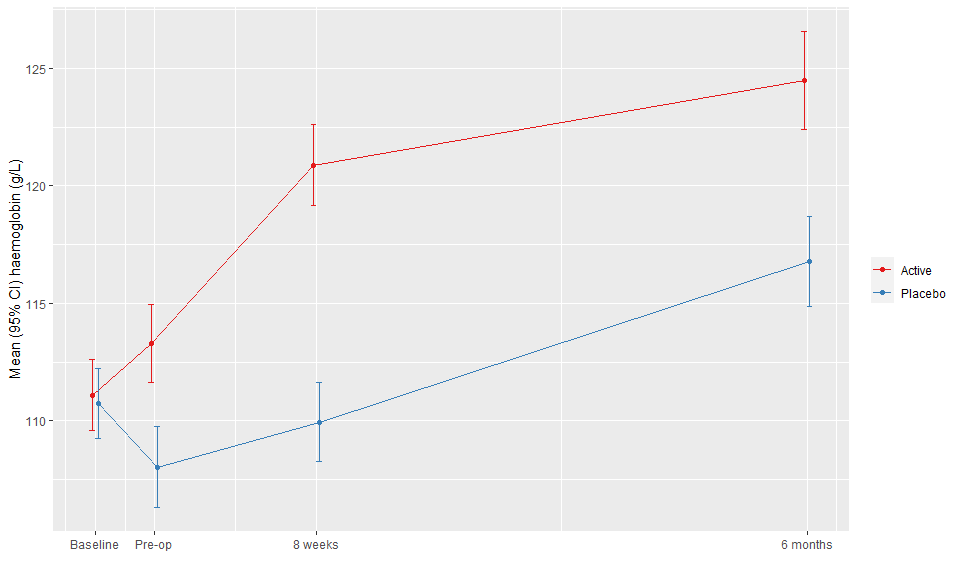
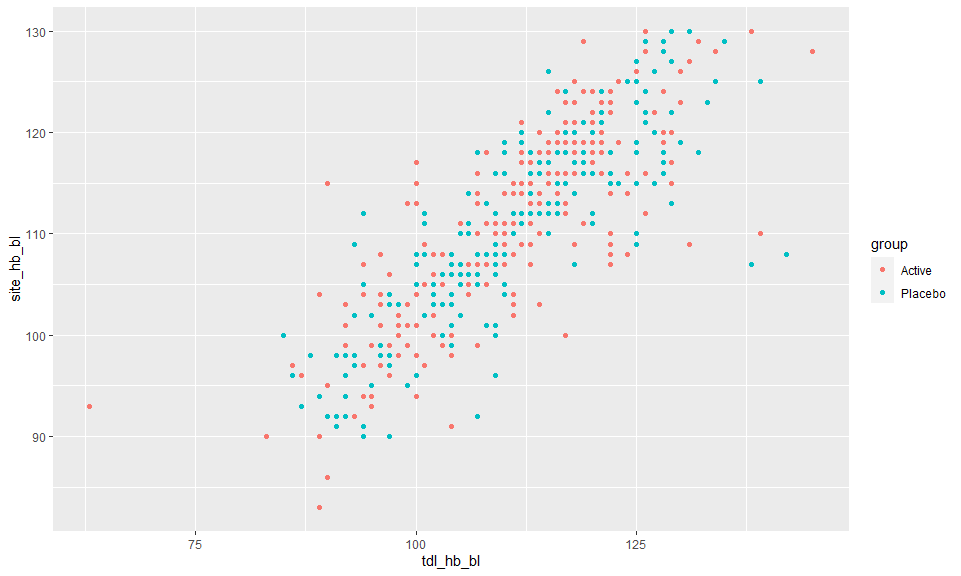

# Administrative

There were 487 patients in the trial dataset, recruited from 41 sites (**NOTE**: the trial paper says 46 sites). 

Patients were randomized between 2014-01-06 and 2018-09-28. 

<!-- -->


6 randomized patients did not receive the treatment under test; while 26 did not undergo surgery. There were 8 withdraws, with 3 of them prior to surgery. (**NOTE**: I don't have information on the type of surgery.)

There were 474 patients in the ITT analysis set. 

There were 393 patients in the per protocol set. (**NOTE**: The paper lists 388). 

# Paper Table 1

<!--html_preserve--><div class="tabwid"><style>.cl-7b363dae{font-family:'Arial';font-size:11px;font-weight:normal;font-style:normal;text-decoration:none;color:rgba(17, 17, 17, 1.00);background-color:transparent;}.cl-7b363daf{margin:0;text-align:left;border-bottom: 0 solid rgba(0, 0, 0, 1.00);border-top: 0 solid rgba(0, 0, 0, 1.00);border-left: 0 solid rgba(0, 0, 0, 1.00);border-right: 0 solid rgba(0, 0, 0, 1.00);padding-bottom:2px;padding-top:2px;padding-left:5px;padding-right:5px;line-height: 1.00;background-color:transparent;}.cl-7b363db0{margin:0;text-align:right;border-bottom: 0 solid rgba(0, 0, 0, 1.00);border-top: 0 solid rgba(0, 0, 0, 1.00);border-left: 0 solid rgba(0, 0, 0, 1.00);border-right: 0 solid rgba(0, 0, 0, 1.00);padding-bottom:2px;padding-top:2px;padding-left:5px;padding-right:5px;line-height: 1.00;background-color:transparent;}.cl-7b368ba6{width:103px;background-color:transparent;vertical-align: middle;border-bottom: 0 solid rgba(0, 0, 0, 1.00);border-top: 0 solid rgba(0, 0, 0, 1.00);border-left: 0 solid rgba(0, 0, 0, 1.00);border-right: 0 solid rgba(0, 0, 0, 1.00);margin-bottom:0;margin-top:0;margin-left:0;margin-right:0;}.cl-7b368ba7{width:100px;background-color:transparent;vertical-align: middle;border-bottom: 0 solid rgba(0, 0, 0, 1.00);border-top: 0 solid rgba(0, 0, 0, 1.00);border-left: 0 solid rgba(0, 0, 0, 1.00);border-right: 0 solid rgba(0, 0, 0, 1.00);margin-bottom:0;margin-top:0;margin-left:0;margin-right:0;}.cl-7b368ba8{width:107px;background-color:transparent;vertical-align: middle;border-bottom: 0 solid rgba(0, 0, 0, 1.00);border-top: 0 solid rgba(0, 0, 0, 1.00);border-left: 0 solid rgba(0, 0, 0, 1.00);border-right: 0 solid rgba(0, 0, 0, 1.00);margin-bottom:0;margin-top:0;margin-left:0;margin-right:0;}.cl-7b368ba9{width:85px;background-color:transparent;vertical-align: middle;border-bottom: 0 solid rgba(0, 0, 0, 1.00);border-top: 0 solid rgba(0, 0, 0, 1.00);border-left: 0 solid rgba(0, 0, 0, 1.00);border-right: 0 solid rgba(0, 0, 0, 1.00);margin-bottom:0;margin-top:0;margin-left:0;margin-right:0;}.cl-7b368baa{width:100px;background-color:transparent;vertical-align: middle;border-bottom: 0 solid rgba(0, 0, 0, 1.00);border-top: 0 solid rgba(0, 0, 0, 1.00);border-left: 0 solid rgba(0, 0, 0, 1.00);border-right: 0 solid rgba(0, 0, 0, 1.00);margin-bottom:0;margin-top:0;margin-left:0;margin-right:0;}.cl-7b368bab{width:100px;background-color:transparent;vertical-align: middle;border-bottom: 0 solid rgba(0, 0, 0, 1.00);border-top: 0 solid rgba(0, 0, 0, 1.00);border-left: 0 solid rgba(0, 0, 0, 1.00);border-right: 0 solid rgba(0, 0, 0, 1.00);margin-bottom:0;margin-top:0;margin-left:0;margin-right:0;}.cl-7b368bac{width:100px;background-color:transparent;vertical-align: middle;border-bottom: 0 solid rgba(0, 0, 0, 1.00);border-top: 0 solid rgba(0, 0, 0, 1.00);border-left: 0 solid rgba(0, 0, 0, 1.00);border-right: 0 solid rgba(0, 0, 0, 1.00);margin-bottom:0;margin-top:0;margin-left:0;margin-right:0;}.cl-7b368bad{width:85px;background-color:transparent;vertical-align: middle;border-bottom: 0 solid rgba(0, 0, 0, 1.00);border-top: 0 solid rgba(0, 0, 0, 1.00);border-left: 0 solid rgba(0, 0, 0, 1.00);border-right: 0 solid rgba(0, 0, 0, 1.00);margin-bottom:0;margin-top:0;margin-left:0;margin-right:0;}.cl-7b368bae{width:103px;background-color:transparent;vertical-align: middle;border-bottom: 0 solid rgba(0, 0, 0, 1.00);border-top: 0 solid rgba(0, 0, 0, 1.00);border-left: 0 solid rgba(0, 0, 0, 1.00);border-right: 0 solid rgba(0, 0, 0, 1.00);margin-bottom:0;margin-top:0;margin-left:0;margin-right:0;}.cl-7b368baf{width:107px;background-color:transparent;vertical-align: middle;border-bottom: 0 solid rgba(0, 0, 0, 1.00);border-top: 0 solid rgba(0, 0, 0, 1.00);border-left: 0 solid rgba(0, 0, 0, 1.00);border-right: 0 solid rgba(0, 0, 0, 1.00);margin-bottom:0;margin-top:0;margin-left:0;margin-right:0;}.cl-7b368bb0{width:103px;background-color:transparent;vertical-align: middle;border-bottom: 0 solid rgba(0, 0, 0, 1.00);border-top: 0 solid rgba(0, 0, 0, 1.00);border-left: 0 solid rgba(0, 0, 0, 1.00);border-right: 0 solid rgba(0, 0, 0, 1.00);margin-bottom:0;margin-top:0;margin-left:0;margin-right:0;}.cl-7b36b324{width:85px;background-color:transparent;vertical-align: middle;border-bottom: 0 solid rgba(0, 0, 0, 1.00);border-top: 0 solid rgba(0, 0, 0, 1.00);border-left: 0 solid rgba(0, 0, 0, 1.00);border-right: 0 solid rgba(0, 0, 0, 1.00);margin-bottom:0;margin-top:0;margin-left:0;margin-right:0;}.cl-7b36b325{width:100px;background-color:transparent;vertical-align: middle;border-bottom: 0 solid rgba(0, 0, 0, 1.00);border-top: 0 solid rgba(0, 0, 0, 1.00);border-left: 0 solid rgba(0, 0, 0, 1.00);border-right: 0 solid rgba(0, 0, 0, 1.00);margin-bottom:0;margin-top:0;margin-left:0;margin-right:0;}.cl-7b36b326{width:107px;background-color:transparent;vertical-align: middle;border-bottom: 0 solid rgba(0, 0, 0, 1.00);border-top: 0 solid rgba(0, 0, 0, 1.00);border-left: 0 solid rgba(0, 0, 0, 1.00);border-right: 0 solid rgba(0, 0, 0, 1.00);margin-bottom:0;margin-top:0;margin-left:0;margin-right:0;}.cl-7b36b327{width:100px;background-color:transparent;vertical-align: middle;border-bottom: 0 solid rgba(0, 0, 0, 1.00);border-top: 0 solid rgba(0, 0, 0, 1.00);border-left: 0 solid rgba(0, 0, 0, 1.00);border-right: 0 solid rgba(0, 0, 0, 1.00);margin-bottom:0;margin-top:0;margin-left:0;margin-right:0;}.cl-7b36b328{width:107px;background-color:transparent;vertical-align: middle;border-bottom: 2.00px solid rgba(0, 0, 0, 1.00);border-top: 0 solid rgba(0, 0, 0, 1.00);border-left: 0 solid rgba(0, 0, 0, 1.00);border-right: 0 solid rgba(0, 0, 0, 1.00);margin-bottom:0;margin-top:0;margin-left:0;margin-right:0;}.cl-7b36b329{width:100px;background-color:transparent;vertical-align: middle;border-bottom: 2.00px solid rgba(0, 0, 0, 1.00);border-top: 0 solid rgba(0, 0, 0, 1.00);border-left: 0 solid rgba(0, 0, 0, 1.00);border-right: 0 solid rgba(0, 0, 0, 1.00);margin-bottom:0;margin-top:0;margin-left:0;margin-right:0;}.cl-7b36b32a{width:100px;background-color:transparent;vertical-align: middle;border-bottom: 2.00px solid rgba(0, 0, 0, 1.00);border-top: 0 solid rgba(0, 0, 0, 1.00);border-left: 0 solid rgba(0, 0, 0, 1.00);border-right: 0 solid rgba(0, 0, 0, 1.00);margin-bottom:0;margin-top:0;margin-left:0;margin-right:0;}.cl-7b36b32b{width:103px;background-color:transparent;vertical-align: middle;border-bottom: 2.00px solid rgba(0, 0, 0, 1.00);border-top: 0 solid rgba(0, 0, 0, 1.00);border-left: 0 solid rgba(0, 0, 0, 1.00);border-right: 0 solid rgba(0, 0, 0, 1.00);margin-bottom:0;margin-top:0;margin-left:0;margin-right:0;}.cl-7b36b32c{width:85px;background-color:transparent;vertical-align: middle;border-bottom: 2.00px solid rgba(0, 0, 0, 1.00);border-top: 0 solid rgba(0, 0, 0, 1.00);border-left: 0 solid rgba(0, 0, 0, 1.00);border-right: 0 solid rgba(0, 0, 0, 1.00);margin-bottom:0;margin-top:0;margin-left:0;margin-right:0;}.cl-7b36b32d{width:100px;background-color:transparent;vertical-align: middle;border-bottom: 0 solid rgba(0, 0, 0, 1.00);border-top: 0 solid rgba(0, 0, 0, 1.00);border-left: 0 solid rgba(0, 0, 0, 1.00);border-right: 0 solid rgba(0, 0, 0, 1.00);margin-bottom:0;margin-top:0;margin-left:0;margin-right:0;}.cl-7b36b32e{width:103px;background-color:transparent;vertical-align: middle;border-bottom: 0 solid rgba(0, 0, 0, 1.00);border-top: 0 solid rgba(0, 0, 0, 1.00);border-left: 0 solid rgba(0, 0, 0, 1.00);border-right: 0 solid rgba(0, 0, 0, 1.00);margin-bottom:0;margin-top:0;margin-left:0;margin-right:0;}.cl-7b36d9b2{width:100px;background-color:transparent;vertical-align: middle;border-bottom: 0 solid rgba(0, 0, 0, 1.00);border-top: 0 solid rgba(0, 0, 0, 1.00);border-left: 0 solid rgba(0, 0, 0, 1.00);border-right: 0 solid rgba(0, 0, 0, 1.00);margin-bottom:0;margin-top:0;margin-left:0;margin-right:0;}.cl-7b36d9b3{width:85px;background-color:transparent;vertical-align: middle;border-bottom: 0 solid rgba(0, 0, 0, 1.00);border-top: 0 solid rgba(0, 0, 0, 1.00);border-left: 0 solid rgba(0, 0, 0, 1.00);border-right: 0 solid rgba(0, 0, 0, 1.00);margin-bottom:0;margin-top:0;margin-left:0;margin-right:0;}.cl-7b36d9b4{width:107px;background-color:transparent;vertical-align: middle;border-bottom: 0 solid rgba(0, 0, 0, 1.00);border-top: 0 solid rgba(0, 0, 0, 1.00);border-left: 0 solid rgba(0, 0, 0, 1.00);border-right: 0 solid rgba(0, 0, 0, 1.00);margin-bottom:0;margin-top:0;margin-left:0;margin-right:0;}.cl-7b36d9b5{width:103px;background-color:transparent;vertical-align: middle;border-bottom: 0 solid rgba(0, 0, 0, 1.00);border-top: 0 solid rgba(0, 0, 0, 1.00);border-left: 0 solid rgba(0, 0, 0, 1.00);border-right: 0 solid rgba(0, 0, 0, 1.00);margin-bottom:0;margin-top:0;margin-left:0;margin-right:0;}.cl-7b36d9b6{width:85px;background-color:transparent;vertical-align: middle;border-bottom: 0 solid rgba(0, 0, 0, 1.00);border-top: 0 solid rgba(0, 0, 0, 1.00);border-left: 0 solid rgba(0, 0, 0, 1.00);border-right: 0 solid rgba(0, 0, 0, 1.00);margin-bottom:0;margin-top:0;margin-left:0;margin-right:0;}.cl-7b36d9b7{width:107px;background-color:transparent;vertical-align: middle;border-bottom: 0 solid rgba(0, 0, 0, 1.00);border-top: 0 solid rgba(0, 0, 0, 1.00);border-left: 0 solid rgba(0, 0, 0, 1.00);border-right: 0 solid rgba(0, 0, 0, 1.00);margin-bottom:0;margin-top:0;margin-left:0;margin-right:0;}.cl-7b36d9b8{width:100px;background-color:transparent;vertical-align: middle;border-bottom: 0 solid rgba(0, 0, 0, 1.00);border-top: 0 solid rgba(0, 0, 0, 1.00);border-left: 0 solid rgba(0, 0, 0, 1.00);border-right: 0 solid rgba(0, 0, 0, 1.00);margin-bottom:0;margin-top:0;margin-left:0;margin-right:0;}.cl-7b36d9b9{width:100px;background-color:transparent;vertical-align: middle;border-bottom: 0 solid rgba(0, 0, 0, 1.00);border-top: 0 solid rgba(0, 0, 0, 1.00);border-left: 0 solid rgba(0, 0, 0, 1.00);border-right: 0 solid rgba(0, 0, 0, 1.00);margin-bottom:0;margin-top:0;margin-left:0;margin-right:0;}.cl-7b36d9ba{width:103px;background-color:transparent;vertical-align: middle;border-bottom: 0 solid rgba(0, 0, 0, 1.00);border-top: 0 solid rgba(0, 0, 0, 1.00);border-left: 0 solid rgba(0, 0, 0, 1.00);border-right: 0 solid rgba(0, 0, 0, 1.00);margin-bottom:0;margin-top:0;margin-left:0;margin-right:0;}.cl-7b36d9bb{width:100px;background-color:transparent;vertical-align: middle;border-bottom: 0 solid rgba(0, 0, 0, 1.00);border-top: 0 solid rgba(0, 0, 0, 1.00);border-left: 0 solid rgba(0, 0, 0, 1.00);border-right: 0 solid rgba(0, 0, 0, 1.00);margin-bottom:0;margin-top:0;margin-left:0;margin-right:0;}.cl-7b36d9bc{width:107px;background-color:transparent;vertical-align: middle;border-bottom: 0 solid rgba(0, 0, 0, 1.00);border-top: 0 solid rgba(0, 0, 0, 1.00);border-left: 0 solid rgba(0, 0, 0, 1.00);border-right: 0 solid rgba(0, 0, 0, 1.00);margin-bottom:0;margin-top:0;margin-left:0;margin-right:0;}.cl-7b370090{width:100px;background-color:transparent;vertical-align: middle;border-bottom: 0 solid rgba(0, 0, 0, 1.00);border-top: 0 solid rgba(0, 0, 0, 1.00);border-left: 0 solid rgba(0, 0, 0, 1.00);border-right: 0 solid rgba(0, 0, 0, 1.00);margin-bottom:0;margin-top:0;margin-left:0;margin-right:0;}.cl-7b370091{width:85px;background-color:transparent;vertical-align: middle;border-bottom: 0 solid rgba(0, 0, 0, 1.00);border-top: 0 solid rgba(0, 0, 0, 1.00);border-left: 0 solid rgba(0, 0, 0, 1.00);border-right: 0 solid rgba(0, 0, 0, 1.00);margin-bottom:0;margin-top:0;margin-left:0;margin-right:0;}.cl-7b370092{width:107px;background-color:transparent;vertical-align: middle;border-bottom: 0 solid rgba(0, 0, 0, 1.00);border-top: 0 solid rgba(0, 0, 0, 1.00);border-left: 0 solid rgba(0, 0, 0, 1.00);border-right: 0 solid rgba(0, 0, 0, 1.00);margin-bottom:0;margin-top:0;margin-left:0;margin-right:0;}.cl-7b370093{width:85px;background-color:transparent;vertical-align: middle;border-bottom: 0 solid rgba(0, 0, 0, 1.00);border-top: 0 solid rgba(0, 0, 0, 1.00);border-left: 0 solid rgba(0, 0, 0, 1.00);border-right: 0 solid rgba(0, 0, 0, 1.00);margin-bottom:0;margin-top:0;margin-left:0;margin-right:0;}.cl-7b370094{width:100px;background-color:transparent;vertical-align: middle;border-bottom: 0 solid rgba(0, 0, 0, 1.00);border-top: 0 solid rgba(0, 0, 0, 1.00);border-left: 0 solid rgba(0, 0, 0, 1.00);border-right: 0 solid rgba(0, 0, 0, 1.00);margin-bottom:0;margin-top:0;margin-left:0;margin-right:0;}.cl-7b370095{width:100px;background-color:transparent;vertical-align: middle;border-bottom: 0 solid rgba(0, 0, 0, 1.00);border-top: 0 solid rgba(0, 0, 0, 1.00);border-left: 0 solid rgba(0, 0, 0, 1.00);border-right: 0 solid rgba(0, 0, 0, 1.00);margin-bottom:0;margin-top:0;margin-left:0;margin-right:0;}.cl-7b370096{width:103px;background-color:transparent;vertical-align: middle;border-bottom: 0 solid rgba(0, 0, 0, 1.00);border-top: 0 solid rgba(0, 0, 0, 1.00);border-left: 0 solid rgba(0, 0, 0, 1.00);border-right: 0 solid rgba(0, 0, 0, 1.00);margin-bottom:0;margin-top:0;margin-left:0;margin-right:0;}.cl-7b370097{width:100px;background-color:transparent;vertical-align: middle;border-bottom: 0 solid rgba(0, 0, 0, 1.00);border-top: 0 solid rgba(0, 0, 0, 1.00);border-left: 0 solid rgba(0, 0, 0, 1.00);border-right: 0 solid rgba(0, 0, 0, 1.00);margin-bottom:0;margin-top:0;margin-left:0;margin-right:0;}.cl-7b370098{width:103px;background-color:transparent;vertical-align: middle;border-bottom: 0 solid rgba(0, 0, 0, 1.00);border-top: 0 solid rgba(0, 0, 0, 1.00);border-left: 0 solid rgba(0, 0, 0, 1.00);border-right: 0 solid rgba(0, 0, 0, 1.00);margin-bottom:0;margin-top:0;margin-left:0;margin-right:0;}.cl-7b370099{width:85px;background-color:transparent;vertical-align: middle;border-bottom: 0 solid rgba(0, 0, 0, 1.00);border-top: 0 solid rgba(0, 0, 0, 1.00);border-left: 0 solid rgba(0, 0, 0, 1.00);border-right: 0 solid rgba(0, 0, 0, 1.00);margin-bottom:0;margin-top:0;margin-left:0;margin-right:0;}.cl-7b37009a{width:107px;background-color:transparent;vertical-align: middle;border-bottom: 0 solid rgba(0, 0, 0, 1.00);border-top: 0 solid rgba(0, 0, 0, 1.00);border-left: 0 solid rgba(0, 0, 0, 1.00);border-right: 0 solid rgba(0, 0, 0, 1.00);margin-bottom:0;margin-top:0;margin-left:0;margin-right:0;}.cl-7b372778{width:100px;background-color:transparent;vertical-align: middle;border-bottom: 0 solid rgba(0, 0, 0, 1.00);border-top: 0 solid rgba(0, 0, 0, 1.00);border-left: 0 solid rgba(0, 0, 0, 1.00);border-right: 0 solid rgba(0, 0, 0, 1.00);margin-bottom:0;margin-top:0;margin-left:0;margin-right:0;}.cl-7b372779{width:85px;background-color:transparent;vertical-align: middle;border-bottom: 2.00px solid rgba(0, 0, 0, 1.00);border-top: 2.00px solid rgba(0, 0, 0, 1.00);border-left: 0 solid rgba(0, 0, 0, 1.00);border-right: 0 solid rgba(0, 0, 0, 1.00);margin-bottom:0;margin-top:0;margin-left:0;margin-right:0;}.cl-7b37277a{width:107px;background-color:transparent;vertical-align: middle;border-bottom: 2.00px solid rgba(0, 0, 0, 1.00);border-top: 2.00px solid rgba(0, 0, 0, 1.00);border-left: 0 solid rgba(0, 0, 0, 1.00);border-right: 0 solid rgba(0, 0, 0, 1.00);margin-bottom:0;margin-top:0;margin-left:0;margin-right:0;}.cl-7b37277b{width:103px;background-color:transparent;vertical-align: middle;border-bottom: 2.00px solid rgba(0, 0, 0, 1.00);border-top: 2.00px solid rgba(0, 0, 0, 1.00);border-left: 0 solid rgba(0, 0, 0, 1.00);border-right: 0 solid rgba(0, 0, 0, 1.00);margin-bottom:0;margin-top:0;margin-left:0;margin-right:0;}.cl-7b37277c{width:100px;background-color:transparent;vertical-align: middle;border-bottom: 2.00px solid rgba(0, 0, 0, 1.00);border-top: 2.00px solid rgba(0, 0, 0, 1.00);border-left: 0 solid rgba(0, 0, 0, 1.00);border-right: 0 solid rgba(0, 0, 0, 1.00);margin-bottom:0;margin-top:0;margin-left:0;margin-right:0;}.cl-7b37277d{width:100px;background-color:transparent;vertical-align: middle;border-bottom: 2.00px solid rgba(0, 0, 0, 1.00);border-top: 2.00px solid rgba(0, 0, 0, 1.00);border-left: 0 solid rgba(0, 0, 0, 1.00);border-right: 0 solid rgba(0, 0, 0, 1.00);margin-bottom:0;margin-top:0;margin-left:0;margin-right:0;}</style><table style='border-collapse:collapse;'><thead><tr style="overflow-wrap:break-word;"><td class="cl-7b37277a"><p class="cl-7b363daf"><span class="cl-7b363dae">Variable</span></p></td><td class="cl-7b372779"><p class="cl-7b363db0"><span class="cl-7b363dae">Observations</span></p></td><td class="cl-7b37277c"><p class="cl-7b363daf"><span class="cl-7b363dae">Total (n = 487)</span></p></td><td class="cl-7b37277b"><p class="cl-7b363daf"><span class="cl-7b363dae">Control (n = 243)</span></p></td><td class="cl-7b37277d"><p class="cl-7b363daf"><span class="cl-7b363dae">Active (n = 244)</span></p></td></tr></thead><tbody><tr style="overflow-wrap:break-word;"><td class="cl-7b368ba8"><p class="cl-7b363daf"><span class="cl-7b363dae">age</span></p></td><td class="cl-7b368ba9"><p class="cl-7b363db0"><span class="cl-7b363dae">487</span></p></td><td class="cl-7b368baa"><p class="cl-7b363daf"><span class="cl-7b363dae">65.8 [53.7, 72.2]</span></p></td><td class="cl-7b368ba6"><p class="cl-7b363daf"><span class="cl-7b363dae">64.6 [50.4, 72.3]</span></p></td><td class="cl-7b368ba7"><p class="cl-7b363daf"><span class="cl-7b363dae">66.5 [56.6, 72.2]</span></p></td></tr><tr style="overflow-wrap:break-word;"><td class="cl-7b36b326"><p class="cl-7b363daf"><span class="cl-7b363dae">gender</span></p></td><td class="cl-7b36b324"><p class="cl-7b363db0"><span class="cl-7b363dae">487</span></p></td><td class="cl-7b36b327"><p class="cl-7b363daf"><span class="cl-7b363dae"></span></p></td><td class="cl-7b368bb0"><p class="cl-7b363daf"><span class="cl-7b363dae"></span></p></td><td class="cl-7b36b325"><p class="cl-7b363daf"><span class="cl-7b363dae"></span></p></td></tr><tr style="overflow-wrap:break-word;"><td class="cl-7b368baf"><p class="cl-7b363daf"><span class="cl-7b363dae">Female</span></p></td><td class="cl-7b368bad"><p class="cl-7b363db0"><span class="cl-7b363dae">NA</span></p></td><td class="cl-7b368bac"><p class="cl-7b363daf"><span class="cl-7b363dae">267 (54.8%)</span></p></td><td class="cl-7b368bae"><p class="cl-7b363daf"><span class="cl-7b363dae">142 (58.4%)</span></p></td><td class="cl-7b368bab"><p class="cl-7b363daf"><span class="cl-7b363dae">125 (51.2%)</span></p></td></tr><tr style="overflow-wrap:break-word;"><td class="cl-7b368baf"><p class="cl-7b363daf"><span class="cl-7b363dae">Male</span></p></td><td class="cl-7b368bad"><p class="cl-7b363db0"><span class="cl-7b363dae">NA</span></p></td><td class="cl-7b368bac"><p class="cl-7b363daf"><span class="cl-7b363dae">220 (45.2%)</span></p></td><td class="cl-7b368bae"><p class="cl-7b363daf"><span class="cl-7b363dae">101 (41.6%)</span></p></td><td class="cl-7b368bab"><p class="cl-7b363daf"><span class="cl-7b363dae">119 (48.8%)</span></p></td></tr><tr style="overflow-wrap:break-word;"><td class="cl-7b36b326"><p class="cl-7b363daf"><span class="cl-7b363dae">ethnicity</span></p></td><td class="cl-7b36b324"><p class="cl-7b363db0"><span class="cl-7b363dae">487</span></p></td><td class="cl-7b36b327"><p class="cl-7b363daf"><span class="cl-7b363dae"></span></p></td><td class="cl-7b368bb0"><p class="cl-7b363daf"><span class="cl-7b363dae"></span></p></td><td class="cl-7b36b325"><p class="cl-7b363daf"><span class="cl-7b363dae"></span></p></td></tr><tr style="overflow-wrap:break-word;"><td class="cl-7b368baf"><p class="cl-7b363daf"><span class="cl-7b363dae">Caucasian</span></p></td><td class="cl-7b368bad"><p class="cl-7b363db0"><span class="cl-7b363dae">NA</span></p></td><td class="cl-7b368bac"><p class="cl-7b363daf"><span class="cl-7b363dae">428 (87.9%)</span></p></td><td class="cl-7b368bae"><p class="cl-7b363daf"><span class="cl-7b363dae">217 (89.3%)</span></p></td><td class="cl-7b368bab"><p class="cl-7b363daf"><span class="cl-7b363dae">211 (86.5%)</span></p></td></tr><tr style="overflow-wrap:break-word;"><td class="cl-7b368baf"><p class="cl-7b363daf"><span class="cl-7b363dae">Afro-Caribbean</span></p></td><td class="cl-7b368bad"><p class="cl-7b363db0"><span class="cl-7b363dae">NA</span></p></td><td class="cl-7b368bac"><p class="cl-7b363daf"><span class="cl-7b363dae">33 (6.8%)</span></p></td><td class="cl-7b368bae"><p class="cl-7b363daf"><span class="cl-7b363dae">19 (7.8%)</span></p></td><td class="cl-7b368bab"><p class="cl-7b363daf"><span class="cl-7b363dae">14 (5.7%)</span></p></td></tr><tr style="overflow-wrap:break-word;"><td class="cl-7b368baf"><p class="cl-7b363daf"><span class="cl-7b363dae">Asian</span></p></td><td class="cl-7b368bad"><p class="cl-7b363db0"><span class="cl-7b363dae">NA</span></p></td><td class="cl-7b368bac"><p class="cl-7b363daf"><span class="cl-7b363dae">24 (4.9%)</span></p></td><td class="cl-7b368bae"><p class="cl-7b363daf"><span class="cl-7b363dae">6 (2.5%)</span></p></td><td class="cl-7b368bab"><p class="cl-7b363daf"><span class="cl-7b363dae">18 (7.4%)</span></p></td></tr><tr style="overflow-wrap:break-word;"><td class="cl-7b368baf"><p class="cl-7b363daf"><span class="cl-7b363dae">Other</span></p></td><td class="cl-7b368bad"><p class="cl-7b363db0"><span class="cl-7b363dae">NA</span></p></td><td class="cl-7b368bac"><p class="cl-7b363daf"><span class="cl-7b363dae">2 (0.4%)</span></p></td><td class="cl-7b368bae"><p class="cl-7b363daf"><span class="cl-7b363dae">1 (0.4%)</span></p></td><td class="cl-7b368bab"><p class="cl-7b363daf"><span class="cl-7b363dae">1 (0.4%)</span></p></td></tr><tr style="overflow-wrap:break-word;"><td class="cl-7b368ba8"><p class="cl-7b363daf"><span class="cl-7b363dae">tdl_hb_bl</span></p></td><td class="cl-7b368ba9"><p class="cl-7b363db0"><span class="cl-7b363dae">472</span></p></td><td class="cl-7b368baa"><p class="cl-7b363daf"><span class="cl-7b363dae">111 [103, 119.2]</span></p></td><td class="cl-7b368ba6"><p class="cl-7b363daf"><span class="cl-7b363dae">110 [104, 119]</span></p></td><td class="cl-7b368ba7"><p class="cl-7b363daf"><span class="cl-7b363dae">112 [102, 120]</span></p></td></tr><tr style="overflow-wrap:break-word;"><td class="cl-7b36d9b4"><p class="cl-7b363daf"><span class="cl-7b363dae">tdl_hb_bl_cat</span></p></td><td class="cl-7b36d9b3"><p class="cl-7b363db0"><span class="cl-7b363dae">472</span></p></td><td class="cl-7b36d9b2"><p class="cl-7b363daf"><span class="cl-7b363dae"></span></p></td><td class="cl-7b36b32e"><p class="cl-7b363daf"><span class="cl-7b363dae"></span></p></td><td class="cl-7b36b32d"><p class="cl-7b363daf"><span class="cl-7b363dae"></span></p></td></tr><tr style="overflow-wrap:break-word;"><td class="cl-7b368baf"><p class="cl-7b363daf"><span class="cl-7b363dae">&lt;90</span></p></td><td class="cl-7b368bad"><p class="cl-7b363db0"><span class="cl-7b363dae">NA</span></p></td><td class="cl-7b368bac"><p class="cl-7b363daf"><span class="cl-7b363dae">13 (2.8%)</span></p></td><td class="cl-7b368bae"><p class="cl-7b363daf"><span class="cl-7b363dae">6 (2.6%)</span></p></td><td class="cl-7b368bab"><p class="cl-7b363daf"><span class="cl-7b363dae">7 (2.9%)</span></p></td></tr><tr style="overflow-wrap:break-word;"><td class="cl-7b368baf"><p class="cl-7b363daf"><span class="cl-7b363dae">90-99</span></p></td><td class="cl-7b368bad"><p class="cl-7b363db0"><span class="cl-7b363dae">NA</span></p></td><td class="cl-7b368bac"><p class="cl-7b363daf"><span class="cl-7b363dae">71 (15%)</span></p></td><td class="cl-7b368bae"><p class="cl-7b363daf"><span class="cl-7b363dae">36 (15.4%)</span></p></td><td class="cl-7b368bab"><p class="cl-7b363daf"><span class="cl-7b363dae">35 (14.7%)</span></p></td></tr><tr style="overflow-wrap:break-word;"><td class="cl-7b368baf"><p class="cl-7b363daf"><span class="cl-7b363dae">100-109</span></p></td><td class="cl-7b368bad"><p class="cl-7b363db0"><span class="cl-7b363dae">NA</span></p></td><td class="cl-7b368bac"><p class="cl-7b363daf"><span class="cl-7b363dae">119 (25.2%)</span></p></td><td class="cl-7b368bae"><p class="cl-7b363daf"><span class="cl-7b363dae">64 (27.4%)</span></p></td><td class="cl-7b368bab"><p class="cl-7b363daf"><span class="cl-7b363dae">55 (23.1%)</span></p></td></tr><tr style="overflow-wrap:break-word;"><td class="cl-7b368baf"><p class="cl-7b363daf"><span class="cl-7b363dae">110-119</span></p></td><td class="cl-7b368bad"><p class="cl-7b363db0"><span class="cl-7b363dae">NA</span></p></td><td class="cl-7b368bac"><p class="cl-7b363daf"><span class="cl-7b363dae">151 (32%)</span></p></td><td class="cl-7b368bae"><p class="cl-7b363daf"><span class="cl-7b363dae">71 (30.3%)</span></p></td><td class="cl-7b368bab"><p class="cl-7b363daf"><span class="cl-7b363dae">80 (33.6%)</span></p></td></tr><tr style="overflow-wrap:break-word;"><td class="cl-7b368baf"><p class="cl-7b363daf"><span class="cl-7b363dae">&gt;= 120</span></p></td><td class="cl-7b368bad"><p class="cl-7b363db0"><span class="cl-7b363dae">NA</span></p></td><td class="cl-7b368bac"><p class="cl-7b363daf"><span class="cl-7b363dae">118 (25%)</span></p></td><td class="cl-7b368bae"><p class="cl-7b363daf"><span class="cl-7b363dae">57 (24.4%)</span></p></td><td class="cl-7b368bab"><p class="cl-7b363daf"><span class="cl-7b363dae">61 (25.6%)</span></p></td></tr><tr style="overflow-wrap:break-word;"><td class="cl-7b36b326"><p class="cl-7b363daf"><span class="cl-7b363dae">asa_grade</span></p></td><td class="cl-7b36b324"><p class="cl-7b363db0"><span class="cl-7b363dae">472</span></p></td><td class="cl-7b36b327"><p class="cl-7b363daf"><span class="cl-7b363dae"></span></p></td><td class="cl-7b368bb0"><p class="cl-7b363daf"><span class="cl-7b363dae"></span></p></td><td class="cl-7b36b325"><p class="cl-7b363daf"><span class="cl-7b363dae"></span></p></td></tr><tr style="overflow-wrap:break-word;"><td class="cl-7b368baf"><p class="cl-7b363daf"><span class="cl-7b363dae">I</span></p></td><td class="cl-7b368bad"><p class="cl-7b363db0"><span class="cl-7b363dae">NA</span></p></td><td class="cl-7b368bac"><p class="cl-7b363daf"><span class="cl-7b363dae">61 (12.9%)</span></p></td><td class="cl-7b368bae"><p class="cl-7b363daf"><span class="cl-7b363dae">31 (13%)</span></p></td><td class="cl-7b368bab"><p class="cl-7b363daf"><span class="cl-7b363dae">30 (12.8%)</span></p></td></tr><tr style="overflow-wrap:break-word;"><td class="cl-7b368baf"><p class="cl-7b363daf"><span class="cl-7b363dae">II</span></p></td><td class="cl-7b368bad"><p class="cl-7b363db0"><span class="cl-7b363dae">NA</span></p></td><td class="cl-7b368bac"><p class="cl-7b363daf"><span class="cl-7b363dae">288 (61%)</span></p></td><td class="cl-7b368bae"><p class="cl-7b363daf"><span class="cl-7b363dae">141 (59.2%)</span></p></td><td class="cl-7b368bab"><p class="cl-7b363daf"><span class="cl-7b363dae">147 (62.8%)</span></p></td></tr><tr style="overflow-wrap:break-word;"><td class="cl-7b368baf"><p class="cl-7b363daf"><span class="cl-7b363dae">III</span></p></td><td class="cl-7b368bad"><p class="cl-7b363db0"><span class="cl-7b363dae">NA</span></p></td><td class="cl-7b368bac"><p class="cl-7b363daf"><span class="cl-7b363dae">121 (25.6%)</span></p></td><td class="cl-7b368bae"><p class="cl-7b363daf"><span class="cl-7b363dae">65 (27.3%)</span></p></td><td class="cl-7b368bab"><p class="cl-7b363daf"><span class="cl-7b363dae">56 (23.9%)</span></p></td></tr><tr style="overflow-wrap:break-word;"><td class="cl-7b368baf"><p class="cl-7b363daf"><span class="cl-7b363dae">IV</span></p></td><td class="cl-7b368bad"><p class="cl-7b363db0"><span class="cl-7b363dae">NA</span></p></td><td class="cl-7b368bac"><p class="cl-7b363daf"><span class="cl-7b363dae">2 (0.4%)</span></p></td><td class="cl-7b368bae"><p class="cl-7b363daf"><span class="cl-7b363dae">1 (0.4%)</span></p></td><td class="cl-7b368bab"><p class="cl-7b363daf"><span class="cl-7b363dae">1 (0.4%)</span></p></td></tr><tr style="overflow-wrap:break-word;"><td class="cl-7b368baf"><p class="cl-7b363daf"><span class="cl-7b363dae">V</span></p></td><td class="cl-7b368bad"><p class="cl-7b363db0"><span class="cl-7b363dae">NA</span></p></td><td class="cl-7b368bac"><p class="cl-7b363daf"><span class="cl-7b363dae">0 (0%)</span></p></td><td class="cl-7b368bae"><p class="cl-7b363daf"><span class="cl-7b363dae">0 (0%)</span></p></td><td class="cl-7b368bab"><p class="cl-7b363daf"><span class="cl-7b363dae">0 (0%)</span></p></td></tr><tr style="overflow-wrap:break-word;"><td class="cl-7b36b326"><p class="cl-7b363daf"><span class="cl-7b363dae">angina_chestpain</span></p></td><td class="cl-7b36b324"><p class="cl-7b363db0"><span class="cl-7b363dae">487</span></p></td><td class="cl-7b36b327"><p class="cl-7b363daf"><span class="cl-7b363dae"></span></p></td><td class="cl-7b368bb0"><p class="cl-7b363daf"><span class="cl-7b363dae"></span></p></td><td class="cl-7b36b325"><p class="cl-7b363daf"><span class="cl-7b363dae"></span></p></td></tr><tr style="overflow-wrap:break-word;"><td class="cl-7b368baf"><p class="cl-7b363daf"><span class="cl-7b363dae">No</span></p></td><td class="cl-7b368bad"><p class="cl-7b363db0"><span class="cl-7b363dae">NA</span></p></td><td class="cl-7b368bac"><p class="cl-7b363daf"><span class="cl-7b363dae">456 (93.6%)</span></p></td><td class="cl-7b368bae"><p class="cl-7b363daf"><span class="cl-7b363dae">227 (93.4%)</span></p></td><td class="cl-7b368bab"><p class="cl-7b363daf"><span class="cl-7b363dae">229 (93.9%)</span></p></td></tr><tr style="overflow-wrap:break-word;"><td class="cl-7b368baf"><p class="cl-7b363daf"><span class="cl-7b363dae">Yes</span></p></td><td class="cl-7b368bad"><p class="cl-7b363db0"><span class="cl-7b363dae">NA</span></p></td><td class="cl-7b368bac"><p class="cl-7b363daf"><span class="cl-7b363dae">31 (6.4%)</span></p></td><td class="cl-7b368bae"><p class="cl-7b363daf"><span class="cl-7b363dae">16 (6.6%)</span></p></td><td class="cl-7b368bab"><p class="cl-7b363daf"><span class="cl-7b363dae">15 (6.1%)</span></p></td></tr><tr style="overflow-wrap:break-word;"><td class="cl-7b36b326"><p class="cl-7b363daf"><span class="cl-7b363dae">bleeding</span></p></td><td class="cl-7b36b324"><p class="cl-7b363db0"><span class="cl-7b363dae">487</span></p></td><td class="cl-7b36b327"><p class="cl-7b363daf"><span class="cl-7b363dae"></span></p></td><td class="cl-7b368bb0"><p class="cl-7b363daf"><span class="cl-7b363dae"></span></p></td><td class="cl-7b36b325"><p class="cl-7b363daf"><span class="cl-7b363dae"></span></p></td></tr><tr style="overflow-wrap:break-word;"><td class="cl-7b368baf"><p class="cl-7b363daf"><span class="cl-7b363dae">No</span></p></td><td class="cl-7b368bad"><p class="cl-7b363db0"><span class="cl-7b363dae">NA</span></p></td><td class="cl-7b368bac"><p class="cl-7b363daf"><span class="cl-7b363dae">469 (96.3%)</span></p></td><td class="cl-7b368bae"><p class="cl-7b363daf"><span class="cl-7b363dae">236 (97.1%)</span></p></td><td class="cl-7b368bab"><p class="cl-7b363daf"><span class="cl-7b363dae">233 (95.5%)</span></p></td></tr><tr style="overflow-wrap:break-word;"><td class="cl-7b368baf"><p class="cl-7b363daf"><span class="cl-7b363dae">Yes</span></p></td><td class="cl-7b368bad"><p class="cl-7b363db0"><span class="cl-7b363dae">NA</span></p></td><td class="cl-7b368bac"><p class="cl-7b363daf"><span class="cl-7b363dae">18 (3.7%)</span></p></td><td class="cl-7b368bae"><p class="cl-7b363daf"><span class="cl-7b363dae">7 (2.9%)</span></p></td><td class="cl-7b368bab"><p class="cl-7b363daf"><span class="cl-7b363dae">11 (4.5%)</span></p></td></tr><tr style="overflow-wrap:break-word;"><td class="cl-7b36d9b7"><p class="cl-7b363daf"><span class="cl-7b363dae">breathless</span></p></td><td class="cl-7b36d9b6"><p class="cl-7b363db0"><span class="cl-7b363dae">487</span></p></td><td class="cl-7b36d9b9"><p class="cl-7b363daf"><span class="cl-7b363dae"></span></p></td><td class="cl-7b36d9b5"><p class="cl-7b363daf"><span class="cl-7b363dae"></span></p></td><td class="cl-7b36d9b8"><p class="cl-7b363daf"><span class="cl-7b363dae"></span></p></td></tr><tr style="overflow-wrap:break-word;"><td class="cl-7b368baf"><p class="cl-7b363daf"><span class="cl-7b363dae">No</span></p></td><td class="cl-7b368bad"><p class="cl-7b363db0"><span class="cl-7b363dae">NA</span></p></td><td class="cl-7b368bac"><p class="cl-7b363daf"><span class="cl-7b363dae">434 (89.1%)</span></p></td><td class="cl-7b368bae"><p class="cl-7b363daf"><span class="cl-7b363dae">215 (88.5%)</span></p></td><td class="cl-7b368bab"><p class="cl-7b363daf"><span class="cl-7b363dae">219 (89.8%)</span></p></td></tr><tr style="overflow-wrap:break-word;"><td class="cl-7b368baf"><p class="cl-7b363daf"><span class="cl-7b363dae">Yes</span></p></td><td class="cl-7b368bad"><p class="cl-7b363db0"><span class="cl-7b363dae">NA</span></p></td><td class="cl-7b368bac"><p class="cl-7b363daf"><span class="cl-7b363dae">53 (10.9%)</span></p></td><td class="cl-7b368bae"><p class="cl-7b363daf"><span class="cl-7b363dae">28 (11.5%)</span></p></td><td class="cl-7b368bab"><p class="cl-7b363daf"><span class="cl-7b363dae">25 (10.2%)</span></p></td></tr><tr style="overflow-wrap:break-word;"><td class="cl-7b36d9b4"><p class="cl-7b363daf"><span class="cl-7b363dae">coeliac_dis</span></p></td><td class="cl-7b36d9b3"><p class="cl-7b363db0"><span class="cl-7b363dae">487</span></p></td><td class="cl-7b36d9b2"><p class="cl-7b363daf"><span class="cl-7b363dae"></span></p></td><td class="cl-7b36b32e"><p class="cl-7b363daf"><span class="cl-7b363dae"></span></p></td><td class="cl-7b36b32d"><p class="cl-7b363daf"><span class="cl-7b363dae"></span></p></td></tr><tr style="overflow-wrap:break-word;"><td class="cl-7b368baf"><p class="cl-7b363daf"><span class="cl-7b363dae">No</span></p></td><td class="cl-7b368bad"><p class="cl-7b363db0"><span class="cl-7b363dae">NA</span></p></td><td class="cl-7b368bac"><p class="cl-7b363daf"><span class="cl-7b363dae">485 (99.6%)</span></p></td><td class="cl-7b368bae"><p class="cl-7b363daf"><span class="cl-7b363dae">241 (99.2%)</span></p></td><td class="cl-7b368bab"><p class="cl-7b363daf"><span class="cl-7b363dae">244 (100%)</span></p></td></tr><tr style="overflow-wrap:break-word;"><td class="cl-7b368baf"><p class="cl-7b363daf"><span class="cl-7b363dae">Yes</span></p></td><td class="cl-7b368bad"><p class="cl-7b363db0"><span class="cl-7b363dae">NA</span></p></td><td class="cl-7b368bac"><p class="cl-7b363daf"><span class="cl-7b363dae">2 (0.4%)</span></p></td><td class="cl-7b368bae"><p class="cl-7b363daf"><span class="cl-7b363dae">2 (0.8%)</span></p></td><td class="cl-7b368bab"><p class="cl-7b363daf"><span class="cl-7b363dae">0 (0%)</span></p></td></tr><tr style="overflow-wrap:break-word;"><td class="cl-7b36d9b4"><p class="cl-7b363daf"><span class="cl-7b363dae">copd_bron_asth</span></p></td><td class="cl-7b36d9b3"><p class="cl-7b363db0"><span class="cl-7b363dae">487</span></p></td><td class="cl-7b36d9b2"><p class="cl-7b363daf"><span class="cl-7b363dae"></span></p></td><td class="cl-7b36b32e"><p class="cl-7b363daf"><span class="cl-7b363dae"></span></p></td><td class="cl-7b36b32d"><p class="cl-7b363daf"><span class="cl-7b363dae"></span></p></td></tr><tr style="overflow-wrap:break-word;"><td class="cl-7b368baf"><p class="cl-7b363daf"><span class="cl-7b363dae">No</span></p></td><td class="cl-7b368bad"><p class="cl-7b363db0"><span class="cl-7b363dae">NA</span></p></td><td class="cl-7b368bac"><p class="cl-7b363daf"><span class="cl-7b363dae">423 (86.9%)</span></p></td><td class="cl-7b368bae"><p class="cl-7b363daf"><span class="cl-7b363dae">206 (84.8%)</span></p></td><td class="cl-7b368bab"><p class="cl-7b363daf"><span class="cl-7b363dae">217 (88.9%)</span></p></td></tr><tr style="overflow-wrap:break-word;"><td class="cl-7b368baf"><p class="cl-7b363daf"><span class="cl-7b363dae">Yes</span></p></td><td class="cl-7b368bad"><p class="cl-7b363db0"><span class="cl-7b363dae">NA</span></p></td><td class="cl-7b368bac"><p class="cl-7b363daf"><span class="cl-7b363dae">64 (13.1%)</span></p></td><td class="cl-7b368bae"><p class="cl-7b363daf"><span class="cl-7b363dae">37 (15.2%)</span></p></td><td class="cl-7b368bab"><p class="cl-7b363daf"><span class="cl-7b363dae">27 (11.1%)</span></p></td></tr><tr style="overflow-wrap:break-word;"><td class="cl-7b36d9b4"><p class="cl-7b363daf"><span class="cl-7b363dae">cva_tia</span></p></td><td class="cl-7b36d9b3"><p class="cl-7b363db0"><span class="cl-7b363dae">487</span></p></td><td class="cl-7b36d9b2"><p class="cl-7b363daf"><span class="cl-7b363dae"></span></p></td><td class="cl-7b36b32e"><p class="cl-7b363daf"><span class="cl-7b363dae"></span></p></td><td class="cl-7b36b32d"><p class="cl-7b363daf"><span class="cl-7b363dae"></span></p></td></tr><tr style="overflow-wrap:break-word;"><td class="cl-7b368baf"><p class="cl-7b363daf"><span class="cl-7b363dae">No</span></p></td><td class="cl-7b368bad"><p class="cl-7b363db0"><span class="cl-7b363dae">NA</span></p></td><td class="cl-7b368bac"><p class="cl-7b363daf"><span class="cl-7b363dae">470 (96.5%)</span></p></td><td class="cl-7b368bae"><p class="cl-7b363daf"><span class="cl-7b363dae">230 (94.7%)</span></p></td><td class="cl-7b368bab"><p class="cl-7b363daf"><span class="cl-7b363dae">240 (98.4%)</span></p></td></tr><tr style="overflow-wrap:break-word;"><td class="cl-7b368baf"><p class="cl-7b363daf"><span class="cl-7b363dae">Yes</span></p></td><td class="cl-7b368bad"><p class="cl-7b363db0"><span class="cl-7b363dae">NA</span></p></td><td class="cl-7b368bac"><p class="cl-7b363daf"><span class="cl-7b363dae">17 (3.5%)</span></p></td><td class="cl-7b368bae"><p class="cl-7b363daf"><span class="cl-7b363dae">13 (5.3%)</span></p></td><td class="cl-7b368bab"><p class="cl-7b363daf"><span class="cl-7b363dae">4 (1.6%)</span></p></td></tr><tr style="overflow-wrap:break-word;"><td class="cl-7b36d9b7"><p class="cl-7b363daf"><span class="cl-7b363dae">diabetes</span></p></td><td class="cl-7b36d9b6"><p class="cl-7b363db0"><span class="cl-7b363dae">487</span></p></td><td class="cl-7b36d9b9"><p class="cl-7b363daf"><span class="cl-7b363dae"></span></p></td><td class="cl-7b36d9b5"><p class="cl-7b363daf"><span class="cl-7b363dae"></span></p></td><td class="cl-7b36d9b8"><p class="cl-7b363daf"><span class="cl-7b363dae"></span></p></td></tr><tr style="overflow-wrap:break-word;"><td class="cl-7b368baf"><p class="cl-7b363daf"><span class="cl-7b363dae">No</span></p></td><td class="cl-7b368bad"><p class="cl-7b363db0"><span class="cl-7b363dae">NA</span></p></td><td class="cl-7b368bac"><p class="cl-7b363daf"><span class="cl-7b363dae">412 (84.6%)</span></p></td><td class="cl-7b368bae"><p class="cl-7b363daf"><span class="cl-7b363dae">205 (84.4%)</span></p></td><td class="cl-7b368bab"><p class="cl-7b363daf"><span class="cl-7b363dae">207 (84.8%)</span></p></td></tr><tr style="overflow-wrap:break-word;"><td class="cl-7b368baf"><p class="cl-7b363daf"><span class="cl-7b363dae">Yes</span></p></td><td class="cl-7b368bad"><p class="cl-7b363db0"><span class="cl-7b363dae">NA</span></p></td><td class="cl-7b368bac"><p class="cl-7b363daf"><span class="cl-7b363dae">75 (15.4%)</span></p></td><td class="cl-7b368bae"><p class="cl-7b363daf"><span class="cl-7b363dae">38 (15.6%)</span></p></td><td class="cl-7b368bab"><p class="cl-7b363daf"><span class="cl-7b363dae">37 (15.2%)</span></p></td></tr><tr style="overflow-wrap:break-word;"><td class="cl-7b36d9bc"><p class="cl-7b363daf"><span class="cl-7b363dae">heart_failure</span></p></td><td class="cl-7b370091"><p class="cl-7b363db0"><span class="cl-7b363dae">487</span></p></td><td class="cl-7b370090"><p class="cl-7b363daf"><span class="cl-7b363dae"></span></p></td><td class="cl-7b36d9ba"><p class="cl-7b363daf"><span class="cl-7b363dae"></span></p></td><td class="cl-7b36d9bb"><p class="cl-7b363daf"><span class="cl-7b363dae"></span></p></td></tr><tr style="overflow-wrap:break-word;"><td class="cl-7b368baf"><p class="cl-7b363daf"><span class="cl-7b363dae">No</span></p></td><td class="cl-7b368bad"><p class="cl-7b363db0"><span class="cl-7b363dae">NA</span></p></td><td class="cl-7b368bac"><p class="cl-7b363daf"><span class="cl-7b363dae">475 (97.5%)</span></p></td><td class="cl-7b368bae"><p class="cl-7b363daf"><span class="cl-7b363dae">240 (98.8%)</span></p></td><td class="cl-7b368bab"><p class="cl-7b363daf"><span class="cl-7b363dae">235 (96.3%)</span></p></td></tr><tr style="overflow-wrap:break-word;"><td class="cl-7b368baf"><p class="cl-7b363daf"><span class="cl-7b363dae">Yes</span></p></td><td class="cl-7b368bad"><p class="cl-7b363db0"><span class="cl-7b363dae">NA</span></p></td><td class="cl-7b368bac"><p class="cl-7b363daf"><span class="cl-7b363dae">12 (2.5%)</span></p></td><td class="cl-7b368bae"><p class="cl-7b363daf"><span class="cl-7b363dae">3 (1.2%)</span></p></td><td class="cl-7b368bab"><p class="cl-7b363daf"><span class="cl-7b363dae">9 (3.7%)</span></p></td></tr><tr style="overflow-wrap:break-word;"><td class="cl-7b36d9b4"><p class="cl-7b363daf"><span class="cl-7b363dae">hiatus_hernia</span></p></td><td class="cl-7b36d9b3"><p class="cl-7b363db0"><span class="cl-7b363dae">487</span></p></td><td class="cl-7b36d9b2"><p class="cl-7b363daf"><span class="cl-7b363dae"></span></p></td><td class="cl-7b36b32e"><p class="cl-7b363daf"><span class="cl-7b363dae"></span></p></td><td class="cl-7b36b32d"><p class="cl-7b363daf"><span class="cl-7b363dae"></span></p></td></tr><tr style="overflow-wrap:break-word;"><td class="cl-7b368baf"><p class="cl-7b363daf"><span class="cl-7b363dae">No</span></p></td><td class="cl-7b368bad"><p class="cl-7b363db0"><span class="cl-7b363dae">NA</span></p></td><td class="cl-7b368bac"><p class="cl-7b363daf"><span class="cl-7b363dae">447 (91.8%)</span></p></td><td class="cl-7b368bae"><p class="cl-7b363daf"><span class="cl-7b363dae">220 (90.5%)</span></p></td><td class="cl-7b368bab"><p class="cl-7b363daf"><span class="cl-7b363dae">227 (93%)</span></p></td></tr><tr style="overflow-wrap:break-word;"><td class="cl-7b368baf"><p class="cl-7b363daf"><span class="cl-7b363dae">Yes</span></p></td><td class="cl-7b368bad"><p class="cl-7b363db0"><span class="cl-7b363dae">NA</span></p></td><td class="cl-7b368bac"><p class="cl-7b363daf"><span class="cl-7b363dae">40 (8.2%)</span></p></td><td class="cl-7b368bae"><p class="cl-7b363daf"><span class="cl-7b363dae">23 (9.5%)</span></p></td><td class="cl-7b368bab"><p class="cl-7b363daf"><span class="cl-7b363dae">17 (7%)</span></p></td></tr><tr style="overflow-wrap:break-word;"><td class="cl-7b36b326"><p class="cl-7b363daf"><span class="cl-7b363dae">hypertension</span></p></td><td class="cl-7b36b324"><p class="cl-7b363db0"><span class="cl-7b363dae">487</span></p></td><td class="cl-7b36b327"><p class="cl-7b363daf"><span class="cl-7b363dae"></span></p></td><td class="cl-7b368bb0"><p class="cl-7b363daf"><span class="cl-7b363dae"></span></p></td><td class="cl-7b36b325"><p class="cl-7b363daf"><span class="cl-7b363dae"></span></p></td></tr><tr style="overflow-wrap:break-word;"><td class="cl-7b368baf"><p class="cl-7b363daf"><span class="cl-7b363dae">No</span></p></td><td class="cl-7b368bad"><p class="cl-7b363db0"><span class="cl-7b363dae">NA</span></p></td><td class="cl-7b368bac"><p class="cl-7b363daf"><span class="cl-7b363dae">305 (62.6%)</span></p></td><td class="cl-7b368bae"><p class="cl-7b363daf"><span class="cl-7b363dae">150 (61.7%)</span></p></td><td class="cl-7b368bab"><p class="cl-7b363daf"><span class="cl-7b363dae">155 (63.5%)</span></p></td></tr><tr style="overflow-wrap:break-word;"><td class="cl-7b368baf"><p class="cl-7b363daf"><span class="cl-7b363dae">Yes</span></p></td><td class="cl-7b368bad"><p class="cl-7b363db0"><span class="cl-7b363dae">NA</span></p></td><td class="cl-7b368bac"><p class="cl-7b363daf"><span class="cl-7b363dae">182 (37.4%)</span></p></td><td class="cl-7b368bae"><p class="cl-7b363daf"><span class="cl-7b363dae">93 (38.3%)</span></p></td><td class="cl-7b368bab"><p class="cl-7b363daf"><span class="cl-7b363dae">89 (36.5%)</span></p></td></tr><tr style="overflow-wrap:break-word;"><td class="cl-7b36d9bc"><p class="cl-7b363daf"><span class="cl-7b363dae">inf_bowel</span></p></td><td class="cl-7b370091"><p class="cl-7b363db0"><span class="cl-7b363dae">487</span></p></td><td class="cl-7b370090"><p class="cl-7b363daf"><span class="cl-7b363dae"></span></p></td><td class="cl-7b36d9ba"><p class="cl-7b363daf"><span class="cl-7b363dae"></span></p></td><td class="cl-7b36d9bb"><p class="cl-7b363daf"><span class="cl-7b363dae"></span></p></td></tr><tr style="overflow-wrap:break-word;"><td class="cl-7b368baf"><p class="cl-7b363daf"><span class="cl-7b363dae">No</span></p></td><td class="cl-7b368bad"><p class="cl-7b363db0"><span class="cl-7b363dae">NA</span></p></td><td class="cl-7b368bac"><p class="cl-7b363daf"><span class="cl-7b363dae">461 (94.7%)</span></p></td><td class="cl-7b368bae"><p class="cl-7b363daf"><span class="cl-7b363dae">230 (94.7%)</span></p></td><td class="cl-7b368bab"><p class="cl-7b363daf"><span class="cl-7b363dae">231 (94.7%)</span></p></td></tr><tr style="overflow-wrap:break-word;"><td class="cl-7b368baf"><p class="cl-7b363daf"><span class="cl-7b363dae">Yes</span></p></td><td class="cl-7b368bad"><p class="cl-7b363db0"><span class="cl-7b363dae">NA</span></p></td><td class="cl-7b368bac"><p class="cl-7b363daf"><span class="cl-7b363dae">26 (5.3%)</span></p></td><td class="cl-7b368bae"><p class="cl-7b363daf"><span class="cl-7b363dae">13 (5.3%)</span></p></td><td class="cl-7b368bab"><p class="cl-7b363daf"><span class="cl-7b363dae">13 (5.3%)</span></p></td></tr><tr style="overflow-wrap:break-word;"><td class="cl-7b36d9bc"><p class="cl-7b363daf"><span class="cl-7b363dae">iron_def</span></p></td><td class="cl-7b370091"><p class="cl-7b363db0"><span class="cl-7b363dae">487</span></p></td><td class="cl-7b370090"><p class="cl-7b363daf"><span class="cl-7b363dae"></span></p></td><td class="cl-7b36d9ba"><p class="cl-7b363daf"><span class="cl-7b363dae"></span></p></td><td class="cl-7b36d9bb"><p class="cl-7b363daf"><span class="cl-7b363dae"></span></p></td></tr><tr style="overflow-wrap:break-word;"><td class="cl-7b368baf"><p class="cl-7b363daf"><span class="cl-7b363dae">No</span></p></td><td class="cl-7b368bad"><p class="cl-7b363db0"><span class="cl-7b363dae">NA</span></p></td><td class="cl-7b368bac"><p class="cl-7b363daf"><span class="cl-7b363dae">348 (71.5%)</span></p></td><td class="cl-7b368bae"><p class="cl-7b363daf"><span class="cl-7b363dae">174 (71.6%)</span></p></td><td class="cl-7b368bab"><p class="cl-7b363daf"><span class="cl-7b363dae">174 (71.3%)</span></p></td></tr><tr style="overflow-wrap:break-word;"><td class="cl-7b368baf"><p class="cl-7b363daf"><span class="cl-7b363dae">Yes</span></p></td><td class="cl-7b368bad"><p class="cl-7b363db0"><span class="cl-7b363dae">NA</span></p></td><td class="cl-7b368bac"><p class="cl-7b363daf"><span class="cl-7b363dae">139 (28.5%)</span></p></td><td class="cl-7b368bae"><p class="cl-7b363daf"><span class="cl-7b363dae">69 (28.4%)</span></p></td><td class="cl-7b368bab"><p class="cl-7b363daf"><span class="cl-7b363dae">70 (28.7%)</span></p></td></tr><tr style="overflow-wrap:break-word;"><td class="cl-7b36b326"><p class="cl-7b363daf"><span class="cl-7b363dae">kidney_urinary</span></p></td><td class="cl-7b36b324"><p class="cl-7b363db0"><span class="cl-7b363dae">487</span></p></td><td class="cl-7b36b327"><p class="cl-7b363daf"><span class="cl-7b363dae"></span></p></td><td class="cl-7b368bb0"><p class="cl-7b363daf"><span class="cl-7b363dae"></span></p></td><td class="cl-7b36b325"><p class="cl-7b363daf"><span class="cl-7b363dae"></span></p></td></tr><tr style="overflow-wrap:break-word;"><td class="cl-7b368baf"><p class="cl-7b363daf"><span class="cl-7b363dae">No</span></p></td><td class="cl-7b368bad"><p class="cl-7b363db0"><span class="cl-7b363dae">NA</span></p></td><td class="cl-7b368bac"><p class="cl-7b363daf"><span class="cl-7b363dae">411 (84.4%)</span></p></td><td class="cl-7b368bae"><p class="cl-7b363daf"><span class="cl-7b363dae">206 (84.8%)</span></p></td><td class="cl-7b368bab"><p class="cl-7b363daf"><span class="cl-7b363dae">205 (84%)</span></p></td></tr><tr style="overflow-wrap:break-word;"><td class="cl-7b368baf"><p class="cl-7b363daf"><span class="cl-7b363dae">Yes</span></p></td><td class="cl-7b368bad"><p class="cl-7b363db0"><span class="cl-7b363dae">NA</span></p></td><td class="cl-7b368bac"><p class="cl-7b363daf"><span class="cl-7b363dae">76 (15.6%)</span></p></td><td class="cl-7b368bae"><p class="cl-7b363daf"><span class="cl-7b363dae">37 (15.2%)</span></p></td><td class="cl-7b368bab"><p class="cl-7b363daf"><span class="cl-7b363dae">39 (16%)</span></p></td></tr><tr style="overflow-wrap:break-word;"><td class="cl-7b36d9b4"><p class="cl-7b363daf"><span class="cl-7b363dae">liver_dis</span></p></td><td class="cl-7b36d9b3"><p class="cl-7b363db0"><span class="cl-7b363dae">487</span></p></td><td class="cl-7b36d9b2"><p class="cl-7b363daf"><span class="cl-7b363dae"></span></p></td><td class="cl-7b36b32e"><p class="cl-7b363daf"><span class="cl-7b363dae"></span></p></td><td class="cl-7b36b32d"><p class="cl-7b363daf"><span class="cl-7b363dae"></span></p></td></tr><tr style="overflow-wrap:break-word;"><td class="cl-7b368baf"><p class="cl-7b363daf"><span class="cl-7b363dae">No</span></p></td><td class="cl-7b368bad"><p class="cl-7b363db0"><span class="cl-7b363dae">NA</span></p></td><td class="cl-7b368bac"><p class="cl-7b363daf"><span class="cl-7b363dae">465 (95.5%)</span></p></td><td class="cl-7b368bae"><p class="cl-7b363daf"><span class="cl-7b363dae">235 (96.7%)</span></p></td><td class="cl-7b368bab"><p class="cl-7b363daf"><span class="cl-7b363dae">230 (94.3%)</span></p></td></tr><tr style="overflow-wrap:break-word;"><td class="cl-7b368baf"><p class="cl-7b363daf"><span class="cl-7b363dae">Yes</span></p></td><td class="cl-7b368bad"><p class="cl-7b363db0"><span class="cl-7b363dae">NA</span></p></td><td class="cl-7b368bac"><p class="cl-7b363daf"><span class="cl-7b363dae">22 (4.5%)</span></p></td><td class="cl-7b368bae"><p class="cl-7b363daf"><span class="cl-7b363dae">8 (3.3%)</span></p></td><td class="cl-7b368bab"><p class="cl-7b363daf"><span class="cl-7b363dae">14 (5.7%)</span></p></td></tr><tr style="overflow-wrap:break-word;"><td class="cl-7b36d9b7"><p class="cl-7b363daf"><span class="cl-7b363dae">mi</span></p></td><td class="cl-7b36d9b6"><p class="cl-7b363db0"><span class="cl-7b363dae">487</span></p></td><td class="cl-7b36d9b9"><p class="cl-7b363daf"><span class="cl-7b363dae"></span></p></td><td class="cl-7b36d9b5"><p class="cl-7b363daf"><span class="cl-7b363dae"></span></p></td><td class="cl-7b36d9b8"><p class="cl-7b363daf"><span class="cl-7b363dae"></span></p></td></tr><tr style="overflow-wrap:break-word;"><td class="cl-7b368baf"><p class="cl-7b363daf"><span class="cl-7b363dae">No</span></p></td><td class="cl-7b368bad"><p class="cl-7b363db0"><span class="cl-7b363dae">NA</span></p></td><td class="cl-7b368bac"><p class="cl-7b363daf"><span class="cl-7b363dae">455 (93.4%)</span></p></td><td class="cl-7b368bae"><p class="cl-7b363daf"><span class="cl-7b363dae">223 (91.8%)</span></p></td><td class="cl-7b368bab"><p class="cl-7b363daf"><span class="cl-7b363dae">232 (95.1%)</span></p></td></tr><tr style="overflow-wrap:break-word;"><td class="cl-7b368baf"><p class="cl-7b363daf"><span class="cl-7b363dae">Yes</span></p></td><td class="cl-7b368bad"><p class="cl-7b363db0"><span class="cl-7b363dae">NA</span></p></td><td class="cl-7b368bac"><p class="cl-7b363daf"><span class="cl-7b363dae">32 (6.6%)</span></p></td><td class="cl-7b368bae"><p class="cl-7b363daf"><span class="cl-7b363dae">20 (8.2%)</span></p></td><td class="cl-7b368bab"><p class="cl-7b363daf"><span class="cl-7b363dae">12 (4.9%)</span></p></td></tr><tr style="overflow-wrap:break-word;"><td class="cl-7b36d9bc"><p class="cl-7b363daf"><span class="cl-7b363dae">reflux_ulcer</span></p></td><td class="cl-7b370091"><p class="cl-7b363db0"><span class="cl-7b363dae">487</span></p></td><td class="cl-7b370090"><p class="cl-7b363daf"><span class="cl-7b363dae"></span></p></td><td class="cl-7b36d9ba"><p class="cl-7b363daf"><span class="cl-7b363dae"></span></p></td><td class="cl-7b36d9bb"><p class="cl-7b363daf"><span class="cl-7b363dae"></span></p></td></tr><tr style="overflow-wrap:break-word;"><td class="cl-7b368baf"><p class="cl-7b363daf"><span class="cl-7b363dae">No</span></p></td><td class="cl-7b368bad"><p class="cl-7b363db0"><span class="cl-7b363dae">NA</span></p></td><td class="cl-7b368bac"><p class="cl-7b363daf"><span class="cl-7b363dae">379 (77.8%)</span></p></td><td class="cl-7b368bae"><p class="cl-7b363daf"><span class="cl-7b363dae">189 (77.8%)</span></p></td><td class="cl-7b368bab"><p class="cl-7b363daf"><span class="cl-7b363dae">190 (77.9%)</span></p></td></tr><tr style="overflow-wrap:break-word;"><td class="cl-7b368baf"><p class="cl-7b363daf"><span class="cl-7b363dae">Yes</span></p></td><td class="cl-7b368bad"><p class="cl-7b363db0"><span class="cl-7b363dae">NA</span></p></td><td class="cl-7b368bac"><p class="cl-7b363daf"><span class="cl-7b363dae">108 (22.2%)</span></p></td><td class="cl-7b368bae"><p class="cl-7b363daf"><span class="cl-7b363dae">54 (22.2%)</span></p></td><td class="cl-7b368bab"><p class="cl-7b363daf"><span class="cl-7b363dae">54 (22.1%)</span></p></td></tr><tr style="overflow-wrap:break-word;"><td class="cl-7b36d9b4"><p class="cl-7b363daf"><span class="cl-7b363dae">rheum_arth</span></p></td><td class="cl-7b36d9b3"><p class="cl-7b363db0"><span class="cl-7b363dae">486</span></p></td><td class="cl-7b36d9b2"><p class="cl-7b363daf"><span class="cl-7b363dae"></span></p></td><td class="cl-7b36b32e"><p class="cl-7b363daf"><span class="cl-7b363dae"></span></p></td><td class="cl-7b36b32d"><p class="cl-7b363daf"><span class="cl-7b363dae"></span></p></td></tr><tr style="overflow-wrap:break-word;"><td class="cl-7b368baf"><p class="cl-7b363daf"><span class="cl-7b363dae">No</span></p></td><td class="cl-7b368bad"><p class="cl-7b363db0"><span class="cl-7b363dae">NA</span></p></td><td class="cl-7b368bac"><p class="cl-7b363daf"><span class="cl-7b363dae">464 (95.5%)</span></p></td><td class="cl-7b368bae"><p class="cl-7b363daf"><span class="cl-7b363dae">231 (95.1%)</span></p></td><td class="cl-7b368bab"><p class="cl-7b363daf"><span class="cl-7b363dae">233 (95.9%)</span></p></td></tr><tr style="overflow-wrap:break-word;"><td class="cl-7b368baf"><p class="cl-7b363daf"><span class="cl-7b363dae">Yes</span></p></td><td class="cl-7b368bad"><p class="cl-7b363db0"><span class="cl-7b363dae">NA</span></p></td><td class="cl-7b368bac"><p class="cl-7b363daf"><span class="cl-7b363dae">22 (4.5%)</span></p></td><td class="cl-7b368bae"><p class="cl-7b363daf"><span class="cl-7b363dae">12 (4.9%)</span></p></td><td class="cl-7b368bab"><p class="cl-7b363daf"><span class="cl-7b363dae">10 (4.1%)</span></p></td></tr><tr style="overflow-wrap:break-word;"><td class="cl-7b36d9b7"><p class="cl-7b363daf"><span class="cl-7b363dae">chemo</span></p></td><td class="cl-7b36d9b6"><p class="cl-7b363db0"><span class="cl-7b363dae">487</span></p></td><td class="cl-7b36d9b9"><p class="cl-7b363daf"><span class="cl-7b363dae"></span></p></td><td class="cl-7b36d9b5"><p class="cl-7b363daf"><span class="cl-7b363dae"></span></p></td><td class="cl-7b36d9b8"><p class="cl-7b363daf"><span class="cl-7b363dae"></span></p></td></tr><tr style="overflow-wrap:break-word;"><td class="cl-7b368baf"><p class="cl-7b363daf"><span class="cl-7b363dae">No</span></p></td><td class="cl-7b368bad"><p class="cl-7b363db0"><span class="cl-7b363dae">NA</span></p></td><td class="cl-7b368bac"><p class="cl-7b363daf"><span class="cl-7b363dae">378 (77.6%)</span></p></td><td class="cl-7b368bae"><p class="cl-7b363daf"><span class="cl-7b363dae">184 (75.7%)</span></p></td><td class="cl-7b368bab"><p class="cl-7b363daf"><span class="cl-7b363dae">194 (79.5%)</span></p></td></tr><tr style="overflow-wrap:break-word;"><td class="cl-7b368baf"><p class="cl-7b363daf"><span class="cl-7b363dae">Yes</span></p></td><td class="cl-7b368bad"><p class="cl-7b363db0"><span class="cl-7b363dae">NA</span></p></td><td class="cl-7b368bac"><p class="cl-7b363daf"><span class="cl-7b363dae">109 (22.4%)</span></p></td><td class="cl-7b368bae"><p class="cl-7b363daf"><span class="cl-7b363dae">59 (24.3%)</span></p></td><td class="cl-7b368bab"><p class="cl-7b363daf"><span class="cl-7b363dae">50 (20.5%)</span></p></td></tr><tr style="overflow-wrap:break-word;"><td class="cl-7b36d9b7"><p class="cl-7b363daf"><span class="cl-7b363dae">radio</span></p></td><td class="cl-7b36d9b6"><p class="cl-7b363db0"><span class="cl-7b363dae">487</span></p></td><td class="cl-7b36d9b9"><p class="cl-7b363daf"><span class="cl-7b363dae"></span></p></td><td class="cl-7b36d9b5"><p class="cl-7b363daf"><span class="cl-7b363dae"></span></p></td><td class="cl-7b36d9b8"><p class="cl-7b363daf"><span class="cl-7b363dae"></span></p></td></tr><tr style="overflow-wrap:break-word;"><td class="cl-7b368baf"><p class="cl-7b363daf"><span class="cl-7b363dae">No</span></p></td><td class="cl-7b368bad"><p class="cl-7b363db0"><span class="cl-7b363dae">NA</span></p></td><td class="cl-7b368bac"><p class="cl-7b363daf"><span class="cl-7b363dae">474 (97.3%)</span></p></td><td class="cl-7b368bae"><p class="cl-7b363daf"><span class="cl-7b363dae">237 (97.5%)</span></p></td><td class="cl-7b368bab"><p class="cl-7b363daf"><span class="cl-7b363dae">237 (97.1%)</span></p></td></tr><tr style="overflow-wrap:break-word;"><td class="cl-7b368baf"><p class="cl-7b363daf"><span class="cl-7b363dae">Yes</span></p></td><td class="cl-7b368bad"><p class="cl-7b363db0"><span class="cl-7b363dae">NA</span></p></td><td class="cl-7b368bac"><p class="cl-7b363daf"><span class="cl-7b363dae">13 (2.7%)</span></p></td><td class="cl-7b368bae"><p class="cl-7b363daf"><span class="cl-7b363dae">6 (2.5%)</span></p></td><td class="cl-7b368bab"><p class="cl-7b363daf"><span class="cl-7b363dae">7 (2.9%)</span></p></td></tr><tr style="overflow-wrap:break-word;"><td class="cl-7b36b326"><p class="cl-7b363daf"><span class="cl-7b363dae">smoking</span></p></td><td class="cl-7b36b324"><p class="cl-7b363db0"><span class="cl-7b363dae">485</span></p></td><td class="cl-7b36b327"><p class="cl-7b363daf"><span class="cl-7b363dae"></span></p></td><td class="cl-7b368bb0"><p class="cl-7b363daf"><span class="cl-7b363dae"></span></p></td><td class="cl-7b36b325"><p class="cl-7b363daf"><span class="cl-7b363dae"></span></p></td></tr><tr style="overflow-wrap:break-word;"><td class="cl-7b368baf"><p class="cl-7b363daf"><span class="cl-7b363dae">Never</span></p></td><td class="cl-7b368bad"><p class="cl-7b363db0"><span class="cl-7b363dae">NA</span></p></td><td class="cl-7b368bac"><p class="cl-7b363daf"><span class="cl-7b363dae">229 (47.2%)</span></p></td><td class="cl-7b368bae"><p class="cl-7b363daf"><span class="cl-7b363dae">116 (47.9%)</span></p></td><td class="cl-7b368bab"><p class="cl-7b363daf"><span class="cl-7b363dae">113 (46.5%)</span></p></td></tr><tr style="overflow-wrap:break-word;"><td class="cl-7b368baf"><p class="cl-7b363daf"><span class="cl-7b363dae">Ex</span></p></td><td class="cl-7b368bad"><p class="cl-7b363db0"><span class="cl-7b363dae">NA</span></p></td><td class="cl-7b368bac"><p class="cl-7b363daf"><span class="cl-7b363dae">215 (44.3%)</span></p></td><td class="cl-7b368bae"><p class="cl-7b363daf"><span class="cl-7b363dae">107 (44.2%)</span></p></td><td class="cl-7b368bab"><p class="cl-7b363daf"><span class="cl-7b363dae">108 (44.4%)</span></p></td></tr><tr style="overflow-wrap:break-word;"><td class="cl-7b368baf"><p class="cl-7b363daf"><span class="cl-7b363dae">Current</span></p></td><td class="cl-7b368bad"><p class="cl-7b363db0"><span class="cl-7b363dae">NA</span></p></td><td class="cl-7b368bac"><p class="cl-7b363daf"><span class="cl-7b363dae">41 (8.5%)</span></p></td><td class="cl-7b368bae"><p class="cl-7b363daf"><span class="cl-7b363dae">19 (7.9%)</span></p></td><td class="cl-7b368bab"><p class="cl-7b363daf"><span class="cl-7b363dae">22 (9.1%)</span></p></td></tr><tr style="overflow-wrap:break-word;"><td class="cl-7b36d9b4"><p class="cl-7b363daf"><span class="cl-7b363dae">aspirin</span></p></td><td class="cl-7b36d9b3"><p class="cl-7b363db0"><span class="cl-7b363dae">487</span></p></td><td class="cl-7b36d9b2"><p class="cl-7b363daf"><span class="cl-7b363dae"></span></p></td><td class="cl-7b36b32e"><p class="cl-7b363daf"><span class="cl-7b363dae"></span></p></td><td class="cl-7b36b32d"><p class="cl-7b363daf"><span class="cl-7b363dae"></span></p></td></tr><tr style="overflow-wrap:break-word;"><td class="cl-7b368baf"><p class="cl-7b363daf"><span class="cl-7b363dae">No</span></p></td><td class="cl-7b368bad"><p class="cl-7b363db0"><span class="cl-7b363dae">NA</span></p></td><td class="cl-7b368bac"><p class="cl-7b363daf"><span class="cl-7b363dae">436 (89.5%)</span></p></td><td class="cl-7b368bae"><p class="cl-7b363daf"><span class="cl-7b363dae">215 (88.5%)</span></p></td><td class="cl-7b368bab"><p class="cl-7b363daf"><span class="cl-7b363dae">221 (90.6%)</span></p></td></tr><tr style="overflow-wrap:break-word;"><td class="cl-7b368baf"><p class="cl-7b363daf"><span class="cl-7b363dae">Yes</span></p></td><td class="cl-7b368bad"><p class="cl-7b363db0"><span class="cl-7b363dae">NA</span></p></td><td class="cl-7b368bac"><p class="cl-7b363daf"><span class="cl-7b363dae">51 (10.5%)</span></p></td><td class="cl-7b368bae"><p class="cl-7b363daf"><span class="cl-7b363dae">28 (11.5%)</span></p></td><td class="cl-7b368bab"><p class="cl-7b363daf"><span class="cl-7b363dae">23 (9.4%)</span></p></td></tr><tr style="overflow-wrap:break-word;"><td class="cl-7b36b326"><p class="cl-7b363daf"><span class="cl-7b363dae">clopidogrel</span></p></td><td class="cl-7b36b324"><p class="cl-7b363db0"><span class="cl-7b363dae">487</span></p></td><td class="cl-7b36b327"><p class="cl-7b363daf"><span class="cl-7b363dae"></span></p></td><td class="cl-7b368bb0"><p class="cl-7b363daf"><span class="cl-7b363dae"></span></p></td><td class="cl-7b36b325"><p class="cl-7b363daf"><span class="cl-7b363dae"></span></p></td></tr><tr style="overflow-wrap:break-word;"><td class="cl-7b368baf"><p class="cl-7b363daf"><span class="cl-7b363dae">No</span></p></td><td class="cl-7b368bad"><p class="cl-7b363db0"><span class="cl-7b363dae">NA</span></p></td><td class="cl-7b368bac"><p class="cl-7b363daf"><span class="cl-7b363dae">479 (98.4%)</span></p></td><td class="cl-7b368bae"><p class="cl-7b363daf"><span class="cl-7b363dae">238 (97.9%)</span></p></td><td class="cl-7b368bab"><p class="cl-7b363daf"><span class="cl-7b363dae">241 (98.8%)</span></p></td></tr><tr style="overflow-wrap:break-word;"><td class="cl-7b368baf"><p class="cl-7b363daf"><span class="cl-7b363dae">Yes</span></p></td><td class="cl-7b368bad"><p class="cl-7b363db0"><span class="cl-7b363dae">NA</span></p></td><td class="cl-7b368bac"><p class="cl-7b363daf"><span class="cl-7b363dae">8 (1.6%)</span></p></td><td class="cl-7b368bae"><p class="cl-7b363daf"><span class="cl-7b363dae">5 (2.1%)</span></p></td><td class="cl-7b368bab"><p class="cl-7b363daf"><span class="cl-7b363dae">3 (1.2%)</span></p></td></tr><tr style="overflow-wrap:break-word;"><td class="cl-7b370092"><p class="cl-7b363daf"><span class="cl-7b363dae">warfarin</span></p></td><td class="cl-7b370093"><p class="cl-7b363db0"><span class="cl-7b363dae">487</span></p></td><td class="cl-7b370094"><p class="cl-7b363daf"><span class="cl-7b363dae"></span></p></td><td class="cl-7b370096"><p class="cl-7b363daf"><span class="cl-7b363dae"></span></p></td><td class="cl-7b370095"><p class="cl-7b363daf"><span class="cl-7b363dae"></span></p></td></tr><tr style="overflow-wrap:break-word;"><td class="cl-7b368baf"><p class="cl-7b363daf"><span class="cl-7b363dae">No</span></p></td><td class="cl-7b368bad"><p class="cl-7b363db0"><span class="cl-7b363dae">NA</span></p></td><td class="cl-7b368bac"><p class="cl-7b363daf"><span class="cl-7b363dae">476 (97.7%)</span></p></td><td class="cl-7b368bae"><p class="cl-7b363daf"><span class="cl-7b363dae">239 (98.4%)</span></p></td><td class="cl-7b368bab"><p class="cl-7b363daf"><span class="cl-7b363dae">237 (97.1%)</span></p></td></tr><tr style="overflow-wrap:break-word;"><td class="cl-7b368baf"><p class="cl-7b363daf"><span class="cl-7b363dae">Yes</span></p></td><td class="cl-7b368bad"><p class="cl-7b363db0"><span class="cl-7b363dae">NA</span></p></td><td class="cl-7b368bac"><p class="cl-7b363daf"><span class="cl-7b363dae">11 (2.3%)</span></p></td><td class="cl-7b368bae"><p class="cl-7b363daf"><span class="cl-7b363dae">4 (1.6%)</span></p></td><td class="cl-7b368bab"><p class="cl-7b363daf"><span class="cl-7b363dae">7 (2.9%)</span></p></td></tr><tr style="overflow-wrap:break-word;"><td class="cl-7b36d9b4"><p class="cl-7b363daf"><span class="cl-7b363dae">other_med</span></p></td><td class="cl-7b36d9b3"><p class="cl-7b363db0"><span class="cl-7b363dae">487</span></p></td><td class="cl-7b36d9b2"><p class="cl-7b363daf"><span class="cl-7b363dae"></span></p></td><td class="cl-7b36b32e"><p class="cl-7b363daf"><span class="cl-7b363dae"></span></p></td><td class="cl-7b36b32d"><p class="cl-7b363daf"><span class="cl-7b363dae"></span></p></td></tr><tr style="overflow-wrap:break-word;"><td class="cl-7b368baf"><p class="cl-7b363daf"><span class="cl-7b363dae">No</span></p></td><td class="cl-7b368bad"><p class="cl-7b363db0"><span class="cl-7b363dae">NA</span></p></td><td class="cl-7b368bac"><p class="cl-7b363daf"><span class="cl-7b363dae">440 (90.3%)</span></p></td><td class="cl-7b368bae"><p class="cl-7b363daf"><span class="cl-7b363dae">218 (89.7%)</span></p></td><td class="cl-7b368bab"><p class="cl-7b363daf"><span class="cl-7b363dae">222 (91%)</span></p></td></tr><tr style="overflow-wrap:break-word;"><td class="cl-7b368baf"><p class="cl-7b363daf"><span class="cl-7b363dae">Yes</span></p></td><td class="cl-7b368bad"><p class="cl-7b363db0"><span class="cl-7b363dae">NA</span></p></td><td class="cl-7b368bac"><p class="cl-7b363daf"><span class="cl-7b363dae">47 (9.7%)</span></p></td><td class="cl-7b368bae"><p class="cl-7b363daf"><span class="cl-7b363dae">25 (10.3%)</span></p></td><td class="cl-7b368bab"><p class="cl-7b363daf"><span class="cl-7b363dae">22 (9%)</span></p></td></tr><tr style="overflow-wrap:break-word;"><td class="cl-7b36d9b4"><p class="cl-7b363daf"><span class="cl-7b363dae">iron_med</span></p></td><td class="cl-7b36d9b3"><p class="cl-7b363db0"><span class="cl-7b363dae">486</span></p></td><td class="cl-7b36d9b2"><p class="cl-7b363daf"><span class="cl-7b363dae"></span></p></td><td class="cl-7b36b32e"><p class="cl-7b363daf"><span class="cl-7b363dae"></span></p></td><td class="cl-7b36b32d"><p class="cl-7b363daf"><span class="cl-7b363dae"></span></p></td></tr><tr style="overflow-wrap:break-word;"><td class="cl-7b368baf"><p class="cl-7b363daf"><span class="cl-7b363dae">No</span></p></td><td class="cl-7b368bad"><p class="cl-7b363db0"><span class="cl-7b363dae">NA</span></p></td><td class="cl-7b368bac"><p class="cl-7b363daf"><span class="cl-7b363dae">391 (80.5%)</span></p></td><td class="cl-7b368bae"><p class="cl-7b363daf"><span class="cl-7b363dae">194 (79.8%)</span></p></td><td class="cl-7b368bab"><p class="cl-7b363daf"><span class="cl-7b363dae">197 (81.1%)</span></p></td></tr><tr style="overflow-wrap:break-word;"><td class="cl-7b368baf"><p class="cl-7b363daf"><span class="cl-7b363dae">Yes</span></p></td><td class="cl-7b368bad"><p class="cl-7b363db0"><span class="cl-7b363dae">NA</span></p></td><td class="cl-7b368bac"><p class="cl-7b363daf"><span class="cl-7b363dae">95 (19.5%)</span></p></td><td class="cl-7b368bae"><p class="cl-7b363daf"><span class="cl-7b363dae">49 (20.2%)</span></p></td><td class="cl-7b368bab"><p class="cl-7b363daf"><span class="cl-7b363dae">46 (18.9%)</span></p></td></tr><tr style="overflow-wrap:break-word;"><td class="cl-7b37009a"><p class="cl-7b363daf"><span class="cl-7b363dae">surgyn</span></p></td><td class="cl-7b370099"><p class="cl-7b363db0"><span class="cl-7b363dae">487</span></p></td><td class="cl-7b372778"><p class="cl-7b363daf"><span class="cl-7b363dae"></span></p></td><td class="cl-7b370098"><p class="cl-7b363daf"><span class="cl-7b363dae"></span></p></td><td class="cl-7b370097"><p class="cl-7b363daf"><span class="cl-7b363dae"></span></p></td></tr><tr style="overflow-wrap:break-word;"><td class="cl-7b368baf"><p class="cl-7b363daf"><span class="cl-7b363dae">No</span></p></td><td class="cl-7b368bad"><p class="cl-7b363db0"><span class="cl-7b363dae">NA</span></p></td><td class="cl-7b368bac"><p class="cl-7b363daf"><span class="cl-7b363dae">26 (5.3%)</span></p></td><td class="cl-7b368bae"><p class="cl-7b363daf"><span class="cl-7b363dae">15 (6.2%)</span></p></td><td class="cl-7b368bab"><p class="cl-7b363daf"><span class="cl-7b363dae">11 (4.5%)</span></p></td></tr><tr style="overflow-wrap:break-word;"><td class="cl-7b368baf"><p class="cl-7b363daf"><span class="cl-7b363dae">Yes</span></p></td><td class="cl-7b368bad"><p class="cl-7b363db0"><span class="cl-7b363dae">NA</span></p></td><td class="cl-7b368bac"><p class="cl-7b363daf"><span class="cl-7b363dae">461 (94.7%)</span></p></td><td class="cl-7b368bae"><p class="cl-7b363daf"><span class="cl-7b363dae">228 (93.8%)</span></p></td><td class="cl-7b368bab"><p class="cl-7b363daf"><span class="cl-7b363dae">233 (95.5%)</span></p></td></tr><tr style="overflow-wrap:break-word;"><td class="cl-7b36b326"><p class="cl-7b363daf"><span class="cl-7b363dae">tx_surg_time</span></p></td><td class="cl-7b36b324"><p class="cl-7b363db0"><span class="cl-7b363dae">480</span></p></td><td class="cl-7b36b327"><p class="cl-7b363daf"><span class="cl-7b363dae">14 [12, 21]</span></p></td><td class="cl-7b368bb0"><p class="cl-7b363daf"><span class="cl-7b363dae">15 [12, 22]</span></p></td><td class="cl-7b36b325"><p class="cl-7b363daf"><span class="cl-7b363dae">14 [12, 20.2]</span></p></td></tr><tr style="overflow-wrap:break-word;"><td class="cl-7b36b326"><p class="cl-7b363daf"><span class="cl-7b363dae">tx_surg_time_cat</span></p></td><td class="cl-7b36b324"><p class="cl-7b363db0"><span class="cl-7b363dae">478</span></p></td><td class="cl-7b36b327"><p class="cl-7b363daf"><span class="cl-7b363dae"></span></p></td><td class="cl-7b368bb0"><p class="cl-7b363daf"><span class="cl-7b363dae"></span></p></td><td class="cl-7b36b325"><p class="cl-7b363daf"><span class="cl-7b363dae"></span></p></td></tr><tr style="overflow-wrap:break-word;"><td class="cl-7b368baf"><p class="cl-7b363daf"><span class="cl-7b363dae">&lt;10 days</span></p></td><td class="cl-7b368bad"><p class="cl-7b363db0"><span class="cl-7b363dae">NA</span></p></td><td class="cl-7b368bac"><p class="cl-7b363daf"><span class="cl-7b363dae">14 (2.9%)</span></p></td><td class="cl-7b368bae"><p class="cl-7b363daf"><span class="cl-7b363dae">5 (2.1%)</span></p></td><td class="cl-7b368bab"><p class="cl-7b363daf"><span class="cl-7b363dae">9 (3.8%)</span></p></td></tr><tr style="overflow-wrap:break-word;"><td class="cl-7b368baf"><p class="cl-7b363daf"><span class="cl-7b363dae">10-42 days</span></p></td><td class="cl-7b368bad"><p class="cl-7b363db0"><span class="cl-7b363dae">NA</span></p></td><td class="cl-7b368bac"><p class="cl-7b363daf"><span class="cl-7b363dae">431 (90.2%)</span></p></td><td class="cl-7b368bae"><p class="cl-7b363daf"><span class="cl-7b363dae">213 (89.1%)</span></p></td><td class="cl-7b368bab"><p class="cl-7b363daf"><span class="cl-7b363dae">218 (91.2%)</span></p></td></tr><tr style="overflow-wrap:break-word;"><td class="cl-7b36b328"><p class="cl-7b363daf"><span class="cl-7b363dae">&gt;42 days</span></p></td><td class="cl-7b36b32c"><p class="cl-7b363db0"><span class="cl-7b363dae">NA</span></p></td><td class="cl-7b36b32a"><p class="cl-7b363daf"><span class="cl-7b363dae">33 (6.9%)</span></p></td><td class="cl-7b36b32b"><p class="cl-7b363daf"><span class="cl-7b363dae">21 (8.8%)</span></p></td><td class="cl-7b36b329"><p class="cl-7b363daf"><span class="cl-7b363dae">12 (5%)</span></p></td></tr></tbody></table></div><!--/html_preserve-->

What follows is based on the ITT analysis set. 


# Paper Figure 2


<!--html_preserve--><div class="tabwid"><style>.cl-7bb3f9d8{font-family:'Arial';font-size:11px;font-weight:normal;font-style:normal;text-decoration:none;color:rgba(17, 17, 17, 1.00);background-color:transparent;}.cl-7bb42200{margin:0;text-align:left;border-bottom: 0 solid rgba(0, 0, 0, 1.00);border-top: 0 solid rgba(0, 0, 0, 1.00);border-left: 0 solid rgba(0, 0, 0, 1.00);border-right: 0 solid rgba(0, 0, 0, 1.00);padding-bottom:2px;padding-top:2px;padding-left:5px;padding-right:5px;line-height: 1.00;background-color:transparent;}.cl-7bb42201{margin:0;text-align:right;border-bottom: 0 solid rgba(0, 0, 0, 1.00);border-top: 0 solid rgba(0, 0, 0, 1.00);border-left: 0 solid rgba(0, 0, 0, 1.00);border-right: 0 solid rgba(0, 0, 0, 1.00);padding-bottom:2px;padding-top:2px;padding-left:5px;padding-right:5px;line-height: 1.00;background-color:transparent;}.cl-7bb42202{width:39px;background-color:transparent;vertical-align: middle;border-bottom: 0 solid rgba(0, 0, 0, 1.00);border-top: 0 solid rgba(0, 0, 0, 1.00);border-left: 0 solid rgba(0, 0, 0, 1.00);border-right: 0 solid rgba(0, 0, 0, 1.00);margin-bottom:0;margin-top:0;margin-left:0;margin-right:0;}.cl-7bb42203{width:66px;background-color:transparent;vertical-align: middle;border-bottom: 0 solid rgba(0, 0, 0, 1.00);border-top: 0 solid rgba(0, 0, 0, 1.00);border-left: 0 solid rgba(0, 0, 0, 1.00);border-right: 0 solid rgba(0, 0, 0, 1.00);margin-bottom:0;margin-top:0;margin-left:0;margin-right:0;}.cl-7bb42204{width:147px;background-color:transparent;vertical-align: middle;border-bottom: 0 solid rgba(0, 0, 0, 1.00);border-top: 0 solid rgba(0, 0, 0, 1.00);border-left: 0 solid rgba(0, 0, 0, 1.00);border-right: 0 solid rgba(0, 0, 0, 1.00);margin-bottom:0;margin-top:0;margin-left:0;margin-right:0;}.cl-7bb42205{width:60px;background-color:transparent;vertical-align: middle;border-bottom: 0 solid rgba(0, 0, 0, 1.00);border-top: 0 solid rgba(0, 0, 0, 1.00);border-left: 0 solid rgba(0, 0, 0, 1.00);border-right: 0 solid rgba(0, 0, 0, 1.00);margin-bottom:0;margin-top:0;margin-left:0;margin-right:0;}.cl-7bb42206{width:60px;background-color:transparent;vertical-align: middle;border-bottom: 2.00px solid rgba(0, 0, 0, 1.00);border-top: 0 solid rgba(0, 0, 0, 1.00);border-left: 0 solid rgba(0, 0, 0, 1.00);border-right: 0 solid rgba(0, 0, 0, 1.00);margin-bottom:0;margin-top:0;margin-left:0;margin-right:0;}.cl-7bb42207{width:39px;background-color:transparent;vertical-align: middle;border-bottom: 2.00px solid rgba(0, 0, 0, 1.00);border-top: 0 solid rgba(0, 0, 0, 1.00);border-left: 0 solid rgba(0, 0, 0, 1.00);border-right: 0 solid rgba(0, 0, 0, 1.00);margin-bottom:0;margin-top:0;margin-left:0;margin-right:0;}.cl-7bb42208{width:147px;background-color:transparent;vertical-align: middle;border-bottom: 2.00px solid rgba(0, 0, 0, 1.00);border-top: 0 solid rgba(0, 0, 0, 1.00);border-left: 0 solid rgba(0, 0, 0, 1.00);border-right: 0 solid rgba(0, 0, 0, 1.00);margin-bottom:0;margin-top:0;margin-left:0;margin-right:0;}.cl-7bb42209{width:66px;background-color:transparent;vertical-align: middle;border-bottom: 2.00px solid rgba(0, 0, 0, 1.00);border-top: 0 solid rgba(0, 0, 0, 1.00);border-left: 0 solid rgba(0, 0, 0, 1.00);border-right: 0 solid rgba(0, 0, 0, 1.00);margin-bottom:0;margin-top:0;margin-left:0;margin-right:0;}.cl-7bb4220a{width:66px;background-color:transparent;vertical-align: middle;border-bottom: 2.00px solid rgba(0, 0, 0, 1.00);border-top: 2.00px solid rgba(0, 0, 0, 1.00);border-left: 0 solid rgba(0, 0, 0, 1.00);border-right: 0 solid rgba(0, 0, 0, 1.00);margin-bottom:0;margin-top:0;margin-left:0;margin-right:0;}.cl-7bb448fc{width:39px;background-color:transparent;vertical-align: middle;border-bottom: 2.00px solid rgba(0, 0, 0, 1.00);border-top: 2.00px solid rgba(0, 0, 0, 1.00);border-left: 0 solid rgba(0, 0, 0, 1.00);border-right: 0 solid rgba(0, 0, 0, 1.00);margin-bottom:0;margin-top:0;margin-left:0;margin-right:0;}.cl-7bb448fd{width:147px;background-color:transparent;vertical-align: middle;border-bottom: 2.00px solid rgba(0, 0, 0, 1.00);border-top: 2.00px solid rgba(0, 0, 0, 1.00);border-left: 0 solid rgba(0, 0, 0, 1.00);border-right: 0 solid rgba(0, 0, 0, 1.00);margin-bottom:0;margin-top:0;margin-left:0;margin-right:0;}.cl-7bb448fe{width:60px;background-color:transparent;vertical-align: middle;border-bottom: 2.00px solid rgba(0, 0, 0, 1.00);border-top: 2.00px solid rgba(0, 0, 0, 1.00);border-left: 0 solid rgba(0, 0, 0, 1.00);border-right: 0 solid rgba(0, 0, 0, 1.00);margin-bottom:0;margin-top:0;margin-left:0;margin-right:0;}</style><table style='border-collapse:collapse;'><thead><tr style="overflow-wrap:break-word;"><td class="cl-7bb448fe"><p class="cl-7bb42200"><span class="cl-7bb3f9d8">group</span></p></td><td class="cl-7bb448fc"><p class="cl-7bb42201"><span class="cl-7bb3f9d8">obs</span></p></td><td class="cl-7bb448fd"><p class="cl-7bb42200"><span class="cl-7bb3f9d8">full</span></p></td><td class="cl-7bb4220a"><p class="cl-7bb42200"><span class="cl-7bb3f9d8">time</span></p></td></tr></thead><tbody><tr style="overflow-wrap:break-word;"><td class="cl-7bb42205"><p class="cl-7bb42200"><span class="cl-7bb3f9d8">Active</span></p></td><td class="cl-7bb42202"><p class="cl-7bb42201"><span class="cl-7bb3f9d8">232</span></p></td><td class="cl-7bb42204"><p class="cl-7bb42200"><span class="cl-7bb3f9d8">111.1 (109.6 to 112.6)</span></p></td><td class="cl-7bb42203"><p class="cl-7bb42200"><span class="cl-7bb3f9d8">Baseline</span></p></td></tr><tr style="overflow-wrap:break-word;"><td class="cl-7bb42205"><p class="cl-7bb42200"><span class="cl-7bb3f9d8">Placebo</span></p></td><td class="cl-7bb42202"><p class="cl-7bb42201"><span class="cl-7bb3f9d8">228</span></p></td><td class="cl-7bb42204"><p class="cl-7bb42200"><span class="cl-7bb3f9d8">110.74 (109.24 to 112.25)</span></p></td><td class="cl-7bb42203"><p class="cl-7bb42200"><span class="cl-7bb3f9d8">Baseline</span></p></td></tr><tr style="overflow-wrap:break-word;"><td class="cl-7bb42205"><p class="cl-7bb42200"><span class="cl-7bb3f9d8">Active</span></p></td><td class="cl-7bb42202"><p class="cl-7bb42201"><span class="cl-7bb3f9d8">195</span></p></td><td class="cl-7bb42204"><p class="cl-7bb42200"><span class="cl-7bb3f9d8">113.31 (111.64 to 114.97)</span></p></td><td class="cl-7bb42203"><p class="cl-7bb42200"><span class="cl-7bb3f9d8">Pre-op</span></p></td></tr><tr style="overflow-wrap:break-word;"><td class="cl-7bb42205"><p class="cl-7bb42200"><span class="cl-7bb3f9d8">Placebo</span></p></td><td class="cl-7bb42202"><p class="cl-7bb42201"><span class="cl-7bb3f9d8">202</span></p></td><td class="cl-7bb42204"><p class="cl-7bb42200"><span class="cl-7bb3f9d8">108.03 (106.31 to 109.76)</span></p></td><td class="cl-7bb42203"><p class="cl-7bb42200"><span class="cl-7bb3f9d8">Pre-op</span></p></td></tr><tr style="overflow-wrap:break-word;"><td class="cl-7bb42205"><p class="cl-7bb42200"><span class="cl-7bb3f9d8">Active</span></p></td><td class="cl-7bb42202"><p class="cl-7bb42201"><span class="cl-7bb3f9d8">157</span></p></td><td class="cl-7bb42204"><p class="cl-7bb42200"><span class="cl-7bb3f9d8">120.89 (119.15 to 122.63)</span></p></td><td class="cl-7bb42203"><p class="cl-7bb42200"><span class="cl-7bb3f9d8">8 weeks</span></p></td></tr><tr style="overflow-wrap:break-word;"><td class="cl-7bb42205"><p class="cl-7bb42200"><span class="cl-7bb3f9d8">Placebo</span></p></td><td class="cl-7bb42202"><p class="cl-7bb42201"><span class="cl-7bb3f9d8">154</span></p></td><td class="cl-7bb42204"><p class="cl-7bb42200"><span class="cl-7bb3f9d8">109.95 (108.27 to 111.64)</span></p></td><td class="cl-7bb42203"><p class="cl-7bb42200"><span class="cl-7bb3f9d8">8 weeks</span></p></td></tr><tr style="overflow-wrap:break-word;"><td class="cl-7bb42205"><p class="cl-7bb42200"><span class="cl-7bb3f9d8">Active</span></p></td><td class="cl-7bb42202"><p class="cl-7bb42201"><span class="cl-7bb3f9d8">136</span></p></td><td class="cl-7bb42204"><p class="cl-7bb42200"><span class="cl-7bb3f9d8">124.51 (122.42 to 126.59)</span></p></td><td class="cl-7bb42203"><p class="cl-7bb42200"><span class="cl-7bb3f9d8">6 months</span></p></td></tr><tr style="overflow-wrap:break-word;"><td class="cl-7bb42206"><p class="cl-7bb42200"><span class="cl-7bb3f9d8">Placebo</span></p></td><td class="cl-7bb42207"><p class="cl-7bb42201"><span class="cl-7bb3f9d8">132</span></p></td><td class="cl-7bb42208"><p class="cl-7bb42200"><span class="cl-7bb3f9d8">116.8 (114.88 to 118.71)</span></p></td><td class="cl-7bb42209"><p class="cl-7bb42200"><span class="cl-7bb3f9d8">6 months</span></p></td></tr></tbody></table></div><!--/html_preserve-->


<!-- -->


Difference between TBL and site values. 

<!-- -->


# Outcomes

## Primary

From the paper: *The trial had two coprimary outcomes: risk of the composite endpoint of blood transfusion or death and the number of blood transfusion episodes from randomisation until 30 days after the index operation. A blood transfusion was defined as receiving 1 unit (or part thereof) of packed red blood cells or any other blood component. A blood transfusion episode referred to the administration of 1 or more units of packed red blood cells or any other blood components in one 24-h period and a large transfusion where 4 or more blood transfusions were given in one episode.*


# Replicate main trial results


<!--html_preserve--><div class="container st-container">
<h3>Data Frame Summary</h3>
<h4>data</h4>
<strong>Dimensions</strong>: 474 x 213
  <br/><strong>Duplicates</strong>: 0
<br/>
<table class="table table-striped table-bordered st-table st-table-striped st-table-bordered st-multiline ">
  <thead>
    <tr>
      <th align="center" class="st-protect-top-border"><strong>No</strong></th>
      <th align="center" class="st-protect-top-border"><strong>Variable</strong></th>
      <th align="center" class="st-protect-top-border"><strong>Label</strong></th>
      <th align="center" class="st-protect-top-border"><strong>Stats / Values</strong></th>
      <th align="center" class="st-protect-top-border"><strong>Freqs (% of Valid)</strong></th>
      <th align="center" class="st-protect-top-border"><strong>Graph</strong></th>
      <th align="center" class="st-protect-top-border"><strong>Valid</strong></th>
      <th align="center" class="st-protect-top-border"><strong>Missing</strong></th>
    </tr>
  </thead>
  <tbody>
    <tr>
      <td align="center">1</td>
      <td align="left">identifier
[character]</td>
      <td align="left">Patient identifier</td>
      <td align="left">1. PV10001
2. PV10002
3. PV10004
4. PV10005
5. PV10006
6. PV10007
7. PV10008
8. PV10009
9. PV10010
10. PV10011
[ 464 others ]</td>
      <td align="left" style="padding:0;vertical-align:middle"><table style="border-collapse:collapse;border:none;margin:0"><tr style="background-color:transparent"><td style="padding:0 5px 0 7px;margin:0;border:0" align="right">1</td><td style="padding:0 2px 0 0;border:0;" align="left">(</td><td style="padding:0;border:0" align="right">0.2%</td><td style="padding:0 4px 0 2px;border:0" align="left">)</td></tr><tr style="background-color:transparent"><td style="padding:0 5px 0 7px;margin:0;border:0" align="right">1</td><td style="padding:0 2px 0 0;border:0;" align="left">(</td><td style="padding:0;border:0" align="right">0.2%</td><td style="padding:0 4px 0 2px;border:0" align="left">)</td></tr><tr style="background-color:transparent"><td style="padding:0 5px 0 7px;margin:0;border:0" align="right">1</td><td style="padding:0 2px 0 0;border:0;" align="left">(</td><td style="padding:0;border:0" align="right">0.2%</td><td style="padding:0 4px 0 2px;border:0" align="left">)</td></tr><tr style="background-color:transparent"><td style="padding:0 5px 0 7px;margin:0;border:0" align="right">1</td><td style="padding:0 2px 0 0;border:0;" align="left">(</td><td style="padding:0;border:0" align="right">0.2%</td><td style="padding:0 4px 0 2px;border:0" align="left">)</td></tr><tr style="background-color:transparent"><td style="padding:0 5px 0 7px;margin:0;border:0" align="right">1</td><td style="padding:0 2px 0 0;border:0;" align="left">(</td><td style="padding:0;border:0" align="right">0.2%</td><td style="padding:0 4px 0 2px;border:0" align="left">)</td></tr><tr style="background-color:transparent"><td style="padding:0 5px 0 7px;margin:0;border:0" align="right">1</td><td style="padding:0 2px 0 0;border:0;" align="left">(</td><td style="padding:0;border:0" align="right">0.2%</td><td style="padding:0 4px 0 2px;border:0" align="left">)</td></tr><tr style="background-color:transparent"><td style="padding:0 5px 0 7px;margin:0;border:0" align="right">1</td><td style="padding:0 2px 0 0;border:0;" align="left">(</td><td style="padding:0;border:0" align="right">0.2%</td><td style="padding:0 4px 0 2px;border:0" align="left">)</td></tr><tr style="background-color:transparent"><td style="padding:0 5px 0 7px;margin:0;border:0" align="right">1</td><td style="padding:0 2px 0 0;border:0;" align="left">(</td><td style="padding:0;border:0" align="right">0.2%</td><td style="padding:0 4px 0 2px;border:0" align="left">)</td></tr><tr style="background-color:transparent"><td style="padding:0 5px 0 7px;margin:0;border:0" align="right">1</td><td style="padding:0 2px 0 0;border:0;" align="left">(</td><td style="padding:0;border:0" align="right">0.2%</td><td style="padding:0 4px 0 2px;border:0" align="left">)</td></tr><tr style="background-color:transparent"><td style="padding:0 5px 0 7px;margin:0;border:0" align="right">1</td><td style="padding:0 2px 0 0;border:0;" align="left">(</td><td style="padding:0;border:0" align="right">0.2%</td><td style="padding:0 4px 0 2px;border:0" align="left">)</td></tr><tr style="background-color:transparent"><td style="padding:0 5px 0 7px;margin:0;border:0" align="right">464</td><td style="padding:0 2px 0 0;border:0;" align="left">(</td><td style="padding:0;border:0" align="right">97.9%</td><td style="padding:0 4px 0 2px;border:0" align="left">)</td></tr></table></td>
      <td align="left" style="vertical-align:middle;padding:0;background-color:transparent"></td>
      <td align="center">474
(100%)</td>
      <td align="center">0
(0%)</td>
    </tr>
    <tr>
      <td align="center">2</td>
      <td align="left">siteid
[numeric]</td>
      <td align="left">group(siteName)</td>
      <td align="left">Mean (sd) : 24.9 (10.7)
min < med < max:
1 < 30 < 41
IQR (CV) : 17 (0.4)</td>
      <td align="left" style="vertical-align:middle">41 distinct values</td>
      <td align="left" style="vertical-align:middle;padding:0;background-color:transparent"></td>
      <td align="center">474
(100%)</td>
      <td align="center">0
(0%)</td>
    </tr>
    <tr>
      <td align="center">3</td>
      <td align="left">group
[character]</td>
      <td align="left">Randomised treatment group</td>
      <td align="left">1. Active
2. Placebo</td>
      <td align="left" style="padding:0;vertical-align:middle"><table style="border-collapse:collapse;border:none;margin:0"><tr style="background-color:transparent"><td style="padding:0 5px 0 7px;margin:0;border:0" align="right">238</td><td style="padding:0 2px 0 0;border:0;" align="left">(</td><td style="padding:0;border:0" align="right">50.2%</td><td style="padding:0 4px 0 2px;border:0" align="left">)</td></tr><tr style="background-color:transparent"><td style="padding:0 5px 0 7px;margin:0;border:0" align="right">236</td><td style="padding:0 2px 0 0;border:0;" align="left">(</td><td style="padding:0;border:0" align="right">49.8%</td><td style="padding:0 4px 0 2px;border:0" align="left">)</td></tr></table></td>
      <td align="left" style="vertical-align:middle;padding:0;background-color:transparent"></td>
      <td align="center">474
(100%)</td>
      <td align="center">0
(0%)</td>
    </tr>
    <tr>
      <td align="center">4</td>
      <td align="left">pp
[numeric]</td>
      <td align="left">Per-protocol set</td>
      <td align="left">Min : 0
Mean : 0.8
Max : 1</td>
      <td align="left" style="padding:0;vertical-align:middle"><table style="border-collapse:collapse;border:none;margin:0"><tr style="background-color:transparent"><td style="padding:0 0 0 7px;margin:0;border:0" align="right">0</td><td style="padding:0 2px;border:0;" align="left">:</td><td style="padding:0 4px 0 6px;margin:0;border:0" align="right">87</td><td style="padding:0;border:0" align="left">(</td><td style="padding:0 2px;margin:0;border:0" align="right">18.4%</td><td style="padding:0 4px 0 0;border:0" align="left">)</td></tr><tr style="background-color:transparent"><td style="padding:0 0 0 7px;margin:0;border:0" align="right">1</td><td style="padding:0 2px;border:0;" align="left">:</td><td style="padding:0 4px 0 6px;margin:0;border:0" align="right">387</td><td style="padding:0;border:0" align="left">(</td><td style="padding:0 2px;margin:0;border:0" align="right">81.7%</td><td style="padding:0 4px 0 0;border:0" align="left">)</td></tr></table></td>
      <td align="left" style="vertical-align:middle;padding:0;background-color:transparent"></td>
      <td align="center">474
(100%)</td>
      <td align="center">0
(0%)</td>
    </tr>
    <tr>
      <td align="center">5</td>
      <td align="left">safety
[factor]</td>
      <td align="left">Patients in safety population</td>
      <td align="left">1. No
2. Yes</td>
      <td align="left" style="padding:0;vertical-align:middle"><table style="border-collapse:collapse;border:none;margin:0"><tr style="background-color:transparent"><td style="padding:0 5px 0 7px;margin:0;border:0" align="right">6</td><td style="padding:0 2px 0 0;border:0;" align="left">(</td><td style="padding:0;border:0" align="right">1.3%</td><td style="padding:0 4px 0 2px;border:0" align="left">)</td></tr><tr style="background-color:transparent"><td style="padding:0 5px 0 7px;margin:0;border:0" align="right">468</td><td style="padding:0 2px 0 0;border:0;" align="left">(</td><td style="padding:0;border:0" align="right">98.7%</td><td style="padding:0 4px 0 2px;border:0" align="left">)</td></tr></table></td>
      <td align="left" style="vertical-align:middle;padding:0;background-color:transparent"></td>
      <td align="center">474
(100%)</td>
      <td align="center">0
(0%)</td>
    </tr>
    <tr>
      <td align="center">6</td>
      <td align="left">age
[numeric]</td>
      <td align="left">Age, years</td>
      <td align="left">Mean (sd) : 63 (12.8)
min < med < max:
27.6 < 66.1 < 88.3
IQR (CV) : 18.5 (0.2)</td>
      <td align="left" style="vertical-align:middle">471 distinct values</td>
      <td align="left" style="vertical-align:middle;padding:0;background-color:transparent"></td>
      <td align="center">474
(100%)</td>
      <td align="center">0
(0%)</td>
    </tr>
    <tr>
      <td align="center">7</td>
      <td align="left">gender
[factor]</td>
      <td align="left">Gender</td>
      <td align="left">1. Female
2. Male</td>
      <td align="left" style="padding:0;vertical-align:middle"><table style="border-collapse:collapse;border:none;margin:0"><tr style="background-color:transparent"><td style="padding:0 5px 0 7px;margin:0;border:0" align="right">260</td><td style="padding:0 2px 0 0;border:0;" align="left">(</td><td style="padding:0;border:0" align="right">54.9%</td><td style="padding:0 4px 0 2px;border:0" align="left">)</td></tr><tr style="background-color:transparent"><td style="padding:0 5px 0 7px;margin:0;border:0" align="right">214</td><td style="padding:0 2px 0 0;border:0;" align="left">(</td><td style="padding:0;border:0" align="right">45.1%</td><td style="padding:0 4px 0 2px;border:0" align="left">)</td></tr></table></td>
      <td align="left" style="vertical-align:middle;padding:0;background-color:transparent"></td>
      <td align="center">474
(100%)</td>
      <td align="center">0
(0%)</td>
    </tr>
    <tr>
      <td align="center">8</td>
      <td align="left">ethnicity
[factor]</td>
      <td align="left">Ethnicity</td>
      <td align="left">1. Caucasian
2. Afro-Caribbean
3. Asian
4. Other</td>
      <td align="left" style="padding:0;vertical-align:middle"><table style="border-collapse:collapse;border:none;margin:0"><tr style="background-color:transparent"><td style="padding:0 5px 0 7px;margin:0;border:0" align="right">415</td><td style="padding:0 2px 0 0;border:0;" align="left">(</td><td style="padding:0;border:0" align="right">87.5%</td><td style="padding:0 4px 0 2px;border:0" align="left">)</td></tr><tr style="background-color:transparent"><td style="padding:0 5px 0 7px;margin:0;border:0" align="right">33</td><td style="padding:0 2px 0 0;border:0;" align="left">(</td><td style="padding:0;border:0" align="right">7.0%</td><td style="padding:0 4px 0 2px;border:0" align="left">)</td></tr><tr style="background-color:transparent"><td style="padding:0 5px 0 7px;margin:0;border:0" align="right">24</td><td style="padding:0 2px 0 0;border:0;" align="left">(</td><td style="padding:0;border:0" align="right">5.1%</td><td style="padding:0 4px 0 2px;border:0" align="left">)</td></tr><tr style="background-color:transparent"><td style="padding:0 5px 0 7px;margin:0;border:0" align="right">2</td><td style="padding:0 2px 0 0;border:0;" align="left">(</td><td style="padding:0;border:0" align="right">0.4%</td><td style="padding:0 4px 0 2px;border:0" align="left">)</td></tr></table></td>
      <td align="left" style="vertical-align:middle;padding:0;background-color:transparent"></td>
      <td align="center">474
(100%)</td>
      <td align="center">0
(0%)</td>
    </tr>
    <tr>
      <td align="center">9</td>
      <td align="left">ethnicity_sp
[character]</td>
      <td align="left">Other ethnicity</td>
      <td align="left">1. (Empty string)
2. african
3. Black
4. Black - African
5. Black British - African
6. Black/British Carribean
7. British White
8. Chinese
9. Swiss
10. Vietnamese
11. white</td>
      <td align="left" style="padding:0;vertical-align:middle"><table style="border-collapse:collapse;border:none;margin:0"><tr style="background-color:transparent"><td style="padding:0 5px 0 7px;margin:0;border:0" align="right">462</td><td style="padding:0 2px 0 0;border:0;" align="left">(</td><td style="padding:0;border:0" align="right">97.5%</td><td style="padding:0 4px 0 2px;border:0" align="left">)</td></tr><tr style="background-color:transparent"><td style="padding:0 5px 0 7px;margin:0;border:0" align="right">1</td><td style="padding:0 2px 0 0;border:0;" align="left">(</td><td style="padding:0;border:0" align="right">0.2%</td><td style="padding:0 4px 0 2px;border:0" align="left">)</td></tr><tr style="background-color:transparent"><td style="padding:0 5px 0 7px;margin:0;border:0" align="right">1</td><td style="padding:0 2px 0 0;border:0;" align="left">(</td><td style="padding:0;border:0" align="right">0.2%</td><td style="padding:0 4px 0 2px;border:0" align="left">)</td></tr><tr style="background-color:transparent"><td style="padding:0 5px 0 7px;margin:0;border:0" align="right">1</td><td style="padding:0 2px 0 0;border:0;" align="left">(</td><td style="padding:0;border:0" align="right">0.2%</td><td style="padding:0 4px 0 2px;border:0" align="left">)</td></tr><tr style="background-color:transparent"><td style="padding:0 5px 0 7px;margin:0;border:0" align="right">1</td><td style="padding:0 2px 0 0;border:0;" align="left">(</td><td style="padding:0;border:0" align="right">0.2%</td><td style="padding:0 4px 0 2px;border:0" align="left">)</td></tr><tr style="background-color:transparent"><td style="padding:0 5px 0 7px;margin:0;border:0" align="right">1</td><td style="padding:0 2px 0 0;border:0;" align="left">(</td><td style="padding:0;border:0" align="right">0.2%</td><td style="padding:0 4px 0 2px;border:0" align="left">)</td></tr><tr style="background-color:transparent"><td style="padding:0 5px 0 7px;margin:0;border:0" align="right">1</td><td style="padding:0 2px 0 0;border:0;" align="left">(</td><td style="padding:0;border:0" align="right">0.2%</td><td style="padding:0 4px 0 2px;border:0" align="left">)</td></tr><tr style="background-color:transparent"><td style="padding:0 5px 0 7px;margin:0;border:0" align="right">1</td><td style="padding:0 2px 0 0;border:0;" align="left">(</td><td style="padding:0;border:0" align="right">0.2%</td><td style="padding:0 4px 0 2px;border:0" align="left">)</td></tr><tr style="background-color:transparent"><td style="padding:0 5px 0 7px;margin:0;border:0" align="right">1</td><td style="padding:0 2px 0 0;border:0;" align="left">(</td><td style="padding:0;border:0" align="right">0.2%</td><td style="padding:0 4px 0 2px;border:0" align="left">)</td></tr><tr style="background-color:transparent"><td style="padding:0 5px 0 7px;margin:0;border:0" align="right">1</td><td style="padding:0 2px 0 0;border:0;" align="left">(</td><td style="padding:0;border:0" align="right">0.2%</td><td style="padding:0 4px 0 2px;border:0" align="left">)</td></tr><tr style="background-color:transparent"><td style="padding:0 5px 0 7px;margin:0;border:0" align="right">3</td><td style="padding:0 2px 0 0;border:0;" align="left">(</td><td style="padding:0;border:0" align="right">0.6%</td><td style="padding:0 4px 0 2px;border:0" align="left">)</td></tr></table></td>
      <td align="left" style="vertical-align:middle;padding:0;background-color:transparent"></td>
      <td align="center">474
(100%)</td>
      <td align="center">0
(0%)</td>
    </tr>
    <tr>
      <td align="center">10</td>
      <td align="left">sbp
[numeric]</td>
      <td align="left">Systolic blood pressure, mmHg</td>
      <td align="left">Mean (sd) : 128.5 (18.2)
min < med < max:
84 < 127 < 201
IQR (CV) : 24 (0.1)</td>
      <td align="left" style="vertical-align:middle">84 distinct values</td>
      <td align="left" style="vertical-align:middle;padding:0;background-color:transparent"></td>
      <td align="center">474
(100%)</td>
      <td align="center">0
(0%)</td>
    </tr>
    <tr>
      <td align="center">11</td>
      <td align="left">dbp
[numeric]</td>
      <td align="left">Diastolic blood pressure, mmHg</td>
      <td align="left">Mean (sd) : 73.3 (10.6)
min < med < max:
38 < 73 < 123
IQR (CV) : 14 (0.1)</td>
      <td align="left" style="vertical-align:middle">54 distinct values</td>
      <td align="left" style="vertical-align:middle;padding:0;background-color:transparent"></td>
      <td align="center">474
(100%)</td>
      <td align="center">0
(0%)</td>
    </tr>
    <tr>
      <td align="center">12</td>
      <td align="left">hrate
[numeric]</td>
      <td align="left">Heart rate, bpm</td>
      <td align="left">Mean (sd) : 77.1 (12.5)
min < med < max:
48 < 76 < 118
IQR (CV) : 18 (0.2)</td>
      <td align="left" style="vertical-align:middle">64 distinct values</td>
      <td align="left" style="vertical-align:middle;padding:0;background-color:transparent"></td>
      <td align="center">474
(100%)</td>
      <td align="center">0
(0%)</td>
    </tr>
    <tr>
      <td align="center">13</td>
      <td align="left">weight
[numeric]</td>
      <td align="left">Weight, kg</td>
      <td align="left">Mean (sd) : 78.6 (18.2)
min < med < max:
48 < 76 < 159
IQR (CV) : 21 (0.2)</td>
      <td align="left" style="vertical-align:middle">79 distinct values</td>
      <td align="left" style="vertical-align:middle;padding:0;background-color:transparent"></td>
      <td align="center">474
(100%)</td>
      <td align="center">0
(0%)</td>
    </tr>
    <tr>
      <td align="center">14</td>
      <td align="left">height
[numeric]</td>
      <td align="left">Height, cm</td>
      <td align="left">Mean (sd) : 167.9 (9.1)
min < med < max:
144 < 168 < 192
IQR (CV) : 13 (0.1)</td>
      <td align="left" style="vertical-align:middle">47 distinct values</td>
      <td align="left" style="vertical-align:middle;padding:0;background-color:transparent"></td>
      <td align="center">471
(99.37%)</td>
      <td align="center">3
(0.63%)</td>
    </tr>
    <tr>
      <td align="center">15</td>
      <td align="left">bmi
[numeric]</td>
      <td align="left">Baseline BMI, kg/msq</td>
      <td align="left">Mean (sd) : 27.8 (6)
min < med < max:
16.9 < 26.7 < 57.9
IQR (CV) : 7.1 (0.2)</td>
      <td align="left" style="vertical-align:middle">420 distinct values</td>
      <td align="left" style="vertical-align:middle;padding:0;background-color:transparent"></td>
      <td align="center">471
(99.37%)</td>
      <td align="center">3
(0.63%)</td>
    </tr>
    <tr>
      <td align="center">16</td>
      <td align="left">tempC
[numeric]</td>
      <td align="left">Body temperature, degrees C</td>
      <td align="left">Mean (sd) : 36.5 (0.4)
min < med < max:
35.2 < 36.5 < 38.5
IQR (CV) : 0.6 (0)</td>
      <td align="left" style="vertical-align:middle">25 distinct values</td>
      <td align="left" style="vertical-align:middle;padding:0;background-color:transparent"></td>
      <td align="center">472
(99.58%)</td>
      <td align="center">2
(0.42%)</td>
    </tr>
    <tr>
      <td align="center">17</td>
      <td align="left">ecg
[factor]</td>
      <td align="left">Baseline ECG performed</td>
      <td align="left">1. No
2. Yes</td>
      <td align="left" style="padding:0;vertical-align:middle"><table style="border-collapse:collapse;border:none;margin:0"><tr style="background-color:transparent"><td style="padding:0 5px 0 7px;margin:0;border:0" align="right">59</td><td style="padding:0 2px 0 0;border:0;" align="left">(</td><td style="padding:0;border:0" align="right">12.4%</td><td style="padding:0 4px 0 2px;border:0" align="left">)</td></tr><tr style="background-color:transparent"><td style="padding:0 5px 0 7px;margin:0;border:0" align="right">415</td><td style="padding:0 2px 0 0;border:0;" align="left">(</td><td style="padding:0;border:0" align="right">87.5%</td><td style="padding:0 4px 0 2px;border:0" align="left">)</td></tr></table></td>
      <td align="left" style="vertical-align:middle;padding:0;background-color:transparent"></td>
      <td align="center">474
(100%)</td>
      <td align="center">0
(0%)</td>
    </tr>
    <tr>
      <td align="center">18</td>
      <td align="left">date_ecg
[POSIXct, POSIXt]</td>
      <td align="left"></td>
      <td align="left">min : 0217-11-07
med : 2016-04-19
max : 2018-09-25
range : 1800y 10m 18d</td>
      <td align="left" style="vertical-align:middle">353 distinct values</td>
      <td align="left" style="vertical-align:middle;padding:0;background-color:transparent"></td>
      <td align="center">415
(87.55%)</td>
      <td align="center">59
(12.45%)</td>
    </tr>
    <tr>
      <td align="center">19</td>
      <td align="left">time_ecg
[numeric]</td>
      <td align="left">Time ECG performed</td>
      <td align="left">All NA's
</td>
      <td align="left" style="vertical-align:middle"></td>
      <td align="left" style="vertical-align:middle;padding:0;background-color:transparent"></td>
      <td align="center">0
(0%)</td>
      <td align="center">474
(100%)</td>
    </tr>
    <tr>
      <td align="center">20</td>
      <td align="left">asa_grade
[factor]</td>
      <td align="left">ASA grade</td>
      <td align="left">1. I
2. II
3. III
4. IV
5. V</td>
      <td align="left" style="padding:0;vertical-align:middle"><table style="border-collapse:collapse;border:none;margin:0"><tr style="background-color:transparent"><td style="padding:0 5px 0 7px;margin:0;border:0" align="right">58</td><td style="padding:0 2px 0 0;border:0;" align="left">(</td><td style="padding:0;border:0" align="right">12.6%</td><td style="padding:0 4px 0 2px;border:0" align="left">)</td></tr><tr style="background-color:transparent"><td style="padding:0 5px 0 7px;margin:0;border:0" align="right">284</td><td style="padding:0 2px 0 0;border:0;" align="left">(</td><td style="padding:0;border:0" align="right">61.9%</td><td style="padding:0 4px 0 2px;border:0" align="left">)</td></tr><tr style="background-color:transparent"><td style="padding:0 5px 0 7px;margin:0;border:0" align="right">115</td><td style="padding:0 2px 0 0;border:0;" align="left">(</td><td style="padding:0;border:0" align="right">25.1%</td><td style="padding:0 4px 0 2px;border:0" align="left">)</td></tr><tr style="background-color:transparent"><td style="padding:0 5px 0 7px;margin:0;border:0" align="right">2</td><td style="padding:0 2px 0 0;border:0;" align="left">(</td><td style="padding:0;border:0" align="right">0.4%</td><td style="padding:0 4px 0 2px;border:0" align="left">)</td></tr><tr style="background-color:transparent"><td style="padding:0 5px 0 7px;margin:0;border:0" align="right">0</td><td style="padding:0 2px 0 0;border:0;" align="left">(</td><td style="padding:0;border:0" align="right">0.0%</td><td style="padding:0 4px 0 2px;border:0" align="left">)</td></tr></table></td>
      <td align="left" style="vertical-align:middle;padding:0;background-color:transparent"></td>
      <td align="center">459
(96.84%)</td>
      <td align="center">15
(3.16%)</td>
    </tr>
    <tr>
      <td align="center">21</td>
      <td align="left">chemo
[factor]</td>
      <td align="left">Pre-op chemotherapy</td>
      <td align="left">1. No
2. Yes</td>
      <td align="left" style="padding:0;vertical-align:middle"><table style="border-collapse:collapse;border:none;margin:0"><tr style="background-color:transparent"><td style="padding:0 5px 0 7px;margin:0;border:0" align="right">368</td><td style="padding:0 2px 0 0;border:0;" align="left">(</td><td style="padding:0;border:0" align="right">77.6%</td><td style="padding:0 4px 0 2px;border:0" align="left">)</td></tr><tr style="background-color:transparent"><td style="padding:0 5px 0 7px;margin:0;border:0" align="right">106</td><td style="padding:0 2px 0 0;border:0;" align="left">(</td><td style="padding:0;border:0" align="right">22.4%</td><td style="padding:0 4px 0 2px;border:0" align="left">)</td></tr></table></td>
      <td align="left" style="vertical-align:middle;padding:0;background-color:transparent"></td>
      <td align="center">474
(100%)</td>
      <td align="center">0
(0%)</td>
    </tr>
    <tr>
      <td align="center">22</td>
      <td align="left">radio
[factor]</td>
      <td align="left">Pre-op radiotherapy</td>
      <td align="left">1. No
2. Yes</td>
      <td align="left" style="padding:0;vertical-align:middle"><table style="border-collapse:collapse;border:none;margin:0"><tr style="background-color:transparent"><td style="padding:0 5px 0 7px;margin:0;border:0" align="right">461</td><td style="padding:0 2px 0 0;border:0;" align="left">(</td><td style="padding:0;border:0" align="right">97.3%</td><td style="padding:0 4px 0 2px;border:0" align="left">)</td></tr><tr style="background-color:transparent"><td style="padding:0 5px 0 7px;margin:0;border:0" align="right">13</td><td style="padding:0 2px 0 0;border:0;" align="left">(</td><td style="padding:0;border:0" align="right">2.7%</td><td style="padding:0 4px 0 2px;border:0" align="left">)</td></tr></table></td>
      <td align="left" style="vertical-align:middle;padding:0;background-color:transparent"></td>
      <td align="center">474
(100%)</td>
      <td align="center">0
(0%)</td>
    </tr>
    <tr>
      <td align="center">23</td>
      <td align="left">warfarin
[factor]</td>
      <td align="left">Warfarin at baseline</td>
      <td align="left">1. No
2. Yes</td>
      <td align="left" style="padding:0;vertical-align:middle"><table style="border-collapse:collapse;border:none;margin:0"><tr style="background-color:transparent"><td style="padding:0 5px 0 7px;margin:0;border:0" align="right">464</td><td style="padding:0 2px 0 0;border:0;" align="left">(</td><td style="padding:0;border:0" align="right">97.9%</td><td style="padding:0 4px 0 2px;border:0" align="left">)</td></tr><tr style="background-color:transparent"><td style="padding:0 5px 0 7px;margin:0;border:0" align="right">10</td><td style="padding:0 2px 0 0;border:0;" align="left">(</td><td style="padding:0;border:0" align="right">2.1%</td><td style="padding:0 4px 0 2px;border:0" align="left">)</td></tr></table></td>
      <td align="left" style="vertical-align:middle;padding:0;background-color:transparent"></td>
      <td align="center">474
(100%)</td>
      <td align="center">0
(0%)</td>
    </tr>
    <tr>
      <td align="center">24</td>
      <td align="left">aspirin
[factor]</td>
      <td align="left">Aspirin at baseline</td>
      <td align="left">1. No
2. Yes</td>
      <td align="left" style="padding:0;vertical-align:middle"><table style="border-collapse:collapse;border:none;margin:0"><tr style="background-color:transparent"><td style="padding:0 5px 0 7px;margin:0;border:0" align="right">425</td><td style="padding:0 2px 0 0;border:0;" align="left">(</td><td style="padding:0;border:0" align="right">89.7%</td><td style="padding:0 4px 0 2px;border:0" align="left">)</td></tr><tr style="background-color:transparent"><td style="padding:0 5px 0 7px;margin:0;border:0" align="right">49</td><td style="padding:0 2px 0 0;border:0;" align="left">(</td><td style="padding:0;border:0" align="right">10.3%</td><td style="padding:0 4px 0 2px;border:0" align="left">)</td></tr></table></td>
      <td align="left" style="vertical-align:middle;padding:0;background-color:transparent"></td>
      <td align="center">474
(100%)</td>
      <td align="center">0
(0%)</td>
    </tr>
    <tr>
      <td align="center">25</td>
      <td align="left">clopidogrel
[factor]</td>
      <td align="left">Clopidogrel at baseline</td>
      <td align="left">1. No
2. Yes</td>
      <td align="left" style="padding:0;vertical-align:middle"><table style="border-collapse:collapse;border:none;margin:0"><tr style="background-color:transparent"><td style="padding:0 5px 0 7px;margin:0;border:0" align="right">466</td><td style="padding:0 2px 0 0;border:0;" align="left">(</td><td style="padding:0;border:0" align="right">98.3%</td><td style="padding:0 4px 0 2px;border:0" align="left">)</td></tr><tr style="background-color:transparent"><td style="padding:0 5px 0 7px;margin:0;border:0" align="right">8</td><td style="padding:0 2px 0 0;border:0;" align="left">(</td><td style="padding:0;border:0" align="right">1.7%</td><td style="padding:0 4px 0 2px;border:0" align="left">)</td></tr></table></td>
      <td align="left" style="vertical-align:middle;padding:0;background-color:transparent"></td>
      <td align="center">474
(100%)</td>
      <td align="center">0
(0%)</td>
    </tr>
    <tr>
      <td align="center">26</td>
      <td align="left">other_med
[factor]</td>
      <td align="left">'Other' medication that effects
bleeding</td>
      <td align="left">1. No
2. Yes</td>
      <td align="left" style="padding:0;vertical-align:middle"><table style="border-collapse:collapse;border:none;margin:0"><tr style="background-color:transparent"><td style="padding:0 5px 0 7px;margin:0;border:0" align="right">427</td><td style="padding:0 2px 0 0;border:0;" align="left">(</td><td style="padding:0;border:0" align="right">90.1%</td><td style="padding:0 4px 0 2px;border:0" align="left">)</td></tr><tr style="background-color:transparent"><td style="padding:0 5px 0 7px;margin:0;border:0" align="right">47</td><td style="padding:0 2px 0 0;border:0;" align="left">(</td><td style="padding:0;border:0" align="right">9.9%</td><td style="padding:0 4px 0 2px;border:0" align="left">)</td></tr></table></td>
      <td align="left" style="vertical-align:middle;padding:0;background-color:transparent"></td>
      <td align="center">474
(100%)</td>
      <td align="center">0
(0%)</td>
    </tr>
    <tr>
      <td align="center">27</td>
      <td align="left">other_med_sp
[character]</td>
      <td align="left">Specificiation of 'other' med</td>
      <td align="left">1. (Empty string)
2. Dalteparin
3. Fragmin
4. Clexane
5. Tinzaparin
6. Tinzaparin injections
7. Amlodipine, Omeprazole,si
8. Bendroflurathiazide/Thyro
9. calcium, simvastatin, aml
10. clexane
[ 25 others ]</td>
      <td align="left" style="padding:0;vertical-align:middle"><table style="border-collapse:collapse;border:none;margin:0"><tr style="background-color:transparent"><td style="padding:0 5px 0 7px;margin:0;border:0" align="right">427</td><td style="padding:0 2px 0 0;border:0;" align="left">(</td><td style="padding:0;border:0" align="right">90.1%</td><td style="padding:0 4px 0 2px;border:0" align="left">)</td></tr><tr style="background-color:transparent"><td style="padding:0 5px 0 7px;margin:0;border:0" align="right">5</td><td style="padding:0 2px 0 0;border:0;" align="left">(</td><td style="padding:0;border:0" align="right">1.1%</td><td style="padding:0 4px 0 2px;border:0" align="left">)</td></tr><tr style="background-color:transparent"><td style="padding:0 5px 0 7px;margin:0;border:0" align="right">4</td><td style="padding:0 2px 0 0;border:0;" align="left">(</td><td style="padding:0;border:0" align="right">0.8%</td><td style="padding:0 4px 0 2px;border:0" align="left">)</td></tr><tr style="background-color:transparent"><td style="padding:0 5px 0 7px;margin:0;border:0" align="right">3</td><td style="padding:0 2px 0 0;border:0;" align="left">(</td><td style="padding:0;border:0" align="right">0.6%</td><td style="padding:0 4px 0 2px;border:0" align="left">)</td></tr><tr style="background-color:transparent"><td style="padding:0 5px 0 7px;margin:0;border:0" align="right">3</td><td style="padding:0 2px 0 0;border:0;" align="left">(</td><td style="padding:0;border:0" align="right">0.6%</td><td style="padding:0 4px 0 2px;border:0" align="left">)</td></tr><tr style="background-color:transparent"><td style="padding:0 5px 0 7px;margin:0;border:0" align="right">3</td><td style="padding:0 2px 0 0;border:0;" align="left">(</td><td style="padding:0;border:0" align="right">0.6%</td><td style="padding:0 4px 0 2px;border:0" align="left">)</td></tr><tr style="background-color:transparent"><td style="padding:0 5px 0 7px;margin:0;border:0" align="right">1</td><td style="padding:0 2px 0 0;border:0;" align="left">(</td><td style="padding:0;border:0" align="right">0.2%</td><td style="padding:0 4px 0 2px;border:0" align="left">)</td></tr><tr style="background-color:transparent"><td style="padding:0 5px 0 7px;margin:0;border:0" align="right">1</td><td style="padding:0 2px 0 0;border:0;" align="left">(</td><td style="padding:0;border:0" align="right">0.2%</td><td style="padding:0 4px 0 2px;border:0" align="left">)</td></tr><tr style="background-color:transparent"><td style="padding:0 5px 0 7px;margin:0;border:0" align="right">1</td><td style="padding:0 2px 0 0;border:0;" align="left">(</td><td style="padding:0;border:0" align="right">0.2%</td><td style="padding:0 4px 0 2px;border:0" align="left">)</td></tr><tr style="background-color:transparent"><td style="padding:0 5px 0 7px;margin:0;border:0" align="right">1</td><td style="padding:0 2px 0 0;border:0;" align="left">(</td><td style="padding:0;border:0" align="right">0.2%</td><td style="padding:0 4px 0 2px;border:0" align="left">)</td></tr><tr style="background-color:transparent"><td style="padding:0 5px 0 7px;margin:0;border:0" align="right">25</td><td style="padding:0 2px 0 0;border:0;" align="left">(</td><td style="padding:0;border:0" align="right">5.3%</td><td style="padding:0 4px 0 2px;border:0" align="left">)</td></tr></table></td>
      <td align="left" style="vertical-align:middle;padding:0;background-color:transparent"></td>
      <td align="center">474
(100%)</td>
      <td align="center">0
(0%)</td>
    </tr>
    <tr>
      <td align="center">28</td>
      <td align="left">iron_med
[factor]</td>
      <td align="left">Is the patient taking iron tablets?</td>
      <td align="left">1. No
2. Yes</td>
      <td align="left" style="padding:0;vertical-align:middle"><table style="border-collapse:collapse;border:none;margin:0"><tr style="background-color:transparent"><td style="padding:0 5px 0 7px;margin:0;border:0" align="right">381</td><td style="padding:0 2px 0 0;border:0;" align="left">(</td><td style="padding:0;border:0" align="right">80.5%</td><td style="padding:0 4px 0 2px;border:0" align="left">)</td></tr><tr style="background-color:transparent"><td style="padding:0 5px 0 7px;margin:0;border:0" align="right">92</td><td style="padding:0 2px 0 0;border:0;" align="left">(</td><td style="padding:0;border:0" align="right">19.4%</td><td style="padding:0 4px 0 2px;border:0" align="left">)</td></tr></table></td>
      <td align="left" style="vertical-align:middle;padding:0;background-color:transparent"></td>
      <td align="center">473
(99.79%)</td>
      <td align="center">1
(0.21%)</td>
    </tr>
    <tr>
      <td align="center">29</td>
      <td align="left">mi
[factor]</td>
      <td align="left">Previous MI</td>
      <td align="left">1. No
2. Yes</td>
      <td align="left" style="padding:0;vertical-align:middle"><table style="border-collapse:collapse;border:none;margin:0"><tr style="background-color:transparent"><td style="padding:0 5px 0 7px;margin:0;border:0" align="right">443</td><td style="padding:0 2px 0 0;border:0;" align="left">(</td><td style="padding:0;border:0" align="right">93.5%</td><td style="padding:0 4px 0 2px;border:0" align="left">)</td></tr><tr style="background-color:transparent"><td style="padding:0 5px 0 7px;margin:0;border:0" align="right">31</td><td style="padding:0 2px 0 0;border:0;" align="left">(</td><td style="padding:0;border:0" align="right">6.5%</td><td style="padding:0 4px 0 2px;border:0" align="left">)</td></tr></table></td>
      <td align="left" style="vertical-align:middle;padding:0;background-color:transparent"></td>
      <td align="center">474
(100%)</td>
      <td align="center">0
(0%)</td>
    </tr>
    <tr>
      <td align="center">30</td>
      <td align="left">angina_chestpain
[factor]</td>
      <td align="left">Angina/chest pain</td>
      <td align="left">1. No
2. Yes</td>
      <td align="left" style="padding:0;vertical-align:middle"><table style="border-collapse:collapse;border:none;margin:0"><tr style="background-color:transparent"><td style="padding:0 5px 0 7px;margin:0;border:0" align="right">446</td><td style="padding:0 2px 0 0;border:0;" align="left">(</td><td style="padding:0;border:0" align="right">94.1%</td><td style="padding:0 4px 0 2px;border:0" align="left">)</td></tr><tr style="background-color:transparent"><td style="padding:0 5px 0 7px;margin:0;border:0" align="right">28</td><td style="padding:0 2px 0 0;border:0;" align="left">(</td><td style="padding:0;border:0" align="right">5.9%</td><td style="padding:0 4px 0 2px;border:0" align="left">)</td></tr></table></td>
      <td align="left" style="vertical-align:middle;padding:0;background-color:transparent"></td>
      <td align="center">474
(100%)</td>
      <td align="center">0
(0%)</td>
    </tr>
    <tr>
      <td align="center">31</td>
      <td align="left">heart_failure
[factor]</td>
      <td align="left">Heart failure</td>
      <td align="left">1. No
2. Yes</td>
      <td align="left" style="padding:0;vertical-align:middle"><table style="border-collapse:collapse;border:none;margin:0"><tr style="background-color:transparent"><td style="padding:0 5px 0 7px;margin:0;border:0" align="right">462</td><td style="padding:0 2px 0 0;border:0;" align="left">(</td><td style="padding:0;border:0" align="right">97.5%</td><td style="padding:0 4px 0 2px;border:0" align="left">)</td></tr><tr style="background-color:transparent"><td style="padding:0 5px 0 7px;margin:0;border:0" align="right">12</td><td style="padding:0 2px 0 0;border:0;" align="left">(</td><td style="padding:0;border:0" align="right">2.5%</td><td style="padding:0 4px 0 2px;border:0" align="left">)</td></tr></table></td>
      <td align="left" style="vertical-align:middle;padding:0;background-color:transparent"></td>
      <td align="center">474
(100%)</td>
      <td align="center">0
(0%)</td>
    </tr>
    <tr>
      <td align="center">32</td>
      <td align="left">hypertension
[factor]</td>
      <td align="left">Hypertension</td>
      <td align="left">1. No
2. Yes</td>
      <td align="left" style="padding:0;vertical-align:middle"><table style="border-collapse:collapse;border:none;margin:0"><tr style="background-color:transparent"><td style="padding:0 5px 0 7px;margin:0;border:0" align="right">296</td><td style="padding:0 2px 0 0;border:0;" align="left">(</td><td style="padding:0;border:0" align="right">62.5%</td><td style="padding:0 4px 0 2px;border:0" align="left">)</td></tr><tr style="background-color:transparent"><td style="padding:0 5px 0 7px;margin:0;border:0" align="right">178</td><td style="padding:0 2px 0 0;border:0;" align="left">(</td><td style="padding:0;border:0" align="right">37.5%</td><td style="padding:0 4px 0 2px;border:0" align="left">)</td></tr></table></td>
      <td align="left" style="vertical-align:middle;padding:0;background-color:transparent"></td>
      <td align="center">474
(100%)</td>
      <td align="center">0
(0%)</td>
    </tr>
    <tr>
      <td align="center">33</td>
      <td align="left">breathless
[factor]</td>
      <td align="left">Breathlessness</td>
      <td align="left">1. No
2. Yes</td>
      <td align="left" style="padding:0;vertical-align:middle"><table style="border-collapse:collapse;border:none;margin:0"><tr style="background-color:transparent"><td style="padding:0 5px 0 7px;margin:0;border:0" align="right">423</td><td style="padding:0 2px 0 0;border:0;" align="left">(</td><td style="padding:0;border:0" align="right">89.2%</td><td style="padding:0 4px 0 2px;border:0" align="left">)</td></tr><tr style="background-color:transparent"><td style="padding:0 5px 0 7px;margin:0;border:0" align="right">51</td><td style="padding:0 2px 0 0;border:0;" align="left">(</td><td style="padding:0;border:0" align="right">10.8%</td><td style="padding:0 4px 0 2px;border:0" align="left">)</td></tr></table></td>
      <td align="left" style="vertical-align:middle;padding:0;background-color:transparent"></td>
      <td align="center">474
(100%)</td>
      <td align="center">0
(0%)</td>
    </tr>
    <tr>
      <td align="center">34</td>
      <td align="left">liver_dis
[factor]</td>
      <td align="left">Liver disease</td>
      <td align="left">1. No
2. Yes</td>
      <td align="left" style="padding:0;vertical-align:middle"><table style="border-collapse:collapse;border:none;margin:0"><tr style="background-color:transparent"><td style="padding:0 5px 0 7px;margin:0;border:0" align="right">452</td><td style="padding:0 2px 0 0;border:0;" align="left">(</td><td style="padding:0;border:0" align="right">95.4%</td><td style="padding:0 4px 0 2px;border:0" align="left">)</td></tr><tr style="background-color:transparent"><td style="padding:0 5px 0 7px;margin:0;border:0" align="right">22</td><td style="padding:0 2px 0 0;border:0;" align="left">(</td><td style="padding:0;border:0" align="right">4.6%</td><td style="padding:0 4px 0 2px;border:0" align="left">)</td></tr></table></td>
      <td align="left" style="vertical-align:middle;padding:0;background-color:transparent"></td>
      <td align="center">474
(100%)</td>
      <td align="center">0
(0%)</td>
    </tr>
    <tr>
      <td align="center">35</td>
      <td align="left">kidney_urinary
[factor]</td>
      <td align="left">Kidney/urinary problems</td>
      <td align="left">1. No
2. Yes</td>
      <td align="left" style="padding:0;vertical-align:middle"><table style="border-collapse:collapse;border:none;margin:0"><tr style="background-color:transparent"><td style="padding:0 5px 0 7px;margin:0;border:0" align="right">400</td><td style="padding:0 2px 0 0;border:0;" align="left">(</td><td style="padding:0;border:0" align="right">84.4%</td><td style="padding:0 4px 0 2px;border:0" align="left">)</td></tr><tr style="background-color:transparent"><td style="padding:0 5px 0 7px;margin:0;border:0" align="right">74</td><td style="padding:0 2px 0 0;border:0;" align="left">(</td><td style="padding:0;border:0" align="right">15.6%</td><td style="padding:0 4px 0 2px;border:0" align="left">)</td></tr></table></td>
      <td align="left" style="vertical-align:middle;padding:0;background-color:transparent"></td>
      <td align="center">474
(100%)</td>
      <td align="center">0
(0%)</td>
    </tr>
    <tr>
      <td align="center">36</td>
      <td align="left">bleeding
[factor]</td>
      <td align="left">Bleeding tendencies</td>
      <td align="left">1. No
2. Yes</td>
      <td align="left" style="padding:0;vertical-align:middle"><table style="border-collapse:collapse;border:none;margin:0"><tr style="background-color:transparent"><td style="padding:0 5px 0 7px;margin:0;border:0" align="right">457</td><td style="padding:0 2px 0 0;border:0;" align="left">(</td><td style="padding:0;border:0" align="right">96.4%</td><td style="padding:0 4px 0 2px;border:0" align="left">)</td></tr><tr style="background-color:transparent"><td style="padding:0 5px 0 7px;margin:0;border:0" align="right">17</td><td style="padding:0 2px 0 0;border:0;" align="left">(</td><td style="padding:0;border:0" align="right">3.6%</td><td style="padding:0 4px 0 2px;border:0" align="left">)</td></tr></table></td>
      <td align="left" style="vertical-align:middle;padding:0;background-color:transparent"></td>
      <td align="center">474
(100%)</td>
      <td align="center">0
(0%)</td>
    </tr>
    <tr>
      <td align="center">37</td>
      <td align="left">iron_def
[factor]</td>
      <td align="left">Iron deficiency</td>
      <td align="left">1. No
2. Yes</td>
      <td align="left" style="padding:0;vertical-align:middle"><table style="border-collapse:collapse;border:none;margin:0"><tr style="background-color:transparent"><td style="padding:0 5px 0 7px;margin:0;border:0" align="right">338</td><td style="padding:0 2px 0 0;border:0;" align="left">(</td><td style="padding:0;border:0" align="right">71.3%</td><td style="padding:0 4px 0 2px;border:0" align="left">)</td></tr><tr style="background-color:transparent"><td style="padding:0 5px 0 7px;margin:0;border:0" align="right">136</td><td style="padding:0 2px 0 0;border:0;" align="left">(</td><td style="padding:0;border:0" align="right">28.7%</td><td style="padding:0 4px 0 2px;border:0" align="left">)</td></tr></table></td>
      <td align="left" style="vertical-align:middle;padding:0;background-color:transparent"></td>
      <td align="center">474
(100%)</td>
      <td align="center">0
(0%)</td>
    </tr>
    <tr>
      <td align="center">38</td>
      <td align="left">copd_bron_asth
[factor]</td>
      <td align="left">COPD/Bronchitis/Asthma</td>
      <td align="left">1. No
2. Yes</td>
      <td align="left" style="padding:0;vertical-align:middle"><table style="border-collapse:collapse;border:none;margin:0"><tr style="background-color:transparent"><td style="padding:0 5px 0 7px;margin:0;border:0" align="right">411</td><td style="padding:0 2px 0 0;border:0;" align="left">(</td><td style="padding:0;border:0" align="right">86.7%</td><td style="padding:0 4px 0 2px;border:0" align="left">)</td></tr><tr style="background-color:transparent"><td style="padding:0 5px 0 7px;margin:0;border:0" align="right">63</td><td style="padding:0 2px 0 0;border:0;" align="left">(</td><td style="padding:0;border:0" align="right">13.3%</td><td style="padding:0 4px 0 2px;border:0" align="left">)</td></tr></table></td>
      <td align="left" style="vertical-align:middle;padding:0;background-color:transparent"></td>
      <td align="center">474
(100%)</td>
      <td align="center">0
(0%)</td>
    </tr>
    <tr>
      <td align="center">39</td>
      <td align="left">reflux_ulcer
[factor]</td>
      <td align="left">Acid reflux/stomach ulcer</td>
      <td align="left">1. No
2. Yes</td>
      <td align="left" style="padding:0;vertical-align:middle"><table style="border-collapse:collapse;border:none;margin:0"><tr style="background-color:transparent"><td style="padding:0 5px 0 7px;margin:0;border:0" align="right">369</td><td style="padding:0 2px 0 0;border:0;" align="left">(</td><td style="padding:0;border:0" align="right">77.8%</td><td style="padding:0 4px 0 2px;border:0" align="left">)</td></tr><tr style="background-color:transparent"><td style="padding:0 5px 0 7px;margin:0;border:0" align="right">105</td><td style="padding:0 2px 0 0;border:0;" align="left">(</td><td style="padding:0;border:0" align="right">22.1%</td><td style="padding:0 4px 0 2px;border:0" align="left">)</td></tr></table></td>
      <td align="left" style="vertical-align:middle;padding:0;background-color:transparent"></td>
      <td align="center">474
(100%)</td>
      <td align="center">0
(0%)</td>
    </tr>
    <tr>
      <td align="center">40</td>
      <td align="left">hiatus_hernia
[factor]</td>
      <td align="left">Hiatus hernia</td>
      <td align="left">1. No
2. Yes</td>
      <td align="left" style="padding:0;vertical-align:middle"><table style="border-collapse:collapse;border:none;margin:0"><tr style="background-color:transparent"><td style="padding:0 5px 0 7px;margin:0;border:0" align="right">436</td><td style="padding:0 2px 0 0;border:0;" align="left">(</td><td style="padding:0;border:0" align="right">92.0%</td><td style="padding:0 4px 0 2px;border:0" align="left">)</td></tr><tr style="background-color:transparent"><td style="padding:0 5px 0 7px;margin:0;border:0" align="right">38</td><td style="padding:0 2px 0 0;border:0;" align="left">(</td><td style="padding:0;border:0" align="right">8.0%</td><td style="padding:0 4px 0 2px;border:0" align="left">)</td></tr></table></td>
      <td align="left" style="vertical-align:middle;padding:0;background-color:transparent"></td>
      <td align="center">474
(100%)</td>
      <td align="center">0
(0%)</td>
    </tr>
    <tr>
      <td align="center">41</td>
      <td align="left">coeliac_dis
[factor]</td>
      <td align="left">Coeliac disease</td>
      <td align="left">1. No
2. Yes</td>
      <td align="left" style="padding:0;vertical-align:middle"><table style="border-collapse:collapse;border:none;margin:0"><tr style="background-color:transparent"><td style="padding:0 5px 0 7px;margin:0;border:0" align="right">472</td><td style="padding:0 2px 0 0;border:0;" align="left">(</td><td style="padding:0;border:0" align="right">99.6%</td><td style="padding:0 4px 0 2px;border:0" align="left">)</td></tr><tr style="background-color:transparent"><td style="padding:0 5px 0 7px;margin:0;border:0" align="right">2</td><td style="padding:0 2px 0 0;border:0;" align="left">(</td><td style="padding:0;border:0" align="right">0.4%</td><td style="padding:0 4px 0 2px;border:0" align="left">)</td></tr></table></td>
      <td align="left" style="vertical-align:middle;padding:0;background-color:transparent"></td>
      <td align="center">474
(100%)</td>
      <td align="center">0
(0%)</td>
    </tr>
    <tr>
      <td align="center">42</td>
      <td align="left">inf_bowel
[factor]</td>
      <td align="left">Inflammatory bowel disease</td>
      <td align="left">1. No
2. Yes</td>
      <td align="left" style="padding:0;vertical-align:middle"><table style="border-collapse:collapse;border:none;margin:0"><tr style="background-color:transparent"><td style="padding:0 5px 0 7px;margin:0;border:0" align="right">448</td><td style="padding:0 2px 0 0;border:0;" align="left">(</td><td style="padding:0;border:0" align="right">94.5%</td><td style="padding:0 4px 0 2px;border:0" align="left">)</td></tr><tr style="background-color:transparent"><td style="padding:0 5px 0 7px;margin:0;border:0" align="right">26</td><td style="padding:0 2px 0 0;border:0;" align="left">(</td><td style="padding:0;border:0" align="right">5.5%</td><td style="padding:0 4px 0 2px;border:0" align="left">)</td></tr></table></td>
      <td align="left" style="vertical-align:middle;padding:0;background-color:transparent"></td>
      <td align="center">474
(100%)</td>
      <td align="center">0
(0%)</td>
    </tr>
    <tr>
      <td align="center">43</td>
      <td align="left">cva_tia
[factor]</td>
      <td align="left">CVA/TIA</td>
      <td align="left">1. No
2. Yes</td>
      <td align="left" style="padding:0;vertical-align:middle"><table style="border-collapse:collapse;border:none;margin:0"><tr style="background-color:transparent"><td style="padding:0 5px 0 7px;margin:0;border:0" align="right">458</td><td style="padding:0 2px 0 0;border:0;" align="left">(</td><td style="padding:0;border:0" align="right">96.6%</td><td style="padding:0 4px 0 2px;border:0" align="left">)</td></tr><tr style="background-color:transparent"><td style="padding:0 5px 0 7px;margin:0;border:0" align="right">16</td><td style="padding:0 2px 0 0;border:0;" align="left">(</td><td style="padding:0;border:0" align="right">3.4%</td><td style="padding:0 4px 0 2px;border:0" align="left">)</td></tr></table></td>
      <td align="left" style="vertical-align:middle;padding:0;background-color:transparent"></td>
      <td align="center">474
(100%)</td>
      <td align="center">0
(0%)</td>
    </tr>
    <tr>
      <td align="center">44</td>
      <td align="left">rheum_arth
[factor]</td>
      <td align="left">Rheumatoid arthritis</td>
      <td align="left">1. No
2. Yes</td>
      <td align="left" style="padding:0;vertical-align:middle"><table style="border-collapse:collapse;border:none;margin:0"><tr style="background-color:transparent"><td style="padding:0 5px 0 7px;margin:0;border:0" align="right">451</td><td style="padding:0 2px 0 0;border:0;" align="left">(</td><td style="padding:0;border:0" align="right">95.3%</td><td style="padding:0 4px 0 2px;border:0" align="left">)</td></tr><tr style="background-color:transparent"><td style="padding:0 5px 0 7px;margin:0;border:0" align="right">22</td><td style="padding:0 2px 0 0;border:0;" align="left">(</td><td style="padding:0;border:0" align="right">4.6%</td><td style="padding:0 4px 0 2px;border:0" align="left">)</td></tr></table></td>
      <td align="left" style="vertical-align:middle;padding:0;background-color:transparent"></td>
      <td align="center">473
(99.79%)</td>
      <td align="center">1
(0.21%)</td>
    </tr>
    <tr>
      <td align="center">45</td>
      <td align="left">diabetes
[factor]</td>
      <td align="left">Diabetes</td>
      <td align="left">1. No
2. Yes</td>
      <td align="left" style="padding:0;vertical-align:middle"><table style="border-collapse:collapse;border:none;margin:0"><tr style="background-color:transparent"><td style="padding:0 5px 0 7px;margin:0;border:0" align="right">401</td><td style="padding:0 2px 0 0;border:0;" align="left">(</td><td style="padding:0;border:0" align="right">84.6%</td><td style="padding:0 4px 0 2px;border:0" align="left">)</td></tr><tr style="background-color:transparent"><td style="padding:0 5px 0 7px;margin:0;border:0" align="right">73</td><td style="padding:0 2px 0 0;border:0;" align="left">(</td><td style="padding:0;border:0" align="right">15.4%</td><td style="padding:0 4px 0 2px;border:0" align="left">)</td></tr></table></td>
      <td align="left" style="vertical-align:middle;padding:0;background-color:transparent"></td>
      <td align="center">474
(100%)</td>
      <td align="center">0
(0%)</td>
    </tr>
    <tr>
      <td align="center">46</td>
      <td align="left">smoking
[factor]</td>
      <td align="left">Smoking history</td>
      <td align="left">1. Never
2. Ex
3. Current</td>
      <td align="left" style="padding:0;vertical-align:middle"><table style="border-collapse:collapse;border:none;margin:0"><tr style="background-color:transparent"><td style="padding:0 5px 0 7px;margin:0;border:0" align="right">226</td><td style="padding:0 2px 0 0;border:0;" align="left">(</td><td style="padding:0;border:0" align="right">47.9%</td><td style="padding:0 4px 0 2px;border:0" align="left">)</td></tr><tr style="background-color:transparent"><td style="padding:0 5px 0 7px;margin:0;border:0" align="right">206</td><td style="padding:0 2px 0 0;border:0;" align="left">(</td><td style="padding:0;border:0" align="right">43.6%</td><td style="padding:0 4px 0 2px;border:0" align="left">)</td></tr><tr style="background-color:transparent"><td style="padding:0 5px 0 7px;margin:0;border:0" align="right">40</td><td style="padding:0 2px 0 0;border:0;" align="left">(</td><td style="padding:0;border:0" align="right">8.5%</td><td style="padding:0 4px 0 2px;border:0" align="left">)</td></tr></table></td>
      <td align="left" style="vertical-align:middle;padding:0;background-color:transparent"></td>
      <td align="center">472
(99.58%)</td>
      <td align="center">2
(0.42%)</td>
    </tr>
    <tr>
      <td align="center">47</td>
      <td align="left">rand_dt
[POSIXct, POSIXt]</td>
      <td align="left"></td>
      <td align="left">min : 2014-01-06
med : 2016-05-04
max : 2018-09-28
range : 4y 8m 22d</td>
      <td align="left" style="vertical-align:middle">391 distinct values</td>
      <td align="left" style="vertical-align:middle;padding:0;background-color:transparent"></td>
      <td align="center">474
(100%)</td>
      <td align="center">0
(0%)</td>
    </tr>
    <tr>
      <td align="center">48</td>
      <td align="left">trtyn
[factor]</td>
      <td align="left">Treatment started</td>
      <td align="left">1. No
2. Yes</td>
      <td align="left" style="padding:0;vertical-align:middle"><table style="border-collapse:collapse;border:none;margin:0"><tr style="background-color:transparent"><td style="padding:0 5px 0 7px;margin:0;border:0" align="right">5</td><td style="padding:0 2px 0 0;border:0;" align="left">(</td><td style="padding:0;border:0" align="right">1.0%</td><td style="padding:0 4px 0 2px;border:0" align="left">)</td></tr><tr style="background-color:transparent"><td style="padding:0 5px 0 7px;margin:0;border:0" align="right">469</td><td style="padding:0 2px 0 0;border:0;" align="left">(</td><td style="padding:0;border:0" align="right">99.0%</td><td style="padding:0 4px 0 2px;border:0" align="left">)</td></tr></table></td>
      <td align="left" style="vertical-align:middle;padding:0;background-color:transparent"></td>
      <td align="center">474
(100%)</td>
      <td align="center">0
(0%)</td>
    </tr>
    <tr>
      <td align="center">49</td>
      <td align="left">trt_dt
[POSIXct, POSIXt]</td>
      <td align="left"></td>
      <td align="left">min : 2014-01-06
med : 2016-04-25
max : 2018-10-16
range : 4y 9m 10d</td>
      <td align="left" style="vertical-align:middle">394 distinct values</td>
      <td align="left" style="vertical-align:middle;padding:0;background-color:transparent"></td>
      <td align="center">469
(98.95%)</td>
      <td align="center">5
(1.05%)</td>
    </tr>
    <tr>
      <td align="center">50</td>
      <td align="left">trtno_rsn
[character]</td>
      <td align="left">Reason treatment not started</td>
      <td align="left">1. (Empty string)
2. Infusion sets out of date
3. Patient decided not to st
4. Patient has had surgery c
5. Surgery brought forward s
6. Unable to gain peripheral</td>
      <td align="left" style="padding:0;vertical-align:middle"><table style="border-collapse:collapse;border:none;margin:0"><tr style="background-color:transparent"><td style="padding:0 5px 0 7px;margin:0;border:0" align="right">469</td><td style="padding:0 2px 0 0;border:0;" align="left">(</td><td style="padding:0;border:0" align="right">99.0%</td><td style="padding:0 4px 0 2px;border:0" align="left">)</td></tr><tr style="background-color:transparent"><td style="padding:0 5px 0 7px;margin:0;border:0" align="right">1</td><td style="padding:0 2px 0 0;border:0;" align="left">(</td><td style="padding:0;border:0" align="right">0.2%</td><td style="padding:0 4px 0 2px;border:0" align="left">)</td></tr><tr style="background-color:transparent"><td style="padding:0 5px 0 7px;margin:0;border:0" align="right">1</td><td style="padding:0 2px 0 0;border:0;" align="left">(</td><td style="padding:0;border:0" align="right">0.2%</td><td style="padding:0 4px 0 2px;border:0" align="left">)</td></tr><tr style="background-color:transparent"><td style="padding:0 5px 0 7px;margin:0;border:0" align="right">1</td><td style="padding:0 2px 0 0;border:0;" align="left">(</td><td style="padding:0;border:0" align="right">0.2%</td><td style="padding:0 4px 0 2px;border:0" align="left">)</td></tr><tr style="background-color:transparent"><td style="padding:0 5px 0 7px;margin:0;border:0" align="right">1</td><td style="padding:0 2px 0 0;border:0;" align="left">(</td><td style="padding:0;border:0" align="right">0.2%</td><td style="padding:0 4px 0 2px;border:0" align="left">)</td></tr><tr style="background-color:transparent"><td style="padding:0 5px 0 7px;margin:0;border:0" align="right">1</td><td style="padding:0 2px 0 0;border:0;" align="left">(</td><td style="padding:0;border:0" align="right">0.2%</td><td style="padding:0 4px 0 2px;border:0" align="left">)</td></tr></table></td>
      <td align="left" style="vertical-align:middle;padding:0;background-color:transparent"></td>
      <td align="center">474
(100%)</td>
      <td align="center">0
(0%)</td>
    </tr>
    <tr>
      <td align="center">51</td>
      <td align="left">surg_plan_dt
[POSIXct, POSIXt]</td>
      <td align="left"></td>
      <td align="left">min : 2014-02-11
med : 2016-05-17
max : 2018-10-25
range : 4y 8m 14d</td>
      <td align="left" style="vertical-align:middle">381 distinct values</td>
      <td align="left" style="vertical-align:middle;padding:0;background-color:transparent"></td>
      <td align="center">474
(100%)</td>
      <td align="center">0
(0%)</td>
    </tr>
    <tr>
      <td align="center">52</td>
      <td align="left">surgyn
[factor]</td>
      <td align="left">Surgery yes/no</td>
      <td align="left">1. No
2. Yes</td>
      <td align="left" style="padding:0;vertical-align:middle"><table style="border-collapse:collapse;border:none;margin:0"><tr style="background-color:transparent"><td style="padding:0 5px 0 7px;margin:0;border:0" align="right">22</td><td style="padding:0 2px 0 0;border:0;" align="left">(</td><td style="padding:0;border:0" align="right">4.6%</td><td style="padding:0 4px 0 2px;border:0" align="left">)</td></tr><tr style="background-color:transparent"><td style="padding:0 5px 0 7px;margin:0;border:0" align="right">452</td><td style="padding:0 2px 0 0;border:0;" align="left">(</td><td style="padding:0;border:0" align="right">95.4%</td><td style="padding:0 4px 0 2px;border:0" align="left">)</td></tr></table></td>
      <td align="left" style="vertical-align:middle;padding:0;background-color:transparent"></td>
      <td align="center">474
(100%)</td>
      <td align="center">0
(0%)</td>
    </tr>
    <tr>
      <td align="center">53</td>
      <td align="left">surg_dt
[POSIXct, POSIXt]</td>
      <td align="left"></td>
      <td align="left">min : 2014-02-13
med : 2016-05-20 12:00:00
max : 2018-11-16
range : 4y 9m 3d</td>
      <td align="left" style="vertical-align:middle">381 distinct values</td>
      <td align="left" style="vertical-align:middle;padding:0;background-color:transparent"></td>
      <td align="center">474
(100%)</td>
      <td align="center">0
(0%)</td>
    </tr>
    <tr>
      <td align="center">54</td>
      <td align="left">disch_dt
[POSIXct, POSIXt]</td>
      <td align="left"></td>
      <td align="left">min : 2014-02-18
med : 2016-05-23
max : 2018-12-11
range : 4y 9m 23d</td>
      <td align="left" style="vertical-align:middle">393 distinct values</td>
      <td align="left" style="vertical-align:middle;padding:0;background-color:transparent"></td>
      <td align="center">451
(95.15%)</td>
      <td align="center">23
(4.85%)</td>
    </tr>
    <tr>
      <td align="center">55</td>
      <td align="left">impdisch_dt
[POSIXct, POSIXt]</td>
      <td align="left"></td>
      <td align="left">min : 2014-02-18
med : 2016-05-26
max : 2018-12-11
range : 4y 9m 23d</td>
      <td align="left" style="vertical-align:middle">409 distinct values</td>
      <td align="left" style="vertical-align:middle;padding:0;background-color:transparent"></td>
      <td align="center">471
(99.37%)</td>
      <td align="center">3
(0.63%)</td>
    </tr>
    <tr>
      <td align="center">56</td>
      <td align="left">week8_dt
[POSIXct, POSIXt]</td>
      <td align="left"></td>
      <td align="left">min : 2014-04-04
med : 2016-07-13 12:00:00
max : 2019-01-10
range : 4y 9m 6d</td>
      <td align="left" style="vertical-align:middle">392 distinct values</td>
      <td align="left" style="vertical-align:middle;padding:0;background-color:transparent"></td>
      <td align="center">466
(98.31%)</td>
      <td align="center">8
(1.69%)</td>
    </tr>
    <tr>
      <td align="center">57</td>
      <td align="left">month6_dt
[POSIXct, POSIXt]</td>
      <td align="left"></td>
      <td align="left">min : 2014-06-19
med : 2016-11-26
max : 2019-05-10
range : 4y 10m 21d</td>
      <td align="left" style="vertical-align:middle">365 distinct values</td>
      <td align="left" style="vertical-align:middle;padding:0;background-color:transparent"></td>
      <td align="center">464
(97.89%)</td>
      <td align="center">10
(2.11%)</td>
    </tr>
    <tr>
      <td align="center">58</td>
      <td align="left">died
[numeric]</td>
      <td align="left">Died</td>
      <td align="left">Min : 0
Mean : 0.1
Max : 1</td>
      <td align="left" style="padding:0;vertical-align:middle"><table style="border-collapse:collapse;border:none;margin:0"><tr style="background-color:transparent"><td style="padding:0 0 0 7px;margin:0;border:0" align="right">0</td><td style="padding:0 2px;border:0;" align="left">:</td><td style="padding:0 4px 0 6px;margin:0;border:0" align="right">444</td><td style="padding:0;border:0" align="left">(</td><td style="padding:0 2px;margin:0;border:0" align="right">93.7%</td><td style="padding:0 4px 0 0;border:0" align="left">)</td></tr><tr style="background-color:transparent"><td style="padding:0 0 0 7px;margin:0;border:0" align="right">1</td><td style="padding:0 2px;border:0;" align="left">:</td><td style="padding:0 4px 0 6px;margin:0;border:0" align="right">30</td><td style="padding:0;border:0" align="left">(</td><td style="padding:0 2px;margin:0;border:0" align="right">6.3%</td><td style="padding:0 4px 0 0;border:0" align="left">)</td></tr></table></td>
      <td align="left" style="vertical-align:middle;padding:0;background-color:transparent"></td>
      <td align="center">474
(100%)</td>
      <td align="center">0
(0%)</td>
    </tr>
    <tr>
      <td align="center">59</td>
      <td align="left">death_dt
[POSIXct, POSIXt]</td>
      <td align="left"></td>
      <td align="left">min : 2014-09-30
med : 2015-12-30
max : 2018-12-22
range : 4y 2m 22d</td>
      <td align="left" style="vertical-align:middle">30 distinct values</td>
      <td align="left" style="vertical-align:middle;padding:0;background-color:transparent"></td>
      <td align="center">30
(6.33%)</td>
      <td align="center">444
(93.67%)</td>
    </tr>
    <tr>
      <td align="center">60</td>
      <td align="left">wdraw
[numeric]</td>
      <td align="left">Withdrawn</td>
      <td align="left">1 distinct value</td>
      <td align="left" style="padding:0;vertical-align:middle"><table style="border-collapse:collapse;border:none;margin:0"><tr style="background-color:transparent"><td style="padding:0 0 0 7px;margin:0;border:0" align="right">0</td><td style="padding:0 2px;border:0;" align="left">:</td><td style="padding:0 4px 0 6px;margin:0;border:0" align="right">474</td><td style="padding:0;border:0" align="left">(</td><td style="padding:0 2px;margin:0;border:0" align="right">100.0%</td><td style="padding:0 4px 0 0;border:0" align="left">)</td></tr></table></td>
      <td align="left" style="vertical-align:middle;padding:0;background-color:transparent"></td>
      <td align="center">474
(100%)</td>
      <td align="center">0
(0%)</td>
    </tr>
    <tr>
      <td align="center">61</td>
      <td align="left">wdraw_rsn
[factor]</td>
      <td align="left">Reason for withdrawal</td>
      <td align="left">1. Investigator decision
2. Other
3. Patient Died
4. Withdrew Consent</td>
      <td align="left">All NA's</td>
      <td align="left" style="vertical-align:middle;padding:0;background-color:transparent"></td>
      <td align="center">0
(0%)</td>
      <td align="center">474
(100%)</td>
    </tr>
    <tr>
      <td align="center">62</td>
      <td align="left">wdraw_dt
[POSIXct, POSIXt]</td>
      <td align="left"></td>
      <td align="left">All NA's
</td>
      <td align="left" style="vertical-align:middle"></td>
      <td align="left" style="vertical-align:middle;padding:0;background-color:transparent"></td>
      <td align="center">0
(0%)</td>
      <td align="center">474
(100%)</td>
    </tr>
    <tr>
      <td align="center">63</td>
      <td align="left">ltfu
[numeric]</td>
      <td align="left">Lost to follow-up</td>
      <td align="left">1 distinct value</td>
      <td align="left" style="padding:0;vertical-align:middle"><table style="border-collapse:collapse;border:none;margin:0"><tr style="background-color:transparent"><td style="padding:0 0 0 7px;margin:0;border:0" align="right">0</td><td style="padding:0 2px;border:0;" align="left">:</td><td style="padding:0 4px 0 6px;margin:0;border:0" align="right">474</td><td style="padding:0;border:0" align="left">(</td><td style="padding:0 2px;margin:0;border:0" align="right">100.0%</td><td style="padding:0 4px 0 0;border:0" align="left">)</td></tr></table></td>
      <td align="left" style="vertical-align:middle;padding:0;background-color:transparent"></td>
      <td align="center">474
(100%)</td>
      <td align="center">0
(0%)</td>
    </tr>
    <tr>
      <td align="center">64</td>
      <td align="left">ltfu_pre8
[numeric]</td>
      <td align="left">Lost to follow-up pre 8-week visit</td>
      <td align="left">1 distinct value</td>
      <td align="left" style="padding:0;vertical-align:middle"><table style="border-collapse:collapse;border:none;margin:0"><tr style="background-color:transparent"><td style="padding:0 0 0 7px;margin:0;border:0" align="right">0</td><td style="padding:0 2px;border:0;" align="left">:</td><td style="padding:0 4px 0 6px;margin:0;border:0" align="right">474</td><td style="padding:0;border:0" align="left">(</td><td style="padding:0 2px;margin:0;border:0" align="right">100.0%</td><td style="padding:0 4px 0 0;border:0" align="left">)</td></tr></table></td>
      <td align="left" style="vertical-align:middle;padding:0;background-color:transparent"></td>
      <td align="center">474
(100%)</td>
      <td align="center">0
(0%)</td>
    </tr>
    <tr>
      <td align="center">65</td>
      <td align="left">ltfu_post8
[numeric]</td>
      <td align="left">Lost to follow-up post 8-week visit</td>
      <td align="left">1 distinct value</td>
      <td align="left" style="padding:0;vertical-align:middle"><table style="border-collapse:collapse;border:none;margin:0"><tr style="background-color:transparent"><td style="padding:0 0 0 7px;margin:0;border:0" align="right">0</td><td style="padding:0 2px;border:0;" align="left">:</td><td style="padding:0 4px 0 6px;margin:0;border:0" align="right">474</td><td style="padding:0;border:0" align="left">(</td><td style="padding:0 2px;margin:0;border:0" align="right">100.0%</td><td style="padding:0 4px 0 0;border:0" align="left">)</td></tr></table></td>
      <td align="left" style="vertical-align:middle;padding:0;background-color:transparent"></td>
      <td align="center">474
(100%)</td>
      <td align="center">0
(0%)</td>
    </tr>
    <tr>
      <td align="center">66</td>
      <td align="left">primary_30d
[factor]</td>
      <td align="left">Indicator of primary outcome: BT or
death in 30d of index op</td>
      <td align="left">1. No
2. Yes</td>
      <td align="left" style="padding:0;vertical-align:middle"><table style="border-collapse:collapse;border:none;margin:0"><tr style="background-color:transparent"><td style="padding:0 5px 0 7px;margin:0;border:0" align="right">334</td><td style="padding:0 2px 0 0;border:0;" align="left">(</td><td style="padding:0;border:0" align="right">71.2%</td><td style="padding:0 4px 0 2px;border:0" align="left">)</td></tr><tr style="background-color:transparent"><td style="padding:0 5px 0 7px;margin:0;border:0" align="right">135</td><td style="padding:0 2px 0 0;border:0;" align="left">(</td><td style="padding:0;border:0" align="right">28.8%</td><td style="padding:0 4px 0 2px;border:0" align="left">)</td></tr></table></td>
      <td align="left" style="vertical-align:middle;padding:0;background-color:transparent"></td>
      <td align="center">469
(98.95%)</td>
      <td align="center">5
(1.05%)</td>
    </tr>
    <tr>
      <td align="center">67</td>
      <td align="left">BT_30d
[factor]</td>
      <td align="left">Indicator of BT within 30d of index op</td>
      <td align="left">1. No
2. Yes</td>
      <td align="left" style="padding:0;vertical-align:middle"><table style="border-collapse:collapse;border:none;margin:0"><tr style="background-color:transparent"><td style="padding:0 5px 0 7px;margin:0;border:0" align="right">335</td><td style="padding:0 2px 0 0;border:0;" align="left">(</td><td style="padding:0;border:0" align="right">71.4%</td><td style="padding:0 4px 0 2px;border:0" align="left">)</td></tr><tr style="background-color:transparent"><td style="padding:0 5px 0 7px;margin:0;border:0" align="right">134</td><td style="padding:0 2px 0 0;border:0;" align="left">(</td><td style="padding:0;border:0" align="right">28.6%</td><td style="padding:0 4px 0 2px;border:0" align="left">)</td></tr></table></td>
      <td align="left" style="vertical-align:middle;padding:0;background-color:transparent"></td>
      <td align="center">469
(98.95%)</td>
      <td align="center">5
(1.05%)</td>
    </tr>
    <tr>
      <td align="center">68</td>
      <td align="left">death_30d
[factor]</td>
      <td align="left">Indicator of death within 30d of index
op</td>
      <td align="left">1. No
2. Yes</td>
      <td align="left" style="padding:0;vertical-align:middle"><table style="border-collapse:collapse;border:none;margin:0"><tr style="background-color:transparent"><td style="padding:0 5px 0 7px;margin:0;border:0" align="right">470</td><td style="padding:0 2px 0 0;border:0;" align="left">(</td><td style="padding:0;border:0" align="right">99.2%</td><td style="padding:0 4px 0 2px;border:0" align="left">)</td></tr><tr style="background-color:transparent"><td style="padding:0 5px 0 7px;margin:0;border:0" align="right">4</td><td style="padding:0 2px 0 0;border:0;" align="left">(</td><td style="padding:0;border:0" align="right">0.8%</td><td style="padding:0 4px 0 2px;border:0" align="left">)</td></tr></table></td>
      <td align="left" style="vertical-align:middle;padding:0;background-color:transparent"></td>
      <td align="center">474
(100%)</td>
      <td align="center">0
(0%)</td>
    </tr>
    <tr>
      <td align="center">69</td>
      <td align="left">BT_30d_num
[numeric]</td>
      <td align="left">Count of BTs within 30d of index
procedure</td>
      <td align="left">Mean (sd) : 0.5 (0.9)
min < med < max:
0 < 0 < 6
IQR (CV) : 1 (2)</td>
      <td align="left" style="padding:0;vertical-align:middle"><table style="border-collapse:collapse;border:none;margin:0"><tr style="background-color:transparent"><td style="padding:0 0 0 7px;margin:0;border:0" align="right">0</td><td style="padding:0 2px;border:0;" align="left">:</td><td style="padding:0 4px 0 6px;margin:0;border:0" align="right">335</td><td style="padding:0;border:0" align="left">(</td><td style="padding:0 2px;margin:0;border:0" align="right">71.4%</td><td style="padding:0 4px 0 0;border:0" align="left">)</td></tr><tr style="background-color:transparent"><td style="padding:0 0 0 7px;margin:0;border:0" align="right">1</td><td style="padding:0 2px;border:0;" align="left">:</td><td style="padding:0 4px 0 6px;margin:0;border:0" align="right">85</td><td style="padding:0;border:0" align="left">(</td><td style="padding:0 2px;margin:0;border:0" align="right">18.1%</td><td style="padding:0 4px 0 0;border:0" align="left">)</td></tr><tr style="background-color:transparent"><td style="padding:0 0 0 7px;margin:0;border:0" align="right">2</td><td style="padding:0 2px;border:0;" align="left">:</td><td style="padding:0 4px 0 6px;margin:0;border:0" align="right">31</td><td style="padding:0;border:0" align="left">(</td><td style="padding:0 2px;margin:0;border:0" align="right">6.6%</td><td style="padding:0 4px 0 0;border:0" align="left">)</td></tr><tr style="background-color:transparent"><td style="padding:0 0 0 7px;margin:0;border:0" align="right">3</td><td style="padding:0 2px;border:0;" align="left">:</td><td style="padding:0 4px 0 6px;margin:0;border:0" align="right">10</td><td style="padding:0;border:0" align="left">(</td><td style="padding:0 2px;margin:0;border:0" align="right">2.1%</td><td style="padding:0 4px 0 0;border:0" align="left">)</td></tr><tr style="background-color:transparent"><td style="padding:0 0 0 7px;margin:0;border:0" align="right">4</td><td style="padding:0 2px;border:0;" align="left">:</td><td style="padding:0 4px 0 6px;margin:0;border:0" align="right">4</td><td style="padding:0;border:0" align="left">(</td><td style="padding:0 2px;margin:0;border:0" align="right">0.8%</td><td style="padding:0 4px 0 0;border:0" align="left">)</td></tr><tr style="background-color:transparent"><td style="padding:0 0 0 7px;margin:0;border:0" align="right">5</td><td style="padding:0 2px;border:0;" align="left">:</td><td style="padding:0 4px 0 6px;margin:0;border:0" align="right">2</td><td style="padding:0;border:0" align="left">(</td><td style="padding:0 2px;margin:0;border:0" align="right">0.4%</td><td style="padding:0 4px 0 0;border:0" align="left">)</td></tr><tr style="background-color:transparent"><td style="padding:0 0 0 7px;margin:0;border:0" align="right">6</td><td style="padding:0 2px;border:0;" align="left">:</td><td style="padding:0 4px 0 6px;margin:0;border:0" align="right">2</td><td style="padding:0;border:0" align="left">(</td><td style="padding:0 2px;margin:0;border:0" align="right">0.4%</td><td style="padding:0 4px 0 0;border:0" align="left">)</td></tr></table></td>
      <td align="left" style="vertical-align:middle;padding:0;background-color:transparent"></td>
      <td align="center">469
(98.95%)</td>
      <td align="center">5
(1.05%)</td>
    </tr>
    <tr>
      <td align="center">70</td>
      <td align="left">UNITS_30d_num
[numeric]</td>
      <td align="left">Count of Units within 30d of index
procedure</td>
      <td align="left">Mean (sd) : 0.6 (1.3)
min < med < max:
0 < 0 < 9
IQR (CV) : 1 (2)</td>
      <td align="left" style="padding:0;vertical-align:middle"><table style="border-collapse:collapse;border:none;margin:0"><tr style="background-color:transparent"><td style="padding:0 0 0 7px;margin:0;border:0" align="right">0</td><td style="padding:0 2px;border:0;" align="left">:</td><td style="padding:0 4px 0 6px;margin:0;border:0" align="right">340</td><td style="padding:0;border:0" align="left">(</td><td style="padding:0 2px;margin:0;border:0" align="right">72.5%</td><td style="padding:0 4px 0 0;border:0" align="left">)</td></tr><tr style="background-color:transparent"><td style="padding:0 0 0 7px;margin:0;border:0" align="right">1</td><td style="padding:0 2px;border:0;" align="left">:</td><td style="padding:0 4px 0 6px;margin:0;border:0" align="right">35</td><td style="padding:0;border:0" align="left">(</td><td style="padding:0 2px;margin:0;border:0" align="right">7.5%</td><td style="padding:0 4px 0 0;border:0" align="left">)</td></tr><tr style="background-color:transparent"><td style="padding:0 0 0 7px;margin:0;border:0" align="right">2</td><td style="padding:0 2px;border:0;" align="left">:</td><td style="padding:0 4px 0 6px;margin:0;border:0" align="right">58</td><td style="padding:0;border:0" align="left">(</td><td style="padding:0 2px;margin:0;border:0" align="right">12.4%</td><td style="padding:0 4px 0 0;border:0" align="left">)</td></tr><tr style="background-color:transparent"><td style="padding:0 0 0 7px;margin:0;border:0" align="right">3</td><td style="padding:0 2px;border:0;" align="left">:</td><td style="padding:0 4px 0 6px;margin:0;border:0" align="right">19</td><td style="padding:0;border:0" align="left">(</td><td style="padding:0 2px;margin:0;border:0" align="right">4.0%</td><td style="padding:0 4px 0 0;border:0" align="left">)</td></tr><tr style="background-color:transparent"><td style="padding:0 0 0 7px;margin:0;border:0" align="right">4</td><td style="padding:0 2px;border:0;" align="left">:</td><td style="padding:0 4px 0 6px;margin:0;border:0" align="right">7</td><td style="padding:0;border:0" align="left">(</td><td style="padding:0 2px;margin:0;border:0" align="right">1.5%</td><td style="padding:0 4px 0 0;border:0" align="left">)</td></tr><tr style="background-color:transparent"><td style="padding:0 0 0 7px;margin:0;border:0" align="right">5</td><td style="padding:0 2px;border:0;" align="left">:</td><td style="padding:0 4px 0 6px;margin:0;border:0" align="right">5</td><td style="padding:0;border:0" align="left">(</td><td style="padding:0 2px;margin:0;border:0" align="right">1.1%</td><td style="padding:0 4px 0 0;border:0" align="left">)</td></tr><tr style="background-color:transparent"><td style="padding:0 0 0 7px;margin:0;border:0" align="right">6</td><td style="padding:0 2px;border:0;" align="left">:</td><td style="padding:0 4px 0 6px;margin:0;border:0" align="right">1</td><td style="padding:0;border:0" align="left">(</td><td style="padding:0 2px;margin:0;border:0" align="right">0.2%</td><td style="padding:0 4px 0 0;border:0" align="left">)</td></tr><tr style="background-color:transparent"><td style="padding:0 0 0 7px;margin:0;border:0" align="right">7</td><td style="padding:0 2px;border:0;" align="left">:</td><td style="padding:0 4px 0 6px;margin:0;border:0" align="right">2</td><td style="padding:0;border:0" align="left">(</td><td style="padding:0 2px;margin:0;border:0" align="right">0.4%</td><td style="padding:0 4px 0 0;border:0" align="left">)</td></tr><tr style="background-color:transparent"><td style="padding:0 0 0 7px;margin:0;border:0" align="right">8</td><td style="padding:0 2px;border:0;" align="left">:</td><td style="padding:0 4px 0 6px;margin:0;border:0" align="right">1</td><td style="padding:0;border:0" align="left">(</td><td style="padding:0 2px;margin:0;border:0" align="right">0.2%</td><td style="padding:0 4px 0 0;border:0" align="left">)</td></tr><tr style="background-color:transparent"><td style="padding:0 0 0 7px;margin:0;border:0" align="right">9</td><td style="padding:0 2px;border:0;" align="left">:</td><td style="padding:0 4px 0 6px;margin:0;border:0" align="right">1</td><td style="padding:0;border:0" align="left">(</td><td style="padding:0 2px;margin:0;border:0" align="right">0.2%</td><td style="padding:0 4px 0 0;border:0" align="left">)</td></tr></table></td>
      <td align="left" style="vertical-align:middle;padding:0;background-color:transparent"></td>
      <td align="center">469
(98.95%)</td>
      <td align="center">5
(1.05%)</td>
    </tr>
    <tr>
      <td align="center">71</td>
      <td align="left">primary_8wk
[factor]</td>
      <td align="left">Indicator of primary outcome: BT or
death in 8wk of index op</td>
      <td align="left">1. No
2. Yes</td>
      <td align="left" style="padding:0;vertical-align:middle"><table style="border-collapse:collapse;border:none;margin:0"><tr style="background-color:transparent"><td style="padding:0 5px 0 7px;margin:0;border:0" align="right">331</td><td style="padding:0 2px 0 0;border:0;" align="left">(</td><td style="padding:0;border:0" align="right">70.6%</td><td style="padding:0 4px 0 2px;border:0" align="left">)</td></tr><tr style="background-color:transparent"><td style="padding:0 5px 0 7px;margin:0;border:0" align="right">138</td><td style="padding:0 2px 0 0;border:0;" align="left">(</td><td style="padding:0;border:0" align="right">29.4%</td><td style="padding:0 4px 0 2px;border:0" align="left">)</td></tr></table></td>
      <td align="left" style="vertical-align:middle;padding:0;background-color:transparent"></td>
      <td align="center">469
(98.95%)</td>
      <td align="center">5
(1.05%)</td>
    </tr>
    <tr>
      <td align="center">72</td>
      <td align="left">BT_8wk
[factor]</td>
      <td align="left">Indicator of BT within 8wk of index op</td>
      <td align="left">1. No
2. Yes</td>
      <td align="left" style="padding:0;vertical-align:middle"><table style="border-collapse:collapse;border:none;margin:0"><tr style="background-color:transparent"><td style="padding:0 5px 0 7px;margin:0;border:0" align="right">332</td><td style="padding:0 2px 0 0;border:0;" align="left">(</td><td style="padding:0;border:0" align="right">70.8%</td><td style="padding:0 4px 0 2px;border:0" align="left">)</td></tr><tr style="background-color:transparent"><td style="padding:0 5px 0 7px;margin:0;border:0" align="right">137</td><td style="padding:0 2px 0 0;border:0;" align="left">(</td><td style="padding:0;border:0" align="right">29.2%</td><td style="padding:0 4px 0 2px;border:0" align="left">)</td></tr></table></td>
      <td align="left" style="vertical-align:middle;padding:0;background-color:transparent"></td>
      <td align="center">469
(98.95%)</td>
      <td align="center">5
(1.05%)</td>
    </tr>
    <tr>
      <td align="center">73</td>
      <td align="left">death_8wk
[factor]</td>
      <td align="left">Indicator of death within 8wk of index
op</td>
      <td align="left">1. No
2. Yes</td>
      <td align="left" style="padding:0;vertical-align:middle"><table style="border-collapse:collapse;border:none;margin:0"><tr style="background-color:transparent"><td style="padding:0 5px 0 7px;margin:0;border:0" align="right">468</td><td style="padding:0 2px 0 0;border:0;" align="left">(</td><td style="padding:0;border:0" align="right">98.7%</td><td style="padding:0 4px 0 2px;border:0" align="left">)</td></tr><tr style="background-color:transparent"><td style="padding:0 5px 0 7px;margin:0;border:0" align="right">6</td><td style="padding:0 2px 0 0;border:0;" align="left">(</td><td style="padding:0;border:0" align="right">1.3%</td><td style="padding:0 4px 0 2px;border:0" align="left">)</td></tr></table></td>
      <td align="left" style="vertical-align:middle;padding:0;background-color:transparent"></td>
      <td align="center">474
(100%)</td>
      <td align="center">0
(0%)</td>
    </tr>
    <tr>
      <td align="center">74</td>
      <td align="left">BT_8wk_num
[numeric]</td>
      <td align="left">Count of BTs within 8wk of index
procedure</td>
      <td align="left">Mean (sd) : 0.5 (1)
min < med < max:
0 < 0 < 6
IQR (CV) : 1 (2)</td>
      <td align="left" style="padding:0;vertical-align:middle"><table style="border-collapse:collapse;border:none;margin:0"><tr style="background-color:transparent"><td style="padding:0 0 0 7px;margin:0;border:0" align="right">0</td><td style="padding:0 2px;border:0;" align="left">:</td><td style="padding:0 4px 0 6px;margin:0;border:0" align="right">332</td><td style="padding:0;border:0" align="left">(</td><td style="padding:0 2px;margin:0;border:0" align="right">70.8%</td><td style="padding:0 4px 0 0;border:0" align="left">)</td></tr><tr style="background-color:transparent"><td style="padding:0 0 0 7px;margin:0;border:0" align="right">1</td><td style="padding:0 2px;border:0;" align="left">:</td><td style="padding:0 4px 0 6px;margin:0;border:0" align="right">86</td><td style="padding:0;border:0" align="left">(</td><td style="padding:0 2px;margin:0;border:0" align="right">18.3%</td><td style="padding:0 4px 0 0;border:0" align="left">)</td></tr><tr style="background-color:transparent"><td style="padding:0 0 0 7px;margin:0;border:0" align="right">2</td><td style="padding:0 2px;border:0;" align="left">:</td><td style="padding:0 4px 0 6px;margin:0;border:0" align="right">31</td><td style="padding:0;border:0" align="left">(</td><td style="padding:0 2px;margin:0;border:0" align="right">6.6%</td><td style="padding:0 4px 0 0;border:0" align="left">)</td></tr><tr style="background-color:transparent"><td style="padding:0 0 0 7px;margin:0;border:0" align="right">3</td><td style="padding:0 2px;border:0;" align="left">:</td><td style="padding:0 4px 0 6px;margin:0;border:0" align="right">11</td><td style="padding:0;border:0" align="left">(</td><td style="padding:0 2px;margin:0;border:0" align="right">2.4%</td><td style="padding:0 4px 0 0;border:0" align="left">)</td></tr><tr style="background-color:transparent"><td style="padding:0 0 0 7px;margin:0;border:0" align="right">4</td><td style="padding:0 2px;border:0;" align="left">:</td><td style="padding:0 4px 0 6px;margin:0;border:0" align="right">4</td><td style="padding:0;border:0" align="left">(</td><td style="padding:0 2px;margin:0;border:0" align="right">0.8%</td><td style="padding:0 4px 0 0;border:0" align="left">)</td></tr><tr style="background-color:transparent"><td style="padding:0 0 0 7px;margin:0;border:0" align="right">5</td><td style="padding:0 2px;border:0;" align="left">:</td><td style="padding:0 4px 0 6px;margin:0;border:0" align="right">2</td><td style="padding:0;border:0" align="left">(</td><td style="padding:0 2px;margin:0;border:0" align="right">0.4%</td><td style="padding:0 4px 0 0;border:0" align="left">)</td></tr><tr style="background-color:transparent"><td style="padding:0 0 0 7px;margin:0;border:0" align="right">6</td><td style="padding:0 2px;border:0;" align="left">:</td><td style="padding:0 4px 0 6px;margin:0;border:0" align="right">3</td><td style="padding:0;border:0" align="left">(</td><td style="padding:0 2px;margin:0;border:0" align="right">0.6%</td><td style="padding:0 4px 0 0;border:0" align="left">)</td></tr></table></td>
      <td align="left" style="vertical-align:middle;padding:0;background-color:transparent"></td>
      <td align="center">469
(98.95%)</td>
      <td align="center">5
(1.05%)</td>
    </tr>
    <tr>
      <td align="center">75</td>
      <td align="left">UNITS_8wk_num
[numeric]</td>
      <td align="left">Count of Units within 8wks of index
procedure</td>
      <td align="left">Mean (sd) : 0.7 (1.4)
min < med < max:
0 < 0 < 9
IQR (CV) : 1 (2)</td>
      <td align="left" style="padding:0;vertical-align:middle"><table style="border-collapse:collapse;border:none;margin:0"><tr style="background-color:transparent"><td style="padding:0 0 0 7px;margin:0;border:0" align="right">0</td><td style="padding:0 2px;border:0;" align="left">:</td><td style="padding:0 4px 0 6px;margin:0;border:0" align="right">337</td><td style="padding:0;border:0" align="left">(</td><td style="padding:0 2px;margin:0;border:0" align="right">71.9%</td><td style="padding:0 4px 0 0;border:0" align="left">)</td></tr><tr style="background-color:transparent"><td style="padding:0 0 0 7px;margin:0;border:0" align="right">1</td><td style="padding:0 2px;border:0;" align="left">:</td><td style="padding:0 4px 0 6px;margin:0;border:0" align="right">37</td><td style="padding:0;border:0" align="left">(</td><td style="padding:0 2px;margin:0;border:0" align="right">7.9%</td><td style="padding:0 4px 0 0;border:0" align="left">)</td></tr><tr style="background-color:transparent"><td style="padding:0 0 0 7px;margin:0;border:0" align="right">2</td><td style="padding:0 2px;border:0;" align="left">:</td><td style="padding:0 4px 0 6px;margin:0;border:0" align="right">57</td><td style="padding:0;border:0" align="left">(</td><td style="padding:0 2px;margin:0;border:0" align="right">12.2%</td><td style="padding:0 4px 0 0;border:0" align="left">)</td></tr><tr style="background-color:transparent"><td style="padding:0 0 0 7px;margin:0;border:0" align="right">3</td><td style="padding:0 2px;border:0;" align="left">:</td><td style="padding:0 4px 0 6px;margin:0;border:0" align="right">17</td><td style="padding:0;border:0" align="left">(</td><td style="padding:0 2px;margin:0;border:0" align="right">3.6%</td><td style="padding:0 4px 0 0;border:0" align="left">)</td></tr><tr style="background-color:transparent"><td style="padding:0 0 0 7px;margin:0;border:0" align="right">4</td><td style="padding:0 2px;border:0;" align="left">:</td><td style="padding:0 4px 0 6px;margin:0;border:0" align="right">8</td><td style="padding:0;border:0" align="left">(</td><td style="padding:0 2px;margin:0;border:0" align="right">1.7%</td><td style="padding:0 4px 0 0;border:0" align="left">)</td></tr><tr style="background-color:transparent"><td style="padding:0 0 0 7px;margin:0;border:0" align="right">5</td><td style="padding:0 2px;border:0;" align="left">:</td><td style="padding:0 4px 0 6px;margin:0;border:0" align="right">6</td><td style="padding:0;border:0" align="left">(</td><td style="padding:0 2px;margin:0;border:0" align="right">1.3%</td><td style="padding:0 4px 0 0;border:0" align="left">)</td></tr><tr style="background-color:transparent"><td style="padding:0 0 0 7px;margin:0;border:0" align="right">6</td><td style="padding:0 2px;border:0;" align="left">:</td><td style="padding:0 4px 0 6px;margin:0;border:0" align="right">1</td><td style="padding:0;border:0" align="left">(</td><td style="padding:0 2px;margin:0;border:0" align="right">0.2%</td><td style="padding:0 4px 0 0;border:0" align="left">)</td></tr><tr style="background-color:transparent"><td style="padding:0 0 0 7px;margin:0;border:0" align="right">7</td><td style="padding:0 2px;border:0;" align="left">:</td><td style="padding:0 4px 0 6px;margin:0;border:0" align="right">4</td><td style="padding:0;border:0" align="left">(</td><td style="padding:0 2px;margin:0;border:0" align="right">0.8%</td><td style="padding:0 4px 0 0;border:0" align="left">)</td></tr><tr style="background-color:transparent"><td style="padding:0 0 0 7px;margin:0;border:0" align="right">8</td><td style="padding:0 2px;border:0;" align="left">:</td><td style="padding:0 4px 0 6px;margin:0;border:0" align="right">1</td><td style="padding:0;border:0" align="left">(</td><td style="padding:0 2px;margin:0;border:0" align="right">0.2%</td><td style="padding:0 4px 0 0;border:0" align="left">)</td></tr><tr style="background-color:transparent"><td style="padding:0 0 0 7px;margin:0;border:0" align="right">9</td><td style="padding:0 2px;border:0;" align="left">:</td><td style="padding:0 4px 0 6px;margin:0;border:0" align="right">1</td><td style="padding:0;border:0" align="left">(</td><td style="padding:0 2px;margin:0;border:0" align="right">0.2%</td><td style="padding:0 4px 0 0;border:0" align="left">)</td></tr></table></td>
      <td align="left" style="vertical-align:middle;padding:0;background-color:transparent"></td>
      <td align="center">469
(98.95%)</td>
      <td align="center">5
(1.05%)</td>
    </tr>
    <tr>
      <td align="center">76</td>
      <td align="left">primary_6mo
[factor]</td>
      <td align="left">Indicator of primary outcome: BT or
death in 6mo of index op</td>
      <td align="left">1. No
2. Yes</td>
      <td align="left" style="padding:0;vertical-align:middle"><table style="border-collapse:collapse;border:none;margin:0"><tr style="background-color:transparent"><td style="padding:0 5px 0 7px;margin:0;border:0" align="right">294</td><td style="padding:0 2px 0 0;border:0;" align="left">(</td><td style="padding:0;border:0" align="right">65.3%</td><td style="padding:0 4px 0 2px;border:0" align="left">)</td></tr><tr style="background-color:transparent"><td style="padding:0 5px 0 7px;margin:0;border:0" align="right">156</td><td style="padding:0 2px 0 0;border:0;" align="left">(</td><td style="padding:0;border:0" align="right">34.7%</td><td style="padding:0 4px 0 2px;border:0" align="left">)</td></tr></table></td>
      <td align="left" style="vertical-align:middle;padding:0;background-color:transparent"></td>
      <td align="center">450
(94.94%)</td>
      <td align="center">24
(5.06%)</td>
    </tr>
    <tr>
      <td align="center">77</td>
      <td align="left">BT_6mo
[factor]</td>
      <td align="left">Indicator of BT within 6mo of index op</td>
      <td align="left">1. No
2. Yes</td>
      <td align="left" style="padding:0;vertical-align:middle"><table style="border-collapse:collapse;border:none;margin:0"><tr style="background-color:transparent"><td style="padding:0 5px 0 7px;margin:0;border:0" align="right">295</td><td style="padding:0 2px 0 0;border:0;" align="left">(</td><td style="padding:0;border:0" align="right">66.6%</td><td style="padding:0 4px 0 2px;border:0" align="left">)</td></tr><tr style="background-color:transparent"><td style="padding:0 5px 0 7px;margin:0;border:0" align="right">148</td><td style="padding:0 2px 0 0;border:0;" align="left">(</td><td style="padding:0;border:0" align="right">33.4%</td><td style="padding:0 4px 0 2px;border:0" align="left">)</td></tr></table></td>
      <td align="left" style="vertical-align:middle;padding:0;background-color:transparent"></td>
      <td align="center">443
(93.46%)</td>
      <td align="center">31
(6.54%)</td>
    </tr>
    <tr>
      <td align="center">78</td>
      <td align="left">death_6mo
[factor]</td>
      <td align="left">Indicator of death within 6mo of index
op</td>
      <td align="left">1. No
2. Yes</td>
      <td align="left" style="padding:0;vertical-align:middle"><table style="border-collapse:collapse;border:none;margin:0"><tr style="background-color:transparent"><td style="padding:0 5px 0 7px;margin:0;border:0" align="right">452</td><td style="padding:0 2px 0 0;border:0;" align="left">(</td><td style="padding:0;border:0" align="right">95.4%</td><td style="padding:0 4px 0 2px;border:0" align="left">)</td></tr><tr style="background-color:transparent"><td style="padding:0 5px 0 7px;margin:0;border:0" align="right">22</td><td style="padding:0 2px 0 0;border:0;" align="left">(</td><td style="padding:0;border:0" align="right">4.6%</td><td style="padding:0 4px 0 2px;border:0" align="left">)</td></tr></table></td>
      <td align="left" style="vertical-align:middle;padding:0;background-color:transparent"></td>
      <td align="center">474
(100%)</td>
      <td align="center">0
(0%)</td>
    </tr>
    <tr>
      <td align="center">79</td>
      <td align="left">BT_6mo_num
[numeric]</td>
      <td align="left">Count of BTs within 6mo of index
procedure</td>
      <td align="left">Mean (sd) : 0.6 (1.3)
min < med < max:
0 < 0 < 15
IQR (CV) : 1 (2.1)</td>
      <td align="left" style="padding:0;vertical-align:middle"><table style="border-collapse:collapse;border:none;margin:0"><tr style="background-color:transparent"><td style="padding:0 0 0 7px;margin:0;border:0" align="right">0</td><td style="padding:0 2px;border:0;" align="left">:</td><td style="padding:0 4px 0 6px;margin:0;border:0" align="right">295</td><td style="padding:0;border:0" align="left">(</td><td style="padding:0 2px;margin:0;border:0" align="right">66.6%</td><td style="padding:0 4px 0 0;border:0" align="left">)</td></tr><tr style="background-color:transparent"><td style="padding:0 0 0 7px;margin:0;border:0" align="right">1</td><td style="padding:0 2px;border:0;" align="left">:</td><td style="padding:0 4px 0 6px;margin:0;border:0" align="right">85</td><td style="padding:0;border:0" align="left">(</td><td style="padding:0 2px;margin:0;border:0" align="right">19.2%</td><td style="padding:0 4px 0 0;border:0" align="left">)</td></tr><tr style="background-color:transparent"><td style="padding:0 0 0 7px;margin:0;border:0" align="right">2</td><td style="padding:0 2px;border:0;" align="left">:</td><td style="padding:0 4px 0 6px;margin:0;border:0" align="right">41</td><td style="padding:0;border:0" align="left">(</td><td style="padding:0 2px;margin:0;border:0" align="right">9.3%</td><td style="padding:0 4px 0 0;border:0" align="left">)</td></tr><tr style="background-color:transparent"><td style="padding:0 0 0 7px;margin:0;border:0" align="right">3</td><td style="padding:0 2px;border:0;" align="left">:</td><td style="padding:0 4px 0 6px;margin:0;border:0" align="right">10</td><td style="padding:0;border:0" align="left">(</td><td style="padding:0 2px;margin:0;border:0" align="right">2.3%</td><td style="padding:0 4px 0 0;border:0" align="left">)</td></tr><tr style="background-color:transparent"><td style="padding:0 0 0 7px;margin:0;border:0" align="right">4</td><td style="padding:0 2px;border:0;" align="left">:</td><td style="padding:0 4px 0 6px;margin:0;border:0" align="right">3</td><td style="padding:0;border:0" align="left">(</td><td style="padding:0 2px;margin:0;border:0" align="right">0.7%</td><td style="padding:0 4px 0 0;border:0" align="left">)</td></tr><tr style="background-color:transparent"><td style="padding:0 0 0 7px;margin:0;border:0" align="right">5</td><td style="padding:0 2px;border:0;" align="left">:</td><td style="padding:0 4px 0 6px;margin:0;border:0" align="right">2</td><td style="padding:0;border:0" align="left">(</td><td style="padding:0 2px;margin:0;border:0" align="right">0.4%</td><td style="padding:0 4px 0 0;border:0" align="left">)</td></tr><tr style="background-color:transparent"><td style="padding:0 0 0 7px;margin:0;border:0" align="right">6</td><td style="padding:0 2px;border:0;" align="left">:</td><td style="padding:0 4px 0 6px;margin:0;border:0" align="right">4</td><td style="padding:0;border:0" align="left">(</td><td style="padding:0 2px;margin:0;border:0" align="right">0.9%</td><td style="padding:0 4px 0 0;border:0" align="left">)</td></tr><tr style="background-color:transparent"><td style="padding:0 0 0 7px;margin:0;border:0" align="right">7</td><td style="padding:0 2px;border:0;" align="left">:</td><td style="padding:0 4px 0 6px;margin:0;border:0" align="right">2</td><td style="padding:0;border:0" align="left">(</td><td style="padding:0 2px;margin:0;border:0" align="right">0.4%</td><td style="padding:0 4px 0 0;border:0" align="left">)</td></tr><tr style="background-color:transparent"><td style="padding:0 0 0 7px;margin:0;border:0" align="right">15</td><td style="padding:0 2px;border:0;" align="left">:</td><td style="padding:0 4px 0 6px;margin:0;border:0" align="right">1</td><td style="padding:0;border:0" align="left">(</td><td style="padding:0 2px;margin:0;border:0" align="right">0.2%</td><td style="padding:0 4px 0 0;border:0" align="left">)</td></tr></table></td>
      <td align="left" style="vertical-align:middle;padding:0;background-color:transparent"></td>
      <td align="center">443
(93.46%)</td>
      <td align="center">31
(6.54%)</td>
    </tr>
    <tr>
      <td align="center">80</td>
      <td align="left">UNITS_6mo_num
[numeric]</td>
      <td align="left">Count of Units within 6mo of index
procedure</td>
      <td align="left">Mean (sd) : 0.9 (1.8)
min < med < max:
0 < 0 < 20
IQR (CV) : 1 (2.1)</td>
      <td align="left" style="vertical-align:middle">12 distinct values</td>
      <td align="left" style="vertical-align:middle;padding:0;background-color:transparent"></td>
      <td align="center">443
(93.46%)</td>
      <td align="center">31
(6.54%)</td>
    </tr>
    <tr>
      <td align="center">81</td>
      <td align="left">primary_30d_excl
[factor]</td>
      <td align="left">Indicator for BT or death in 30d of
index op, excluding large transfusions</td>
      <td align="left">1. No
2. Yes</td>
      <td align="left" style="padding:0;vertical-align:middle"><table style="border-collapse:collapse;border:none;margin:0"><tr style="background-color:transparent"><td style="padding:0 5px 0 7px;margin:0;border:0" align="right">339</td><td style="padding:0 2px 0 0;border:0;" align="left">(</td><td style="padding:0;border:0" align="right">72.3%</td><td style="padding:0 4px 0 2px;border:0" align="left">)</td></tr><tr style="background-color:transparent"><td style="padding:0 5px 0 7px;margin:0;border:0" align="right">130</td><td style="padding:0 2px 0 0;border:0;" align="left">(</td><td style="padding:0;border:0" align="right">27.7%</td><td style="padding:0 4px 0 2px;border:0" align="left">)</td></tr></table></td>
      <td align="left" style="vertical-align:middle;padding:0;background-color:transparent"></td>
      <td align="center">469
(98.95%)</td>
      <td align="center">5
(1.05%)</td>
    </tr>
    <tr>
      <td align="center">82</td>
      <td align="left">primary_6mo_excl
[factor]</td>
      <td align="left">Indicator for BT or death in 6mo of
index op, excluding large transfusions</td>
      <td align="left">1. No
2. Yes</td>
      <td align="left" style="padding:0;vertical-align:middle"><table style="border-collapse:collapse;border:none;margin:0"><tr style="background-color:transparent"><td style="padding:0 5px 0 7px;margin:0;border:0" align="right">298</td><td style="padding:0 2px 0 0;border:0;" align="left">(</td><td style="padding:0;border:0" align="right">66.2%</td><td style="padding:0 4px 0 2px;border:0" align="left">)</td></tr><tr style="background-color:transparent"><td style="padding:0 5px 0 7px;margin:0;border:0" align="right">152</td><td style="padding:0 2px 0 0;border:0;" align="left">(</td><td style="padding:0;border:0" align="right">33.8%</td><td style="padding:0 4px 0 2px;border:0" align="left">)</td></tr></table></td>
      <td align="left" style="vertical-align:middle;padding:0;background-color:transparent"></td>
      <td align="center">450
(94.94%)</td>
      <td align="center">24
(5.06%)</td>
    </tr>
    <tr>
      <td align="center">83</td>
      <td align="left">large_BT_6mo
[factor]</td>
      <td align="left">Indicator of large BT (>=4 units)
within 6mo of index op</td>
      <td align="left">1. No
2. Yes</td>
      <td align="left" style="padding:0;vertical-align:middle"><table style="border-collapse:collapse;border:none;margin:0"><tr style="background-color:transparent"><td style="padding:0 5px 0 7px;margin:0;border:0" align="right">390</td><td style="padding:0 2px 0 0;border:0;" align="left">(</td><td style="padding:0;border:0" align="right">97.0%</td><td style="padding:0 4px 0 2px;border:0" align="left">)</td></tr><tr style="background-color:transparent"><td style="padding:0 5px 0 7px;margin:0;border:0" align="right">12</td><td style="padding:0 2px 0 0;border:0;" align="left">(</td><td style="padding:0;border:0" align="right">3.0%</td><td style="padding:0 4px 0 2px;border:0" align="left">)</td></tr></table></td>
      <td align="left" style="vertical-align:middle;padding:0;background-color:transparent"></td>
      <td align="center">402
(84.81%)</td>
      <td align="center">72
(15.19%)</td>
    </tr>
    <tr>
      <td align="center">84</td>
      <td align="left">readmission_8wk
[factor]</td>
      <td align="left">Readmitted to hospital within 8 weeks</td>
      <td align="left">1. No
2. Yes</td>
      <td align="left" style="padding:0;vertical-align:middle"><table style="border-collapse:collapse;border:none;margin:0"><tr style="background-color:transparent"><td style="padding:0 5px 0 7px;margin:0;border:0" align="right">334</td><td style="padding:0 2px 0 0;border:0;" align="left">(</td><td style="padding:0;border:0" align="right">71.7%</td><td style="padding:0 4px 0 2px;border:0" align="left">)</td></tr><tr style="background-color:transparent"><td style="padding:0 5px 0 7px;margin:0;border:0" align="right">132</td><td style="padding:0 2px 0 0;border:0;" align="left">(</td><td style="padding:0;border:0" align="right">28.3%</td><td style="padding:0 4px 0 2px;border:0" align="left">)</td></tr></table></td>
      <td align="left" style="vertical-align:middle;padding:0;background-color:transparent"></td>
      <td align="center">466
(98.31%)</td>
      <td align="center">8
(1.69%)</td>
    </tr>
    <tr>
      <td align="center">85</td>
      <td align="left">readmission_6mo
[factor]</td>
      <td align="left">Readmitted to hospital within 6 months</td>
      <td align="left">1. No
2. Yes</td>
      <td align="left" style="padding:0;vertical-align:middle"><table style="border-collapse:collapse;border:none;margin:0"><tr style="background-color:transparent"><td style="padding:0 5px 0 7px;margin:0;border:0" align="right">247</td><td style="padding:0 2px 0 0;border:0;" align="left">(</td><td style="padding:0;border:0" align="right">54.4%</td><td style="padding:0 4px 0 2px;border:0" align="left">)</td></tr><tr style="background-color:transparent"><td style="padding:0 5px 0 7px;margin:0;border:0" align="right">207</td><td style="padding:0 2px 0 0;border:0;" align="left">(</td><td style="padding:0;border:0" align="right">45.6%</td><td style="padding:0 4px 0 2px;border:0" align="left">)</td></tr></table></td>
      <td align="left" style="vertical-align:middle;padding:0;background-color:transparent"></td>
      <td align="center">454
(95.78%)</td>
      <td align="center">20
(4.22%)</td>
    </tr>
    <tr>
      <td align="center">86</td>
      <td align="left">sbp_adm
[numeric]</td>
      <td align="left">Systolic blood pressure, mmHg</td>
      <td align="left">Mean (sd) : 130.6 (20)
min < med < max:
72 < 130 < 197
IQR (CV) : 27 (0.2)</td>
      <td align="left" style="vertical-align:middle">90 distinct values</td>
      <td align="left" style="vertical-align:middle;padding:0;background-color:transparent"></td>
      <td align="center">450
(94.94%)</td>
      <td align="center">24
(5.06%)</td>
    </tr>
    <tr>
      <td align="center">87</td>
      <td align="left">dbp_adm
[numeric]</td>
      <td align="left">Diastolic blood pressure, mmHg</td>
      <td align="left">Mean (sd) : 74 (11.9)
min < med < max:
39 < 74 < 132
IQR (CV) : 15 (0.2)</td>
      <td align="left" style="vertical-align:middle">59 distinct values</td>
      <td align="left" style="vertical-align:middle;padding:0;background-color:transparent"></td>
      <td align="center">450
(94.94%)</td>
      <td align="center">24
(5.06%)</td>
    </tr>
    <tr>
      <td align="center">88</td>
      <td align="left">hrate_adm
[numeric]</td>
      <td align="left">Heart rate, bpm</td>
      <td align="left">Mean (sd) : 77.7 (12.7)
min < med < max:
48 < 76.5 < 120
IQR (CV) : 16 (0.2)</td>
      <td align="left" style="vertical-align:middle">65 distinct values</td>
      <td align="left" style="vertical-align:middle;padding:0;background-color:transparent"></td>
      <td align="center">448
(94.51%)</td>
      <td align="center">26
(5.49%)</td>
    </tr>
    <tr>
      <td align="center">89</td>
      <td align="left">sbp_8wk
[numeric]</td>
      <td align="left">Systolic blood pressure, mmHg</td>
      <td align="left">Mean (sd) : 128.2 (20)
min < med < max:
0 < 127 < 194
IQR (CV) : 22.8 (0.2)</td>
      <td align="left" style="vertical-align:middle">78 distinct values</td>
      <td align="left" style="vertical-align:middle;padding:0;background-color:transparent"></td>
      <td align="center">278
(58.65%)</td>
      <td align="center">196
(41.35%)</td>
    </tr>
    <tr>
      <td align="center">90</td>
      <td align="left">dbp_8wk
[numeric]</td>
      <td align="left">Diastolic blood pressure, mmHg</td>
      <td align="left">Mean (sd) : 75 (12)
min < med < max:
49 < 74 < 119
IQR (CV) : 17 (0.2)</td>
      <td align="left" style="vertical-align:middle">53 distinct values</td>
      <td align="left" style="vertical-align:middle;padding:0;background-color:transparent"></td>
      <td align="center">277
(58.44%)</td>
      <td align="center">197
(41.56%)</td>
    </tr>
    <tr>
      <td align="center">91</td>
      <td align="left">hrate_8wk
[numeric]</td>
      <td align="left">Heart rate, bpm</td>
      <td align="left">Mean (sd) : 77.8 (13.1)
min < med < max:
52 < 76 < 141
IQR (CV) : 15 (0.2)</td>
      <td align="left" style="vertical-align:middle">57 distinct values</td>
      <td align="left" style="vertical-align:middle;padding:0;background-color:transparent"></td>
      <td align="center">270
(56.96%)</td>
      <td align="center">204
(43.04%)</td>
    </tr>
    <tr>
      <td align="center">92</td>
      <td align="left">sbp_6mo
[numeric]</td>
      <td align="left">Systolic blood pressure, mmHg</td>
      <td align="left">Mean (sd) : 130.1 (18.1)
min < med < max:
87 < 130 < 190
IQR (CV) : 24 (0.1)</td>
      <td align="left" style="vertical-align:middle">70 distinct values</td>
      <td align="left" style="vertical-align:middle;padding:0;background-color:transparent"></td>
      <td align="center">234
(49.37%)</td>
      <td align="center">240
(50.63%)</td>
    </tr>
    <tr>
      <td align="center">93</td>
      <td align="left">dbp_6mo
[numeric]</td>
      <td align="left">Diastolic blood pressure, mmHg</td>
      <td align="left">Mean (sd) : 75.9 (10.9)
min < med < max:
47 < 75 < 127
IQR (CV) : 14.8 (0.1)</td>
      <td align="left" style="vertical-align:middle">46 distinct values</td>
      <td align="left" style="vertical-align:middle;padding:0;background-color:transparent"></td>
      <td align="center">234
(49.37%)</td>
      <td align="center">240
(50.63%)</td>
    </tr>
    <tr>
      <td align="center">94</td>
      <td align="left">hrate_6mo
[numeric]</td>
      <td align="left">Heart rate, bpm</td>
      <td align="left">Mean (sd) : 77.8 (13.4)
min < med < max:
51 < 76 < 123
IQR (CV) : 16.5 (0.2)</td>
      <td align="left" style="vertical-align:middle">57 distinct values</td>
      <td align="left" style="vertical-align:middle;padding:0;background-color:transparent"></td>
      <td align="center">223
(47.05%)</td>
      <td align="center">251
(52.95%)</td>
    </tr>
    <tr>
      <td align="center">95</td>
      <td align="left">site_hb_bl
[numeric]</td>
      <td align="left">Baseline hb</td>
      <td align="left">Mean (sd) : 111 (9.5)
min < med < max:
83 < 112 < 130
IQR (CV) : 14 (0.1)</td>
      <td align="left" style="vertical-align:middle">43 distinct values</td>
      <td align="left" style="vertical-align:middle;padding:0;background-color:transparent"></td>
      <td align="center">474
(100%)</td>
      <td align="center">0
(0%)</td>
    </tr>
    <tr>
      <td align="center">96</td>
      <td align="left">site_wbc_bl
[numeric]</td>
      <td align="left">Baseline wbc</td>
      <td align="left">Mean (sd) : 6.8 (2.6)
min < med < max:
0.7 < 6.4 < 22.8
IQR (CV) : 2.9 (0.4)</td>
      <td align="left" style="vertical-align:middle">99 distinct values</td>
      <td align="left" style="vertical-align:middle;padding:0;background-color:transparent"></td>
      <td align="center">473
(99.79%)</td>
      <td align="center">1
(0.21%)</td>
    </tr>
    <tr>
      <td align="center">97</td>
      <td align="left">site_platelets_bl
[numeric]</td>
      <td align="left">Baseline platelets</td>
      <td align="left">Mean (sd) : 284.6 (100.2)
min < med < max:
28 < 274.5 < 667
IQR (CV) : 129.5 (0.4)</td>
      <td align="left" style="vertical-align:middle">265 distinct values</td>
      <td align="left" style="vertical-align:middle;padding:0;background-color:transparent"></td>
      <td align="center">472
(99.58%)</td>
      <td align="center">2
(0.42%)</td>
    </tr>
    <tr>
      <td align="center">98</td>
      <td align="left">site_mcv_bl
[numeric]</td>
      <td align="left">Baseline mcv</td>
      <td align="left">Mean (sd) : 87.3 (10.8)
min < med < max:
0.3 < 88 < 109.8
IQR (CV) : 12.7 (0.1)</td>
      <td align="left" style="vertical-align:middle">216 distinct values</td>
      <td align="left" style="vertical-align:middle;padding:0;background-color:transparent"></td>
      <td align="center">471
(99.37%)</td>
      <td align="center">3
(0.63%)</td>
    </tr>
    <tr>
      <td align="center">99</td>
      <td align="left">site_mch_bl
[numeric]</td>
      <td align="left">Baseline mch</td>
      <td align="left">Mean (sd) : 28.9 (14)
min < med < max:
18.6 < 28.4 < 317
IQR (CV) : 4.9 (0.5)</td>
      <td align="left" style="vertical-align:middle">149 distinct values</td>
      <td align="left" style="vertical-align:middle;padding:0;background-color:transparent"></td>
      <td align="center">460
(97.05%)</td>
      <td align="center">14
(2.95%)</td>
    </tr>
    <tr>
      <td align="center">100</td>
      <td align="left">site_mchc_bl
[numeric]</td>
      <td align="left">Baseline mchc</td>
      <td align="left">Mean (sd) : 216.3 (140.8)
min < med < max:
23.6 < 313 < 363
IQR (CV) : 294.3 (0.7)</td>
      <td align="left" style="vertical-align:middle">119 distinct values</td>
      <td align="left" style="vertical-align:middle;padding:0;background-color:transparent"></td>
      <td align="center">387
(81.65%)</td>
      <td align="center">87
(18.35%)</td>
    </tr>
    <tr>
      <td align="center">101</td>
      <td align="left">site_rdw_bl
[numeric]</td>
      <td align="left">Baseline rdw</td>
      <td align="left">Mean (sd) : 16.7 (3.5)
min < med < max:
4.5 < 16 < 35.5
IQR (CV) : 3.4 (0.2)</td>
      <td align="left" style="vertical-align:middle">101 distinct values</td>
      <td align="left" style="vertical-align:middle;padding:0;background-color:transparent"></td>
      <td align="center">313
(66.03%)</td>
      <td align="center">161
(33.97%)</td>
    </tr>
    <tr>
      <td align="center">102</td>
      <td align="left">site_hb_8wk
[numeric]</td>
      <td align="left">8 week hb</td>
      <td align="left">Mean (sd) : 115.5 (14.5)
min < med < max:
77 < 115 < 163
IQR (CV) : 20 (0.1)</td>
      <td align="left" style="vertical-align:middle">65 distinct values</td>
      <td align="left" style="vertical-align:middle;padding:0;background-color:transparent"></td>
      <td align="center">311
(65.61%)</td>
      <td align="center">163
(34.39%)</td>
    </tr>
    <tr>
      <td align="center">103</td>
      <td align="left">site_wbc_8wk
[numeric]</td>
      <td align="left">8 week wbc</td>
      <td align="left">Mean (sd) : 6.8 (2.5)
min < med < max:
2 < 6.6 < 19.4
IQR (CV) : 3 (0.4)</td>
      <td align="left" style="vertical-align:middle">94 distinct values</td>
      <td align="left" style="vertical-align:middle;padding:0;background-color:transparent"></td>
      <td align="center">311
(65.61%)</td>
      <td align="center">163
(34.39%)</td>
    </tr>
    <tr>
      <td align="center">104</td>
      <td align="left">site_platelets_8wk
[numeric]</td>
      <td align="left">8 week platelets</td>
      <td align="left">Mean (sd) : 289.6 (112.5)
min < med < max:
20 < 273 < 1024
IQR (CV) : 124 (0.4)</td>
      <td align="left" style="vertical-align:middle">211 distinct values</td>
      <td align="left" style="vertical-align:middle;padding:0;background-color:transparent"></td>
      <td align="center">309
(65.19%)</td>
      <td align="center">165
(34.81%)</td>
    </tr>
    <tr>
      <td align="center">105</td>
      <td align="left">site_mcv_8wk
[numeric]</td>
      <td align="left">8 week mcv</td>
      <td align="left">Mean (sd) : 115.6 (472.7)
min < med < max:
59.5 < 88.7 < 8408
IQR (CV) : 10.3 (4.1)</td>
      <td align="left" style="vertical-align:middle">149 distinct values</td>
      <td align="left" style="vertical-align:middle;padding:0;background-color:transparent"></td>
      <td align="center">310
(65.4%)</td>
      <td align="center">164
(34.6%)</td>
    </tr>
    <tr>
      <td align="center">106</td>
      <td align="left">site_mch_8wk
[numeric]</td>
      <td align="left">8 week mch</td>
      <td align="left">Mean (sd) : 29.8 (16.5)
min < med < max:
3 < 28.8 < 301
IQR (CV) : 3.6 (0.6)</td>
      <td align="left" style="vertical-align:middle">110 distinct values</td>
      <td align="left" style="vertical-align:middle;padding:0;background-color:transparent"></td>
      <td align="center">306
(64.56%)</td>
      <td align="center">168
(35.44%)</td>
    </tr>
    <tr>
      <td align="center">107</td>
      <td align="left">site_mchc_8wk
[numeric]</td>
      <td align="left">8 week mchc</td>
      <td align="left">Mean (sd) : 221.2 (139.3)
min < med < max:
29 < 314 < 354
IQR (CV) : 293.6 (0.6)</td>
      <td align="left" style="vertical-align:middle">95 distinct values</td>
      <td align="left" style="vertical-align:middle;padding:0;background-color:transparent"></td>
      <td align="center">254
(53.59%)</td>
      <td align="center">220
(46.41%)</td>
    </tr>
    <tr>
      <td align="center">108</td>
      <td align="left">site_rdw_8wk
[numeric]</td>
      <td align="left">8 week rdw</td>
      <td align="left">Mean (sd) : 15.6 (2.3)
min < med < max:
3.4 < 15.4 < 22.9
IQR (CV) : 2.5 (0.1)</td>
      <td align="left" style="vertical-align:middle">73 distinct values</td>
      <td align="left" style="vertical-align:middle;padding:0;background-color:transparent"></td>
      <td align="center">202
(42.62%)</td>
      <td align="center">272
(57.38%)</td>
    </tr>
    <tr>
      <td align="center">109</td>
      <td align="left">site_hb_6mo
[numeric]</td>
      <td align="left">6 month hb</td>
      <td align="left">Mean (sd) : 120.7 (16.2)
min < med < max:
79 < 121 < 166
IQR (CV) : 21 (0.1)</td>
      <td align="left" style="vertical-align:middle">71 distinct values</td>
      <td align="left" style="vertical-align:middle;padding:0;background-color:transparent"></td>
      <td align="center">268
(56.54%)</td>
      <td align="center">206
(43.46%)</td>
    </tr>
    <tr>
      <td align="center">110</td>
      <td align="left">site_wbc_6mo
[numeric]</td>
      <td align="left">6 month wbc</td>
      <td align="left">Mean (sd) : 8.1 (22.4)
min < med < max:
1.9 < 6.3 < 371
IQR (CV) : 2.8 (2.8)</td>
      <td align="left" style="vertical-align:middle">87 distinct values</td>
      <td align="left" style="vertical-align:middle;padding:0;background-color:transparent"></td>
      <td align="center">268
(56.54%)</td>
      <td align="center">206
(43.46%)</td>
    </tr>
    <tr>
      <td align="center">111</td>
      <td align="left">site_platelets_6mo
[numeric]</td>
      <td align="left">6 month platelets</td>
      <td align="left">Mean (sd) : 267.7 (98.7)
min < med < max:
21 < 255 < 759
IQR (CV) : 97.8 (0.4)</td>
      <td align="left" style="vertical-align:middle">179 distinct values</td>
      <td align="left" style="vertical-align:middle;padding:0;background-color:transparent"></td>
      <td align="center">268
(56.54%)</td>
      <td align="center">206
(43.46%)</td>
    </tr>
    <tr>
      <td align="center">112</td>
      <td align="left">site_mcv_6mo
[numeric]</td>
      <td align="left">6 month mcv</td>
      <td align="left">Mean (sd) : 89.8 (7.1)
min < med < max:
64 < 90 < 110
IQR (CV) : 7.6 (0.1)</td>
      <td align="left" style="vertical-align:middle">140 distinct values</td>
      <td align="left" style="vertical-align:middle;padding:0;background-color:transparent"></td>
      <td align="center">267
(56.33%)</td>
      <td align="center">207
(43.67%)</td>
    </tr>
    <tr>
      <td align="center">113</td>
      <td align="left">site_mch_6mo
[numeric]</td>
      <td align="left">6 month mch</td>
      <td align="left">Mean (sd) : 29.3 (2.8)
min < med < max:
19.8 < 29.5 < 38.2
IQR (CV) : 3.1 (0.1)</td>
      <td align="left" style="vertical-align:middle">102 distinct values</td>
      <td align="left" style="vertical-align:middle;padding:0;background-color:transparent"></td>
      <td align="center">265
(55.91%)</td>
      <td align="center">209
(44.09%)</td>
    </tr>
    <tr>
      <td align="center">114</td>
      <td align="left">site_mchc_6mo
[numeric]</td>
      <td align="left">6 month mchc</td>
      <td align="left">Mean (sd) : 249.1 (241.5)
min < med < max:
3.2 < 318 < 3220
IQR (CV) : 296.9 (1)</td>
      <td align="left" style="vertical-align:middle">94 distinct values</td>
      <td align="left" style="vertical-align:middle;padding:0;background-color:transparent"></td>
      <td align="center">223
(47.05%)</td>
      <td align="center">251
(52.95%)</td>
    </tr>
    <tr>
      <td align="center">115</td>
      <td align="left">site_rdw_6mo
[numeric]</td>
      <td align="left">6 month rdw</td>
      <td align="left">Mean (sd) : 15.1 (2.9)
min < med < max:
4.2 < 14.8 < 32.7
IQR (CV) : 2.8 (0.2)</td>
      <td align="left" style="vertical-align:middle">78 distinct values</td>
      <td align="left" style="vertical-align:middle;padding:0;background-color:transparent"></td>
      <td align="center">176
(37.13%)</td>
      <td align="center">298
(62.87%)</td>
    </tr>
    <tr>
      <td align="center">116</td>
      <td align="left">site_na_bl
[numeric]</td>
      <td align="left">Baseline na</td>
      <td align="left">Mean (sd) : 138.8 (3.3)
min < med < max:
120 < 139 < 147
IQR (CV) : 4 (0)</td>
      <td align="left" style="vertical-align:middle">21 distinct values</td>
      <td align="left" style="vertical-align:middle;padding:0;background-color:transparent"></td>
      <td align="center">462
(97.47%)</td>
      <td align="center">12
(2.53%)</td>
    </tr>
    <tr>
      <td align="center">117</td>
      <td align="left">site_k_bl
[numeric]</td>
      <td align="left">Baseline k</td>
      <td align="left">Mean (sd) : 4.6 (6.2)
min < med < max:
3 < 4.3 < 137
IQR (CV) : 0.5 (1.4)</td>
      <td align="left" style="vertical-align:middle">29 distinct values</td>
      <td align="left" style="vertical-align:middle;padding:0;background-color:transparent"></td>
      <td align="center">459
(96.84%)</td>
      <td align="center">15
(3.16%)</td>
    </tr>
    <tr>
      <td align="center">118</td>
      <td align="left">site_ur_bl
[numeric]</td>
      <td align="left">Baseline ur</td>
      <td align="left">Mean (sd) : 5.6 (3.2)
min < med < max:
1.5 < 5.1 < 55
IQR (CV) : 2.6 (0.6)</td>
      <td align="left" style="vertical-align:middle">95 distinct values</td>
      <td align="left" style="vertical-align:middle;padding:0;background-color:transparent"></td>
      <td align="center">435
(91.77%)</td>
      <td align="center">39
(8.23%)</td>
    </tr>
    <tr>
      <td align="center">119</td>
      <td align="left">site_cr_bl
[numeric]</td>
      <td align="left">Baseline cr</td>
      <td align="left">Mean (sd) : 79 (28.5)
min < med < max:
6 < 72 < 278
IQR (CV) : 26 (0.4)</td>
      <td align="left" style="vertical-align:middle">107 distinct values</td>
      <td align="left" style="vertical-align:middle;padding:0;background-color:transparent"></td>
      <td align="center">461
(97.26%)</td>
      <td align="center">13
(2.74%)</td>
    </tr>
    <tr>
      <td align="center">120</td>
      <td align="left">site_egfr_bl
[numeric]</td>
      <td align="left">Baseline egfr</td>
      <td align="left">Mean (sd) : 81.4 (70)
min < med < max:
19 < 80 < 790
IQR (CV) : 30 (0.9)</td>
      <td align="left" style="vertical-align:middle">71 distinct values</td>
      <td align="left" style="vertical-align:middle;padding:0;background-color:transparent"></td>
      <td align="center">317
(66.88%)</td>
      <td align="center">157
(33.12%)</td>
    </tr>
    <tr>
      <td align="center">121</td>
      <td align="left">site_crp_bl
[numeric]</td>
      <td align="left">Baseline crp</td>
      <td align="left">Mean (sd) : 16 (28.3)
min < med < max:
0.2 < 5 < 187
IQR (CV) : 12 (1.8)</td>
      <td align="left" style="vertical-align:middle">112 distinct values</td>
      <td align="left" style="vertical-align:middle;padding:0;background-color:transparent"></td>
      <td align="center">275
(58.02%)</td>
      <td align="center">199
(41.98%)</td>
    </tr>
    <tr>
      <td align="center">122</td>
      <td align="left">site_na_8wk
[numeric]</td>
      <td align="left">8 week na</td>
      <td align="left">Mean (sd) : 138.6 (3.5)
min < med < max:
123 < 139 < 146
IQR (CV) : 4 (0)</td>
      <td align="left" style="vertical-align:middle">21 distinct values</td>
      <td align="left" style="vertical-align:middle;padding:0;background-color:transparent"></td>
      <td align="center">306
(64.56%)</td>
      <td align="center">168
(35.44%)</td>
    </tr>
    <tr>
      <td align="center">123</td>
      <td align="left">site_k_8wk
[numeric]</td>
      <td align="left">8 week k</td>
      <td align="left">Mean (sd) : 4.3 (0.5)
min < med < max:
2.9 < 4.3 < 5.9
IQR (CV) : 0.6 (0.1)</td>
      <td align="left" style="vertical-align:middle">29 distinct values</td>
      <td align="left" style="vertical-align:middle;padding:0;background-color:transparent"></td>
      <td align="center">304
(64.14%)</td>
      <td align="center">170
(35.86%)</td>
    </tr>
    <tr>
      <td align="center">124</td>
      <td align="left">site_ur_8wk
[numeric]</td>
      <td align="left">8 week ur</td>
      <td align="left">Mean (sd) : 5.7 (4.2)
min < med < max:
1.5 < 4.9 < 56
IQR (CV) : 2.8 (0.7)</td>
      <td align="left" style="vertical-align:middle">82 distinct values</td>
      <td align="left" style="vertical-align:middle;padding:0;background-color:transparent"></td>
      <td align="center">273
(57.59%)</td>
      <td align="center">201
(42.41%)</td>
    </tr>
    <tr>
      <td align="center">125</td>
      <td align="left">site_cr_8wk
[numeric]</td>
      <td align="left">8 week cr</td>
      <td align="left">Mean (sd) : 78.6 (35.3)
min < med < max:
30 < 71 < 379
IQR (CV) : 28 (0.4)</td>
      <td align="left" style="vertical-align:middle">90 distinct values</td>
      <td align="left" style="vertical-align:middle;padding:0;background-color:transparent"></td>
      <td align="center">305
(64.35%)</td>
      <td align="center">169
(35.65%)</td>
    </tr>
    <tr>
      <td align="center">126</td>
      <td align="left">site_egfr_8wk
[numeric]</td>
      <td align="left">8 week egfr</td>
      <td align="left">Mean (sd) : 74.7 (21.4)
min < med < max:
13 < 79 < 184
IQR (CV) : 30 (0.3)</td>
      <td align="left" style="vertical-align:middle">64 distinct values</td>
      <td align="left" style="vertical-align:middle;padding:0;background-color:transparent"></td>
      <td align="center">184
(38.82%)</td>
      <td align="center">290
(61.18%)</td>
    </tr>
    <tr>
      <td align="center">127</td>
      <td align="left">site_crp_8wk
[numeric]</td>
      <td align="left">8 week crp</td>
      <td align="left">Mean (sd) : 22.2 (40.8)
min < med < max:
0.3 < 6 < 274
IQR (CV) : 16 (1.8)</td>
      <td align="left" style="vertical-align:middle">52 distinct values</td>
      <td align="left" style="vertical-align:middle;padding:0;background-color:transparent"></td>
      <td align="center">149
(31.43%)</td>
      <td align="center">325
(68.57%)</td>
    </tr>
    <tr>
      <td align="center">128</td>
      <td align="left">site_na_6mo
[numeric]</td>
      <td align="left">6 month na</td>
      <td align="left">Mean (sd) : 139 (3.8)
min < med < max:
123 < 139.5 < 148
IQR (CV) : 4 (0)</td>
      <td align="left" style="vertical-align:middle">23 distinct values</td>
      <td align="left" style="vertical-align:middle;padding:0;background-color:transparent"></td>
      <td align="center">266
(56.12%)</td>
      <td align="center">208
(43.88%)</td>
    </tr>
    <tr>
      <td align="center">129</td>
      <td align="left">site_k_6mo
[numeric]</td>
      <td align="left">6 month k</td>
      <td align="left">Mean (sd) : 4.3 (0.6)
min < med < max:
2.9 < 4.3 < 8.1
IQR (CV) : 0.6 (0.1)</td>
      <td align="left" style="vertical-align:middle">30 distinct values</td>
      <td align="left" style="vertical-align:middle;padding:0;background-color:transparent"></td>
      <td align="center">267
(56.33%)</td>
      <td align="center">207
(43.67%)</td>
    </tr>
    <tr>
      <td align="center">130</td>
      <td align="left">site_ur_6mo
[numeric]</td>
      <td align="left">6 month ur</td>
      <td align="left">Mean (sd) : 7.2 (18.2)
min < med < max:
1.6 < 5.5 < 289
IQR (CV) : 2.7 (2.5)</td>
      <td align="left" style="vertical-align:middle">88 distinct values</td>
      <td align="left" style="vertical-align:middle;padding:0;background-color:transparent"></td>
      <td align="center">249
(52.53%)</td>
      <td align="center">225
(47.47%)</td>
    </tr>
    <tr>
      <td align="center">131</td>
      <td align="left">site_cr_6mo
[numeric]</td>
      <td align="left">6 month cr</td>
      <td align="left">Mean (sd) : 82.2 (34.1)
min < med < max:
17 < 74 < 322
IQR (CV) : 29 (0.4)</td>
      <td align="left" style="vertical-align:middle">91 distinct values</td>
      <td align="left" style="vertical-align:middle;padding:0;background-color:transparent"></td>
      <td align="center">267
(56.33%)</td>
      <td align="center">207
(43.67%)</td>
    </tr>
    <tr>
      <td align="center">132</td>
      <td align="left">site_egfr_6mo
[numeric]</td>
      <td align="left">6 month egfr</td>
      <td align="left">Mean (sd) : 86.1 (101.2)
min < med < max:
16 < 74 < 790
IQR (CV) : 31 (1.2)</td>
      <td align="left" style="vertical-align:middle">59 distinct values</td>
      <td align="left" style="vertical-align:middle;padding:0;background-color:transparent"></td>
      <td align="center">165
(34.81%)</td>
      <td align="center">309
(65.19%)</td>
    </tr>
    <tr>
      <td align="center">133</td>
      <td align="left">site_crp_6mo
[numeric]</td>
      <td align="left">6 month crp</td>
      <td align="left">Mean (sd) : 20 (41)
min < med < max:
0 < 5 < 241
IQR (CV) : 15 (2.1)</td>
      <td align="left" style="vertical-align:middle">44 distinct values</td>
      <td align="left" style="vertical-align:middle;padding:0;background-color:transparent"></td>
      <td align="center">100
(21.1%)</td>
      <td align="center">374
(78.9%)</td>
    </tr>
    <tr>
      <td align="center">134</td>
      <td align="left">tdl_hb_bl
[numeric]</td>
      <td align="left">TDL baseline Hb g/L</td>
      <td align="left">Mean (sd) : 110.9 (11.8)
min < med < max:
63 < 111 < 145
IQR (CV) : 16.2 (0.1)</td>
      <td align="left" style="vertical-align:middle">57 distinct values</td>
      <td align="left" style="vertical-align:middle;padding:0;background-color:transparent"></td>
      <td align="center">460
(97.05%)</td>
      <td align="center">14
(2.95%)</td>
    </tr>
    <tr>
      <td align="center">135</td>
      <td align="left">tdl_hb_preop
[numeric]</td>
      <td align="left">TDL pre-op Hb g/L</td>
      <td align="left">Mean (sd) : 110.6 (13.6)
min < med < max:
59 < 111 < 156
IQR (CV) : 18 (0.1)</td>
      <td align="left" style="vertical-align:middle">66 distinct values</td>
      <td align="left" style="vertical-align:middle;padding:0;background-color:transparent"></td>
      <td align="center">397
(83.76%)</td>
      <td align="center">77
(16.24%)</td>
    </tr>
    <tr>
      <td align="center">136</td>
      <td align="left">tdl_hb_change
[numeric]</td>
      <td align="left">TDL Hb change from baseline g/L</td>
      <td align="left">Mean (sd) : -0.3 (11.1)
min < med < max:
-38 < 0 < 26
IQR (CV) : 15 (-40.2)</td>
      <td align="left" style="vertical-align:middle">56 distinct values</td>
      <td align="left" style="vertical-align:middle;padding:0;background-color:transparent"></td>
      <td align="center">390
(82.28%)</td>
      <td align="center">84
(17.72%)</td>
    </tr>
    <tr>
      <td align="center">137</td>
      <td align="left">tdl_ferritin_bl
[numeric]</td>
      <td align="left">TDL baseline ferritin</td>
      <td align="left">Mean (sd) : 154.6 (213.4)
min < med < max:
3 < 70.5 < 1566
IQR (CV) : 174.2 (1.4)</td>
      <td align="left" style="vertical-align:middle">238 distinct values</td>
      <td align="left" style="vertical-align:middle;padding:0;background-color:transparent"></td>
      <td align="center">452
(95.36%)</td>
      <td align="center">22
(4.64%)</td>
    </tr>
    <tr>
      <td align="center">138</td>
      <td align="left">tdl_ferritin_preop
[numeric]</td>
      <td align="left">TDL pre-op ferritin</td>
      <td align="left">Mean (sd) : 414.6 (467.8)
min < med < max:
3 < 272 < 3544
IQR (CV) : 558 (1.1)</td>
      <td align="left" style="vertical-align:middle">310 distinct values</td>
      <td align="left" style="vertical-align:middle;padding:0;background-color:transparent"></td>
      <td align="center">413
(87.13%)</td>
      <td align="center">61
(12.87%)</td>
    </tr>
    <tr>
      <td align="center">139</td>
      <td align="left">tdl_iron_bl
[numeric]</td>
      <td align="left">TDL baseline iron</td>
      <td align="left">Mean (sd) : 10 (6.3)
min < med < max:
1.7 < 8.8 < 51.1
IQR (CV) : 7.4 (0.6)</td>
      <td align="left" style="vertical-align:middle">176 distinct values</td>
      <td align="left" style="vertical-align:middle;padding:0;background-color:transparent"></td>
      <td align="center">440
(92.83%)</td>
      <td align="center">34
(7.17%)</td>
    </tr>
    <tr>
      <td align="center">140</td>
      <td align="left">tdl_iron_preop
[numeric]</td>
      <td align="left">TDL pre-op iron</td>
      <td align="left">Mean (sd) : 11.4 (6.6)
min < med < max:
1.6 < 10.2 < 67.7
IQR (CV) : 7.8 (0.6)</td>
      <td align="left" style="vertical-align:middle">190 distinct values</td>
      <td align="left" style="vertical-align:middle;padding:0;background-color:transparent"></td>
      <td align="center">410
(86.5%)</td>
      <td align="center">64
(13.5%)</td>
    </tr>
    <tr>
      <td align="center">141</td>
      <td align="left">tdl_mch_bl
[numeric]</td>
      <td align="left">TDL baseline mch</td>
      <td align="left">Mean (sd) : 28.2 (3.8)
min < med < max:
17.6 < 28.3 < 38.9
IQR (CV) : 4.9 (0.1)</td>
      <td align="left" style="vertical-align:middle">143 distinct values</td>
      <td align="left" style="vertical-align:middle;padding:0;background-color:transparent"></td>
      <td align="center">450
(94.94%)</td>
      <td align="center">24
(5.06%)</td>
    </tr>
    <tr>
      <td align="center">142</td>
      <td align="left">tdl_mch_preop
[numeric]</td>
      <td align="left">TDL pre-op mch</td>
      <td align="left">Mean (sd) : 28.6 (3.6)
min < med < max:
18.6 < 28.8 < 37.9
IQR (CV) : 5 (0.1)</td>
      <td align="left" style="vertical-align:middle">141 distinct values</td>
      <td align="left" style="vertical-align:middle;padding:0;background-color:transparent"></td>
      <td align="center">407
(85.86%)</td>
      <td align="center">67
(14.14%)</td>
    </tr>
    <tr>
      <td align="center">143</td>
      <td align="left">tdl_mchc_bl
[numeric]</td>
      <td align="left">TDL baseline mchc</td>
      <td align="left">Mean (sd) : 324.3 (16.5)
min < med < max:
268 < 326 < 371
IQR (CV) : 21 (0.1)</td>
      <td align="left" style="vertical-align:middle">75 distinct values</td>
      <td align="left" style="vertical-align:middle;padding:0;background-color:transparent"></td>
      <td align="center">449
(94.73%)</td>
      <td align="center">25
(5.27%)</td>
    </tr>
    <tr>
      <td align="center">144</td>
      <td align="left">tdl_mchc_preop
[numeric]</td>
      <td align="left">TDL pre-op mchc</td>
      <td align="left">Mean (sd) : 326.3 (16.1)
min < med < max:
268 < 327 < 363
IQR (CV) : 20 (0)</td>
      <td align="left" style="vertical-align:middle">76 distinct values</td>
      <td align="left" style="vertical-align:middle;padding:0;background-color:transparent"></td>
      <td align="center">407
(85.86%)</td>
      <td align="center">67
(14.14%)</td>
    </tr>
    <tr>
      <td align="center">145</td>
      <td align="left">tdl_mcv_bl
[numeric]</td>
      <td align="left">TDL baseline mcv</td>
      <td align="left">Mean (sd) : 86.8 (9.4)
min < med < max:
59 < 87 < 117
IQR (CV) : 12.1 (0.1)</td>
      <td align="left" style="vertical-align:middle">254 distinct values</td>
      <td align="left" style="vertical-align:middle;padding:0;background-color:transparent"></td>
      <td align="center">449
(94.73%)</td>
      <td align="center">25
(5.27%)</td>
    </tr>
    <tr>
      <td align="center">146</td>
      <td align="left">tdl_mcv_preop
[numeric]</td>
      <td align="left">TDL pre-op mcv</td>
      <td align="left">Mean (sd) : 87.6 (9)
min < med < max:
59.9 < 88 < 115.7
IQR (CV) : 11.4 (0.1)</td>
      <td align="left" style="vertical-align:middle">228 distinct values</td>
      <td align="left" style="vertical-align:middle;padding:0;background-color:transparent"></td>
      <td align="center">407
(85.86%)</td>
      <td align="center">67
(14.14%)</td>
    </tr>
    <tr>
      <td align="center">147</td>
      <td align="left">tdl_platelets_bl
[numeric]</td>
      <td align="left">TDL baseline platelets</td>
      <td align="left">Mean (sd) : 286.2 (97.7)
min < med < max:
20 < 274 < 621
IQR (CV) : 125.5 (0.3)</td>
      <td align="left" style="vertical-align:middle">256 distinct values</td>
      <td align="left" style="vertical-align:middle;padding:0;background-color:transparent"></td>
      <td align="center">444
(93.67%)</td>
      <td align="center">30
(6.33%)</td>
    </tr>
    <tr>
      <td align="center">148</td>
      <td align="left">tdl_platelets_preop
[numeric]</td>
      <td align="left">TDL pre-op platelets</td>
      <td align="left">Mean (sd) : 272.4 (90.2)
min < med < max:
24 < 261 < 581
IQR (CV) : 124.5 (0.3)</td>
      <td align="left" style="vertical-align:middle">232 distinct values</td>
      <td align="left" style="vertical-align:middle;padding:0;background-color:transparent"></td>
      <td align="center">400
(84.39%)</td>
      <td align="center">74
(15.61%)</td>
    </tr>
    <tr>
      <td align="center">149</td>
      <td align="left">tdl_rdw_bl
[numeric]</td>
      <td align="left">TDL baseline rdw</td>
      <td align="left">Mean (sd) : 16.2 (2.9)
min < med < max:
11.7 < 15.7 < 28.8
IQR (CV) : 3.3 (0.2)</td>
      <td align="left" style="vertical-align:middle">111 distinct values</td>
      <td align="left" style="vertical-align:middle;padding:0;background-color:transparent"></td>
      <td align="center">448
(94.51%)</td>
      <td align="center">26
(5.49%)</td>
    </tr>
    <tr>
      <td align="center">150</td>
      <td align="left">tdl_rdw_preop
[numeric]</td>
      <td align="left">TDL pre-op rdw</td>
      <td align="left">Mean (sd) : 16.3 (3.2)
min < med < max:
11.9 < 15.5 < 28.9
IQR (CV) : 3.5 (0.2)</td>
      <td align="left" style="vertical-align:middle">114 distinct values</td>
      <td align="left" style="vertical-align:middle;padding:0;background-color:transparent"></td>
      <td align="center">406
(85.65%)</td>
      <td align="center">68
(14.35%)</td>
    </tr>
    <tr>
      <td align="center">151</td>
      <td align="left">tdl_tibc_bl
[numeric]</td>
      <td align="left">TDL baseline tibc</td>
      <td align="left">Mean (sd) : 61.6 (22.6)
min < med < max:
30 < 58 < 337
IQR (CV) : 18 (0.4)</td>
      <td align="left" style="vertical-align:middle">60 distinct values</td>
      <td align="left" style="vertical-align:middle;padding:0;background-color:transparent"></td>
      <td align="center">421
(88.82%)</td>
      <td align="center">53
(11.18%)</td>
    </tr>
    <tr>
      <td align="center">152</td>
      <td align="left">tdl_tibc_preop
[numeric]</td>
      <td align="left">TDL pre-op tibc</td>
      <td align="left">Mean (sd) : 52.2 (12.3)
min < med < max:
25 < 50 < 95
IQR (CV) : 16.5 (0.2)</td>
      <td align="left" style="vertical-align:middle">60 distinct values</td>
      <td align="left" style="vertical-align:middle;padding:0;background-color:transparent"></td>
      <td align="center">407
(85.86%)</td>
      <td align="center">67
(14.14%)</td>
    </tr>
    <tr>
      <td align="center">153</td>
      <td align="left">tdl_tsat_bl
[numeric]</td>
      <td align="left">TDL baseline tsat</td>
      <td align="left">Mean (sd) : 14.3 (9.3)
min < med < max:
2 < 12 < 71
IQR (CV) : 12 (0.7)</td>
      <td align="left" style="vertical-align:middle">44 distinct values</td>
      <td align="left" style="vertical-align:middle;padding:0;background-color:transparent"></td>
      <td align="center">440
(92.83%)</td>
      <td align="center">34
(7.17%)</td>
    </tr>
    <tr>
      <td align="center">154</td>
      <td align="left">tdl_tsat_preop
[numeric]</td>
      <td align="left">TDL pre-op tsat</td>
      <td align="left">Mean (sd) : 18.5 (10.1)
min < med < max:
2 < 17 < 74
IQR (CV) : 12.8 (0.5)</td>
      <td align="left" style="vertical-align:middle">47 distinct values</td>
      <td align="left" style="vertical-align:middle;padding:0;background-color:transparent"></td>
      <td align="center">410
(86.5%)</td>
      <td align="center">64
(13.5%)</td>
    </tr>
    <tr>
      <td align="center">155</td>
      <td align="left">tdl_wbc_bl
[numeric]</td>
      <td align="left">TDL baseline wbc</td>
      <td align="left">Mean (sd) : 6.6 (2.6)
min < med < max:
0.8 < 6.3 < 22.4
IQR (CV) : 2.8 (0.4)</td>
      <td align="left" style="vertical-align:middle">338 distinct values</td>
      <td align="left" style="vertical-align:middle;padding:0;background-color:transparent"></td>
      <td align="center">450
(94.94%)</td>
      <td align="center">24
(5.06%)</td>
    </tr>
    <tr>
      <td align="center">156</td>
      <td align="left">tdl_wbc_preop
[numeric]</td>
      <td align="left">TDL pre-op wbc</td>
      <td align="left">Mean (sd) : 6.5 (2.7)
min < med < max:
2 < 6 < 24.3
IQR (CV) : 2.7 (0.4)</td>
      <td align="left" style="vertical-align:middle">314 distinct values</td>
      <td align="left" style="vertical-align:middle;padding:0;background-color:transparent"></td>
      <td align="center">407
(85.86%)</td>
      <td align="center">67
(14.14%)</td>
    </tr>
    <tr>
      <td align="center">157</td>
      <td align="left">aki_def1
[factor]</td>
      <td align="left">Main AKI definition in SAP</td>
      <td align="left">1. No
2. Yes</td>
      <td align="left" style="padding:0;vertical-align:middle"><table style="border-collapse:collapse;border:none;margin:0"><tr style="background-color:transparent"><td style="padding:0 5px 0 7px;margin:0;border:0" align="right">235</td><td style="padding:0 2px 0 0;border:0;" align="left">(</td><td style="padding:0;border:0" align="right">90.7%</td><td style="padding:0 4px 0 2px;border:0" align="left">)</td></tr><tr style="background-color:transparent"><td style="padding:0 5px 0 7px;margin:0;border:0" align="right">24</td><td style="padding:0 2px 0 0;border:0;" align="left">(</td><td style="padding:0;border:0" align="right">9.3%</td><td style="padding:0 4px 0 2px;border:0" align="left">)</td></tr></table></td>
      <td align="left" style="vertical-align:middle;padding:0;background-color:transparent"></td>
      <td align="center">259
(54.64%)</td>
      <td align="center">215
(45.36%)</td>
    </tr>
    <tr>
      <td align="center">158</td>
      <td align="left">aki_def2
[factor]</td>
      <td align="left">First secondary definition of AKI in
Appendix 1 of SAP</td>
      <td align="left">1. No
2. Yes</td>
      <td align="left" style="padding:0;vertical-align:middle"><table style="border-collapse:collapse;border:none;margin:0"><tr style="background-color:transparent"><td style="padding:0 5px 0 7px;margin:0;border:0" align="right">235</td><td style="padding:0 2px 0 0;border:0;" align="left">(</td><td style="padding:0;border:0" align="right">90.7%</td><td style="padding:0 4px 0 2px;border:0" align="left">)</td></tr><tr style="background-color:transparent"><td style="padding:0 5px 0 7px;margin:0;border:0" align="right">24</td><td style="padding:0 2px 0 0;border:0;" align="left">(</td><td style="padding:0;border:0" align="right">9.3%</td><td style="padding:0 4px 0 2px;border:0" align="left">)</td></tr></table></td>
      <td align="left" style="vertical-align:middle;padding:0;background-color:transparent"></td>
      <td align="center">259
(54.64%)</td>
      <td align="center">215
(45.36%)</td>
    </tr>
    <tr>
      <td align="center">159</td>
      <td align="left">hosp_stay
[numeric]</td>
      <td align="left">Length of hospital stay (days)</td>
      <td align="left">Mean (sd) : 11.4 (10.2)
min < med < max:
1 < 9 < 118
IQR (CV) : 8 (0.9)</td>
      <td align="left" style="vertical-align:middle">44 distinct values</td>
      <td align="left" style="vertical-align:middle;padding:0;background-color:transparent"></td>
      <td align="center">454
(95.78%)</td>
      <td align="center">20
(4.22%)</td>
    </tr>
    <tr>
      <td align="center">160</td>
      <td align="left">itu_stay
[numeric]</td>
      <td align="left">Length of ITU stay (days)</td>
      <td align="left">Mean (sd) : 2.3 (3.4)
min < med < max:
0 < 1 < 33
IQR (CV) : 3 (1.5)</td>
      <td align="left" style="vertical-align:middle">18 distinct values</td>
      <td align="left" style="vertical-align:middle;padding:0;background-color:transparent"></td>
      <td align="center">453
(95.57%)</td>
      <td align="center">21
(4.43%)</td>
    </tr>
    <tr>
      <td align="center">161</td>
      <td align="left">daoh
[numeric]</td>
      <td align="left">Number of days alive and out of
hospital up to 30 days post-surgery</td>
      <td align="left">Mean (sd) : 19.7 (7.2)
min < med < max:
0 < 22 < 30
IQR (CV) : 8 (0.4)</td>
      <td align="left" style="vertical-align:middle">31 distinct values</td>
      <td align="left" style="vertical-align:middle;padding:0;background-color:transparent"></td>
      <td align="center">451
(95.15%)</td>
      <td align="center">23
(4.85%)</td>
    </tr>
    <tr>
      <td align="center">162</td>
      <td align="left">post_op_comp
[factor]</td>
      <td align="left">Post-op complication (worst grade)</td>
      <td align="left">1. None
2. Grade I
3. Grade II
4. Grade III
5. Grade IV
6. Grade V</td>
      <td align="left" style="padding:0;vertical-align:middle"><table style="border-collapse:collapse;border:none;margin:0"><tr style="background-color:transparent"><td style="padding:0 5px 0 7px;margin:0;border:0" align="right">273</td><td style="padding:0 2px 0 0;border:0;" align="left">(</td><td style="padding:0;border:0" align="right">60.5%</td><td style="padding:0 4px 0 2px;border:0" align="left">)</td></tr><tr style="background-color:transparent"><td style="padding:0 5px 0 7px;margin:0;border:0" align="right">51</td><td style="padding:0 2px 0 0;border:0;" align="left">(</td><td style="padding:0;border:0" align="right">11.3%</td><td style="padding:0 4px 0 2px;border:0" align="left">)</td></tr><tr style="background-color:transparent"><td style="padding:0 5px 0 7px;margin:0;border:0" align="right">81</td><td style="padding:0 2px 0 0;border:0;" align="left">(</td><td style="padding:0;border:0" align="right">18.0%</td><td style="padding:0 4px 0 2px;border:0" align="left">)</td></tr><tr style="background-color:transparent"><td style="padding:0 5px 0 7px;margin:0;border:0" align="right">31</td><td style="padding:0 2px 0 0;border:0;" align="left">(</td><td style="padding:0;border:0" align="right">6.9%</td><td style="padding:0 4px 0 2px;border:0" align="left">)</td></tr><tr style="background-color:transparent"><td style="padding:0 5px 0 7px;margin:0;border:0" align="right">13</td><td style="padding:0 2px 0 0;border:0;" align="left">(</td><td style="padding:0;border:0" align="right">2.9%</td><td style="padding:0 4px 0 2px;border:0" align="left">)</td></tr><tr style="background-color:transparent"><td style="padding:0 5px 0 7px;margin:0;border:0" align="right">2</td><td style="padding:0 2px 0 0;border:0;" align="left">(</td><td style="padding:0;border:0" align="right">0.4%</td><td style="padding:0 4px 0 2px;border:0" align="left">)</td></tr></table></td>
      <td align="left" style="vertical-align:middle;padding:0;background-color:transparent"></td>
      <td align="center">451
(95.15%)</td>
      <td align="center">23
(4.85%)</td>
    </tr>
    <tr>
      <td align="center">163</td>
      <td align="left">post_op_comp3
[factor]</td>
      <td align="left">Post-op complication (grade 3 or above)</td>
      <td align="left">1. None/<Grade III
2. Grade III+</td>
      <td align="left" style="padding:0;vertical-align:middle"><table style="border-collapse:collapse;border:none;margin:0"><tr style="background-color:transparent"><td style="padding:0 5px 0 7px;margin:0;border:0" align="right">405</td><td style="padding:0 2px 0 0;border:0;" align="left">(</td><td style="padding:0;border:0" align="right">89.8%</td><td style="padding:0 4px 0 2px;border:0" align="left">)</td></tr><tr style="background-color:transparent"><td style="padding:0 5px 0 7px;margin:0;border:0" align="right">46</td><td style="padding:0 2px 0 0;border:0;" align="left">(</td><td style="padding:0;border:0" align="right">10.2%</td><td style="padding:0 4px 0 2px;border:0" align="left">)</td></tr></table></td>
      <td align="left" style="vertical-align:middle;padding:0;background-color:transparent"></td>
      <td align="center">451
(95.15%)</td>
      <td align="center">23
(4.85%)</td>
    </tr>
    <tr>
      <td align="center">164</td>
      <td align="left">eq5d_health_score_bl
[numeric]</td>
      <td align="left">Baseline health score</td>
      <td align="left">Mean (sd) : 73.2 (19.4)
min < med < max:
0 < 75 < 100
IQR (CV) : 30 (0.3)</td>
      <td align="left" style="vertical-align:middle">28 distinct values</td>
      <td align="left" style="vertical-align:middle;padding:0;background-color:transparent"></td>
      <td align="center">463
(97.68%)</td>
      <td align="center">11
(2.32%)</td>
    </tr>
    <tr>
      <td align="center">165</td>
      <td align="left">eq5d_total_bl
[numeric]</td>
      <td align="left">Baseline total score</td>
      <td align="left">Mean (sd) : 0.8 (0.2)
min < med < max:
-0.2 < 0.9 < 1
IQR (CV) : 0.2 (0.2)</td>
      <td align="left" style="vertical-align:middle">126 distinct values</td>
      <td align="left" style="vertical-align:middle;padding:0;background-color:transparent"></td>
      <td align="center">465
(98.1%)</td>
      <td align="center">9
(1.9%)</td>
    </tr>
    <tr>
      <td align="center">166</td>
      <td align="left">eq5d_health_score_preop
[numeric]</td>
      <td align="left">Pre-op health score</td>
      <td align="left">Mean (sd) : 72.6 (19.9)
min < med < max:
0 < 75 < 100
IQR (CV) : 30 (0.3)</td>
      <td align="left" style="vertical-align:middle">36 distinct values</td>
      <td align="left" style="vertical-align:middle;padding:0;background-color:transparent"></td>
      <td align="center">400
(84.39%)</td>
      <td align="center">74
(15.61%)</td>
    </tr>
    <tr>
      <td align="center">167</td>
      <td align="left">eq5d_total_preop
[numeric]</td>
      <td align="left">Pre-op total score</td>
      <td align="left">Mean (sd) : 0.8 (0.2)
min < med < max:
-0.3 < 0.9 < 1
IQR (CV) : 0.2 (0.2)</td>
      <td align="left" style="vertical-align:middle">115 distinct values</td>
      <td align="left" style="vertical-align:middle;padding:0;background-color:transparent"></td>
      <td align="center">400
(84.39%)</td>
      <td align="center">74
(15.61%)</td>
    </tr>
    <tr>
      <td align="center">168</td>
      <td align="left">eq5d_health_score_8wk
[numeric]</td>
      <td align="left">8 week health score</td>
      <td align="left">Mean (sd) : 70.9 (19.5)
min < med < max:
0 < 75 < 100
IQR (CV) : 25 (0.3)</td>
      <td align="left" style="vertical-align:middle">34 distinct values</td>
      <td align="left" style="vertical-align:middle;padding:0;background-color:transparent"></td>
      <td align="center">397
(83.76%)</td>
      <td align="center">77
(16.24%)</td>
    </tr>
    <tr>
      <td align="center">169</td>
      <td align="left">eq5d_total_8wk
[numeric]</td>
      <td align="left">8 week total score</td>
      <td align="left">Mean (sd) : 0.8 (0.2)
min < med < max:
-0.3 < 0.8 < 1
IQR (CV) : 0.2 (0.3)</td>
      <td align="left" style="vertical-align:middle">137 distinct values</td>
      <td align="left" style="vertical-align:middle;padding:0;background-color:transparent"></td>
      <td align="center">399
(84.18%)</td>
      <td align="center">75
(15.82%)</td>
    </tr>
    <tr>
      <td align="center">170</td>
      <td align="left">eq5d_health_score_6mo
[numeric]</td>
      <td align="left">6 month health score</td>
      <td align="left">Mean (sd) : 75.6 (18.8)
min < med < max:
5 < 80 < 100
IQR (CV) : 20 (0.2)</td>
      <td align="left" style="vertical-align:middle">28 distinct values</td>
      <td align="left" style="vertical-align:middle;padding:0;background-color:transparent"></td>
      <td align="center">349
(73.63%)</td>
      <td align="center">125
(26.37%)</td>
    </tr>
    <tr>
      <td align="center">171</td>
      <td align="left">eq5d_total_6mo
[numeric]</td>
      <td align="left">6 month total score</td>
      <td align="left">Mean (sd) : 0.8 (0.2)
min < med < max:
-0.2 < 0.9 < 1
IQR (CV) : 0.2 (0.3)</td>
      <td align="left" style="vertical-align:middle">108 distinct values</td>
      <td align="left" style="vertical-align:middle;padding:0;background-color:transparent"></td>
      <td align="center">350
(73.84%)</td>
      <td align="center">124
(26.16%)</td>
    </tr>
    <tr>
      <td align="center">172</td>
      <td align="left">mfi_general_bl
[numeric]</td>
      <td align="left">Baseline mfi_general</td>
      <td align="left">Mean (sd) : 11.2 (4.1)
min < med < max:
4 < 11 < 20
IQR (CV) : 6 (0.4)</td>
      <td align="left" style="vertical-align:middle">20 distinct values</td>
      <td align="left" style="vertical-align:middle;padding:0;background-color:transparent"></td>
      <td align="center">466
(98.31%)</td>
      <td align="center">8
(1.69%)</td>
    </tr>
    <tr>
      <td align="center">173</td>
      <td align="left">mfi_physical_bl
[numeric]</td>
      <td align="left">Baseline mfi_physical</td>
      <td align="left">Mean (sd) : 11.2 (4.4)
min < med < max:
4 < 11 < 20
IQR (CV) : 7 (0.4)</td>
      <td align="left" style="vertical-align:middle">18 distinct values</td>
      <td align="left" style="vertical-align:middle;padding:0;background-color:transparent"></td>
      <td align="center">466
(98.31%)</td>
      <td align="center">8
(1.69%)</td>
    </tr>
    <tr>
      <td align="center">174</td>
      <td align="left">mfi_activity_bl
[numeric]</td>
      <td align="left">Baseline mfi_activity</td>
      <td align="left">Mean (sd) : 10.5 (4.4)
min < med < max:
4 < 11 < 20
IQR (CV) : 7 (0.4)</td>
      <td align="left" style="vertical-align:middle">18 distinct values</td>
      <td align="left" style="vertical-align:middle;padding:0;background-color:transparent"></td>
      <td align="center">466
(98.31%)</td>
      <td align="center">8
(1.69%)</td>
    </tr>
    <tr>
      <td align="center">175</td>
      <td align="left">mfi_motivation_bl
[numeric]</td>
      <td align="left">Baseline mfi_motivation</td>
      <td align="left">Mean (sd) : 8.6 (3.5)
min < med < max:
4 < 8 < 20
IQR (CV) : 5 (0.4)</td>
      <td align="left" style="vertical-align:middle">19 distinct values</td>
      <td align="left" style="vertical-align:middle;padding:0;background-color:transparent"></td>
      <td align="center">466
(98.31%)</td>
      <td align="center">8
(1.69%)</td>
    </tr>
    <tr>
      <td align="center">176</td>
      <td align="left">mfi_mental_bl
[numeric]</td>
      <td align="left">Baseline mfi_mental</td>
      <td align="left">Mean (sd) : 8.4 (4.2)
min < med < max:
4 < 8 < 20
IQR (CV) : 7 (0.5)</td>
      <td align="left" style="vertical-align:middle">19 distinct values</td>
      <td align="left" style="vertical-align:middle;padding:0;background-color:transparent"></td>
      <td align="center">466
(98.31%)</td>
      <td align="center">8
(1.69%)</td>
    </tr>
    <tr>
      <td align="center">177</td>
      <td align="left">mfi_total_bl
[numeric]</td>
      <td align="left">Baseline mfi_total</td>
      <td align="left">Mean (sd) : 50 (17.3)
min < med < max:
20 < 50 < 97
IQR (CV) : 27 (0.3)</td>
      <td align="left" style="vertical-align:middle">85 distinct values</td>
      <td align="left" style="vertical-align:middle;padding:0;background-color:transparent"></td>
      <td align="center">466
(98.31%)</td>
      <td align="center">8
(1.69%)</td>
    </tr>
    <tr>
      <td align="center">178</td>
      <td align="left">mfi_general_preop
[numeric]</td>
      <td align="left">Pre-op mfi_general</td>
      <td align="left">Mean (sd) : 11.4 (4.3)
min < med < max:
4 < 12 < 20
IQR (CV) : 6 (0.4)</td>
      <td align="left" style="vertical-align:middle">18 distinct values</td>
      <td align="left" style="vertical-align:middle;padding:0;background-color:transparent"></td>
      <td align="center">397
(83.76%)</td>
      <td align="center">77
(16.24%)</td>
    </tr>
    <tr>
      <td align="center">179</td>
      <td align="left">mfi_physical_preop
[numeric]</td>
      <td align="left">Pre-op mfi_physical</td>
      <td align="left">Mean (sd) : 11.4 (4.6)
min < med < max:
4 < 12 < 20
IQR (CV) : 7 (0.4)</td>
      <td align="left" style="vertical-align:middle">18 distinct values</td>
      <td align="left" style="vertical-align:middle;padding:0;background-color:transparent"></td>
      <td align="center">396
(83.54%)</td>
      <td align="center">78
(16.46%)</td>
    </tr>
    <tr>
      <td align="center">180</td>
      <td align="left">mfi_activity_preop
[numeric]</td>
      <td align="left">Pre-op mfi_activity</td>
      <td align="left">Mean (sd) : 10.9 (4.7)
min < med < max:
4 < 11 < 20
IQR (CV) : 8 (0.4)</td>
      <td align="left" style="vertical-align:middle">19 distinct values</td>
      <td align="left" style="vertical-align:middle;padding:0;background-color:transparent"></td>
      <td align="center">397
(83.76%)</td>
      <td align="center">77
(16.24%)</td>
    </tr>
    <tr>
      <td align="center">181</td>
      <td align="left">mfi_motivation_preop
[numeric]</td>
      <td align="left">Pre-op mfi_motivation</td>
      <td align="left">Mean (sd) : 9.3 (3.8)
min < med < max:
4 < 9 < 20
IQR (CV) : 6 (0.4)</td>
      <td align="left" style="vertical-align:middle">17 distinct values</td>
      <td align="left" style="vertical-align:middle;padding:0;background-color:transparent"></td>
      <td align="center">396
(83.54%)</td>
      <td align="center">78
(16.46%)</td>
    </tr>
    <tr>
      <td align="center">182</td>
      <td align="left">mfi_mental_preop
[numeric]</td>
      <td align="left">Pre-op mfi_mental</td>
      <td align="left">Mean (sd) : 8.7 (4.3)
min < med < max:
4 < 8 < 20
IQR (CV) : 8 (0.5)</td>
      <td align="left" style="vertical-align:middle">17 distinct values</td>
      <td align="left" style="vertical-align:middle;padding:0;background-color:transparent"></td>
      <td align="center">396
(83.54%)</td>
      <td align="center">78
(16.46%)</td>
    </tr>
    <tr>
      <td align="center">183</td>
      <td align="left">mfi_total_preop
[numeric]</td>
      <td align="left">Pre-op mfi_total</td>
      <td align="left">Mean (sd) : 51.7 (18.7)
min < med < max:
20 < 53 < 96
IQR (CV) : 30 (0.4)</td>
      <td align="left" style="vertical-align:middle">78 distinct values</td>
      <td align="left" style="vertical-align:middle;padding:0;background-color:transparent"></td>
      <td align="center">396
(83.54%)</td>
      <td align="center">78
(16.46%)</td>
    </tr>
    <tr>
      <td align="center">184</td>
      <td align="left">mfi_general_8wk
[numeric]</td>
      <td align="left">8 week mfi_general</td>
      <td align="left">Mean (sd) : 11.8 (3.9)
min < med < max:
4 < 12 < 20
IQR (CV) : 5 (0.3)</td>
      <td align="left" style="vertical-align:middle">18 distinct values</td>
      <td align="left" style="vertical-align:middle;padding:0;background-color:transparent"></td>
      <td align="center">394
(83.12%)</td>
      <td align="center">80
(16.88%)</td>
    </tr>
    <tr>
      <td align="center">185</td>
      <td align="left">mfi_physical_8wk
[numeric]</td>
      <td align="left">8 week mfi_physical</td>
      <td align="left">Mean (sd) : 12.1 (4.3)
min < med < max:
4 < 12 < 20
IQR (CV) : 6 (0.4)</td>
      <td align="left" style="vertical-align:middle">18 distinct values</td>
      <td align="left" style="vertical-align:middle;padding:0;background-color:transparent"></td>
      <td align="center">394
(83.12%)</td>
      <td align="center">80
(16.88%)</td>
    </tr>
    <tr>
      <td align="center">186</td>
      <td align="left">mfi_activity_8wk
[numeric]</td>
      <td align="left">8 week mfi_activity</td>
      <td align="left">Mean (sd) : 11.8 (4.4)
min < med < max:
4 < 12 < 20
IQR (CV) : 7 (0.4)</td>
      <td align="left" style="vertical-align:middle">20 distinct values</td>
      <td align="left" style="vertical-align:middle;padding:0;background-color:transparent"></td>
      <td align="center">394
(83.12%)</td>
      <td align="center">80
(16.88%)</td>
    </tr>
    <tr>
      <td align="center">187</td>
      <td align="left">mfi_motivation_8wk
[numeric]</td>
      <td align="left">8 week mfi_motivation</td>
      <td align="left">Mean (sd) : 9.1 (3.8)
min < med < max:
4 < 9 < 20
IQR (CV) : 6 (0.4)</td>
      <td align="left" style="vertical-align:middle">19 distinct values</td>
      <td align="left" style="vertical-align:middle;padding:0;background-color:transparent"></td>
      <td align="center">394
(83.12%)</td>
      <td align="center">80
(16.88%)</td>
    </tr>
    <tr>
      <td align="center">188</td>
      <td align="left">mfi_mental_8wk
[numeric]</td>
      <td align="left">8 week mfi_mental</td>
      <td align="left">Mean (sd) : 8.6 (4.2)
min < med < max:
4 < 8 < 20
IQR (CV) : 8 (0.5)</td>
      <td align="left" style="vertical-align:middle">18 distinct values</td>
      <td align="left" style="vertical-align:middle;padding:0;background-color:transparent"></td>
      <td align="center">394
(83.12%)</td>
      <td align="center">80
(16.88%)</td>
    </tr>
    <tr>
      <td align="center">189</td>
      <td align="left">mfi_total_8wk
[numeric]</td>
      <td align="left">8 week mfi_total</td>
      <td align="left">Mean (sd) : 53.4 (17.4)
min < med < max:
20 < 54 < 97
IQR (CV) : 24.8 (0.3)</td>
      <td align="left" style="vertical-align:middle">83 distinct values</td>
      <td align="left" style="vertical-align:middle;padding:0;background-color:transparent"></td>
      <td align="center">394
(83.12%)</td>
      <td align="center">80
(16.88%)</td>
    </tr>
    <tr>
      <td align="center">190</td>
      <td align="left">mfi_general_6mo
[numeric]</td>
      <td align="left">6 month mfi_general</td>
      <td align="left">Mean (sd) : 10.9 (4.4)
min < med < max:
4 < 11 < 20
IQR (CV) : 6 (0.4)</td>
      <td align="left" style="vertical-align:middle">18 distinct values</td>
      <td align="left" style="vertical-align:middle;padding:0;background-color:transparent"></td>
      <td align="center">348
(73.42%)</td>
      <td align="center">126
(26.58%)</td>
    </tr>
    <tr>
      <td align="center">191</td>
      <td align="left">mfi_physical_6mo
[numeric]</td>
      <td align="left">6 month mfi_physical</td>
      <td align="left">Mean (sd) : 10.8 (4.6)
min < med < max:
4 < 10 < 20
IQR (CV) : 7 (0.4)</td>
      <td align="left" style="vertical-align:middle">20 distinct values</td>
      <td align="left" style="vertical-align:middle;padding:0;background-color:transparent"></td>
      <td align="center">348
(73.42%)</td>
      <td align="center">126
(26.58%)</td>
    </tr>
    <tr>
      <td align="center">192</td>
      <td align="left">mfi_activity_6mo
[numeric]</td>
      <td align="left">6 month mfi_activity</td>
      <td align="left">Mean (sd) : 10 (4.7)
min < med < max:
4 < 10 < 20
IQR (CV) : 7 (0.5)</td>
      <td align="left" style="vertical-align:middle">19 distinct values</td>
      <td align="left" style="vertical-align:middle;padding:0;background-color:transparent"></td>
      <td align="center">348
(73.42%)</td>
      <td align="center">126
(26.58%)</td>
    </tr>
    <tr>
      <td align="center">193</td>
      <td align="left">mfi_motivation_6mo
[numeric]</td>
      <td align="left">6 month mfi_motivation</td>
      <td align="left">Mean (sd) : 8.4 (3.9)
min < med < max:
4 < 8 < 20
IQR (CV) : 6 (0.5)</td>
      <td align="left" style="vertical-align:middle">19 distinct values</td>
      <td align="left" style="vertical-align:middle;padding:0;background-color:transparent"></td>
      <td align="center">348
(73.42%)</td>
      <td align="center">126
(26.58%)</td>
    </tr>
    <tr>
      <td align="center">194</td>
      <td align="left">mfi_mental_6mo
[numeric]</td>
      <td align="left">6 month mfi_mental</td>
      <td align="left">Mean (sd) : 8 (4.5)
min < med < max:
4 < 6 < 20
IQR (CV) : 7 (0.6)</td>
      <td align="left" style="vertical-align:middle">18 distinct values</td>
      <td align="left" style="vertical-align:middle;padding:0;background-color:transparent"></td>
      <td align="center">348
(73.42%)</td>
      <td align="center">126
(26.58%)</td>
    </tr>
    <tr>
      <td align="center">195</td>
      <td align="left">mfi_total_6mo
[numeric]</td>
      <td align="left">6 month mfi_total</td>
      <td align="left">Mean (sd) : 48.1 (19)
min < med < max:
20 < 45 < 100
IQR (CV) : 28.5 (0.4)</td>
      <td align="left" style="vertical-align:middle">81 distinct values</td>
      <td align="left" style="vertical-align:middle;padding:0;background-color:transparent"></td>
      <td align="center">348
(73.42%)</td>
      <td align="center">126
(26.58%)</td>
    </tr>
    <tr>
      <td align="center">196</td>
      <td align="left">sqom_bl
[numeric]</td>
      <td align="left">Baseline SQOM</td>
      <td align="left">Mean (sd) : 0 (0.5)
min < med < max:
-3 < 0 < 3
IQR (CV) : 0 (23)</td>
      <td align="left" style="padding:0;vertical-align:middle"><table style="border-collapse:collapse;border:none;margin:0"><tr style="background-color:transparent"><td style="padding:0 0 0 7px;margin:0;border:0" align="right">-3</td><td style="padding:0 2px;border:0;" align="left">:</td><td style="padding:0 4px 0 6px;margin:0;border:0" align="right">2</td><td style="padding:0;border:0" align="left">(</td><td style="padding:0 2px;margin:0;border:0" align="right">0.4%</td><td style="padding:0 4px 0 0;border:0" align="left">)</td></tr><tr style="background-color:transparent"><td style="padding:0 0 0 7px;margin:0;border:0" align="right">-2</td><td style="padding:0 2px;border:0;" align="left">:</td><td style="padding:0 4px 0 6px;margin:0;border:0" align="right">6</td><td style="padding:0;border:0" align="left">(</td><td style="padding:0 2px;margin:0;border:0" align="right">1.3%</td><td style="padding:0 4px 0 0;border:0" align="left">)</td></tr><tr style="background-color:transparent"><td style="padding:0 0 0 7px;margin:0;border:0" align="right">-1</td><td style="padding:0 2px;border:0;" align="left">:</td><td style="padding:0 4px 0 6px;margin:0;border:0" align="right">5</td><td style="padding:0;border:0" align="left">(</td><td style="padding:0 2px;margin:0;border:0" align="right">1.1%</td><td style="padding:0 4px 0 0;border:0" align="left">)</td></tr><tr style="background-color:transparent"><td style="padding:0 0 0 7px;margin:0;border:0" align="right">0</td><td style="padding:0 2px;border:0;" align="left">:</td><td style="padding:0 4px 0 6px;margin:0;border:0" align="right">423</td><td style="padding:0;border:0" align="left">(</td><td style="padding:0 2px;margin:0;border:0" align="right">93.0%</td><td style="padding:0 4px 0 0;border:0" align="left">)</td></tr><tr style="background-color:transparent"><td style="padding:0 0 0 7px;margin:0;border:0" align="right">1</td><td style="padding:0 2px;border:0;" align="left">:</td><td style="padding:0 4px 0 6px;margin:0;border:0" align="right">9</td><td style="padding:0;border:0" align="left">(</td><td style="padding:0 2px;margin:0;border:0" align="right">2.0%</td><td style="padding:0 4px 0 0;border:0" align="left">)</td></tr><tr style="background-color:transparent"><td style="padding:0 0 0 7px;margin:0;border:0" align="right">2</td><td style="padding:0 2px;border:0;" align="left">:</td><td style="padding:0 4px 0 6px;margin:0;border:0" align="right">6</td><td style="padding:0;border:0" align="left">(</td><td style="padding:0 2px;margin:0;border:0" align="right">1.3%</td><td style="padding:0 4px 0 0;border:0" align="left">)</td></tr><tr style="background-color:transparent"><td style="padding:0 0 0 7px;margin:0;border:0" align="right">3</td><td style="padding:0 2px;border:0;" align="left">:</td><td style="padding:0 4px 0 6px;margin:0;border:0" align="right">4</td><td style="padding:0;border:0" align="left">(</td><td style="padding:0 2px;margin:0;border:0" align="right">0.9%</td><td style="padding:0 4px 0 0;border:0" align="left">)</td></tr></table></td>
      <td align="left" style="vertical-align:middle;padding:0;background-color:transparent"></td>
      <td align="center">455
(95.99%)</td>
      <td align="center">19
(4.01%)</td>
    </tr>
    <tr>
      <td align="center">197</td>
      <td align="left">sqom_10d
[numeric]</td>
      <td align="left">Pre-op SQOM</td>
      <td align="left">Mean (sd) : 0.5 (1)
min < med < max:
-2 < 0 < 3
IQR (CV) : 1 (2.1)</td>
      <td align="left" style="padding:0;vertical-align:middle"><table style="border-collapse:collapse;border:none;margin:0"><tr style="background-color:transparent"><td style="padding:0 0 0 7px;margin:0;border:0" align="right">-2</td><td style="padding:0 2px;border:0;" align="left">:</td><td style="padding:0 4px 0 6px;margin:0;border:0" align="right">4</td><td style="padding:0;border:0" align="left">(</td><td style="padding:0 2px;margin:0;border:0" align="right">1.0%</td><td style="padding:0 4px 0 0;border:0" align="left">)</td></tr><tr style="background-color:transparent"><td style="padding:0 0 0 7px;margin:0;border:0" align="right">-1</td><td style="padding:0 2px;border:0;" align="left">:</td><td style="padding:0 4px 0 6px;margin:0;border:0" align="right">20</td><td style="padding:0;border:0" align="left">(</td><td style="padding:0 2px;margin:0;border:0" align="right">5.0%</td><td style="padding:0 4px 0 0;border:0" align="left">)</td></tr><tr style="background-color:transparent"><td style="padding:0 0 0 7px;margin:0;border:0" align="right">0</td><td style="padding:0 2px;border:0;" align="left">:</td><td style="padding:0 4px 0 6px;margin:0;border:0" align="right">245</td><td style="padding:0;border:0" align="left">(</td><td style="padding:0 2px;margin:0;border:0" align="right">61.6%</td><td style="padding:0 4px 0 0;border:0" align="left">)</td></tr><tr style="background-color:transparent"><td style="padding:0 0 0 7px;margin:0;border:0" align="right">1</td><td style="padding:0 2px;border:0;" align="left">:</td><td style="padding:0 4px 0 6px;margin:0;border:0" align="right">66</td><td style="padding:0;border:0" align="left">(</td><td style="padding:0 2px;margin:0;border:0" align="right">16.6%</td><td style="padding:0 4px 0 0;border:0" align="left">)</td></tr><tr style="background-color:transparent"><td style="padding:0 0 0 7px;margin:0;border:0" align="right">2</td><td style="padding:0 2px;border:0;" align="left">:</td><td style="padding:0 4px 0 6px;margin:0;border:0" align="right">42</td><td style="padding:0;border:0" align="left">(</td><td style="padding:0 2px;margin:0;border:0" align="right">10.5%</td><td style="padding:0 4px 0 0;border:0" align="left">)</td></tr><tr style="background-color:transparent"><td style="padding:0 0 0 7px;margin:0;border:0" align="right">3</td><td style="padding:0 2px;border:0;" align="left">:</td><td style="padding:0 4px 0 6px;margin:0;border:0" align="right">21</td><td style="padding:0;border:0" align="left">(</td><td style="padding:0 2px;margin:0;border:0" align="right">5.3%</td><td style="padding:0 4px 0 0;border:0" align="left">)</td></tr></table></td>
      <td align="left" style="vertical-align:middle;padding:0;background-color:transparent"></td>
      <td align="center">398
(83.97%)</td>
      <td align="center">76
(16.03%)</td>
    </tr>
    <tr>
      <td align="center">198</td>
      <td align="left">sqom_8wk
[numeric]</td>
      <td align="left">8 week SQOM</td>
      <td align="left">Mean (sd) : 1.1 (1.7)
min < med < max:
-3 < 1 < 3
IQR (CV) : 3 (1.5)</td>
      <td align="left" style="padding:0;vertical-align:middle"><table style="border-collapse:collapse;border:none;margin:0"><tr style="background-color:transparent"><td style="padding:0 0 0 7px;margin:0;border:0" align="right">-3</td><td style="padding:0 2px;border:0;" align="left">:</td><td style="padding:0 4px 0 6px;margin:0;border:0" align="right">12</td><td style="padding:0;border:0" align="left">(</td><td style="padding:0 2px;margin:0;border:0" align="right">3.0%</td><td style="padding:0 4px 0 0;border:0" align="left">)</td></tr><tr style="background-color:transparent"><td style="padding:0 0 0 7px;margin:0;border:0" align="right">-2</td><td style="padding:0 2px;border:0;" align="left">:</td><td style="padding:0 4px 0 6px;margin:0;border:0" align="right">19</td><td style="padding:0;border:0" align="left">(</td><td style="padding:0 2px;margin:0;border:0" align="right">4.8%</td><td style="padding:0 4px 0 0;border:0" align="left">)</td></tr><tr style="background-color:transparent"><td style="padding:0 0 0 7px;margin:0;border:0" align="right">-1</td><td style="padding:0 2px;border:0;" align="left">:</td><td style="padding:0 4px 0 6px;margin:0;border:0" align="right">30</td><td style="padding:0;border:0" align="left">(</td><td style="padding:0 2px;margin:0;border:0" align="right">7.5%</td><td style="padding:0 4px 0 0;border:0" align="left">)</td></tr><tr style="background-color:transparent"><td style="padding:0 0 0 7px;margin:0;border:0" align="right">0</td><td style="padding:0 2px;border:0;" align="left">:</td><td style="padding:0 4px 0 6px;margin:0;border:0" align="right">89</td><td style="padding:0;border:0" align="left">(</td><td style="padding:0 2px;margin:0;border:0" align="right">22.4%</td><td style="padding:0 4px 0 0;border:0" align="left">)</td></tr><tr style="background-color:transparent"><td style="padding:0 0 0 7px;margin:0;border:0" align="right">1</td><td style="padding:0 2px;border:0;" align="left">:</td><td style="padding:0 4px 0 6px;margin:0;border:0" align="right">59</td><td style="padding:0;border:0" align="left">(</td><td style="padding:0 2px;margin:0;border:0" align="right">14.8%</td><td style="padding:0 4px 0 0;border:0" align="left">)</td></tr><tr style="background-color:transparent"><td style="padding:0 0 0 7px;margin:0;border:0" align="right">2</td><td style="padding:0 2px;border:0;" align="left">:</td><td style="padding:0 4px 0 6px;margin:0;border:0" align="right">76</td><td style="padding:0;border:0" align="left">(</td><td style="padding:0 2px;margin:0;border:0" align="right">19.1%</td><td style="padding:0 4px 0 0;border:0" align="left">)</td></tr><tr style="background-color:transparent"><td style="padding:0 0 0 7px;margin:0;border:0" align="right">3</td><td style="padding:0 2px;border:0;" align="left">:</td><td style="padding:0 4px 0 6px;margin:0;border:0" align="right">113</td><td style="padding:0;border:0" align="left">(</td><td style="padding:0 2px;margin:0;border:0" align="right">28.4%</td><td style="padding:0 4px 0 0;border:0" align="left">)</td></tr></table></td>
      <td align="left" style="vertical-align:middle;padding:0;background-color:transparent"></td>
      <td align="center">398
(83.97%)</td>
      <td align="center">76
(16.03%)</td>
    </tr>
    <tr>
      <td align="center">199</td>
      <td align="left">sqom_6mo
[numeric]</td>
      <td align="left">6 month SQOM</td>
      <td align="left">Mean (sd) : 1.3 (1.8)
min < med < max:
-3 < 2 < 3
IQR (CV) : 3 (1.4)</td>
      <td align="left" style="padding:0;vertical-align:middle"><table style="border-collapse:collapse;border:none;margin:0"><tr style="background-color:transparent"><td style="padding:0 0 0 7px;margin:0;border:0" align="right">-3</td><td style="padding:0 2px;border:0;" align="left">:</td><td style="padding:0 4px 0 6px;margin:0;border:0" align="right">12</td><td style="padding:0;border:0" align="left">(</td><td style="padding:0 2px;margin:0;border:0" align="right">3.4%</td><td style="padding:0 4px 0 0;border:0" align="left">)</td></tr><tr style="background-color:transparent"><td style="padding:0 0 0 7px;margin:0;border:0" align="right">-2</td><td style="padding:0 2px;border:0;" align="left">:</td><td style="padding:0 4px 0 6px;margin:0;border:0" align="right">23</td><td style="padding:0;border:0" align="left">(</td><td style="padding:0 2px;margin:0;border:0" align="right">6.6%</td><td style="padding:0 4px 0 0;border:0" align="left">)</td></tr><tr style="background-color:transparent"><td style="padding:0 0 0 7px;margin:0;border:0" align="right">-1</td><td style="padding:0 2px;border:0;" align="left">:</td><td style="padding:0 4px 0 6px;margin:0;border:0" align="right">20</td><td style="padding:0;border:0" align="left">(</td><td style="padding:0 2px;margin:0;border:0" align="right">5.7%</td><td style="padding:0 4px 0 0;border:0" align="left">)</td></tr><tr style="background-color:transparent"><td style="padding:0 0 0 7px;margin:0;border:0" align="right">0</td><td style="padding:0 2px;border:0;" align="left">:</td><td style="padding:0 4px 0 6px;margin:0;border:0" align="right">62</td><td style="padding:0;border:0" align="left">(</td><td style="padding:0 2px;margin:0;border:0" align="right">17.7%</td><td style="padding:0 4px 0 0;border:0" align="left">)</td></tr><tr style="background-color:transparent"><td style="padding:0 0 0 7px;margin:0;border:0" align="right">1</td><td style="padding:0 2px;border:0;" align="left">:</td><td style="padding:0 4px 0 6px;margin:0;border:0" align="right">36</td><td style="padding:0;border:0" align="left">(</td><td style="padding:0 2px;margin:0;border:0" align="right">10.3%</td><td style="padding:0 4px 0 0;border:0" align="left">)</td></tr><tr style="background-color:transparent"><td style="padding:0 0 0 7px;margin:0;border:0" align="right">2</td><td style="padding:0 2px;border:0;" align="left">:</td><td style="padding:0 4px 0 6px;margin:0;border:0" align="right">69</td><td style="padding:0;border:0" align="left">(</td><td style="padding:0 2px;margin:0;border:0" align="right">19.7%</td><td style="padding:0 4px 0 0;border:0" align="left">)</td></tr><tr style="background-color:transparent"><td style="padding:0 0 0 7px;margin:0;border:0" align="right">3</td><td style="padding:0 2px;border:0;" align="left">:</td><td style="padding:0 4px 0 6px;margin:0;border:0" align="right">128</td><td style="padding:0;border:0" align="left">(</td><td style="padding:0 2px;margin:0;border:0" align="right">36.6%</td><td style="padding:0 4px 0 0;border:0" align="left">)</td></tr></table></td>
      <td align="left" style="vertical-align:middle;padding:0;background-color:transparent"></td>
      <td align="center">350
(73.84%)</td>
      <td align="center">124
(26.16%)</td>
    </tr>
    <tr>
      <td align="center">200</td>
      <td align="left">comp8wk
[numeric]</td>
      <td align="left">Readmission for complications (8 weeks)</td>
      <td align="left">Min : 0
Mean : 0.2
Max : 1</td>
      <td align="left" style="padding:0;vertical-align:middle"><table style="border-collapse:collapse;border:none;margin:0"><tr style="background-color:transparent"><td style="padding:0 0 0 7px;margin:0;border:0" align="right">0</td><td style="padding:0 2px;border:0;" align="left">:</td><td style="padding:0 4px 0 6px;margin:0;border:0" align="right">382</td><td style="padding:0;border:0" align="left">(</td><td style="padding:0 2px;margin:0;border:0" align="right">82.3%</td><td style="padding:0 4px 0 0;border:0" align="left">)</td></tr><tr style="background-color:transparent"><td style="padding:0 0 0 7px;margin:0;border:0" align="right">1</td><td style="padding:0 2px;border:0;" align="left">:</td><td style="padding:0 4px 0 6px;margin:0;border:0" align="right">82</td><td style="padding:0;border:0" align="left">(</td><td style="padding:0 2px;margin:0;border:0" align="right">17.7%</td><td style="padding:0 4px 0 0;border:0" align="left">)</td></tr></table></td>
      <td align="left" style="vertical-align:middle;padding:0;background-color:transparent"></td>
      <td align="center">464
(97.89%)</td>
      <td align="center">10
(2.11%)</td>
    </tr>
    <tr>
      <td align="center">201</td>
      <td align="left">comp6m
[numeric]</td>
      <td align="left">Readmission for complications (6
months)</td>
      <td align="left">Min : 0
Mean : 0.3
Max : 1</td>
      <td align="left" style="padding:0;vertical-align:middle"><table style="border-collapse:collapse;border:none;margin:0"><tr style="background-color:transparent"><td style="padding:0 0 0 7px;margin:0;border:0" align="right">0</td><td style="padding:0 2px;border:0;" align="left">:</td><td style="padding:0 4px 0 6px;margin:0;border:0" align="right">319</td><td style="padding:0;border:0" align="left">(</td><td style="padding:0 2px;margin:0;border:0" align="right">70.9%</td><td style="padding:0 4px 0 0;border:0" align="left">)</td></tr><tr style="background-color:transparent"><td style="padding:0 0 0 7px;margin:0;border:0" align="right">1</td><td style="padding:0 2px;border:0;" align="left">:</td><td style="padding:0 4px 0 6px;margin:0;border:0" align="right">131</td><td style="padding:0;border:0" align="left">(</td><td style="padding:0 2px;margin:0;border:0" align="right">29.1%</td><td style="padding:0 4px 0 0;border:0" align="left">)</td></tr></table></td>
      <td align="left" style="vertical-align:middle;padding:0;background-color:transparent"></td>
      <td align="center">450
(94.94%)</td>
      <td align="center">24
(5.06%)</td>
    </tr>
    <tr>
      <td align="center">202</td>
      <td align="left">ncomp8wk
[numeric]</td>
      <td align="left">Number of readmissions for
complications (8 week)</td>
      <td align="left">Mean (sd) : 0.2 (0.6)
min < med < max:
0 < 0 < 5
IQR (CV) : 0 (2.5)</td>
      <td align="left" style="padding:0;vertical-align:middle"><table style="border-collapse:collapse;border:none;margin:0"><tr style="background-color:transparent"><td style="padding:0 0 0 7px;margin:0;border:0" align="right">0</td><td style="padding:0 2px;border:0;" align="left">:</td><td style="padding:0 4px 0 6px;margin:0;border:0" align="right">382</td><td style="padding:0;border:0" align="left">(</td><td style="padding:0 2px;margin:0;border:0" align="right">82.3%</td><td style="padding:0 4px 0 0;border:0" align="left">)</td></tr><tr style="background-color:transparent"><td style="padding:0 0 0 7px;margin:0;border:0" align="right">1</td><td style="padding:0 2px;border:0;" align="left">:</td><td style="padding:0 4px 0 6px;margin:0;border:0" align="right">61</td><td style="padding:0;border:0" align="left">(</td><td style="padding:0 2px;margin:0;border:0" align="right">13.2%</td><td style="padding:0 4px 0 0;border:0" align="left">)</td></tr><tr style="background-color:transparent"><td style="padding:0 0 0 7px;margin:0;border:0" align="right">2</td><td style="padding:0 2px;border:0;" align="left">:</td><td style="padding:0 4px 0 6px;margin:0;border:0" align="right">18</td><td style="padding:0;border:0" align="left">(</td><td style="padding:0 2px;margin:0;border:0" align="right">3.9%</td><td style="padding:0 4px 0 0;border:0" align="left">)</td></tr><tr style="background-color:transparent"><td style="padding:0 0 0 7px;margin:0;border:0" align="right">3</td><td style="padding:0 2px;border:0;" align="left">:</td><td style="padding:0 4px 0 6px;margin:0;border:0" align="right">1</td><td style="padding:0;border:0" align="left">(</td><td style="padding:0 2px;margin:0;border:0" align="right">0.2%</td><td style="padding:0 4px 0 0;border:0" align="left">)</td></tr><tr style="background-color:transparent"><td style="padding:0 0 0 7px;margin:0;border:0" align="right">4</td><td style="padding:0 2px;border:0;" align="left">:</td><td style="padding:0 4px 0 6px;margin:0;border:0" align="right">1</td><td style="padding:0;border:0" align="left">(</td><td style="padding:0 2px;margin:0;border:0" align="right">0.2%</td><td style="padding:0 4px 0 0;border:0" align="left">)</td></tr><tr style="background-color:transparent"><td style="padding:0 0 0 7px;margin:0;border:0" align="right">5</td><td style="padding:0 2px;border:0;" align="left">:</td><td style="padding:0 4px 0 6px;margin:0;border:0" align="right">1</td><td style="padding:0;border:0" align="left">(</td><td style="padding:0 2px;margin:0;border:0" align="right">0.2%</td><td style="padding:0 4px 0 0;border:0" align="left">)</td></tr></table></td>
      <td align="left" style="vertical-align:middle;padding:0;background-color:transparent"></td>
      <td align="center">464
(97.89%)</td>
      <td align="center">10
(2.11%)</td>
    </tr>
    <tr>
      <td align="center">203</td>
      <td align="left">ncomp6m
[numeric]</td>
      <td align="left">Number of readmissions for
complications (6 months)</td>
      <td align="left">Mean (sd) : 0.5 (1)
min < med < max:
0 < 0 < 7
IQR (CV) : 1 (2)</td>
      <td align="left" style="padding:0;vertical-align:middle"><table style="border-collapse:collapse;border:none;margin:0"><tr style="background-color:transparent"><td style="padding:0 0 0 7px;margin:0;border:0" align="right">0</td><td style="padding:0 2px;border:0;" align="left">:</td><td style="padding:0 4px 0 6px;margin:0;border:0" align="right">319</td><td style="padding:0;border:0" align="left">(</td><td style="padding:0 2px;margin:0;border:0" align="right">70.9%</td><td style="padding:0 4px 0 0;border:0" align="left">)</td></tr><tr style="background-color:transparent"><td style="padding:0 0 0 7px;margin:0;border:0" align="right">1</td><td style="padding:0 2px;border:0;" align="left">:</td><td style="padding:0 4px 0 6px;margin:0;border:0" align="right">84</td><td style="padding:0;border:0" align="left">(</td><td style="padding:0 2px;margin:0;border:0" align="right">18.7%</td><td style="padding:0 4px 0 0;border:0" align="left">)</td></tr><tr style="background-color:transparent"><td style="padding:0 0 0 7px;margin:0;border:0" align="right">2</td><td style="padding:0 2px;border:0;" align="left">:</td><td style="padding:0 4px 0 6px;margin:0;border:0" align="right">31</td><td style="padding:0;border:0" align="left">(</td><td style="padding:0 2px;margin:0;border:0" align="right">6.9%</td><td style="padding:0 4px 0 0;border:0" align="left">)</td></tr><tr style="background-color:transparent"><td style="padding:0 0 0 7px;margin:0;border:0" align="right">3</td><td style="padding:0 2px;border:0;" align="left">:</td><td style="padding:0 4px 0 6px;margin:0;border:0" align="right">6</td><td style="padding:0;border:0" align="left">(</td><td style="padding:0 2px;margin:0;border:0" align="right">1.3%</td><td style="padding:0 4px 0 0;border:0" align="left">)</td></tr><tr style="background-color:transparent"><td style="padding:0 0 0 7px;margin:0;border:0" align="right">4</td><td style="padding:0 2px;border:0;" align="left">:</td><td style="padding:0 4px 0 6px;margin:0;border:0" align="right">5</td><td style="padding:0;border:0" align="left">(</td><td style="padding:0 2px;margin:0;border:0" align="right">1.1%</td><td style="padding:0 4px 0 0;border:0" align="left">)</td></tr><tr style="background-color:transparent"><td style="padding:0 0 0 7px;margin:0;border:0" align="right">5</td><td style="padding:0 2px;border:0;" align="left">:</td><td style="padding:0 4px 0 6px;margin:0;border:0" align="right">2</td><td style="padding:0;border:0" align="left">(</td><td style="padding:0 2px;margin:0;border:0" align="right">0.4%</td><td style="padding:0 4px 0 0;border:0" align="left">)</td></tr><tr style="background-color:transparent"><td style="padding:0 0 0 7px;margin:0;border:0" align="right">6</td><td style="padding:0 2px;border:0;" align="left">:</td><td style="padding:0 4px 0 6px;margin:0;border:0" align="right">1</td><td style="padding:0;border:0" align="left">(</td><td style="padding:0 2px;margin:0;border:0" align="right">0.2%</td><td style="padding:0 4px 0 0;border:0" align="left">)</td></tr><tr style="background-color:transparent"><td style="padding:0 0 0 7px;margin:0;border:0" align="right">7</td><td style="padding:0 2px;border:0;" align="left">:</td><td style="padding:0 4px 0 6px;margin:0;border:0" align="right">2</td><td style="padding:0;border:0" align="left">(</td><td style="padding:0 2px;margin:0;border:0" align="right">0.4%</td><td style="padding:0 4px 0 0;border:0" align="left">)</td></tr></table></td>
      <td align="left" style="vertical-align:middle;padding:0;background-color:transparent"></td>
      <td align="center">450
(94.94%)</td>
      <td align="center">24
(5.06%)</td>
    </tr>
    <tr>
      <td align="center">204</td>
      <td align="left">os8wk
[numeric]</td>
      <td align="left">Offset for readmissions at 8-weeks</td>
      <td align="left">Mean (sd) : 55.7 (3.4)
min < med < max:
3 < 56 < 56
IQR (CV) : 0 (0.1)</td>
      <td align="left" style="padding:0;vertical-align:middle"><table style="border-collapse:collapse;border:none;margin:0"><tr style="background-color:transparent"><td style="padding:0 0 0 7px;margin:0;border:0" align="right">3</td><td style="padding:0 2px;border:0;" align="left">:</td><td style="padding:0 4px 0 6px;margin:0;border:0" align="right">1</td><td style="padding:0;border:0" align="left">(</td><td style="padding:0 2px;margin:0;border:0" align="right">0.2%</td><td style="padding:0 4px 0 0;border:0" align="left">)</td></tr><tr style="background-color:transparent"><td style="padding:0 0 0 7px;margin:0;border:0" align="right">17</td><td style="padding:0 2px;border:0;" align="left">:</td><td style="padding:0 4px 0 6px;margin:0;border:0" align="right">1</td><td style="padding:0;border:0" align="left">(</td><td style="padding:0 2px;margin:0;border:0" align="right">0.2%</td><td style="padding:0 4px 0 0;border:0" align="left">)</td></tr><tr style="background-color:transparent"><td style="padding:0 0 0 7px;margin:0;border:0" align="right">26</td><td style="padding:0 2px;border:0;" align="left">:</td><td style="padding:0 4px 0 6px;margin:0;border:0" align="right">1</td><td style="padding:0;border:0" align="left">(</td><td style="padding:0 2px;margin:0;border:0" align="right">0.2%</td><td style="padding:0 4px 0 0;border:0" align="left">)</td></tr><tr style="background-color:transparent"><td style="padding:0 0 0 7px;margin:0;border:0" align="right">44</td><td style="padding:0 2px;border:0;" align="left">:</td><td style="padding:0 4px 0 6px;margin:0;border:0" align="right">1</td><td style="padding:0;border:0" align="left">(</td><td style="padding:0 2px;margin:0;border:0" align="right">0.2%</td><td style="padding:0 4px 0 0;border:0" align="left">)</td></tr><tr style="background-color:transparent"><td style="padding:0 0 0 7px;margin:0;border:0" align="right">46</td><td style="padding:0 2px;border:0;" align="left">:</td><td style="padding:0 4px 0 6px;margin:0;border:0" align="right">1</td><td style="padding:0;border:0" align="left">(</td><td style="padding:0 2px;margin:0;border:0" align="right">0.2%</td><td style="padding:0 4px 0 0;border:0" align="left">)</td></tr><tr style="background-color:transparent"><td style="padding:0 0 0 7px;margin:0;border:0" align="right">47</td><td style="padding:0 2px;border:0;" align="left">:</td><td style="padding:0 4px 0 6px;margin:0;border:0" align="right">1</td><td style="padding:0;border:0" align="left">(</td><td style="padding:0 2px;margin:0;border:0" align="right">0.2%</td><td style="padding:0 4px 0 0;border:0" align="left">)</td></tr><tr style="background-color:transparent"><td style="padding:0 0 0 7px;margin:0;border:0" align="right">50</td><td style="padding:0 2px;border:0;" align="left">:</td><td style="padding:0 4px 0 6px;margin:0;border:0" align="right">1</td><td style="padding:0;border:0" align="left">(</td><td style="padding:0 2px;margin:0;border:0" align="right">0.2%</td><td style="padding:0 4px 0 0;border:0" align="left">)</td></tr><tr style="background-color:transparent"><td style="padding:0 0 0 7px;margin:0;border:0" align="right">56</td><td style="padding:0 2px;border:0;" align="left">:</td><td style="padding:0 4px 0 6px;margin:0;border:0" align="right">464</td><td style="padding:0;border:0" align="left">(</td><td style="padding:0 2px;margin:0;border:0" align="right">98.5%</td><td style="padding:0 4px 0 0;border:0" align="left">)</td></tr></table></td>
      <td align="left" style="vertical-align:middle;padding:0;background-color:transparent"></td>
      <td align="center">471
(99.37%)</td>
      <td align="center">3
(0.63%)</td>
    </tr>
    <tr>
      <td align="center">205</td>
      <td align="left">os6m
[numeric]</td>
      <td align="left">Offset for readmissions at 6-months</td>
      <td align="left">Mean (sd) : 168.4 (25)
min < med < max:
3 < 178 < 182
IQR (CV) : 16 (0.1)</td>
      <td align="left" style="vertical-align:middle">72 distinct values</td>
      <td align="left" style="vertical-align:middle;padding:0;background-color:transparent"></td>
      <td align="center">471
(99.37%)</td>
      <td align="center">3
(0.63%)</td>
    </tr>
    <tr>
      <td align="center">206</td>
      <td align="left">wdraw_or_ltf
[character]</td>
      <td align="left"></td>
      <td align="left">1. Completed study</td>
      <td align="left" style="padding:0;vertical-align:middle"><table style="border-collapse:collapse;border:none;margin:0"><tr style="background-color:transparent"><td style="padding:0 5px 0 7px;margin:0;border:0" align="right">474</td><td style="padding:0 2px 0 0;border:0;" align="left">(</td><td style="padding:0;border:0" align="right">100.0%</td><td style="padding:0 4px 0 2px;border:0" align="left">)</td></tr></table></td>
      <td align="left" style="vertical-align:middle;padding:0;background-color:transparent"></td>
      <td align="center">474
(100%)</td>
      <td align="center">0
(0%)</td>
    </tr>
    <tr>
      <td align="center">207</td>
      <td align="left">itt
[factor]</td>
      <td align="left"></td>
      <td align="left">1. No
2. Yes</td>
      <td align="left" style="padding:0;vertical-align:middle"><table style="border-collapse:collapse;border:none;margin:0"><tr style="background-color:transparent"><td style="padding:0 5px 0 7px;margin:0;border:0" align="right">0</td><td style="padding:0 2px 0 0;border:0;" align="left">(</td><td style="padding:0;border:0" align="right">0.0%</td><td style="padding:0 4px 0 2px;border:0" align="left">)</td></tr><tr style="background-color:transparent"><td style="padding:0 5px 0 7px;margin:0;border:0" align="right">474</td><td style="padding:0 2px 0 0;border:0;" align="left">(</td><td style="padding:0;border:0" align="right">100.0%</td><td style="padding:0 4px 0 2px;border:0" align="left">)</td></tr></table></td>
      <td align="left" style="vertical-align:middle;padding:0;background-color:transparent"></td>
      <td align="center">474
(100%)</td>
      <td align="center">0
(0%)</td>
    </tr>
    <tr>
      <td align="center">208</td>
      <td align="left">tx_surg_time
[numeric]</td>
      <td align="left"></td>
      <td align="left">Mean (sd) : 21.1 (22.2)
min < med < max:
5 < 14 < 212
IQR (CV) : 9 (1)</td>
      <td align="left" style="vertical-align:middle">92 distinct values</td>
      <td align="left" style="vertical-align:middle;padding:0;background-color:transparent"></td>
      <td align="center">469
(98.95%)</td>
      <td align="center">5
(1.05%)</td>
    </tr>
    <tr>
      <td align="center">209</td>
      <td align="left">tx_surg_time_cat
[factor]</td>
      <td align="left"></td>
      <td align="left">1. <10 days
2. 10-42 days
3. >42 days</td>
      <td align="left" style="padding:0;vertical-align:middle"><table style="border-collapse:collapse;border:none;margin:0"><tr style="background-color:transparent"><td style="padding:0 5px 0 7px;margin:0;border:0" align="right">14</td><td style="padding:0 2px 0 0;border:0;" align="left">(</td><td style="padding:0;border:0" align="right">3.0%</td><td style="padding:0 4px 0 2px;border:0" align="left">)</td></tr><tr style="background-color:transparent"><td style="padding:0 5px 0 7px;margin:0;border:0" align="right">422</td><td style="padding:0 2px 0 0;border:0;" align="left">(</td><td style="padding:0;border:0" align="right">90.4%</td><td style="padding:0 4px 0 2px;border:0" align="left">)</td></tr><tr style="background-color:transparent"><td style="padding:0 5px 0 7px;margin:0;border:0" align="right">31</td><td style="padding:0 2px 0 0;border:0;" align="left">(</td><td style="padding:0;border:0" align="right">6.6%</td><td style="padding:0 4px 0 2px;border:0" align="left">)</td></tr></table></td>
      <td align="left" style="vertical-align:middle;padding:0;background-color:transparent"></td>
      <td align="center">467
(98.52%)</td>
      <td align="center">7
(1.48%)</td>
    </tr>
    <tr>
      <td align="center">210</td>
      <td align="left">rand_surg_time
[numeric]</td>
      <td align="left"></td>
      <td align="left">Mean (sd) : 21.7 (22.4)
min < med < max:
5 < 15 < 212
IQR (CV) : 10 (1)</td>
      <td align="left" style="vertical-align:middle">95 distinct values</td>
      <td align="left" style="vertical-align:middle;padding:0;background-color:transparent"></td>
      <td align="center">474
(100%)</td>
      <td align="center">0
(0%)</td>
    </tr>
    <tr>
      <td align="center">211</td>
      <td align="left">death_rand_time
[numeric]</td>
      <td align="left"></td>
      <td align="left">Mean (sd) : 163.7 (105.9)
min < med < max:
38 < 151.5 < 465
IQR (CV) : 123.2 (0.6)</td>
      <td align="left" style="vertical-align:middle">30 distinct values</td>
      <td align="left" style="vertical-align:middle;padding:0;background-color:transparent"></td>
      <td align="center">30
(6.33%)</td>
      <td align="center">444
(93.67%)</td>
    </tr>
    <tr>
      <td align="center">212</td>
      <td align="left">death_surg_time
[numeric]</td>
      <td align="left"></td>
      <td align="left">Mean (sd) : 138.6 (107)
min < med < max:
6 < 121.5 < 439
IQR (CV) : 121.8 (0.8)</td>
      <td align="left" style="vertical-align:middle">30 distinct values</td>
      <td align="left" style="vertical-align:middle;padding:0;background-color:transparent"></td>
      <td align="center">30
(6.33%)</td>
      <td align="center">444
(93.67%)</td>
    </tr>
    <tr>
      <td align="center">213</td>
      <td align="left">tdl_hb_bl_cat
[factor]</td>
      <td align="left"></td>
      <td align="left">1. <90
2. 90-99
3. 100-109
4. 110-119
5. >= 120</td>
      <td align="left" style="padding:0;vertical-align:middle"><table style="border-collapse:collapse;border:none;margin:0"><tr style="background-color:transparent"><td style="padding:0 5px 0 7px;margin:0;border:0" align="right">13</td><td style="padding:0 2px 0 0;border:0;" align="left">(</td><td style="padding:0;border:0" align="right">2.8%</td><td style="padding:0 4px 0 2px;border:0" align="left">)</td></tr><tr style="background-color:transparent"><td style="padding:0 5px 0 7px;margin:0;border:0" align="right">71</td><td style="padding:0 2px 0 0;border:0;" align="left">(</td><td style="padding:0;border:0" align="right">15.4%</td><td style="padding:0 4px 0 2px;border:0" align="left">)</td></tr><tr style="background-color:transparent"><td style="padding:0 5px 0 7px;margin:0;border:0" align="right">116</td><td style="padding:0 2px 0 0;border:0;" align="left">(</td><td style="padding:0;border:0" align="right">25.2%</td><td style="padding:0 4px 0 2px;border:0" align="left">)</td></tr><tr style="background-color:transparent"><td style="padding:0 5px 0 7px;margin:0;border:0" align="right">147</td><td style="padding:0 2px 0 0;border:0;" align="left">(</td><td style="padding:0;border:0" align="right">32.0%</td><td style="padding:0 4px 0 2px;border:0" align="left">)</td></tr><tr style="background-color:transparent"><td style="padding:0 5px 0 7px;margin:0;border:0" align="right">113</td><td style="padding:0 2px 0 0;border:0;" align="left">(</td><td style="padding:0;border:0" align="right">24.6%</td><td style="padding:0 4px 0 2px;border:0" align="left">)</td></tr></table></td>
      <td align="left" style="vertical-align:middle;padding:0;background-color:transparent"></td>
      <td align="center">460
(97.05%)</td>
      <td align="center">14
(2.95%)</td>
    </tr>
  </tbody>
</table>
<p>Generated by <a href='https://github.com/dcomtois/summarytools'>summarytools</a> 0.9.6 (<a href='https://www.r-project.org/'>R</a> version 4.0.3)<br/>2020-10-22</p>
</div><!--/html_preserve-->


```
## 
## System: Windows 10 x64 build 18363
## Nodename: DESKTOP-JKQ7LTN, User: Darren
## Total Memory: 16168 MB
## 
## R version 4.0.3 (2020-10-10) 
## x86_64-w64-mingw32/x64 (64-bit) 
## 
## Loaded Packages: 
##  pander (0.6.3), knitr (1.30), patchwork (1.0.1), flextable (0.5.11), viridis (0.5.1), viridisLite (0.3.0), forcats (0.5.0), stringr (1.4.0), dplyr (1.0.2), purrr (0.3.4), readr (1.4.0), tidyr (1.1.2), tibble (3.0.4), ggplot2 (3.3.2), tidyverse (1.3.0), descr (1.1.4)
```


<!-- -->

