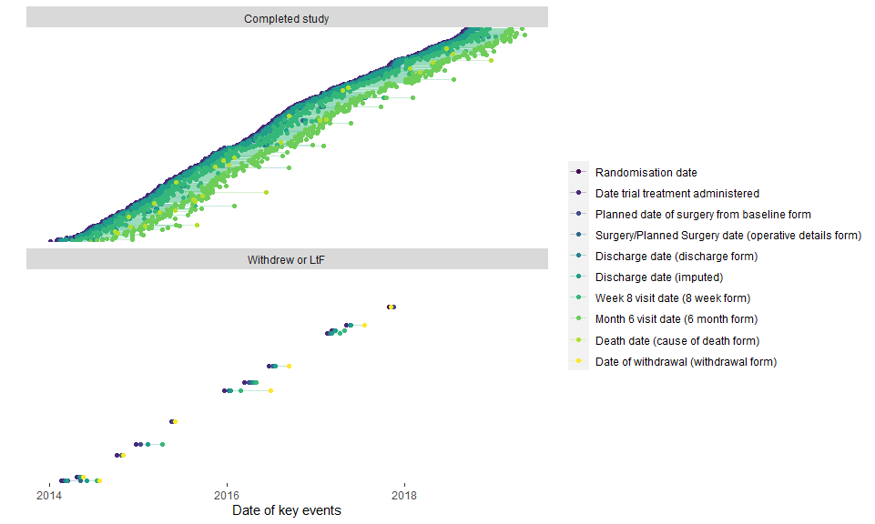
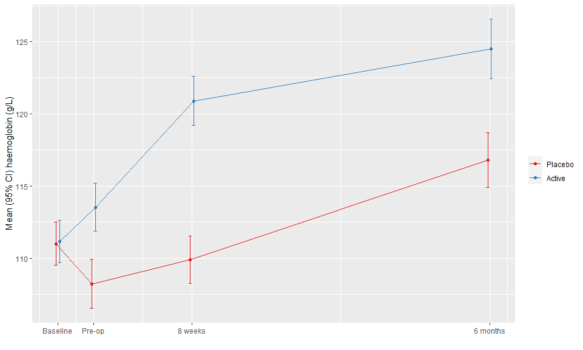
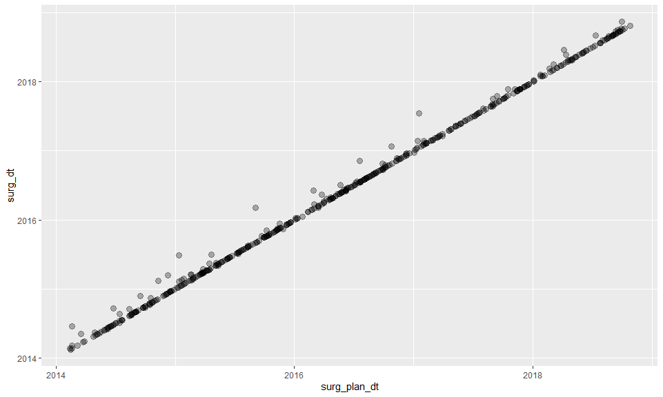
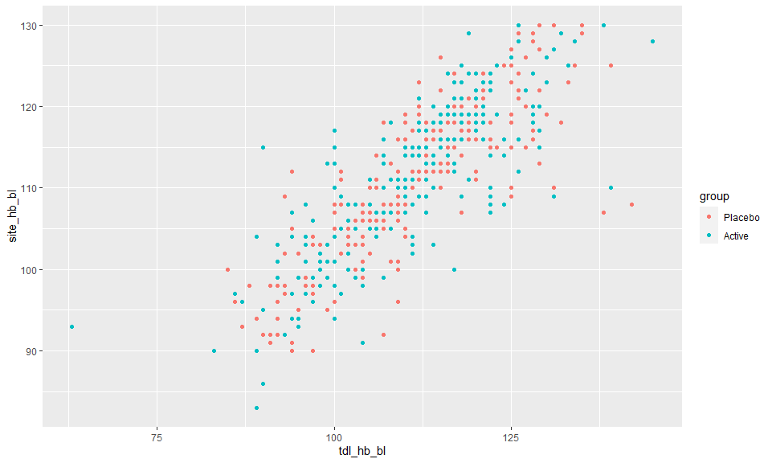

There were 487 patients in the trial dataset, recruited from 41 sites (**NOTE**: the trial paper says 46 sites). 

Patients were randomized between 2014-01-06 and 2018-09-28. 

## Timing of key study points

<!-- -->


6 randomized patients did not receive the treatment under test; while 26 did not undergo surgery. There were 8 withdraws, with 3 of them prior to surgery. (**NOTE**: I don't have information on the type of surgery.)

There were 474 patients in the ITT analysis set. 

There were 393 patients in the per protocol set. (**NOTE**: The paper lists 388). 


# Paper Table 1 (Baseline characteristics)

<!--html_preserve--><div class="tabwid"><style>.cl-ab7b4dfe{font-family:'Arial';font-size:11px;font-weight:normal;font-style:normal;text-decoration:none;color:rgba(17, 17, 17, 1.00);background-color:transparent;}.cl-ab7b4dff{margin:0;text-align:left;border-bottom: 0 solid rgba(0, 0, 0, 1.00);border-top: 0 solid rgba(0, 0, 0, 1.00);border-left: 0 solid rgba(0, 0, 0, 1.00);border-right: 0 solid rgba(0, 0, 0, 1.00);padding-bottom:2px;padding-top:2px;padding-left:5px;padding-right:5px;line-height: 1.00;background-color:transparent;}.cl-ab7b4e00{margin:0;text-align:right;border-bottom: 0 solid rgba(0, 0, 0, 1.00);border-top: 0 solid rgba(0, 0, 0, 1.00);border-left: 0 solid rgba(0, 0, 0, 1.00);border-right: 0 solid rgba(0, 0, 0, 1.00);padding-bottom:2px;padding-top:2px;padding-left:5px;padding-right:5px;line-height: 1.00;background-color:transparent;}.cl-ab7b750e{width:107px;background-color:transparent;vertical-align: middle;border-bottom: 0 solid rgba(0, 0, 0, 1.00);border-top: 0 solid rgba(0, 0, 0, 1.00);border-left: 0 solid rgba(0, 0, 0, 1.00);border-right: 0 solid rgba(0, 0, 0, 1.00);margin-bottom:0;margin-top:0;margin-left:0;margin-right:0;}.cl-ab7b750f{width:100px;background-color:transparent;vertical-align: middle;border-bottom: 0 solid rgba(0, 0, 0, 1.00);border-top: 0 solid rgba(0, 0, 0, 1.00);border-left: 0 solid rgba(0, 0, 0, 1.00);border-right: 0 solid rgba(0, 0, 0, 1.00);margin-bottom:0;margin-top:0;margin-left:0;margin-right:0;}.cl-ab7b7510{width:85px;background-color:transparent;vertical-align: middle;border-bottom: 0 solid rgba(0, 0, 0, 1.00);border-top: 0 solid rgba(0, 0, 0, 1.00);border-left: 0 solid rgba(0, 0, 0, 1.00);border-right: 0 solid rgba(0, 0, 0, 1.00);margin-bottom:0;margin-top:0;margin-left:0;margin-right:0;}.cl-ab7b7511{width:103px;background-color:transparent;vertical-align: middle;border-bottom: 0 solid rgba(0, 0, 0, 1.00);border-top: 0 solid rgba(0, 0, 0, 1.00);border-left: 0 solid rgba(0, 0, 0, 1.00);border-right: 0 solid rgba(0, 0, 0, 1.00);margin-bottom:0;margin-top:0;margin-left:0;margin-right:0;}.cl-ab7b7512{width:100px;background-color:transparent;vertical-align: middle;border-bottom: 0 solid rgba(0, 0, 0, 1.00);border-top: 0 solid rgba(0, 0, 0, 1.00);border-left: 0 solid rgba(0, 0, 0, 1.00);border-right: 0 solid rgba(0, 0, 0, 1.00);margin-bottom:0;margin-top:0;margin-left:0;margin-right:0;}.cl-ab7b7513{width:100px;background-color:transparent;vertical-align: middle;border-bottom: 0 solid rgba(0, 0, 0, 1.00);border-top: 0 solid rgba(0, 0, 0, 1.00);border-left: 0 solid rgba(0, 0, 0, 1.00);border-right: 0 solid rgba(0, 0, 0, 1.00);margin-bottom:0;margin-top:0;margin-left:0;margin-right:0;}.cl-ab7b7514{width:103px;background-color:transparent;vertical-align: middle;border-bottom: 0 solid rgba(0, 0, 0, 1.00);border-top: 0 solid rgba(0, 0, 0, 1.00);border-left: 0 solid rgba(0, 0, 0, 1.00);border-right: 0 solid rgba(0, 0, 0, 1.00);margin-bottom:0;margin-top:0;margin-left:0;margin-right:0;}.cl-ab7b7515{width:100px;background-color:transparent;vertical-align: middle;border-bottom: 0 solid rgba(0, 0, 0, 1.00);border-top: 0 solid rgba(0, 0, 0, 1.00);border-left: 0 solid rgba(0, 0, 0, 1.00);border-right: 0 solid rgba(0, 0, 0, 1.00);margin-bottom:0;margin-top:0;margin-left:0;margin-right:0;}.cl-ab7b7516{width:85px;background-color:transparent;vertical-align: middle;border-bottom: 0 solid rgba(0, 0, 0, 1.00);border-top: 0 solid rgba(0, 0, 0, 1.00);border-left: 0 solid rgba(0, 0, 0, 1.00);border-right: 0 solid rgba(0, 0, 0, 1.00);margin-bottom:0;margin-top:0;margin-left:0;margin-right:0;}.cl-ab7b7517{width:107px;background-color:transparent;vertical-align: middle;border-bottom: 0 solid rgba(0, 0, 0, 1.00);border-top: 0 solid rgba(0, 0, 0, 1.00);border-left: 0 solid rgba(0, 0, 0, 1.00);border-right: 0 solid rgba(0, 0, 0, 1.00);margin-bottom:0;margin-top:0;margin-left:0;margin-right:0;}.cl-ab7b7518{width:85px;background-color:transparent;vertical-align: middle;border-bottom: 0 solid rgba(0, 0, 0, 1.00);border-top: 0 solid rgba(0, 0, 0, 1.00);border-left: 0 solid rgba(0, 0, 0, 1.00);border-right: 0 solid rgba(0, 0, 0, 1.00);margin-bottom:0;margin-top:0;margin-left:0;margin-right:0;}.cl-ab7b9bf6{width:107px;background-color:transparent;vertical-align: middle;border-bottom: 0 solid rgba(0, 0, 0, 1.00);border-top: 0 solid rgba(0, 0, 0, 1.00);border-left: 0 solid rgba(0, 0, 0, 1.00);border-right: 0 solid rgba(0, 0, 0, 1.00);margin-bottom:0;margin-top:0;margin-left:0;margin-right:0;}.cl-ab7b9bf7{width:100px;background-color:transparent;vertical-align: middle;border-bottom: 0 solid rgba(0, 0, 0, 1.00);border-top: 0 solid rgba(0, 0, 0, 1.00);border-left: 0 solid rgba(0, 0, 0, 1.00);border-right: 0 solid rgba(0, 0, 0, 1.00);margin-bottom:0;margin-top:0;margin-left:0;margin-right:0;}.cl-ab7b9bf8{width:100px;background-color:transparent;vertical-align: middle;border-bottom: 0 solid rgba(0, 0, 0, 1.00);border-top: 0 solid rgba(0, 0, 0, 1.00);border-left: 0 solid rgba(0, 0, 0, 1.00);border-right: 0 solid rgba(0, 0, 0, 1.00);margin-bottom:0;margin-top:0;margin-left:0;margin-right:0;}.cl-ab7b9bf9{width:103px;background-color:transparent;vertical-align: middle;border-bottom: 0 solid rgba(0, 0, 0, 1.00);border-top: 0 solid rgba(0, 0, 0, 1.00);border-left: 0 solid rgba(0, 0, 0, 1.00);border-right: 0 solid rgba(0, 0, 0, 1.00);margin-bottom:0;margin-top:0;margin-left:0;margin-right:0;}.cl-ab7b9bfa{width:107px;background-color:transparent;vertical-align: middle;border-bottom: 2.00px solid rgba(0, 0, 0, 1.00);border-top: 0 solid rgba(0, 0, 0, 1.00);border-left: 0 solid rgba(0, 0, 0, 1.00);border-right: 0 solid rgba(0, 0, 0, 1.00);margin-bottom:0;margin-top:0;margin-left:0;margin-right:0;}.cl-ab7b9bfb{width:103px;background-color:transparent;vertical-align: middle;border-bottom: 2.00px solid rgba(0, 0, 0, 1.00);border-top: 0 solid rgba(0, 0, 0, 1.00);border-left: 0 solid rgba(0, 0, 0, 1.00);border-right: 0 solid rgba(0, 0, 0, 1.00);margin-bottom:0;margin-top:0;margin-left:0;margin-right:0;}.cl-ab7b9bfc{width:85px;background-color:transparent;vertical-align: middle;border-bottom: 2.00px solid rgba(0, 0, 0, 1.00);border-top: 0 solid rgba(0, 0, 0, 1.00);border-left: 0 solid rgba(0, 0, 0, 1.00);border-right: 0 solid rgba(0, 0, 0, 1.00);margin-bottom:0;margin-top:0;margin-left:0;margin-right:0;}.cl-ab7b9bfd{width:100px;background-color:transparent;vertical-align: middle;border-bottom: 2.00px solid rgba(0, 0, 0, 1.00);border-top: 0 solid rgba(0, 0, 0, 1.00);border-left: 0 solid rgba(0, 0, 0, 1.00);border-right: 0 solid rgba(0, 0, 0, 1.00);margin-bottom:0;margin-top:0;margin-left:0;margin-right:0;}.cl-ab7b9bfe{width:100px;background-color:transparent;vertical-align: middle;border-bottom: 2.00px solid rgba(0, 0, 0, 1.00);border-top: 0 solid rgba(0, 0, 0, 1.00);border-left: 0 solid rgba(0, 0, 0, 1.00);border-right: 0 solid rgba(0, 0, 0, 1.00);margin-bottom:0;margin-top:0;margin-left:0;margin-right:0;}.cl-ab7b9bff{width:100px;background-color:transparent;vertical-align: middle;border-bottom: 0 solid rgba(0, 0, 0, 1.00);border-top: 0 solid rgba(0, 0, 0, 1.00);border-left: 0 solid rgba(0, 0, 0, 1.00);border-right: 0 solid rgba(0, 0, 0, 1.00);margin-bottom:0;margin-top:0;margin-left:0;margin-right:0;}.cl-ab7b9c00{width:85px;background-color:transparent;vertical-align: middle;border-bottom: 0 solid rgba(0, 0, 0, 1.00);border-top: 0 solid rgba(0, 0, 0, 1.00);border-left: 0 solid rgba(0, 0, 0, 1.00);border-right: 0 solid rgba(0, 0, 0, 1.00);margin-bottom:0;margin-top:0;margin-left:0;margin-right:0;}.cl-ab7bc2f2{width:107px;background-color:transparent;vertical-align: middle;border-bottom: 0 solid rgba(0, 0, 0, 1.00);border-top: 0 solid rgba(0, 0, 0, 1.00);border-left: 0 solid rgba(0, 0, 0, 1.00);border-right: 0 solid rgba(0, 0, 0, 1.00);margin-bottom:0;margin-top:0;margin-left:0;margin-right:0;}.cl-ab7bc2f3{width:100px;background-color:transparent;vertical-align: middle;border-bottom: 0 solid rgba(0, 0, 0, 1.00);border-top: 0 solid rgba(0, 0, 0, 1.00);border-left: 0 solid rgba(0, 0, 0, 1.00);border-right: 0 solid rgba(0, 0, 0, 1.00);margin-bottom:0;margin-top:0;margin-left:0;margin-right:0;}.cl-ab7bc2f4{width:103px;background-color:transparent;vertical-align: middle;border-bottom: 0 solid rgba(0, 0, 0, 1.00);border-top: 0 solid rgba(0, 0, 0, 1.00);border-left: 0 solid rgba(0, 0, 0, 1.00);border-right: 0 solid rgba(0, 0, 0, 1.00);margin-bottom:0;margin-top:0;margin-left:0;margin-right:0;}.cl-ab7bc2f5{width:85px;background-color:transparent;vertical-align: middle;border-bottom: 0 solid rgba(0, 0, 0, 1.00);border-top: 0 solid rgba(0, 0, 0, 1.00);border-left: 0 solid rgba(0, 0, 0, 1.00);border-right: 0 solid rgba(0, 0, 0, 1.00);margin-bottom:0;margin-top:0;margin-left:0;margin-right:0;}.cl-ab7bc2f6{width:100px;background-color:transparent;vertical-align: middle;border-bottom: 0 solid rgba(0, 0, 0, 1.00);border-top: 0 solid rgba(0, 0, 0, 1.00);border-left: 0 solid rgba(0, 0, 0, 1.00);border-right: 0 solid rgba(0, 0, 0, 1.00);margin-bottom:0;margin-top:0;margin-left:0;margin-right:0;}.cl-ab7bc2f7{width:107px;background-color:transparent;vertical-align: middle;border-bottom: 0 solid rgba(0, 0, 0, 1.00);border-top: 0 solid rgba(0, 0, 0, 1.00);border-left: 0 solid rgba(0, 0, 0, 1.00);border-right: 0 solid rgba(0, 0, 0, 1.00);margin-bottom:0;margin-top:0;margin-left:0;margin-right:0;}.cl-ab7bc2f8{width:100px;background-color:transparent;vertical-align: middle;border-bottom: 0 solid rgba(0, 0, 0, 1.00);border-top: 0 solid rgba(0, 0, 0, 1.00);border-left: 0 solid rgba(0, 0, 0, 1.00);border-right: 0 solid rgba(0, 0, 0, 1.00);margin-bottom:0;margin-top:0;margin-left:0;margin-right:0;}.cl-ab7bc2f9{width:103px;background-color:transparent;vertical-align: middle;border-bottom: 0 solid rgba(0, 0, 0, 1.00);border-top: 0 solid rgba(0, 0, 0, 1.00);border-left: 0 solid rgba(0, 0, 0, 1.00);border-right: 0 solid rgba(0, 0, 0, 1.00);margin-bottom:0;margin-top:0;margin-left:0;margin-right:0;}.cl-ab7bc2fa{width:100px;background-color:transparent;vertical-align: middle;border-bottom: 0 solid rgba(0, 0, 0, 1.00);border-top: 0 solid rgba(0, 0, 0, 1.00);border-left: 0 solid rgba(0, 0, 0, 1.00);border-right: 0 solid rgba(0, 0, 0, 1.00);margin-bottom:0;margin-top:0;margin-left:0;margin-right:0;}.cl-ab7bc2fb{width:100px;background-color:transparent;vertical-align: middle;border-bottom: 0 solid rgba(0, 0, 0, 1.00);border-top: 0 solid rgba(0, 0, 0, 1.00);border-left: 0 solid rgba(0, 0, 0, 1.00);border-right: 0 solid rgba(0, 0, 0, 1.00);margin-bottom:0;margin-top:0;margin-left:0;margin-right:0;}.cl-ab7bc2fc{width:85px;background-color:transparent;vertical-align: middle;border-bottom: 0 solid rgba(0, 0, 0, 1.00);border-top: 0 solid rgba(0, 0, 0, 1.00);border-left: 0 solid rgba(0, 0, 0, 1.00);border-right: 0 solid rgba(0, 0, 0, 1.00);margin-bottom:0;margin-top:0;margin-left:0;margin-right:0;}.cl-ab7be9e4{width:103px;background-color:transparent;vertical-align: middle;border-bottom: 0 solid rgba(0, 0, 0, 1.00);border-top: 0 solid rgba(0, 0, 0, 1.00);border-left: 0 solid rgba(0, 0, 0, 1.00);border-right: 0 solid rgba(0, 0, 0, 1.00);margin-bottom:0;margin-top:0;margin-left:0;margin-right:0;}.cl-ab7be9e5{width:107px;background-color:transparent;vertical-align: middle;border-bottom: 0 solid rgba(0, 0, 0, 1.00);border-top: 0 solid rgba(0, 0, 0, 1.00);border-left: 0 solid rgba(0, 0, 0, 1.00);border-right: 0 solid rgba(0, 0, 0, 1.00);margin-bottom:0;margin-top:0;margin-left:0;margin-right:0;}.cl-ab7be9e6{width:107px;background-color:transparent;vertical-align: middle;border-bottom: 0 solid rgba(0, 0, 0, 1.00);border-top: 0 solid rgba(0, 0, 0, 1.00);border-left: 0 solid rgba(0, 0, 0, 1.00);border-right: 0 solid rgba(0, 0, 0, 1.00);margin-bottom:0;margin-top:0;margin-left:0;margin-right:0;}.cl-ab7be9e7{width:85px;background-color:transparent;vertical-align: middle;border-bottom: 0 solid rgba(0, 0, 0, 1.00);border-top: 0 solid rgba(0, 0, 0, 1.00);border-left: 0 solid rgba(0, 0, 0, 1.00);border-right: 0 solid rgba(0, 0, 0, 1.00);margin-bottom:0;margin-top:0;margin-left:0;margin-right:0;}.cl-ab7be9e8{width:100px;background-color:transparent;vertical-align: middle;border-bottom: 0 solid rgba(0, 0, 0, 1.00);border-top: 0 solid rgba(0, 0, 0, 1.00);border-left: 0 solid rgba(0, 0, 0, 1.00);border-right: 0 solid rgba(0, 0, 0, 1.00);margin-bottom:0;margin-top:0;margin-left:0;margin-right:0;}.cl-ab7be9e9{width:103px;background-color:transparent;vertical-align: middle;border-bottom: 0 solid rgba(0, 0, 0, 1.00);border-top: 0 solid rgba(0, 0, 0, 1.00);border-left: 0 solid rgba(0, 0, 0, 1.00);border-right: 0 solid rgba(0, 0, 0, 1.00);margin-bottom:0;margin-top:0;margin-left:0;margin-right:0;}.cl-ab7be9ea{width:100px;background-color:transparent;vertical-align: middle;border-bottom: 0 solid rgba(0, 0, 0, 1.00);border-top: 0 solid rgba(0, 0, 0, 1.00);border-left: 0 solid rgba(0, 0, 0, 1.00);border-right: 0 solid rgba(0, 0, 0, 1.00);margin-bottom:0;margin-top:0;margin-left:0;margin-right:0;}.cl-ab7be9eb{width:85px;background-color:transparent;vertical-align: middle;border-bottom: 0 solid rgba(0, 0, 0, 1.00);border-top: 0 solid rgba(0, 0, 0, 1.00);border-left: 0 solid rgba(0, 0, 0, 1.00);border-right: 0 solid rgba(0, 0, 0, 1.00);margin-bottom:0;margin-top:0;margin-left:0;margin-right:0;}.cl-ab7be9ec{width:103px;background-color:transparent;vertical-align: middle;border-bottom: 0 solid rgba(0, 0, 0, 1.00);border-top: 0 solid rgba(0, 0, 0, 1.00);border-left: 0 solid rgba(0, 0, 0, 1.00);border-right: 0 solid rgba(0, 0, 0, 1.00);margin-bottom:0;margin-top:0;margin-left:0;margin-right:0;}.cl-ab7be9ed{width:100px;background-color:transparent;vertical-align: middle;border-bottom: 0 solid rgba(0, 0, 0, 1.00);border-top: 0 solid rgba(0, 0, 0, 1.00);border-left: 0 solid rgba(0, 0, 0, 1.00);border-right: 0 solid rgba(0, 0, 0, 1.00);margin-bottom:0;margin-top:0;margin-left:0;margin-right:0;}.cl-ab7be9ee{width:100px;background-color:transparent;vertical-align: middle;border-bottom: 0 solid rgba(0, 0, 0, 1.00);border-top: 0 solid rgba(0, 0, 0, 1.00);border-left: 0 solid rgba(0, 0, 0, 1.00);border-right: 0 solid rgba(0, 0, 0, 1.00);margin-bottom:0;margin-top:0;margin-left:0;margin-right:0;}.cl-ab7c10d6{width:107px;background-color:transparent;vertical-align: middle;border-bottom: 0 solid rgba(0, 0, 0, 1.00);border-top: 0 solid rgba(0, 0, 0, 1.00);border-left: 0 solid rgba(0, 0, 0, 1.00);border-right: 0 solid rgba(0, 0, 0, 1.00);margin-bottom:0;margin-top:0;margin-left:0;margin-right:0;}.cl-ab7c10d7{width:85px;background-color:transparent;vertical-align: middle;border-bottom: 2.00px solid rgba(0, 0, 0, 1.00);border-top: 2.00px solid rgba(0, 0, 0, 1.00);border-left: 0 solid rgba(0, 0, 0, 1.00);border-right: 0 solid rgba(0, 0, 0, 1.00);margin-bottom:0;margin-top:0;margin-left:0;margin-right:0;}.cl-ab7c10d8{width:107px;background-color:transparent;vertical-align: middle;border-bottom: 2.00px solid rgba(0, 0, 0, 1.00);border-top: 2.00px solid rgba(0, 0, 0, 1.00);border-left: 0 solid rgba(0, 0, 0, 1.00);border-right: 0 solid rgba(0, 0, 0, 1.00);margin-bottom:0;margin-top:0;margin-left:0;margin-right:0;}.cl-ab7c10d9{width:100px;background-color:transparent;vertical-align: middle;border-bottom: 2.00px solid rgba(0, 0, 0, 1.00);border-top: 2.00px solid rgba(0, 0, 0, 1.00);border-left: 0 solid rgba(0, 0, 0, 1.00);border-right: 0 solid rgba(0, 0, 0, 1.00);margin-bottom:0;margin-top:0;margin-left:0;margin-right:0;}.cl-ab7c10da{width:103px;background-color:transparent;vertical-align: middle;border-bottom: 2.00px solid rgba(0, 0, 0, 1.00);border-top: 2.00px solid rgba(0, 0, 0, 1.00);border-left: 0 solid rgba(0, 0, 0, 1.00);border-right: 0 solid rgba(0, 0, 0, 1.00);margin-bottom:0;margin-top:0;margin-left:0;margin-right:0;}.cl-ab7c10db{width:100px;background-color:transparent;vertical-align: middle;border-bottom: 2.00px solid rgba(0, 0, 0, 1.00);border-top: 2.00px solid rgba(0, 0, 0, 1.00);border-left: 0 solid rgba(0, 0, 0, 1.00);border-right: 0 solid rgba(0, 0, 0, 1.00);margin-bottom:0;margin-top:0;margin-left:0;margin-right:0;}</style><table style='border-collapse:collapse;'><thead><tr style="overflow-wrap:break-word;"><td class="cl-ab7c10d8"><p class="cl-ab7b4dff"><span class="cl-ab7b4dfe">Variable</span></p></td><td class="cl-ab7c10d7"><p class="cl-ab7b4e00"><span class="cl-ab7b4dfe">Observations</span></p></td><td class="cl-ab7c10d9"><p class="cl-ab7b4dff"><span class="cl-ab7b4dfe">Total (n = 487)</span></p></td><td class="cl-ab7c10da"><p class="cl-ab7b4dff"><span class="cl-ab7b4dfe">Control (n = 243)</span></p></td><td class="cl-ab7c10db"><p class="cl-ab7b4dff"><span class="cl-ab7b4dfe">Active (n = 244)</span></p></td></tr></thead><tbody><tr style="overflow-wrap:break-word;"><td class="cl-ab7b750e"><p class="cl-ab7b4dff"><span class="cl-ab7b4dfe">age</span></p></td><td class="cl-ab7b7510"><p class="cl-ab7b4e00"><span class="cl-ab7b4dfe">487</span></p></td><td class="cl-ab7b7512"><p class="cl-ab7b4dff"><span class="cl-ab7b4dfe">65.8 [53.7, 72.2]</span></p></td><td class="cl-ab7b7511"><p class="cl-ab7b4dff"><span class="cl-ab7b4dfe">64.6 [50.4, 72.3]</span></p></td><td class="cl-ab7b750f"><p class="cl-ab7b4dff"><span class="cl-ab7b4dfe">66.5 [56.6, 72.2]</span></p></td></tr><tr style="overflow-wrap:break-word;"><td class="cl-ab7b7517"><p class="cl-ab7b4dff"><span class="cl-ab7b4dfe">gender</span></p></td><td class="cl-ab7b7516"><p class="cl-ab7b4e00"><span class="cl-ab7b4dfe">487</span></p></td><td class="cl-ab7b7513"><p class="cl-ab7b4dff"><span class="cl-ab7b4dfe"></span></p></td><td class="cl-ab7b7514"><p class="cl-ab7b4dff"><span class="cl-ab7b4dfe"></span></p></td><td class="cl-ab7b7515"><p class="cl-ab7b4dff"><span class="cl-ab7b4dfe"></span></p></td></tr><tr style="overflow-wrap:break-word;"><td class="cl-ab7b9bf6"><p class="cl-ab7b4dff"><span class="cl-ab7b4dfe">Female</span></p></td><td class="cl-ab7b7518"><p class="cl-ab7b4e00"><span class="cl-ab7b4dfe">NA</span></p></td><td class="cl-ab7b9bf8"><p class="cl-ab7b4dff"><span class="cl-ab7b4dfe">267 (54.8%)</span></p></td><td class="cl-ab7b9bf9"><p class="cl-ab7b4dff"><span class="cl-ab7b4dfe">142 (58.4%)</span></p></td><td class="cl-ab7b9bf7"><p class="cl-ab7b4dff"><span class="cl-ab7b4dfe">125 (51.2%)</span></p></td></tr><tr style="overflow-wrap:break-word;"><td class="cl-ab7b9bf6"><p class="cl-ab7b4dff"><span class="cl-ab7b4dfe">Male</span></p></td><td class="cl-ab7b7518"><p class="cl-ab7b4e00"><span class="cl-ab7b4dfe">NA</span></p></td><td class="cl-ab7b9bf8"><p class="cl-ab7b4dff"><span class="cl-ab7b4dfe">220 (45.2%)</span></p></td><td class="cl-ab7b9bf9"><p class="cl-ab7b4dff"><span class="cl-ab7b4dfe">101 (41.6%)</span></p></td><td class="cl-ab7b9bf7"><p class="cl-ab7b4dff"><span class="cl-ab7b4dfe">119 (48.8%)</span></p></td></tr><tr style="overflow-wrap:break-word;"><td class="cl-ab7b7517"><p class="cl-ab7b4dff"><span class="cl-ab7b4dfe">ethnicity</span></p></td><td class="cl-ab7b7516"><p class="cl-ab7b4e00"><span class="cl-ab7b4dfe">487</span></p></td><td class="cl-ab7b7513"><p class="cl-ab7b4dff"><span class="cl-ab7b4dfe"></span></p></td><td class="cl-ab7b7514"><p class="cl-ab7b4dff"><span class="cl-ab7b4dfe"></span></p></td><td class="cl-ab7b7515"><p class="cl-ab7b4dff"><span class="cl-ab7b4dfe"></span></p></td></tr><tr style="overflow-wrap:break-word;"><td class="cl-ab7b9bf6"><p class="cl-ab7b4dff"><span class="cl-ab7b4dfe">Caucasian</span></p></td><td class="cl-ab7b7518"><p class="cl-ab7b4e00"><span class="cl-ab7b4dfe">NA</span></p></td><td class="cl-ab7b9bf8"><p class="cl-ab7b4dff"><span class="cl-ab7b4dfe">428 (87.9%)</span></p></td><td class="cl-ab7b9bf9"><p class="cl-ab7b4dff"><span class="cl-ab7b4dfe">217 (89.3%)</span></p></td><td class="cl-ab7b9bf7"><p class="cl-ab7b4dff"><span class="cl-ab7b4dfe">211 (86.5%)</span></p></td></tr><tr style="overflow-wrap:break-word;"><td class="cl-ab7b9bf6"><p class="cl-ab7b4dff"><span class="cl-ab7b4dfe">Afro-Caribbean</span></p></td><td class="cl-ab7b7518"><p class="cl-ab7b4e00"><span class="cl-ab7b4dfe">NA</span></p></td><td class="cl-ab7b9bf8"><p class="cl-ab7b4dff"><span class="cl-ab7b4dfe">33 (6.8%)</span></p></td><td class="cl-ab7b9bf9"><p class="cl-ab7b4dff"><span class="cl-ab7b4dfe">19 (7.8%)</span></p></td><td class="cl-ab7b9bf7"><p class="cl-ab7b4dff"><span class="cl-ab7b4dfe">14 (5.7%)</span></p></td></tr><tr style="overflow-wrap:break-word;"><td class="cl-ab7b9bf6"><p class="cl-ab7b4dff"><span class="cl-ab7b4dfe">Asian</span></p></td><td class="cl-ab7b7518"><p class="cl-ab7b4e00"><span class="cl-ab7b4dfe">NA</span></p></td><td class="cl-ab7b9bf8"><p class="cl-ab7b4dff"><span class="cl-ab7b4dfe">24 (4.9%)</span></p></td><td class="cl-ab7b9bf9"><p class="cl-ab7b4dff"><span class="cl-ab7b4dfe">6 (2.5%)</span></p></td><td class="cl-ab7b9bf7"><p class="cl-ab7b4dff"><span class="cl-ab7b4dfe">18 (7.4%)</span></p></td></tr><tr style="overflow-wrap:break-word;"><td class="cl-ab7b9bf6"><p class="cl-ab7b4dff"><span class="cl-ab7b4dfe">Other</span></p></td><td class="cl-ab7b7518"><p class="cl-ab7b4e00"><span class="cl-ab7b4dfe">NA</span></p></td><td class="cl-ab7b9bf8"><p class="cl-ab7b4dff"><span class="cl-ab7b4dfe">2 (0.4%)</span></p></td><td class="cl-ab7b9bf9"><p class="cl-ab7b4dff"><span class="cl-ab7b4dfe">1 (0.4%)</span></p></td><td class="cl-ab7b9bf7"><p class="cl-ab7b4dff"><span class="cl-ab7b4dfe">1 (0.4%)</span></p></td></tr><tr style="overflow-wrap:break-word;"><td class="cl-ab7b750e"><p class="cl-ab7b4dff"><span class="cl-ab7b4dfe">tdl_hb_bl</span></p></td><td class="cl-ab7b7510"><p class="cl-ab7b4e00"><span class="cl-ab7b4dfe">472</span></p></td><td class="cl-ab7b7512"><p class="cl-ab7b4dff"><span class="cl-ab7b4dfe">111 [103, 119.2]</span></p></td><td class="cl-ab7b7511"><p class="cl-ab7b4dff"><span class="cl-ab7b4dfe">110 [104, 119]</span></p></td><td class="cl-ab7b750f"><p class="cl-ab7b4dff"><span class="cl-ab7b4dfe">112 [102, 120]</span></p></td></tr><tr style="overflow-wrap:break-word;"><td class="cl-ab7bc2f2"><p class="cl-ab7b4dff"><span class="cl-ab7b4dfe">tdl_hb_bl_cat</span></p></td><td class="cl-ab7b9c00"><p class="cl-ab7b4e00"><span class="cl-ab7b4dfe">472</span></p></td><td class="cl-ab7b9bff"><p class="cl-ab7b4dff"><span class="cl-ab7b4dfe"></span></p></td><td class="cl-ab7bc2f4"><p class="cl-ab7b4dff"><span class="cl-ab7b4dfe"></span></p></td><td class="cl-ab7bc2f3"><p class="cl-ab7b4dff"><span class="cl-ab7b4dfe"></span></p></td></tr><tr style="overflow-wrap:break-word;"><td class="cl-ab7b9bf6"><p class="cl-ab7b4dff"><span class="cl-ab7b4dfe">&lt; 100</span></p></td><td class="cl-ab7b7518"><p class="cl-ab7b4e00"><span class="cl-ab7b4dfe">NA</span></p></td><td class="cl-ab7b9bf8"><p class="cl-ab7b4dff"><span class="cl-ab7b4dfe">84 (17.8%)</span></p></td><td class="cl-ab7b9bf9"><p class="cl-ab7b4dff"><span class="cl-ab7b4dfe">42 (17.9%)</span></p></td><td class="cl-ab7b9bf7"><p class="cl-ab7b4dff"><span class="cl-ab7b4dfe">42 (17.6%)</span></p></td></tr><tr style="overflow-wrap:break-word;"><td class="cl-ab7b9bf6"><p class="cl-ab7b4dff"><span class="cl-ab7b4dfe">&gt;= 100</span></p></td><td class="cl-ab7b7518"><p class="cl-ab7b4e00"><span class="cl-ab7b4dfe">NA</span></p></td><td class="cl-ab7b9bf8"><p class="cl-ab7b4dff"><span class="cl-ab7b4dfe">388 (82.2%)</span></p></td><td class="cl-ab7b9bf9"><p class="cl-ab7b4dff"><span class="cl-ab7b4dfe">192 (82.1%)</span></p></td><td class="cl-ab7b9bf7"><p class="cl-ab7b4dff"><span class="cl-ab7b4dfe">196 (82.4%)</span></p></td></tr><tr style="overflow-wrap:break-word;"><td class="cl-ab7b7517"><p class="cl-ab7b4dff"><span class="cl-ab7b4dfe">asa_grade</span></p></td><td class="cl-ab7b7516"><p class="cl-ab7b4e00"><span class="cl-ab7b4dfe">472</span></p></td><td class="cl-ab7b7513"><p class="cl-ab7b4dff"><span class="cl-ab7b4dfe"></span></p></td><td class="cl-ab7b7514"><p class="cl-ab7b4dff"><span class="cl-ab7b4dfe"></span></p></td><td class="cl-ab7b7515"><p class="cl-ab7b4dff"><span class="cl-ab7b4dfe"></span></p></td></tr><tr style="overflow-wrap:break-word;"><td class="cl-ab7b9bf6"><p class="cl-ab7b4dff"><span class="cl-ab7b4dfe">I</span></p></td><td class="cl-ab7b7518"><p class="cl-ab7b4e00"><span class="cl-ab7b4dfe">NA</span></p></td><td class="cl-ab7b9bf8"><p class="cl-ab7b4dff"><span class="cl-ab7b4dfe">61 (12.9%)</span></p></td><td class="cl-ab7b9bf9"><p class="cl-ab7b4dff"><span class="cl-ab7b4dfe">31 (13%)</span></p></td><td class="cl-ab7b9bf7"><p class="cl-ab7b4dff"><span class="cl-ab7b4dfe">30 (12.8%)</span></p></td></tr><tr style="overflow-wrap:break-word;"><td class="cl-ab7b9bf6"><p class="cl-ab7b4dff"><span class="cl-ab7b4dfe">II</span></p></td><td class="cl-ab7b7518"><p class="cl-ab7b4e00"><span class="cl-ab7b4dfe">NA</span></p></td><td class="cl-ab7b9bf8"><p class="cl-ab7b4dff"><span class="cl-ab7b4dfe">288 (61%)</span></p></td><td class="cl-ab7b9bf9"><p class="cl-ab7b4dff"><span class="cl-ab7b4dfe">141 (59.2%)</span></p></td><td class="cl-ab7b9bf7"><p class="cl-ab7b4dff"><span class="cl-ab7b4dfe">147 (62.8%)</span></p></td></tr><tr style="overflow-wrap:break-word;"><td class="cl-ab7b9bf6"><p class="cl-ab7b4dff"><span class="cl-ab7b4dfe">III</span></p></td><td class="cl-ab7b7518"><p class="cl-ab7b4e00"><span class="cl-ab7b4dfe">NA</span></p></td><td class="cl-ab7b9bf8"><p class="cl-ab7b4dff"><span class="cl-ab7b4dfe">121 (25.6%)</span></p></td><td class="cl-ab7b9bf9"><p class="cl-ab7b4dff"><span class="cl-ab7b4dfe">65 (27.3%)</span></p></td><td class="cl-ab7b9bf7"><p class="cl-ab7b4dff"><span class="cl-ab7b4dfe">56 (23.9%)</span></p></td></tr><tr style="overflow-wrap:break-word;"><td class="cl-ab7b9bf6"><p class="cl-ab7b4dff"><span class="cl-ab7b4dfe">IV</span></p></td><td class="cl-ab7b7518"><p class="cl-ab7b4e00"><span class="cl-ab7b4dfe">NA</span></p></td><td class="cl-ab7b9bf8"><p class="cl-ab7b4dff"><span class="cl-ab7b4dfe">2 (0.4%)</span></p></td><td class="cl-ab7b9bf9"><p class="cl-ab7b4dff"><span class="cl-ab7b4dfe">1 (0.4%)</span></p></td><td class="cl-ab7b9bf7"><p class="cl-ab7b4dff"><span class="cl-ab7b4dfe">1 (0.4%)</span></p></td></tr><tr style="overflow-wrap:break-word;"><td class="cl-ab7b9bf6"><p class="cl-ab7b4dff"><span class="cl-ab7b4dfe">V</span></p></td><td class="cl-ab7b7518"><p class="cl-ab7b4e00"><span class="cl-ab7b4dfe">NA</span></p></td><td class="cl-ab7b9bf8"><p class="cl-ab7b4dff"><span class="cl-ab7b4dfe">0 (0%)</span></p></td><td class="cl-ab7b9bf9"><p class="cl-ab7b4dff"><span class="cl-ab7b4dfe">0 (0%)</span></p></td><td class="cl-ab7b9bf7"><p class="cl-ab7b4dff"><span class="cl-ab7b4dfe">0 (0%)</span></p></td></tr><tr style="overflow-wrap:break-word;"><td class="cl-ab7b7517"><p class="cl-ab7b4dff"><span class="cl-ab7b4dfe">angina_chestpain</span></p></td><td class="cl-ab7b7516"><p class="cl-ab7b4e00"><span class="cl-ab7b4dfe">487</span></p></td><td class="cl-ab7b7513"><p class="cl-ab7b4dff"><span class="cl-ab7b4dfe"></span></p></td><td class="cl-ab7b7514"><p class="cl-ab7b4dff"><span class="cl-ab7b4dfe"></span></p></td><td class="cl-ab7b7515"><p class="cl-ab7b4dff"><span class="cl-ab7b4dfe"></span></p></td></tr><tr style="overflow-wrap:break-word;"><td class="cl-ab7b9bf6"><p class="cl-ab7b4dff"><span class="cl-ab7b4dfe">No</span></p></td><td class="cl-ab7b7518"><p class="cl-ab7b4e00"><span class="cl-ab7b4dfe">NA</span></p></td><td class="cl-ab7b9bf8"><p class="cl-ab7b4dff"><span class="cl-ab7b4dfe">456 (93.6%)</span></p></td><td class="cl-ab7b9bf9"><p class="cl-ab7b4dff"><span class="cl-ab7b4dfe">227 (93.4%)</span></p></td><td class="cl-ab7b9bf7"><p class="cl-ab7b4dff"><span class="cl-ab7b4dfe">229 (93.9%)</span></p></td></tr><tr style="overflow-wrap:break-word;"><td class="cl-ab7b9bf6"><p class="cl-ab7b4dff"><span class="cl-ab7b4dfe">Yes</span></p></td><td class="cl-ab7b7518"><p class="cl-ab7b4e00"><span class="cl-ab7b4dfe">NA</span></p></td><td class="cl-ab7b9bf8"><p class="cl-ab7b4dff"><span class="cl-ab7b4dfe">31 (6.4%)</span></p></td><td class="cl-ab7b9bf9"><p class="cl-ab7b4dff"><span class="cl-ab7b4dfe">16 (6.6%)</span></p></td><td class="cl-ab7b9bf7"><p class="cl-ab7b4dff"><span class="cl-ab7b4dfe">15 (6.1%)</span></p></td></tr><tr style="overflow-wrap:break-word;"><td class="cl-ab7b7517"><p class="cl-ab7b4dff"><span class="cl-ab7b4dfe">bleeding</span></p></td><td class="cl-ab7b7516"><p class="cl-ab7b4e00"><span class="cl-ab7b4dfe">487</span></p></td><td class="cl-ab7b7513"><p class="cl-ab7b4dff"><span class="cl-ab7b4dfe"></span></p></td><td class="cl-ab7b7514"><p class="cl-ab7b4dff"><span class="cl-ab7b4dfe"></span></p></td><td class="cl-ab7b7515"><p class="cl-ab7b4dff"><span class="cl-ab7b4dfe"></span></p></td></tr><tr style="overflow-wrap:break-word;"><td class="cl-ab7b9bf6"><p class="cl-ab7b4dff"><span class="cl-ab7b4dfe">No</span></p></td><td class="cl-ab7b7518"><p class="cl-ab7b4e00"><span class="cl-ab7b4dfe">NA</span></p></td><td class="cl-ab7b9bf8"><p class="cl-ab7b4dff"><span class="cl-ab7b4dfe">469 (96.3%)</span></p></td><td class="cl-ab7b9bf9"><p class="cl-ab7b4dff"><span class="cl-ab7b4dfe">236 (97.1%)</span></p></td><td class="cl-ab7b9bf7"><p class="cl-ab7b4dff"><span class="cl-ab7b4dfe">233 (95.5%)</span></p></td></tr><tr style="overflow-wrap:break-word;"><td class="cl-ab7b9bf6"><p class="cl-ab7b4dff"><span class="cl-ab7b4dfe">Yes</span></p></td><td class="cl-ab7b7518"><p class="cl-ab7b4e00"><span class="cl-ab7b4dfe">NA</span></p></td><td class="cl-ab7b9bf8"><p class="cl-ab7b4dff"><span class="cl-ab7b4dfe">18 (3.7%)</span></p></td><td class="cl-ab7b9bf9"><p class="cl-ab7b4dff"><span class="cl-ab7b4dfe">7 (2.9%)</span></p></td><td class="cl-ab7b9bf7"><p class="cl-ab7b4dff"><span class="cl-ab7b4dfe">11 (4.5%)</span></p></td></tr><tr style="overflow-wrap:break-word;"><td class="cl-ab7bc2f7"><p class="cl-ab7b4dff"><span class="cl-ab7b4dfe">breathless</span></p></td><td class="cl-ab7bc2f5"><p class="cl-ab7b4e00"><span class="cl-ab7b4dfe">487</span></p></td><td class="cl-ab7bc2f8"><p class="cl-ab7b4dff"><span class="cl-ab7b4dfe"></span></p></td><td class="cl-ab7bc2f9"><p class="cl-ab7b4dff"><span class="cl-ab7b4dfe"></span></p></td><td class="cl-ab7bc2f6"><p class="cl-ab7b4dff"><span class="cl-ab7b4dfe"></span></p></td></tr><tr style="overflow-wrap:break-word;"><td class="cl-ab7b9bf6"><p class="cl-ab7b4dff"><span class="cl-ab7b4dfe">No</span></p></td><td class="cl-ab7b7518"><p class="cl-ab7b4e00"><span class="cl-ab7b4dfe">NA</span></p></td><td class="cl-ab7b9bf8"><p class="cl-ab7b4dff"><span class="cl-ab7b4dfe">434 (89.1%)</span></p></td><td class="cl-ab7b9bf9"><p class="cl-ab7b4dff"><span class="cl-ab7b4dfe">215 (88.5%)</span></p></td><td class="cl-ab7b9bf7"><p class="cl-ab7b4dff"><span class="cl-ab7b4dfe">219 (89.8%)</span></p></td></tr><tr style="overflow-wrap:break-word;"><td class="cl-ab7b9bf6"><p class="cl-ab7b4dff"><span class="cl-ab7b4dfe">Yes</span></p></td><td class="cl-ab7b7518"><p class="cl-ab7b4e00"><span class="cl-ab7b4dfe">NA</span></p></td><td class="cl-ab7b9bf8"><p class="cl-ab7b4dff"><span class="cl-ab7b4dfe">53 (10.9%)</span></p></td><td class="cl-ab7b9bf9"><p class="cl-ab7b4dff"><span class="cl-ab7b4dfe">28 (11.5%)</span></p></td><td class="cl-ab7b9bf7"><p class="cl-ab7b4dff"><span class="cl-ab7b4dfe">25 (10.2%)</span></p></td></tr><tr style="overflow-wrap:break-word;"><td class="cl-ab7bc2f2"><p class="cl-ab7b4dff"><span class="cl-ab7b4dfe">coeliac_dis</span></p></td><td class="cl-ab7b9c00"><p class="cl-ab7b4e00"><span class="cl-ab7b4dfe">487</span></p></td><td class="cl-ab7b9bff"><p class="cl-ab7b4dff"><span class="cl-ab7b4dfe"></span></p></td><td class="cl-ab7bc2f4"><p class="cl-ab7b4dff"><span class="cl-ab7b4dfe"></span></p></td><td class="cl-ab7bc2f3"><p class="cl-ab7b4dff"><span class="cl-ab7b4dfe"></span></p></td></tr><tr style="overflow-wrap:break-word;"><td class="cl-ab7b9bf6"><p class="cl-ab7b4dff"><span class="cl-ab7b4dfe">No</span></p></td><td class="cl-ab7b7518"><p class="cl-ab7b4e00"><span class="cl-ab7b4dfe">NA</span></p></td><td class="cl-ab7b9bf8"><p class="cl-ab7b4dff"><span class="cl-ab7b4dfe">485 (99.6%)</span></p></td><td class="cl-ab7b9bf9"><p class="cl-ab7b4dff"><span class="cl-ab7b4dfe">241 (99.2%)</span></p></td><td class="cl-ab7b9bf7"><p class="cl-ab7b4dff"><span class="cl-ab7b4dfe">244 (100%)</span></p></td></tr><tr style="overflow-wrap:break-word;"><td class="cl-ab7b9bf6"><p class="cl-ab7b4dff"><span class="cl-ab7b4dfe">Yes</span></p></td><td class="cl-ab7b7518"><p class="cl-ab7b4e00"><span class="cl-ab7b4dfe">NA</span></p></td><td class="cl-ab7b9bf8"><p class="cl-ab7b4dff"><span class="cl-ab7b4dfe">2 (0.4%)</span></p></td><td class="cl-ab7b9bf9"><p class="cl-ab7b4dff"><span class="cl-ab7b4dfe">2 (0.8%)</span></p></td><td class="cl-ab7b9bf7"><p class="cl-ab7b4dff"><span class="cl-ab7b4dfe">0 (0%)</span></p></td></tr><tr style="overflow-wrap:break-word;"><td class="cl-ab7bc2f2"><p class="cl-ab7b4dff"><span class="cl-ab7b4dfe">copd_bron_asth</span></p></td><td class="cl-ab7b9c00"><p class="cl-ab7b4e00"><span class="cl-ab7b4dfe">487</span></p></td><td class="cl-ab7b9bff"><p class="cl-ab7b4dff"><span class="cl-ab7b4dfe"></span></p></td><td class="cl-ab7bc2f4"><p class="cl-ab7b4dff"><span class="cl-ab7b4dfe"></span></p></td><td class="cl-ab7bc2f3"><p class="cl-ab7b4dff"><span class="cl-ab7b4dfe"></span></p></td></tr><tr style="overflow-wrap:break-word;"><td class="cl-ab7b9bf6"><p class="cl-ab7b4dff"><span class="cl-ab7b4dfe">No</span></p></td><td class="cl-ab7b7518"><p class="cl-ab7b4e00"><span class="cl-ab7b4dfe">NA</span></p></td><td class="cl-ab7b9bf8"><p class="cl-ab7b4dff"><span class="cl-ab7b4dfe">423 (86.9%)</span></p></td><td class="cl-ab7b9bf9"><p class="cl-ab7b4dff"><span class="cl-ab7b4dfe">206 (84.8%)</span></p></td><td class="cl-ab7b9bf7"><p class="cl-ab7b4dff"><span class="cl-ab7b4dfe">217 (88.9%)</span></p></td></tr><tr style="overflow-wrap:break-word;"><td class="cl-ab7b9bf6"><p class="cl-ab7b4dff"><span class="cl-ab7b4dfe">Yes</span></p></td><td class="cl-ab7b7518"><p class="cl-ab7b4e00"><span class="cl-ab7b4dfe">NA</span></p></td><td class="cl-ab7b9bf8"><p class="cl-ab7b4dff"><span class="cl-ab7b4dfe">64 (13.1%)</span></p></td><td class="cl-ab7b9bf9"><p class="cl-ab7b4dff"><span class="cl-ab7b4dfe">37 (15.2%)</span></p></td><td class="cl-ab7b9bf7"><p class="cl-ab7b4dff"><span class="cl-ab7b4dfe">27 (11.1%)</span></p></td></tr><tr style="overflow-wrap:break-word;"><td class="cl-ab7bc2f2"><p class="cl-ab7b4dff"><span class="cl-ab7b4dfe">cva_tia</span></p></td><td class="cl-ab7b9c00"><p class="cl-ab7b4e00"><span class="cl-ab7b4dfe">487</span></p></td><td class="cl-ab7b9bff"><p class="cl-ab7b4dff"><span class="cl-ab7b4dfe"></span></p></td><td class="cl-ab7bc2f4"><p class="cl-ab7b4dff"><span class="cl-ab7b4dfe"></span></p></td><td class="cl-ab7bc2f3"><p class="cl-ab7b4dff"><span class="cl-ab7b4dfe"></span></p></td></tr><tr style="overflow-wrap:break-word;"><td class="cl-ab7b9bf6"><p class="cl-ab7b4dff"><span class="cl-ab7b4dfe">No</span></p></td><td class="cl-ab7b7518"><p class="cl-ab7b4e00"><span class="cl-ab7b4dfe">NA</span></p></td><td class="cl-ab7b9bf8"><p class="cl-ab7b4dff"><span class="cl-ab7b4dfe">470 (96.5%)</span></p></td><td class="cl-ab7b9bf9"><p class="cl-ab7b4dff"><span class="cl-ab7b4dfe">230 (94.7%)</span></p></td><td class="cl-ab7b9bf7"><p class="cl-ab7b4dff"><span class="cl-ab7b4dfe">240 (98.4%)</span></p></td></tr><tr style="overflow-wrap:break-word;"><td class="cl-ab7b9bf6"><p class="cl-ab7b4dff"><span class="cl-ab7b4dfe">Yes</span></p></td><td class="cl-ab7b7518"><p class="cl-ab7b4e00"><span class="cl-ab7b4dfe">NA</span></p></td><td class="cl-ab7b9bf8"><p class="cl-ab7b4dff"><span class="cl-ab7b4dfe">17 (3.5%)</span></p></td><td class="cl-ab7b9bf9"><p class="cl-ab7b4dff"><span class="cl-ab7b4dfe">13 (5.3%)</span></p></td><td class="cl-ab7b9bf7"><p class="cl-ab7b4dff"><span class="cl-ab7b4dfe">4 (1.6%)</span></p></td></tr><tr style="overflow-wrap:break-word;"><td class="cl-ab7bc2f7"><p class="cl-ab7b4dff"><span class="cl-ab7b4dfe">diabetes</span></p></td><td class="cl-ab7bc2f5"><p class="cl-ab7b4e00"><span class="cl-ab7b4dfe">487</span></p></td><td class="cl-ab7bc2f8"><p class="cl-ab7b4dff"><span class="cl-ab7b4dfe"></span></p></td><td class="cl-ab7bc2f9"><p class="cl-ab7b4dff"><span class="cl-ab7b4dfe"></span></p></td><td class="cl-ab7bc2f6"><p class="cl-ab7b4dff"><span class="cl-ab7b4dfe"></span></p></td></tr><tr style="overflow-wrap:break-word;"><td class="cl-ab7b9bf6"><p class="cl-ab7b4dff"><span class="cl-ab7b4dfe">No</span></p></td><td class="cl-ab7b7518"><p class="cl-ab7b4e00"><span class="cl-ab7b4dfe">NA</span></p></td><td class="cl-ab7b9bf8"><p class="cl-ab7b4dff"><span class="cl-ab7b4dfe">412 (84.6%)</span></p></td><td class="cl-ab7b9bf9"><p class="cl-ab7b4dff"><span class="cl-ab7b4dfe">205 (84.4%)</span></p></td><td class="cl-ab7b9bf7"><p class="cl-ab7b4dff"><span class="cl-ab7b4dfe">207 (84.8%)</span></p></td></tr><tr style="overflow-wrap:break-word;"><td class="cl-ab7b9bf6"><p class="cl-ab7b4dff"><span class="cl-ab7b4dfe">Yes</span></p></td><td class="cl-ab7b7518"><p class="cl-ab7b4e00"><span class="cl-ab7b4dfe">NA</span></p></td><td class="cl-ab7b9bf8"><p class="cl-ab7b4dff"><span class="cl-ab7b4dfe">75 (15.4%)</span></p></td><td class="cl-ab7b9bf9"><p class="cl-ab7b4dff"><span class="cl-ab7b4dfe">38 (15.6%)</span></p></td><td class="cl-ab7b9bf7"><p class="cl-ab7b4dff"><span class="cl-ab7b4dfe">37 (15.2%)</span></p></td></tr><tr style="overflow-wrap:break-word;"><td class="cl-ab7be9e5"><p class="cl-ab7b4dff"><span class="cl-ab7b4dfe">heart_failure</span></p></td><td class="cl-ab7bc2fc"><p class="cl-ab7b4e00"><span class="cl-ab7b4dfe">487</span></p></td><td class="cl-ab7bc2fa"><p class="cl-ab7b4dff"><span class="cl-ab7b4dfe"></span></p></td><td class="cl-ab7be9e4"><p class="cl-ab7b4dff"><span class="cl-ab7b4dfe"></span></p></td><td class="cl-ab7bc2fb"><p class="cl-ab7b4dff"><span class="cl-ab7b4dfe"></span></p></td></tr><tr style="overflow-wrap:break-word;"><td class="cl-ab7b9bf6"><p class="cl-ab7b4dff"><span class="cl-ab7b4dfe">No</span></p></td><td class="cl-ab7b7518"><p class="cl-ab7b4e00"><span class="cl-ab7b4dfe">NA</span></p></td><td class="cl-ab7b9bf8"><p class="cl-ab7b4dff"><span class="cl-ab7b4dfe">475 (97.5%)</span></p></td><td class="cl-ab7b9bf9"><p class="cl-ab7b4dff"><span class="cl-ab7b4dfe">240 (98.8%)</span></p></td><td class="cl-ab7b9bf7"><p class="cl-ab7b4dff"><span class="cl-ab7b4dfe">235 (96.3%)</span></p></td></tr><tr style="overflow-wrap:break-word;"><td class="cl-ab7b9bf6"><p class="cl-ab7b4dff"><span class="cl-ab7b4dfe">Yes</span></p></td><td class="cl-ab7b7518"><p class="cl-ab7b4e00"><span class="cl-ab7b4dfe">NA</span></p></td><td class="cl-ab7b9bf8"><p class="cl-ab7b4dff"><span class="cl-ab7b4dfe">12 (2.5%)</span></p></td><td class="cl-ab7b9bf9"><p class="cl-ab7b4dff"><span class="cl-ab7b4dfe">3 (1.2%)</span></p></td><td class="cl-ab7b9bf7"><p class="cl-ab7b4dff"><span class="cl-ab7b4dfe">9 (3.7%)</span></p></td></tr><tr style="overflow-wrap:break-word;"><td class="cl-ab7bc2f2"><p class="cl-ab7b4dff"><span class="cl-ab7b4dfe">hiatus_hernia</span></p></td><td class="cl-ab7b9c00"><p class="cl-ab7b4e00"><span class="cl-ab7b4dfe">487</span></p></td><td class="cl-ab7b9bff"><p class="cl-ab7b4dff"><span class="cl-ab7b4dfe"></span></p></td><td class="cl-ab7bc2f4"><p class="cl-ab7b4dff"><span class="cl-ab7b4dfe"></span></p></td><td class="cl-ab7bc2f3"><p class="cl-ab7b4dff"><span class="cl-ab7b4dfe"></span></p></td></tr><tr style="overflow-wrap:break-word;"><td class="cl-ab7b9bf6"><p class="cl-ab7b4dff"><span class="cl-ab7b4dfe">No</span></p></td><td class="cl-ab7b7518"><p class="cl-ab7b4e00"><span class="cl-ab7b4dfe">NA</span></p></td><td class="cl-ab7b9bf8"><p class="cl-ab7b4dff"><span class="cl-ab7b4dfe">447 (91.8%)</span></p></td><td class="cl-ab7b9bf9"><p class="cl-ab7b4dff"><span class="cl-ab7b4dfe">220 (90.5%)</span></p></td><td class="cl-ab7b9bf7"><p class="cl-ab7b4dff"><span class="cl-ab7b4dfe">227 (93%)</span></p></td></tr><tr style="overflow-wrap:break-word;"><td class="cl-ab7b9bf6"><p class="cl-ab7b4dff"><span class="cl-ab7b4dfe">Yes</span></p></td><td class="cl-ab7b7518"><p class="cl-ab7b4e00"><span class="cl-ab7b4dfe">NA</span></p></td><td class="cl-ab7b9bf8"><p class="cl-ab7b4dff"><span class="cl-ab7b4dfe">40 (8.2%)</span></p></td><td class="cl-ab7b9bf9"><p class="cl-ab7b4dff"><span class="cl-ab7b4dfe">23 (9.5%)</span></p></td><td class="cl-ab7b9bf7"><p class="cl-ab7b4dff"><span class="cl-ab7b4dfe">17 (7%)</span></p></td></tr><tr style="overflow-wrap:break-word;"><td class="cl-ab7b7517"><p class="cl-ab7b4dff"><span class="cl-ab7b4dfe">hypertension</span></p></td><td class="cl-ab7b7516"><p class="cl-ab7b4e00"><span class="cl-ab7b4dfe">487</span></p></td><td class="cl-ab7b7513"><p class="cl-ab7b4dff"><span class="cl-ab7b4dfe"></span></p></td><td class="cl-ab7b7514"><p class="cl-ab7b4dff"><span class="cl-ab7b4dfe"></span></p></td><td class="cl-ab7b7515"><p class="cl-ab7b4dff"><span class="cl-ab7b4dfe"></span></p></td></tr><tr style="overflow-wrap:break-word;"><td class="cl-ab7b9bf6"><p class="cl-ab7b4dff"><span class="cl-ab7b4dfe">No</span></p></td><td class="cl-ab7b7518"><p class="cl-ab7b4e00"><span class="cl-ab7b4dfe">NA</span></p></td><td class="cl-ab7b9bf8"><p class="cl-ab7b4dff"><span class="cl-ab7b4dfe">305 (62.6%)</span></p></td><td class="cl-ab7b9bf9"><p class="cl-ab7b4dff"><span class="cl-ab7b4dfe">150 (61.7%)</span></p></td><td class="cl-ab7b9bf7"><p class="cl-ab7b4dff"><span class="cl-ab7b4dfe">155 (63.5%)</span></p></td></tr><tr style="overflow-wrap:break-word;"><td class="cl-ab7b9bf6"><p class="cl-ab7b4dff"><span class="cl-ab7b4dfe">Yes</span></p></td><td class="cl-ab7b7518"><p class="cl-ab7b4e00"><span class="cl-ab7b4dfe">NA</span></p></td><td class="cl-ab7b9bf8"><p class="cl-ab7b4dff"><span class="cl-ab7b4dfe">182 (37.4%)</span></p></td><td class="cl-ab7b9bf9"><p class="cl-ab7b4dff"><span class="cl-ab7b4dfe">93 (38.3%)</span></p></td><td class="cl-ab7b9bf7"><p class="cl-ab7b4dff"><span class="cl-ab7b4dfe">89 (36.5%)</span></p></td></tr><tr style="overflow-wrap:break-word;"><td class="cl-ab7be9e5"><p class="cl-ab7b4dff"><span class="cl-ab7b4dfe">inf_bowel</span></p></td><td class="cl-ab7bc2fc"><p class="cl-ab7b4e00"><span class="cl-ab7b4dfe">487</span></p></td><td class="cl-ab7bc2fa"><p class="cl-ab7b4dff"><span class="cl-ab7b4dfe"></span></p></td><td class="cl-ab7be9e4"><p class="cl-ab7b4dff"><span class="cl-ab7b4dfe"></span></p></td><td class="cl-ab7bc2fb"><p class="cl-ab7b4dff"><span class="cl-ab7b4dfe"></span></p></td></tr><tr style="overflow-wrap:break-word;"><td class="cl-ab7b9bf6"><p class="cl-ab7b4dff"><span class="cl-ab7b4dfe">No</span></p></td><td class="cl-ab7b7518"><p class="cl-ab7b4e00"><span class="cl-ab7b4dfe">NA</span></p></td><td class="cl-ab7b9bf8"><p class="cl-ab7b4dff"><span class="cl-ab7b4dfe">461 (94.7%)</span></p></td><td class="cl-ab7b9bf9"><p class="cl-ab7b4dff"><span class="cl-ab7b4dfe">230 (94.7%)</span></p></td><td class="cl-ab7b9bf7"><p class="cl-ab7b4dff"><span class="cl-ab7b4dfe">231 (94.7%)</span></p></td></tr><tr style="overflow-wrap:break-word;"><td class="cl-ab7b9bf6"><p class="cl-ab7b4dff"><span class="cl-ab7b4dfe">Yes</span></p></td><td class="cl-ab7b7518"><p class="cl-ab7b4e00"><span class="cl-ab7b4dfe">NA</span></p></td><td class="cl-ab7b9bf8"><p class="cl-ab7b4dff"><span class="cl-ab7b4dfe">26 (5.3%)</span></p></td><td class="cl-ab7b9bf9"><p class="cl-ab7b4dff"><span class="cl-ab7b4dfe">13 (5.3%)</span></p></td><td class="cl-ab7b9bf7"><p class="cl-ab7b4dff"><span class="cl-ab7b4dfe">13 (5.3%)</span></p></td></tr><tr style="overflow-wrap:break-word;"><td class="cl-ab7be9e5"><p class="cl-ab7b4dff"><span class="cl-ab7b4dfe">iron_def</span></p></td><td class="cl-ab7bc2fc"><p class="cl-ab7b4e00"><span class="cl-ab7b4dfe">487</span></p></td><td class="cl-ab7bc2fa"><p class="cl-ab7b4dff"><span class="cl-ab7b4dfe"></span></p></td><td class="cl-ab7be9e4"><p class="cl-ab7b4dff"><span class="cl-ab7b4dfe"></span></p></td><td class="cl-ab7bc2fb"><p class="cl-ab7b4dff"><span class="cl-ab7b4dfe"></span></p></td></tr><tr style="overflow-wrap:break-word;"><td class="cl-ab7b9bf6"><p class="cl-ab7b4dff"><span class="cl-ab7b4dfe">No</span></p></td><td class="cl-ab7b7518"><p class="cl-ab7b4e00"><span class="cl-ab7b4dfe">NA</span></p></td><td class="cl-ab7b9bf8"><p class="cl-ab7b4dff"><span class="cl-ab7b4dfe">348 (71.5%)</span></p></td><td class="cl-ab7b9bf9"><p class="cl-ab7b4dff"><span class="cl-ab7b4dfe">174 (71.6%)</span></p></td><td class="cl-ab7b9bf7"><p class="cl-ab7b4dff"><span class="cl-ab7b4dfe">174 (71.3%)</span></p></td></tr><tr style="overflow-wrap:break-word;"><td class="cl-ab7b9bf6"><p class="cl-ab7b4dff"><span class="cl-ab7b4dfe">Yes</span></p></td><td class="cl-ab7b7518"><p class="cl-ab7b4e00"><span class="cl-ab7b4dfe">NA</span></p></td><td class="cl-ab7b9bf8"><p class="cl-ab7b4dff"><span class="cl-ab7b4dfe">139 (28.5%)</span></p></td><td class="cl-ab7b9bf9"><p class="cl-ab7b4dff"><span class="cl-ab7b4dfe">69 (28.4%)</span></p></td><td class="cl-ab7b9bf7"><p class="cl-ab7b4dff"><span class="cl-ab7b4dfe">70 (28.7%)</span></p></td></tr><tr style="overflow-wrap:break-word;"><td class="cl-ab7b7517"><p class="cl-ab7b4dff"><span class="cl-ab7b4dfe">kidney_urinary</span></p></td><td class="cl-ab7b7516"><p class="cl-ab7b4e00"><span class="cl-ab7b4dfe">487</span></p></td><td class="cl-ab7b7513"><p class="cl-ab7b4dff"><span class="cl-ab7b4dfe"></span></p></td><td class="cl-ab7b7514"><p class="cl-ab7b4dff"><span class="cl-ab7b4dfe"></span></p></td><td class="cl-ab7b7515"><p class="cl-ab7b4dff"><span class="cl-ab7b4dfe"></span></p></td></tr><tr style="overflow-wrap:break-word;"><td class="cl-ab7b9bf6"><p class="cl-ab7b4dff"><span class="cl-ab7b4dfe">No</span></p></td><td class="cl-ab7b7518"><p class="cl-ab7b4e00"><span class="cl-ab7b4dfe">NA</span></p></td><td class="cl-ab7b9bf8"><p class="cl-ab7b4dff"><span class="cl-ab7b4dfe">411 (84.4%)</span></p></td><td class="cl-ab7b9bf9"><p class="cl-ab7b4dff"><span class="cl-ab7b4dfe">206 (84.8%)</span></p></td><td class="cl-ab7b9bf7"><p class="cl-ab7b4dff"><span class="cl-ab7b4dfe">205 (84%)</span></p></td></tr><tr style="overflow-wrap:break-word;"><td class="cl-ab7b9bf6"><p class="cl-ab7b4dff"><span class="cl-ab7b4dfe">Yes</span></p></td><td class="cl-ab7b7518"><p class="cl-ab7b4e00"><span class="cl-ab7b4dfe">NA</span></p></td><td class="cl-ab7b9bf8"><p class="cl-ab7b4dff"><span class="cl-ab7b4dfe">76 (15.6%)</span></p></td><td class="cl-ab7b9bf9"><p class="cl-ab7b4dff"><span class="cl-ab7b4dfe">37 (15.2%)</span></p></td><td class="cl-ab7b9bf7"><p class="cl-ab7b4dff"><span class="cl-ab7b4dfe">39 (16%)</span></p></td></tr><tr style="overflow-wrap:break-word;"><td class="cl-ab7bc2f2"><p class="cl-ab7b4dff"><span class="cl-ab7b4dfe">liver_dis</span></p></td><td class="cl-ab7b9c00"><p class="cl-ab7b4e00"><span class="cl-ab7b4dfe">487</span></p></td><td class="cl-ab7b9bff"><p class="cl-ab7b4dff"><span class="cl-ab7b4dfe"></span></p></td><td class="cl-ab7bc2f4"><p class="cl-ab7b4dff"><span class="cl-ab7b4dfe"></span></p></td><td class="cl-ab7bc2f3"><p class="cl-ab7b4dff"><span class="cl-ab7b4dfe"></span></p></td></tr><tr style="overflow-wrap:break-word;"><td class="cl-ab7b9bf6"><p class="cl-ab7b4dff"><span class="cl-ab7b4dfe">No</span></p></td><td class="cl-ab7b7518"><p class="cl-ab7b4e00"><span class="cl-ab7b4dfe">NA</span></p></td><td class="cl-ab7b9bf8"><p class="cl-ab7b4dff"><span class="cl-ab7b4dfe">465 (95.5%)</span></p></td><td class="cl-ab7b9bf9"><p class="cl-ab7b4dff"><span class="cl-ab7b4dfe">235 (96.7%)</span></p></td><td class="cl-ab7b9bf7"><p class="cl-ab7b4dff"><span class="cl-ab7b4dfe">230 (94.3%)</span></p></td></tr><tr style="overflow-wrap:break-word;"><td class="cl-ab7b9bf6"><p class="cl-ab7b4dff"><span class="cl-ab7b4dfe">Yes</span></p></td><td class="cl-ab7b7518"><p class="cl-ab7b4e00"><span class="cl-ab7b4dfe">NA</span></p></td><td class="cl-ab7b9bf8"><p class="cl-ab7b4dff"><span class="cl-ab7b4dfe">22 (4.5%)</span></p></td><td class="cl-ab7b9bf9"><p class="cl-ab7b4dff"><span class="cl-ab7b4dfe">8 (3.3%)</span></p></td><td class="cl-ab7b9bf7"><p class="cl-ab7b4dff"><span class="cl-ab7b4dfe">14 (5.7%)</span></p></td></tr><tr style="overflow-wrap:break-word;"><td class="cl-ab7bc2f7"><p class="cl-ab7b4dff"><span class="cl-ab7b4dfe">mi</span></p></td><td class="cl-ab7bc2f5"><p class="cl-ab7b4e00"><span class="cl-ab7b4dfe">487</span></p></td><td class="cl-ab7bc2f8"><p class="cl-ab7b4dff"><span class="cl-ab7b4dfe"></span></p></td><td class="cl-ab7bc2f9"><p class="cl-ab7b4dff"><span class="cl-ab7b4dfe"></span></p></td><td class="cl-ab7bc2f6"><p class="cl-ab7b4dff"><span class="cl-ab7b4dfe"></span></p></td></tr><tr style="overflow-wrap:break-word;"><td class="cl-ab7b9bf6"><p class="cl-ab7b4dff"><span class="cl-ab7b4dfe">No</span></p></td><td class="cl-ab7b7518"><p class="cl-ab7b4e00"><span class="cl-ab7b4dfe">NA</span></p></td><td class="cl-ab7b9bf8"><p class="cl-ab7b4dff"><span class="cl-ab7b4dfe">455 (93.4%)</span></p></td><td class="cl-ab7b9bf9"><p class="cl-ab7b4dff"><span class="cl-ab7b4dfe">223 (91.8%)</span></p></td><td class="cl-ab7b9bf7"><p class="cl-ab7b4dff"><span class="cl-ab7b4dfe">232 (95.1%)</span></p></td></tr><tr style="overflow-wrap:break-word;"><td class="cl-ab7b9bf6"><p class="cl-ab7b4dff"><span class="cl-ab7b4dfe">Yes</span></p></td><td class="cl-ab7b7518"><p class="cl-ab7b4e00"><span class="cl-ab7b4dfe">NA</span></p></td><td class="cl-ab7b9bf8"><p class="cl-ab7b4dff"><span class="cl-ab7b4dfe">32 (6.6%)</span></p></td><td class="cl-ab7b9bf9"><p class="cl-ab7b4dff"><span class="cl-ab7b4dfe">20 (8.2%)</span></p></td><td class="cl-ab7b9bf7"><p class="cl-ab7b4dff"><span class="cl-ab7b4dfe">12 (4.9%)</span></p></td></tr><tr style="overflow-wrap:break-word;"><td class="cl-ab7be9e5"><p class="cl-ab7b4dff"><span class="cl-ab7b4dfe">reflux_ulcer</span></p></td><td class="cl-ab7bc2fc"><p class="cl-ab7b4e00"><span class="cl-ab7b4dfe">487</span></p></td><td class="cl-ab7bc2fa"><p class="cl-ab7b4dff"><span class="cl-ab7b4dfe"></span></p></td><td class="cl-ab7be9e4"><p class="cl-ab7b4dff"><span class="cl-ab7b4dfe"></span></p></td><td class="cl-ab7bc2fb"><p class="cl-ab7b4dff"><span class="cl-ab7b4dfe"></span></p></td></tr><tr style="overflow-wrap:break-word;"><td class="cl-ab7b9bf6"><p class="cl-ab7b4dff"><span class="cl-ab7b4dfe">No</span></p></td><td class="cl-ab7b7518"><p class="cl-ab7b4e00"><span class="cl-ab7b4dfe">NA</span></p></td><td class="cl-ab7b9bf8"><p class="cl-ab7b4dff"><span class="cl-ab7b4dfe">379 (77.8%)</span></p></td><td class="cl-ab7b9bf9"><p class="cl-ab7b4dff"><span class="cl-ab7b4dfe">189 (77.8%)</span></p></td><td class="cl-ab7b9bf7"><p class="cl-ab7b4dff"><span class="cl-ab7b4dfe">190 (77.9%)</span></p></td></tr><tr style="overflow-wrap:break-word;"><td class="cl-ab7b9bf6"><p class="cl-ab7b4dff"><span class="cl-ab7b4dfe">Yes</span></p></td><td class="cl-ab7b7518"><p class="cl-ab7b4e00"><span class="cl-ab7b4dfe">NA</span></p></td><td class="cl-ab7b9bf8"><p class="cl-ab7b4dff"><span class="cl-ab7b4dfe">108 (22.2%)</span></p></td><td class="cl-ab7b9bf9"><p class="cl-ab7b4dff"><span class="cl-ab7b4dfe">54 (22.2%)</span></p></td><td class="cl-ab7b9bf7"><p class="cl-ab7b4dff"><span class="cl-ab7b4dfe">54 (22.1%)</span></p></td></tr><tr style="overflow-wrap:break-word;"><td class="cl-ab7bc2f2"><p class="cl-ab7b4dff"><span class="cl-ab7b4dfe">rheum_arth</span></p></td><td class="cl-ab7b9c00"><p class="cl-ab7b4e00"><span class="cl-ab7b4dfe">486</span></p></td><td class="cl-ab7b9bff"><p class="cl-ab7b4dff"><span class="cl-ab7b4dfe"></span></p></td><td class="cl-ab7bc2f4"><p class="cl-ab7b4dff"><span class="cl-ab7b4dfe"></span></p></td><td class="cl-ab7bc2f3"><p class="cl-ab7b4dff"><span class="cl-ab7b4dfe"></span></p></td></tr><tr style="overflow-wrap:break-word;"><td class="cl-ab7b9bf6"><p class="cl-ab7b4dff"><span class="cl-ab7b4dfe">No</span></p></td><td class="cl-ab7b7518"><p class="cl-ab7b4e00"><span class="cl-ab7b4dfe">NA</span></p></td><td class="cl-ab7b9bf8"><p class="cl-ab7b4dff"><span class="cl-ab7b4dfe">464 (95.5%)</span></p></td><td class="cl-ab7b9bf9"><p class="cl-ab7b4dff"><span class="cl-ab7b4dfe">231 (95.1%)</span></p></td><td class="cl-ab7b9bf7"><p class="cl-ab7b4dff"><span class="cl-ab7b4dfe">233 (95.9%)</span></p></td></tr><tr style="overflow-wrap:break-word;"><td class="cl-ab7b9bf6"><p class="cl-ab7b4dff"><span class="cl-ab7b4dfe">Yes</span></p></td><td class="cl-ab7b7518"><p class="cl-ab7b4e00"><span class="cl-ab7b4dfe">NA</span></p></td><td class="cl-ab7b9bf8"><p class="cl-ab7b4dff"><span class="cl-ab7b4dfe">22 (4.5%)</span></p></td><td class="cl-ab7b9bf9"><p class="cl-ab7b4dff"><span class="cl-ab7b4dfe">12 (4.9%)</span></p></td><td class="cl-ab7b9bf7"><p class="cl-ab7b4dff"><span class="cl-ab7b4dfe">10 (4.1%)</span></p></td></tr><tr style="overflow-wrap:break-word;"><td class="cl-ab7bc2f7"><p class="cl-ab7b4dff"><span class="cl-ab7b4dfe">chemo</span></p></td><td class="cl-ab7bc2f5"><p class="cl-ab7b4e00"><span class="cl-ab7b4dfe">487</span></p></td><td class="cl-ab7bc2f8"><p class="cl-ab7b4dff"><span class="cl-ab7b4dfe"></span></p></td><td class="cl-ab7bc2f9"><p class="cl-ab7b4dff"><span class="cl-ab7b4dfe"></span></p></td><td class="cl-ab7bc2f6"><p class="cl-ab7b4dff"><span class="cl-ab7b4dfe"></span></p></td></tr><tr style="overflow-wrap:break-word;"><td class="cl-ab7b9bf6"><p class="cl-ab7b4dff"><span class="cl-ab7b4dfe">No</span></p></td><td class="cl-ab7b7518"><p class="cl-ab7b4e00"><span class="cl-ab7b4dfe">NA</span></p></td><td class="cl-ab7b9bf8"><p class="cl-ab7b4dff"><span class="cl-ab7b4dfe">378 (77.6%)</span></p></td><td class="cl-ab7b9bf9"><p class="cl-ab7b4dff"><span class="cl-ab7b4dfe">184 (75.7%)</span></p></td><td class="cl-ab7b9bf7"><p class="cl-ab7b4dff"><span class="cl-ab7b4dfe">194 (79.5%)</span></p></td></tr><tr style="overflow-wrap:break-word;"><td class="cl-ab7b9bf6"><p class="cl-ab7b4dff"><span class="cl-ab7b4dfe">Yes</span></p></td><td class="cl-ab7b7518"><p class="cl-ab7b4e00"><span class="cl-ab7b4dfe">NA</span></p></td><td class="cl-ab7b9bf8"><p class="cl-ab7b4dff"><span class="cl-ab7b4dfe">109 (22.4%)</span></p></td><td class="cl-ab7b9bf9"><p class="cl-ab7b4dff"><span class="cl-ab7b4dfe">59 (24.3%)</span></p></td><td class="cl-ab7b9bf7"><p class="cl-ab7b4dff"><span class="cl-ab7b4dfe">50 (20.5%)</span></p></td></tr><tr style="overflow-wrap:break-word;"><td class="cl-ab7bc2f7"><p class="cl-ab7b4dff"><span class="cl-ab7b4dfe">radio</span></p></td><td class="cl-ab7bc2f5"><p class="cl-ab7b4e00"><span class="cl-ab7b4dfe">487</span></p></td><td class="cl-ab7bc2f8"><p class="cl-ab7b4dff"><span class="cl-ab7b4dfe"></span></p></td><td class="cl-ab7bc2f9"><p class="cl-ab7b4dff"><span class="cl-ab7b4dfe"></span></p></td><td class="cl-ab7bc2f6"><p class="cl-ab7b4dff"><span class="cl-ab7b4dfe"></span></p></td></tr><tr style="overflow-wrap:break-word;"><td class="cl-ab7b9bf6"><p class="cl-ab7b4dff"><span class="cl-ab7b4dfe">No</span></p></td><td class="cl-ab7b7518"><p class="cl-ab7b4e00"><span class="cl-ab7b4dfe">NA</span></p></td><td class="cl-ab7b9bf8"><p class="cl-ab7b4dff"><span class="cl-ab7b4dfe">474 (97.3%)</span></p></td><td class="cl-ab7b9bf9"><p class="cl-ab7b4dff"><span class="cl-ab7b4dfe">237 (97.5%)</span></p></td><td class="cl-ab7b9bf7"><p class="cl-ab7b4dff"><span class="cl-ab7b4dfe">237 (97.1%)</span></p></td></tr><tr style="overflow-wrap:break-word;"><td class="cl-ab7b9bf6"><p class="cl-ab7b4dff"><span class="cl-ab7b4dfe">Yes</span></p></td><td class="cl-ab7b7518"><p class="cl-ab7b4e00"><span class="cl-ab7b4dfe">NA</span></p></td><td class="cl-ab7b9bf8"><p class="cl-ab7b4dff"><span class="cl-ab7b4dfe">13 (2.7%)</span></p></td><td class="cl-ab7b9bf9"><p class="cl-ab7b4dff"><span class="cl-ab7b4dfe">6 (2.5%)</span></p></td><td class="cl-ab7b9bf7"><p class="cl-ab7b4dff"><span class="cl-ab7b4dfe">7 (2.9%)</span></p></td></tr><tr style="overflow-wrap:break-word;"><td class="cl-ab7b7517"><p class="cl-ab7b4dff"><span class="cl-ab7b4dfe">smoking</span></p></td><td class="cl-ab7b7516"><p class="cl-ab7b4e00"><span class="cl-ab7b4dfe">485</span></p></td><td class="cl-ab7b7513"><p class="cl-ab7b4dff"><span class="cl-ab7b4dfe"></span></p></td><td class="cl-ab7b7514"><p class="cl-ab7b4dff"><span class="cl-ab7b4dfe"></span></p></td><td class="cl-ab7b7515"><p class="cl-ab7b4dff"><span class="cl-ab7b4dfe"></span></p></td></tr><tr style="overflow-wrap:break-word;"><td class="cl-ab7b9bf6"><p class="cl-ab7b4dff"><span class="cl-ab7b4dfe">Never</span></p></td><td class="cl-ab7b7518"><p class="cl-ab7b4e00"><span class="cl-ab7b4dfe">NA</span></p></td><td class="cl-ab7b9bf8"><p class="cl-ab7b4dff"><span class="cl-ab7b4dfe">229 (47.2%)</span></p></td><td class="cl-ab7b9bf9"><p class="cl-ab7b4dff"><span class="cl-ab7b4dfe">116 (47.9%)</span></p></td><td class="cl-ab7b9bf7"><p class="cl-ab7b4dff"><span class="cl-ab7b4dfe">113 (46.5%)</span></p></td></tr><tr style="overflow-wrap:break-word;"><td class="cl-ab7b9bf6"><p class="cl-ab7b4dff"><span class="cl-ab7b4dfe">Ex</span></p></td><td class="cl-ab7b7518"><p class="cl-ab7b4e00"><span class="cl-ab7b4dfe">NA</span></p></td><td class="cl-ab7b9bf8"><p class="cl-ab7b4dff"><span class="cl-ab7b4dfe">215 (44.3%)</span></p></td><td class="cl-ab7b9bf9"><p class="cl-ab7b4dff"><span class="cl-ab7b4dfe">107 (44.2%)</span></p></td><td class="cl-ab7b9bf7"><p class="cl-ab7b4dff"><span class="cl-ab7b4dfe">108 (44.4%)</span></p></td></tr><tr style="overflow-wrap:break-word;"><td class="cl-ab7b9bf6"><p class="cl-ab7b4dff"><span class="cl-ab7b4dfe">Current</span></p></td><td class="cl-ab7b7518"><p class="cl-ab7b4e00"><span class="cl-ab7b4dfe">NA</span></p></td><td class="cl-ab7b9bf8"><p class="cl-ab7b4dff"><span class="cl-ab7b4dfe">41 (8.5%)</span></p></td><td class="cl-ab7b9bf9"><p class="cl-ab7b4dff"><span class="cl-ab7b4dfe">19 (7.9%)</span></p></td><td class="cl-ab7b9bf7"><p class="cl-ab7b4dff"><span class="cl-ab7b4dfe">22 (9.1%)</span></p></td></tr><tr style="overflow-wrap:break-word;"><td class="cl-ab7bc2f2"><p class="cl-ab7b4dff"><span class="cl-ab7b4dfe">aspirin</span></p></td><td class="cl-ab7b9c00"><p class="cl-ab7b4e00"><span class="cl-ab7b4dfe">487</span></p></td><td class="cl-ab7b9bff"><p class="cl-ab7b4dff"><span class="cl-ab7b4dfe"></span></p></td><td class="cl-ab7bc2f4"><p class="cl-ab7b4dff"><span class="cl-ab7b4dfe"></span></p></td><td class="cl-ab7bc2f3"><p class="cl-ab7b4dff"><span class="cl-ab7b4dfe"></span></p></td></tr><tr style="overflow-wrap:break-word;"><td class="cl-ab7b9bf6"><p class="cl-ab7b4dff"><span class="cl-ab7b4dfe">No</span></p></td><td class="cl-ab7b7518"><p class="cl-ab7b4e00"><span class="cl-ab7b4dfe">NA</span></p></td><td class="cl-ab7b9bf8"><p class="cl-ab7b4dff"><span class="cl-ab7b4dfe">436 (89.5%)</span></p></td><td class="cl-ab7b9bf9"><p class="cl-ab7b4dff"><span class="cl-ab7b4dfe">215 (88.5%)</span></p></td><td class="cl-ab7b9bf7"><p class="cl-ab7b4dff"><span class="cl-ab7b4dfe">221 (90.6%)</span></p></td></tr><tr style="overflow-wrap:break-word;"><td class="cl-ab7b9bf6"><p class="cl-ab7b4dff"><span class="cl-ab7b4dfe">Yes</span></p></td><td class="cl-ab7b7518"><p class="cl-ab7b4e00"><span class="cl-ab7b4dfe">NA</span></p></td><td class="cl-ab7b9bf8"><p class="cl-ab7b4dff"><span class="cl-ab7b4dfe">51 (10.5%)</span></p></td><td class="cl-ab7b9bf9"><p class="cl-ab7b4dff"><span class="cl-ab7b4dfe">28 (11.5%)</span></p></td><td class="cl-ab7b9bf7"><p class="cl-ab7b4dff"><span class="cl-ab7b4dfe">23 (9.4%)</span></p></td></tr><tr style="overflow-wrap:break-word;"><td class="cl-ab7b7517"><p class="cl-ab7b4dff"><span class="cl-ab7b4dfe">clopidogrel</span></p></td><td class="cl-ab7b7516"><p class="cl-ab7b4e00"><span class="cl-ab7b4dfe">487</span></p></td><td class="cl-ab7b7513"><p class="cl-ab7b4dff"><span class="cl-ab7b4dfe"></span></p></td><td class="cl-ab7b7514"><p class="cl-ab7b4dff"><span class="cl-ab7b4dfe"></span></p></td><td class="cl-ab7b7515"><p class="cl-ab7b4dff"><span class="cl-ab7b4dfe"></span></p></td></tr><tr style="overflow-wrap:break-word;"><td class="cl-ab7b9bf6"><p class="cl-ab7b4dff"><span class="cl-ab7b4dfe">No</span></p></td><td class="cl-ab7b7518"><p class="cl-ab7b4e00"><span class="cl-ab7b4dfe">NA</span></p></td><td class="cl-ab7b9bf8"><p class="cl-ab7b4dff"><span class="cl-ab7b4dfe">479 (98.4%)</span></p></td><td class="cl-ab7b9bf9"><p class="cl-ab7b4dff"><span class="cl-ab7b4dfe">238 (97.9%)</span></p></td><td class="cl-ab7b9bf7"><p class="cl-ab7b4dff"><span class="cl-ab7b4dfe">241 (98.8%)</span></p></td></tr><tr style="overflow-wrap:break-word;"><td class="cl-ab7b9bf6"><p class="cl-ab7b4dff"><span class="cl-ab7b4dfe">Yes</span></p></td><td class="cl-ab7b7518"><p class="cl-ab7b4e00"><span class="cl-ab7b4dfe">NA</span></p></td><td class="cl-ab7b9bf8"><p class="cl-ab7b4dff"><span class="cl-ab7b4dfe">8 (1.6%)</span></p></td><td class="cl-ab7b9bf9"><p class="cl-ab7b4dff"><span class="cl-ab7b4dfe">5 (2.1%)</span></p></td><td class="cl-ab7b9bf7"><p class="cl-ab7b4dff"><span class="cl-ab7b4dfe">3 (1.2%)</span></p></td></tr><tr style="overflow-wrap:break-word;"><td class="cl-ab7be9e6"><p class="cl-ab7b4dff"><span class="cl-ab7b4dfe">warfarin</span></p></td><td class="cl-ab7be9e7"><p class="cl-ab7b4e00"><span class="cl-ab7b4dfe">487</span></p></td><td class="cl-ab7be9ea"><p class="cl-ab7b4dff"><span class="cl-ab7b4dfe"></span></p></td><td class="cl-ab7be9e9"><p class="cl-ab7b4dff"><span class="cl-ab7b4dfe"></span></p></td><td class="cl-ab7be9e8"><p class="cl-ab7b4dff"><span class="cl-ab7b4dfe"></span></p></td></tr><tr style="overflow-wrap:break-word;"><td class="cl-ab7b9bf6"><p class="cl-ab7b4dff"><span class="cl-ab7b4dfe">No</span></p></td><td class="cl-ab7b7518"><p class="cl-ab7b4e00"><span class="cl-ab7b4dfe">NA</span></p></td><td class="cl-ab7b9bf8"><p class="cl-ab7b4dff"><span class="cl-ab7b4dfe">476 (97.7%)</span></p></td><td class="cl-ab7b9bf9"><p class="cl-ab7b4dff"><span class="cl-ab7b4dfe">239 (98.4%)</span></p></td><td class="cl-ab7b9bf7"><p class="cl-ab7b4dff"><span class="cl-ab7b4dfe">237 (97.1%)</span></p></td></tr><tr style="overflow-wrap:break-word;"><td class="cl-ab7b9bf6"><p class="cl-ab7b4dff"><span class="cl-ab7b4dfe">Yes</span></p></td><td class="cl-ab7b7518"><p class="cl-ab7b4e00"><span class="cl-ab7b4dfe">NA</span></p></td><td class="cl-ab7b9bf8"><p class="cl-ab7b4dff"><span class="cl-ab7b4dfe">11 (2.3%)</span></p></td><td class="cl-ab7b9bf9"><p class="cl-ab7b4dff"><span class="cl-ab7b4dfe">4 (1.6%)</span></p></td><td class="cl-ab7b9bf7"><p class="cl-ab7b4dff"><span class="cl-ab7b4dfe">7 (2.9%)</span></p></td></tr><tr style="overflow-wrap:break-word;"><td class="cl-ab7bc2f2"><p class="cl-ab7b4dff"><span class="cl-ab7b4dfe">other_med</span></p></td><td class="cl-ab7b9c00"><p class="cl-ab7b4e00"><span class="cl-ab7b4dfe">487</span></p></td><td class="cl-ab7b9bff"><p class="cl-ab7b4dff"><span class="cl-ab7b4dfe"></span></p></td><td class="cl-ab7bc2f4"><p class="cl-ab7b4dff"><span class="cl-ab7b4dfe"></span></p></td><td class="cl-ab7bc2f3"><p class="cl-ab7b4dff"><span class="cl-ab7b4dfe"></span></p></td></tr><tr style="overflow-wrap:break-word;"><td class="cl-ab7b9bf6"><p class="cl-ab7b4dff"><span class="cl-ab7b4dfe">No</span></p></td><td class="cl-ab7b7518"><p class="cl-ab7b4e00"><span class="cl-ab7b4dfe">NA</span></p></td><td class="cl-ab7b9bf8"><p class="cl-ab7b4dff"><span class="cl-ab7b4dfe">440 (90.3%)</span></p></td><td class="cl-ab7b9bf9"><p class="cl-ab7b4dff"><span class="cl-ab7b4dfe">218 (89.7%)</span></p></td><td class="cl-ab7b9bf7"><p class="cl-ab7b4dff"><span class="cl-ab7b4dfe">222 (91%)</span></p></td></tr><tr style="overflow-wrap:break-word;"><td class="cl-ab7b9bf6"><p class="cl-ab7b4dff"><span class="cl-ab7b4dfe">Yes</span></p></td><td class="cl-ab7b7518"><p class="cl-ab7b4e00"><span class="cl-ab7b4dfe">NA</span></p></td><td class="cl-ab7b9bf8"><p class="cl-ab7b4dff"><span class="cl-ab7b4dfe">47 (9.7%)</span></p></td><td class="cl-ab7b9bf9"><p class="cl-ab7b4dff"><span class="cl-ab7b4dfe">25 (10.3%)</span></p></td><td class="cl-ab7b9bf7"><p class="cl-ab7b4dff"><span class="cl-ab7b4dfe">22 (9%)</span></p></td></tr><tr style="overflow-wrap:break-word;"><td class="cl-ab7bc2f2"><p class="cl-ab7b4dff"><span class="cl-ab7b4dfe">iron_med</span></p></td><td class="cl-ab7b9c00"><p class="cl-ab7b4e00"><span class="cl-ab7b4dfe">486</span></p></td><td class="cl-ab7b9bff"><p class="cl-ab7b4dff"><span class="cl-ab7b4dfe"></span></p></td><td class="cl-ab7bc2f4"><p class="cl-ab7b4dff"><span class="cl-ab7b4dfe"></span></p></td><td class="cl-ab7bc2f3"><p class="cl-ab7b4dff"><span class="cl-ab7b4dfe"></span></p></td></tr><tr style="overflow-wrap:break-word;"><td class="cl-ab7b9bf6"><p class="cl-ab7b4dff"><span class="cl-ab7b4dfe">No</span></p></td><td class="cl-ab7b7518"><p class="cl-ab7b4e00"><span class="cl-ab7b4dfe">NA</span></p></td><td class="cl-ab7b9bf8"><p class="cl-ab7b4dff"><span class="cl-ab7b4dfe">391 (80.5%)</span></p></td><td class="cl-ab7b9bf9"><p class="cl-ab7b4dff"><span class="cl-ab7b4dfe">194 (79.8%)</span></p></td><td class="cl-ab7b9bf7"><p class="cl-ab7b4dff"><span class="cl-ab7b4dfe">197 (81.1%)</span></p></td></tr><tr style="overflow-wrap:break-word;"><td class="cl-ab7b9bf6"><p class="cl-ab7b4dff"><span class="cl-ab7b4dfe">Yes</span></p></td><td class="cl-ab7b7518"><p class="cl-ab7b4e00"><span class="cl-ab7b4dfe">NA</span></p></td><td class="cl-ab7b9bf8"><p class="cl-ab7b4dff"><span class="cl-ab7b4dfe">95 (19.5%)</span></p></td><td class="cl-ab7b9bf9"><p class="cl-ab7b4dff"><span class="cl-ab7b4dfe">49 (20.2%)</span></p></td><td class="cl-ab7b9bf7"><p class="cl-ab7b4dff"><span class="cl-ab7b4dfe">46 (18.9%)</span></p></td></tr><tr style="overflow-wrap:break-word;"><td class="cl-ab7c10d6"><p class="cl-ab7b4dff"><span class="cl-ab7b4dfe">surgyn</span></p></td><td class="cl-ab7be9eb"><p class="cl-ab7b4e00"><span class="cl-ab7b4dfe">487</span></p></td><td class="cl-ab7be9ee"><p class="cl-ab7b4dff"><span class="cl-ab7b4dfe"></span></p></td><td class="cl-ab7be9ec"><p class="cl-ab7b4dff"><span class="cl-ab7b4dfe"></span></p></td><td class="cl-ab7be9ed"><p class="cl-ab7b4dff"><span class="cl-ab7b4dfe"></span></p></td></tr><tr style="overflow-wrap:break-word;"><td class="cl-ab7b9bf6"><p class="cl-ab7b4dff"><span class="cl-ab7b4dfe">No</span></p></td><td class="cl-ab7b7518"><p class="cl-ab7b4e00"><span class="cl-ab7b4dfe">NA</span></p></td><td class="cl-ab7b9bf8"><p class="cl-ab7b4dff"><span class="cl-ab7b4dfe">26 (5.3%)</span></p></td><td class="cl-ab7b9bf9"><p class="cl-ab7b4dff"><span class="cl-ab7b4dfe">15 (6.2%)</span></p></td><td class="cl-ab7b9bf7"><p class="cl-ab7b4dff"><span class="cl-ab7b4dfe">11 (4.5%)</span></p></td></tr><tr style="overflow-wrap:break-word;"><td class="cl-ab7b9bf6"><p class="cl-ab7b4dff"><span class="cl-ab7b4dfe">Yes</span></p></td><td class="cl-ab7b7518"><p class="cl-ab7b4e00"><span class="cl-ab7b4dfe">NA</span></p></td><td class="cl-ab7b9bf8"><p class="cl-ab7b4dff"><span class="cl-ab7b4dfe">461 (94.7%)</span></p></td><td class="cl-ab7b9bf9"><p class="cl-ab7b4dff"><span class="cl-ab7b4dfe">228 (93.8%)</span></p></td><td class="cl-ab7b9bf7"><p class="cl-ab7b4dff"><span class="cl-ab7b4dfe">233 (95.5%)</span></p></td></tr><tr style="overflow-wrap:break-word;"><td class="cl-ab7b7517"><p class="cl-ab7b4dff"><span class="cl-ab7b4dfe">tx_surg_time</span></p></td><td class="cl-ab7b7516"><p class="cl-ab7b4e00"><span class="cl-ab7b4dfe">480</span></p></td><td class="cl-ab7b7513"><p class="cl-ab7b4dff"><span class="cl-ab7b4dfe">14 [12, 21]</span></p></td><td class="cl-ab7b7514"><p class="cl-ab7b4dff"><span class="cl-ab7b4dfe">15 [12, 22]</span></p></td><td class="cl-ab7b7515"><p class="cl-ab7b4dff"><span class="cl-ab7b4dfe">14 [12, 20.2]</span></p></td></tr><tr style="overflow-wrap:break-word;"><td class="cl-ab7b7517"><p class="cl-ab7b4dff"><span class="cl-ab7b4dfe">tx_surg_time_cat</span></p></td><td class="cl-ab7b7516"><p class="cl-ab7b4e00"><span class="cl-ab7b4dfe">478</span></p></td><td class="cl-ab7b7513"><p class="cl-ab7b4dff"><span class="cl-ab7b4dfe"></span></p></td><td class="cl-ab7b7514"><p class="cl-ab7b4dff"><span class="cl-ab7b4dfe"></span></p></td><td class="cl-ab7b7515"><p class="cl-ab7b4dff"><span class="cl-ab7b4dfe"></span></p></td></tr><tr style="overflow-wrap:break-word;"><td class="cl-ab7b9bf6"><p class="cl-ab7b4dff"><span class="cl-ab7b4dfe">&lt;10 days</span></p></td><td class="cl-ab7b7518"><p class="cl-ab7b4e00"><span class="cl-ab7b4dfe">NA</span></p></td><td class="cl-ab7b9bf8"><p class="cl-ab7b4dff"><span class="cl-ab7b4dfe">14 (2.9%)</span></p></td><td class="cl-ab7b9bf9"><p class="cl-ab7b4dff"><span class="cl-ab7b4dfe">5 (2.1%)</span></p></td><td class="cl-ab7b9bf7"><p class="cl-ab7b4dff"><span class="cl-ab7b4dfe">9 (3.8%)</span></p></td></tr><tr style="overflow-wrap:break-word;"><td class="cl-ab7b9bf6"><p class="cl-ab7b4dff"><span class="cl-ab7b4dfe">10-42 days</span></p></td><td class="cl-ab7b7518"><p class="cl-ab7b4e00"><span class="cl-ab7b4dfe">NA</span></p></td><td class="cl-ab7b9bf8"><p class="cl-ab7b4dff"><span class="cl-ab7b4dfe">431 (90.2%)</span></p></td><td class="cl-ab7b9bf9"><p class="cl-ab7b4dff"><span class="cl-ab7b4dfe">213 (89.1%)</span></p></td><td class="cl-ab7b9bf7"><p class="cl-ab7b4dff"><span class="cl-ab7b4dfe">218 (91.2%)</span></p></td></tr><tr style="overflow-wrap:break-word;"><td class="cl-ab7b9bfa"><p class="cl-ab7b4dff"><span class="cl-ab7b4dfe">&gt;42 days</span></p></td><td class="cl-ab7b9bfc"><p class="cl-ab7b4e00"><span class="cl-ab7b4dfe">NA</span></p></td><td class="cl-ab7b9bfd"><p class="cl-ab7b4dff"><span class="cl-ab7b4dfe">33 (6.9%)</span></p></td><td class="cl-ab7b9bfb"><p class="cl-ab7b4dff"><span class="cl-ab7b4dfe">21 (8.8%)</span></p></td><td class="cl-ab7b9bfe"><p class="cl-ab7b4dff"><span class="cl-ab7b4dfe">12 (5%)</span></p></td></tr></tbody></table></div><!--/html_preserve-->

This all matches. 

# Paper Figure 2 (hb over time)


<!-- -->

**NOTE**: I don't have the immediately post surgery values (up to day 14)

## Paper Figure 2 table

<!--html_preserve--><div class="tabwid"><style>.cl-abe23a28{font-family:'Arial';font-size:11px;font-weight:normal;font-style:normal;text-decoration:none;color:rgba(17, 17, 17, 1.00);background-color:transparent;}.cl-abe23a29{margin:0;text-align:left;border-bottom: 0 solid rgba(0, 0, 0, 1.00);border-top: 0 solid rgba(0, 0, 0, 1.00);border-left: 0 solid rgba(0, 0, 0, 1.00);border-right: 0 solid rgba(0, 0, 0, 1.00);padding-bottom:2px;padding-top:2px;padding-left:5px;padding-right:5px;line-height: 1.00;background-color:transparent;}.cl-abe23a2a{margin:0;text-align:right;border-bottom: 0 solid rgba(0, 0, 0, 1.00);border-top: 0 solid rgba(0, 0, 0, 1.00);border-left: 0 solid rgba(0, 0, 0, 1.00);border-right: 0 solid rgba(0, 0, 0, 1.00);padding-bottom:2px;padding-top:2px;padding-left:5px;padding-right:5px;line-height: 1.00;background-color:transparent;}.cl-abe262c8{width:39px;background-color:transparent;vertical-align: middle;border-bottom: 0 solid rgba(0, 0, 0, 1.00);border-top: 0 solid rgba(0, 0, 0, 1.00);border-left: 0 solid rgba(0, 0, 0, 1.00);border-right: 0 solid rgba(0, 0, 0, 1.00);margin-bottom:0;margin-top:0;margin-left:0;margin-right:0;}.cl-abe262c9{width:66px;background-color:transparent;vertical-align: middle;border-bottom: 0 solid rgba(0, 0, 0, 1.00);border-top: 0 solid rgba(0, 0, 0, 1.00);border-left: 0 solid rgba(0, 0, 0, 1.00);border-right: 0 solid rgba(0, 0, 0, 1.00);margin-bottom:0;margin-top:0;margin-left:0;margin-right:0;}.cl-abe262ca{width:147px;background-color:transparent;vertical-align: middle;border-bottom: 0 solid rgba(0, 0, 0, 1.00);border-top: 0 solid rgba(0, 0, 0, 1.00);border-left: 0 solid rgba(0, 0, 0, 1.00);border-right: 0 solid rgba(0, 0, 0, 1.00);margin-bottom:0;margin-top:0;margin-left:0;margin-right:0;}.cl-abe262cb{width:60px;background-color:transparent;vertical-align: middle;border-bottom: 0 solid rgba(0, 0, 0, 1.00);border-top: 0 solid rgba(0, 0, 0, 1.00);border-left: 0 solid rgba(0, 0, 0, 1.00);border-right: 0 solid rgba(0, 0, 0, 1.00);margin-bottom:0;margin-top:0;margin-left:0;margin-right:0;}.cl-abe262cc{width:60px;background-color:transparent;vertical-align: middle;border-bottom: 2.00px solid rgba(0, 0, 0, 1.00);border-top: 0 solid rgba(0, 0, 0, 1.00);border-left: 0 solid rgba(0, 0, 0, 1.00);border-right: 0 solid rgba(0, 0, 0, 1.00);margin-bottom:0;margin-top:0;margin-left:0;margin-right:0;}.cl-abe262cd{width:39px;background-color:transparent;vertical-align: middle;border-bottom: 2.00px solid rgba(0, 0, 0, 1.00);border-top: 0 solid rgba(0, 0, 0, 1.00);border-left: 0 solid rgba(0, 0, 0, 1.00);border-right: 0 solid rgba(0, 0, 0, 1.00);margin-bottom:0;margin-top:0;margin-left:0;margin-right:0;}.cl-abe262ce{width:147px;background-color:transparent;vertical-align: middle;border-bottom: 2.00px solid rgba(0, 0, 0, 1.00);border-top: 0 solid rgba(0, 0, 0, 1.00);border-left: 0 solid rgba(0, 0, 0, 1.00);border-right: 0 solid rgba(0, 0, 0, 1.00);margin-bottom:0;margin-top:0;margin-left:0;margin-right:0;}.cl-abe262cf{width:66px;background-color:transparent;vertical-align: middle;border-bottom: 2.00px solid rgba(0, 0, 0, 1.00);border-top: 0 solid rgba(0, 0, 0, 1.00);border-left: 0 solid rgba(0, 0, 0, 1.00);border-right: 0 solid rgba(0, 0, 0, 1.00);margin-bottom:0;margin-top:0;margin-left:0;margin-right:0;}.cl-abe262d0{width:66px;background-color:transparent;vertical-align: middle;border-bottom: 2.00px solid rgba(0, 0, 0, 1.00);border-top: 2.00px solid rgba(0, 0, 0, 1.00);border-left: 0 solid rgba(0, 0, 0, 1.00);border-right: 0 solid rgba(0, 0, 0, 1.00);margin-bottom:0;margin-top:0;margin-left:0;margin-right:0;}.cl-abe262d1{width:39px;background-color:transparent;vertical-align: middle;border-bottom: 2.00px solid rgba(0, 0, 0, 1.00);border-top: 2.00px solid rgba(0, 0, 0, 1.00);border-left: 0 solid rgba(0, 0, 0, 1.00);border-right: 0 solid rgba(0, 0, 0, 1.00);margin-bottom:0;margin-top:0;margin-left:0;margin-right:0;}.cl-abe262d2{width:147px;background-color:transparent;vertical-align: middle;border-bottom: 2.00px solid rgba(0, 0, 0, 1.00);border-top: 2.00px solid rgba(0, 0, 0, 1.00);border-left: 0 solid rgba(0, 0, 0, 1.00);border-right: 0 solid rgba(0, 0, 0, 1.00);margin-bottom:0;margin-top:0;margin-left:0;margin-right:0;}.cl-abe28992{width:60px;background-color:transparent;vertical-align: middle;border-bottom: 2.00px solid rgba(0, 0, 0, 1.00);border-top: 2.00px solid rgba(0, 0, 0, 1.00);border-left: 0 solid rgba(0, 0, 0, 1.00);border-right: 0 solid rgba(0, 0, 0, 1.00);margin-bottom:0;margin-top:0;margin-left:0;margin-right:0;}</style><table style='border-collapse:collapse;'><thead><tr style="overflow-wrap:break-word;"><td class="cl-abe28992"><p class="cl-abe23a29"><span class="cl-abe23a28">group</span></p></td><td class="cl-abe262d1"><p class="cl-abe23a2a"><span class="cl-abe23a28">obs</span></p></td><td class="cl-abe262d2"><p class="cl-abe23a29"><span class="cl-abe23a28">full</span></p></td><td class="cl-abe262d0"><p class="cl-abe23a29"><span class="cl-abe23a28">time</span></p></td></tr></thead><tbody><tr style="overflow-wrap:break-word;"><td class="cl-abe262cb"><p class="cl-abe23a29"><span class="cl-abe23a28">Placebo</span></p></td><td class="cl-abe262c8"><p class="cl-abe23a2a"><span class="cl-abe23a28">234</span></p></td><td class="cl-abe262ca"><p class="cl-abe23a29"><span class="cl-abe23a28">111.02 (109.53 to 112.52)</span></p></td><td class="cl-abe262c9"><p class="cl-abe23a29"><span class="cl-abe23a28">Baseline</span></p></td></tr><tr style="overflow-wrap:break-word;"><td class="cl-abe262cb"><p class="cl-abe23a29"><span class="cl-abe23a28">Active</span></p></td><td class="cl-abe262c8"><p class="cl-abe23a2a"><span class="cl-abe23a28">238</span></p></td><td class="cl-abe262ca"><p class="cl-abe23a29"><span class="cl-abe23a28">111.16 (109.68 to 112.65)</span></p></td><td class="cl-abe262c9"><p class="cl-abe23a29"><span class="cl-abe23a28">Baseline</span></p></td></tr><tr style="overflow-wrap:break-word;"><td class="cl-abe262cb"><p class="cl-abe23a29"><span class="cl-abe23a28">Placebo</span></p></td><td class="cl-abe262c8"><p class="cl-abe23a2a"><span class="cl-abe23a28">206</span></p></td><td class="cl-abe262ca"><p class="cl-abe23a29"><span class="cl-abe23a28">108.24 (106.54 to 109.94)</span></p></td><td class="cl-abe262c9"><p class="cl-abe23a29"><span class="cl-abe23a28">Pre-op</span></p></td></tr><tr style="overflow-wrap:break-word;"><td class="cl-abe262cb"><p class="cl-abe23a29"><span class="cl-abe23a28">Active</span></p></td><td class="cl-abe262c8"><p class="cl-abe23a2a"><span class="cl-abe23a28">199</span></p></td><td class="cl-abe262ca"><p class="cl-abe23a29"><span class="cl-abe23a28">113.54 (111.89 to 115.2)</span></p></td><td class="cl-abe262c9"><p class="cl-abe23a29"><span class="cl-abe23a28">Pre-op</span></p></td></tr><tr style="overflow-wrap:break-word;"><td class="cl-abe262cb"><p class="cl-abe23a29"><span class="cl-abe23a28">Placebo</span></p></td><td class="cl-abe262c8"><p class="cl-abe23a2a"><span class="cl-abe23a28">155</span></p></td><td class="cl-abe262ca"><p class="cl-abe23a29"><span class="cl-abe23a28">109.9 (108.25 to 111.56)</span></p></td><td class="cl-abe262c9"><p class="cl-abe23a29"><span class="cl-abe23a28">8 weeks</span></p></td></tr><tr style="overflow-wrap:break-word;"><td class="cl-abe262cb"><p class="cl-abe23a29"><span class="cl-abe23a28">Active</span></p></td><td class="cl-abe262c8"><p class="cl-abe23a2a"><span class="cl-abe23a28">157</span></p></td><td class="cl-abe262ca"><p class="cl-abe23a29"><span class="cl-abe23a28">120.89 (119.18 to 122.61)</span></p></td><td class="cl-abe262c9"><p class="cl-abe23a29"><span class="cl-abe23a28">8 weeks</span></p></td></tr><tr style="overflow-wrap:break-word;"><td class="cl-abe262cb"><p class="cl-abe23a29"><span class="cl-abe23a28">Placebo</span></p></td><td class="cl-abe262c8"><p class="cl-abe23a2a"><span class="cl-abe23a28">132</span></p></td><td class="cl-abe262ca"><p class="cl-abe23a29"><span class="cl-abe23a28">116.8 (114.91 to 118.68)</span></p></td><td class="cl-abe262c9"><p class="cl-abe23a29"><span class="cl-abe23a28">6 months</span></p></td></tr><tr style="overflow-wrap:break-word;"><td class="cl-abe262cc"><p class="cl-abe23a29"><span class="cl-abe23a28">Active</span></p></td><td class="cl-abe262cd"><p class="cl-abe23a2a"><span class="cl-abe23a28">136</span></p></td><td class="cl-abe262ce"><p class="cl-abe23a29"><span class="cl-abe23a28">124.51 (122.45 to 126.57)</span></p></td><td class="cl-abe262cf"><p class="cl-abe23a29"><span class="cl-abe23a28">6 months</span></p></td></tr></tbody></table></div><!--/html_preserve-->


# Table 2 (Co-primary outcomes)

## Co-primary outcomes (30 day BT or death; number of BT), crude result, total sample

<!--html_preserve--><div class="tabwid"><style>.cl-abfdb6ae{font-family:'Arial';font-size:11px;font-weight:normal;font-style:normal;text-decoration:none;color:rgba(17, 17, 17, 1.00);background-color:transparent;}.cl-abfdb6af{margin:0;text-align:left;border-bottom: 0 solid rgba(0, 0, 0, 1.00);border-top: 0 solid rgba(0, 0, 0, 1.00);border-left: 0 solid rgba(0, 0, 0, 1.00);border-right: 0 solid rgba(0, 0, 0, 1.00);padding-bottom:2px;padding-top:2px;padding-left:5px;padding-right:5px;line-height: 1.00;background-color:transparent;}.cl-abfdb6b0{margin:0;text-align:right;border-bottom: 0 solid rgba(0, 0, 0, 1.00);border-top: 0 solid rgba(0, 0, 0, 1.00);border-left: 0 solid rgba(0, 0, 0, 1.00);border-right: 0 solid rgba(0, 0, 0, 1.00);padding-bottom:2px;padding-top:2px;padding-left:5px;padding-right:5px;line-height: 1.00;background-color:transparent;}.cl-abfdddaa{width:54px;background-color:transparent;vertical-align: middle;border-bottom: 0 solid rgba(0, 0, 0, 1.00);border-top: 0 solid rgba(0, 0, 0, 1.00);border-left: 0 solid rgba(0, 0, 0, 1.00);border-right: 0 solid rgba(0, 0, 0, 1.00);margin-bottom:0;margin-top:0;margin-left:0;margin-right:0;}.cl-abfdddab{width:54px;background-color:transparent;vertical-align: middle;border-bottom: 0 solid rgba(0, 0, 0, 1.00);border-top: 0 solid rgba(0, 0, 0, 1.00);border-left: 0 solid rgba(0, 0, 0, 1.00);border-right: 0 solid rgba(0, 0, 0, 1.00);margin-bottom:0;margin-top:0;margin-left:0;margin-right:0;}.cl-abfdddac{width:54px;background-color:transparent;vertical-align: middle;border-bottom: 2.00px solid rgba(0, 0, 0, 1.00);border-top: 0 solid rgba(0, 0, 0, 1.00);border-left: 0 solid rgba(0, 0, 0, 1.00);border-right: 0 solid rgba(0, 0, 0, 1.00);margin-bottom:0;margin-top:0;margin-left:0;margin-right:0;}.cl-abfdddad{width:54px;background-color:transparent;vertical-align: middle;border-bottom: 2.00px solid rgba(0, 0, 0, 1.00);border-top: 0 solid rgba(0, 0, 0, 1.00);border-left: 0 solid rgba(0, 0, 0, 1.00);border-right: 0 solid rgba(0, 0, 0, 1.00);margin-bottom:0;margin-top:0;margin-left:0;margin-right:0;}.cl-abfdddae{width:54px;background-color:transparent;vertical-align: middle;border-bottom: 2.00px solid rgba(0, 0, 0, 1.00);border-top: 2.00px solid rgba(0, 0, 0, 1.00);border-left: 0 solid rgba(0, 0, 0, 1.00);border-right: 0 solid rgba(0, 0, 0, 1.00);margin-bottom:0;margin-top:0;margin-left:0;margin-right:0;}.cl-abfdddaf{width:54px;background-color:transparent;vertical-align: middle;border-bottom: 2.00px solid rgba(0, 0, 0, 1.00);border-top: 2.00px solid rgba(0, 0, 0, 1.00);border-left: 0 solid rgba(0, 0, 0, 1.00);border-right: 0 solid rgba(0, 0, 0, 1.00);margin-bottom:0;margin-top:0;margin-left:0;margin-right:0;}</style><table style='border-collapse:collapse;'><thead><tr style="overflow-wrap:break-word;"><td class="cl-abfdddae"><p class="cl-abfdb6af"><span class="cl-abfdb6ae">Variable</span></p></td><td class="cl-abfdddaf"><p class="cl-abfdb6b0"><span class="cl-abfdb6ae">Observations</span></p></td><td class="cl-abfdddae"><p class="cl-abfdb6af"><span class="cl-abfdb6ae">Control (n = 243; 237)</span></p></td><td class="cl-abfdddae"><p class="cl-abfdb6af"><span class="cl-abfdb6ae">Active (n = 244; 237)</span></p></td></tr></thead><tbody><tr style="overflow-wrap:break-word;"><td class="cl-abfdddaa"><p class="cl-abfdb6af"><span class="cl-abfdb6ae">primary_30d</span></p></td><td class="cl-abfdddab"><p class="cl-abfdb6b0"><span class="cl-abfdb6ae">474</span></p></td><td class="cl-abfdddaa"><p class="cl-abfdb6af"><span class="cl-abfdb6ae"></span></p></td><td class="cl-abfdddaa"><p class="cl-abfdb6af"><span class="cl-abfdb6ae"></span></p></td></tr><tr style="overflow-wrap:break-word;"><td class="cl-abfdddaa"><p class="cl-abfdb6af"><span class="cl-abfdb6ae">No</span></p></td><td class="cl-abfdddab"><p class="cl-abfdb6b0"><span class="cl-abfdb6ae">NA</span></p></td><td class="cl-abfdddaa"><p class="cl-abfdb6af"><span class="cl-abfdb6ae">170 (71.7%)</span></p></td><td class="cl-abfdddaa"><p class="cl-abfdb6af"><span class="cl-abfdb6ae">168 (70.9%)</span></p></td></tr><tr style="overflow-wrap:break-word;"><td class="cl-abfdddaa"><p class="cl-abfdb6af"><span class="cl-abfdb6ae">Yes</span></p></td><td class="cl-abfdddab"><p class="cl-abfdb6b0"><span class="cl-abfdb6ae">NA</span></p></td><td class="cl-abfdddaa"><p class="cl-abfdb6af"><span class="cl-abfdb6ae">67 (28.3%)</span></p></td><td class="cl-abfdddaa"><p class="cl-abfdb6af"><span class="cl-abfdb6ae">69 (29.1%)</span></p></td></tr><tr style="overflow-wrap:break-word;"><td class="cl-abfdddaa"><p class="cl-abfdb6af"><span class="cl-abfdb6ae">BT_30d</span></p></td><td class="cl-abfdddab"><p class="cl-abfdb6b0"><span class="cl-abfdb6ae">474</span></p></td><td class="cl-abfdddaa"><p class="cl-abfdb6af"><span class="cl-abfdb6ae"></span></p></td><td class="cl-abfdddaa"><p class="cl-abfdb6af"><span class="cl-abfdb6ae"></span></p></td></tr><tr style="overflow-wrap:break-word;"><td class="cl-abfdddaa"><p class="cl-abfdb6af"><span class="cl-abfdb6ae">No</span></p></td><td class="cl-abfdddab"><p class="cl-abfdb6b0"><span class="cl-abfdb6ae">NA</span></p></td><td class="cl-abfdddaa"><p class="cl-abfdb6af"><span class="cl-abfdb6ae">170 (71.7%)</span></p></td><td class="cl-abfdddaa"><p class="cl-abfdb6af"><span class="cl-abfdb6ae">169 (71.3%)</span></p></td></tr><tr style="overflow-wrap:break-word;"><td class="cl-abfdddaa"><p class="cl-abfdb6af"><span class="cl-abfdb6ae">Yes</span></p></td><td class="cl-abfdddab"><p class="cl-abfdb6b0"><span class="cl-abfdb6ae">NA</span></p></td><td class="cl-abfdddaa"><p class="cl-abfdb6af"><span class="cl-abfdb6ae">67 (28.3%)</span></p></td><td class="cl-abfdddaa"><p class="cl-abfdb6af"><span class="cl-abfdb6ae">68 (28.7%)</span></p></td></tr><tr style="overflow-wrap:break-word;"><td class="cl-abfdddaa"><p class="cl-abfdb6af"><span class="cl-abfdb6ae">death_30d</span></p></td><td class="cl-abfdddab"><p class="cl-abfdb6b0"><span class="cl-abfdb6ae">481</span></p></td><td class="cl-abfdddaa"><p class="cl-abfdb6af"><span class="cl-abfdb6ae"></span></p></td><td class="cl-abfdddaa"><p class="cl-abfdb6af"><span class="cl-abfdb6ae"></span></p></td></tr><tr style="overflow-wrap:break-word;"><td class="cl-abfdddaa"><p class="cl-abfdb6af"><span class="cl-abfdb6ae">No</span></p></td><td class="cl-abfdddab"><p class="cl-abfdb6b0"><span class="cl-abfdb6ae">NA</span></p></td><td class="cl-abfdddaa"><p class="cl-abfdb6af"><span class="cl-abfdb6ae">239 (99.2%)</span></p></td><td class="cl-abfdddaa"><p class="cl-abfdb6af"><span class="cl-abfdb6ae">238 (99.2%)</span></p></td></tr><tr style="overflow-wrap:break-word;"><td class="cl-abfdddaa"><p class="cl-abfdb6af"><span class="cl-abfdb6ae">Yes</span></p></td><td class="cl-abfdddab"><p class="cl-abfdb6b0"><span class="cl-abfdb6ae">NA</span></p></td><td class="cl-abfdddaa"><p class="cl-abfdb6af"><span class="cl-abfdb6ae">2 (0.8%)</span></p></td><td class="cl-abfdddaa"><p class="cl-abfdb6af"><span class="cl-abfdb6ae">2 (0.8%)</span></p></td></tr><tr style="overflow-wrap:break-word;"><td class="cl-abfdddaa"><p class="cl-abfdb6af"><span class="cl-abfdb6ae">BT_30d_num_cat</span></p></td><td class="cl-abfdddab"><p class="cl-abfdb6b0"><span class="cl-abfdb6ae">474</span></p></td><td class="cl-abfdddaa"><p class="cl-abfdb6af"><span class="cl-abfdb6ae"></span></p></td><td class="cl-abfdddaa"><p class="cl-abfdb6af"><span class="cl-abfdb6ae"></span></p></td></tr><tr style="overflow-wrap:break-word;"><td class="cl-abfdddaa"><p class="cl-abfdb6af"><span class="cl-abfdb6ae">0</span></p></td><td class="cl-abfdddab"><p class="cl-abfdb6b0"><span class="cl-abfdb6ae">NA</span></p></td><td class="cl-abfdddaa"><p class="cl-abfdb6af"><span class="cl-abfdb6ae">170 (71.7%)</span></p></td><td class="cl-abfdddaa"><p class="cl-abfdb6af"><span class="cl-abfdb6ae">169 (71.3%)</span></p></td></tr><tr style="overflow-wrap:break-word;"><td class="cl-abfdddaa"><p class="cl-abfdb6af"><span class="cl-abfdb6ae">1</span></p></td><td class="cl-abfdddab"><p class="cl-abfdb6b0"><span class="cl-abfdb6ae">NA</span></p></td><td class="cl-abfdddaa"><p class="cl-abfdb6af"><span class="cl-abfdb6ae">37 (15.6%)</span></p></td><td class="cl-abfdddaa"><p class="cl-abfdb6af"><span class="cl-abfdb6ae">49 (20.7%)</span></p></td></tr><tr style="overflow-wrap:break-word;"><td class="cl-abfdddaa"><p class="cl-abfdb6af"><span class="cl-abfdb6ae">2</span></p></td><td class="cl-abfdddab"><p class="cl-abfdb6b0"><span class="cl-abfdb6ae">NA</span></p></td><td class="cl-abfdddaa"><p class="cl-abfdb6af"><span class="cl-abfdb6ae">22 (9.3%)</span></p></td><td class="cl-abfdddaa"><p class="cl-abfdb6af"><span class="cl-abfdb6ae">9 (3.8%)</span></p></td></tr><tr style="overflow-wrap:break-word;"><td class="cl-abfdddaa"><p class="cl-abfdb6af"><span class="cl-abfdb6ae">3</span></p></td><td class="cl-abfdddab"><p class="cl-abfdb6b0"><span class="cl-abfdb6ae">NA</span></p></td><td class="cl-abfdddaa"><p class="cl-abfdb6af"><span class="cl-abfdb6ae">5 (2.1%)</span></p></td><td class="cl-abfdddaa"><p class="cl-abfdb6af"><span class="cl-abfdb6ae">5 (2.1%)</span></p></td></tr><tr style="overflow-wrap:break-word;"><td class="cl-abfdddaa"><p class="cl-abfdb6af"><span class="cl-abfdb6ae">4</span></p></td><td class="cl-abfdddab"><p class="cl-abfdb6b0"><span class="cl-abfdb6ae">NA</span></p></td><td class="cl-abfdddaa"><p class="cl-abfdb6af"><span class="cl-abfdb6ae">1 (0.4%)</span></p></td><td class="cl-abfdddaa"><p class="cl-abfdb6af"><span class="cl-abfdb6ae">3 (1.3%)</span></p></td></tr><tr style="overflow-wrap:break-word;"><td class="cl-abfdddaa"><p class="cl-abfdb6af"><span class="cl-abfdb6ae">5</span></p></td><td class="cl-abfdddab"><p class="cl-abfdb6b0"><span class="cl-abfdb6ae">NA</span></p></td><td class="cl-abfdddaa"><p class="cl-abfdb6af"><span class="cl-abfdb6ae">1 (0.4%)</span></p></td><td class="cl-abfdddaa"><p class="cl-abfdb6af"><span class="cl-abfdb6ae">1 (0.4%)</span></p></td></tr><tr style="overflow-wrap:break-word;"><td class="cl-abfdddaa"><p class="cl-abfdb6af"><span class="cl-abfdb6ae">6</span></p></td><td class="cl-abfdddab"><p class="cl-abfdb6b0"><span class="cl-abfdb6ae">NA</span></p></td><td class="cl-abfdddaa"><p class="cl-abfdb6af"><span class="cl-abfdb6ae">1 (0.4%)</span></p></td><td class="cl-abfdddaa"><p class="cl-abfdb6af"><span class="cl-abfdb6ae">1 (0.4%)</span></p></td></tr><tr style="overflow-wrap:break-word;"><td class="cl-abfdddad"><p class="cl-abfdb6af"><span class="cl-abfdb6ae">BT_30d_num</span></p></td><td class="cl-abfdddac"><p class="cl-abfdb6b0"><span class="cl-abfdb6ae">474</span></p></td><td class="cl-abfdddad"><p class="cl-abfdb6af"><span class="cl-abfdb6ae">0.5 ± 0.9</span></p></td><td class="cl-abfdddad"><p class="cl-abfdb6af"><span class="cl-abfdb6ae">0.4 ± 0.9</span></p></td></tr></tbody></table></div><!--/html_preserve-->

These numbers are in the overall sample, rather than the sample specifically flagged as the ITT sample. In the overall sample, I have n = 243 and 244 in the placebo and active groups respectively (as noted at the top of this table and the one in the trial paper). However, the sample sizes given within the table indicate 377 in both groups. Presumably, this is the ITT sample. The only place where the table above differs is that 7 extra observations of death at 30 days for people that didn't have BT at 30 days (and this the first primary at 30 days). 


## Co-primary outcomes (30 day BT or death; number of BT), crude result, ITT sample

Now we define the ITT sample as having a measure for the first primary at 30 days, then everything adds up correctly and matches table 2 in the paper. 

<!--html_preserve--><div class="tabwid"><style>.cl-ac199c70{font-family:'Arial';font-size:11px;font-weight:normal;font-style:normal;text-decoration:none;color:rgba(17, 17, 17, 1.00);background-color:transparent;}.cl-ac199c71{margin:0;text-align:left;border-bottom: 0 solid rgba(0, 0, 0, 1.00);border-top: 0 solid rgba(0, 0, 0, 1.00);border-left: 0 solid rgba(0, 0, 0, 1.00);border-right: 0 solid rgba(0, 0, 0, 1.00);padding-bottom:2px;padding-top:2px;padding-left:5px;padding-right:5px;line-height: 1.00;background-color:transparent;}.cl-ac199c72{margin:0;text-align:right;border-bottom: 0 solid rgba(0, 0, 0, 1.00);border-top: 0 solid rgba(0, 0, 0, 1.00);border-left: 0 solid rgba(0, 0, 0, 1.00);border-right: 0 solid rgba(0, 0, 0, 1.00);padding-bottom:2px;padding-top:2px;padding-left:5px;padding-right:5px;line-height: 1.00;background-color:transparent;}.cl-ac19c362{width:128px;background-color:transparent;vertical-align: middle;border-bottom: 0 solid rgba(0, 0, 0, 1.00);border-top: 0 solid rgba(0, 0, 0, 1.00);border-left: 0 solid rgba(0, 0, 0, 1.00);border-right: 0 solid rgba(0, 0, 0, 1.00);margin-bottom:0;margin-top:0;margin-left:0;margin-right:0;}.cl-ac19c363{width:85px;background-color:transparent;vertical-align: middle;border-bottom: 0 solid rgba(0, 0, 0, 1.00);border-top: 0 solid rgba(0, 0, 0, 1.00);border-left: 0 solid rgba(0, 0, 0, 1.00);border-right: 0 solid rgba(0, 0, 0, 1.00);margin-bottom:0;margin-top:0;margin-left:0;margin-right:0;}.cl-ac19c364{width:122px;background-color:transparent;vertical-align: middle;border-bottom: 0 solid rgba(0, 0, 0, 1.00);border-top: 0 solid rgba(0, 0, 0, 1.00);border-left: 0 solid rgba(0, 0, 0, 1.00);border-right: 0 solid rgba(0, 0, 0, 1.00);margin-bottom:0;margin-top:0;margin-left:0;margin-right:0;}.cl-ac19c365{width:107px;background-color:transparent;vertical-align: middle;border-bottom: 0 solid rgba(0, 0, 0, 1.00);border-top: 0 solid rgba(0, 0, 0, 1.00);border-left: 0 solid rgba(0, 0, 0, 1.00);border-right: 0 solid rgba(0, 0, 0, 1.00);margin-bottom:0;margin-top:0;margin-left:0;margin-right:0;}.cl-ac19c366{width:122px;background-color:transparent;vertical-align: middle;border-bottom: 0 solid rgba(0, 0, 0, 1.00);border-top: 0 solid rgba(0, 0, 0, 1.00);border-left: 0 solid rgba(0, 0, 0, 1.00);border-right: 0 solid rgba(0, 0, 0, 1.00);margin-bottom:0;margin-top:0;margin-left:0;margin-right:0;}.cl-ac19c367{width:107px;background-color:transparent;vertical-align: middle;border-bottom: 0 solid rgba(0, 0, 0, 1.00);border-top: 0 solid rgba(0, 0, 0, 1.00);border-left: 0 solid rgba(0, 0, 0, 1.00);border-right: 0 solid rgba(0, 0, 0, 1.00);margin-bottom:0;margin-top:0;margin-left:0;margin-right:0;}.cl-ac19c368{width:85px;background-color:transparent;vertical-align: middle;border-bottom: 0 solid rgba(0, 0, 0, 1.00);border-top: 0 solid rgba(0, 0, 0, 1.00);border-left: 0 solid rgba(0, 0, 0, 1.00);border-right: 0 solid rgba(0, 0, 0, 1.00);margin-bottom:0;margin-top:0;margin-left:0;margin-right:0;}.cl-ac19c369{width:128px;background-color:transparent;vertical-align: middle;border-bottom: 0 solid rgba(0, 0, 0, 1.00);border-top: 0 solid rgba(0, 0, 0, 1.00);border-left: 0 solid rgba(0, 0, 0, 1.00);border-right: 0 solid rgba(0, 0, 0, 1.00);margin-bottom:0;margin-top:0;margin-left:0;margin-right:0;}.cl-ac19c36a{width:128px;background-color:transparent;vertical-align: middle;border-bottom: 0 solid rgba(0, 0, 0, 1.00);border-top: 0 solid rgba(0, 0, 0, 1.00);border-left: 0 solid rgba(0, 0, 0, 1.00);border-right: 0 solid rgba(0, 0, 0, 1.00);margin-bottom:0;margin-top:0;margin-left:0;margin-right:0;}.cl-ac19c36b{width:107px;background-color:transparent;vertical-align: middle;border-bottom: 0 solid rgba(0, 0, 0, 1.00);border-top: 0 solid rgba(0, 0, 0, 1.00);border-left: 0 solid rgba(0, 0, 0, 1.00);border-right: 0 solid rgba(0, 0, 0, 1.00);margin-bottom:0;margin-top:0;margin-left:0;margin-right:0;}.cl-ac19c36c{width:85px;background-color:transparent;vertical-align: middle;border-bottom: 0 solid rgba(0, 0, 0, 1.00);border-top: 0 solid rgba(0, 0, 0, 1.00);border-left: 0 solid rgba(0, 0, 0, 1.00);border-right: 0 solid rgba(0, 0, 0, 1.00);margin-bottom:0;margin-top:0;margin-left:0;margin-right:0;}.cl-ac19ea54{width:122px;background-color:transparent;vertical-align: middle;border-bottom: 0 solid rgba(0, 0, 0, 1.00);border-top: 0 solid rgba(0, 0, 0, 1.00);border-left: 0 solid rgba(0, 0, 0, 1.00);border-right: 0 solid rgba(0, 0, 0, 1.00);margin-bottom:0;margin-top:0;margin-left:0;margin-right:0;}.cl-ac19ea55{width:85px;background-color:transparent;vertical-align: middle;border-bottom: 2.00px solid rgba(0, 0, 0, 1.00);border-top: 0 solid rgba(0, 0, 0, 1.00);border-left: 0 solid rgba(0, 0, 0, 1.00);border-right: 0 solid rgba(0, 0, 0, 1.00);margin-bottom:0;margin-top:0;margin-left:0;margin-right:0;}.cl-ac19ea56{width:107px;background-color:transparent;vertical-align: middle;border-bottom: 2.00px solid rgba(0, 0, 0, 1.00);border-top: 0 solid rgba(0, 0, 0, 1.00);border-left: 0 solid rgba(0, 0, 0, 1.00);border-right: 0 solid rgba(0, 0, 0, 1.00);margin-bottom:0;margin-top:0;margin-left:0;margin-right:0;}.cl-ac19ea57{width:122px;background-color:transparent;vertical-align: middle;border-bottom: 2.00px solid rgba(0, 0, 0, 1.00);border-top: 0 solid rgba(0, 0, 0, 1.00);border-left: 0 solid rgba(0, 0, 0, 1.00);border-right: 0 solid rgba(0, 0, 0, 1.00);margin-bottom:0;margin-top:0;margin-left:0;margin-right:0;}.cl-ac19ea58{width:128px;background-color:transparent;vertical-align: middle;border-bottom: 2.00px solid rgba(0, 0, 0, 1.00);border-top: 0 solid rgba(0, 0, 0, 1.00);border-left: 0 solid rgba(0, 0, 0, 1.00);border-right: 0 solid rgba(0, 0, 0, 1.00);margin-bottom:0;margin-top:0;margin-left:0;margin-right:0;}.cl-ac19ea59{width:128px;background-color:transparent;vertical-align: middle;border-bottom: 2.00px solid rgba(0, 0, 0, 1.00);border-top: 2.00px solid rgba(0, 0, 0, 1.00);border-left: 0 solid rgba(0, 0, 0, 1.00);border-right: 0 solid rgba(0, 0, 0, 1.00);margin-bottom:0;margin-top:0;margin-left:0;margin-right:0;}.cl-ac19ea5a{width:107px;background-color:transparent;vertical-align: middle;border-bottom: 2.00px solid rgba(0, 0, 0, 1.00);border-top: 2.00px solid rgba(0, 0, 0, 1.00);border-left: 0 solid rgba(0, 0, 0, 1.00);border-right: 0 solid rgba(0, 0, 0, 1.00);margin-bottom:0;margin-top:0;margin-left:0;margin-right:0;}.cl-ac19ea5b{width:122px;background-color:transparent;vertical-align: middle;border-bottom: 2.00px solid rgba(0, 0, 0, 1.00);border-top: 2.00px solid rgba(0, 0, 0, 1.00);border-left: 0 solid rgba(0, 0, 0, 1.00);border-right: 0 solid rgba(0, 0, 0, 1.00);margin-bottom:0;margin-top:0;margin-left:0;margin-right:0;}.cl-ac19ea5c{width:85px;background-color:transparent;vertical-align: middle;border-bottom: 2.00px solid rgba(0, 0, 0, 1.00);border-top: 2.00px solid rgba(0, 0, 0, 1.00);border-left: 0 solid rgba(0, 0, 0, 1.00);border-right: 0 solid rgba(0, 0, 0, 1.00);margin-bottom:0;margin-top:0;margin-left:0;margin-right:0;}</style><table style='border-collapse:collapse;'><thead><tr style="overflow-wrap:break-word;"><td class="cl-ac19ea5a"><p class="cl-ac199c71"><span class="cl-ac199c70">Variable</span></p></td><td class="cl-ac19ea5c"><p class="cl-ac199c72"><span class="cl-ac199c70">Observations</span></p></td><td class="cl-ac19ea59"><p class="cl-ac199c71"><span class="cl-ac199c70">Control (n = 243; 237)</span></p></td><td class="cl-ac19ea5b"><p class="cl-ac199c71"><span class="cl-ac199c70">Active (n = 244; 237)</span></p></td></tr></thead><tbody><tr style="overflow-wrap:break-word;"><td class="cl-ac19c365"><p class="cl-ac199c71"><span class="cl-ac199c70">primary_30d</span></p></td><td class="cl-ac19c363"><p class="cl-ac199c72"><span class="cl-ac199c70">474</span></p></td><td class="cl-ac19c362"><p class="cl-ac199c71"><span class="cl-ac199c70"></span></p></td><td class="cl-ac19c364"><p class="cl-ac199c71"><span class="cl-ac199c70"></span></p></td></tr><tr style="overflow-wrap:break-word;"><td class="cl-ac19c36b"><p class="cl-ac199c71"><span class="cl-ac199c70">No</span></p></td><td class="cl-ac19c36c"><p class="cl-ac199c72"><span class="cl-ac199c70">NA</span></p></td><td class="cl-ac19c36a"><p class="cl-ac199c71"><span class="cl-ac199c70">170 (71.7%)</span></p></td><td class="cl-ac19ea54"><p class="cl-ac199c71"><span class="cl-ac199c70">168 (70.9%)</span></p></td></tr><tr style="overflow-wrap:break-word;"><td class="cl-ac19c36b"><p class="cl-ac199c71"><span class="cl-ac199c70">Yes</span></p></td><td class="cl-ac19c36c"><p class="cl-ac199c72"><span class="cl-ac199c70">NA</span></p></td><td class="cl-ac19c36a"><p class="cl-ac199c71"><span class="cl-ac199c70">67 (28.3%)</span></p></td><td class="cl-ac19ea54"><p class="cl-ac199c71"><span class="cl-ac199c70">69 (29.1%)</span></p></td></tr><tr style="overflow-wrap:break-word;"><td class="cl-ac19c367"><p class="cl-ac199c71"><span class="cl-ac199c70">BT_30d</span></p></td><td class="cl-ac19c368"><p class="cl-ac199c72"><span class="cl-ac199c70">474</span></p></td><td class="cl-ac19c369"><p class="cl-ac199c71"><span class="cl-ac199c70"></span></p></td><td class="cl-ac19c366"><p class="cl-ac199c71"><span class="cl-ac199c70"></span></p></td></tr><tr style="overflow-wrap:break-word;"><td class="cl-ac19c36b"><p class="cl-ac199c71"><span class="cl-ac199c70">No</span></p></td><td class="cl-ac19c36c"><p class="cl-ac199c72"><span class="cl-ac199c70">NA</span></p></td><td class="cl-ac19c36a"><p class="cl-ac199c71"><span class="cl-ac199c70">170 (71.7%)</span></p></td><td class="cl-ac19ea54"><p class="cl-ac199c71"><span class="cl-ac199c70">169 (71.3%)</span></p></td></tr><tr style="overflow-wrap:break-word;"><td class="cl-ac19c36b"><p class="cl-ac199c71"><span class="cl-ac199c70">Yes</span></p></td><td class="cl-ac19c36c"><p class="cl-ac199c72"><span class="cl-ac199c70">NA</span></p></td><td class="cl-ac19c36a"><p class="cl-ac199c71"><span class="cl-ac199c70">67 (28.3%)</span></p></td><td class="cl-ac19ea54"><p class="cl-ac199c71"><span class="cl-ac199c70">68 (28.7%)</span></p></td></tr><tr style="overflow-wrap:break-word;"><td class="cl-ac19c367"><p class="cl-ac199c71"><span class="cl-ac199c70">death_30d</span></p></td><td class="cl-ac19c368"><p class="cl-ac199c72"><span class="cl-ac199c70">474</span></p></td><td class="cl-ac19c369"><p class="cl-ac199c71"><span class="cl-ac199c70"></span></p></td><td class="cl-ac19c366"><p class="cl-ac199c71"><span class="cl-ac199c70"></span></p></td></tr><tr style="overflow-wrap:break-word;"><td class="cl-ac19c36b"><p class="cl-ac199c71"><span class="cl-ac199c70">No</span></p></td><td class="cl-ac19c36c"><p class="cl-ac199c72"><span class="cl-ac199c70">NA</span></p></td><td class="cl-ac19c36a"><p class="cl-ac199c71"><span class="cl-ac199c70">235 (99.2%)</span></p></td><td class="cl-ac19ea54"><p class="cl-ac199c71"><span class="cl-ac199c70">235 (99.2%)</span></p></td></tr><tr style="overflow-wrap:break-word;"><td class="cl-ac19c36b"><p class="cl-ac199c71"><span class="cl-ac199c70">Yes</span></p></td><td class="cl-ac19c36c"><p class="cl-ac199c72"><span class="cl-ac199c70">NA</span></p></td><td class="cl-ac19c36a"><p class="cl-ac199c71"><span class="cl-ac199c70">2 (0.8%)</span></p></td><td class="cl-ac19ea54"><p class="cl-ac199c71"><span class="cl-ac199c70">2 (0.8%)</span></p></td></tr><tr style="overflow-wrap:break-word;"><td class="cl-ac19c367"><p class="cl-ac199c71"><span class="cl-ac199c70">BT_30d_num_cat</span></p></td><td class="cl-ac19c368"><p class="cl-ac199c72"><span class="cl-ac199c70">474</span></p></td><td class="cl-ac19c369"><p class="cl-ac199c71"><span class="cl-ac199c70"></span></p></td><td class="cl-ac19c366"><p class="cl-ac199c71"><span class="cl-ac199c70"></span></p></td></tr><tr style="overflow-wrap:break-word;"><td class="cl-ac19c36b"><p class="cl-ac199c71"><span class="cl-ac199c70">0</span></p></td><td class="cl-ac19c36c"><p class="cl-ac199c72"><span class="cl-ac199c70">NA</span></p></td><td class="cl-ac19c36a"><p class="cl-ac199c71"><span class="cl-ac199c70">170 (71.7%)</span></p></td><td class="cl-ac19ea54"><p class="cl-ac199c71"><span class="cl-ac199c70">169 (71.3%)</span></p></td></tr><tr style="overflow-wrap:break-word;"><td class="cl-ac19c36b"><p class="cl-ac199c71"><span class="cl-ac199c70">1</span></p></td><td class="cl-ac19c36c"><p class="cl-ac199c72"><span class="cl-ac199c70">NA</span></p></td><td class="cl-ac19c36a"><p class="cl-ac199c71"><span class="cl-ac199c70">37 (15.6%)</span></p></td><td class="cl-ac19ea54"><p class="cl-ac199c71"><span class="cl-ac199c70">49 (20.7%)</span></p></td></tr><tr style="overflow-wrap:break-word;"><td class="cl-ac19c36b"><p class="cl-ac199c71"><span class="cl-ac199c70">2</span></p></td><td class="cl-ac19c36c"><p class="cl-ac199c72"><span class="cl-ac199c70">NA</span></p></td><td class="cl-ac19c36a"><p class="cl-ac199c71"><span class="cl-ac199c70">22 (9.3%)</span></p></td><td class="cl-ac19ea54"><p class="cl-ac199c71"><span class="cl-ac199c70">9 (3.8%)</span></p></td></tr><tr style="overflow-wrap:break-word;"><td class="cl-ac19c36b"><p class="cl-ac199c71"><span class="cl-ac199c70">3</span></p></td><td class="cl-ac19c36c"><p class="cl-ac199c72"><span class="cl-ac199c70">NA</span></p></td><td class="cl-ac19c36a"><p class="cl-ac199c71"><span class="cl-ac199c70">5 (2.1%)</span></p></td><td class="cl-ac19ea54"><p class="cl-ac199c71"><span class="cl-ac199c70">5 (2.1%)</span></p></td></tr><tr style="overflow-wrap:break-word;"><td class="cl-ac19c36b"><p class="cl-ac199c71"><span class="cl-ac199c70">4</span></p></td><td class="cl-ac19c36c"><p class="cl-ac199c72"><span class="cl-ac199c70">NA</span></p></td><td class="cl-ac19c36a"><p class="cl-ac199c71"><span class="cl-ac199c70">1 (0.4%)</span></p></td><td class="cl-ac19ea54"><p class="cl-ac199c71"><span class="cl-ac199c70">3 (1.3%)</span></p></td></tr><tr style="overflow-wrap:break-word;"><td class="cl-ac19c36b"><p class="cl-ac199c71"><span class="cl-ac199c70">5</span></p></td><td class="cl-ac19c36c"><p class="cl-ac199c72"><span class="cl-ac199c70">NA</span></p></td><td class="cl-ac19c36a"><p class="cl-ac199c71"><span class="cl-ac199c70">1 (0.4%)</span></p></td><td class="cl-ac19ea54"><p class="cl-ac199c71"><span class="cl-ac199c70">1 (0.4%)</span></p></td></tr><tr style="overflow-wrap:break-word;"><td class="cl-ac19c36b"><p class="cl-ac199c71"><span class="cl-ac199c70">6</span></p></td><td class="cl-ac19c36c"><p class="cl-ac199c72"><span class="cl-ac199c70">NA</span></p></td><td class="cl-ac19c36a"><p class="cl-ac199c71"><span class="cl-ac199c70">1 (0.4%)</span></p></td><td class="cl-ac19ea54"><p class="cl-ac199c71"><span class="cl-ac199c70">1 (0.4%)</span></p></td></tr><tr style="overflow-wrap:break-word;"><td class="cl-ac19ea56"><p class="cl-ac199c71"><span class="cl-ac199c70">BT_30d_num</span></p></td><td class="cl-ac19ea55"><p class="cl-ac199c72"><span class="cl-ac199c70">474</span></p></td><td class="cl-ac19ea58"><p class="cl-ac199c71"><span class="cl-ac199c70">0.5 ± 0.9</span></p></td><td class="cl-ac19ea57"><p class="cl-ac199c71"><span class="cl-ac199c70">0.4 ± 0.9</span></p></td></tr></tbody></table></div><!--/html_preserve-->


## Model-based estimate for the first primary outcome (RR)


Using a binomial GLM with a log link function, the estimated effect (relative risk) on the first primary outcome was 1.03 (0.78 to 1.37); p = 0.84. This matched what was reported in the paper. 

## Model-based estimate for the second primary outcome (IRR)


Using a negative-binomial GLM with a log link function, the estimated effect (incidence rate ratio) on the second primary outcome was 0.95 (0.66 to 1.36); p = 0.78. This does not exactly match what was reported in the paper. However, while I have tried to adjust for time under observation, which is what was described in the paper, it is not clear how that was calculated exactly in the original analysis and the apparent variable "offset_30d" is not in my dataset.


# Table 3 (Original subgroups)

## First co-primary


<!--html_preserve--><div class="tabwid"><style>.cl-aca07baa{font-family:'Arial';font-size:11px;font-weight:normal;font-style:normal;text-decoration:none;color:rgba(17, 17, 17, 1.00);background-color:transparent;}.cl-aca07bab{margin:0;text-align:left;border-bottom: 0 solid rgba(0, 0, 0, 1.00);border-top: 0 solid rgba(0, 0, 0, 1.00);border-left: 0 solid rgba(0, 0, 0, 1.00);border-right: 0 solid rgba(0, 0, 0, 1.00);padding-bottom:2px;padding-top:2px;padding-left:5px;padding-right:5px;line-height: 1.00;background-color:transparent;}.cl-aca07bac{margin:0;text-align:right;border-bottom: 0 solid rgba(0, 0, 0, 1.00);border-top: 0 solid rgba(0, 0, 0, 1.00);border-left: 0 solid rgba(0, 0, 0, 1.00);border-right: 0 solid rgba(0, 0, 0, 1.00);padding-bottom:2px;padding-top:2px;padding-left:5px;padding-right:5px;line-height: 1.00;background-color:transparent;}.cl-aca0a2a6{width:42px;background-color:transparent;vertical-align: middle;border-bottom: 0 solid rgba(0, 0, 0, 1.00);border-top: 0 solid rgba(0, 0, 0, 1.00);border-left: 0 solid rgba(0, 0, 0, 1.00);border-right: 0 solid rgba(0, 0, 0, 1.00);margin-bottom:0;margin-top:0;margin-left:0;margin-right:0;}.cl-aca0a2a7{width:157px;background-color:transparent;vertical-align: middle;border-bottom: 0 solid rgba(0, 0, 0, 1.00);border-top: 0 solid rgba(0, 0, 0, 1.00);border-left: 0 solid rgba(0, 0, 0, 1.00);border-right: 0 solid rgba(0, 0, 0, 1.00);margin-bottom:0;margin-top:0;margin-left:0;margin-right:0;}.cl-aca0a2a8{width:87px;background-color:transparent;vertical-align: middle;border-bottom: 0 solid rgba(0, 0, 0, 1.00);border-top: 0 solid rgba(0, 0, 0, 1.00);border-left: 0 solid rgba(0, 0, 0, 1.00);border-right: 0 solid rgba(0, 0, 0, 1.00);margin-bottom:0;margin-top:0;margin-left:0;margin-right:0;}.cl-aca0a2a9{width:142px;background-color:transparent;vertical-align: middle;border-bottom: 0 solid rgba(0, 0, 0, 1.00);border-top: 0 solid rgba(0, 0, 0, 1.00);border-left: 0 solid rgba(0, 0, 0, 1.00);border-right: 0 solid rgba(0, 0, 0, 1.00);margin-bottom:0;margin-top:0;margin-left:0;margin-right:0;}.cl-aca0a2aa{width:87px;background-color:transparent;vertical-align: middle;border-bottom: 2.00px solid rgba(0, 0, 0, 1.00);border-top: 0 solid rgba(0, 0, 0, 1.00);border-left: 0 solid rgba(0, 0, 0, 1.00);border-right: 0 solid rgba(0, 0, 0, 1.00);margin-bottom:0;margin-top:0;margin-left:0;margin-right:0;}.cl-aca0a2ab{width:157px;background-color:transparent;vertical-align: middle;border-bottom: 2.00px solid rgba(0, 0, 0, 1.00);border-top: 0 solid rgba(0, 0, 0, 1.00);border-left: 0 solid rgba(0, 0, 0, 1.00);border-right: 0 solid rgba(0, 0, 0, 1.00);margin-bottom:0;margin-top:0;margin-left:0;margin-right:0;}.cl-aca0a2ac{width:42px;background-color:transparent;vertical-align: middle;border-bottom: 2.00px solid rgba(0, 0, 0, 1.00);border-top: 0 solid rgba(0, 0, 0, 1.00);border-left: 0 solid rgba(0, 0, 0, 1.00);border-right: 0 solid rgba(0, 0, 0, 1.00);margin-bottom:0;margin-top:0;margin-left:0;margin-right:0;}.cl-aca0a2ad{width:142px;background-color:transparent;vertical-align: middle;border-bottom: 2.00px solid rgba(0, 0, 0, 1.00);border-top: 0 solid rgba(0, 0, 0, 1.00);border-left: 0 solid rgba(0, 0, 0, 1.00);border-right: 0 solid rgba(0, 0, 0, 1.00);margin-bottom:0;margin-top:0;margin-left:0;margin-right:0;}.cl-aca0a2ae{width:42px;background-color:transparent;vertical-align: middle;border-bottom: 2.00px solid rgba(0, 0, 0, 1.00);border-top: 2.00px solid rgba(0, 0, 0, 1.00);border-left: 0 solid rgba(0, 0, 0, 1.00);border-right: 0 solid rgba(0, 0, 0, 1.00);margin-bottom:0;margin-top:0;margin-left:0;margin-right:0;}.cl-aca0a2af{width:142px;background-color:transparent;vertical-align: middle;border-bottom: 2.00px solid rgba(0, 0, 0, 1.00);border-top: 2.00px solid rgba(0, 0, 0, 1.00);border-left: 0 solid rgba(0, 0, 0, 1.00);border-right: 0 solid rgba(0, 0, 0, 1.00);margin-bottom:0;margin-top:0;margin-left:0;margin-right:0;}.cl-aca0a2b0{width:157px;background-color:transparent;vertical-align: middle;border-bottom: 2.00px solid rgba(0, 0, 0, 1.00);border-top: 2.00px solid rgba(0, 0, 0, 1.00);border-left: 0 solid rgba(0, 0, 0, 1.00);border-right: 0 solid rgba(0, 0, 0, 1.00);margin-bottom:0;margin-top:0;margin-left:0;margin-right:0;}.cl-aca0c998{width:87px;background-color:transparent;vertical-align: middle;border-bottom: 2.00px solid rgba(0, 0, 0, 1.00);border-top: 2.00px solid rgba(0, 0, 0, 1.00);border-left: 0 solid rgba(0, 0, 0, 1.00);border-right: 0 solid rgba(0, 0, 0, 1.00);margin-bottom:0;margin-top:0;margin-left:0;margin-right:0;}</style><table style='border-collapse:collapse;'><thead><tr style="overflow-wrap:break-word;"><td class="cl-aca0a2af"><p class="cl-aca07bab"><span class="cl-aca07baa">names</span></p></td><td class="cl-aca0c998"><p class="cl-aca07bab"><span class="cl-aca07baa">placebo</span></p></td><td class="cl-aca0c998"><p class="cl-aca07bab"><span class="cl-aca07baa">active</span></p></td><td class="cl-aca0a2b0"><p class="cl-aca07bab"><span class="cl-aca07baa">effect</span></p></td><td class="cl-aca0a2ae"><p class="cl-aca07bac"><span class="cl-aca07baa">p</span></p></td></tr></thead><tbody><tr style="overflow-wrap:break-word;"><td class="cl-aca0a2a9"><p class="cl-aca07bab"><span class="cl-aca07baa">age_cat &lt; 70</span></p></td><td class="cl-aca0a2a8"><p class="cl-aca07bab"><span class="cl-aca07baa">44/156 (28%)</span></p></td><td class="cl-aca0a2a8"><p class="cl-aca07bab"><span class="cl-aca07baa">41/157 (26%)</span></p></td><td class="cl-aca0a2a7"><p class="cl-aca07bab"><span class="cl-aca07baa">0.93 (0.64 to 1.33); p = 0.68</span></p></td><td class="cl-aca0a2a6"><p class="cl-aca07bac"><span class="cl-aca07baa">0.34</span></p></td></tr><tr style="overflow-wrap:break-word;"><td class="cl-aca0a2a9"><p class="cl-aca07bab"><span class="cl-aca07baa">age_cat &gt;= 70</span></p></td><td class="cl-aca0a2a8"><p class="cl-aca07bab"><span class="cl-aca07baa">23/81 (28%)</span></p></td><td class="cl-aca0a2a8"><p class="cl-aca07bab"><span class="cl-aca07baa">28/80 (35%)</span></p></td><td class="cl-aca0a2a7"><p class="cl-aca07bab"><span class="cl-aca07baa">1.23 (0.78 to 1.95); p = 0.37</span></p></td><td class="cl-aca0a2a6"><p class="cl-aca07bac"><span class="cl-aca07baa">0.34</span></p></td></tr><tr style="overflow-wrap:break-word;"><td class="cl-aca0a2a9"><p class="cl-aca07bab"><span class="cl-aca07baa">tdl_hb_bl_cat &lt; 100</span></p></td><td class="cl-aca0a2a8"><p class="cl-aca07bab"><span class="cl-aca07baa">23/42 (55%)</span></p></td><td class="cl-aca0a2a8"><p class="cl-aca07bab"><span class="cl-aca07baa">23/41 (56%)</span></p></td><td class="cl-aca0a2a7"><p class="cl-aca07bab"><span class="cl-aca07baa">1.02 (0.7 to 1.51); p = 0.9</span></p></td><td class="cl-aca0a2a6"><p class="cl-aca07bac"><span class="cl-aca07baa">0.95</span></p></td></tr><tr style="overflow-wrap:break-word;"><td class="cl-aca0a2a9"><p class="cl-aca07bab"><span class="cl-aca07baa">tdl_hb_bl_cat &gt;= 100</span></p></td><td class="cl-aca0a2a8"><p class="cl-aca07bab"><span class="cl-aca07baa">44/187 (24%)</span></p></td><td class="cl-aca0a2a8"><p class="cl-aca07bab"><span class="cl-aca07baa">45/190 (24%)</span></p></td><td class="cl-aca0a2a7"><p class="cl-aca07bab"><span class="cl-aca07baa">1.01 (0.7 to 1.45); p = 0.97</span></p></td><td class="cl-aca0a2a6"><p class="cl-aca07bac"><span class="cl-aca07baa">0.95</span></p></td></tr><tr style="overflow-wrap:break-word;"><td class="cl-aca0a2a9"><p class="cl-aca07bab"><span class="cl-aca07baa">gender Female</span></p></td><td class="cl-aca0a2a8"><p class="cl-aca07bab"><span class="cl-aca07baa">42/139 (30%)</span></p></td><td class="cl-aca0a2a8"><p class="cl-aca07bab"><span class="cl-aca07baa">39/122 (32%)</span></p></td><td class="cl-aca0a2a7"><p class="cl-aca07bab"><span class="cl-aca07baa">1.06 (0.74 to 1.52); p = 0.76</span></p></td><td class="cl-aca0a2a6"><p class="cl-aca07bac"><span class="cl-aca07baa">0.91</span></p></td></tr><tr style="overflow-wrap:break-word;"><td class="cl-aca0a2a9"><p class="cl-aca07bab"><span class="cl-aca07baa">gender Male</span></p></td><td class="cl-aca0a2a8"><p class="cl-aca07bab"><span class="cl-aca07baa">25/98 (26%)</span></p></td><td class="cl-aca0a2a8"><p class="cl-aca07bab"><span class="cl-aca07baa">30/115 (26%)</span></p></td><td class="cl-aca0a2a7"><p class="cl-aca07bab"><span class="cl-aca07baa">1.02 (0.65 to 1.62); p = 0.92</span></p></td><td class="cl-aca0a2a6"><p class="cl-aca07bac"><span class="cl-aca07baa">0.91</span></p></td></tr><tr style="overflow-wrap:break-word;"><td class="cl-aca0a2a9"><p class="cl-aca07bab"><span class="cl-aca07baa">bmi_cat &lt; 30</span></p></td><td class="cl-aca0a2a8"><p class="cl-aca07bab"><span class="cl-aca07baa">52/178 (29%)</span></p></td><td class="cl-aca0a2a8"><p class="cl-aca07bab"><span class="cl-aca07baa">51/161 (32%)</span></p></td><td class="cl-aca0a2a7"><p class="cl-aca07bab"><span class="cl-aca07baa">1.08 (0.79 to 1.5); p = 0.62</span></p></td><td class="cl-aca0a2a6"><p class="cl-aca07bac"><span class="cl-aca07baa">0.62</span></p></td></tr><tr style="overflow-wrap:break-word;"><td class="cl-aca0a2a9"><p class="cl-aca07bab"><span class="cl-aca07baa">bmi_cat &gt;= 30</span></p></td><td class="cl-aca0a2a8"><p class="cl-aca07bab"><span class="cl-aca07baa">15/57 (26%)</span></p></td><td class="cl-aca0a2a8"><p class="cl-aca07bab"><span class="cl-aca07baa">18/75 (24%)</span></p></td><td class="cl-aca0a2a7"><p class="cl-aca07bab"><span class="cl-aca07baa">0.91 (0.5 to 1.65); p = 0.76</span></p></td><td class="cl-aca0a2a6"><p class="cl-aca07bac"><span class="cl-aca07baa">0.62</span></p></td></tr><tr style="overflow-wrap:break-word;"><td class="cl-aca0a2a9"><p class="cl-aca07bab"><span class="cl-aca07baa">tdl_ferritin_bl_cat &lt; 100</span></p></td><td class="cl-aca0a2a8"><p class="cl-aca07bab"><span class="cl-aca07baa">34/132 (26%)</span></p></td><td class="cl-aca0a2a8"><p class="cl-aca07bab"><span class="cl-aca07baa">34/128 (27%)</span></p></td><td class="cl-aca0a2a7"><p class="cl-aca07bab"><span class="cl-aca07baa">1.03 (0.69 to 1.55); p = 0.88</span></p></td><td class="cl-aca0a2a6"><p class="cl-aca07bac"><span class="cl-aca07baa">0.94</span></p></td></tr><tr style="overflow-wrap:break-word;"><td class="cl-aca0a2a9"><p class="cl-aca07bab"><span class="cl-aca07baa">tdl_ferritin_bl_cat &gt;= 100</span></p></td><td class="cl-aca0a2a8"><p class="cl-aca07bab"><span class="cl-aca07baa">32/98 (33%)</span></p></td><td class="cl-aca0a2a8"><p class="cl-aca07bab"><span class="cl-aca07baa">31/94 (33%)</span></p></td><td class="cl-aca0a2a7"><p class="cl-aca07bab"><span class="cl-aca07baa">1.01 (0.67 to 1.51); p = 0.96</span></p></td><td class="cl-aca0a2a6"><p class="cl-aca07bac"><span class="cl-aca07baa">0.94</span></p></td></tr><tr style="overflow-wrap:break-word;"><td class="cl-aca0a2a9"><p class="cl-aca07bab"><span class="cl-aca07baa">tdl_tsat_bl_cat &lt; 20</span></p></td><td class="cl-aca0a2a8"><p class="cl-aca07bab"><span class="cl-aca07baa">55/174 (32%)</span></p></td><td class="cl-aca0a2a8"><p class="cl-aca07bab"><span class="cl-aca07baa">49/163 (30%)</span></p></td><td class="cl-aca0a2a7"><p class="cl-aca07bab"><span class="cl-aca07baa">0.95 (0.69 to 1.31); p = 0.76</span></p></td><td class="cl-aca0a2a6"><p class="cl-aca07bac"><span class="cl-aca07baa">0.13</span></p></td></tr><tr style="overflow-wrap:break-word;"><td class="cl-aca0a2ad"><p class="cl-aca07bab"><span class="cl-aca07baa">tdl_tsat_bl_cat &gt;= 20</span></p></td><td class="cl-aca0a2aa"><p class="cl-aca07bab"><span class="cl-aca07baa">8/50 (16%)</span></p></td><td class="cl-aca0a2aa"><p class="cl-aca07bab"><span class="cl-aca07baa">15/53 (28%)</span></p></td><td class="cl-aca0a2ab"><p class="cl-aca07bab"><span class="cl-aca07baa">1.77 (0.82 to 3.81); p = 0.14</span></p></td><td class="cl-aca0a2ac"><p class="cl-aca07bac"><span class="cl-aca07baa">0.13</span></p></td></tr></tbody></table></div><!--/html_preserve-->

This matches the paper exactly. 

## Second co-primary


<!--html_preserve--><div class="tabwid"><style>.cl-ace212ae{font-family:'Arial';font-size:11px;font-weight:normal;font-style:normal;text-decoration:none;color:rgba(17, 17, 17, 1.00);background-color:transparent;}.cl-ace212af{margin:0;text-align:left;border-bottom: 0 solid rgba(0, 0, 0, 1.00);border-top: 0 solid rgba(0, 0, 0, 1.00);border-left: 0 solid rgba(0, 0, 0, 1.00);border-right: 0 solid rgba(0, 0, 0, 1.00);padding-bottom:2px;padding-top:2px;padding-left:5px;padding-right:5px;line-height: 1.00;background-color:transparent;}.cl-ace212b0{margin:0;text-align:right;border-bottom: 0 solid rgba(0, 0, 0, 1.00);border-top: 0 solid rgba(0, 0, 0, 1.00);border-left: 0 solid rgba(0, 0, 0, 1.00);border-right: 0 solid rgba(0, 0, 0, 1.00);padding-bottom:2px;padding-top:2px;padding-left:5px;padding-right:5px;line-height: 1.00;background-color:transparent;}.cl-ace239a0{width:42px;background-color:transparent;vertical-align: middle;border-bottom: 0 solid rgba(0, 0, 0, 1.00);border-top: 0 solid rgba(0, 0, 0, 1.00);border-left: 0 solid rgba(0, 0, 0, 1.00);border-right: 0 solid rgba(0, 0, 0, 1.00);margin-bottom:0;margin-top:0;margin-left:0;margin-right:0;}.cl-ace239a1{width:157px;background-color:transparent;vertical-align: middle;border-bottom: 0 solid rgba(0, 0, 0, 1.00);border-top: 0 solid rgba(0, 0, 0, 1.00);border-left: 0 solid rgba(0, 0, 0, 1.00);border-right: 0 solid rgba(0, 0, 0, 1.00);margin-bottom:0;margin-top:0;margin-left:0;margin-right:0;}.cl-ace239a2{width:63px;background-color:transparent;vertical-align: middle;border-bottom: 0 solid rgba(0, 0, 0, 1.00);border-top: 0 solid rgba(0, 0, 0, 1.00);border-left: 0 solid rgba(0, 0, 0, 1.00);border-right: 0 solid rgba(0, 0, 0, 1.00);margin-bottom:0;margin-top:0;margin-left:0;margin-right:0;}.cl-ace239a3{width:142px;background-color:transparent;vertical-align: middle;border-bottom: 0 solid rgba(0, 0, 0, 1.00);border-top: 0 solid rgba(0, 0, 0, 1.00);border-left: 0 solid rgba(0, 0, 0, 1.00);border-right: 0 solid rgba(0, 0, 0, 1.00);margin-bottom:0;margin-top:0;margin-left:0;margin-right:0;}.cl-ace239a4{width:63px;background-color:transparent;vertical-align: middle;border-bottom: 2.00px solid rgba(0, 0, 0, 1.00);border-top: 0 solid rgba(0, 0, 0, 1.00);border-left: 0 solid rgba(0, 0, 0, 1.00);border-right: 0 solid rgba(0, 0, 0, 1.00);margin-bottom:0;margin-top:0;margin-left:0;margin-right:0;}.cl-ace239a5{width:157px;background-color:transparent;vertical-align: middle;border-bottom: 2.00px solid rgba(0, 0, 0, 1.00);border-top: 0 solid rgba(0, 0, 0, 1.00);border-left: 0 solid rgba(0, 0, 0, 1.00);border-right: 0 solid rgba(0, 0, 0, 1.00);margin-bottom:0;margin-top:0;margin-left:0;margin-right:0;}.cl-ace239a6{width:42px;background-color:transparent;vertical-align: middle;border-bottom: 2.00px solid rgba(0, 0, 0, 1.00);border-top: 0 solid rgba(0, 0, 0, 1.00);border-left: 0 solid rgba(0, 0, 0, 1.00);border-right: 0 solid rgba(0, 0, 0, 1.00);margin-bottom:0;margin-top:0;margin-left:0;margin-right:0;}.cl-ace239a7{width:142px;background-color:transparent;vertical-align: middle;border-bottom: 2.00px solid rgba(0, 0, 0, 1.00);border-top: 0 solid rgba(0, 0, 0, 1.00);border-left: 0 solid rgba(0, 0, 0, 1.00);border-right: 0 solid rgba(0, 0, 0, 1.00);margin-bottom:0;margin-top:0;margin-left:0;margin-right:0;}.cl-ace239a8{width:42px;background-color:transparent;vertical-align: middle;border-bottom: 2.00px solid rgba(0, 0, 0, 1.00);border-top: 2.00px solid rgba(0, 0, 0, 1.00);border-left: 0 solid rgba(0, 0, 0, 1.00);border-right: 0 solid rgba(0, 0, 0, 1.00);margin-bottom:0;margin-top:0;margin-left:0;margin-right:0;}.cl-ace239a9{width:142px;background-color:transparent;vertical-align: middle;border-bottom: 2.00px solid rgba(0, 0, 0, 1.00);border-top: 2.00px solid rgba(0, 0, 0, 1.00);border-left: 0 solid rgba(0, 0, 0, 1.00);border-right: 0 solid rgba(0, 0, 0, 1.00);margin-bottom:0;margin-top:0;margin-left:0;margin-right:0;}.cl-ace239aa{width:157px;background-color:transparent;vertical-align: middle;border-bottom: 2.00px solid rgba(0, 0, 0, 1.00);border-top: 2.00px solid rgba(0, 0, 0, 1.00);border-left: 0 solid rgba(0, 0, 0, 1.00);border-right: 0 solid rgba(0, 0, 0, 1.00);margin-bottom:0;margin-top:0;margin-left:0;margin-right:0;}.cl-ace26092{width:63px;background-color:transparent;vertical-align: middle;border-bottom: 2.00px solid rgba(0, 0, 0, 1.00);border-top: 2.00px solid rgba(0, 0, 0, 1.00);border-left: 0 solid rgba(0, 0, 0, 1.00);border-right: 0 solid rgba(0, 0, 0, 1.00);margin-bottom:0;margin-top:0;margin-left:0;margin-right:0;}</style><table style='border-collapse:collapse;'><thead><tr style="overflow-wrap:break-word;"><td class="cl-ace239a9"><p class="cl-ace212af"><span class="cl-ace212ae">names</span></p></td><td class="cl-ace26092"><p class="cl-ace212af"><span class="cl-ace212ae">placebo</span></p></td><td class="cl-ace26092"><p class="cl-ace212af"><span class="cl-ace212ae">active</span></p></td><td class="cl-ace239aa"><p class="cl-ace212af"><span class="cl-ace212ae">effect</span></p></td><td class="cl-ace239a8"><p class="cl-ace212b0"><span class="cl-ace212ae">p</span></p></td></tr></thead><tbody><tr style="overflow-wrap:break-word;"><td class="cl-ace239a3"><p class="cl-ace212af"><span class="cl-ace212ae">age_cat &lt; 70</span></p></td><td class="cl-ace239a2"><p class="cl-ace212af"><span class="cl-ace212ae">0.5 ± 1</span></p></td><td class="cl-ace239a2"><p class="cl-ace212af"><span class="cl-ace212ae">0.4 ± 0.8</span></p></td><td class="cl-ace239a1"><p class="cl-ace212af"><span class="cl-ace212ae">0.76 (0.48 to 1.21); p = 0.25</span></p></td><td class="cl-ace239a0"><p class="cl-ace212b0"><span class="cl-ace212ae">0.12</span></p></td></tr><tr style="overflow-wrap:break-word;"><td class="cl-ace239a3"><p class="cl-ace212af"><span class="cl-ace212ae">age_cat &gt;= 70</span></p></td><td class="cl-ace239a2"><p class="cl-ace212af"><span class="cl-ace212ae">0.4 ± 0.7</span></p></td><td class="cl-ace239a2"><p class="cl-ace212af"><span class="cl-ace212ae">0.6 ± 1.1</span></p></td><td class="cl-ace239a1"><p class="cl-ace212af"><span class="cl-ace212ae">1.38 (0.77 to 2.46); p = 0.27</span></p></td><td class="cl-ace239a0"><p class="cl-ace212b0"><span class="cl-ace212ae">0.12</span></p></td></tr><tr style="overflow-wrap:break-word;"><td class="cl-ace239a3"><p class="cl-ace212af"><span class="cl-ace212ae">tdl_hb_bl_cat &lt; 100</span></p></td><td class="cl-ace239a2"><p class="cl-ace212af"><span class="cl-ace212ae">0.8 ± 1.1</span></p></td><td class="cl-ace239a2"><p class="cl-ace212af"><span class="cl-ace212ae">0.8 ± 1.2</span></p></td><td class="cl-ace239a1"><p class="cl-ace212af"><span class="cl-ace212ae">1.02 (0.59 to 1.77); p = 0.93</span></p></td><td class="cl-ace239a0"><p class="cl-ace212b0"><span class="cl-ace212ae">0.74</span></p></td></tr><tr style="overflow-wrap:break-word;"><td class="cl-ace239a3"><p class="cl-ace212af"><span class="cl-ace212ae">tdl_hb_bl_cat &gt;= 100</span></p></td><td class="cl-ace239a2"><p class="cl-ace212af"><span class="cl-ace212ae">0.4 ± 0.9</span></p></td><td class="cl-ace239a2"><p class="cl-ace212af"><span class="cl-ace212ae">0.4 ± 0.8</span></p></td><td class="cl-ace239a1"><p class="cl-ace212af"><span class="cl-ace212ae">0.89 (0.57 to 1.42); p = 0.63</span></p></td><td class="cl-ace239a0"><p class="cl-ace212b0"><span class="cl-ace212ae">0.74</span></p></td></tr><tr style="overflow-wrap:break-word;"><td class="cl-ace239a3"><p class="cl-ace212af"><span class="cl-ace212ae">gender Female</span></p></td><td class="cl-ace239a2"><p class="cl-ace212af"><span class="cl-ace212ae">0.5 ± 0.9</span></p></td><td class="cl-ace239a2"><p class="cl-ace212af"><span class="cl-ace212ae">0.4 ± 0.7</span></p></td><td class="cl-ace239a1"><p class="cl-ace212af"><span class="cl-ace212ae">0.85 (0.55 to 1.33); p = 0.48</span></p></td><td class="cl-ace239a0"><p class="cl-ace212b0"><span class="cl-ace212ae">0.54</span></p></td></tr><tr style="overflow-wrap:break-word;"><td class="cl-ace239a3"><p class="cl-ace212af"><span class="cl-ace212ae">gender Male</span></p></td><td class="cl-ace239a2"><p class="cl-ace212af"><span class="cl-ace212ae">0.4 ± 0.9</span></p></td><td class="cl-ace239a2"><p class="cl-ace212af"><span class="cl-ace212ae">0.5 ± 1.1</span></p></td><td class="cl-ace239a1"><p class="cl-ace212af"><span class="cl-ace212ae">1.07 (0.59 to 1.96); p = 0.83</span></p></td><td class="cl-ace239a0"><p class="cl-ace212b0"><span class="cl-ace212ae">0.54</span></p></td></tr><tr style="overflow-wrap:break-word;"><td class="cl-ace239a3"><p class="cl-ace212af"><span class="cl-ace212ae">bmi_cat &lt; 30</span></p></td><td class="cl-ace239a2"><p class="cl-ace212af"><span class="cl-ace212ae">0.5 ± 0.9</span></p></td><td class="cl-ace239a2"><p class="cl-ace212af"><span class="cl-ace212ae">0.5 ± 1</span></p></td><td class="cl-ace239a1"><p class="cl-ace212af"><span class="cl-ace212ae">1.08 (0.72 to 1.63); p = 0.72</span></p></td><td class="cl-ace239a0"><p class="cl-ace212b0"><span class="cl-ace212ae">0.22</span></p></td></tr><tr style="overflow-wrap:break-word;"><td class="cl-ace239a3"><p class="cl-ace212af"><span class="cl-ace212ae">bmi_cat &gt;= 30</span></p></td><td class="cl-ace239a2"><p class="cl-ace212af"><span class="cl-ace212ae">0.5 ± 1</span></p></td><td class="cl-ace239a2"><p class="cl-ace212af"><span class="cl-ace212ae">0.3 ± 0.6</span></p></td><td class="cl-ace239a1"><p class="cl-ace212af"><span class="cl-ace212ae">0.65 (0.32 to 1.33); p = 0.24</span></p></td><td class="cl-ace239a0"><p class="cl-ace212b0"><span class="cl-ace212ae">0.22</span></p></td></tr><tr style="overflow-wrap:break-word;"><td class="cl-ace239a3"><p class="cl-ace212af"><span class="cl-ace212ae">tdl_ferritin_bl_cat &lt; 100</span></p></td><td class="cl-ace239a2"><p class="cl-ace212af"><span class="cl-ace212ae">0.5 ± 1</span></p></td><td class="cl-ace239a2"><p class="cl-ace212af"><span class="cl-ace212ae">0.4 ± 0.9</span></p></td><td class="cl-ace239a1"><p class="cl-ace212af"><span class="cl-ace212ae">0.88 (0.52 to 1.5); p = 0.63</span></p></td><td class="cl-ace239a0"><p class="cl-ace212b0"><span class="cl-ace212ae">0.65</span></p></td></tr><tr style="overflow-wrap:break-word;"><td class="cl-ace239a3"><p class="cl-ace212af"><span class="cl-ace212ae">tdl_ferritin_bl_cat &gt;= 100</span></p></td><td class="cl-ace239a2"><p class="cl-ace212af"><span class="cl-ace212ae">0.5 ± 0.8</span></p></td><td class="cl-ace239a2"><p class="cl-ace212af"><span class="cl-ace212ae">0.5 ± 0.9</span></p></td><td class="cl-ace239a1"><p class="cl-ace212af"><span class="cl-ace212ae">1.04 (0.64 to 1.7); p = 0.87</span></p></td><td class="cl-ace239a0"><p class="cl-ace212b0"><span class="cl-ace212ae">0.65</span></p></td></tr><tr style="overflow-wrap:break-word;"><td class="cl-ace239a3"><p class="cl-ace212af"><span class="cl-ace212ae">tdl_tsat_bl_cat &lt; 20</span></p></td><td class="cl-ace239a2"><p class="cl-ace212af"><span class="cl-ace212ae">0.5 ± 1</span></p></td><td class="cl-ace239a2"><p class="cl-ace212af"><span class="cl-ace212ae">0.5 ± 1</span></p></td><td class="cl-ace239a1"><p class="cl-ace212af"><span class="cl-ace212ae">0.89 (0.59 to 1.34); p = 0.58</span></p></td><td class="cl-ace239a0"><p class="cl-ace212b0"><span class="cl-ace212ae">0.27</span></p></td></tr><tr style="overflow-wrap:break-word;"><td class="cl-ace239a7"><p class="cl-ace212af"><span class="cl-ace212ae">tdl_tsat_bl_cat &gt;= 20</span></p></td><td class="cl-ace239a4"><p class="cl-ace212af"><span class="cl-ace212ae">0.3 ± 0.7</span></p></td><td class="cl-ace239a4"><p class="cl-ace212af"><span class="cl-ace212ae">0.4 ± 0.7</span></p></td><td class="cl-ace239a5"><p class="cl-ace212af"><span class="cl-ace212ae">1.52 (0.64 to 3.65); p = 0.35</span></p></td><td class="cl-ace239a6"><p class="cl-ace212b0"><span class="cl-ace212ae">0.27</span></p></td></tr></tbody></table></div><!--/html_preserve-->

Means and SDs all match exactly, but the models, just like for the main models, do not match exactly. 


# Additional subgroup analyses

## First primary (RR)

<!--html_preserve--><div class="tabwid"><style>.cl-ad0d9df2{font-family:'Arial';font-size:11px;font-weight:normal;font-style:normal;text-decoration:none;color:rgba(17, 17, 17, 1.00);background-color:transparent;}.cl-ad0d9df3{margin:0;text-align:left;border-bottom: 0 solid rgba(0, 0, 0, 1.00);border-top: 0 solid rgba(0, 0, 0, 1.00);border-left: 0 solid rgba(0, 0, 0, 1.00);border-right: 0 solid rgba(0, 0, 0, 1.00);padding-bottom:2px;padding-top:2px;padding-left:5px;padding-right:5px;line-height: 1.00;background-color:transparent;}.cl-ad0d9df4{margin:0;text-align:right;border-bottom: 0 solid rgba(0, 0, 0, 1.00);border-top: 0 solid rgba(0, 0, 0, 1.00);border-left: 0 solid rgba(0, 0, 0, 1.00);border-right: 0 solid rgba(0, 0, 0, 1.00);padding-bottom:2px;padding-top:2px;padding-left:5px;padding-right:5px;line-height: 1.00;background-color:transparent;}.cl-ad0dc4e4{width:157px;background-color:transparent;vertical-align: middle;border-bottom: 0 solid rgba(0, 0, 0, 1.00);border-top: 0 solid rgba(0, 0, 0, 1.00);border-left: 0 solid rgba(0, 0, 0, 1.00);border-right: 0 solid rgba(0, 0, 0, 1.00);margin-bottom:0;margin-top:0;margin-left:0;margin-right:0;}.cl-ad0dc4e5{width:283px;background-color:transparent;vertical-align: middle;border-bottom: 0 solid rgba(0, 0, 0, 1.00);border-top: 0 solid rgba(0, 0, 0, 1.00);border-left: 0 solid rgba(0, 0, 0, 1.00);border-right: 0 solid rgba(0, 0, 0, 1.00);margin-bottom:0;margin-top:0;margin-left:0;margin-right:0;}.cl-ad0dc4e6{width:87px;background-color:transparent;vertical-align: middle;border-bottom: 0 solid rgba(0, 0, 0, 1.00);border-top: 0 solid rgba(0, 0, 0, 1.00);border-left: 0 solid rgba(0, 0, 0, 1.00);border-right: 0 solid rgba(0, 0, 0, 1.00);margin-bottom:0;margin-top:0;margin-left:0;margin-right:0;}.cl-ad0dc4e7{width:42px;background-color:transparent;vertical-align: middle;border-bottom: 0 solid rgba(0, 0, 0, 1.00);border-top: 0 solid rgba(0, 0, 0, 1.00);border-left: 0 solid rgba(0, 0, 0, 1.00);border-right: 0 solid rgba(0, 0, 0, 1.00);margin-bottom:0;margin-top:0;margin-left:0;margin-right:0;}.cl-ad0dc4e8{width:87px;background-color:transparent;vertical-align: middle;border-bottom: 2.00px solid rgba(0, 0, 0, 1.00);border-top: 0 solid rgba(0, 0, 0, 1.00);border-left: 0 solid rgba(0, 0, 0, 1.00);border-right: 0 solid rgba(0, 0, 0, 1.00);margin-bottom:0;margin-top:0;margin-left:0;margin-right:0;}.cl-ad0dc4e9{width:157px;background-color:transparent;vertical-align: middle;border-bottom: 2.00px solid rgba(0, 0, 0, 1.00);border-top: 0 solid rgba(0, 0, 0, 1.00);border-left: 0 solid rgba(0, 0, 0, 1.00);border-right: 0 solid rgba(0, 0, 0, 1.00);margin-bottom:0;margin-top:0;margin-left:0;margin-right:0;}.cl-ad0dc4ea{width:283px;background-color:transparent;vertical-align: middle;border-bottom: 2.00px solid rgba(0, 0, 0, 1.00);border-top: 0 solid rgba(0, 0, 0, 1.00);border-left: 0 solid rgba(0, 0, 0, 1.00);border-right: 0 solid rgba(0, 0, 0, 1.00);margin-bottom:0;margin-top:0;margin-left:0;margin-right:0;}.cl-ad0dc4eb{width:42px;background-color:transparent;vertical-align: middle;border-bottom: 2.00px solid rgba(0, 0, 0, 1.00);border-top: 0 solid rgba(0, 0, 0, 1.00);border-left: 0 solid rgba(0, 0, 0, 1.00);border-right: 0 solid rgba(0, 0, 0, 1.00);margin-bottom:0;margin-top:0;margin-left:0;margin-right:0;}.cl-ad0dc4ec{width:87px;background-color:transparent;vertical-align: middle;border-bottom: 2.00px solid rgba(0, 0, 0, 1.00);border-top: 2.00px solid rgba(0, 0, 0, 1.00);border-left: 0 solid rgba(0, 0, 0, 1.00);border-right: 0 solid rgba(0, 0, 0, 1.00);margin-bottom:0;margin-top:0;margin-left:0;margin-right:0;}.cl-ad0dc4ed{width:283px;background-color:transparent;vertical-align: middle;border-bottom: 2.00px solid rgba(0, 0, 0, 1.00);border-top: 2.00px solid rgba(0, 0, 0, 1.00);border-left: 0 solid rgba(0, 0, 0, 1.00);border-right: 0 solid rgba(0, 0, 0, 1.00);margin-bottom:0;margin-top:0;margin-left:0;margin-right:0;}.cl-ad0dc4ee{width:42px;background-color:transparent;vertical-align: middle;border-bottom: 2.00px solid rgba(0, 0, 0, 1.00);border-top: 2.00px solid rgba(0, 0, 0, 1.00);border-left: 0 solid rgba(0, 0, 0, 1.00);border-right: 0 solid rgba(0, 0, 0, 1.00);margin-bottom:0;margin-top:0;margin-left:0;margin-right:0;}.cl-ad0debd6{width:157px;background-color:transparent;vertical-align: middle;border-bottom: 2.00px solid rgba(0, 0, 0, 1.00);border-top: 2.00px solid rgba(0, 0, 0, 1.00);border-left: 0 solid rgba(0, 0, 0, 1.00);border-right: 0 solid rgba(0, 0, 0, 1.00);margin-bottom:0;margin-top:0;margin-left:0;margin-right:0;}</style><table style='border-collapse:collapse;'><thead><tr style="overflow-wrap:break-word;"><td class="cl-ad0dc4ed"><p class="cl-ad0d9df3"><span class="cl-ad0d9df2">names</span></p></td><td class="cl-ad0dc4ec"><p class="cl-ad0d9df3"><span class="cl-ad0d9df2">placebo</span></p></td><td class="cl-ad0dc4ec"><p class="cl-ad0d9df3"><span class="cl-ad0d9df2">active</span></p></td><td class="cl-ad0debd6"><p class="cl-ad0d9df3"><span class="cl-ad0d9df2">effect</span></p></td><td class="cl-ad0dc4ee"><p class="cl-ad0d9df4"><span class="cl-ad0d9df2">p</span></p></td></tr></thead><tbody><tr style="overflow-wrap:break-word;"><td class="cl-ad0dc4e5"><p class="cl-ad0d9df3"><span class="cl-ad0d9df2">tdl_ferritin_bl_cat_2 &lt; 30</span></p></td><td class="cl-ad0dc4e6"><p class="cl-ad0d9df3"><span class="cl-ad0d9df2">17/69 (25%)</span></p></td><td class="cl-ad0dc4e6"><p class="cl-ad0d9df3"><span class="cl-ad0d9df2">14/75 (19%)</span></p></td><td class="cl-ad0dc4e4"><p class="cl-ad0d9df3"><span class="cl-ad0d9df2">0.76 (0.4 to 1.42); p = 0.39</span></p></td><td class="cl-ad0dc4e7"><p class="cl-ad0d9df4"><span class="cl-ad0d9df2">0.33</span></p></td></tr><tr style="overflow-wrap:break-word;"><td class="cl-ad0dc4e5"><p class="cl-ad0d9df3"><span class="cl-ad0d9df2">tdl_ferritin_bl_cat_2 30 - 100</span></p></td><td class="cl-ad0dc4e6"><p class="cl-ad0d9df3"><span class="cl-ad0d9df2">17/63 (27%)</span></p></td><td class="cl-ad0dc4e6"><p class="cl-ad0d9df3"><span class="cl-ad0d9df2">20/53 (38%)</span></p></td><td class="cl-ad0dc4e4"><p class="cl-ad0d9df3"><span class="cl-ad0d9df2">1.4 (0.82 to 2.38); p = 0.22</span></p></td><td class="cl-ad0dc4e7"><p class="cl-ad0d9df4"><span class="cl-ad0d9df2">0.33</span></p></td></tr><tr style="overflow-wrap:break-word;"><td class="cl-ad0dc4e5"><p class="cl-ad0d9df3"><span class="cl-ad0d9df2">tdl_ferritin_bl_cat_2 &gt;= 100</span></p></td><td class="cl-ad0dc4e6"><p class="cl-ad0d9df3"><span class="cl-ad0d9df2">32/98 (33%)</span></p></td><td class="cl-ad0dc4e6"><p class="cl-ad0d9df3"><span class="cl-ad0d9df2">31/94 (33%)</span></p></td><td class="cl-ad0dc4e4"><p class="cl-ad0d9df3"><span class="cl-ad0d9df2">1.01 (0.67 to 1.51); p = 0.96</span></p></td><td class="cl-ad0dc4e7"><p class="cl-ad0d9df4"><span class="cl-ad0d9df2">0.33</span></p></td></tr><tr style="overflow-wrap:break-word;"><td class="cl-ad0dc4e5"><p class="cl-ad0d9df3"><span class="cl-ad0d9df2">tdl_tsat_bl_cat &lt; 20</span></p></td><td class="cl-ad0dc4e6"><p class="cl-ad0d9df3"><span class="cl-ad0d9df2">55/174 (32%)</span></p></td><td class="cl-ad0dc4e6"><p class="cl-ad0d9df3"><span class="cl-ad0d9df2">49/163 (30%)</span></p></td><td class="cl-ad0dc4e4"><p class="cl-ad0d9df3"><span class="cl-ad0d9df2">0.95 (0.69 to 1.31); p = 0.76</span></p></td><td class="cl-ad0dc4e7"><p class="cl-ad0d9df4"><span class="cl-ad0d9df2">0.13</span></p></td></tr><tr style="overflow-wrap:break-word;"><td class="cl-ad0dc4e5"><p class="cl-ad0d9df3"><span class="cl-ad0d9df2">tdl_tsat_bl_cat &gt;= 20</span></p></td><td class="cl-ad0dc4e6"><p class="cl-ad0d9df3"><span class="cl-ad0d9df2">8/50 (16%)</span></p></td><td class="cl-ad0dc4e6"><p class="cl-ad0d9df3"><span class="cl-ad0d9df2">15/53 (28%)</span></p></td><td class="cl-ad0dc4e4"><p class="cl-ad0d9df3"><span class="cl-ad0d9df2">1.77 (0.82 to 3.81); p = 0.14</span></p></td><td class="cl-ad0dc4e7"><p class="cl-ad0d9df4"><span class="cl-ad0d9df2">0.13</span></p></td></tr><tr style="overflow-wrap:break-word;"><td class="cl-ad0dc4e5"><p class="cl-ad0d9df3"><span class="cl-ad0d9df2">fer_tsat_or tdl_ferritin_bl &lt; 100 OR tdl_tsat_bl &lt; 20</span></p></td><td class="cl-ad0dc4e6"><p class="cl-ad0d9df3"><span class="cl-ad0d9df2">56/189 (30%)</span></p></td><td class="cl-ad0dc4e6"><p class="cl-ad0d9df3"><span class="cl-ad0d9df2">52/173 (30%)</span></p></td><td class="cl-ad0dc4e4"><p class="cl-ad0d9df3"><span class="cl-ad0d9df2">1.01 (0.74 to 1.39); p = 0.93</span></p></td><td class="cl-ad0dc4e7"><p class="cl-ad0d9df4"><span class="cl-ad0d9df2">0.47</span></p></td></tr><tr style="overflow-wrap:break-word;"><td class="cl-ad0dc4e5"><p class="cl-ad0d9df3"><span class="cl-ad0d9df2">fer_tsat_or tdl_ferritin_bl &gt;= 100 and tdl_tsat_bl &gt;= 20</span></p></td><td class="cl-ad0dc4e6"><p class="cl-ad0d9df3"><span class="cl-ad0d9df2">7/35 (20%)</span></p></td><td class="cl-ad0dc4e6"><p class="cl-ad0d9df3"><span class="cl-ad0d9df2">12/43 (28%)</span></p></td><td class="cl-ad0dc4e4"><p class="cl-ad0d9df3"><span class="cl-ad0d9df2">1.4 (0.62 to 3.16); p = 0.42</span></p></td><td class="cl-ad0dc4e7"><p class="cl-ad0d9df4"><span class="cl-ad0d9df2">0.47</span></p></td></tr><tr style="overflow-wrap:break-word;"><td class="cl-ad0dc4e5"><p class="cl-ad0d9df3"><span class="cl-ad0d9df2">fer_tsat_and tdl_ferritin_bl &lt; 100 AND tdl_tsat_bl &lt; 20</span></p></td><td class="cl-ad0dc4e6"><p class="cl-ad0d9df3"><span class="cl-ad0d9df2">31/113 (27%)</span></p></td><td class="cl-ad0dc4e6"><p class="cl-ad0d9df3"><span class="cl-ad0d9df2">30/115 (26%)</span></p></td><td class="cl-ad0dc4e4"><p class="cl-ad0d9df3"><span class="cl-ad0d9df2">0.95 (0.62 to 1.46); p = 0.82</span></p></td><td class="cl-ad0dc4e7"><p class="cl-ad0d9df4"><span class="cl-ad0d9df2">0.49</span></p></td></tr><tr style="overflow-wrap:break-word;"><td class="cl-ad0dc4ea"><p class="cl-ad0d9df3"><span class="cl-ad0d9df2">fer_tsat_and tdl_ferritin_bl &gt;= 100 or tdl_tsat_bl &gt;= 20</span></p></td><td class="cl-ad0dc4e8"><p class="cl-ad0d9df3"><span class="cl-ad0d9df2">32/111 (29%)</span></p></td><td class="cl-ad0dc4e8"><p class="cl-ad0d9df3"><span class="cl-ad0d9df2">34/101 (34%)</span></p></td><td class="cl-ad0dc4e9"><p class="cl-ad0d9df3"><span class="cl-ad0d9df2">1.17 (0.78 to 1.74); p = 0.45</span></p></td><td class="cl-ad0dc4eb"><p class="cl-ad0d9df4"><span class="cl-ad0d9df2">0.49</span></p></td></tr></tbody></table></div><!--/html_preserve-->

These match almost exactly. The only difference is for the low tsat OR low ferritin subgroup. I don't think they accounted for missing values in their OR statement, whereas I have a missing value for the subgroup flag if you are missing either a tsat or ferritin value. 

## Second primary (IRR)

<!--html_preserve--><div class="tabwid"><style>.cl-ad50206e{font-family:'Arial';font-size:11px;font-weight:normal;font-style:normal;text-decoration:none;color:rgba(17, 17, 17, 1.00);background-color:transparent;}.cl-ad50206f{margin:0;text-align:left;border-bottom: 0 solid rgba(0, 0, 0, 1.00);border-top: 0 solid rgba(0, 0, 0, 1.00);border-left: 0 solid rgba(0, 0, 0, 1.00);border-right: 0 solid rgba(0, 0, 0, 1.00);padding-bottom:2px;padding-top:2px;padding-left:5px;padding-right:5px;line-height: 1.00;background-color:transparent;}.cl-ad502070{margin:0;text-align:right;border-bottom: 0 solid rgba(0, 0, 0, 1.00);border-top: 0 solid rgba(0, 0, 0, 1.00);border-left: 0 solid rgba(0, 0, 0, 1.00);border-right: 0 solid rgba(0, 0, 0, 1.00);padding-bottom:2px;padding-top:2px;padding-left:5px;padding-right:5px;line-height: 1.00;background-color:transparent;}.cl-ad506e52{width:157px;background-color:transparent;vertical-align: middle;border-bottom: 0 solid rgba(0, 0, 0, 1.00);border-top: 0 solid rgba(0, 0, 0, 1.00);border-left: 0 solid rgba(0, 0, 0, 1.00);border-right: 0 solid rgba(0, 0, 0, 1.00);margin-bottom:0;margin-top:0;margin-left:0;margin-right:0;}.cl-ad506e53{width:283px;background-color:transparent;vertical-align: middle;border-bottom: 0 solid rgba(0, 0, 0, 1.00);border-top: 0 solid rgba(0, 0, 0, 1.00);border-left: 0 solid rgba(0, 0, 0, 1.00);border-right: 0 solid rgba(0, 0, 0, 1.00);margin-bottom:0;margin-top:0;margin-left:0;margin-right:0;}.cl-ad506e54{width:63px;background-color:transparent;vertical-align: middle;border-bottom: 0 solid rgba(0, 0, 0, 1.00);border-top: 0 solid rgba(0, 0, 0, 1.00);border-left: 0 solid rgba(0, 0, 0, 1.00);border-right: 0 solid rgba(0, 0, 0, 1.00);margin-bottom:0;margin-top:0;margin-left:0;margin-right:0;}.cl-ad506e55{width:42px;background-color:transparent;vertical-align: middle;border-bottom: 0 solid rgba(0, 0, 0, 1.00);border-top: 0 solid rgba(0, 0, 0, 1.00);border-left: 0 solid rgba(0, 0, 0, 1.00);border-right: 0 solid rgba(0, 0, 0, 1.00);margin-bottom:0;margin-top:0;margin-left:0;margin-right:0;}.cl-ad506e56{width:63px;background-color:transparent;vertical-align: middle;border-bottom: 2.00px solid rgba(0, 0, 0, 1.00);border-top: 0 solid rgba(0, 0, 0, 1.00);border-left: 0 solid rgba(0, 0, 0, 1.00);border-right: 0 solid rgba(0, 0, 0, 1.00);margin-bottom:0;margin-top:0;margin-left:0;margin-right:0;}.cl-ad506e57{width:157px;background-color:transparent;vertical-align: middle;border-bottom: 2.00px solid rgba(0, 0, 0, 1.00);border-top: 0 solid rgba(0, 0, 0, 1.00);border-left: 0 solid rgba(0, 0, 0, 1.00);border-right: 0 solid rgba(0, 0, 0, 1.00);margin-bottom:0;margin-top:0;margin-left:0;margin-right:0;}.cl-ad506e58{width:283px;background-color:transparent;vertical-align: middle;border-bottom: 2.00px solid rgba(0, 0, 0, 1.00);border-top: 0 solid rgba(0, 0, 0, 1.00);border-left: 0 solid rgba(0, 0, 0, 1.00);border-right: 0 solid rgba(0, 0, 0, 1.00);margin-bottom:0;margin-top:0;margin-left:0;margin-right:0;}.cl-ad506e59{width:42px;background-color:transparent;vertical-align: middle;border-bottom: 2.00px solid rgba(0, 0, 0, 1.00);border-top: 0 solid rgba(0, 0, 0, 1.00);border-left: 0 solid rgba(0, 0, 0, 1.00);border-right: 0 solid rgba(0, 0, 0, 1.00);margin-bottom:0;margin-top:0;margin-left:0;margin-right:0;}.cl-ad506e5a{width:63px;background-color:transparent;vertical-align: middle;border-bottom: 2.00px solid rgba(0, 0, 0, 1.00);border-top: 2.00px solid rgba(0, 0, 0, 1.00);border-left: 0 solid rgba(0, 0, 0, 1.00);border-right: 0 solid rgba(0, 0, 0, 1.00);margin-bottom:0;margin-top:0;margin-left:0;margin-right:0;}.cl-ad506e5b{width:283px;background-color:transparent;vertical-align: middle;border-bottom: 2.00px solid rgba(0, 0, 0, 1.00);border-top: 2.00px solid rgba(0, 0, 0, 1.00);border-left: 0 solid rgba(0, 0, 0, 1.00);border-right: 0 solid rgba(0, 0, 0, 1.00);margin-bottom:0;margin-top:0;margin-left:0;margin-right:0;}.cl-ad506e5c{width:42px;background-color:transparent;vertical-align: middle;border-bottom: 2.00px solid rgba(0, 0, 0, 1.00);border-top: 2.00px solid rgba(0, 0, 0, 1.00);border-left: 0 solid rgba(0, 0, 0, 1.00);border-right: 0 solid rgba(0, 0, 0, 1.00);margin-bottom:0;margin-top:0;margin-left:0;margin-right:0;}.cl-ad50953a{width:157px;background-color:transparent;vertical-align: middle;border-bottom: 2.00px solid rgba(0, 0, 0, 1.00);border-top: 2.00px solid rgba(0, 0, 0, 1.00);border-left: 0 solid rgba(0, 0, 0, 1.00);border-right: 0 solid rgba(0, 0, 0, 1.00);margin-bottom:0;margin-top:0;margin-left:0;margin-right:0;}</style><table style='border-collapse:collapse;'><thead><tr style="overflow-wrap:break-word;"><td class="cl-ad506e5b"><p class="cl-ad50206f"><span class="cl-ad50206e">names</span></p></td><td class="cl-ad506e5a"><p class="cl-ad50206f"><span class="cl-ad50206e">placebo</span></p></td><td class="cl-ad506e5a"><p class="cl-ad50206f"><span class="cl-ad50206e">active</span></p></td><td class="cl-ad50953a"><p class="cl-ad50206f"><span class="cl-ad50206e">effect</span></p></td><td class="cl-ad506e5c"><p class="cl-ad502070"><span class="cl-ad50206e">p</span></p></td></tr></thead><tbody><tr style="overflow-wrap:break-word;"><td class="cl-ad506e53"><p class="cl-ad50206f"><span class="cl-ad50206e">tdl_ferritin_bl_cat_2 &lt; 30</span></p></td><td class="cl-ad506e54"><p class="cl-ad50206f"><span class="cl-ad50206e">0.5 ± 1.1</span></p></td><td class="cl-ad506e54"><p class="cl-ad50206f"><span class="cl-ad50206e">0.2 ± 0.5</span></p></td><td class="cl-ad506e52"><p class="cl-ad50206f"><span class="cl-ad50206e">0.45 (0.2 to 0.98); p = 0.04</span></p></td><td class="cl-ad506e55"><p class="cl-ad502070"><span class="cl-ad50206e">0.04</span></p></td></tr><tr style="overflow-wrap:break-word;"><td class="cl-ad506e53"><p class="cl-ad50206f"><span class="cl-ad50206e">tdl_ferritin_bl_cat_2 30 - 100</span></p></td><td class="cl-ad506e54"><p class="cl-ad50206f"><span class="cl-ad50206e">0.4 ± 0.9</span></p></td><td class="cl-ad506e54"><p class="cl-ad50206f"><span class="cl-ad50206e">0.7 ± 1.3</span></p></td><td class="cl-ad506e52"><p class="cl-ad50206f"><span class="cl-ad50206e">1.53 (0.75 to 3.1); p = 0.24</span></p></td><td class="cl-ad506e55"><p class="cl-ad502070"><span class="cl-ad50206e">0.04</span></p></td></tr><tr style="overflow-wrap:break-word;"><td class="cl-ad506e53"><p class="cl-ad50206f"><span class="cl-ad50206e">tdl_ferritin_bl_cat_2 &gt;= 100</span></p></td><td class="cl-ad506e54"><p class="cl-ad50206f"><span class="cl-ad50206e">0.5 ± 0.8</span></p></td><td class="cl-ad506e54"><p class="cl-ad50206f"><span class="cl-ad50206e">0.5 ± 0.9</span></p></td><td class="cl-ad506e52"><p class="cl-ad50206f"><span class="cl-ad50206e">1.04 (0.64 to 1.7); p = 0.87</span></p></td><td class="cl-ad506e55"><p class="cl-ad502070"><span class="cl-ad50206e">0.04</span></p></td></tr><tr style="overflow-wrap:break-word;"><td class="cl-ad506e53"><p class="cl-ad50206f"><span class="cl-ad50206e">tdl_tsat_bl_cat &lt; 20</span></p></td><td class="cl-ad506e54"><p class="cl-ad50206f"><span class="cl-ad50206e">0.5 ± 1</span></p></td><td class="cl-ad506e54"><p class="cl-ad50206f"><span class="cl-ad50206e">0.5 ± 1</span></p></td><td class="cl-ad506e52"><p class="cl-ad50206f"><span class="cl-ad50206e">0.89 (0.59 to 1.34); p = 0.58</span></p></td><td class="cl-ad506e55"><p class="cl-ad502070"><span class="cl-ad50206e">0.27</span></p></td></tr><tr style="overflow-wrap:break-word;"><td class="cl-ad506e53"><p class="cl-ad50206f"><span class="cl-ad50206e">tdl_tsat_bl_cat &gt;= 20</span></p></td><td class="cl-ad506e54"><p class="cl-ad50206f"><span class="cl-ad50206e">0.3 ± 0.7</span></p></td><td class="cl-ad506e54"><p class="cl-ad50206f"><span class="cl-ad50206e">0.4 ± 0.7</span></p></td><td class="cl-ad506e52"><p class="cl-ad50206f"><span class="cl-ad50206e">1.52 (0.64 to 3.65); p = 0.35</span></p></td><td class="cl-ad506e55"><p class="cl-ad502070"><span class="cl-ad50206e">0.27</span></p></td></tr><tr style="overflow-wrap:break-word;"><td class="cl-ad506e53"><p class="cl-ad50206f"><span class="cl-ad50206e">fer_tsat_or tdl_ferritin_bl &lt; 100 OR tdl_tsat_bl &lt; 20</span></p></td><td class="cl-ad506e54"><p class="cl-ad50206f"><span class="cl-ad50206e">0.5 ± 1</span></p></td><td class="cl-ad506e54"><p class="cl-ad50206f"><span class="cl-ad50206e">0.5 ± 0.9</span></p></td><td class="cl-ad506e52"><p class="cl-ad50206f"><span class="cl-ad50206e">0.91 (0.61 to 1.36); p = 0.64</span></p></td><td class="cl-ad506e55"><p class="cl-ad502070"><span class="cl-ad50206e">0.28</span></p></td></tr><tr style="overflow-wrap:break-word;"><td class="cl-ad506e53"><p class="cl-ad50206f"><span class="cl-ad50206e">fer_tsat_or tdl_ferritin_bl &gt;= 100 and tdl_tsat_bl &gt;= 20</span></p></td><td class="cl-ad506e54"><p class="cl-ad50206f"><span class="cl-ad50206e">0.3 ± 0.6</span></p></td><td class="cl-ad506e54"><p class="cl-ad50206f"><span class="cl-ad50206e">0.4 ± 0.8</span></p></td><td class="cl-ad506e52"><p class="cl-ad50206f"><span class="cl-ad50206e">1.63 (0.63 to 4.19); p = 0.31</span></p></td><td class="cl-ad506e55"><p class="cl-ad502070"><span class="cl-ad50206e">0.28</span></p></td></tr><tr style="overflow-wrap:break-word;"><td class="cl-ad506e53"><p class="cl-ad50206f"><span class="cl-ad50206e">fer_tsat_and tdl_ferritin_bl &lt; 100 AND tdl_tsat_bl &lt; 20</span></p></td><td class="cl-ad506e54"><p class="cl-ad50206f"><span class="cl-ad50206e">0.5 ± 1</span></p></td><td class="cl-ad506e54"><p class="cl-ad50206f"><span class="cl-ad50206e">0.4 ± 0.9</span></p></td><td class="cl-ad506e52"><p class="cl-ad50206f"><span class="cl-ad50206e">0.84 (0.48 to 1.46); p = 0.53</span></p></td><td class="cl-ad506e55"><p class="cl-ad502070"><span class="cl-ad50206e">0.44</span></p></td></tr><tr style="overflow-wrap:break-word;"><td class="cl-ad506e58"><p class="cl-ad50206f"><span class="cl-ad50206e">fer_tsat_and tdl_ferritin_bl &gt;= 100 or tdl_tsat_bl &gt;= 20</span></p></td><td class="cl-ad506e56"><p class="cl-ad50206f"><span class="cl-ad50206e">0.5 ± 0.8</span></p></td><td class="cl-ad506e56"><p class="cl-ad50206f"><span class="cl-ad50206e">0.5 ± 0.9</span></p></td><td class="cl-ad506e57"><p class="cl-ad50206f"><span class="cl-ad50206e">1.12 (0.69 to 1.83); p = 0.65</span></p></td><td class="cl-ad506e59"><p class="cl-ad502070"><span class="cl-ad50206e">0.44</span></p></td></tr></tbody></table></div><!--/html_preserve-->


<!--html_preserve--><div class="container st-container">
<h3>Data Frame Summary</h3>
<h4>data</h4>
<strong>Dimensions</strong>: 487 x 224
  <br/><strong>Duplicates</strong>: 0
<br/>
<table class="table table-striped table-bordered st-table st-table-striped st-table-bordered st-multiline ">
  <thead>
    <tr>
      <th align="center" class="st-protect-top-border"><strong>No</strong></th>
      <th align="center" class="st-protect-top-border"><strong>Variable</strong></th>
      <th align="center" class="st-protect-top-border"><strong>Label</strong></th>
      <th align="center" class="st-protect-top-border"><strong>Stats / Values</strong></th>
      <th align="center" class="st-protect-top-border"><strong>Freqs (% of Valid)</strong></th>
      <th align="center" class="st-protect-top-border"><strong>Graph</strong></th>
      <th align="center" class="st-protect-top-border"><strong>Valid</strong></th>
      <th align="center" class="st-protect-top-border"><strong>Missing</strong></th>
    </tr>
  </thead>
  <tbody>
    <tr>
      <td align="center">1</td>
      <td align="left">identifier
[character]</td>
      <td align="left">Patient identifier</td>
      <td align="left">1. PV10001
2. PV10002
3. PV10003
4. PV10004
5. PV10005
6. PV10006
7. PV10007
8. PV10008
9. PV10009
10. PV10010
[ 477 others ]</td>
      <td align="left" style="padding:0;vertical-align:middle"><table style="border-collapse:collapse;border:none;margin:0"><tr style="background-color:transparent"><td style="padding:0 5px 0 7px;margin:0;border:0" align="right">1</td><td style="padding:0 2px 0 0;border:0;" align="left">(</td><td style="padding:0;border:0" align="right">0.2%</td><td style="padding:0 4px 0 2px;border:0" align="left">)</td></tr><tr style="background-color:transparent"><td style="padding:0 5px 0 7px;margin:0;border:0" align="right">1</td><td style="padding:0 2px 0 0;border:0;" align="left">(</td><td style="padding:0;border:0" align="right">0.2%</td><td style="padding:0 4px 0 2px;border:0" align="left">)</td></tr><tr style="background-color:transparent"><td style="padding:0 5px 0 7px;margin:0;border:0" align="right">1</td><td style="padding:0 2px 0 0;border:0;" align="left">(</td><td style="padding:0;border:0" align="right">0.2%</td><td style="padding:0 4px 0 2px;border:0" align="left">)</td></tr><tr style="background-color:transparent"><td style="padding:0 5px 0 7px;margin:0;border:0" align="right">1</td><td style="padding:0 2px 0 0;border:0;" align="left">(</td><td style="padding:0;border:0" align="right">0.2%</td><td style="padding:0 4px 0 2px;border:0" align="left">)</td></tr><tr style="background-color:transparent"><td style="padding:0 5px 0 7px;margin:0;border:0" align="right">1</td><td style="padding:0 2px 0 0;border:0;" align="left">(</td><td style="padding:0;border:0" align="right">0.2%</td><td style="padding:0 4px 0 2px;border:0" align="left">)</td></tr><tr style="background-color:transparent"><td style="padding:0 5px 0 7px;margin:0;border:0" align="right">1</td><td style="padding:0 2px 0 0;border:0;" align="left">(</td><td style="padding:0;border:0" align="right">0.2%</td><td style="padding:0 4px 0 2px;border:0" align="left">)</td></tr><tr style="background-color:transparent"><td style="padding:0 5px 0 7px;margin:0;border:0" align="right">1</td><td style="padding:0 2px 0 0;border:0;" align="left">(</td><td style="padding:0;border:0" align="right">0.2%</td><td style="padding:0 4px 0 2px;border:0" align="left">)</td></tr><tr style="background-color:transparent"><td style="padding:0 5px 0 7px;margin:0;border:0" align="right">1</td><td style="padding:0 2px 0 0;border:0;" align="left">(</td><td style="padding:0;border:0" align="right">0.2%</td><td style="padding:0 4px 0 2px;border:0" align="left">)</td></tr><tr style="background-color:transparent"><td style="padding:0 5px 0 7px;margin:0;border:0" align="right">1</td><td style="padding:0 2px 0 0;border:0;" align="left">(</td><td style="padding:0;border:0" align="right">0.2%</td><td style="padding:0 4px 0 2px;border:0" align="left">)</td></tr><tr style="background-color:transparent"><td style="padding:0 5px 0 7px;margin:0;border:0" align="right">1</td><td style="padding:0 2px 0 0;border:0;" align="left">(</td><td style="padding:0;border:0" align="right">0.2%</td><td style="padding:0 4px 0 2px;border:0" align="left">)</td></tr><tr style="background-color:transparent"><td style="padding:0 5px 0 7px;margin:0;border:0" align="right">477</td><td style="padding:0 2px 0 0;border:0;" align="left">(</td><td style="padding:0;border:0" align="right">98.0%</td><td style="padding:0 4px 0 2px;border:0" align="left">)</td></tr></table></td>
      <td align="left" style="vertical-align:middle;padding:0;background-color:transparent"></td>
      <td align="center">487
(100%)</td>
      <td align="center">0
(0%)</td>
    </tr>
    <tr>
      <td align="center">2</td>
      <td align="left">siteid
[numeric]</td>
      <td align="left">group(siteName)</td>
      <td align="left">Mean (sd) : 24.8 (10.8)
min < med < max:
1 < 30 < 41
IQR (CV) : 17 (0.4)</td>
      <td align="left" style="vertical-align:middle">41 distinct values</td>
      <td align="left" style="vertical-align:middle;padding:0;background-color:transparent"></td>
      <td align="center">487
(100%)</td>
      <td align="center">0
(0%)</td>
    </tr>
    <tr>
      <td align="center">3</td>
      <td align="left">group
[factor]</td>
      <td align="left"></td>
      <td align="left">1. Placebo
2. Active</td>
      <td align="left" style="padding:0;vertical-align:middle"><table style="border-collapse:collapse;border:none;margin:0"><tr style="background-color:transparent"><td style="padding:0 5px 0 7px;margin:0;border:0" align="right">243</td><td style="padding:0 2px 0 0;border:0;" align="left">(</td><td style="padding:0;border:0" align="right">49.9%</td><td style="padding:0 4px 0 2px;border:0" align="left">)</td></tr><tr style="background-color:transparent"><td style="padding:0 5px 0 7px;margin:0;border:0" align="right">244</td><td style="padding:0 2px 0 0;border:0;" align="left">(</td><td style="padding:0;border:0" align="right">50.1%</td><td style="padding:0 4px 0 2px;border:0" align="left">)</td></tr></table></td>
      <td align="left" style="vertical-align:middle;padding:0;background-color:transparent"></td>
      <td align="center">487
(100%)</td>
      <td align="center">0
(0%)</td>
    </tr>
    <tr>
      <td align="center">4</td>
      <td align="left">pp
[numeric]</td>
      <td align="left">Per-protocol set</td>
      <td align="left">Min : 0
Mean : 0.8
Max : 1</td>
      <td align="left" style="padding:0;vertical-align:middle"><table style="border-collapse:collapse;border:none;margin:0"><tr style="background-color:transparent"><td style="padding:0 0 0 7px;margin:0;border:0" align="right">0</td><td style="padding:0 2px;border:0;" align="left">:</td><td style="padding:0 4px 0 6px;margin:0;border:0" align="right">94</td><td style="padding:0;border:0" align="left">(</td><td style="padding:0 2px;margin:0;border:0" align="right">19.3%</td><td style="padding:0 4px 0 0;border:0" align="left">)</td></tr><tr style="background-color:transparent"><td style="padding:0 0 0 7px;margin:0;border:0" align="right">1</td><td style="padding:0 2px;border:0;" align="left">:</td><td style="padding:0 4px 0 6px;margin:0;border:0" align="right">393</td><td style="padding:0;border:0" align="left">(</td><td style="padding:0 2px;margin:0;border:0" align="right">80.7%</td><td style="padding:0 4px 0 0;border:0" align="left">)</td></tr></table></td>
      <td align="left" style="vertical-align:middle;padding:0;background-color:transparent"></td>
      <td align="center">487
(100%)</td>
      <td align="center">0
(0%)</td>
    </tr>
    <tr>
      <td align="center">5</td>
      <td align="left">safety
[factor]</td>
      <td align="left">Patients in safety population</td>
      <td align="left">1. No
2. Yes</td>
      <td align="left" style="padding:0;vertical-align:middle"><table style="border-collapse:collapse;border:none;margin:0"><tr style="background-color:transparent"><td style="padding:0 5px 0 7px;margin:0;border:0" align="right">7</td><td style="padding:0 2px 0 0;border:0;" align="left">(</td><td style="padding:0;border:0" align="right">1.4%</td><td style="padding:0 4px 0 2px;border:0" align="left">)</td></tr><tr style="background-color:transparent"><td style="padding:0 5px 0 7px;margin:0;border:0" align="right">480</td><td style="padding:0 2px 0 0;border:0;" align="left">(</td><td style="padding:0;border:0" align="right">98.6%</td><td style="padding:0 4px 0 2px;border:0" align="left">)</td></tr></table></td>
      <td align="left" style="vertical-align:middle;padding:0;background-color:transparent"></td>
      <td align="center">487
(100%)</td>
      <td align="center">0
(0%)</td>
    </tr>
    <tr>
      <td align="center">6</td>
      <td align="left">age
[numeric]</td>
      <td align="left">Age, years</td>
      <td align="left">Mean (sd) : 62.9 (12.8)
min < med < max:
27.6 < 65.8 < 88.3
IQR (CV) : 18.5 (0.2)</td>
      <td align="left" style="vertical-align:middle">484 distinct values</td>
      <td align="left" style="vertical-align:middle;padding:0;background-color:transparent"></td>
      <td align="center">487
(100%)</td>
      <td align="center">0
(0%)</td>
    </tr>
    <tr>
      <td align="center">7</td>
      <td align="left">gender
[factor]</td>
      <td align="left">Gender</td>
      <td align="left">1. Female
2. Male</td>
      <td align="left" style="padding:0;vertical-align:middle"><table style="border-collapse:collapse;border:none;margin:0"><tr style="background-color:transparent"><td style="padding:0 5px 0 7px;margin:0;border:0" align="right">267</td><td style="padding:0 2px 0 0;border:0;" align="left">(</td><td style="padding:0;border:0" align="right">54.8%</td><td style="padding:0 4px 0 2px;border:0" align="left">)</td></tr><tr style="background-color:transparent"><td style="padding:0 5px 0 7px;margin:0;border:0" align="right">220</td><td style="padding:0 2px 0 0;border:0;" align="left">(</td><td style="padding:0;border:0" align="right">45.2%</td><td style="padding:0 4px 0 2px;border:0" align="left">)</td></tr></table></td>
      <td align="left" style="vertical-align:middle;padding:0;background-color:transparent"></td>
      <td align="center">487
(100%)</td>
      <td align="center">0
(0%)</td>
    </tr>
    <tr>
      <td align="center">8</td>
      <td align="left">ethnicity
[factor]</td>
      <td align="left">Ethnicity</td>
      <td align="left">1. Caucasian
2. Afro-Caribbean
3. Asian
4. Other</td>
      <td align="left" style="padding:0;vertical-align:middle"><table style="border-collapse:collapse;border:none;margin:0"><tr style="background-color:transparent"><td style="padding:0 5px 0 7px;margin:0;border:0" align="right">428</td><td style="padding:0 2px 0 0;border:0;" align="left">(</td><td style="padding:0;border:0" align="right">87.9%</td><td style="padding:0 4px 0 2px;border:0" align="left">)</td></tr><tr style="background-color:transparent"><td style="padding:0 5px 0 7px;margin:0;border:0" align="right">33</td><td style="padding:0 2px 0 0;border:0;" align="left">(</td><td style="padding:0;border:0" align="right">6.8%</td><td style="padding:0 4px 0 2px;border:0" align="left">)</td></tr><tr style="background-color:transparent"><td style="padding:0 5px 0 7px;margin:0;border:0" align="right">24</td><td style="padding:0 2px 0 0;border:0;" align="left">(</td><td style="padding:0;border:0" align="right">4.9%</td><td style="padding:0 4px 0 2px;border:0" align="left">)</td></tr><tr style="background-color:transparent"><td style="padding:0 5px 0 7px;margin:0;border:0" align="right">2</td><td style="padding:0 2px 0 0;border:0;" align="left">(</td><td style="padding:0;border:0" align="right">0.4%</td><td style="padding:0 4px 0 2px;border:0" align="left">)</td></tr></table></td>
      <td align="left" style="vertical-align:middle;padding:0;background-color:transparent"></td>
      <td align="center">487
(100%)</td>
      <td align="center">0
(0%)</td>
    </tr>
    <tr>
      <td align="center">9</td>
      <td align="left">ethnicity_sp
[character]</td>
      <td align="left">Other ethnicity</td>
      <td align="left">1. (Empty string)
2. african
3. Black
4. Black - African
5. Black British - African
6. Black/British Carribean
7. British White
8. Chinese
9. Swiss
10. Vietnamese
11. white</td>
      <td align="left" style="padding:0;vertical-align:middle"><table style="border-collapse:collapse;border:none;margin:0"><tr style="background-color:transparent"><td style="padding:0 5px 0 7px;margin:0;border:0" align="right">475</td><td style="padding:0 2px 0 0;border:0;" align="left">(</td><td style="padding:0;border:0" align="right">97.5%</td><td style="padding:0 4px 0 2px;border:0" align="left">)</td></tr><tr style="background-color:transparent"><td style="padding:0 5px 0 7px;margin:0;border:0" align="right">1</td><td style="padding:0 2px 0 0;border:0;" align="left">(</td><td style="padding:0;border:0" align="right">0.2%</td><td style="padding:0 4px 0 2px;border:0" align="left">)</td></tr><tr style="background-color:transparent"><td style="padding:0 5px 0 7px;margin:0;border:0" align="right">1</td><td style="padding:0 2px 0 0;border:0;" align="left">(</td><td style="padding:0;border:0" align="right">0.2%</td><td style="padding:0 4px 0 2px;border:0" align="left">)</td></tr><tr style="background-color:transparent"><td style="padding:0 5px 0 7px;margin:0;border:0" align="right">1</td><td style="padding:0 2px 0 0;border:0;" align="left">(</td><td style="padding:0;border:0" align="right">0.2%</td><td style="padding:0 4px 0 2px;border:0" align="left">)</td></tr><tr style="background-color:transparent"><td style="padding:0 5px 0 7px;margin:0;border:0" align="right">1</td><td style="padding:0 2px 0 0;border:0;" align="left">(</td><td style="padding:0;border:0" align="right">0.2%</td><td style="padding:0 4px 0 2px;border:0" align="left">)</td></tr><tr style="background-color:transparent"><td style="padding:0 5px 0 7px;margin:0;border:0" align="right">1</td><td style="padding:0 2px 0 0;border:0;" align="left">(</td><td style="padding:0;border:0" align="right">0.2%</td><td style="padding:0 4px 0 2px;border:0" align="left">)</td></tr><tr style="background-color:transparent"><td style="padding:0 5px 0 7px;margin:0;border:0" align="right">1</td><td style="padding:0 2px 0 0;border:0;" align="left">(</td><td style="padding:0;border:0" align="right">0.2%</td><td style="padding:0 4px 0 2px;border:0" align="left">)</td></tr><tr style="background-color:transparent"><td style="padding:0 5px 0 7px;margin:0;border:0" align="right">1</td><td style="padding:0 2px 0 0;border:0;" align="left">(</td><td style="padding:0;border:0" align="right">0.2%</td><td style="padding:0 4px 0 2px;border:0" align="left">)</td></tr><tr style="background-color:transparent"><td style="padding:0 5px 0 7px;margin:0;border:0" align="right">1</td><td style="padding:0 2px 0 0;border:0;" align="left">(</td><td style="padding:0;border:0" align="right">0.2%</td><td style="padding:0 4px 0 2px;border:0" align="left">)</td></tr><tr style="background-color:transparent"><td style="padding:0 5px 0 7px;margin:0;border:0" align="right">1</td><td style="padding:0 2px 0 0;border:0;" align="left">(</td><td style="padding:0;border:0" align="right">0.2%</td><td style="padding:0 4px 0 2px;border:0" align="left">)</td></tr><tr style="background-color:transparent"><td style="padding:0 5px 0 7px;margin:0;border:0" align="right">3</td><td style="padding:0 2px 0 0;border:0;" align="left">(</td><td style="padding:0;border:0" align="right">0.6%</td><td style="padding:0 4px 0 2px;border:0" align="left">)</td></tr></table></td>
      <td align="left" style="vertical-align:middle;padding:0;background-color:transparent"></td>
      <td align="center">487
(100%)</td>
      <td align="center">0
(0%)</td>
    </tr>
    <tr>
      <td align="center">10</td>
      <td align="left">sbp
[numeric]</td>
      <td align="left">Systolic blood pressure, mmHg</td>
      <td align="left">Mean (sd) : 128.4 (18.2)
min < med < max:
84 < 127 < 201
IQR (CV) : 24 (0.1)</td>
      <td align="left" style="vertical-align:middle">85 distinct values</td>
      <td align="left" style="vertical-align:middle;padding:0;background-color:transparent"></td>
      <td align="center">487
(100%)</td>
      <td align="center">0
(0%)</td>
    </tr>
    <tr>
      <td align="center">11</td>
      <td align="left">dbp
[numeric]</td>
      <td align="left">Diastolic blood pressure, mmHg</td>
      <td align="left">Mean (sd) : 73.3 (10.6)
min < med < max:
38 < 73 < 123
IQR (CV) : 14 (0.1)</td>
      <td align="left" style="vertical-align:middle">54 distinct values</td>
      <td align="left" style="vertical-align:middle;padding:0;background-color:transparent"></td>
      <td align="center">487
(100%)</td>
      <td align="center">0
(0%)</td>
    </tr>
    <tr>
      <td align="center">12</td>
      <td align="left">hrate
[numeric]</td>
      <td align="left">Heart rate, bpm</td>
      <td align="left">Mean (sd) : 76.8 (12.6)
min < med < max:
46 < 76 < 118
IQR (CV) : 17 (0.2)</td>
      <td align="left" style="vertical-align:middle">65 distinct values</td>
      <td align="left" style="vertical-align:middle;padding:0;background-color:transparent"></td>
      <td align="center">487
(100%)</td>
      <td align="center">0
(0%)</td>
    </tr>
    <tr>
      <td align="center">13</td>
      <td align="left">weight
[numeric]</td>
      <td align="left">Weight, kg</td>
      <td align="left">Mean (sd) : 78.7 (18.2)
min < med < max:
48 < 76 < 159
IQR (CV) : 21 (0.2)</td>
      <td align="left" style="vertical-align:middle">80 distinct values</td>
      <td align="left" style="vertical-align:middle;padding:0;background-color:transparent"></td>
      <td align="center">487
(100%)</td>
      <td align="center">0
(0%)</td>
    </tr>
    <tr>
      <td align="center">14</td>
      <td align="left">height
[numeric]</td>
      <td align="left">Height, cm</td>
      <td align="left">Mean (sd) : 167.9 (9)
min < med < max:
144 < 168 < 192
IQR (CV) : 12 (0.1)</td>
      <td align="left" style="vertical-align:middle">47 distinct values</td>
      <td align="left" style="vertical-align:middle;padding:0;background-color:transparent"></td>
      <td align="center">484
(99.38%)</td>
      <td align="center">3
(0.62%)</td>
    </tr>
    <tr>
      <td align="center">15</td>
      <td align="left">bmi
[numeric]</td>
      <td align="left">Baseline BMI, kg/msq</td>
      <td align="left">Mean (sd) : 27.9 (6)
min < med < max:
16.9 < 26.7 < 57.9
IQR (CV) : 7 (0.2)</td>
      <td align="left" style="vertical-align:middle">429 distinct values</td>
      <td align="left" style="vertical-align:middle;padding:0;background-color:transparent"></td>
      <td align="center">484
(99.38%)</td>
      <td align="center">3
(0.62%)</td>
    </tr>
    <tr>
      <td align="center">16</td>
      <td align="left">tempC
[numeric]</td>
      <td align="left">Body temperature, degrees C</td>
      <td align="left">Mean (sd) : 36.5 (0.4)
min < med < max:
35.2 < 36.5 < 38.5
IQR (CV) : 0.6 (0)</td>
      <td align="left" style="vertical-align:middle">25 distinct values</td>
      <td align="left" style="vertical-align:middle;padding:0;background-color:transparent"></td>
      <td align="center">485
(99.59%)</td>
      <td align="center">2
(0.41%)</td>
    </tr>
    <tr>
      <td align="center">17</td>
      <td align="left">ecg
[factor]</td>
      <td align="left">Baseline ECG performed</td>
      <td align="left">1. No
2. Yes</td>
      <td align="left" style="padding:0;vertical-align:middle"><table style="border-collapse:collapse;border:none;margin:0"><tr style="background-color:transparent"><td style="padding:0 5px 0 7px;margin:0;border:0" align="right">60</td><td style="padding:0 2px 0 0;border:0;" align="left">(</td><td style="padding:0;border:0" align="right">12.3%</td><td style="padding:0 4px 0 2px;border:0" align="left">)</td></tr><tr style="background-color:transparent"><td style="padding:0 5px 0 7px;margin:0;border:0" align="right">427</td><td style="padding:0 2px 0 0;border:0;" align="left">(</td><td style="padding:0;border:0" align="right">87.7%</td><td style="padding:0 4px 0 2px;border:0" align="left">)</td></tr></table></td>
      <td align="left" style="vertical-align:middle;padding:0;background-color:transparent"></td>
      <td align="center">487
(100%)</td>
      <td align="center">0
(0%)</td>
    </tr>
    <tr>
      <td align="center">18</td>
      <td align="left">date_ecg
[POSIXct, POSIXt]</td>
      <td align="left"></td>
      <td align="left">min : 0217-11-07
med : 2016-04-15
max : 2018-09-25
range : 1800y 10m 18d</td>
      <td align="left" style="vertical-align:middle">358 distinct values</td>
      <td align="left" style="vertical-align:middle;padding:0;background-color:transparent"></td>
      <td align="center">427
(87.68%)</td>
      <td align="center">60
(12.32%)</td>
    </tr>
    <tr>
      <td align="center">19</td>
      <td align="left">time_ecg
[numeric]</td>
      <td align="left">Time ECG performed</td>
      <td align="left">All NA's
</td>
      <td align="left" style="vertical-align:middle"></td>
      <td align="left" style="vertical-align:middle;padding:0;background-color:transparent"></td>
      <td align="center">0
(0%)</td>
      <td align="center">487
(100%)</td>
    </tr>
    <tr>
      <td align="center">20</td>
      <td align="left">asa_grade
[factor]</td>
      <td align="left">ASA grade</td>
      <td align="left">1. I
2. II
3. III
4. IV
5. V</td>
      <td align="left" style="padding:0;vertical-align:middle"><table style="border-collapse:collapse;border:none;margin:0"><tr style="background-color:transparent"><td style="padding:0 5px 0 7px;margin:0;border:0" align="right">61</td><td style="padding:0 2px 0 0;border:0;" align="left">(</td><td style="padding:0;border:0" align="right">12.9%</td><td style="padding:0 4px 0 2px;border:0" align="left">)</td></tr><tr style="background-color:transparent"><td style="padding:0 5px 0 7px;margin:0;border:0" align="right">288</td><td style="padding:0 2px 0 0;border:0;" align="left">(</td><td style="padding:0;border:0" align="right">61.0%</td><td style="padding:0 4px 0 2px;border:0" align="left">)</td></tr><tr style="background-color:transparent"><td style="padding:0 5px 0 7px;margin:0;border:0" align="right">121</td><td style="padding:0 2px 0 0;border:0;" align="left">(</td><td style="padding:0;border:0" align="right">25.6%</td><td style="padding:0 4px 0 2px;border:0" align="left">)</td></tr><tr style="background-color:transparent"><td style="padding:0 5px 0 7px;margin:0;border:0" align="right">2</td><td style="padding:0 2px 0 0;border:0;" align="left">(</td><td style="padding:0;border:0" align="right">0.4%</td><td style="padding:0 4px 0 2px;border:0" align="left">)</td></tr><tr style="background-color:transparent"><td style="padding:0 5px 0 7px;margin:0;border:0" align="right">0</td><td style="padding:0 2px 0 0;border:0;" align="left">(</td><td style="padding:0;border:0" align="right">0.0%</td><td style="padding:0 4px 0 2px;border:0" align="left">)</td></tr></table></td>
      <td align="left" style="vertical-align:middle;padding:0;background-color:transparent"></td>
      <td align="center">472
(96.92%)</td>
      <td align="center">15
(3.08%)</td>
    </tr>
    <tr>
      <td align="center">21</td>
      <td align="left">chemo
[factor]</td>
      <td align="left">Pre-op chemotherapy</td>
      <td align="left">1. No
2. Yes</td>
      <td align="left" style="padding:0;vertical-align:middle"><table style="border-collapse:collapse;border:none;margin:0"><tr style="background-color:transparent"><td style="padding:0 5px 0 7px;margin:0;border:0" align="right">378</td><td style="padding:0 2px 0 0;border:0;" align="left">(</td><td style="padding:0;border:0" align="right">77.6%</td><td style="padding:0 4px 0 2px;border:0" align="left">)</td></tr><tr style="background-color:transparent"><td style="padding:0 5px 0 7px;margin:0;border:0" align="right">109</td><td style="padding:0 2px 0 0;border:0;" align="left">(</td><td style="padding:0;border:0" align="right">22.4%</td><td style="padding:0 4px 0 2px;border:0" align="left">)</td></tr></table></td>
      <td align="left" style="vertical-align:middle;padding:0;background-color:transparent"></td>
      <td align="center">487
(100%)</td>
      <td align="center">0
(0%)</td>
    </tr>
    <tr>
      <td align="center">22</td>
      <td align="left">radio
[factor]</td>
      <td align="left">Pre-op radiotherapy</td>
      <td align="left">1. No
2. Yes</td>
      <td align="left" style="padding:0;vertical-align:middle"><table style="border-collapse:collapse;border:none;margin:0"><tr style="background-color:transparent"><td style="padding:0 5px 0 7px;margin:0;border:0" align="right">474</td><td style="padding:0 2px 0 0;border:0;" align="left">(</td><td style="padding:0;border:0" align="right">97.3%</td><td style="padding:0 4px 0 2px;border:0" align="left">)</td></tr><tr style="background-color:transparent"><td style="padding:0 5px 0 7px;margin:0;border:0" align="right">13</td><td style="padding:0 2px 0 0;border:0;" align="left">(</td><td style="padding:0;border:0" align="right">2.7%</td><td style="padding:0 4px 0 2px;border:0" align="left">)</td></tr></table></td>
      <td align="left" style="vertical-align:middle;padding:0;background-color:transparent"></td>
      <td align="center">487
(100%)</td>
      <td align="center">0
(0%)</td>
    </tr>
    <tr>
      <td align="center">23</td>
      <td align="left">warfarin
[factor]</td>
      <td align="left">Warfarin at baseline</td>
      <td align="left">1. No
2. Yes</td>
      <td align="left" style="padding:0;vertical-align:middle"><table style="border-collapse:collapse;border:none;margin:0"><tr style="background-color:transparent"><td style="padding:0 5px 0 7px;margin:0;border:0" align="right">476</td><td style="padding:0 2px 0 0;border:0;" align="left">(</td><td style="padding:0;border:0" align="right">97.7%</td><td style="padding:0 4px 0 2px;border:0" align="left">)</td></tr><tr style="background-color:transparent"><td style="padding:0 5px 0 7px;margin:0;border:0" align="right">11</td><td style="padding:0 2px 0 0;border:0;" align="left">(</td><td style="padding:0;border:0" align="right">2.3%</td><td style="padding:0 4px 0 2px;border:0" align="left">)</td></tr></table></td>
      <td align="left" style="vertical-align:middle;padding:0;background-color:transparent"></td>
      <td align="center">487
(100%)</td>
      <td align="center">0
(0%)</td>
    </tr>
    <tr>
      <td align="center">24</td>
      <td align="left">aspirin
[factor]</td>
      <td align="left">Aspirin at baseline</td>
      <td align="left">1. No
2. Yes</td>
      <td align="left" style="padding:0;vertical-align:middle"><table style="border-collapse:collapse;border:none;margin:0"><tr style="background-color:transparent"><td style="padding:0 5px 0 7px;margin:0;border:0" align="right">436</td><td style="padding:0 2px 0 0;border:0;" align="left">(</td><td style="padding:0;border:0" align="right">89.5%</td><td style="padding:0 4px 0 2px;border:0" align="left">)</td></tr><tr style="background-color:transparent"><td style="padding:0 5px 0 7px;margin:0;border:0" align="right">51</td><td style="padding:0 2px 0 0;border:0;" align="left">(</td><td style="padding:0;border:0" align="right">10.5%</td><td style="padding:0 4px 0 2px;border:0" align="left">)</td></tr></table></td>
      <td align="left" style="vertical-align:middle;padding:0;background-color:transparent"></td>
      <td align="center">487
(100%)</td>
      <td align="center">0
(0%)</td>
    </tr>
    <tr>
      <td align="center">25</td>
      <td align="left">clopidogrel
[factor]</td>
      <td align="left">Clopidogrel at baseline</td>
      <td align="left">1. No
2. Yes</td>
      <td align="left" style="padding:0;vertical-align:middle"><table style="border-collapse:collapse;border:none;margin:0"><tr style="background-color:transparent"><td style="padding:0 5px 0 7px;margin:0;border:0" align="right">479</td><td style="padding:0 2px 0 0;border:0;" align="left">(</td><td style="padding:0;border:0" align="right">98.4%</td><td style="padding:0 4px 0 2px;border:0" align="left">)</td></tr><tr style="background-color:transparent"><td style="padding:0 5px 0 7px;margin:0;border:0" align="right">8</td><td style="padding:0 2px 0 0;border:0;" align="left">(</td><td style="padding:0;border:0" align="right">1.6%</td><td style="padding:0 4px 0 2px;border:0" align="left">)</td></tr></table></td>
      <td align="left" style="vertical-align:middle;padding:0;background-color:transparent"></td>
      <td align="center">487
(100%)</td>
      <td align="center">0
(0%)</td>
    </tr>
    <tr>
      <td align="center">26</td>
      <td align="left">other_med
[factor]</td>
      <td align="left">'Other' medication that effects
bleeding</td>
      <td align="left">1. No
2. Yes</td>
      <td align="left" style="padding:0;vertical-align:middle"><table style="border-collapse:collapse;border:none;margin:0"><tr style="background-color:transparent"><td style="padding:0 5px 0 7px;margin:0;border:0" align="right">440</td><td style="padding:0 2px 0 0;border:0;" align="left">(</td><td style="padding:0;border:0" align="right">90.3%</td><td style="padding:0 4px 0 2px;border:0" align="left">)</td></tr><tr style="background-color:transparent"><td style="padding:0 5px 0 7px;margin:0;border:0" align="right">47</td><td style="padding:0 2px 0 0;border:0;" align="left">(</td><td style="padding:0;border:0" align="right">9.6%</td><td style="padding:0 4px 0 2px;border:0" align="left">)</td></tr></table></td>
      <td align="left" style="vertical-align:middle;padding:0;background-color:transparent"></td>
      <td align="center">487
(100%)</td>
      <td align="center">0
(0%)</td>
    </tr>
    <tr>
      <td align="center">27</td>
      <td align="left">other_med_sp
[character]</td>
      <td align="left">Specificiation of 'other' med</td>
      <td align="left">1. (Empty string)
2. Dalteparin
3. Fragmin
4. Clexane
5. Tinzaparin
6. Tinzaparin injections
7. Amlodipine, Omeprazole,si
8. Bendroflurathiazide/Thyro
9. calcium, simvastatin, aml
10. clexane
[ 25 others ]</td>
      <td align="left" style="padding:0;vertical-align:middle"><table style="border-collapse:collapse;border:none;margin:0"><tr style="background-color:transparent"><td style="padding:0 5px 0 7px;margin:0;border:0" align="right">440</td><td style="padding:0 2px 0 0;border:0;" align="left">(</td><td style="padding:0;border:0" align="right">90.3%</td><td style="padding:0 4px 0 2px;border:0" align="left">)</td></tr><tr style="background-color:transparent"><td style="padding:0 5px 0 7px;margin:0;border:0" align="right">5</td><td style="padding:0 2px 0 0;border:0;" align="left">(</td><td style="padding:0;border:0" align="right">1.0%</td><td style="padding:0 4px 0 2px;border:0" align="left">)</td></tr><tr style="background-color:transparent"><td style="padding:0 5px 0 7px;margin:0;border:0" align="right">4</td><td style="padding:0 2px 0 0;border:0;" align="left">(</td><td style="padding:0;border:0" align="right">0.8%</td><td style="padding:0 4px 0 2px;border:0" align="left">)</td></tr><tr style="background-color:transparent"><td style="padding:0 5px 0 7px;margin:0;border:0" align="right">3</td><td style="padding:0 2px 0 0;border:0;" align="left">(</td><td style="padding:0;border:0" align="right">0.6%</td><td style="padding:0 4px 0 2px;border:0" align="left">)</td></tr><tr style="background-color:transparent"><td style="padding:0 5px 0 7px;margin:0;border:0" align="right">3</td><td style="padding:0 2px 0 0;border:0;" align="left">(</td><td style="padding:0;border:0" align="right">0.6%</td><td style="padding:0 4px 0 2px;border:0" align="left">)</td></tr><tr style="background-color:transparent"><td style="padding:0 5px 0 7px;margin:0;border:0" align="right">3</td><td style="padding:0 2px 0 0;border:0;" align="left">(</td><td style="padding:0;border:0" align="right">0.6%</td><td style="padding:0 4px 0 2px;border:0" align="left">)</td></tr><tr style="background-color:transparent"><td style="padding:0 5px 0 7px;margin:0;border:0" align="right">1</td><td style="padding:0 2px 0 0;border:0;" align="left">(</td><td style="padding:0;border:0" align="right">0.2%</td><td style="padding:0 4px 0 2px;border:0" align="left">)</td></tr><tr style="background-color:transparent"><td style="padding:0 5px 0 7px;margin:0;border:0" align="right">1</td><td style="padding:0 2px 0 0;border:0;" align="left">(</td><td style="padding:0;border:0" align="right">0.2%</td><td style="padding:0 4px 0 2px;border:0" align="left">)</td></tr><tr style="background-color:transparent"><td style="padding:0 5px 0 7px;margin:0;border:0" align="right">1</td><td style="padding:0 2px 0 0;border:0;" align="left">(</td><td style="padding:0;border:0" align="right">0.2%</td><td style="padding:0 4px 0 2px;border:0" align="left">)</td></tr><tr style="background-color:transparent"><td style="padding:0 5px 0 7px;margin:0;border:0" align="right">1</td><td style="padding:0 2px 0 0;border:0;" align="left">(</td><td style="padding:0;border:0" align="right">0.2%</td><td style="padding:0 4px 0 2px;border:0" align="left">)</td></tr><tr style="background-color:transparent"><td style="padding:0 5px 0 7px;margin:0;border:0" align="right">25</td><td style="padding:0 2px 0 0;border:0;" align="left">(</td><td style="padding:0;border:0" align="right">5.1%</td><td style="padding:0 4px 0 2px;border:0" align="left">)</td></tr></table></td>
      <td align="left" style="vertical-align:middle;padding:0;background-color:transparent"></td>
      <td align="center">487
(100%)</td>
      <td align="center">0
(0%)</td>
    </tr>
    <tr>
      <td align="center">28</td>
      <td align="left">iron_med
[factor]</td>
      <td align="left">Is the patient taking iron tablets?</td>
      <td align="left">1. No
2. Yes</td>
      <td align="left" style="padding:0;vertical-align:middle"><table style="border-collapse:collapse;border:none;margin:0"><tr style="background-color:transparent"><td style="padding:0 5px 0 7px;margin:0;border:0" align="right">391</td><td style="padding:0 2px 0 0;border:0;" align="left">(</td><td style="padding:0;border:0" align="right">80.5%</td><td style="padding:0 4px 0 2px;border:0" align="left">)</td></tr><tr style="background-color:transparent"><td style="padding:0 5px 0 7px;margin:0;border:0" align="right">95</td><td style="padding:0 2px 0 0;border:0;" align="left">(</td><td style="padding:0;border:0" align="right">19.6%</td><td style="padding:0 4px 0 2px;border:0" align="left">)</td></tr></table></td>
      <td align="left" style="vertical-align:middle;padding:0;background-color:transparent"></td>
      <td align="center">486
(99.79%)</td>
      <td align="center">1
(0.21%)</td>
    </tr>
    <tr>
      <td align="center">29</td>
      <td align="left">mi
[factor]</td>
      <td align="left">Previous MI</td>
      <td align="left">1. No
2. Yes</td>
      <td align="left" style="padding:0;vertical-align:middle"><table style="border-collapse:collapse;border:none;margin:0"><tr style="background-color:transparent"><td style="padding:0 5px 0 7px;margin:0;border:0" align="right">455</td><td style="padding:0 2px 0 0;border:0;" align="left">(</td><td style="padding:0;border:0" align="right">93.4%</td><td style="padding:0 4px 0 2px;border:0" align="left">)</td></tr><tr style="background-color:transparent"><td style="padding:0 5px 0 7px;margin:0;border:0" align="right">32</td><td style="padding:0 2px 0 0;border:0;" align="left">(</td><td style="padding:0;border:0" align="right">6.6%</td><td style="padding:0 4px 0 2px;border:0" align="left">)</td></tr></table></td>
      <td align="left" style="vertical-align:middle;padding:0;background-color:transparent"></td>
      <td align="center">487
(100%)</td>
      <td align="center">0
(0%)</td>
    </tr>
    <tr>
      <td align="center">30</td>
      <td align="left">angina_chestpain
[factor]</td>
      <td align="left">Angina/chest pain</td>
      <td align="left">1. No
2. Yes</td>
      <td align="left" style="padding:0;vertical-align:middle"><table style="border-collapse:collapse;border:none;margin:0"><tr style="background-color:transparent"><td style="padding:0 5px 0 7px;margin:0;border:0" align="right">456</td><td style="padding:0 2px 0 0;border:0;" align="left">(</td><td style="padding:0;border:0" align="right">93.6%</td><td style="padding:0 4px 0 2px;border:0" align="left">)</td></tr><tr style="background-color:transparent"><td style="padding:0 5px 0 7px;margin:0;border:0" align="right">31</td><td style="padding:0 2px 0 0;border:0;" align="left">(</td><td style="padding:0;border:0" align="right">6.4%</td><td style="padding:0 4px 0 2px;border:0" align="left">)</td></tr></table></td>
      <td align="left" style="vertical-align:middle;padding:0;background-color:transparent"></td>
      <td align="center">487
(100%)</td>
      <td align="center">0
(0%)</td>
    </tr>
    <tr>
      <td align="center">31</td>
      <td align="left">heart_failure
[factor]</td>
      <td align="left">Heart failure</td>
      <td align="left">1. No
2. Yes</td>
      <td align="left" style="padding:0;vertical-align:middle"><table style="border-collapse:collapse;border:none;margin:0"><tr style="background-color:transparent"><td style="padding:0 5px 0 7px;margin:0;border:0" align="right">475</td><td style="padding:0 2px 0 0;border:0;" align="left">(</td><td style="padding:0;border:0" align="right">97.5%</td><td style="padding:0 4px 0 2px;border:0" align="left">)</td></tr><tr style="background-color:transparent"><td style="padding:0 5px 0 7px;margin:0;border:0" align="right">12</td><td style="padding:0 2px 0 0;border:0;" align="left">(</td><td style="padding:0;border:0" align="right">2.5%</td><td style="padding:0 4px 0 2px;border:0" align="left">)</td></tr></table></td>
      <td align="left" style="vertical-align:middle;padding:0;background-color:transparent"></td>
      <td align="center">487
(100%)</td>
      <td align="center">0
(0%)</td>
    </tr>
    <tr>
      <td align="center">32</td>
      <td align="left">hypertension
[factor]</td>
      <td align="left">Hypertension</td>
      <td align="left">1. No
2. Yes</td>
      <td align="left" style="padding:0;vertical-align:middle"><table style="border-collapse:collapse;border:none;margin:0"><tr style="background-color:transparent"><td style="padding:0 5px 0 7px;margin:0;border:0" align="right">305</td><td style="padding:0 2px 0 0;border:0;" align="left">(</td><td style="padding:0;border:0" align="right">62.6%</td><td style="padding:0 4px 0 2px;border:0" align="left">)</td></tr><tr style="background-color:transparent"><td style="padding:0 5px 0 7px;margin:0;border:0" align="right">182</td><td style="padding:0 2px 0 0;border:0;" align="left">(</td><td style="padding:0;border:0" align="right">37.4%</td><td style="padding:0 4px 0 2px;border:0" align="left">)</td></tr></table></td>
      <td align="left" style="vertical-align:middle;padding:0;background-color:transparent"></td>
      <td align="center">487
(100%)</td>
      <td align="center">0
(0%)</td>
    </tr>
    <tr>
      <td align="center">33</td>
      <td align="left">breathless
[factor]</td>
      <td align="left">Breathlessness</td>
      <td align="left">1. No
2. Yes</td>
      <td align="left" style="padding:0;vertical-align:middle"><table style="border-collapse:collapse;border:none;margin:0"><tr style="background-color:transparent"><td style="padding:0 5px 0 7px;margin:0;border:0" align="right">434</td><td style="padding:0 2px 0 0;border:0;" align="left">(</td><td style="padding:0;border:0" align="right">89.1%</td><td style="padding:0 4px 0 2px;border:0" align="left">)</td></tr><tr style="background-color:transparent"><td style="padding:0 5px 0 7px;margin:0;border:0" align="right">53</td><td style="padding:0 2px 0 0;border:0;" align="left">(</td><td style="padding:0;border:0" align="right">10.9%</td><td style="padding:0 4px 0 2px;border:0" align="left">)</td></tr></table></td>
      <td align="left" style="vertical-align:middle;padding:0;background-color:transparent"></td>
      <td align="center">487
(100%)</td>
      <td align="center">0
(0%)</td>
    </tr>
    <tr>
      <td align="center">34</td>
      <td align="left">liver_dis
[factor]</td>
      <td align="left">Liver disease</td>
      <td align="left">1. No
2. Yes</td>
      <td align="left" style="padding:0;vertical-align:middle"><table style="border-collapse:collapse;border:none;margin:0"><tr style="background-color:transparent"><td style="padding:0 5px 0 7px;margin:0;border:0" align="right">465</td><td style="padding:0 2px 0 0;border:0;" align="left">(</td><td style="padding:0;border:0" align="right">95.5%</td><td style="padding:0 4px 0 2px;border:0" align="left">)</td></tr><tr style="background-color:transparent"><td style="padding:0 5px 0 7px;margin:0;border:0" align="right">22</td><td style="padding:0 2px 0 0;border:0;" align="left">(</td><td style="padding:0;border:0" align="right">4.5%</td><td style="padding:0 4px 0 2px;border:0" align="left">)</td></tr></table></td>
      <td align="left" style="vertical-align:middle;padding:0;background-color:transparent"></td>
      <td align="center">487
(100%)</td>
      <td align="center">0
(0%)</td>
    </tr>
    <tr>
      <td align="center">35</td>
      <td align="left">kidney_urinary
[factor]</td>
      <td align="left">Kidney/urinary problems</td>
      <td align="left">1. No
2. Yes</td>
      <td align="left" style="padding:0;vertical-align:middle"><table style="border-collapse:collapse;border:none;margin:0"><tr style="background-color:transparent"><td style="padding:0 5px 0 7px;margin:0;border:0" align="right">411</td><td style="padding:0 2px 0 0;border:0;" align="left">(</td><td style="padding:0;border:0" align="right">84.4%</td><td style="padding:0 4px 0 2px;border:0" align="left">)</td></tr><tr style="background-color:transparent"><td style="padding:0 5px 0 7px;margin:0;border:0" align="right">76</td><td style="padding:0 2px 0 0;border:0;" align="left">(</td><td style="padding:0;border:0" align="right">15.6%</td><td style="padding:0 4px 0 2px;border:0" align="left">)</td></tr></table></td>
      <td align="left" style="vertical-align:middle;padding:0;background-color:transparent"></td>
      <td align="center">487
(100%)</td>
      <td align="center">0
(0%)</td>
    </tr>
    <tr>
      <td align="center">36</td>
      <td align="left">bleeding
[factor]</td>
      <td align="left">Bleeding tendencies</td>
      <td align="left">1. No
2. Yes</td>
      <td align="left" style="padding:0;vertical-align:middle"><table style="border-collapse:collapse;border:none;margin:0"><tr style="background-color:transparent"><td style="padding:0 5px 0 7px;margin:0;border:0" align="right">469</td><td style="padding:0 2px 0 0;border:0;" align="left">(</td><td style="padding:0;border:0" align="right">96.3%</td><td style="padding:0 4px 0 2px;border:0" align="left">)</td></tr><tr style="background-color:transparent"><td style="padding:0 5px 0 7px;margin:0;border:0" align="right">18</td><td style="padding:0 2px 0 0;border:0;" align="left">(</td><td style="padding:0;border:0" align="right">3.7%</td><td style="padding:0 4px 0 2px;border:0" align="left">)</td></tr></table></td>
      <td align="left" style="vertical-align:middle;padding:0;background-color:transparent"></td>
      <td align="center">487
(100%)</td>
      <td align="center">0
(0%)</td>
    </tr>
    <tr>
      <td align="center">37</td>
      <td align="left">iron_def
[factor]</td>
      <td align="left">Iron deficiency</td>
      <td align="left">1. No
2. Yes</td>
      <td align="left" style="padding:0;vertical-align:middle"><table style="border-collapse:collapse;border:none;margin:0"><tr style="background-color:transparent"><td style="padding:0 5px 0 7px;margin:0;border:0" align="right">348</td><td style="padding:0 2px 0 0;border:0;" align="left">(</td><td style="padding:0;border:0" align="right">71.5%</td><td style="padding:0 4px 0 2px;border:0" align="left">)</td></tr><tr style="background-color:transparent"><td style="padding:0 5px 0 7px;margin:0;border:0" align="right">139</td><td style="padding:0 2px 0 0;border:0;" align="left">(</td><td style="padding:0;border:0" align="right">28.5%</td><td style="padding:0 4px 0 2px;border:0" align="left">)</td></tr></table></td>
      <td align="left" style="vertical-align:middle;padding:0;background-color:transparent"></td>
      <td align="center">487
(100%)</td>
      <td align="center">0
(0%)</td>
    </tr>
    <tr>
      <td align="center">38</td>
      <td align="left">copd_bron_asth
[factor]</td>
      <td align="left">COPD/Bronchitis/Asthma</td>
      <td align="left">1. No
2. Yes</td>
      <td align="left" style="padding:0;vertical-align:middle"><table style="border-collapse:collapse;border:none;margin:0"><tr style="background-color:transparent"><td style="padding:0 5px 0 7px;margin:0;border:0" align="right">423</td><td style="padding:0 2px 0 0;border:0;" align="left">(</td><td style="padding:0;border:0" align="right">86.9%</td><td style="padding:0 4px 0 2px;border:0" align="left">)</td></tr><tr style="background-color:transparent"><td style="padding:0 5px 0 7px;margin:0;border:0" align="right">64</td><td style="padding:0 2px 0 0;border:0;" align="left">(</td><td style="padding:0;border:0" align="right">13.1%</td><td style="padding:0 4px 0 2px;border:0" align="left">)</td></tr></table></td>
      <td align="left" style="vertical-align:middle;padding:0;background-color:transparent"></td>
      <td align="center">487
(100%)</td>
      <td align="center">0
(0%)</td>
    </tr>
    <tr>
      <td align="center">39</td>
      <td align="left">reflux_ulcer
[factor]</td>
      <td align="left">Acid reflux/stomach ulcer</td>
      <td align="left">1. No
2. Yes</td>
      <td align="left" style="padding:0;vertical-align:middle"><table style="border-collapse:collapse;border:none;margin:0"><tr style="background-color:transparent"><td style="padding:0 5px 0 7px;margin:0;border:0" align="right">379</td><td style="padding:0 2px 0 0;border:0;" align="left">(</td><td style="padding:0;border:0" align="right">77.8%</td><td style="padding:0 4px 0 2px;border:0" align="left">)</td></tr><tr style="background-color:transparent"><td style="padding:0 5px 0 7px;margin:0;border:0" align="right">108</td><td style="padding:0 2px 0 0;border:0;" align="left">(</td><td style="padding:0;border:0" align="right">22.2%</td><td style="padding:0 4px 0 2px;border:0" align="left">)</td></tr></table></td>
      <td align="left" style="vertical-align:middle;padding:0;background-color:transparent"></td>
      <td align="center">487
(100%)</td>
      <td align="center">0
(0%)</td>
    </tr>
    <tr>
      <td align="center">40</td>
      <td align="left">hiatus_hernia
[factor]</td>
      <td align="left">Hiatus hernia</td>
      <td align="left">1. No
2. Yes</td>
      <td align="left" style="padding:0;vertical-align:middle"><table style="border-collapse:collapse;border:none;margin:0"><tr style="background-color:transparent"><td style="padding:0 5px 0 7px;margin:0;border:0" align="right">447</td><td style="padding:0 2px 0 0;border:0;" align="left">(</td><td style="padding:0;border:0" align="right">91.8%</td><td style="padding:0 4px 0 2px;border:0" align="left">)</td></tr><tr style="background-color:transparent"><td style="padding:0 5px 0 7px;margin:0;border:0" align="right">40</td><td style="padding:0 2px 0 0;border:0;" align="left">(</td><td style="padding:0;border:0" align="right">8.2%</td><td style="padding:0 4px 0 2px;border:0" align="left">)</td></tr></table></td>
      <td align="left" style="vertical-align:middle;padding:0;background-color:transparent"></td>
      <td align="center">487
(100%)</td>
      <td align="center">0
(0%)</td>
    </tr>
    <tr>
      <td align="center">41</td>
      <td align="left">coeliac_dis
[factor]</td>
      <td align="left">Coeliac disease</td>
      <td align="left">1. No
2. Yes</td>
      <td align="left" style="padding:0;vertical-align:middle"><table style="border-collapse:collapse;border:none;margin:0"><tr style="background-color:transparent"><td style="padding:0 5px 0 7px;margin:0;border:0" align="right">485</td><td style="padding:0 2px 0 0;border:0;" align="left">(</td><td style="padding:0;border:0" align="right">99.6%</td><td style="padding:0 4px 0 2px;border:0" align="left">)</td></tr><tr style="background-color:transparent"><td style="padding:0 5px 0 7px;margin:0;border:0" align="right">2</td><td style="padding:0 2px 0 0;border:0;" align="left">(</td><td style="padding:0;border:0" align="right">0.4%</td><td style="padding:0 4px 0 2px;border:0" align="left">)</td></tr></table></td>
      <td align="left" style="vertical-align:middle;padding:0;background-color:transparent"></td>
      <td align="center">487
(100%)</td>
      <td align="center">0
(0%)</td>
    </tr>
    <tr>
      <td align="center">42</td>
      <td align="left">inf_bowel
[factor]</td>
      <td align="left">Inflammatory bowel disease</td>
      <td align="left">1. No
2. Yes</td>
      <td align="left" style="padding:0;vertical-align:middle"><table style="border-collapse:collapse;border:none;margin:0"><tr style="background-color:transparent"><td style="padding:0 5px 0 7px;margin:0;border:0" align="right">461</td><td style="padding:0 2px 0 0;border:0;" align="left">(</td><td style="padding:0;border:0" align="right">94.7%</td><td style="padding:0 4px 0 2px;border:0" align="left">)</td></tr><tr style="background-color:transparent"><td style="padding:0 5px 0 7px;margin:0;border:0" align="right">26</td><td style="padding:0 2px 0 0;border:0;" align="left">(</td><td style="padding:0;border:0" align="right">5.3%</td><td style="padding:0 4px 0 2px;border:0" align="left">)</td></tr></table></td>
      <td align="left" style="vertical-align:middle;padding:0;background-color:transparent"></td>
      <td align="center">487
(100%)</td>
      <td align="center">0
(0%)</td>
    </tr>
    <tr>
      <td align="center">43</td>
      <td align="left">cva_tia
[factor]</td>
      <td align="left">CVA/TIA</td>
      <td align="left">1. No
2. Yes</td>
      <td align="left" style="padding:0;vertical-align:middle"><table style="border-collapse:collapse;border:none;margin:0"><tr style="background-color:transparent"><td style="padding:0 5px 0 7px;margin:0;border:0" align="right">470</td><td style="padding:0 2px 0 0;border:0;" align="left">(</td><td style="padding:0;border:0" align="right">96.5%</td><td style="padding:0 4px 0 2px;border:0" align="left">)</td></tr><tr style="background-color:transparent"><td style="padding:0 5px 0 7px;margin:0;border:0" align="right">17</td><td style="padding:0 2px 0 0;border:0;" align="left">(</td><td style="padding:0;border:0" align="right">3.5%</td><td style="padding:0 4px 0 2px;border:0" align="left">)</td></tr></table></td>
      <td align="left" style="vertical-align:middle;padding:0;background-color:transparent"></td>
      <td align="center">487
(100%)</td>
      <td align="center">0
(0%)</td>
    </tr>
    <tr>
      <td align="center">44</td>
      <td align="left">rheum_arth
[factor]</td>
      <td align="left">Rheumatoid arthritis</td>
      <td align="left">1. No
2. Yes</td>
      <td align="left" style="padding:0;vertical-align:middle"><table style="border-collapse:collapse;border:none;margin:0"><tr style="background-color:transparent"><td style="padding:0 5px 0 7px;margin:0;border:0" align="right">464</td><td style="padding:0 2px 0 0;border:0;" align="left">(</td><td style="padding:0;border:0" align="right">95.5%</td><td style="padding:0 4px 0 2px;border:0" align="left">)</td></tr><tr style="background-color:transparent"><td style="padding:0 5px 0 7px;margin:0;border:0" align="right">22</td><td style="padding:0 2px 0 0;border:0;" align="left">(</td><td style="padding:0;border:0" align="right">4.5%</td><td style="padding:0 4px 0 2px;border:0" align="left">)</td></tr></table></td>
      <td align="left" style="vertical-align:middle;padding:0;background-color:transparent"></td>
      <td align="center">486
(99.79%)</td>
      <td align="center">1
(0.21%)</td>
    </tr>
    <tr>
      <td align="center">45</td>
      <td align="left">diabetes
[factor]</td>
      <td align="left">Diabetes</td>
      <td align="left">1. No
2. Yes</td>
      <td align="left" style="padding:0;vertical-align:middle"><table style="border-collapse:collapse;border:none;margin:0"><tr style="background-color:transparent"><td style="padding:0 5px 0 7px;margin:0;border:0" align="right">412</td><td style="padding:0 2px 0 0;border:0;" align="left">(</td><td style="padding:0;border:0" align="right">84.6%</td><td style="padding:0 4px 0 2px;border:0" align="left">)</td></tr><tr style="background-color:transparent"><td style="padding:0 5px 0 7px;margin:0;border:0" align="right">75</td><td style="padding:0 2px 0 0;border:0;" align="left">(</td><td style="padding:0;border:0" align="right">15.4%</td><td style="padding:0 4px 0 2px;border:0" align="left">)</td></tr></table></td>
      <td align="left" style="vertical-align:middle;padding:0;background-color:transparent"></td>
      <td align="center">487
(100%)</td>
      <td align="center">0
(0%)</td>
    </tr>
    <tr>
      <td align="center">46</td>
      <td align="left">smoking
[factor]</td>
      <td align="left">Smoking history</td>
      <td align="left">1. Never
2. Ex
3. Current</td>
      <td align="left" style="padding:0;vertical-align:middle"><table style="border-collapse:collapse;border:none;margin:0"><tr style="background-color:transparent"><td style="padding:0 5px 0 7px;margin:0;border:0" align="right">229</td><td style="padding:0 2px 0 0;border:0;" align="left">(</td><td style="padding:0;border:0" align="right">47.2%</td><td style="padding:0 4px 0 2px;border:0" align="left">)</td></tr><tr style="background-color:transparent"><td style="padding:0 5px 0 7px;margin:0;border:0" align="right">215</td><td style="padding:0 2px 0 0;border:0;" align="left">(</td><td style="padding:0;border:0" align="right">44.3%</td><td style="padding:0 4px 0 2px;border:0" align="left">)</td></tr><tr style="background-color:transparent"><td style="padding:0 5px 0 7px;margin:0;border:0" align="right">41</td><td style="padding:0 2px 0 0;border:0;" align="left">(</td><td style="padding:0;border:0" align="right">8.5%</td><td style="padding:0 4px 0 2px;border:0" align="left">)</td></tr></table></td>
      <td align="left" style="vertical-align:middle;padding:0;background-color:transparent"></td>
      <td align="center">485
(99.59%)</td>
      <td align="center">2
(0.41%)</td>
    </tr>
    <tr>
      <td align="center">47</td>
      <td align="left">rand_dt
[POSIXct, POSIXt]</td>
      <td align="left"></td>
      <td align="left">min : 2014-01-06
med : 2016-04-25
max : 2018-09-28
range : 4y 8m 22d</td>
      <td align="left" style="vertical-align:middle">400 distinct values</td>
      <td align="left" style="vertical-align:middle;padding:0;background-color:transparent"></td>
      <td align="center">487
(100%)</td>
      <td align="center">0
(0%)</td>
    </tr>
    <tr>
      <td align="center">48</td>
      <td align="left">trtyn
[factor]</td>
      <td align="left">Treatment started</td>
      <td align="left">1. No
2. Yes</td>
      <td align="left" style="padding:0;vertical-align:middle"><table style="border-collapse:collapse;border:none;margin:0"><tr style="background-color:transparent"><td style="padding:0 5px 0 7px;margin:0;border:0" align="right">6</td><td style="padding:0 2px 0 0;border:0;" align="left">(</td><td style="padding:0;border:0" align="right">1.2%</td><td style="padding:0 4px 0 2px;border:0" align="left">)</td></tr><tr style="background-color:transparent"><td style="padding:0 5px 0 7px;margin:0;border:0" align="right">481</td><td style="padding:0 2px 0 0;border:0;" align="left">(</td><td style="padding:0;border:0" align="right">98.8%</td><td style="padding:0 4px 0 2px;border:0" align="left">)</td></tr></table></td>
      <td align="left" style="vertical-align:middle;padding:0;background-color:transparent"></td>
      <td align="center">487
(100%)</td>
      <td align="center">0
(0%)</td>
    </tr>
    <tr>
      <td align="center">49</td>
      <td align="left">trt_dt
[POSIXct, POSIXt]</td>
      <td align="left"></td>
      <td align="left">min : 2014-01-06
med : 2016-04-15
max : 2018-10-16
range : 4y 9m 10d</td>
      <td align="left" style="vertical-align:middle">401 distinct values</td>
      <td align="left" style="vertical-align:middle;padding:0;background-color:transparent"></td>
      <td align="center">481
(98.77%)</td>
      <td align="center">6
(1.23%)</td>
    </tr>
    <tr>
      <td align="center">50</td>
      <td align="left">trtno_rsn
[character]</td>
      <td align="left">Reason treatment not started</td>
      <td align="left">1. (Empty string)
2. Infusion sets out of date
3. Patient's surgery cancell
4. Patient decided not to st
5. Patient has had surgery c
6. Surgery brought forward s
7. Unable to gain peripheral</td>
      <td align="left" style="padding:0;vertical-align:middle"><table style="border-collapse:collapse;border:none;margin:0"><tr style="background-color:transparent"><td style="padding:0 5px 0 7px;margin:0;border:0" align="right">481</td><td style="padding:0 2px 0 0;border:0;" align="left">(</td><td style="padding:0;border:0" align="right">98.8%</td><td style="padding:0 4px 0 2px;border:0" align="left">)</td></tr><tr style="background-color:transparent"><td style="padding:0 5px 0 7px;margin:0;border:0" align="right">1</td><td style="padding:0 2px 0 0;border:0;" align="left">(</td><td style="padding:0;border:0" align="right">0.2%</td><td style="padding:0 4px 0 2px;border:0" align="left">)</td></tr><tr style="background-color:transparent"><td style="padding:0 5px 0 7px;margin:0;border:0" align="right">1</td><td style="padding:0 2px 0 0;border:0;" align="left">(</td><td style="padding:0;border:0" align="right">0.2%</td><td style="padding:0 4px 0 2px;border:0" align="left">)</td></tr><tr style="background-color:transparent"><td style="padding:0 5px 0 7px;margin:0;border:0" align="right">1</td><td style="padding:0 2px 0 0;border:0;" align="left">(</td><td style="padding:0;border:0" align="right">0.2%</td><td style="padding:0 4px 0 2px;border:0" align="left">)</td></tr><tr style="background-color:transparent"><td style="padding:0 5px 0 7px;margin:0;border:0" align="right">1</td><td style="padding:0 2px 0 0;border:0;" align="left">(</td><td style="padding:0;border:0" align="right">0.2%</td><td style="padding:0 4px 0 2px;border:0" align="left">)</td></tr><tr style="background-color:transparent"><td style="padding:0 5px 0 7px;margin:0;border:0" align="right">1</td><td style="padding:0 2px 0 0;border:0;" align="left">(</td><td style="padding:0;border:0" align="right">0.2%</td><td style="padding:0 4px 0 2px;border:0" align="left">)</td></tr><tr style="background-color:transparent"><td style="padding:0 5px 0 7px;margin:0;border:0" align="right">1</td><td style="padding:0 2px 0 0;border:0;" align="left">(</td><td style="padding:0;border:0" align="right">0.2%</td><td style="padding:0 4px 0 2px;border:0" align="left">)</td></tr></table></td>
      <td align="left" style="vertical-align:middle;padding:0;background-color:transparent"></td>
      <td align="center">487
(100%)</td>
      <td align="center">0
(0%)</td>
    </tr>
    <tr>
      <td align="center">51</td>
      <td align="left">surg_plan_dt
[POSIXct, POSIXt]</td>
      <td align="left"></td>
      <td align="left">min : 2014-02-11
med : 2016-05-12
max : 2018-10-25
range : 4y 8m 14d</td>
      <td align="left" style="vertical-align:middle">391 distinct values</td>
      <td align="left" style="vertical-align:middle;padding:0;background-color:transparent"></td>
      <td align="center">487
(100%)</td>
      <td align="center">0
(0%)</td>
    </tr>
    <tr>
      <td align="center">52</td>
      <td align="left">surgyn
[factor]</td>
      <td align="left">Surgery yes/no</td>
      <td align="left">1. No
2. Yes</td>
      <td align="left" style="padding:0;vertical-align:middle"><table style="border-collapse:collapse;border:none;margin:0"><tr style="background-color:transparent"><td style="padding:0 5px 0 7px;margin:0;border:0" align="right">26</td><td style="padding:0 2px 0 0;border:0;" align="left">(</td><td style="padding:0;border:0" align="right">5.3%</td><td style="padding:0 4px 0 2px;border:0" align="left">)</td></tr><tr style="background-color:transparent"><td style="padding:0 5px 0 7px;margin:0;border:0" align="right">461</td><td style="padding:0 2px 0 0;border:0;" align="left">(</td><td style="padding:0;border:0" align="right">94.7%</td><td style="padding:0 4px 0 2px;border:0" align="left">)</td></tr></table></td>
      <td align="left" style="vertical-align:middle;padding:0;background-color:transparent"></td>
      <td align="center">487
(100%)</td>
      <td align="center">0
(0%)</td>
    </tr>
    <tr>
      <td align="center">53</td>
      <td align="left">surg_dt
[POSIXct, POSIXt]</td>
      <td align="left"></td>
      <td align="left">min : 2014-02-13
med : 2016-05-17
max : 2018-11-16
range : 4y 9m 3d</td>
      <td align="left" style="vertical-align:middle">390 distinct values</td>
      <td align="left" style="vertical-align:middle;padding:0;background-color:transparent"></td>
      <td align="center">485
(99.59%)</td>
      <td align="center">2
(0.41%)</td>
    </tr>
    <tr>
      <td align="center">54</td>
      <td align="left">disch_dt
[POSIXct, POSIXt]</td>
      <td align="left"></td>
      <td align="left">min : 2014-02-18
med : 2016-05-17
max : 2018-12-11
range : 4y 9m 23d</td>
      <td align="left" style="vertical-align:middle">400 distinct values</td>
      <td align="left" style="vertical-align:middle;padding:0;background-color:transparent"></td>
      <td align="center">460
(94.46%)</td>
      <td align="center">27
(5.54%)</td>
    </tr>
    <tr>
      <td align="center">55</td>
      <td align="left">impdisch_dt
[POSIXct, POSIXt]</td>
      <td align="left"></td>
      <td align="left">min : 2014-02-18
med : 2016-05-24
max : 2018-12-11
range : 4y 9m 23d</td>
      <td align="left" style="vertical-align:middle">417 distinct values</td>
      <td align="left" style="vertical-align:middle;padding:0;background-color:transparent"></td>
      <td align="center">481
(98.77%)</td>
      <td align="center">6
(1.23%)</td>
    </tr>
    <tr>
      <td align="center">56</td>
      <td align="left">week8_dt
[POSIXct, POSIXt]</td>
      <td align="left"></td>
      <td align="left">min : 2014-04-04
med : 2016-07-12 12:00:00
max : 2019-01-10
range : 4y 9m 6d</td>
      <td align="left" style="vertical-align:middle">397 distinct values</td>
      <td align="left" style="vertical-align:middle;padding:0;background-color:transparent"></td>
      <td align="center">472
(96.92%)</td>
      <td align="center">15
(3.08%)</td>
    </tr>
    <tr>
      <td align="center">57</td>
      <td align="left">month6_dt
[POSIXct, POSIXt]</td>
      <td align="left"></td>
      <td align="left">min : 2014-06-19
med : 2016-11-26
max : 2019-05-10
range : 4y 10m 21d</td>
      <td align="left" style="vertical-align:middle">365 distinct values</td>
      <td align="left" style="vertical-align:middle;padding:0;background-color:transparent"></td>
      <td align="center">464
(95.28%)</td>
      <td align="center">23
(4.72%)</td>
    </tr>
    <tr>
      <td align="center">58</td>
      <td align="left">died
[numeric]</td>
      <td align="left">Died</td>
      <td align="left">Min : 0
Mean : 0.1
Max : 1</td>
      <td align="left" style="padding:0;vertical-align:middle"><table style="border-collapse:collapse;border:none;margin:0"><tr style="background-color:transparent"><td style="padding:0 0 0 7px;margin:0;border:0" align="right">0</td><td style="padding:0 2px;border:0;" align="left">:</td><td style="padding:0 4px 0 6px;margin:0;border:0" align="right">457</td><td style="padding:0;border:0" align="left">(</td><td style="padding:0 2px;margin:0;border:0" align="right">93.8%</td><td style="padding:0 4px 0 0;border:0" align="left">)</td></tr><tr style="background-color:transparent"><td style="padding:0 0 0 7px;margin:0;border:0" align="right">1</td><td style="padding:0 2px;border:0;" align="left">:</td><td style="padding:0 4px 0 6px;margin:0;border:0" align="right">30</td><td style="padding:0;border:0" align="left">(</td><td style="padding:0 2px;margin:0;border:0" align="right">6.2%</td><td style="padding:0 4px 0 0;border:0" align="left">)</td></tr></table></td>
      <td align="left" style="vertical-align:middle;padding:0;background-color:transparent"></td>
      <td align="center">487
(100%)</td>
      <td align="center">0
(0%)</td>
    </tr>
    <tr>
      <td align="center">59</td>
      <td align="left">death_dt
[POSIXct, POSIXt]</td>
      <td align="left"></td>
      <td align="left">min : 2014-09-30
med : 2015-12-30
max : 2018-12-22
range : 4y 2m 22d</td>
      <td align="left" style="vertical-align:middle">30 distinct values</td>
      <td align="left" style="vertical-align:middle;padding:0;background-color:transparent"></td>
      <td align="center">30
(6.16%)</td>
      <td align="center">457
(93.84%)</td>
    </tr>
    <tr>
      <td align="center">60</td>
      <td align="left">wdraw
[numeric]</td>
      <td align="left">Withdrawn</td>
      <td align="left">Min : 0
Mean : 0
Max : 1</td>
      <td align="left" style="padding:0;vertical-align:middle"><table style="border-collapse:collapse;border:none;margin:0"><tr style="background-color:transparent"><td style="padding:0 0 0 7px;margin:0;border:0" align="right">0</td><td style="padding:0 2px;border:0;" align="left">:</td><td style="padding:0 4px 0 6px;margin:0;border:0" align="right">479</td><td style="padding:0;border:0" align="left">(</td><td style="padding:0 2px;margin:0;border:0" align="right">98.4%</td><td style="padding:0 4px 0 0;border:0" align="left">)</td></tr><tr style="background-color:transparent"><td style="padding:0 0 0 7px;margin:0;border:0" align="right">1</td><td style="padding:0 2px;border:0;" align="left">:</td><td style="padding:0 4px 0 6px;margin:0;border:0" align="right">8</td><td style="padding:0;border:0" align="left">(</td><td style="padding:0 2px;margin:0;border:0" align="right">1.6%</td><td style="padding:0 4px 0 0;border:0" align="left">)</td></tr></table></td>
      <td align="left" style="vertical-align:middle;padding:0;background-color:transparent"></td>
      <td align="center">487
(100%)</td>
      <td align="center">0
(0%)</td>
    </tr>
    <tr>
      <td align="center">61</td>
      <td align="left">wdraw_rsn
[factor]</td>
      <td align="left">Reason for withdrawal</td>
      <td align="left">1. Investigator decision
2. Other
3. Patient Died
4. Withdrew Consent</td>
      <td align="left" style="padding:0;vertical-align:middle"><table style="border-collapse:collapse;border:none;margin:0"><tr style="background-color:transparent"><td style="padding:0 5px 0 7px;margin:0;border:0" align="right">1</td><td style="padding:0 2px 0 0;border:0;" align="left">(</td><td style="padding:0;border:0" align="right">12.5%</td><td style="padding:0 4px 0 2px;border:0" align="left">)</td></tr><tr style="background-color:transparent"><td style="padding:0 5px 0 7px;margin:0;border:0" align="right">2</td><td style="padding:0 2px 0 0;border:0;" align="left">(</td><td style="padding:0;border:0" align="right">25.0%</td><td style="padding:0 4px 0 2px;border:0" align="left">)</td></tr><tr style="background-color:transparent"><td style="padding:0 5px 0 7px;margin:0;border:0" align="right">0</td><td style="padding:0 2px 0 0;border:0;" align="left">(</td><td style="padding:0;border:0" align="right">0.0%</td><td style="padding:0 4px 0 2px;border:0" align="left">)</td></tr><tr style="background-color:transparent"><td style="padding:0 5px 0 7px;margin:0;border:0" align="right">5</td><td style="padding:0 2px 0 0;border:0;" align="left">(</td><td style="padding:0;border:0" align="right">62.5%</td><td style="padding:0 4px 0 2px;border:0" align="left">)</td></tr></table></td>
      <td align="left" style="vertical-align:middle;padding:0;background-color:transparent"></td>
      <td align="center">8
(1.64%)</td>
      <td align="center">479
(98.36%)</td>
    </tr>
    <tr>
      <td align="center">62</td>
      <td align="left">wdraw_dt
[POSIXct, POSIXt]</td>
      <td align="left"></td>
      <td align="left">1. 2014-05-21
2. 2014-07-28
3. 2014-11-03
4. 2015-06-01
5. 2016-06-29
6. 2016-09-12
7. 2017-07-20
8. 2017-11-07</td>
      <td align="left" style="padding:0;vertical-align:middle"><table style="border-collapse:collapse;border:none;margin:0"><tr style="background-color:transparent"><td style="padding:0 5px 0 7px;margin:0;border:0" align="right">1</td><td style="padding:0 2px 0 0;border:0;" align="left">(</td><td style="padding:0;border:0" align="right">12.5%</td><td style="padding:0 4px 0 2px;border:0" align="left">)</td></tr><tr style="background-color:transparent"><td style="padding:0 5px 0 7px;margin:0;border:0" align="right">1</td><td style="padding:0 2px 0 0;border:0;" align="left">(</td><td style="padding:0;border:0" align="right">12.5%</td><td style="padding:0 4px 0 2px;border:0" align="left">)</td></tr><tr style="background-color:transparent"><td style="padding:0 5px 0 7px;margin:0;border:0" align="right">1</td><td style="padding:0 2px 0 0;border:0;" align="left">(</td><td style="padding:0;border:0" align="right">12.5%</td><td style="padding:0 4px 0 2px;border:0" align="left">)</td></tr><tr style="background-color:transparent"><td style="padding:0 5px 0 7px;margin:0;border:0" align="right">1</td><td style="padding:0 2px 0 0;border:0;" align="left">(</td><td style="padding:0;border:0" align="right">12.5%</td><td style="padding:0 4px 0 2px;border:0" align="left">)</td></tr><tr style="background-color:transparent"><td style="padding:0 5px 0 7px;margin:0;border:0" align="right">1</td><td style="padding:0 2px 0 0;border:0;" align="left">(</td><td style="padding:0;border:0" align="right">12.5%</td><td style="padding:0 4px 0 2px;border:0" align="left">)</td></tr><tr style="background-color:transparent"><td style="padding:0 5px 0 7px;margin:0;border:0" align="right">1</td><td style="padding:0 2px 0 0;border:0;" align="left">(</td><td style="padding:0;border:0" align="right">12.5%</td><td style="padding:0 4px 0 2px;border:0" align="left">)</td></tr><tr style="background-color:transparent"><td style="padding:0 5px 0 7px;margin:0;border:0" align="right">1</td><td style="padding:0 2px 0 0;border:0;" align="left">(</td><td style="padding:0;border:0" align="right">12.5%</td><td style="padding:0 4px 0 2px;border:0" align="left">)</td></tr><tr style="background-color:transparent"><td style="padding:0 5px 0 7px;margin:0;border:0" align="right">1</td><td style="padding:0 2px 0 0;border:0;" align="left">(</td><td style="padding:0;border:0" align="right">12.5%</td><td style="padding:0 4px 0 2px;border:0" align="left">)</td></tr></table></td>
      <td align="left" style="vertical-align:middle;padding:0;background-color:transparent"></td>
      <td align="center">8
(1.64%)</td>
      <td align="center">479
(98.36%)</td>
    </tr>
    <tr>
      <td align="center">63</td>
      <td align="left">ltfu
[numeric]</td>
      <td align="left">Lost to follow-up</td>
      <td align="left">Min : 0
Mean : 0
Max : 1</td>
      <td align="left" style="padding:0;vertical-align:middle"><table style="border-collapse:collapse;border:none;margin:0"><tr style="background-color:transparent"><td style="padding:0 0 0 7px;margin:0;border:0" align="right">0</td><td style="padding:0 2px;border:0;" align="left">:</td><td style="padding:0 4px 0 6px;margin:0;border:0" align="right">482</td><td style="padding:0;border:0" align="left">(</td><td style="padding:0 2px;margin:0;border:0" align="right">99.0%</td><td style="padding:0 4px 0 0;border:0" align="left">)</td></tr><tr style="background-color:transparent"><td style="padding:0 0 0 7px;margin:0;border:0" align="right">1</td><td style="padding:0 2px;border:0;" align="left">:</td><td style="padding:0 4px 0 6px;margin:0;border:0" align="right">5</td><td style="padding:0;border:0" align="left">(</td><td style="padding:0 2px;margin:0;border:0" align="right">1.0%</td><td style="padding:0 4px 0 0;border:0" align="left">)</td></tr></table></td>
      <td align="left" style="vertical-align:middle;padding:0;background-color:transparent"></td>
      <td align="center">487
(100%)</td>
      <td align="center">0
(0%)</td>
    </tr>
    <tr>
      <td align="center">64</td>
      <td align="left">ltfu_pre8
[numeric]</td>
      <td align="left">Lost to follow-up pre 8-week visit</td>
      <td align="left">Min : 0
Mean : 0
Max : 1</td>
      <td align="left" style="padding:0;vertical-align:middle"><table style="border-collapse:collapse;border:none;margin:0"><tr style="background-color:transparent"><td style="padding:0 0 0 7px;margin:0;border:0" align="right">0</td><td style="padding:0 2px;border:0;" align="left">:</td><td style="padding:0 4px 0 6px;margin:0;border:0" align="right">486</td><td style="padding:0;border:0" align="left">(</td><td style="padding:0 2px;margin:0;border:0" align="right">99.8%</td><td style="padding:0 4px 0 0;border:0" align="left">)</td></tr><tr style="background-color:transparent"><td style="padding:0 0 0 7px;margin:0;border:0" align="right">1</td><td style="padding:0 2px;border:0;" align="left">:</td><td style="padding:0 4px 0 6px;margin:0;border:0" align="right">1</td><td style="padding:0;border:0" align="left">(</td><td style="padding:0 2px;margin:0;border:0" align="right">0.2%</td><td style="padding:0 4px 0 0;border:0" align="left">)</td></tr></table></td>
      <td align="left" style="vertical-align:middle;padding:0;background-color:transparent"></td>
      <td align="center">487
(100%)</td>
      <td align="center">0
(0%)</td>
    </tr>
    <tr>
      <td align="center">65</td>
      <td align="left">ltfu_post8
[numeric]</td>
      <td align="left">Lost to follow-up post 8-week visit</td>
      <td align="left">Min : 0
Mean : 0
Max : 1</td>
      <td align="left" style="padding:0;vertical-align:middle"><table style="border-collapse:collapse;border:none;margin:0"><tr style="background-color:transparent"><td style="padding:0 0 0 7px;margin:0;border:0" align="right">0</td><td style="padding:0 2px;border:0;" align="left">:</td><td style="padding:0 4px 0 6px;margin:0;border:0" align="right">483</td><td style="padding:0;border:0" align="left">(</td><td style="padding:0 2px;margin:0;border:0" align="right">99.2%</td><td style="padding:0 4px 0 0;border:0" align="left">)</td></tr><tr style="background-color:transparent"><td style="padding:0 0 0 7px;margin:0;border:0" align="right">1</td><td style="padding:0 2px;border:0;" align="left">:</td><td style="padding:0 4px 0 6px;margin:0;border:0" align="right">4</td><td style="padding:0;border:0" align="left">(</td><td style="padding:0 2px;margin:0;border:0" align="right">0.8%</td><td style="padding:0 4px 0 0;border:0" align="left">)</td></tr></table></td>
      <td align="left" style="vertical-align:middle;padding:0;background-color:transparent"></td>
      <td align="center">487
(100%)</td>
      <td align="center">0
(0%)</td>
    </tr>
    <tr>
      <td align="center">66</td>
      <td align="left">primary_30d
[factor]</td>
      <td align="left">Indicator of primary outcome: BT or
death in 30d of index op</td>
      <td align="left">1. No
2. Yes</td>
      <td align="left" style="padding:0;vertical-align:middle"><table style="border-collapse:collapse;border:none;margin:0"><tr style="background-color:transparent"><td style="padding:0 5px 0 7px;margin:0;border:0" align="right">338</td><td style="padding:0 2px 0 0;border:0;" align="left">(</td><td style="padding:0;border:0" align="right">71.3%</td><td style="padding:0 4px 0 2px;border:0" align="left">)</td></tr><tr style="background-color:transparent"><td style="padding:0 5px 0 7px;margin:0;border:0" align="right">136</td><td style="padding:0 2px 0 0;border:0;" align="left">(</td><td style="padding:0;border:0" align="right">28.7%</td><td style="padding:0 4px 0 2px;border:0" align="left">)</td></tr></table></td>
      <td align="left" style="vertical-align:middle;padding:0;background-color:transparent"></td>
      <td align="center">474
(97.33%)</td>
      <td align="center">13
(2.67%)</td>
    </tr>
    <tr>
      <td align="center">67</td>
      <td align="left">BT_30d
[factor]</td>
      <td align="left">Indicator of BT within 30d of index op</td>
      <td align="left">1. No
2. Yes</td>
      <td align="left" style="padding:0;vertical-align:middle"><table style="border-collapse:collapse;border:none;margin:0"><tr style="background-color:transparent"><td style="padding:0 5px 0 7px;margin:0;border:0" align="right">339</td><td style="padding:0 2px 0 0;border:0;" align="left">(</td><td style="padding:0;border:0" align="right">71.5%</td><td style="padding:0 4px 0 2px;border:0" align="left">)</td></tr><tr style="background-color:transparent"><td style="padding:0 5px 0 7px;margin:0;border:0" align="right">135</td><td style="padding:0 2px 0 0;border:0;" align="left">(</td><td style="padding:0;border:0" align="right">28.5%</td><td style="padding:0 4px 0 2px;border:0" align="left">)</td></tr></table></td>
      <td align="left" style="vertical-align:middle;padding:0;background-color:transparent"></td>
      <td align="center">474
(97.33%)</td>
      <td align="center">13
(2.67%)</td>
    </tr>
    <tr>
      <td align="center">68</td>
      <td align="left">death_30d
[factor]</td>
      <td align="left">Indicator of death within 30d of index
op</td>
      <td align="left">1. No
2. Yes</td>
      <td align="left" style="padding:0;vertical-align:middle"><table style="border-collapse:collapse;border:none;margin:0"><tr style="background-color:transparent"><td style="padding:0 5px 0 7px;margin:0;border:0" align="right">477</td><td style="padding:0 2px 0 0;border:0;" align="left">(</td><td style="padding:0;border:0" align="right">99.2%</td><td style="padding:0 4px 0 2px;border:0" align="left">)</td></tr><tr style="background-color:transparent"><td style="padding:0 5px 0 7px;margin:0;border:0" align="right">4</td><td style="padding:0 2px 0 0;border:0;" align="left">(</td><td style="padding:0;border:0" align="right">0.8%</td><td style="padding:0 4px 0 2px;border:0" align="left">)</td></tr></table></td>
      <td align="left" style="vertical-align:middle;padding:0;background-color:transparent"></td>
      <td align="center">481
(98.77%)</td>
      <td align="center">6
(1.23%)</td>
    </tr>
    <tr>
      <td align="center">69</td>
      <td align="left">BT_30d_num
[numeric]</td>
      <td align="left">Count of BTs within 30d of index
procedure</td>
      <td align="left">Mean (sd) : 0.5 (0.9)
min < med < max:
0 < 0 < 6
IQR (CV) : 1 (2)</td>
      <td align="left" style="padding:0;vertical-align:middle"><table style="border-collapse:collapse;border:none;margin:0"><tr style="background-color:transparent"><td style="padding:0 0 0 7px;margin:0;border:0" align="right">0</td><td style="padding:0 2px;border:0;" align="left">:</td><td style="padding:0 4px 0 6px;margin:0;border:0" align="right">339</td><td style="padding:0;border:0" align="left">(</td><td style="padding:0 2px;margin:0;border:0" align="right">71.5%</td><td style="padding:0 4px 0 0;border:0" align="left">)</td></tr><tr style="background-color:transparent"><td style="padding:0 0 0 7px;margin:0;border:0" align="right">1</td><td style="padding:0 2px;border:0;" align="left">:</td><td style="padding:0 4px 0 6px;margin:0;border:0" align="right">86</td><td style="padding:0;border:0" align="left">(</td><td style="padding:0 2px;margin:0;border:0" align="right">18.1%</td><td style="padding:0 4px 0 0;border:0" align="left">)</td></tr><tr style="background-color:transparent"><td style="padding:0 0 0 7px;margin:0;border:0" align="right">2</td><td style="padding:0 2px;border:0;" align="left">:</td><td style="padding:0 4px 0 6px;margin:0;border:0" align="right">31</td><td style="padding:0;border:0" align="left">(</td><td style="padding:0 2px;margin:0;border:0" align="right">6.5%</td><td style="padding:0 4px 0 0;border:0" align="left">)</td></tr><tr style="background-color:transparent"><td style="padding:0 0 0 7px;margin:0;border:0" align="right">3</td><td style="padding:0 2px;border:0;" align="left">:</td><td style="padding:0 4px 0 6px;margin:0;border:0" align="right">10</td><td style="padding:0;border:0" align="left">(</td><td style="padding:0 2px;margin:0;border:0" align="right">2.1%</td><td style="padding:0 4px 0 0;border:0" align="left">)</td></tr><tr style="background-color:transparent"><td style="padding:0 0 0 7px;margin:0;border:0" align="right">4</td><td style="padding:0 2px;border:0;" align="left">:</td><td style="padding:0 4px 0 6px;margin:0;border:0" align="right">4</td><td style="padding:0;border:0" align="left">(</td><td style="padding:0 2px;margin:0;border:0" align="right">0.8%</td><td style="padding:0 4px 0 0;border:0" align="left">)</td></tr><tr style="background-color:transparent"><td style="padding:0 0 0 7px;margin:0;border:0" align="right">5</td><td style="padding:0 2px;border:0;" align="left">:</td><td style="padding:0 4px 0 6px;margin:0;border:0" align="right">2</td><td style="padding:0;border:0" align="left">(</td><td style="padding:0 2px;margin:0;border:0" align="right">0.4%</td><td style="padding:0 4px 0 0;border:0" align="left">)</td></tr><tr style="background-color:transparent"><td style="padding:0 0 0 7px;margin:0;border:0" align="right">6</td><td style="padding:0 2px;border:0;" align="left">:</td><td style="padding:0 4px 0 6px;margin:0;border:0" align="right">2</td><td style="padding:0;border:0" align="left">(</td><td style="padding:0 2px;margin:0;border:0" align="right">0.4%</td><td style="padding:0 4px 0 0;border:0" align="left">)</td></tr></table></td>
      <td align="left" style="vertical-align:middle;padding:0;background-color:transparent"></td>
      <td align="center">474
(97.33%)</td>
      <td align="center">13
(2.67%)</td>
    </tr>
    <tr>
      <td align="center">70</td>
      <td align="left">UNITS_30d_num
[numeric]</td>
      <td align="left">Count of Units within 30d of index
procedure</td>
      <td align="left">Mean (sd) : 0.6 (1.3)
min < med < max:
0 < 0 < 9
IQR (CV) : 1 (2)</td>
      <td align="left" style="padding:0;vertical-align:middle"><table style="border-collapse:collapse;border:none;margin:0"><tr style="background-color:transparent"><td style="padding:0 0 0 7px;margin:0;border:0" align="right">0</td><td style="padding:0 2px;border:0;" align="left">:</td><td style="padding:0 4px 0 6px;margin:0;border:0" align="right">344</td><td style="padding:0;border:0" align="left">(</td><td style="padding:0 2px;margin:0;border:0" align="right">72.6%</td><td style="padding:0 4px 0 0;border:0" align="left">)</td></tr><tr style="background-color:transparent"><td style="padding:0 0 0 7px;margin:0;border:0" align="right">1</td><td style="padding:0 2px;border:0;" align="left">:</td><td style="padding:0 4px 0 6px;margin:0;border:0" align="right">35</td><td style="padding:0;border:0" align="left">(</td><td style="padding:0 2px;margin:0;border:0" align="right">7.4%</td><td style="padding:0 4px 0 0;border:0" align="left">)</td></tr><tr style="background-color:transparent"><td style="padding:0 0 0 7px;margin:0;border:0" align="right">2</td><td style="padding:0 2px;border:0;" align="left">:</td><td style="padding:0 4px 0 6px;margin:0;border:0" align="right">59</td><td style="padding:0;border:0" align="left">(</td><td style="padding:0 2px;margin:0;border:0" align="right">12.4%</td><td style="padding:0 4px 0 0;border:0" align="left">)</td></tr><tr style="background-color:transparent"><td style="padding:0 0 0 7px;margin:0;border:0" align="right">3</td><td style="padding:0 2px;border:0;" align="left">:</td><td style="padding:0 4px 0 6px;margin:0;border:0" align="right">19</td><td style="padding:0;border:0" align="left">(</td><td style="padding:0 2px;margin:0;border:0" align="right">4.0%</td><td style="padding:0 4px 0 0;border:0" align="left">)</td></tr><tr style="background-color:transparent"><td style="padding:0 0 0 7px;margin:0;border:0" align="right">4</td><td style="padding:0 2px;border:0;" align="left">:</td><td style="padding:0 4px 0 6px;margin:0;border:0" align="right">7</td><td style="padding:0;border:0" align="left">(</td><td style="padding:0 2px;margin:0;border:0" align="right">1.5%</td><td style="padding:0 4px 0 0;border:0" align="left">)</td></tr><tr style="background-color:transparent"><td style="padding:0 0 0 7px;margin:0;border:0" align="right">5</td><td style="padding:0 2px;border:0;" align="left">:</td><td style="padding:0 4px 0 6px;margin:0;border:0" align="right">5</td><td style="padding:0;border:0" align="left">(</td><td style="padding:0 2px;margin:0;border:0" align="right">1.0%</td><td style="padding:0 4px 0 0;border:0" align="left">)</td></tr><tr style="background-color:transparent"><td style="padding:0 0 0 7px;margin:0;border:0" align="right">6</td><td style="padding:0 2px;border:0;" align="left">:</td><td style="padding:0 4px 0 6px;margin:0;border:0" align="right">1</td><td style="padding:0;border:0" align="left">(</td><td style="padding:0 2px;margin:0;border:0" align="right">0.2%</td><td style="padding:0 4px 0 0;border:0" align="left">)</td></tr><tr style="background-color:transparent"><td style="padding:0 0 0 7px;margin:0;border:0" align="right">7</td><td style="padding:0 2px;border:0;" align="left">:</td><td style="padding:0 4px 0 6px;margin:0;border:0" align="right">2</td><td style="padding:0;border:0" align="left">(</td><td style="padding:0 2px;margin:0;border:0" align="right">0.4%</td><td style="padding:0 4px 0 0;border:0" align="left">)</td></tr><tr style="background-color:transparent"><td style="padding:0 0 0 7px;margin:0;border:0" align="right">8</td><td style="padding:0 2px;border:0;" align="left">:</td><td style="padding:0 4px 0 6px;margin:0;border:0" align="right">1</td><td style="padding:0;border:0" align="left">(</td><td style="padding:0 2px;margin:0;border:0" align="right">0.2%</td><td style="padding:0 4px 0 0;border:0" align="left">)</td></tr><tr style="background-color:transparent"><td style="padding:0 0 0 7px;margin:0;border:0" align="right">9</td><td style="padding:0 2px;border:0;" align="left">:</td><td style="padding:0 4px 0 6px;margin:0;border:0" align="right">1</td><td style="padding:0;border:0" align="left">(</td><td style="padding:0 2px;margin:0;border:0" align="right">0.2%</td><td style="padding:0 4px 0 0;border:0" align="left">)</td></tr></table></td>
      <td align="left" style="vertical-align:middle;padding:0;background-color:transparent"></td>
      <td align="center">474
(97.33%)</td>
      <td align="center">13
(2.67%)</td>
    </tr>
    <tr>
      <td align="center">71</td>
      <td align="left">primary_8wk
[factor]</td>
      <td align="left">Indicator of primary outcome: BT or
death in 8wk of index op</td>
      <td align="left">1. No
2. Yes</td>
      <td align="left" style="padding:0;vertical-align:middle"><table style="border-collapse:collapse;border:none;margin:0"><tr style="background-color:transparent"><td style="padding:0 5px 0 7px;margin:0;border:0" align="right">335</td><td style="padding:0 2px 0 0;border:0;" align="left">(</td><td style="padding:0;border:0" align="right">70.7%</td><td style="padding:0 4px 0 2px;border:0" align="left">)</td></tr><tr style="background-color:transparent"><td style="padding:0 5px 0 7px;margin:0;border:0" align="right">139</td><td style="padding:0 2px 0 0;border:0;" align="left">(</td><td style="padding:0;border:0" align="right">29.3%</td><td style="padding:0 4px 0 2px;border:0" align="left">)</td></tr></table></td>
      <td align="left" style="vertical-align:middle;padding:0;background-color:transparent"></td>
      <td align="center">474
(97.33%)</td>
      <td align="center">13
(2.67%)</td>
    </tr>
    <tr>
      <td align="center">72</td>
      <td align="left">BT_8wk
[factor]</td>
      <td align="left">Indicator of BT within 8wk of index op</td>
      <td align="left">1. No
2. Yes</td>
      <td align="left" style="padding:0;vertical-align:middle"><table style="border-collapse:collapse;border:none;margin:0"><tr style="background-color:transparent"><td style="padding:0 5px 0 7px;margin:0;border:0" align="right">336</td><td style="padding:0 2px 0 0;border:0;" align="left">(</td><td style="padding:0;border:0" align="right">70.9%</td><td style="padding:0 4px 0 2px;border:0" align="left">)</td></tr><tr style="background-color:transparent"><td style="padding:0 5px 0 7px;margin:0;border:0" align="right">138</td><td style="padding:0 2px 0 0;border:0;" align="left">(</td><td style="padding:0;border:0" align="right">29.1%</td><td style="padding:0 4px 0 2px;border:0" align="left">)</td></tr></table></td>
      <td align="left" style="vertical-align:middle;padding:0;background-color:transparent"></td>
      <td align="center">474
(97.33%)</td>
      <td align="center">13
(2.67%)</td>
    </tr>
    <tr>
      <td align="center">73</td>
      <td align="left">death_8wk
[factor]</td>
      <td align="left">Indicator of death within 8wk of index
op</td>
      <td align="left">1. No
2. Yes</td>
      <td align="left" style="padding:0;vertical-align:middle"><table style="border-collapse:collapse;border:none;margin:0"><tr style="background-color:transparent"><td style="padding:0 5px 0 7px;margin:0;border:0" align="right">474</td><td style="padding:0 2px 0 0;border:0;" align="left">(</td><td style="padding:0;border:0" align="right">98.8%</td><td style="padding:0 4px 0 2px;border:0" align="left">)</td></tr><tr style="background-color:transparent"><td style="padding:0 5px 0 7px;margin:0;border:0" align="right">6</td><td style="padding:0 2px 0 0;border:0;" align="left">(</td><td style="padding:0;border:0" align="right">1.2%</td><td style="padding:0 4px 0 2px;border:0" align="left">)</td></tr></table></td>
      <td align="left" style="vertical-align:middle;padding:0;background-color:transparent"></td>
      <td align="center">480
(98.56%)</td>
      <td align="center">7
(1.44%)</td>
    </tr>
    <tr>
      <td align="center">74</td>
      <td align="left">BT_8wk_num
[numeric]</td>
      <td align="left">Count of BTs within 8wk of index
procedure</td>
      <td align="left">Mean (sd) : 0.5 (0.9)
min < med < max:
0 < 0 < 6
IQR (CV) : 1 (2)</td>
      <td align="left" style="padding:0;vertical-align:middle"><table style="border-collapse:collapse;border:none;margin:0"><tr style="background-color:transparent"><td style="padding:0 0 0 7px;margin:0;border:0" align="right">0</td><td style="padding:0 2px;border:0;" align="left">:</td><td style="padding:0 4px 0 6px;margin:0;border:0" align="right">336</td><td style="padding:0;border:0" align="left">(</td><td style="padding:0 2px;margin:0;border:0" align="right">70.9%</td><td style="padding:0 4px 0 0;border:0" align="left">)</td></tr><tr style="background-color:transparent"><td style="padding:0 0 0 7px;margin:0;border:0" align="right">1</td><td style="padding:0 2px;border:0;" align="left">:</td><td style="padding:0 4px 0 6px;margin:0;border:0" align="right">87</td><td style="padding:0;border:0" align="left">(</td><td style="padding:0 2px;margin:0;border:0" align="right">18.4%</td><td style="padding:0 4px 0 0;border:0" align="left">)</td></tr><tr style="background-color:transparent"><td style="padding:0 0 0 7px;margin:0;border:0" align="right">2</td><td style="padding:0 2px;border:0;" align="left">:</td><td style="padding:0 4px 0 6px;margin:0;border:0" align="right">31</td><td style="padding:0;border:0" align="left">(</td><td style="padding:0 2px;margin:0;border:0" align="right">6.5%</td><td style="padding:0 4px 0 0;border:0" align="left">)</td></tr><tr style="background-color:transparent"><td style="padding:0 0 0 7px;margin:0;border:0" align="right">3</td><td style="padding:0 2px;border:0;" align="left">:</td><td style="padding:0 4px 0 6px;margin:0;border:0" align="right">11</td><td style="padding:0;border:0" align="left">(</td><td style="padding:0 2px;margin:0;border:0" align="right">2.3%</td><td style="padding:0 4px 0 0;border:0" align="left">)</td></tr><tr style="background-color:transparent"><td style="padding:0 0 0 7px;margin:0;border:0" align="right">4</td><td style="padding:0 2px;border:0;" align="left">:</td><td style="padding:0 4px 0 6px;margin:0;border:0" align="right">4</td><td style="padding:0;border:0" align="left">(</td><td style="padding:0 2px;margin:0;border:0" align="right">0.8%</td><td style="padding:0 4px 0 0;border:0" align="left">)</td></tr><tr style="background-color:transparent"><td style="padding:0 0 0 7px;margin:0;border:0" align="right">5</td><td style="padding:0 2px;border:0;" align="left">:</td><td style="padding:0 4px 0 6px;margin:0;border:0" align="right">2</td><td style="padding:0;border:0" align="left">(</td><td style="padding:0 2px;margin:0;border:0" align="right">0.4%</td><td style="padding:0 4px 0 0;border:0" align="left">)</td></tr><tr style="background-color:transparent"><td style="padding:0 0 0 7px;margin:0;border:0" align="right">6</td><td style="padding:0 2px;border:0;" align="left">:</td><td style="padding:0 4px 0 6px;margin:0;border:0" align="right">3</td><td style="padding:0;border:0" align="left">(</td><td style="padding:0 2px;margin:0;border:0" align="right">0.6%</td><td style="padding:0 4px 0 0;border:0" align="left">)</td></tr></table></td>
      <td align="left" style="vertical-align:middle;padding:0;background-color:transparent"></td>
      <td align="center">474
(97.33%)</td>
      <td align="center">13
(2.67%)</td>
    </tr>
    <tr>
      <td align="center">75</td>
      <td align="left">UNITS_8wk_num
[numeric]</td>
      <td align="left">Count of Units within 8wks of index
procedure</td>
      <td align="left">Mean (sd) : 0.7 (1.4)
min < med < max:
0 < 0 < 9
IQR (CV) : 1 (2)</td>
      <td align="left" style="padding:0;vertical-align:middle"><table style="border-collapse:collapse;border:none;margin:0"><tr style="background-color:transparent"><td style="padding:0 0 0 7px;margin:0;border:0" align="right">0</td><td style="padding:0 2px;border:0;" align="left">:</td><td style="padding:0 4px 0 6px;margin:0;border:0" align="right">341</td><td style="padding:0;border:0" align="left">(</td><td style="padding:0 2px;margin:0;border:0" align="right">71.9%</td><td style="padding:0 4px 0 0;border:0" align="left">)</td></tr><tr style="background-color:transparent"><td style="padding:0 0 0 7px;margin:0;border:0" align="right">1</td><td style="padding:0 2px;border:0;" align="left">:</td><td style="padding:0 4px 0 6px;margin:0;border:0" align="right">37</td><td style="padding:0;border:0" align="left">(</td><td style="padding:0 2px;margin:0;border:0" align="right">7.8%</td><td style="padding:0 4px 0 0;border:0" align="left">)</td></tr><tr style="background-color:transparent"><td style="padding:0 0 0 7px;margin:0;border:0" align="right">2</td><td style="padding:0 2px;border:0;" align="left">:</td><td style="padding:0 4px 0 6px;margin:0;border:0" align="right">58</td><td style="padding:0;border:0" align="left">(</td><td style="padding:0 2px;margin:0;border:0" align="right">12.2%</td><td style="padding:0 4px 0 0;border:0" align="left">)</td></tr><tr style="background-color:transparent"><td style="padding:0 0 0 7px;margin:0;border:0" align="right">3</td><td style="padding:0 2px;border:0;" align="left">:</td><td style="padding:0 4px 0 6px;margin:0;border:0" align="right">17</td><td style="padding:0;border:0" align="left">(</td><td style="padding:0 2px;margin:0;border:0" align="right">3.6%</td><td style="padding:0 4px 0 0;border:0" align="left">)</td></tr><tr style="background-color:transparent"><td style="padding:0 0 0 7px;margin:0;border:0" align="right">4</td><td style="padding:0 2px;border:0;" align="left">:</td><td style="padding:0 4px 0 6px;margin:0;border:0" align="right">8</td><td style="padding:0;border:0" align="left">(</td><td style="padding:0 2px;margin:0;border:0" align="right">1.7%</td><td style="padding:0 4px 0 0;border:0" align="left">)</td></tr><tr style="background-color:transparent"><td style="padding:0 0 0 7px;margin:0;border:0" align="right">5</td><td style="padding:0 2px;border:0;" align="left">:</td><td style="padding:0 4px 0 6px;margin:0;border:0" align="right">6</td><td style="padding:0;border:0" align="left">(</td><td style="padding:0 2px;margin:0;border:0" align="right">1.3%</td><td style="padding:0 4px 0 0;border:0" align="left">)</td></tr><tr style="background-color:transparent"><td style="padding:0 0 0 7px;margin:0;border:0" align="right">6</td><td style="padding:0 2px;border:0;" align="left">:</td><td style="padding:0 4px 0 6px;margin:0;border:0" align="right">1</td><td style="padding:0;border:0" align="left">(</td><td style="padding:0 2px;margin:0;border:0" align="right">0.2%</td><td style="padding:0 4px 0 0;border:0" align="left">)</td></tr><tr style="background-color:transparent"><td style="padding:0 0 0 7px;margin:0;border:0" align="right">7</td><td style="padding:0 2px;border:0;" align="left">:</td><td style="padding:0 4px 0 6px;margin:0;border:0" align="right">4</td><td style="padding:0;border:0" align="left">(</td><td style="padding:0 2px;margin:0;border:0" align="right">0.8%</td><td style="padding:0 4px 0 0;border:0" align="left">)</td></tr><tr style="background-color:transparent"><td style="padding:0 0 0 7px;margin:0;border:0" align="right">8</td><td style="padding:0 2px;border:0;" align="left">:</td><td style="padding:0 4px 0 6px;margin:0;border:0" align="right">1</td><td style="padding:0;border:0" align="left">(</td><td style="padding:0 2px;margin:0;border:0" align="right">0.2%</td><td style="padding:0 4px 0 0;border:0" align="left">)</td></tr><tr style="background-color:transparent"><td style="padding:0 0 0 7px;margin:0;border:0" align="right">9</td><td style="padding:0 2px;border:0;" align="left">:</td><td style="padding:0 4px 0 6px;margin:0;border:0" align="right">1</td><td style="padding:0;border:0" align="left">(</td><td style="padding:0 2px;margin:0;border:0" align="right">0.2%</td><td style="padding:0 4px 0 0;border:0" align="left">)</td></tr></table></td>
      <td align="left" style="vertical-align:middle;padding:0;background-color:transparent"></td>
      <td align="center">474
(97.33%)</td>
      <td align="center">13
(2.67%)</td>
    </tr>
    <tr>
      <td align="center">76</td>
      <td align="left">primary_6mo
[factor]</td>
      <td align="left">Indicator of primary outcome: BT or
death in 6mo of index op</td>
      <td align="left">1. No
2. Yes</td>
      <td align="left" style="padding:0;vertical-align:middle"><table style="border-collapse:collapse;border:none;margin:0"><tr style="background-color:transparent"><td style="padding:0 5px 0 7px;margin:0;border:0" align="right">294</td><td style="padding:0 2px 0 0;border:0;" align="left">(</td><td style="padding:0;border:0" align="right">65.2%</td><td style="padding:0 4px 0 2px;border:0" align="left">)</td></tr><tr style="background-color:transparent"><td style="padding:0 5px 0 7px;margin:0;border:0" align="right">157</td><td style="padding:0 2px 0 0;border:0;" align="left">(</td><td style="padding:0;border:0" align="right">34.8%</td><td style="padding:0 4px 0 2px;border:0" align="left">)</td></tr></table></td>
      <td align="left" style="vertical-align:middle;padding:0;background-color:transparent"></td>
      <td align="center">451
(92.61%)</td>
      <td align="center">36
(7.39%)</td>
    </tr>
    <tr>
      <td align="center">77</td>
      <td align="left">BT_6mo
[factor]</td>
      <td align="left">Indicator of BT within 6mo of index op</td>
      <td align="left">1. No
2. Yes</td>
      <td align="left" style="padding:0;vertical-align:middle"><table style="border-collapse:collapse;border:none;margin:0"><tr style="background-color:transparent"><td style="padding:0 5px 0 7px;margin:0;border:0" align="right">295</td><td style="padding:0 2px 0 0;border:0;" align="left">(</td><td style="padding:0;border:0" align="right">66.4%</td><td style="padding:0 4px 0 2px;border:0" align="left">)</td></tr><tr style="background-color:transparent"><td style="padding:0 5px 0 7px;margin:0;border:0" align="right">149</td><td style="padding:0 2px 0 0;border:0;" align="left">(</td><td style="padding:0;border:0" align="right">33.6%</td><td style="padding:0 4px 0 2px;border:0" align="left">)</td></tr></table></td>
      <td align="left" style="vertical-align:middle;padding:0;background-color:transparent"></td>
      <td align="center">444
(91.17%)</td>
      <td align="center">43
(8.83%)</td>
    </tr>
    <tr>
      <td align="center">78</td>
      <td align="left">death_6mo
[factor]</td>
      <td align="left">Indicator of death within 6mo of index
op</td>
      <td align="left">1. No
2. Yes</td>
      <td align="left" style="padding:0;vertical-align:middle"><table style="border-collapse:collapse;border:none;margin:0"><tr style="background-color:transparent"><td style="padding:0 5px 0 7px;margin:0;border:0" align="right">452</td><td style="padding:0 2px 0 0;border:0;" align="left">(</td><td style="padding:0;border:0" align="right">95.4%</td><td style="padding:0 4px 0 2px;border:0" align="left">)</td></tr><tr style="background-color:transparent"><td style="padding:0 5px 0 7px;margin:0;border:0" align="right">22</td><td style="padding:0 2px 0 0;border:0;" align="left">(</td><td style="padding:0;border:0" align="right">4.6%</td><td style="padding:0 4px 0 2px;border:0" align="left">)</td></tr></table></td>
      <td align="left" style="vertical-align:middle;padding:0;background-color:transparent"></td>
      <td align="center">474
(97.33%)</td>
      <td align="center">13
(2.67%)</td>
    </tr>
    <tr>
      <td align="center">79</td>
      <td align="left">BT_6mo_num
[numeric]</td>
      <td align="left">Count of BTs within 6mo of index
procedure</td>
      <td align="left">Mean (sd) : 0.6 (1.3)
min < med < max:
0 < 0 < 15
IQR (CV) : 1 (2.1)</td>
      <td align="left" style="padding:0;vertical-align:middle"><table style="border-collapse:collapse;border:none;margin:0"><tr style="background-color:transparent"><td style="padding:0 0 0 7px;margin:0;border:0" align="right">0</td><td style="padding:0 2px;border:0;" align="left">:</td><td style="padding:0 4px 0 6px;margin:0;border:0" align="right">295</td><td style="padding:0;border:0" align="left">(</td><td style="padding:0 2px;margin:0;border:0" align="right">66.4%</td><td style="padding:0 4px 0 0;border:0" align="left">)</td></tr><tr style="background-color:transparent"><td style="padding:0 0 0 7px;margin:0;border:0" align="right">1</td><td style="padding:0 2px;border:0;" align="left">:</td><td style="padding:0 4px 0 6px;margin:0;border:0" align="right">86</td><td style="padding:0;border:0" align="left">(</td><td style="padding:0 2px;margin:0;border:0" align="right">19.4%</td><td style="padding:0 4px 0 0;border:0" align="left">)</td></tr><tr style="background-color:transparent"><td style="padding:0 0 0 7px;margin:0;border:0" align="right">2</td><td style="padding:0 2px;border:0;" align="left">:</td><td style="padding:0 4px 0 6px;margin:0;border:0" align="right">41</td><td style="padding:0;border:0" align="left">(</td><td style="padding:0 2px;margin:0;border:0" align="right">9.2%</td><td style="padding:0 4px 0 0;border:0" align="left">)</td></tr><tr style="background-color:transparent"><td style="padding:0 0 0 7px;margin:0;border:0" align="right">3</td><td style="padding:0 2px;border:0;" align="left">:</td><td style="padding:0 4px 0 6px;margin:0;border:0" align="right">10</td><td style="padding:0;border:0" align="left">(</td><td style="padding:0 2px;margin:0;border:0" align="right">2.2%</td><td style="padding:0 4px 0 0;border:0" align="left">)</td></tr><tr style="background-color:transparent"><td style="padding:0 0 0 7px;margin:0;border:0" align="right">4</td><td style="padding:0 2px;border:0;" align="left">:</td><td style="padding:0 4px 0 6px;margin:0;border:0" align="right">3</td><td style="padding:0;border:0" align="left">(</td><td style="padding:0 2px;margin:0;border:0" align="right">0.7%</td><td style="padding:0 4px 0 0;border:0" align="left">)</td></tr><tr style="background-color:transparent"><td style="padding:0 0 0 7px;margin:0;border:0" align="right">5</td><td style="padding:0 2px;border:0;" align="left">:</td><td style="padding:0 4px 0 6px;margin:0;border:0" align="right">2</td><td style="padding:0;border:0" align="left">(</td><td style="padding:0 2px;margin:0;border:0" align="right">0.4%</td><td style="padding:0 4px 0 0;border:0" align="left">)</td></tr><tr style="background-color:transparent"><td style="padding:0 0 0 7px;margin:0;border:0" align="right">6</td><td style="padding:0 2px;border:0;" align="left">:</td><td style="padding:0 4px 0 6px;margin:0;border:0" align="right">4</td><td style="padding:0;border:0" align="left">(</td><td style="padding:0 2px;margin:0;border:0" align="right">0.9%</td><td style="padding:0 4px 0 0;border:0" align="left">)</td></tr><tr style="background-color:transparent"><td style="padding:0 0 0 7px;margin:0;border:0" align="right">7</td><td style="padding:0 2px;border:0;" align="left">:</td><td style="padding:0 4px 0 6px;margin:0;border:0" align="right">2</td><td style="padding:0;border:0" align="left">(</td><td style="padding:0 2px;margin:0;border:0" align="right">0.4%</td><td style="padding:0 4px 0 0;border:0" align="left">)</td></tr><tr style="background-color:transparent"><td style="padding:0 0 0 7px;margin:0;border:0" align="right">15</td><td style="padding:0 2px;border:0;" align="left">:</td><td style="padding:0 4px 0 6px;margin:0;border:0" align="right">1</td><td style="padding:0;border:0" align="left">(</td><td style="padding:0 2px;margin:0;border:0" align="right">0.2%</td><td style="padding:0 4px 0 0;border:0" align="left">)</td></tr></table></td>
      <td align="left" style="vertical-align:middle;padding:0;background-color:transparent"></td>
      <td align="center">444
(91.17%)</td>
      <td align="center">43
(8.83%)</td>
    </tr>
    <tr>
      <td align="center">80</td>
      <td align="left">UNITS_6mo_num
[numeric]</td>
      <td align="left">Count of Units within 6mo of index
procedure</td>
      <td align="left">Mean (sd) : 0.9 (1.8)
min < med < max:
0 < 0 < 20
IQR (CV) : 1.2 (2.1)</td>
      <td align="left" style="vertical-align:middle">12 distinct values</td>
      <td align="left" style="vertical-align:middle;padding:0;background-color:transparent"></td>
      <td align="center">444
(91.17%)</td>
      <td align="center">43
(8.83%)</td>
    </tr>
    <tr>
      <td align="center">81</td>
      <td align="left">primary_30d_excl
[factor]</td>
      <td align="left">Indicator for BT or death in 30d of
index op, excluding large transfusions</td>
      <td align="left">1. No
2. Yes</td>
      <td align="left" style="padding:0;vertical-align:middle"><table style="border-collapse:collapse;border:none;margin:0"><tr style="background-color:transparent"><td style="padding:0 5px 0 7px;margin:0;border:0" align="right">343</td><td style="padding:0 2px 0 0;border:0;" align="left">(</td><td style="padding:0;border:0" align="right">72.4%</td><td style="padding:0 4px 0 2px;border:0" align="left">)</td></tr><tr style="background-color:transparent"><td style="padding:0 5px 0 7px;margin:0;border:0" align="right">131</td><td style="padding:0 2px 0 0;border:0;" align="left">(</td><td style="padding:0;border:0" align="right">27.6%</td><td style="padding:0 4px 0 2px;border:0" align="left">)</td></tr></table></td>
      <td align="left" style="vertical-align:middle;padding:0;background-color:transparent"></td>
      <td align="center">474
(97.33%)</td>
      <td align="center">13
(2.67%)</td>
    </tr>
    <tr>
      <td align="center">82</td>
      <td align="left">primary_6mo_excl
[factor]</td>
      <td align="left">Indicator for BT or death in 6mo of
index op, excluding large transfusions</td>
      <td align="left">1. No
2. Yes</td>
      <td align="left" style="padding:0;vertical-align:middle"><table style="border-collapse:collapse;border:none;margin:0"><tr style="background-color:transparent"><td style="padding:0 5px 0 7px;margin:0;border:0" align="right">298</td><td style="padding:0 2px 0 0;border:0;" align="left">(</td><td style="padding:0;border:0" align="right">66.1%</td><td style="padding:0 4px 0 2px;border:0" align="left">)</td></tr><tr style="background-color:transparent"><td style="padding:0 5px 0 7px;margin:0;border:0" align="right">153</td><td style="padding:0 2px 0 0;border:0;" align="left">(</td><td style="padding:0;border:0" align="right">33.9%</td><td style="padding:0 4px 0 2px;border:0" align="left">)</td></tr></table></td>
      <td align="left" style="vertical-align:middle;padding:0;background-color:transparent"></td>
      <td align="center">451
(92.61%)</td>
      <td align="center">36
(7.39%)</td>
    </tr>
    <tr>
      <td align="center">83</td>
      <td align="left">large_BT_6mo
[factor]</td>
      <td align="left">Indicator of large BT (>=4 units)
within 6mo of index op</td>
      <td align="left">1. No
2. Yes</td>
      <td align="left" style="padding:0;vertical-align:middle"><table style="border-collapse:collapse;border:none;margin:0"><tr style="background-color:transparent"><td style="padding:0 5px 0 7px;margin:0;border:0" align="right">390</td><td style="padding:0 2px 0 0;border:0;" align="left">(</td><td style="padding:0;border:0" align="right">97.0%</td><td style="padding:0 4px 0 2px;border:0" align="left">)</td></tr><tr style="background-color:transparent"><td style="padding:0 5px 0 7px;margin:0;border:0" align="right">12</td><td style="padding:0 2px 0 0;border:0;" align="left">(</td><td style="padding:0;border:0" align="right">3.0%</td><td style="padding:0 4px 0 2px;border:0" align="left">)</td></tr></table></td>
      <td align="left" style="vertical-align:middle;padding:0;background-color:transparent"></td>
      <td align="center">402
(82.55%)</td>
      <td align="center">85
(17.45%)</td>
    </tr>
    <tr>
      <td align="center">84</td>
      <td align="left">readmission_8wk
[factor]</td>
      <td align="left">Readmitted to hospital within 8 weeks</td>
      <td align="left">1. No
2. Yes</td>
      <td align="left" style="padding:0;vertical-align:middle"><table style="border-collapse:collapse;border:none;margin:0"><tr style="background-color:transparent"><td style="padding:0 5px 0 7px;margin:0;border:0" align="right">338</td><td style="padding:0 2px 0 0;border:0;" align="left">(</td><td style="padding:0;border:0" align="right">71.5%</td><td style="padding:0 4px 0 2px;border:0" align="left">)</td></tr><tr style="background-color:transparent"><td style="padding:0 5px 0 7px;margin:0;border:0" align="right">135</td><td style="padding:0 2px 0 0;border:0;" align="left">(</td><td style="padding:0;border:0" align="right">28.5%</td><td style="padding:0 4px 0 2px;border:0" align="left">)</td></tr></table></td>
      <td align="left" style="vertical-align:middle;padding:0;background-color:transparent"></td>
      <td align="center">473
(97.13%)</td>
      <td align="center">14
(2.87%)</td>
    </tr>
    <tr>
      <td align="center">85</td>
      <td align="left">readmission_6mo
[factor]</td>
      <td align="left">Readmitted to hospital within 6 months</td>
      <td align="left">1. No
2. Yes</td>
      <td align="left" style="padding:0;vertical-align:middle"><table style="border-collapse:collapse;border:none;margin:0"><tr style="background-color:transparent"><td style="padding:0 5px 0 7px;margin:0;border:0" align="right">247</td><td style="padding:0 2px 0 0;border:0;" align="left">(</td><td style="padding:0;border:0" align="right">54.0%</td><td style="padding:0 4px 0 2px;border:0" align="left">)</td></tr><tr style="background-color:transparent"><td style="padding:0 5px 0 7px;margin:0;border:0" align="right">210</td><td style="padding:0 2px 0 0;border:0;" align="left">(</td><td style="padding:0;border:0" align="right">46.0%</td><td style="padding:0 4px 0 2px;border:0" align="left">)</td></tr></table></td>
      <td align="left" style="vertical-align:middle;padding:0;background-color:transparent"></td>
      <td align="center">457
(93.84%)</td>
      <td align="center">30
(6.16%)</td>
    </tr>
    <tr>
      <td align="center">86</td>
      <td align="left">sbp_adm
[numeric]</td>
      <td align="left">Systolic blood pressure, mmHg</td>
      <td align="left">Mean (sd) : 130.7 (20)
min < med < max:
72 < 130 < 197
IQR (CV) : 27 (0.2)</td>
      <td align="left" style="vertical-align:middle">90 distinct values</td>
      <td align="left" style="vertical-align:middle;padding:0;background-color:transparent"></td>
      <td align="center">460
(94.46%)</td>
      <td align="center">27
(5.54%)</td>
    </tr>
    <tr>
      <td align="center">87</td>
      <td align="left">dbp_adm
[numeric]</td>
      <td align="left">Diastolic blood pressure, mmHg</td>
      <td align="left">Mean (sd) : 74.1 (11.9)
min < med < max:
39 < 74 < 132
IQR (CV) : 15 (0.2)</td>
      <td align="left" style="vertical-align:middle">59 distinct values</td>
      <td align="left" style="vertical-align:middle;padding:0;background-color:transparent"></td>
      <td align="center">460
(94.46%)</td>
      <td align="center">27
(5.54%)</td>
    </tr>
    <tr>
      <td align="center">88</td>
      <td align="left">hrate_adm
[numeric]</td>
      <td align="left">Heart rate, bpm</td>
      <td align="left">Mean (sd) : 77.5 (12.8)
min < med < max:
48 < 76 < 120
IQR (CV) : 17 (0.2)</td>
      <td align="left" style="vertical-align:middle">65 distinct values</td>
      <td align="left" style="vertical-align:middle;padding:0;background-color:transparent"></td>
      <td align="center">457
(93.84%)</td>
      <td align="center">30
(6.16%)</td>
    </tr>
    <tr>
      <td align="center">89</td>
      <td align="left">sbp_8wk
[numeric]</td>
      <td align="left">Systolic blood pressure, mmHg</td>
      <td align="left">Mean (sd) : 128.1 (20)
min < med < max:
0 < 127 < 194
IQR (CV) : 23 (0.2)</td>
      <td align="left" style="vertical-align:middle">78 distinct values</td>
      <td align="left" style="vertical-align:middle;padding:0;background-color:transparent"></td>
      <td align="center">279
(57.29%)</td>
      <td align="center">208
(42.71%)</td>
    </tr>
    <tr>
      <td align="center">90</td>
      <td align="left">dbp_8wk
[numeric]</td>
      <td align="left">Diastolic blood pressure, mmHg</td>
      <td align="left">Mean (sd) : 75 (12)
min < med < max:
49 < 74 < 119
IQR (CV) : 17 (0.2)</td>
      <td align="left" style="vertical-align:middle">53 distinct values</td>
      <td align="left" style="vertical-align:middle;padding:0;background-color:transparent"></td>
      <td align="center">278
(57.08%)</td>
      <td align="center">209
(42.92%)</td>
    </tr>
    <tr>
      <td align="center">91</td>
      <td align="left">hrate_8wk
[numeric]</td>
      <td align="left">Heart rate, bpm</td>
      <td align="left">Mean (sd) : 77.9 (13.1)
min < med < max:
52 < 76 < 141
IQR (CV) : 15 (0.2)</td>
      <td align="left" style="vertical-align:middle">57 distinct values</td>
      <td align="left" style="vertical-align:middle;padding:0;background-color:transparent"></td>
      <td align="center">271
(55.65%)</td>
      <td align="center">216
(44.35%)</td>
    </tr>
    <tr>
      <td align="center">92</td>
      <td align="left">sbp_6mo
[numeric]</td>
      <td align="left">Systolic blood pressure, mmHg</td>
      <td align="left">Mean (sd) : 130.1 (18.1)
min < med < max:
87 < 130 < 190
IQR (CV) : 24 (0.1)</td>
      <td align="left" style="vertical-align:middle">70 distinct values</td>
      <td align="left" style="vertical-align:middle;padding:0;background-color:transparent"></td>
      <td align="center">234
(48.05%)</td>
      <td align="center">253
(51.95%)</td>
    </tr>
    <tr>
      <td align="center">93</td>
      <td align="left">dbp_6mo
[numeric]</td>
      <td align="left">Diastolic blood pressure, mmHg</td>
      <td align="left">Mean (sd) : 75.9 (10.9)
min < med < max:
47 < 75 < 127
IQR (CV) : 14.8 (0.1)</td>
      <td align="left" style="vertical-align:middle">46 distinct values</td>
      <td align="left" style="vertical-align:middle;padding:0;background-color:transparent"></td>
      <td align="center">234
(48.05%)</td>
      <td align="center">253
(51.95%)</td>
    </tr>
    <tr>
      <td align="center">94</td>
      <td align="left">hrate_6mo
[numeric]</td>
      <td align="left">Heart rate, bpm</td>
      <td align="left">Mean (sd) : 77.8 (13.4)
min < med < max:
51 < 76 < 123
IQR (CV) : 16.5 (0.2)</td>
      <td align="left" style="vertical-align:middle">57 distinct values</td>
      <td align="left" style="vertical-align:middle;padding:0;background-color:transparent"></td>
      <td align="center">223
(45.79%)</td>
      <td align="center">264
(54.21%)</td>
    </tr>
    <tr>
      <td align="center">95</td>
      <td align="left">site_hb_bl
[numeric]</td>
      <td align="left">Baseline hb</td>
      <td align="left">Mean (sd) : 111.2 (9.5)
min < med < max:
83 < 112 < 130
IQR (CV) : 13 (0.1)</td>
      <td align="left" style="vertical-align:middle">43 distinct values</td>
      <td align="left" style="vertical-align:middle;padding:0;background-color:transparent"></td>
      <td align="center">487
(100%)</td>
      <td align="center">0
(0%)</td>
    </tr>
    <tr>
      <td align="center">96</td>
      <td align="left">site_wbc_bl
[numeric]</td>
      <td align="left">Baseline wbc</td>
      <td align="left">Mean (sd) : 6.8 (2.6)
min < med < max:
0.7 < 6.4 < 22.8
IQR (CV) : 2.9 (0.4)</td>
      <td align="left" style="vertical-align:middle">99 distinct values</td>
      <td align="left" style="vertical-align:middle;padding:0;background-color:transparent"></td>
      <td align="center">486
(99.79%)</td>
      <td align="center">1
(0.21%)</td>
    </tr>
    <tr>
      <td align="center">97</td>
      <td align="left">site_platelets_bl
[numeric]</td>
      <td align="left">Baseline platelets</td>
      <td align="left">Mean (sd) : 283.8 (100)
min < med < max:
28 < 273 < 667
IQR (CV) : 130 (0.4)</td>
      <td align="left" style="vertical-align:middle">269 distinct values</td>
      <td align="left" style="vertical-align:middle;padding:0;background-color:transparent"></td>
      <td align="center">485
(99.59%)</td>
      <td align="center">2
(0.41%)</td>
    </tr>
    <tr>
      <td align="center">98</td>
      <td align="left">site_mcv_bl
[numeric]</td>
      <td align="left">Baseline mcv</td>
      <td align="left">Mean (sd) : 87.3 (10.8)
min < med < max:
0.3 < 88 < 109.8
IQR (CV) : 12.7 (0.1)</td>
      <td align="left" style="vertical-align:middle">219 distinct values</td>
      <td align="left" style="vertical-align:middle;padding:0;background-color:transparent"></td>
      <td align="center">484
(99.38%)</td>
      <td align="center">3
(0.62%)</td>
    </tr>
    <tr>
      <td align="center">99</td>
      <td align="left">site_mch_bl
[numeric]</td>
      <td align="left">Baseline mch</td>
      <td align="left">Mean (sd) : 28.9 (13.8)
min < med < max:
18.6 < 28.3 < 317
IQR (CV) : 4.9 (0.5)</td>
      <td align="left" style="vertical-align:middle">150 distinct values</td>
      <td align="left" style="vertical-align:middle;padding:0;background-color:transparent"></td>
      <td align="center">473
(97.13%)</td>
      <td align="center">14
(2.87%)</td>
    </tr>
    <tr>
      <td align="center">100</td>
      <td align="left">site_mchc_bl
[numeric]</td>
      <td align="left">Baseline mchc</td>
      <td align="left">Mean (sd) : 213.6 (141.5)
min < med < max:
23.6 < 313 < 363
IQR (CV) : 294.4 (0.7)</td>
      <td align="left" style="vertical-align:middle">119 distinct values</td>
      <td align="left" style="vertical-align:middle;padding:0;background-color:transparent"></td>
      <td align="center">399
(81.93%)</td>
      <td align="center">88
(18.07%)</td>
    </tr>
    <tr>
      <td align="center">101</td>
      <td align="left">site_rdw_bl
[numeric]</td>
      <td align="left">Baseline rdw</td>
      <td align="left">Mean (sd) : 16.7 (3.5)
min < med < max:
4.5 < 16 < 35.5
IQR (CV) : 3.3 (0.2)</td>
      <td align="left" style="vertical-align:middle">101 distinct values</td>
      <td align="left" style="vertical-align:middle;padding:0;background-color:transparent"></td>
      <td align="center">317
(65.09%)</td>
      <td align="center">170
(34.91%)</td>
    </tr>
    <tr>
      <td align="center">102</td>
      <td align="left">site_hb_8wk
[numeric]</td>
      <td align="left">8 week hb</td>
      <td align="left">Mean (sd) : 115.4 (14.5)
min < med < max:
77 < 115 < 163
IQR (CV) : 20 (0.1)</td>
      <td align="left" style="vertical-align:middle">65 distinct values</td>
      <td align="left" style="vertical-align:middle;padding:0;background-color:transparent"></td>
      <td align="center">312
(64.07%)</td>
      <td align="center">175
(35.93%)</td>
    </tr>
    <tr>
      <td align="center">103</td>
      <td align="left">site_wbc_8wk
[numeric]</td>
      <td align="left">8 week wbc</td>
      <td align="left">Mean (sd) : 6.8 (2.5)
min < med < max:
2 < 6.6 < 19.4
IQR (CV) : 3 (0.4)</td>
      <td align="left" style="vertical-align:middle">94 distinct values</td>
      <td align="left" style="vertical-align:middle;padding:0;background-color:transparent"></td>
      <td align="center">312
(64.07%)</td>
      <td align="center">175
(35.93%)</td>
    </tr>
    <tr>
      <td align="center">104</td>
      <td align="left">site_platelets_8wk
[numeric]</td>
      <td align="left">8 week platelets</td>
      <td align="left">Mean (sd) : 289.4 (112.4)
min < med < max:
20 < 272.5 < 1024
IQR (CV) : 123.8 (0.4)</td>
      <td align="left" style="vertical-align:middle">212 distinct values</td>
      <td align="left" style="vertical-align:middle;padding:0;background-color:transparent"></td>
      <td align="center">310
(63.66%)</td>
      <td align="center">177
(36.34%)</td>
    </tr>
    <tr>
      <td align="center">105</td>
      <td align="left">site_mcv_8wk
[numeric]</td>
      <td align="left">8 week mcv</td>
      <td align="left">Mean (sd) : 115.5 (472)
min < med < max:
59.5 < 88.6 < 8408
IQR (CV) : 10.2 (4.1)</td>
      <td align="left" style="vertical-align:middle">150 distinct values</td>
      <td align="left" style="vertical-align:middle;padding:0;background-color:transparent"></td>
      <td align="center">311
(63.86%)</td>
      <td align="center">176
(36.14%)</td>
    </tr>
    <tr>
      <td align="center">106</td>
      <td align="left">site_mch_8wk
[numeric]</td>
      <td align="left">8 week mch</td>
      <td align="left">Mean (sd) : 29.8 (16.5)
min < med < max:
3 < 28.7 < 301
IQR (CV) : 3.6 (0.6)</td>
      <td align="left" style="vertical-align:middle">110 distinct values</td>
      <td align="left" style="vertical-align:middle;padding:0;background-color:transparent"></td>
      <td align="center">307
(63.04%)</td>
      <td align="center">180
(36.96%)</td>
    </tr>
    <tr>
      <td align="center">107</td>
      <td align="left">site_mchc_8wk
[numeric]</td>
      <td align="left">8 week mchc</td>
      <td align="left">Mean (sd) : 221.6 (139.1)
min < med < max:
29 < 314 < 354
IQR (CV) : 293.5 (0.6)</td>
      <td align="left" style="vertical-align:middle">95 distinct values</td>
      <td align="left" style="vertical-align:middle;padding:0;background-color:transparent"></td>
      <td align="center">255
(52.36%)</td>
      <td align="center">232
(47.64%)</td>
    </tr>
    <tr>
      <td align="center">108</td>
      <td align="left">site_rdw_8wk
[numeric]</td>
      <td align="left">8 week rdw</td>
      <td align="left">Mean (sd) : 15.6 (2.3)
min < med < max:
3.4 < 15.4 < 22.9
IQR (CV) : 2.5 (0.1)</td>
      <td align="left" style="vertical-align:middle">73 distinct values</td>
      <td align="left" style="vertical-align:middle;padding:0;background-color:transparent"></td>
      <td align="center">202
(41.48%)</td>
      <td align="center">285
(58.52%)</td>
    </tr>
    <tr>
      <td align="center">109</td>
      <td align="left">site_hb_6mo
[numeric]</td>
      <td align="left">6 month hb</td>
      <td align="left">Mean (sd) : 120.7 (16.2)
min < med < max:
79 < 121 < 166
IQR (CV) : 21 (0.1)</td>
      <td align="left" style="vertical-align:middle">71 distinct values</td>
      <td align="left" style="vertical-align:middle;padding:0;background-color:transparent"></td>
      <td align="center">268
(55.03%)</td>
      <td align="center">219
(44.97%)</td>
    </tr>
    <tr>
      <td align="center">110</td>
      <td align="left">site_wbc_6mo
[numeric]</td>
      <td align="left">6 month wbc</td>
      <td align="left">Mean (sd) : 8.1 (22.4)
min < med < max:
1.9 < 6.3 < 371
IQR (CV) : 2.8 (2.8)</td>
      <td align="left" style="vertical-align:middle">87 distinct values</td>
      <td align="left" style="vertical-align:middle;padding:0;background-color:transparent"></td>
      <td align="center">268
(55.03%)</td>
      <td align="center">219
(44.97%)</td>
    </tr>
    <tr>
      <td align="center">111</td>
      <td align="left">site_platelets_6mo
[numeric]</td>
      <td align="left">6 month platelets</td>
      <td align="left">Mean (sd) : 267.7 (98.7)
min < med < max:
21 < 255 < 759
IQR (CV) : 97.8 (0.4)</td>
      <td align="left" style="vertical-align:middle">179 distinct values</td>
      <td align="left" style="vertical-align:middle;padding:0;background-color:transparent"></td>
      <td align="center">268
(55.03%)</td>
      <td align="center">219
(44.97%)</td>
    </tr>
    <tr>
      <td align="center">112</td>
      <td align="left">site_mcv_6mo
[numeric]</td>
      <td align="left">6 month mcv</td>
      <td align="left">Mean (sd) : 89.8 (7.1)
min < med < max:
64 < 90 < 110
IQR (CV) : 7.6 (0.1)</td>
      <td align="left" style="vertical-align:middle">140 distinct values</td>
      <td align="left" style="vertical-align:middle;padding:0;background-color:transparent"></td>
      <td align="center">267
(54.83%)</td>
      <td align="center">220
(45.17%)</td>
    </tr>
    <tr>
      <td align="center">113</td>
      <td align="left">site_mch_6mo
[numeric]</td>
      <td align="left">6 month mch</td>
      <td align="left">Mean (sd) : 29.3 (2.8)
min < med < max:
19.8 < 29.5 < 38.2
IQR (CV) : 3.1 (0.1)</td>
      <td align="left" style="vertical-align:middle">102 distinct values</td>
      <td align="left" style="vertical-align:middle;padding:0;background-color:transparent"></td>
      <td align="center">265
(54.41%)</td>
      <td align="center">222
(45.59%)</td>
    </tr>
    <tr>
      <td align="center">114</td>
      <td align="left">site_mchc_6mo
[numeric]</td>
      <td align="left">6 month mchc</td>
      <td align="left">Mean (sd) : 249.1 (241.5)
min < med < max:
3.2 < 318 < 3220
IQR (CV) : 296.9 (1)</td>
      <td align="left" style="vertical-align:middle">94 distinct values</td>
      <td align="left" style="vertical-align:middle;padding:0;background-color:transparent"></td>
      <td align="center">223
(45.79%)</td>
      <td align="center">264
(54.21%)</td>
    </tr>
    <tr>
      <td align="center">115</td>
      <td align="left">site_rdw_6mo
[numeric]</td>
      <td align="left">6 month rdw</td>
      <td align="left">Mean (sd) : 15.1 (2.9)
min < med < max:
4.2 < 14.8 < 32.7
IQR (CV) : 2.8 (0.2)</td>
      <td align="left" style="vertical-align:middle">78 distinct values</td>
      <td align="left" style="vertical-align:middle;padding:0;background-color:transparent"></td>
      <td align="center">176
(36.14%)</td>
      <td align="center">311
(63.86%)</td>
    </tr>
    <tr>
      <td align="center">116</td>
      <td align="left">site_na_bl
[numeric]</td>
      <td align="left">Baseline na</td>
      <td align="left">Mean (sd) : 138.8 (3.3)
min < med < max:
120 < 139 < 147
IQR (CV) : 4 (0)</td>
      <td align="left" style="vertical-align:middle">22 distinct values</td>
      <td align="left" style="vertical-align:middle;padding:0;background-color:transparent"></td>
      <td align="center">475
(97.54%)</td>
      <td align="center">12
(2.46%)</td>
    </tr>
    <tr>
      <td align="center">117</td>
      <td align="left">site_k_bl
[numeric]</td>
      <td align="left">Baseline k</td>
      <td align="left">Mean (sd) : 4.5 (6.1)
min < med < max:
3 < 4.3 < 137
IQR (CV) : 0.5 (1.3)</td>
      <td align="left" style="vertical-align:middle">29 distinct values</td>
      <td align="left" style="vertical-align:middle;padding:0;background-color:transparent"></td>
      <td align="center">472
(96.92%)</td>
      <td align="center">15
(3.08%)</td>
    </tr>
    <tr>
      <td align="center">118</td>
      <td align="left">site_ur_bl
[numeric]</td>
      <td align="left">Baseline ur</td>
      <td align="left">Mean (sd) : 5.6 (3.2)
min < med < max:
1.5 < 5.1 < 55
IQR (CV) : 2.5 (0.6)</td>
      <td align="left" style="vertical-align:middle">95 distinct values</td>
      <td align="left" style="vertical-align:middle;padding:0;background-color:transparent"></td>
      <td align="center">448
(91.99%)</td>
      <td align="center">39
(8.01%)</td>
    </tr>
    <tr>
      <td align="center">119</td>
      <td align="left">site_cr_bl
[numeric]</td>
      <td align="left">Baseline cr</td>
      <td align="left">Mean (sd) : 78.9 (28.3)
min < med < max:
6 < 72 < 278
IQR (CV) : 26 (0.4)</td>
      <td align="left" style="vertical-align:middle">107 distinct values</td>
      <td align="left" style="vertical-align:middle;padding:0;background-color:transparent"></td>
      <td align="center">474
(97.33%)</td>
      <td align="center">13
(2.67%)</td>
    </tr>
    <tr>
      <td align="center">120</td>
      <td align="left">site_egfr_bl
[numeric]</td>
      <td align="left">Baseline egfr</td>
      <td align="left">Mean (sd) : 81.2 (69.1)
min < med < max:
19 < 79.5 < 790
IQR (CV) : 30 (0.9)</td>
      <td align="left" style="vertical-align:middle">71 distinct values</td>
      <td align="left" style="vertical-align:middle;padding:0;background-color:transparent"></td>
      <td align="center">326
(66.94%)</td>
      <td align="center">161
(33.06%)</td>
    </tr>
    <tr>
      <td align="center">121</td>
      <td align="left">site_crp_bl
[numeric]</td>
      <td align="left">Baseline crp</td>
      <td align="left">Mean (sd) : 15.8 (28)
min < med < max:
0.2 < 5 < 187
IQR (CV) : 12 (1.8)</td>
      <td align="left" style="vertical-align:middle">116 distinct values</td>
      <td align="left" style="vertical-align:middle;padding:0;background-color:transparent"></td>
      <td align="center">285
(58.52%)</td>
      <td align="center">202
(41.48%)</td>
    </tr>
    <tr>
      <td align="center">122</td>
      <td align="left">site_na_8wk
[numeric]</td>
      <td align="left">8 week na</td>
      <td align="left">Mean (sd) : 138.6 (3.5)
min < med < max:
123 < 139 < 146
IQR (CV) : 4 (0)</td>
      <td align="left" style="vertical-align:middle">21 distinct values</td>
      <td align="left" style="vertical-align:middle;padding:0;background-color:transparent"></td>
      <td align="center">308
(63.24%)</td>
      <td align="center">179
(36.76%)</td>
    </tr>
    <tr>
      <td align="center">123</td>
      <td align="left">site_k_8wk
[numeric]</td>
      <td align="left">8 week k</td>
      <td align="left">Mean (sd) : 4.3 (0.5)
min < med < max:
2.9 < 4.3 < 5.9
IQR (CV) : 0.6 (0.1)</td>
      <td align="left" style="vertical-align:middle">29 distinct values</td>
      <td align="left" style="vertical-align:middle;padding:0;background-color:transparent"></td>
      <td align="center">306
(62.83%)</td>
      <td align="center">181
(37.17%)</td>
    </tr>
    <tr>
      <td align="center">124</td>
      <td align="left">site_ur_8wk
[numeric]</td>
      <td align="left">8 week ur</td>
      <td align="left">Mean (sd) : 5.7 (4.2)
min < med < max:
1.5 < 4.9 < 56
IQR (CV) : 2.8 (0.7)</td>
      <td align="left" style="vertical-align:middle">82 distinct values</td>
      <td align="left" style="vertical-align:middle;padding:0;background-color:transparent"></td>
      <td align="center">275
(56.47%)</td>
      <td align="center">212
(43.53%)</td>
    </tr>
    <tr>
      <td align="center">125</td>
      <td align="left">site_cr_8wk
[numeric]</td>
      <td align="left">8 week cr</td>
      <td align="left">Mean (sd) : 78.6 (35.2)
min < med < max:
30 < 71 < 379
IQR (CV) : 28 (0.4)</td>
      <td align="left" style="vertical-align:middle">90 distinct values</td>
      <td align="left" style="vertical-align:middle;padding:0;background-color:transparent"></td>
      <td align="center">307
(63.04%)</td>
      <td align="center">180
(36.96%)</td>
    </tr>
    <tr>
      <td align="center">126</td>
      <td align="left">site_egfr_8wk
[numeric]</td>
      <td align="left">8 week egfr</td>
      <td align="left">Mean (sd) : 74.8 (21.3)
min < med < max:
13 < 79.5 < 184
IQR (CV) : 30 (0.3)</td>
      <td align="left" style="vertical-align:middle">64 distinct values</td>
      <td align="left" style="vertical-align:middle;padding:0;background-color:transparent"></td>
      <td align="center">186
(38.19%)</td>
      <td align="center">301
(61.81%)</td>
    </tr>
    <tr>
      <td align="center">127</td>
      <td align="left">site_crp_8wk
[numeric]</td>
      <td align="left">8 week crp</td>
      <td align="left">Mean (sd) : 21.9 (40.6)
min < med < max:
0.3 < 6 < 274
IQR (CV) : 16 (1.8)</td>
      <td align="left" style="vertical-align:middle">52 distinct values</td>
      <td align="left" style="vertical-align:middle;padding:0;background-color:transparent"></td>
      <td align="center">151
(31.01%)</td>
      <td align="center">336
(68.99%)</td>
    </tr>
    <tr>
      <td align="center">128</td>
      <td align="left">site_na_6mo
[numeric]</td>
      <td align="left">6 month na</td>
      <td align="left">Mean (sd) : 139 (3.8)
min < med < max:
123 < 139.5 < 148
IQR (CV) : 4 (0)</td>
      <td align="left" style="vertical-align:middle">23 distinct values</td>
      <td align="left" style="vertical-align:middle;padding:0;background-color:transparent"></td>
      <td align="center">266
(54.62%)</td>
      <td align="center">221
(45.38%)</td>
    </tr>
    <tr>
      <td align="center">129</td>
      <td align="left">site_k_6mo
[numeric]</td>
      <td align="left">6 month k</td>
      <td align="left">Mean (sd) : 4.3 (0.6)
min < med < max:
2.9 < 4.3 < 8.1
IQR (CV) : 0.6 (0.1)</td>
      <td align="left" style="vertical-align:middle">30 distinct values</td>
      <td align="left" style="vertical-align:middle;padding:0;background-color:transparent"></td>
      <td align="center">267
(54.83%)</td>
      <td align="center">220
(45.17%)</td>
    </tr>
    <tr>
      <td align="center">130</td>
      <td align="left">site_ur_6mo
[numeric]</td>
      <td align="left">6 month ur</td>
      <td align="left">Mean (sd) : 7.2 (18.2)
min < med < max:
1.6 < 5.5 < 289
IQR (CV) : 2.7 (2.5)</td>
      <td align="left" style="vertical-align:middle">88 distinct values</td>
      <td align="left" style="vertical-align:middle;padding:0;background-color:transparent"></td>
      <td align="center">249
(51.13%)</td>
      <td align="center">238
(48.87%)</td>
    </tr>
    <tr>
      <td align="center">131</td>
      <td align="left">site_cr_6mo
[numeric]</td>
      <td align="left">6 month cr</td>
      <td align="left">Mean (sd) : 82.2 (34.1)
min < med < max:
17 < 74 < 322
IQR (CV) : 29 (0.4)</td>
      <td align="left" style="vertical-align:middle">91 distinct values</td>
      <td align="left" style="vertical-align:middle;padding:0;background-color:transparent"></td>
      <td align="center">267
(54.83%)</td>
      <td align="center">220
(45.17%)</td>
    </tr>
    <tr>
      <td align="center">132</td>
      <td align="left">site_egfr_6mo
[numeric]</td>
      <td align="left">6 month egfr</td>
      <td align="left">Mean (sd) : 86.1 (101.2)
min < med < max:
16 < 74 < 790
IQR (CV) : 31 (1.2)</td>
      <td align="left" style="vertical-align:middle">59 distinct values</td>
      <td align="left" style="vertical-align:middle;padding:0;background-color:transparent"></td>
      <td align="center">165
(33.88%)</td>
      <td align="center">322
(66.12%)</td>
    </tr>
    <tr>
      <td align="center">133</td>
      <td align="left">site_crp_6mo
[numeric]</td>
      <td align="left">6 month crp</td>
      <td align="left">Mean (sd) : 20 (41)
min < med < max:
0 < 5 < 241
IQR (CV) : 15 (2.1)</td>
      <td align="left" style="vertical-align:middle">44 distinct values</td>
      <td align="left" style="vertical-align:middle;padding:0;background-color:transparent"></td>
      <td align="center">100
(20.53%)</td>
      <td align="center">387
(79.47%)</td>
    </tr>
    <tr>
      <td align="center">134</td>
      <td align="left">tdl_hb_bl
[numeric]</td>
      <td align="left">TDL baseline Hb g/L</td>
      <td align="left">Mean (sd) : 111.1 (11.8)
min < med < max:
63 < 111 < 145
IQR (CV) : 16.2 (0.1)</td>
      <td align="left" style="vertical-align:middle">57 distinct values</td>
      <td align="left" style="vertical-align:middle;padding:0;background-color:transparent"></td>
      <td align="center">472
(96.92%)</td>
      <td align="center">15
(3.08%)</td>
    </tr>
    <tr>
      <td align="center">135</td>
      <td align="left">tdl_hb_preop
[numeric]</td>
      <td align="left">TDL pre-op Hb g/L</td>
      <td align="left">Mean (sd) : 110.8 (13.6)
min < med < max:
59 < 111 < 156
IQR (CV) : 17 (0.1)</td>
      <td align="left" style="vertical-align:middle">66 distinct values</td>
      <td align="left" style="vertical-align:middle;padding:0;background-color:transparent"></td>
      <td align="center">405
(83.16%)</td>
      <td align="center">82
(16.84%)</td>
    </tr>
    <tr>
      <td align="center">136</td>
      <td align="left">tdl_hb_change
[numeric]</td>
      <td align="left">TDL Hb change from baseline g/L</td>
      <td align="left">Mean (sd) : -0.2 (11.1)
min < med < max:
-38 < 0 < 26
IQR (CV) : 15 (-45)</td>
      <td align="left" style="vertical-align:middle">56 distinct values</td>
      <td align="left" style="vertical-align:middle;padding:0;background-color:transparent"></td>
      <td align="center">398
(81.72%)</td>
      <td align="center">89
(18.28%)</td>
    </tr>
    <tr>
      <td align="center">137</td>
      <td align="left">tdl_ferritin_bl
[numeric]</td>
      <td align="left">TDL baseline ferritin</td>
      <td align="left">Mean (sd) : 152.2 (211.3)
min < med < max:
3 < 69.5 < 1566
IQR (CV) : 168 (1.4)</td>
      <td align="left" style="vertical-align:middle">242 distinct values</td>
      <td align="left" style="vertical-align:middle;padding:0;background-color:transparent"></td>
      <td align="center">464
(95.28%)</td>
      <td align="center">23
(4.72%)</td>
    </tr>
    <tr>
      <td align="center">138</td>
      <td align="left">tdl_ferritin_preop
[numeric]</td>
      <td align="left">TDL pre-op ferritin</td>
      <td align="left">Mean (sd) : 412 (464.6)
min < med < max:
3 < 272 < 3544
IQR (CV) : 550 (1.1)</td>
      <td align="left" style="vertical-align:middle">316 distinct values</td>
      <td align="left" style="vertical-align:middle;padding:0;background-color:transparent"></td>
      <td align="center">421
(86.45%)</td>
      <td align="center">66
(13.55%)</td>
    </tr>
    <tr>
      <td align="center">139</td>
      <td align="left">tdl_iron_bl
[numeric]</td>
      <td align="left">TDL baseline iron</td>
      <td align="left">Mean (sd) : 10 (6.5)
min < med < max:
1.7 < 8.8 < 51.1
IQR (CV) : 7.4 (0.7)</td>
      <td align="left" style="vertical-align:middle">177 distinct values</td>
      <td align="left" style="vertical-align:middle;padding:0;background-color:transparent"></td>
      <td align="center">452
(92.81%)</td>
      <td align="center">35
(7.19%)</td>
    </tr>
    <tr>
      <td align="center">140</td>
      <td align="left">tdl_iron_preop
[numeric]</td>
      <td align="left">TDL pre-op iron</td>
      <td align="left">Mean (sd) : 11.6 (6.6)
min < med < max:
1.6 < 10.4 < 67.7
IQR (CV) : 8.1 (0.6)</td>
      <td align="left" style="vertical-align:middle">193 distinct values</td>
      <td align="left" style="vertical-align:middle;padding:0;background-color:transparent"></td>
      <td align="center">418
(85.83%)</td>
      <td align="center">69
(14.17%)</td>
    </tr>
    <tr>
      <td align="center">141</td>
      <td align="left">tdl_mch_bl
[numeric]</td>
      <td align="left">TDL baseline mch</td>
      <td align="left">Mean (sd) : 28.2 (3.8)
min < med < max:
17.6 < 28.2 < 38.9
IQR (CV) : 4.8 (0.1)</td>
      <td align="left" style="vertical-align:middle">144 distinct values</td>
      <td align="left" style="vertical-align:middle;padding:0;background-color:transparent"></td>
      <td align="center">462
(94.87%)</td>
      <td align="center">25
(5.13%)</td>
    </tr>
    <tr>
      <td align="center">142</td>
      <td align="left">tdl_mch_preop
[numeric]</td>
      <td align="left">TDL pre-op mch</td>
      <td align="left">Mean (sd) : 28.7 (3.6)
min < med < max:
18.6 < 28.8 < 37.9
IQR (CV) : 4.9 (0.1)</td>
      <td align="left" style="vertical-align:middle">141 distinct values</td>
      <td align="left" style="vertical-align:middle;padding:0;background-color:transparent"></td>
      <td align="center">415
(85.22%)</td>
      <td align="center">72
(14.78%)</td>
    </tr>
    <tr>
      <td align="center">143</td>
      <td align="left">tdl_mchc_bl
[numeric]</td>
      <td align="left">TDL baseline mchc</td>
      <td align="left">Mean (sd) : 324.3 (16.5)
min < med < max:
268 < 326 < 371
IQR (CV) : 21 (0.1)</td>
      <td align="left" style="vertical-align:middle">76 distinct values</td>
      <td align="left" style="vertical-align:middle;padding:0;background-color:transparent"></td>
      <td align="center">461
(94.66%)</td>
      <td align="center">26
(5.34%)</td>
    </tr>
    <tr>
      <td align="center">144</td>
      <td align="left">tdl_mchc_preop
[numeric]</td>
      <td align="left">TDL pre-op mchc</td>
      <td align="left">Mean (sd) : 326.5 (16)
min < med < max:
268 < 327 < 363
IQR (CV) : 20 (0)</td>
      <td align="left" style="vertical-align:middle">76 distinct values</td>
      <td align="left" style="vertical-align:middle;padding:0;background-color:transparent"></td>
      <td align="center">415
(85.22%)</td>
      <td align="center">72
(14.78%)</td>
    </tr>
    <tr>
      <td align="center">145</td>
      <td align="left">tdl_mcv_bl
[numeric]</td>
      <td align="left">TDL baseline mcv</td>
      <td align="left">Mean (sd) : 86.8 (9.4)
min < med < max:
59 < 87 < 117
IQR (CV) : 12 (0.1)</td>
      <td align="left" style="vertical-align:middle">258 distinct values</td>
      <td align="left" style="vertical-align:middle;padding:0;background-color:transparent"></td>
      <td align="center">461
(94.66%)</td>
      <td align="center">26
(5.34%)</td>
    </tr>
    <tr>
      <td align="center">146</td>
      <td align="left">tdl_mcv_preop
[numeric]</td>
      <td align="left">TDL pre-op mcv</td>
      <td align="left">Mean (sd) : 87.6 (8.9)
min < med < max:
59.9 < 88 < 115.7
IQR (CV) : 11.4 (0.1)</td>
      <td align="left" style="vertical-align:middle">231 distinct values</td>
      <td align="left" style="vertical-align:middle;padding:0;background-color:transparent"></td>
      <td align="center">415
(85.22%)</td>
      <td align="center">72
(14.78%)</td>
    </tr>
    <tr>
      <td align="center">147</td>
      <td align="left">tdl_platelets_bl
[numeric]</td>
      <td align="left">TDL baseline platelets</td>
      <td align="left">Mean (sd) : 285.5 (97.8)
min < med < max:
20 < 273 < 621
IQR (CV) : 125 (0.3)</td>
      <td align="left" style="vertical-align:middle">258 distinct values</td>
      <td align="left" style="vertical-align:middle;padding:0;background-color:transparent"></td>
      <td align="center">455
(93.43%)</td>
      <td align="center">32
(6.57%)</td>
    </tr>
    <tr>
      <td align="center">148</td>
      <td align="left">tdl_platelets_preop
[numeric]</td>
      <td align="left">TDL pre-op platelets</td>
      <td align="left">Mean (sd) : 271.1 (90.2)
min < med < max:
24 < 260 < 581
IQR (CV) : 125 (0.3)</td>
      <td align="left" style="vertical-align:middle">234 distinct values</td>
      <td align="left" style="vertical-align:middle;padding:0;background-color:transparent"></td>
      <td align="center">407
(83.57%)</td>
      <td align="center">80
(16.43%)</td>
    </tr>
    <tr>
      <td align="center">149</td>
      <td align="left">tdl_rdw_bl
[numeric]</td>
      <td align="left">TDL baseline rdw</td>
      <td align="left">Mean (sd) : 16.2 (2.9)
min < med < max:
11.7 < 15.7 < 28.8
IQR (CV) : 3.3 (0.2)</td>
      <td align="left" style="vertical-align:middle">111 distinct values</td>
      <td align="left" style="vertical-align:middle;padding:0;background-color:transparent"></td>
      <td align="center">460
(94.46%)</td>
      <td align="center">27
(5.54%)</td>
    </tr>
    <tr>
      <td align="center">150</td>
      <td align="left">tdl_rdw_preop
[numeric]</td>
      <td align="left">TDL pre-op rdw</td>
      <td align="left">Mean (sd) : 16.3 (3.2)
min < med < max:
11.9 < 15.6 < 28.9
IQR (CV) : 3.5 (0.2)</td>
      <td align="left" style="vertical-align:middle">117 distinct values</td>
      <td align="left" style="vertical-align:middle;padding:0;background-color:transparent"></td>
      <td align="center">414
(85.01%)</td>
      <td align="center">73
(14.99%)</td>
    </tr>
    <tr>
      <td align="center">151</td>
      <td align="left">tdl_tibc_bl
[numeric]</td>
      <td align="left">TDL baseline tibc</td>
      <td align="left">Mean (sd) : 61.6 (22.4)
min < med < max:
30 < 59 < 337
IQR (CV) : 18 (0.4)</td>
      <td align="left" style="vertical-align:middle">60 distinct values</td>
      <td align="left" style="vertical-align:middle;padding:0;background-color:transparent"></td>
      <td align="center">433
(88.91%)</td>
      <td align="center">54
(11.09%)</td>
    </tr>
    <tr>
      <td align="center">152</td>
      <td align="left">tdl_tibc_preop
[numeric]</td>
      <td align="left">TDL pre-op tibc</td>
      <td align="left">Mean (sd) : 52.3 (12.4)
min < med < max:
25 < 51 < 95
IQR (CV) : 16.5 (0.2)</td>
      <td align="left" style="vertical-align:middle">60 distinct values</td>
      <td align="left" style="vertical-align:middle;padding:0;background-color:transparent"></td>
      <td align="center">415
(85.22%)</td>
      <td align="center">72
(14.78%)</td>
    </tr>
    <tr>
      <td align="center">153</td>
      <td align="left">tdl_tsat_bl
[numeric]</td>
      <td align="left">TDL baseline tsat</td>
      <td align="left">Mean (sd) : 14.3 (9.5)
min < med < max:
2 < 12 < 71
IQR (CV) : 12 (0.7)</td>
      <td align="left" style="vertical-align:middle">45 distinct values</td>
      <td align="left" style="vertical-align:middle;padding:0;background-color:transparent"></td>
      <td align="center">452
(92.81%)</td>
      <td align="center">35
(7.19%)</td>
    </tr>
    <tr>
      <td align="center">154</td>
      <td align="left">tdl_tsat_preop
[numeric]</td>
      <td align="left">TDL pre-op tsat</td>
      <td align="left">Mean (sd) : 18.6 (10.1)
min < med < max:
2 < 18 < 74
IQR (CV) : 12.8 (0.5)</td>
      <td align="left" style="vertical-align:middle">47 distinct values</td>
      <td align="left" style="vertical-align:middle;padding:0;background-color:transparent"></td>
      <td align="center">418
(85.83%)</td>
      <td align="center">69
(14.17%)</td>
    </tr>
    <tr>
      <td align="center">155</td>
      <td align="left">tdl_wbc_bl
[numeric]</td>
      <td align="left">TDL baseline wbc</td>
      <td align="left">Mean (sd) : 6.6 (2.5)
min < med < max:
0.8 < 6.3 < 22.4
IQR (CV) : 2.7 (0.4)</td>
      <td align="left" style="vertical-align:middle">343 distinct values</td>
      <td align="left" style="vertical-align:middle;padding:0;background-color:transparent"></td>
      <td align="center">462
(94.87%)</td>
      <td align="center">25
(5.13%)</td>
    </tr>
    <tr>
      <td align="center">156</td>
      <td align="left">tdl_wbc_preop
[numeric]</td>
      <td align="left">TDL pre-op wbc</td>
      <td align="left">Mean (sd) : 6.5 (2.7)
min < med < max:
2 < 6 < 24.3
IQR (CV) : 2.7 (0.4)</td>
      <td align="left" style="vertical-align:middle">316 distinct values</td>
      <td align="left" style="vertical-align:middle;padding:0;background-color:transparent"></td>
      <td align="center">415
(85.22%)</td>
      <td align="center">72
(14.78%)</td>
    </tr>
    <tr>
      <td align="center">157</td>
      <td align="left">aki_def1
[factor]</td>
      <td align="left">Main AKI definition in SAP</td>
      <td align="left">1. No
2. Yes</td>
      <td align="left" style="padding:0;vertical-align:middle"><table style="border-collapse:collapse;border:none;margin:0"><tr style="background-color:transparent"><td style="padding:0 5px 0 7px;margin:0;border:0" align="right">238</td><td style="padding:0 2px 0 0;border:0;" align="left">(</td><td style="padding:0;border:0" align="right">90.8%</td><td style="padding:0 4px 0 2px;border:0" align="left">)</td></tr><tr style="background-color:transparent"><td style="padding:0 5px 0 7px;margin:0;border:0" align="right">24</td><td style="padding:0 2px 0 0;border:0;" align="left">(</td><td style="padding:0;border:0" align="right">9.2%</td><td style="padding:0 4px 0 2px;border:0" align="left">)</td></tr></table></td>
      <td align="left" style="vertical-align:middle;padding:0;background-color:transparent"></td>
      <td align="center">262
(53.8%)</td>
      <td align="center">225
(46.2%)</td>
    </tr>
    <tr>
      <td align="center">158</td>
      <td align="left">aki_def2
[factor]</td>
      <td align="left">First secondary definition of AKI in
Appendix 1 of SAP</td>
      <td align="left">1. No
2. Yes</td>
      <td align="left" style="padding:0;vertical-align:middle"><table style="border-collapse:collapse;border:none;margin:0"><tr style="background-color:transparent"><td style="padding:0 5px 0 7px;margin:0;border:0" align="right">238</td><td style="padding:0 2px 0 0;border:0;" align="left">(</td><td style="padding:0;border:0" align="right">90.8%</td><td style="padding:0 4px 0 2px;border:0" align="left">)</td></tr><tr style="background-color:transparent"><td style="padding:0 5px 0 7px;margin:0;border:0" align="right">24</td><td style="padding:0 2px 0 0;border:0;" align="left">(</td><td style="padding:0;border:0" align="right">9.2%</td><td style="padding:0 4px 0 2px;border:0" align="left">)</td></tr></table></td>
      <td align="left" style="vertical-align:middle;padding:0;background-color:transparent"></td>
      <td align="center">262
(53.8%)</td>
      <td align="center">225
(46.2%)</td>
    </tr>
    <tr>
      <td align="center">159</td>
      <td align="left">hosp_stay
[numeric]</td>
      <td align="left">Length of hospital stay (days)</td>
      <td align="left">Mean (sd) : 11.4 (10.1)
min < med < max:
1 < 9 < 118
IQR (CV) : 8 (0.9)</td>
      <td align="left" style="vertical-align:middle">44 distinct values</td>
      <td align="left" style="vertical-align:middle;padding:0;background-color:transparent"></td>
      <td align="center">463
(95.07%)</td>
      <td align="center">24
(4.93%)</td>
    </tr>
    <tr>
      <td align="center">160</td>
      <td align="left">itu_stay
[numeric]</td>
      <td align="left">Length of ITU stay (days)</td>
      <td align="left">Mean (sd) : 2.2 (3.4)
min < med < max:
0 < 1 < 33
IQR (CV) : 3 (1.5)</td>
      <td align="left" style="vertical-align:middle">18 distinct values</td>
      <td align="left" style="vertical-align:middle;padding:0;background-color:transparent"></td>
      <td align="center">462
(94.87%)</td>
      <td align="center">25
(5.13%)</td>
    </tr>
    <tr>
      <td align="center">161</td>
      <td align="left">daoh
[numeric]</td>
      <td align="left">Number of days alive and out of
hospital up to 30 days post-surgery</td>
      <td align="left">Mean (sd) : 19.8 (7.3)
min < med < max:
0 < 22 < 30
IQR (CV) : 8 (0.4)</td>
      <td align="left" style="vertical-align:middle">31 distinct values</td>
      <td align="left" style="vertical-align:middle;padding:0;background-color:transparent"></td>
      <td align="center">458
(94.05%)</td>
      <td align="center">29
(5.95%)</td>
    </tr>
    <tr>
      <td align="center">162</td>
      <td align="left">post_op_comp
[factor]</td>
      <td align="left">Post-op complication (worst grade)</td>
      <td align="left">1. None
2. Grade I
3. Grade II
4. Grade III
5. Grade IV
6. Grade V</td>
      <td align="left" style="padding:0;vertical-align:middle"><table style="border-collapse:collapse;border:none;margin:0"><tr style="background-color:transparent"><td style="padding:0 5px 0 7px;margin:0;border:0" align="right">277</td><td style="padding:0 2px 0 0;border:0;" align="left">(</td><td style="padding:0;border:0" align="right">60.2%</td><td style="padding:0 4px 0 2px;border:0" align="left">)</td></tr><tr style="background-color:transparent"><td style="padding:0 5px 0 7px;margin:0;border:0" align="right">52</td><td style="padding:0 2px 0 0;border:0;" align="left">(</td><td style="padding:0;border:0" align="right">11.3%</td><td style="padding:0 4px 0 2px;border:0" align="left">)</td></tr><tr style="background-color:transparent"><td style="padding:0 5px 0 7px;margin:0;border:0" align="right">85</td><td style="padding:0 2px 0 0;border:0;" align="left">(</td><td style="padding:0;border:0" align="right">18.5%</td><td style="padding:0 4px 0 2px;border:0" align="left">)</td></tr><tr style="background-color:transparent"><td style="padding:0 5px 0 7px;margin:0;border:0" align="right">31</td><td style="padding:0 2px 0 0;border:0;" align="left">(</td><td style="padding:0;border:0" align="right">6.7%</td><td style="padding:0 4px 0 2px;border:0" align="left">)</td></tr><tr style="background-color:transparent"><td style="padding:0 5px 0 7px;margin:0;border:0" align="right">13</td><td style="padding:0 2px 0 0;border:0;" align="left">(</td><td style="padding:0;border:0" align="right">2.8%</td><td style="padding:0 4px 0 2px;border:0" align="left">)</td></tr><tr style="background-color:transparent"><td style="padding:0 5px 0 7px;margin:0;border:0" align="right">2</td><td style="padding:0 2px 0 0;border:0;" align="left">(</td><td style="padding:0;border:0" align="right">0.4%</td><td style="padding:0 4px 0 2px;border:0" align="left">)</td></tr></table></td>
      <td align="left" style="vertical-align:middle;padding:0;background-color:transparent"></td>
      <td align="center">460
(94.46%)</td>
      <td align="center">27
(5.54%)</td>
    </tr>
    <tr>
      <td align="center">163</td>
      <td align="left">post_op_comp3
[factor]</td>
      <td align="left">Post-op complication (grade 3 or above)</td>
      <td align="left">1. None/<Grade III
2. Grade III+</td>
      <td align="left" style="padding:0;vertical-align:middle"><table style="border-collapse:collapse;border:none;margin:0"><tr style="background-color:transparent"><td style="padding:0 5px 0 7px;margin:0;border:0" align="right">414</td><td style="padding:0 2px 0 0;border:0;" align="left">(</td><td style="padding:0;border:0" align="right">90.0%</td><td style="padding:0 4px 0 2px;border:0" align="left">)</td></tr><tr style="background-color:transparent"><td style="padding:0 5px 0 7px;margin:0;border:0" align="right">46</td><td style="padding:0 2px 0 0;border:0;" align="left">(</td><td style="padding:0;border:0" align="right">10.0%</td><td style="padding:0 4px 0 2px;border:0" align="left">)</td></tr></table></td>
      <td align="left" style="vertical-align:middle;padding:0;background-color:transparent"></td>
      <td align="center">460
(94.46%)</td>
      <td align="center">27
(5.54%)</td>
    </tr>
    <tr>
      <td align="center">164</td>
      <td align="left">eq5d_health_score_bl
[numeric]</td>
      <td align="left">Baseline health score</td>
      <td align="left">Mean (sd) : 72.8 (19.5)
min < med < max:
0 < 75 < 100
IQR (CV) : 30 (0.3)</td>
      <td align="left" style="vertical-align:middle">28 distinct values</td>
      <td align="left" style="vertical-align:middle;padding:0;background-color:transparent"></td>
      <td align="center">475
(97.54%)</td>
      <td align="center">12
(2.46%)</td>
    </tr>
    <tr>
      <td align="center">165</td>
      <td align="left">eq5d_total_bl
[numeric]</td>
      <td align="left">Baseline total score</td>
      <td align="left">Mean (sd) : 0.8 (0.2)
min < med < max:
-0.2 < 0.9 < 1
IQR (CV) : 0.2 (0.2)</td>
      <td align="left" style="vertical-align:middle">130 distinct values</td>
      <td align="left" style="vertical-align:middle;padding:0;background-color:transparent"></td>
      <td align="center">477
(97.95%)</td>
      <td align="center">10
(2.05%)</td>
    </tr>
    <tr>
      <td align="center">166</td>
      <td align="left">eq5d_health_score_preop
[numeric]</td>
      <td align="left">Pre-op health score</td>
      <td align="left">Mean (sd) : 72.2 (20.1)
min < med < max:
0 < 75 < 100
IQR (CV) : 30 (0.3)</td>
      <td align="left" style="vertical-align:middle">36 distinct values</td>
      <td align="left" style="vertical-align:middle;padding:0;background-color:transparent"></td>
      <td align="center">409
(83.98%)</td>
      <td align="center">78
(16.02%)</td>
    </tr>
    <tr>
      <td align="center">167</td>
      <td align="left">eq5d_total_preop
[numeric]</td>
      <td align="left">Pre-op total score</td>
      <td align="left">Mean (sd) : 0.8 (0.2)
min < med < max:
-0.3 < 0.9 < 1
IQR (CV) : 0.2 (0.3)</td>
      <td align="left" style="vertical-align:middle">118 distinct values</td>
      <td align="left" style="vertical-align:middle;padding:0;background-color:transparent"></td>
      <td align="center">409
(83.98%)</td>
      <td align="center">78
(16.02%)</td>
    </tr>
    <tr>
      <td align="center">168</td>
      <td align="left">eq5d_health_score_8wk
[numeric]</td>
      <td align="left">8 week health score</td>
      <td align="left">Mean (sd) : 70.9 (19.4)
min < med < max:
0 < 75 < 100
IQR (CV) : 25 (0.3)</td>
      <td align="left" style="vertical-align:middle">34 distinct values</td>
      <td align="left" style="vertical-align:middle;padding:0;background-color:transparent"></td>
      <td align="center">399
(81.93%)</td>
      <td align="center">88
(18.07%)</td>
    </tr>
    <tr>
      <td align="center">169</td>
      <td align="left">eq5d_total_8wk
[numeric]</td>
      <td align="left">8 week total score</td>
      <td align="left">Mean (sd) : 0.8 (0.2)
min < med < max:
-0.3 < 0.8 < 1
IQR (CV) : 0.2 (0.3)</td>
      <td align="left" style="vertical-align:middle">137 distinct values</td>
      <td align="left" style="vertical-align:middle;padding:0;background-color:transparent"></td>
      <td align="center">401
(82.34%)</td>
      <td align="center">86
(17.66%)</td>
    </tr>
    <tr>
      <td align="center">170</td>
      <td align="left">eq5d_health_score_6mo
[numeric]</td>
      <td align="left">6 month health score</td>
      <td align="left">Mean (sd) : 75.6 (18.8)
min < med < max:
5 < 80 < 100
IQR (CV) : 20 (0.2)</td>
      <td align="left" style="vertical-align:middle">28 distinct values</td>
      <td align="left" style="vertical-align:middle;padding:0;background-color:transparent"></td>
      <td align="center">349
(71.66%)</td>
      <td align="center">138
(28.34%)</td>
    </tr>
    <tr>
      <td align="center">171</td>
      <td align="left">eq5d_total_6mo
[numeric]</td>
      <td align="left">6 month total score</td>
      <td align="left">Mean (sd) : 0.8 (0.2)
min < med < max:
-0.2 < 0.9 < 1
IQR (CV) : 0.2 (0.3)</td>
      <td align="left" style="vertical-align:middle">108 distinct values</td>
      <td align="left" style="vertical-align:middle;padding:0;background-color:transparent"></td>
      <td align="center">350
(71.87%)</td>
      <td align="center">137
(28.13%)</td>
    </tr>
    <tr>
      <td align="center">172</td>
      <td align="left">mfi_general_bl
[numeric]</td>
      <td align="left">Baseline mfi_general</td>
      <td align="left">Mean (sd) : 11.3 (4.1)
min < med < max:
4 < 11 < 20
IQR (CV) : 6 (0.4)</td>
      <td align="left" style="vertical-align:middle">20 distinct values</td>
      <td align="left" style="vertical-align:middle;padding:0;background-color:transparent"></td>
      <td align="center">478
(98.15%)</td>
      <td align="center">9
(1.85%)</td>
    </tr>
    <tr>
      <td align="center">173</td>
      <td align="left">mfi_physical_bl
[numeric]</td>
      <td align="left">Baseline mfi_physical</td>
      <td align="left">Mean (sd) : 11.3 (4.4)
min < med < max:
4 < 11 < 20
IQR (CV) : 7 (0.4)</td>
      <td align="left" style="vertical-align:middle">18 distinct values</td>
      <td align="left" style="vertical-align:middle;padding:0;background-color:transparent"></td>
      <td align="center">478
(98.15%)</td>
      <td align="center">9
(1.85%)</td>
    </tr>
    <tr>
      <td align="center">174</td>
      <td align="left">mfi_activity_bl
[numeric]</td>
      <td align="left">Baseline mfi_activity</td>
      <td align="left">Mean (sd) : 10.5 (4.4)
min < med < max:
4 < 11 < 20
IQR (CV) : 7 (0.4)</td>
      <td align="left" style="vertical-align:middle">18 distinct values</td>
      <td align="left" style="vertical-align:middle;padding:0;background-color:transparent"></td>
      <td align="center">478
(98.15%)</td>
      <td align="center">9
(1.85%)</td>
    </tr>
    <tr>
      <td align="center">175</td>
      <td align="left">mfi_motivation_bl
[numeric]</td>
      <td align="left">Baseline mfi_motivation</td>
      <td align="left">Mean (sd) : 8.7 (3.6)
min < med < max:
4 < 8 < 20
IQR (CV) : 5 (0.4)</td>
      <td align="left" style="vertical-align:middle">19 distinct values</td>
      <td align="left" style="vertical-align:middle;padding:0;background-color:transparent"></td>
      <td align="center">478
(98.15%)</td>
      <td align="center">9
(1.85%)</td>
    </tr>
    <tr>
      <td align="center">176</td>
      <td align="left">mfi_mental_bl
[numeric]</td>
      <td align="left">Baseline mfi_mental</td>
      <td align="left">Mean (sd) : 8.4 (4.2)
min < med < max:
4 < 8 < 20
IQR (CV) : 7 (0.5)</td>
      <td align="left" style="vertical-align:middle">19 distinct values</td>
      <td align="left" style="vertical-align:middle;padding:0;background-color:transparent"></td>
      <td align="center">478
(98.15%)</td>
      <td align="center">9
(1.85%)</td>
    </tr>
    <tr>
      <td align="center">177</td>
      <td align="left">mfi_total_bl
[numeric]</td>
      <td align="left">Baseline mfi_total</td>
      <td align="left">Mean (sd) : 50.2 (17.3)
min < med < max:
20 < 50 < 97
IQR (CV) : 27 (0.3)</td>
      <td align="left" style="vertical-align:middle">85 distinct values</td>
      <td align="left" style="vertical-align:middle;padding:0;background-color:transparent"></td>
      <td align="center">478
(98.15%)</td>
      <td align="center">9
(1.85%)</td>
    </tr>
    <tr>
      <td align="center">178</td>
      <td align="left">mfi_general_preop
[numeric]</td>
      <td align="left">Pre-op mfi_general</td>
      <td align="left">Mean (sd) : 11.4 (4.3)
min < med < max:
4 < 12 < 20
IQR (CV) : 6 (0.4)</td>
      <td align="left" style="vertical-align:middle">18 distinct values</td>
      <td align="left" style="vertical-align:middle;padding:0;background-color:transparent"></td>
      <td align="center">406
(83.37%)</td>
      <td align="center">81
(16.63%)</td>
    </tr>
    <tr>
      <td align="center">179</td>
      <td align="left">mfi_physical_preop
[numeric]</td>
      <td align="left">Pre-op mfi_physical</td>
      <td align="left">Mean (sd) : 11.4 (4.6)
min < med < max:
4 < 12 < 20
IQR (CV) : 7 (0.4)</td>
      <td align="left" style="vertical-align:middle">19 distinct values</td>
      <td align="left" style="vertical-align:middle;padding:0;background-color:transparent"></td>
      <td align="center">405
(83.16%)</td>
      <td align="center">82
(16.84%)</td>
    </tr>
    <tr>
      <td align="center">180</td>
      <td align="left">mfi_activity_preop
[numeric]</td>
      <td align="left">Pre-op mfi_activity</td>
      <td align="left">Mean (sd) : 10.9 (4.6)
min < med < max:
4 < 11 < 20
IQR (CV) : 8 (0.4)</td>
      <td align="left" style="vertical-align:middle">19 distinct values</td>
      <td align="left" style="vertical-align:middle;padding:0;background-color:transparent"></td>
      <td align="center">406
(83.37%)</td>
      <td align="center">81
(16.63%)</td>
    </tr>
    <tr>
      <td align="center">181</td>
      <td align="left">mfi_motivation_preop
[numeric]</td>
      <td align="left">Pre-op mfi_motivation</td>
      <td align="left">Mean (sd) : 9.3 (3.8)
min < med < max:
4 < 9 < 20
IQR (CV) : 6 (0.4)</td>
      <td align="left" style="vertical-align:middle">18 distinct values</td>
      <td align="left" style="vertical-align:middle;padding:0;background-color:transparent"></td>
      <td align="center">405
(83.16%)</td>
      <td align="center">82
(16.84%)</td>
    </tr>
    <tr>
      <td align="center">182</td>
      <td align="left">mfi_mental_preop
[numeric]</td>
      <td align="left">Pre-op mfi_mental</td>
      <td align="left">Mean (sd) : 8.7 (4.3)
min < med < max:
4 < 8 < 20
IQR (CV) : 8 (0.5)</td>
      <td align="left" style="vertical-align:middle">17 distinct values</td>
      <td align="left" style="vertical-align:middle;padding:0;background-color:transparent"></td>
      <td align="center">405
(83.16%)</td>
      <td align="center">82
(16.84%)</td>
    </tr>
    <tr>
      <td align="center">183</td>
      <td align="left">mfi_total_preop
[numeric]</td>
      <td align="left">Pre-op mfi_total</td>
      <td align="left">Mean (sd) : 51.8 (18.7)
min < med < max:
20 < 53 < 96
IQR (CV) : 30 (0.4)</td>
      <td align="left" style="vertical-align:middle">79 distinct values</td>
      <td align="left" style="vertical-align:middle;padding:0;background-color:transparent"></td>
      <td align="center">405
(83.16%)</td>
      <td align="center">82
(16.84%)</td>
    </tr>
    <tr>
      <td align="center">184</td>
      <td align="left">mfi_general_8wk
[numeric]</td>
      <td align="left">8 week mfi_general</td>
      <td align="left">Mean (sd) : 11.8 (3.9)
min < med < max:
4 < 12 < 20
IQR (CV) : 5 (0.3)</td>
      <td align="left" style="vertical-align:middle">18 distinct values</td>
      <td align="left" style="vertical-align:middle;padding:0;background-color:transparent"></td>
      <td align="center">396
(81.31%)</td>
      <td align="center">91
(18.69%)</td>
    </tr>
    <tr>
      <td align="center">185</td>
      <td align="left">mfi_physical_8wk
[numeric]</td>
      <td align="left">8 week mfi_physical</td>
      <td align="left">Mean (sd) : 12.1 (4.3)
min < med < max:
4 < 12 < 20
IQR (CV) : 6 (0.4)</td>
      <td align="left" style="vertical-align:middle">18 distinct values</td>
      <td align="left" style="vertical-align:middle;padding:0;background-color:transparent"></td>
      <td align="center">396
(81.31%)</td>
      <td align="center">91
(18.69%)</td>
    </tr>
    <tr>
      <td align="center">186</td>
      <td align="left">mfi_activity_8wk
[numeric]</td>
      <td align="left">8 week mfi_activity</td>
      <td align="left">Mean (sd) : 11.8 (4.4)
min < med < max:
4 < 12 < 20
IQR (CV) : 7 (0.4)</td>
      <td align="left" style="vertical-align:middle">20 distinct values</td>
      <td align="left" style="vertical-align:middle;padding:0;background-color:transparent"></td>
      <td align="center">396
(81.31%)</td>
      <td align="center">91
(18.69%)</td>
    </tr>
    <tr>
      <td align="center">187</td>
      <td align="left">mfi_motivation_8wk
[numeric]</td>
      <td align="left">8 week mfi_motivation</td>
      <td align="left">Mean (sd) : 9.1 (3.8)
min < med < max:
4 < 9 < 20
IQR (CV) : 6 (0.4)</td>
      <td align="left" style="vertical-align:middle">19 distinct values</td>
      <td align="left" style="vertical-align:middle;padding:0;background-color:transparent"></td>
      <td align="center">396
(81.31%)</td>
      <td align="center">91
(18.69%)</td>
    </tr>
    <tr>
      <td align="center">188</td>
      <td align="left">mfi_mental_8wk
[numeric]</td>
      <td align="left">8 week mfi_mental</td>
      <td align="left">Mean (sd) : 8.6 (4.2)
min < med < max:
4 < 8 < 20
IQR (CV) : 8 (0.5)</td>
      <td align="left" style="vertical-align:middle">18 distinct values</td>
      <td align="left" style="vertical-align:middle;padding:0;background-color:transparent"></td>
      <td align="center">396
(81.31%)</td>
      <td align="center">91
(18.69%)</td>
    </tr>
    <tr>
      <td align="center">189</td>
      <td align="left">mfi_total_8wk
[numeric]</td>
      <td align="left">8 week mfi_total</td>
      <td align="left">Mean (sd) : 53.4 (17.4)
min < med < max:
20 < 54 < 97
IQR (CV) : 25 (0.3)</td>
      <td align="left" style="vertical-align:middle">83 distinct values</td>
      <td align="left" style="vertical-align:middle;padding:0;background-color:transparent"></td>
      <td align="center">396
(81.31%)</td>
      <td align="center">91
(18.69%)</td>
    </tr>
    <tr>
      <td align="center">190</td>
      <td align="left">mfi_general_6mo
[numeric]</td>
      <td align="left">6 month mfi_general</td>
      <td align="left">Mean (sd) : 10.9 (4.4)
min < med < max:
4 < 11 < 20
IQR (CV) : 6 (0.4)</td>
      <td align="left" style="vertical-align:middle">18 distinct values</td>
      <td align="left" style="vertical-align:middle;padding:0;background-color:transparent"></td>
      <td align="center">348
(71.46%)</td>
      <td align="center">139
(28.54%)</td>
    </tr>
    <tr>
      <td align="center">191</td>
      <td align="left">mfi_physical_6mo
[numeric]</td>
      <td align="left">6 month mfi_physical</td>
      <td align="left">Mean (sd) : 10.8 (4.6)
min < med < max:
4 < 10 < 20
IQR (CV) : 7 (0.4)</td>
      <td align="left" style="vertical-align:middle">20 distinct values</td>
      <td align="left" style="vertical-align:middle;padding:0;background-color:transparent"></td>
      <td align="center">348
(71.46%)</td>
      <td align="center">139
(28.54%)</td>
    </tr>
    <tr>
      <td align="center">192</td>
      <td align="left">mfi_activity_6mo
[numeric]</td>
      <td align="left">6 month mfi_activity</td>
      <td align="left">Mean (sd) : 10 (4.7)
min < med < max:
4 < 10 < 20
IQR (CV) : 7 (0.5)</td>
      <td align="left" style="vertical-align:middle">19 distinct values</td>
      <td align="left" style="vertical-align:middle;padding:0;background-color:transparent"></td>
      <td align="center">348
(71.46%)</td>
      <td align="center">139
(28.54%)</td>
    </tr>
    <tr>
      <td align="center">193</td>
      <td align="left">mfi_motivation_6mo
[numeric]</td>
      <td align="left">6 month mfi_motivation</td>
      <td align="left">Mean (sd) : 8.4 (3.9)
min < med < max:
4 < 8 < 20
IQR (CV) : 6 (0.5)</td>
      <td align="left" style="vertical-align:middle">19 distinct values</td>
      <td align="left" style="vertical-align:middle;padding:0;background-color:transparent"></td>
      <td align="center">348
(71.46%)</td>
      <td align="center">139
(28.54%)</td>
    </tr>
    <tr>
      <td align="center">194</td>
      <td align="left">mfi_mental_6mo
[numeric]</td>
      <td align="left">6 month mfi_mental</td>
      <td align="left">Mean (sd) : 8 (4.5)
min < med < max:
4 < 6 < 20
IQR (CV) : 7 (0.6)</td>
      <td align="left" style="vertical-align:middle">18 distinct values</td>
      <td align="left" style="vertical-align:middle;padding:0;background-color:transparent"></td>
      <td align="center">348
(71.46%)</td>
      <td align="center">139
(28.54%)</td>
    </tr>
    <tr>
      <td align="center">195</td>
      <td align="left">mfi_total_6mo
[numeric]</td>
      <td align="left">6 month mfi_total</td>
      <td align="left">Mean (sd) : 48.1 (19)
min < med < max:
20 < 45 < 100
IQR (CV) : 28.5 (0.4)</td>
      <td align="left" style="vertical-align:middle">81 distinct values</td>
      <td align="left" style="vertical-align:middle;padding:0;background-color:transparent"></td>
      <td align="center">348
(71.46%)</td>
      <td align="center">139
(28.54%)</td>
    </tr>
    <tr>
      <td align="center">196</td>
      <td align="left">sqom_bl
[numeric]</td>
      <td align="left">Baseline SQOM</td>
      <td align="left">Mean (sd) : 0 (0.5)
min < med < max:
-3 < 0 < 3
IQR (CV) : 0 (18.6)</td>
      <td align="left" style="padding:0;vertical-align:middle"><table style="border-collapse:collapse;border:none;margin:0"><tr style="background-color:transparent"><td style="padding:0 0 0 7px;margin:0;border:0" align="right">-3</td><td style="padding:0 2px;border:0;" align="left">:</td><td style="padding:0 4px 0 6px;margin:0;border:0" align="right">2</td><td style="padding:0;border:0" align="left">(</td><td style="padding:0 2px;margin:0;border:0" align="right">0.4%</td><td style="padding:0 4px 0 0;border:0" align="left">)</td></tr><tr style="background-color:transparent"><td style="padding:0 0 0 7px;margin:0;border:0" align="right">-2</td><td style="padding:0 2px;border:0;" align="left">:</td><td style="padding:0 4px 0 6px;margin:0;border:0" align="right">6</td><td style="padding:0;border:0" align="left">(</td><td style="padding:0 2px;margin:0;border:0" align="right">1.3%</td><td style="padding:0 4px 0 0;border:0" align="left">)</td></tr><tr style="background-color:transparent"><td style="padding:0 0 0 7px;margin:0;border:0" align="right">-1</td><td style="padding:0 2px;border:0;" align="left">:</td><td style="padding:0 4px 0 6px;margin:0;border:0" align="right">5</td><td style="padding:0;border:0" align="left">(</td><td style="padding:0 2px;margin:0;border:0" align="right">1.1%</td><td style="padding:0 4px 0 0;border:0" align="left">)</td></tr><tr style="background-color:transparent"><td style="padding:0 0 0 7px;margin:0;border:0" align="right">0</td><td style="padding:0 2px;border:0;" align="left">:</td><td style="padding:0 4px 0 6px;margin:0;border:0" align="right">434</td><td style="padding:0;border:0" align="left">(</td><td style="padding:0 2px;margin:0;border:0" align="right">92.9%</td><td style="padding:0 4px 0 0;border:0" align="left">)</td></tr><tr style="background-color:transparent"><td style="padding:0 0 0 7px;margin:0;border:0" align="right">1</td><td style="padding:0 2px;border:0;" align="left">:</td><td style="padding:0 4px 0 6px;margin:0;border:0" align="right">9</td><td style="padding:0;border:0" align="left">(</td><td style="padding:0 2px;margin:0;border:0" align="right">1.9%</td><td style="padding:0 4px 0 0;border:0" align="left">)</td></tr><tr style="background-color:transparent"><td style="padding:0 0 0 7px;margin:0;border:0" align="right">2</td><td style="padding:0 2px;border:0;" align="left">:</td><td style="padding:0 4px 0 6px;margin:0;border:0" align="right">6</td><td style="padding:0;border:0" align="left">(</td><td style="padding:0 2px;margin:0;border:0" align="right">1.3%</td><td style="padding:0 4px 0 0;border:0" align="left">)</td></tr><tr style="background-color:transparent"><td style="padding:0 0 0 7px;margin:0;border:0" align="right">3</td><td style="padding:0 2px;border:0;" align="left">:</td><td style="padding:0 4px 0 6px;margin:0;border:0" align="right">5</td><td style="padding:0;border:0" align="left">(</td><td style="padding:0 2px;margin:0;border:0" align="right">1.1%</td><td style="padding:0 4px 0 0;border:0" align="left">)</td></tr></table></td>
      <td align="left" style="vertical-align:middle;padding:0;background-color:transparent"></td>
      <td align="center">467
(95.89%)</td>
      <td align="center">20
(4.11%)</td>
    </tr>
    <tr>
      <td align="center">197</td>
      <td align="left">sqom_10d
[numeric]</td>
      <td align="left">Pre-op SQOM</td>
      <td align="left">Mean (sd) : 0.5 (1)
min < med < max:
-3 < 0 < 3
IQR (CV) : 1 (2.2)</td>
      <td align="left" style="padding:0;vertical-align:middle"><table style="border-collapse:collapse;border:none;margin:0"><tr style="background-color:transparent"><td style="padding:0 0 0 7px;margin:0;border:0" align="right">-3</td><td style="padding:0 2px;border:0;" align="left">:</td><td style="padding:0 4px 0 6px;margin:0;border:0" align="right">2</td><td style="padding:0;border:0" align="left">(</td><td style="padding:0 2px;margin:0;border:0" align="right">0.5%</td><td style="padding:0 4px 0 0;border:0" align="left">)</td></tr><tr style="background-color:transparent"><td style="padding:0 0 0 7px;margin:0;border:0" align="right">-2</td><td style="padding:0 2px;border:0;" align="left">:</td><td style="padding:0 4px 0 6px;margin:0;border:0" align="right">4</td><td style="padding:0;border:0" align="left">(</td><td style="padding:0 2px;margin:0;border:0" align="right">1.0%</td><td style="padding:0 4px 0 0;border:0" align="left">)</td></tr><tr style="background-color:transparent"><td style="padding:0 0 0 7px;margin:0;border:0" align="right">-1</td><td style="padding:0 2px;border:0;" align="left">:</td><td style="padding:0 4px 0 6px;margin:0;border:0" align="right">21</td><td style="padding:0;border:0" align="left">(</td><td style="padding:0 2px;margin:0;border:0" align="right">5.2%</td><td style="padding:0 4px 0 0;border:0" align="left">)</td></tr><tr style="background-color:transparent"><td style="padding:0 0 0 7px;margin:0;border:0" align="right">0</td><td style="padding:0 2px;border:0;" align="left">:</td><td style="padding:0 4px 0 6px;margin:0;border:0" align="right">248</td><td style="padding:0;border:0" align="left">(</td><td style="padding:0 2px;margin:0;border:0" align="right">60.9%</td><td style="padding:0 4px 0 0;border:0" align="left">)</td></tr><tr style="background-color:transparent"><td style="padding:0 0 0 7px;margin:0;border:0" align="right">1</td><td style="padding:0 2px;border:0;" align="left">:</td><td style="padding:0 4px 0 6px;margin:0;border:0" align="right">66</td><td style="padding:0;border:0" align="left">(</td><td style="padding:0 2px;margin:0;border:0" align="right">16.2%</td><td style="padding:0 4px 0 0;border:0" align="left">)</td></tr><tr style="background-color:transparent"><td style="padding:0 0 0 7px;margin:0;border:0" align="right">2</td><td style="padding:0 2px;border:0;" align="left">:</td><td style="padding:0 4px 0 6px;margin:0;border:0" align="right">42</td><td style="padding:0;border:0" align="left">(</td><td style="padding:0 2px;margin:0;border:0" align="right">10.3%</td><td style="padding:0 4px 0 0;border:0" align="left">)</td></tr><tr style="background-color:transparent"><td style="padding:0 0 0 7px;margin:0;border:0" align="right">3</td><td style="padding:0 2px;border:0;" align="left">:</td><td style="padding:0 4px 0 6px;margin:0;border:0" align="right">24</td><td style="padding:0;border:0" align="left">(</td><td style="padding:0 2px;margin:0;border:0" align="right">5.9%</td><td style="padding:0 4px 0 0;border:0" align="left">)</td></tr></table></td>
      <td align="left" style="vertical-align:middle;padding:0;background-color:transparent"></td>
      <td align="center">407
(83.57%)</td>
      <td align="center">80
(16.43%)</td>
    </tr>
    <tr>
      <td align="center">198</td>
      <td align="left">sqom_8wk
[numeric]</td>
      <td align="left">8 week SQOM</td>
      <td align="left">Mean (sd) : 1.1 (1.7)
min < med < max:
-3 < 1 < 3
IQR (CV) : 3 (1.5)</td>
      <td align="left" style="padding:0;vertical-align:middle"><table style="border-collapse:collapse;border:none;margin:0"><tr style="background-color:transparent"><td style="padding:0 0 0 7px;margin:0;border:0" align="right">-3</td><td style="padding:0 2px;border:0;" align="left">:</td><td style="padding:0 4px 0 6px;margin:0;border:0" align="right">12</td><td style="padding:0;border:0" align="left">(</td><td style="padding:0 2px;margin:0;border:0" align="right">3.0%</td><td style="padding:0 4px 0 0;border:0" align="left">)</td></tr><tr style="background-color:transparent"><td style="padding:0 0 0 7px;margin:0;border:0" align="right">-2</td><td style="padding:0 2px;border:0;" align="left">:</td><td style="padding:0 4px 0 6px;margin:0;border:0" align="right">19</td><td style="padding:0;border:0" align="left">(</td><td style="padding:0 2px;margin:0;border:0" align="right">4.8%</td><td style="padding:0 4px 0 0;border:0" align="left">)</td></tr><tr style="background-color:transparent"><td style="padding:0 0 0 7px;margin:0;border:0" align="right">-1</td><td style="padding:0 2px;border:0;" align="left">:</td><td style="padding:0 4px 0 6px;margin:0;border:0" align="right">30</td><td style="padding:0;border:0" align="left">(</td><td style="padding:0 2px;margin:0;border:0" align="right">7.5%</td><td style="padding:0 4px 0 0;border:0" align="left">)</td></tr><tr style="background-color:transparent"><td style="padding:0 0 0 7px;margin:0;border:0" align="right">0</td><td style="padding:0 2px;border:0;" align="left">:</td><td style="padding:0 4px 0 6px;margin:0;border:0" align="right">89</td><td style="padding:0;border:0" align="left">(</td><td style="padding:0 2px;margin:0;border:0" align="right">22.2%</td><td style="padding:0 4px 0 0;border:0" align="left">)</td></tr><tr style="background-color:transparent"><td style="padding:0 0 0 7px;margin:0;border:0" align="right">1</td><td style="padding:0 2px;border:0;" align="left">:</td><td style="padding:0 4px 0 6px;margin:0;border:0" align="right">59</td><td style="padding:0;border:0" align="left">(</td><td style="padding:0 2px;margin:0;border:0" align="right">14.8%</td><td style="padding:0 4px 0 0;border:0" align="left">)</td></tr><tr style="background-color:transparent"><td style="padding:0 0 0 7px;margin:0;border:0" align="right">2</td><td style="padding:0 2px;border:0;" align="left">:</td><td style="padding:0 4px 0 6px;margin:0;border:0" align="right">77</td><td style="padding:0;border:0" align="left">(</td><td style="padding:0 2px;margin:0;border:0" align="right">19.2%</td><td style="padding:0 4px 0 0;border:0" align="left">)</td></tr><tr style="background-color:transparent"><td style="padding:0 0 0 7px;margin:0;border:0" align="right">3</td><td style="padding:0 2px;border:0;" align="left">:</td><td style="padding:0 4px 0 6px;margin:0;border:0" align="right">114</td><td style="padding:0;border:0" align="left">(</td><td style="padding:0 2px;margin:0;border:0" align="right">28.5%</td><td style="padding:0 4px 0 0;border:0" align="left">)</td></tr></table></td>
      <td align="left" style="vertical-align:middle;padding:0;background-color:transparent"></td>
      <td align="center">400
(82.14%)</td>
      <td align="center">87
(17.86%)</td>
    </tr>
    <tr>
      <td align="center">199</td>
      <td align="left">sqom_6mo
[numeric]</td>
      <td align="left">6 month SQOM</td>
      <td align="left">Mean (sd) : 1.3 (1.8)
min < med < max:
-3 < 2 < 3
IQR (CV) : 3 (1.4)</td>
      <td align="left" style="padding:0;vertical-align:middle"><table style="border-collapse:collapse;border:none;margin:0"><tr style="background-color:transparent"><td style="padding:0 0 0 7px;margin:0;border:0" align="right">-3</td><td style="padding:0 2px;border:0;" align="left">:</td><td style="padding:0 4px 0 6px;margin:0;border:0" align="right">12</td><td style="padding:0;border:0" align="left">(</td><td style="padding:0 2px;margin:0;border:0" align="right">3.4%</td><td style="padding:0 4px 0 0;border:0" align="left">)</td></tr><tr style="background-color:transparent"><td style="padding:0 0 0 7px;margin:0;border:0" align="right">-2</td><td style="padding:0 2px;border:0;" align="left">:</td><td style="padding:0 4px 0 6px;margin:0;border:0" align="right">23</td><td style="padding:0;border:0" align="left">(</td><td style="padding:0 2px;margin:0;border:0" align="right">6.6%</td><td style="padding:0 4px 0 0;border:0" align="left">)</td></tr><tr style="background-color:transparent"><td style="padding:0 0 0 7px;margin:0;border:0" align="right">-1</td><td style="padding:0 2px;border:0;" align="left">:</td><td style="padding:0 4px 0 6px;margin:0;border:0" align="right">20</td><td style="padding:0;border:0" align="left">(</td><td style="padding:0 2px;margin:0;border:0" align="right">5.7%</td><td style="padding:0 4px 0 0;border:0" align="left">)</td></tr><tr style="background-color:transparent"><td style="padding:0 0 0 7px;margin:0;border:0" align="right">0</td><td style="padding:0 2px;border:0;" align="left">:</td><td style="padding:0 4px 0 6px;margin:0;border:0" align="right">62</td><td style="padding:0;border:0" align="left">(</td><td style="padding:0 2px;margin:0;border:0" align="right">17.7%</td><td style="padding:0 4px 0 0;border:0" align="left">)</td></tr><tr style="background-color:transparent"><td style="padding:0 0 0 7px;margin:0;border:0" align="right">1</td><td style="padding:0 2px;border:0;" align="left">:</td><td style="padding:0 4px 0 6px;margin:0;border:0" align="right">36</td><td style="padding:0;border:0" align="left">(</td><td style="padding:0 2px;margin:0;border:0" align="right">10.3%</td><td style="padding:0 4px 0 0;border:0" align="left">)</td></tr><tr style="background-color:transparent"><td style="padding:0 0 0 7px;margin:0;border:0" align="right">2</td><td style="padding:0 2px;border:0;" align="left">:</td><td style="padding:0 4px 0 6px;margin:0;border:0" align="right">69</td><td style="padding:0;border:0" align="left">(</td><td style="padding:0 2px;margin:0;border:0" align="right">19.7%</td><td style="padding:0 4px 0 0;border:0" align="left">)</td></tr><tr style="background-color:transparent"><td style="padding:0 0 0 7px;margin:0;border:0" align="right">3</td><td style="padding:0 2px;border:0;" align="left">:</td><td style="padding:0 4px 0 6px;margin:0;border:0" align="right">128</td><td style="padding:0;border:0" align="left">(</td><td style="padding:0 2px;margin:0;border:0" align="right">36.6%</td><td style="padding:0 4px 0 0;border:0" align="left">)</td></tr></table></td>
      <td align="left" style="vertical-align:middle;padding:0;background-color:transparent"></td>
      <td align="center">350
(71.87%)</td>
      <td align="center">137
(28.13%)</td>
    </tr>
    <tr>
      <td align="center">200</td>
      <td align="left">comp8wk
[numeric]</td>
      <td align="left">Readmission for complications (8 weeks)</td>
      <td align="left">Min : 0
Mean : 0.2
Max : 1</td>
      <td align="left" style="padding:0;vertical-align:middle"><table style="border-collapse:collapse;border:none;margin:0"><tr style="background-color:transparent"><td style="padding:0 0 0 7px;margin:0;border:0" align="right">0</td><td style="padding:0 2px;border:0;" align="left">:</td><td style="padding:0 4px 0 6px;margin:0;border:0" align="right">386</td><td style="padding:0;border:0" align="left">(</td><td style="padding:0 2px;margin:0;border:0" align="right">82.5%</td><td style="padding:0 4px 0 0;border:0" align="left">)</td></tr><tr style="background-color:transparent"><td style="padding:0 0 0 7px;margin:0;border:0" align="right">1</td><td style="padding:0 2px;border:0;" align="left">:</td><td style="padding:0 4px 0 6px;margin:0;border:0" align="right">82</td><td style="padding:0;border:0" align="left">(</td><td style="padding:0 2px;margin:0;border:0" align="right">17.5%</td><td style="padding:0 4px 0 0;border:0" align="left">)</td></tr></table></td>
      <td align="left" style="vertical-align:middle;padding:0;background-color:transparent"></td>
      <td align="center">468
(96.1%)</td>
      <td align="center">19
(3.9%)</td>
    </tr>
    <tr>
      <td align="center">201</td>
      <td align="left">comp6m
[numeric]</td>
      <td align="left">Readmission for complications (6
months)</td>
      <td align="left">Min : 0
Mean : 0.3
Max : 1</td>
      <td align="left" style="padding:0;vertical-align:middle"><table style="border-collapse:collapse;border:none;margin:0"><tr style="background-color:transparent"><td style="padding:0 0 0 7px;margin:0;border:0" align="right">0</td><td style="padding:0 2px;border:0;" align="left">:</td><td style="padding:0 4px 0 6px;margin:0;border:0" align="right">319</td><td style="padding:0;border:0" align="left">(</td><td style="padding:0 2px;margin:0;border:0" align="right">70.9%</td><td style="padding:0 4px 0 0;border:0" align="left">)</td></tr><tr style="background-color:transparent"><td style="padding:0 0 0 7px;margin:0;border:0" align="right">1</td><td style="padding:0 2px;border:0;" align="left">:</td><td style="padding:0 4px 0 6px;margin:0;border:0" align="right">131</td><td style="padding:0;border:0" align="left">(</td><td style="padding:0 2px;margin:0;border:0" align="right">29.1%</td><td style="padding:0 4px 0 0;border:0" align="left">)</td></tr></table></td>
      <td align="left" style="vertical-align:middle;padding:0;background-color:transparent"></td>
      <td align="center">450
(92.4%)</td>
      <td align="center">37
(7.6%)</td>
    </tr>
    <tr>
      <td align="center">202</td>
      <td align="left">ncomp8wk
[numeric]</td>
      <td align="left">Number of readmissions for
complications (8 week)</td>
      <td align="left">Mean (sd) : 0.2 (0.6)
min < med < max:
0 < 0 < 5
IQR (CV) : 0 (2.5)</td>
      <td align="left" style="padding:0;vertical-align:middle"><table style="border-collapse:collapse;border:none;margin:0"><tr style="background-color:transparent"><td style="padding:0 0 0 7px;margin:0;border:0" align="right">0</td><td style="padding:0 2px;border:0;" align="left">:</td><td style="padding:0 4px 0 6px;margin:0;border:0" align="right">386</td><td style="padding:0;border:0" align="left">(</td><td style="padding:0 2px;margin:0;border:0" align="right">82.5%</td><td style="padding:0 4px 0 0;border:0" align="left">)</td></tr><tr style="background-color:transparent"><td style="padding:0 0 0 7px;margin:0;border:0" align="right">1</td><td style="padding:0 2px;border:0;" align="left">:</td><td style="padding:0 4px 0 6px;margin:0;border:0" align="right">61</td><td style="padding:0;border:0" align="left">(</td><td style="padding:0 2px;margin:0;border:0" align="right">13.0%</td><td style="padding:0 4px 0 0;border:0" align="left">)</td></tr><tr style="background-color:transparent"><td style="padding:0 0 0 7px;margin:0;border:0" align="right">2</td><td style="padding:0 2px;border:0;" align="left">:</td><td style="padding:0 4px 0 6px;margin:0;border:0" align="right">18</td><td style="padding:0;border:0" align="left">(</td><td style="padding:0 2px;margin:0;border:0" align="right">3.8%</td><td style="padding:0 4px 0 0;border:0" align="left">)</td></tr><tr style="background-color:transparent"><td style="padding:0 0 0 7px;margin:0;border:0" align="right">3</td><td style="padding:0 2px;border:0;" align="left">:</td><td style="padding:0 4px 0 6px;margin:0;border:0" align="right">1</td><td style="padding:0;border:0" align="left">(</td><td style="padding:0 2px;margin:0;border:0" align="right">0.2%</td><td style="padding:0 4px 0 0;border:0" align="left">)</td></tr><tr style="background-color:transparent"><td style="padding:0 0 0 7px;margin:0;border:0" align="right">4</td><td style="padding:0 2px;border:0;" align="left">:</td><td style="padding:0 4px 0 6px;margin:0;border:0" align="right">1</td><td style="padding:0;border:0" align="left">(</td><td style="padding:0 2px;margin:0;border:0" align="right">0.2%</td><td style="padding:0 4px 0 0;border:0" align="left">)</td></tr><tr style="background-color:transparent"><td style="padding:0 0 0 7px;margin:0;border:0" align="right">5</td><td style="padding:0 2px;border:0;" align="left">:</td><td style="padding:0 4px 0 6px;margin:0;border:0" align="right">1</td><td style="padding:0;border:0" align="left">(</td><td style="padding:0 2px;margin:0;border:0" align="right">0.2%</td><td style="padding:0 4px 0 0;border:0" align="left">)</td></tr></table></td>
      <td align="left" style="vertical-align:middle;padding:0;background-color:transparent"></td>
      <td align="center">468
(96.1%)</td>
      <td align="center">19
(3.9%)</td>
    </tr>
    <tr>
      <td align="center">203</td>
      <td align="left">ncomp6m
[numeric]</td>
      <td align="left">Number of readmissions for
complications (6 months)</td>
      <td align="left">Mean (sd) : 0.5 (1)
min < med < max:
0 < 0 < 7
IQR (CV) : 1 (2)</td>
      <td align="left" style="padding:0;vertical-align:middle"><table style="border-collapse:collapse;border:none;margin:0"><tr style="background-color:transparent"><td style="padding:0 0 0 7px;margin:0;border:0" align="right">0</td><td style="padding:0 2px;border:0;" align="left">:</td><td style="padding:0 4px 0 6px;margin:0;border:0" align="right">319</td><td style="padding:0;border:0" align="left">(</td><td style="padding:0 2px;margin:0;border:0" align="right">70.9%</td><td style="padding:0 4px 0 0;border:0" align="left">)</td></tr><tr style="background-color:transparent"><td style="padding:0 0 0 7px;margin:0;border:0" align="right">1</td><td style="padding:0 2px;border:0;" align="left">:</td><td style="padding:0 4px 0 6px;margin:0;border:0" align="right">84</td><td style="padding:0;border:0" align="left">(</td><td style="padding:0 2px;margin:0;border:0" align="right">18.7%</td><td style="padding:0 4px 0 0;border:0" align="left">)</td></tr><tr style="background-color:transparent"><td style="padding:0 0 0 7px;margin:0;border:0" align="right">2</td><td style="padding:0 2px;border:0;" align="left">:</td><td style="padding:0 4px 0 6px;margin:0;border:0" align="right">31</td><td style="padding:0;border:0" align="left">(</td><td style="padding:0 2px;margin:0;border:0" align="right">6.9%</td><td style="padding:0 4px 0 0;border:0" align="left">)</td></tr><tr style="background-color:transparent"><td style="padding:0 0 0 7px;margin:0;border:0" align="right">3</td><td style="padding:0 2px;border:0;" align="left">:</td><td style="padding:0 4px 0 6px;margin:0;border:0" align="right">6</td><td style="padding:0;border:0" align="left">(</td><td style="padding:0 2px;margin:0;border:0" align="right">1.3%</td><td style="padding:0 4px 0 0;border:0" align="left">)</td></tr><tr style="background-color:transparent"><td style="padding:0 0 0 7px;margin:0;border:0" align="right">4</td><td style="padding:0 2px;border:0;" align="left">:</td><td style="padding:0 4px 0 6px;margin:0;border:0" align="right">5</td><td style="padding:0;border:0" align="left">(</td><td style="padding:0 2px;margin:0;border:0" align="right">1.1%</td><td style="padding:0 4px 0 0;border:0" align="left">)</td></tr><tr style="background-color:transparent"><td style="padding:0 0 0 7px;margin:0;border:0" align="right">5</td><td style="padding:0 2px;border:0;" align="left">:</td><td style="padding:0 4px 0 6px;margin:0;border:0" align="right">2</td><td style="padding:0;border:0" align="left">(</td><td style="padding:0 2px;margin:0;border:0" align="right">0.4%</td><td style="padding:0 4px 0 0;border:0" align="left">)</td></tr><tr style="background-color:transparent"><td style="padding:0 0 0 7px;margin:0;border:0" align="right">6</td><td style="padding:0 2px;border:0;" align="left">:</td><td style="padding:0 4px 0 6px;margin:0;border:0" align="right">1</td><td style="padding:0;border:0" align="left">(</td><td style="padding:0 2px;margin:0;border:0" align="right">0.2%</td><td style="padding:0 4px 0 0;border:0" align="left">)</td></tr><tr style="background-color:transparent"><td style="padding:0 0 0 7px;margin:0;border:0" align="right">7</td><td style="padding:0 2px;border:0;" align="left">:</td><td style="padding:0 4px 0 6px;margin:0;border:0" align="right">2</td><td style="padding:0;border:0" align="left">(</td><td style="padding:0 2px;margin:0;border:0" align="right">0.4%</td><td style="padding:0 4px 0 0;border:0" align="left">)</td></tr></table></td>
      <td align="left" style="vertical-align:middle;padding:0;background-color:transparent"></td>
      <td align="center">450
(92.4%)</td>
      <td align="center">37
(7.6%)</td>
    </tr>
    <tr>
      <td align="center">204</td>
      <td align="left">os8wk
[numeric]</td>
      <td align="left">Offset for readmissions at 8-weeks</td>
      <td align="left">Mean (sd) : 55 (6.6)
min < med < max:
0 < 56 < 56
IQR (CV) : 0 (0.1)</td>
      <td align="left" style="vertical-align:middle">13 distinct values</td>
      <td align="left" style="vertical-align:middle;padding:0;background-color:transparent"></td>
      <td align="center">481
(98.77%)</td>
      <td align="center">6
(1.23%)</td>
    </tr>
    <tr>
      <td align="center">205</td>
      <td align="left">os6m
[numeric]</td>
      <td align="left">Offset for readmissions at 6-months</td>
      <td align="left">Mean (sd) : 165.4 (32.5)
min < med < max:
0 < 178 < 182
IQR (CV) : 19 (0.2)</td>
      <td align="left" style="vertical-align:middle">78 distinct values</td>
      <td align="left" style="vertical-align:middle;padding:0;background-color:transparent"></td>
      <td align="center">481
(98.77%)</td>
      <td align="center">6
(1.23%)</td>
    </tr>
    <tr>
      <td align="center">206</td>
      <td align="left">tx_surg_time
[numeric]</td>
      <td align="left"></td>
      <td align="left">Mean (sd) : 21.2 (22.1)
min < med < max:
5 < 14 < 212
IQR (CV) : 9 (1)</td>
      <td align="left" style="vertical-align:middle">95 distinct values</td>
      <td align="left" style="vertical-align:middle;padding:0;background-color:transparent"></td>
      <td align="center">480
(98.56%)</td>
      <td align="center">7
(1.44%)</td>
    </tr>
    <tr>
      <td align="center">207</td>
      <td align="left">tx_surg_time_cat
[factor]</td>
      <td align="left"></td>
      <td align="left">1. <10 days
2. 10-42 days
3. >42 days</td>
      <td align="left" style="padding:0;vertical-align:middle"><table style="border-collapse:collapse;border:none;margin:0"><tr style="background-color:transparent"><td style="padding:0 5px 0 7px;margin:0;border:0" align="right">14</td><td style="padding:0 2px 0 0;border:0;" align="left">(</td><td style="padding:0;border:0" align="right">2.9%</td><td style="padding:0 4px 0 2px;border:0" align="left">)</td></tr><tr style="background-color:transparent"><td style="padding:0 5px 0 7px;margin:0;border:0" align="right">431</td><td style="padding:0 2px 0 0;border:0;" align="left">(</td><td style="padding:0;border:0" align="right">90.2%</td><td style="padding:0 4px 0 2px;border:0" align="left">)</td></tr><tr style="background-color:transparent"><td style="padding:0 5px 0 7px;margin:0;border:0" align="right">33</td><td style="padding:0 2px 0 0;border:0;" align="left">(</td><td style="padding:0;border:0" align="right">6.9%</td><td style="padding:0 4px 0 2px;border:0" align="left">)</td></tr></table></td>
      <td align="left" style="vertical-align:middle;padding:0;background-color:transparent"></td>
      <td align="center">478
(98.15%)</td>
      <td align="center">9
(1.85%)</td>
    </tr>
    <tr>
      <td align="center">208</td>
      <td align="left">rand_surg_time
[numeric]</td>
      <td align="left"></td>
      <td align="left">Mean (sd) : 21.8 (22.3)
min < med < max:
5 < 15 < 212
IQR (CV) : 10 (1)</td>
      <td align="left" style="vertical-align:middle">97 distinct values</td>
      <td align="left" style="vertical-align:middle;padding:0;background-color:transparent"></td>
      <td align="center">485
(99.59%)</td>
      <td align="center">2
(0.41%)</td>
    </tr>
    <tr>
      <td align="center">209</td>
      <td align="left">death_rand_time
[numeric]</td>
      <td align="left"></td>
      <td align="left">Mean (sd) : 163.7 (105.9)
min < med < max:
38 < 151.5 < 465
IQR (CV) : 123.2 (0.6)</td>
      <td align="left" style="vertical-align:middle">30 distinct values</td>
      <td align="left" style="vertical-align:middle;padding:0;background-color:transparent"></td>
      <td align="center">30
(6.16%)</td>
      <td align="center">457
(93.84%)</td>
    </tr>
    <tr>
      <td align="center">210</td>
      <td align="left">death_surg_time
[numeric]</td>
      <td align="left"></td>
      <td align="left">Mean (sd) : 138.6 (107)
min < med < max:
6 < 121.5 < 439
IQR (CV) : 121.8 (0.8)</td>
      <td align="left" style="vertical-align:middle">30 distinct values</td>
      <td align="left" style="vertical-align:middle;padding:0;background-color:transparent"></td>
      <td align="center">30
(6.16%)</td>
      <td align="center">457
(93.84%)</td>
    </tr>
    <tr>
      <td align="center">211</td>
      <td align="left">wdraw_or_ltf
[character]</td>
      <td align="left"></td>
      <td align="left">1. Completed study
2. Withdrew or LtF</td>
      <td align="left" style="padding:0;vertical-align:middle"><table style="border-collapse:collapse;border:none;margin:0"><tr style="background-color:transparent"><td style="padding:0 5px 0 7px;margin:0;border:0" align="right">474</td><td style="padding:0 2px 0 0;border:0;" align="left">(</td><td style="padding:0;border:0" align="right">97.3%</td><td style="padding:0 4px 0 2px;border:0" align="left">)</td></tr><tr style="background-color:transparent"><td style="padding:0 5px 0 7px;margin:0;border:0" align="right">13</td><td style="padding:0 2px 0 0;border:0;" align="left">(</td><td style="padding:0;border:0" align="right">2.7%</td><td style="padding:0 4px 0 2px;border:0" align="left">)</td></tr></table></td>
      <td align="left" style="vertical-align:middle;padding:0;background-color:transparent"></td>
      <td align="center">487
(100%)</td>
      <td align="center">0
(0%)</td>
    </tr>
    <tr>
      <td align="center">212</td>
      <td align="left">itt
[factor]</td>
      <td align="left"></td>
      <td align="left">1. No
2. Yes</td>
      <td align="left" style="padding:0;vertical-align:middle"><table style="border-collapse:collapse;border:none;margin:0"><tr style="background-color:transparent"><td style="padding:0 5px 0 7px;margin:0;border:0" align="right">13</td><td style="padding:0 2px 0 0;border:0;" align="left">(</td><td style="padding:0;border:0" align="right">2.7%</td><td style="padding:0 4px 0 2px;border:0" align="left">)</td></tr><tr style="background-color:transparent"><td style="padding:0 5px 0 7px;margin:0;border:0" align="right">474</td><td style="padding:0 2px 0 0;border:0;" align="left">(</td><td style="padding:0;border:0" align="right">97.3%</td><td style="padding:0 4px 0 2px;border:0" align="left">)</td></tr></table></td>
      <td align="left" style="vertical-align:middle;padding:0;background-color:transparent"></td>
      <td align="center">487
(100%)</td>
      <td align="center">0
(0%)</td>
    </tr>
    <tr>
      <td align="center">213</td>
      <td align="left">itt_2
[factor]</td>
      <td align="left"></td>
      <td align="left">1. No
2. Yes</td>
      <td align="left" style="padding:0;vertical-align:middle"><table style="border-collapse:collapse;border:none;margin:0"><tr style="background-color:transparent"><td style="padding:0 5px 0 7px;margin:0;border:0" align="right">13</td><td style="padding:0 2px 0 0;border:0;" align="left">(</td><td style="padding:0;border:0" align="right">2.7%</td><td style="padding:0 4px 0 2px;border:0" align="left">)</td></tr><tr style="background-color:transparent"><td style="padding:0 5px 0 7px;margin:0;border:0" align="right">474</td><td style="padding:0 2px 0 0;border:0;" align="left">(</td><td style="padding:0;border:0" align="right">97.3%</td><td style="padding:0 4px 0 2px;border:0" align="left">)</td></tr></table></td>
      <td align="left" style="vertical-align:middle;padding:0;background-color:transparent"></td>
      <td align="center">487
(100%)</td>
      <td align="center">0
(0%)</td>
    </tr>
    <tr>
      <td align="center">214</td>
      <td align="left">tdl_hb_bl_cat
[factor]</td>
      <td align="left"></td>
      <td align="left">1. < 100
2. >= 100</td>
      <td align="left" style="padding:0;vertical-align:middle"><table style="border-collapse:collapse;border:none;margin:0"><tr style="background-color:transparent"><td style="padding:0 5px 0 7px;margin:0;border:0" align="right">84</td><td style="padding:0 2px 0 0;border:0;" align="left">(</td><td style="padding:0;border:0" align="right">17.8%</td><td style="padding:0 4px 0 2px;border:0" align="left">)</td></tr><tr style="background-color:transparent"><td style="padding:0 5px 0 7px;margin:0;border:0" align="right">388</td><td style="padding:0 2px 0 0;border:0;" align="left">(</td><td style="padding:0;border:0" align="right">82.2%</td><td style="padding:0 4px 0 2px;border:0" align="left">)</td></tr></table></td>
      <td align="left" style="vertical-align:middle;padding:0;background-color:transparent"></td>
      <td align="center">472
(96.92%)</td>
      <td align="center">15
(3.08%)</td>
    </tr>
    <tr>
      <td align="center">215</td>
      <td align="left">obs_time
[numeric]</td>
      <td align="left"></td>
      <td align="left">Mean (sd) : 29.9 (1.2)
min < med < max:
6 < 30 < 30
IQR (CV) : 0 (0)</td>
      <td align="left" style="padding:0;vertical-align:middle"><table style="border-collapse:collapse;border:none;margin:0"><tr style="background-color:transparent"><td style="padding:0 0 0 7px;margin:0;border:0" align="right">6</td><td style="padding:0 2px;border:0;" align="left">:</td><td style="padding:0 4px 0 6px;margin:0;border:0" align="right">1</td><td style="padding:0;border:0" align="left">(</td><td style="padding:0 2px;margin:0;border:0" align="right">0.2%</td><td style="padding:0 4px 0 0;border:0" align="left">)</td></tr><tr style="background-color:transparent"><td style="padding:0 0 0 7px;margin:0;border:0" align="right">19</td><td style="padding:0 2px;border:0;" align="left">:</td><td style="padding:0 4px 0 6px;margin:0;border:0" align="right">1</td><td style="padding:0;border:0" align="left">(</td><td style="padding:0 2px;margin:0;border:0" align="right">0.2%</td><td style="padding:0 4px 0 0;border:0" align="left">)</td></tr><tr style="background-color:transparent"><td style="padding:0 0 0 7px;margin:0;border:0" align="right">24</td><td style="padding:0 2px;border:0;" align="left">:</td><td style="padding:0 4px 0 6px;margin:0;border:0" align="right">1</td><td style="padding:0;border:0" align="left">(</td><td style="padding:0 2px;margin:0;border:0" align="right">0.2%</td><td style="padding:0 4px 0 0;border:0" align="left">)</td></tr><tr style="background-color:transparent"><td style="padding:0 0 0 7px;margin:0;border:0" align="right">25</td><td style="padding:0 2px;border:0;" align="left">:</td><td style="padding:0 4px 0 6px;margin:0;border:0" align="right">1</td><td style="padding:0;border:0" align="left">(</td><td style="padding:0 2px;margin:0;border:0" align="right">0.2%</td><td style="padding:0 4px 0 0;border:0" align="left">)</td></tr><tr style="background-color:transparent"><td style="padding:0 0 0 7px;margin:0;border:0" align="right">30</td><td style="padding:0 2px;border:0;" align="left">:</td><td style="padding:0 4px 0 6px;margin:0;border:0" align="right">483</td><td style="padding:0;border:0" align="left">(</td><td style="padding:0 2px;margin:0;border:0" align="right">99.2%</td><td style="padding:0 4px 0 0;border:0" align="left">)</td></tr></table></td>
      <td align="left" style="vertical-align:middle;padding:0;background-color:transparent"></td>
      <td align="center">487
(100%)</td>
      <td align="center">0
(0%)</td>
    </tr>
    <tr>
      <td align="center">216</td>
      <td align="left">BT_30d_num_cat
[factor]</td>
      <td align="left"></td>
      <td align="left">1. 0
2. 1
3. 2
4. 3
5. 4
6. 5
7. 6</td>
      <td align="left" style="padding:0;vertical-align:middle"><table style="border-collapse:collapse;border:none;margin:0"><tr style="background-color:transparent"><td style="padding:0 5px 0 7px;margin:0;border:0" align="right">339</td><td style="padding:0 2px 0 0;border:0;" align="left">(</td><td style="padding:0;border:0" align="right">71.5%</td><td style="padding:0 4px 0 2px;border:0" align="left">)</td></tr><tr style="background-color:transparent"><td style="padding:0 5px 0 7px;margin:0;border:0" align="right">86</td><td style="padding:0 2px 0 0;border:0;" align="left">(</td><td style="padding:0;border:0" align="right">18.1%</td><td style="padding:0 4px 0 2px;border:0" align="left">)</td></tr><tr style="background-color:transparent"><td style="padding:0 5px 0 7px;margin:0;border:0" align="right">31</td><td style="padding:0 2px 0 0;border:0;" align="left">(</td><td style="padding:0;border:0" align="right">6.5%</td><td style="padding:0 4px 0 2px;border:0" align="left">)</td></tr><tr style="background-color:transparent"><td style="padding:0 5px 0 7px;margin:0;border:0" align="right">10</td><td style="padding:0 2px 0 0;border:0;" align="left">(</td><td style="padding:0;border:0" align="right">2.1%</td><td style="padding:0 4px 0 2px;border:0" align="left">)</td></tr><tr style="background-color:transparent"><td style="padding:0 5px 0 7px;margin:0;border:0" align="right">4</td><td style="padding:0 2px 0 0;border:0;" align="left">(</td><td style="padding:0;border:0" align="right">0.8%</td><td style="padding:0 4px 0 2px;border:0" align="left">)</td></tr><tr style="background-color:transparent"><td style="padding:0 5px 0 7px;margin:0;border:0" align="right">2</td><td style="padding:0 2px 0 0;border:0;" align="left">(</td><td style="padding:0;border:0" align="right">0.4%</td><td style="padding:0 4px 0 2px;border:0" align="left">)</td></tr><tr style="background-color:transparent"><td style="padding:0 5px 0 7px;margin:0;border:0" align="right">2</td><td style="padding:0 2px 0 0;border:0;" align="left">(</td><td style="padding:0;border:0" align="right">0.4%</td><td style="padding:0 4px 0 2px;border:0" align="left">)</td></tr></table></td>
      <td align="left" style="vertical-align:middle;padding:0;background-color:transparent"></td>
      <td align="center">474
(97.33%)</td>
      <td align="center">13
(2.67%)</td>
    </tr>
    <tr>
      <td align="center">217</td>
      <td align="left">age_cat
[factor]</td>
      <td align="left"></td>
      <td align="left">1. < 70
2. >= 70</td>
      <td align="left" style="padding:0;vertical-align:middle"><table style="border-collapse:collapse;border:none;margin:0"><tr style="background-color:transparent"><td style="padding:0 5px 0 7px;margin:0;border:0" align="right">320</td><td style="padding:0 2px 0 0;border:0;" align="left">(</td><td style="padding:0;border:0" align="right">65.7%</td><td style="padding:0 4px 0 2px;border:0" align="left">)</td></tr><tr style="background-color:transparent"><td style="padding:0 5px 0 7px;margin:0;border:0" align="right">167</td><td style="padding:0 2px 0 0;border:0;" align="left">(</td><td style="padding:0;border:0" align="right">34.3%</td><td style="padding:0 4px 0 2px;border:0" align="left">)</td></tr></table></td>
      <td align="left" style="vertical-align:middle;padding:0;background-color:transparent"></td>
      <td align="center">487
(100%)</td>
      <td align="center">0
(0%)</td>
    </tr>
    <tr>
      <td align="center">218</td>
      <td align="left">bmi_cat
[factor]</td>
      <td align="left"></td>
      <td align="left">1. < 30
2. >= 30</td>
      <td align="left" style="padding:0;vertical-align:middle"><table style="border-collapse:collapse;border:none;margin:0"><tr style="background-color:transparent"><td style="padding:0 5px 0 7px;margin:0;border:0" align="right">346</td><td style="padding:0 2px 0 0;border:0;" align="left">(</td><td style="padding:0;border:0" align="right">71.5%</td><td style="padding:0 4px 0 2px;border:0" align="left">)</td></tr><tr style="background-color:transparent"><td style="padding:0 5px 0 7px;margin:0;border:0" align="right">138</td><td style="padding:0 2px 0 0;border:0;" align="left">(</td><td style="padding:0;border:0" align="right">28.5%</td><td style="padding:0 4px 0 2px;border:0" align="left">)</td></tr></table></td>
      <td align="left" style="vertical-align:middle;padding:0;background-color:transparent"></td>
      <td align="center">484
(99.38%)</td>
      <td align="center">3
(0.62%)</td>
    </tr>
    <tr>
      <td align="center">219</td>
      <td align="left">tdl_ferritin_bl_cat
[factor]</td>
      <td align="left"></td>
      <td align="left">1. < 100
2. >= 100</td>
      <td align="left" style="padding:0;vertical-align:middle"><table style="border-collapse:collapse;border:none;margin:0"><tr style="background-color:transparent"><td style="padding:0 5px 0 7px;margin:0;border:0" align="right">266</td><td style="padding:0 2px 0 0;border:0;" align="left">(</td><td style="padding:0;border:0" align="right">57.3%</td><td style="padding:0 4px 0 2px;border:0" align="left">)</td></tr><tr style="background-color:transparent"><td style="padding:0 5px 0 7px;margin:0;border:0" align="right">198</td><td style="padding:0 2px 0 0;border:0;" align="left">(</td><td style="padding:0;border:0" align="right">42.7%</td><td style="padding:0 4px 0 2px;border:0" align="left">)</td></tr></table></td>
      <td align="left" style="vertical-align:middle;padding:0;background-color:transparent"></td>
      <td align="center">464
(95.28%)</td>
      <td align="center">23
(4.72%)</td>
    </tr>
    <tr>
      <td align="center">220</td>
      <td align="left">tdl_tsat_bl_cat
[factor]</td>
      <td align="left"></td>
      <td align="left">1. < 20
2. >= 20</td>
      <td align="left" style="padding:0;vertical-align:middle"><table style="border-collapse:collapse;border:none;margin:0"><tr style="background-color:transparent"><td style="padding:0 5px 0 7px;margin:0;border:0" align="right">344</td><td style="padding:0 2px 0 0;border:0;" align="left">(</td><td style="padding:0;border:0" align="right">76.1%</td><td style="padding:0 4px 0 2px;border:0" align="left">)</td></tr><tr style="background-color:transparent"><td style="padding:0 5px 0 7px;margin:0;border:0" align="right">108</td><td style="padding:0 2px 0 0;border:0;" align="left">(</td><td style="padding:0;border:0" align="right">23.9%</td><td style="padding:0 4px 0 2px;border:0" align="left">)</td></tr></table></td>
      <td align="left" style="vertical-align:middle;padding:0;background-color:transparent"></td>
      <td align="center">452
(92.81%)</td>
      <td align="center">35
(7.19%)</td>
    </tr>
    <tr>
      <td align="center">221</td>
      <td align="left">tdl_ferritin_bl_cat_2
[factor]</td>
      <td align="left"></td>
      <td align="left">1. < 30
2. 30 - 100
3. >= 100</td>
      <td align="left" style="padding:0;vertical-align:middle"><table style="border-collapse:collapse;border:none;margin:0"><tr style="background-color:transparent"><td style="padding:0 5px 0 7px;margin:0;border:0" align="right">147</td><td style="padding:0 2px 0 0;border:0;" align="left">(</td><td style="padding:0;border:0" align="right">31.7%</td><td style="padding:0 4px 0 2px;border:0" align="left">)</td></tr><tr style="background-color:transparent"><td style="padding:0 5px 0 7px;margin:0;border:0" align="right">119</td><td style="padding:0 2px 0 0;border:0;" align="left">(</td><td style="padding:0;border:0" align="right">25.7%</td><td style="padding:0 4px 0 2px;border:0" align="left">)</td></tr><tr style="background-color:transparent"><td style="padding:0 5px 0 7px;margin:0;border:0" align="right">198</td><td style="padding:0 2px 0 0;border:0;" align="left">(</td><td style="padding:0;border:0" align="right">42.7%</td><td style="padding:0 4px 0 2px;border:0" align="left">)</td></tr></table></td>
      <td align="left" style="vertical-align:middle;padding:0;background-color:transparent"></td>
      <td align="center">464
(95.28%)</td>
      <td align="center">23
(4.72%)</td>
    </tr>
    <tr>
      <td align="center">222</td>
      <td align="left">fer_tsat_or
[factor]</td>
      <td align="left"></td>
      <td align="left">1. tdl_ferritin_bl < 100 OR 2. tdl_ferritin_bl >= 100 an</td>
      <td align="left" style="padding:0;vertical-align:middle"><table style="border-collapse:collapse;border:none;margin:0"><tr style="background-color:transparent"><td style="padding:0 5px 0 7px;margin:0;border:0" align="right">369</td><td style="padding:0 2px 0 0;border:0;" align="left">(</td><td style="padding:0;border:0" align="right">81.6%</td><td style="padding:0 4px 0 2px;border:0" align="left">)</td></tr><tr style="background-color:transparent"><td style="padding:0 5px 0 7px;margin:0;border:0" align="right">83</td><td style="padding:0 2px 0 0;border:0;" align="left">(</td><td style="padding:0;border:0" align="right">18.4%</td><td style="padding:0 4px 0 2px;border:0" align="left">)</td></tr></table></td>
      <td align="left" style="vertical-align:middle;padding:0;background-color:transparent"></td>
      <td align="center">452
(92.81%)</td>
      <td align="center">35
(7.19%)</td>
    </tr>
    <tr>
      <td align="center">223</td>
      <td align="left">fer_tsat_and
[factor]</td>
      <td align="left"></td>
      <td align="left">1. tdl_ferritin_bl < 100 AND
2. tdl_ferritin_bl >= 100 or</td>
      <td align="left" style="padding:0;vertical-align:middle"><table style="border-collapse:collapse;border:none;margin:0"><tr style="background-color:transparent"><td style="padding:0 5px 0 7px;margin:0;border:0" align="right">234</td><td style="padding:0 2px 0 0;border:0;" align="left">(</td><td style="padding:0;border:0" align="right">51.8%</td><td style="padding:0 4px 0 2px;border:0" align="left">)</td></tr><tr style="background-color:transparent"><td style="padding:0 5px 0 7px;margin:0;border:0" align="right">218</td><td style="padding:0 2px 0 0;border:0;" align="left">(</td><td style="padding:0;border:0" align="right">48.2%</td><td style="padding:0 4px 0 2px;border:0" align="left">)</td></tr></table></td>
      <td align="left" style="vertical-align:middle;padding:0;background-color:transparent"></td>
      <td align="center">452
(92.81%)</td>
      <td align="center">35
(7.19%)</td>
    </tr>
    <tr>
      <td align="center">224</td>
      <td align="left">log_obs_time
[numeric]</td>
      <td align="left"></td>
      <td align="left">Mean (sd) : 3.4 (0.1)
min < med < max:
1.8 < 3.4 < 3.4
IQR (CV) : 0 (0)</td>
      <td align="left" style="padding:0;vertical-align:middle"><table style="border-collapse:collapse;border:none;margin:0"><tr style="background-color:transparent"><td style="padding:0 0 0 7px;margin:0;border:0" align="right">1.79!</td><td style="padding:0 2px;border:0;" align="left">:</td><td style="padding:0 4px 0 6px;margin:0;border:0" align="right">1</td><td style="padding:0;border:0" align="left">(</td><td style="padding:0 2px;margin:0;border:0" align="right">0.2%</td><td style="padding:0 4px 0 0;border:0" align="left">)</td></tr><tr style="background-color:transparent"><td style="padding:0 0 0 7px;margin:0;border:0" align="right">2.94!</td><td style="padding:0 2px;border:0;" align="left">:</td><td style="padding:0 4px 0 6px;margin:0;border:0" align="right">1</td><td style="padding:0;border:0" align="left">(</td><td style="padding:0 2px;margin:0;border:0" align="right">0.2%</td><td style="padding:0 4px 0 0;border:0" align="left">)</td></tr><tr style="background-color:transparent"><td style="padding:0 0 0 7px;margin:0;border:0" align="right">3.18!</td><td style="padding:0 2px;border:0;" align="left">:</td><td style="padding:0 4px 0 6px;margin:0;border:0" align="right">1</td><td style="padding:0;border:0" align="left">(</td><td style="padding:0 2px;margin:0;border:0" align="right">0.2%</td><td style="padding:0 4px 0 0;border:0" align="left">)</td></tr><tr style="background-color:transparent"><td style="padding:0 0 0 7px;margin:0;border:0" align="right">3.22!</td><td style="padding:0 2px;border:0;" align="left">:</td><td style="padding:0 4px 0 6px;margin:0;border:0" align="right">1</td><td style="padding:0;border:0" align="left">(</td><td style="padding:0 2px;margin:0;border:0" align="right">0.2%</td><td style="padding:0 4px 0 0;border:0" align="left">)</td></tr><tr style="background-color:transparent"><td style="padding:0 0 0 7px;margin:0;border:0" align="right">3.40!</td><td style="padding:0 2px;border:0;" align="left">:</td><td style="padding:0 4px 0 6px;margin:0;border:0" align="right">483</td><td style="padding:0;border:0" align="left">(</td><td style="padding:0 2px;margin:0;border:0" align="right">99.2%</td><td style="padding:0 4px 0 0;border:0" align="left">)</td></tr><tr style="background-color:transparent"><td style="padding:0 0 0 7px;border:0;margin:0" colspan=3>! rounded</td></tr></table></td>
      <td align="left" style="vertical-align:middle;padding:0;background-color:transparent">

</td>
      <td align="center">487
(100%)</td>
      <td align="center">0
(0%)</td>
    </tr>
  </tbody>
</table>
<p>Generated by <a href='https://github.com/dcomtois/summarytools'>summarytools</a> 0.9.6 (<a href='https://www.r-project.org/'>R</a> version 4.0.3)<br/>2020-10-29</p>
</div><!--/html_preserve-->


```
## 
## System: Windows 10 x64 build 18363
## Nodename: DESKTOP-JKQ7LTN, User: Darren
## Total Memory: 16168 MB
## 
## R version 4.0.3 (2020-10-10) 
## x86_64-w64-mingw32/x64 (64-bit) 
## 
## Loaded Packages: 
##  broom (0.7.1), turboEM (2020.1), quantreg (5.73), SparseM (1.78), numDeriv (2016.8-1.1), doParallel (1.0.16), iterators (1.0.13), foreach (1.5.1), pander (0.6.3), knitr (1.30), patchwork (1.0.1), flextable (0.5.11), viridis (0.5.1), viridisLite (0.3.0), forcats (0.5.0), stringr (1.4.0), dplyr (1.0.2), purrr (0.3.4), readr (1.4.0), tidyr (1.1.2), tibble (3.0.4), ggplot2 (3.3.2), tidyverse (1.3.0), descr (1.1.4), MASS (7.3-53), logbin (2.0.4)
```


<!-- -->


Difference between baseline TBL and site hb values. 

<!-- -->
