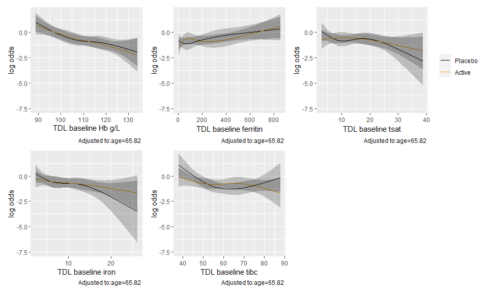
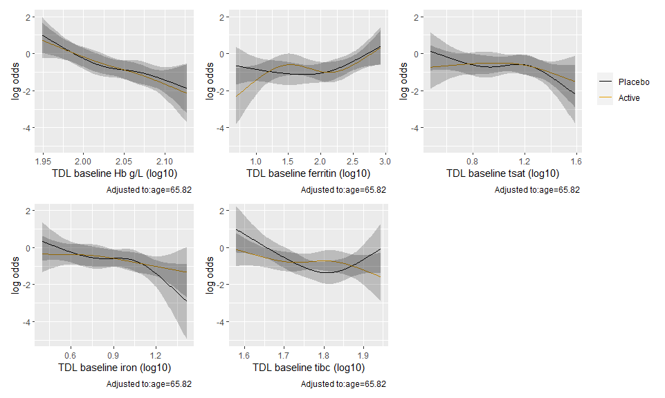
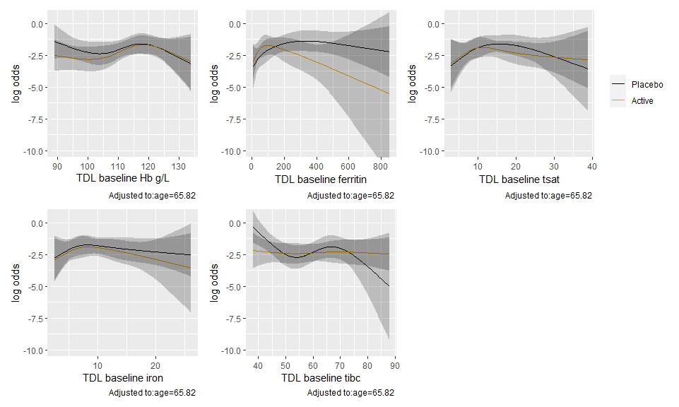
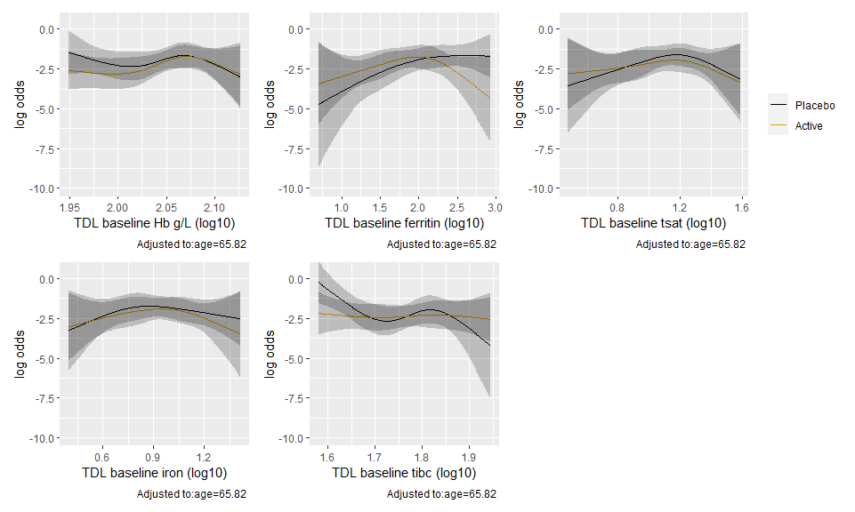
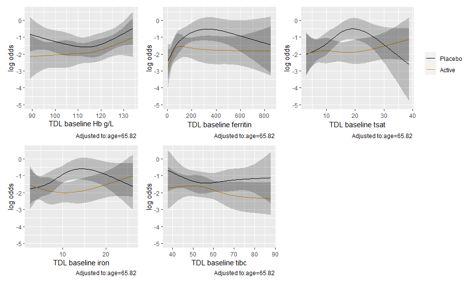
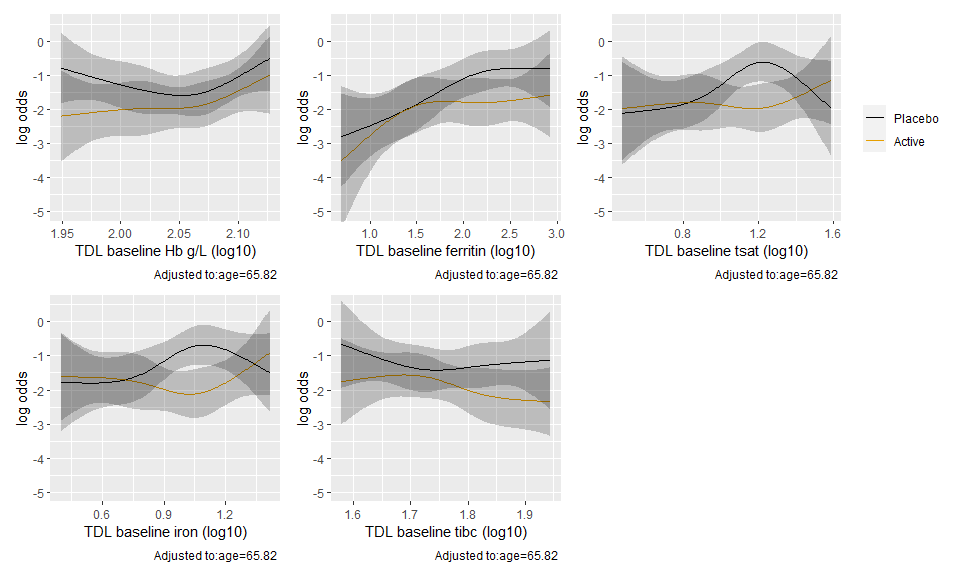
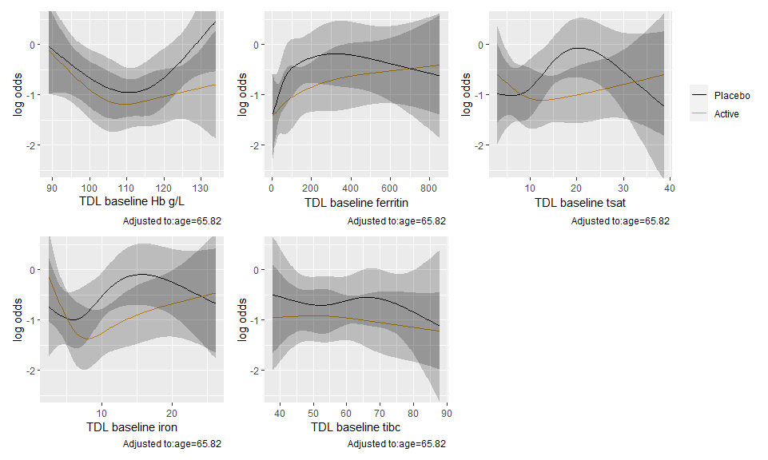

The original study was restricted to patients with anemia defined as Hb <= 130 for men or <= 120 for women. However, anemia can be caused by factors other than iron deficiency. Measures of ferritin and TSAT (which is a ratio of blood iron to total iron binding capacity) are generally accepted as better markers of actual iron deficiency, and thus more relevant to a trial where the intervention is iron infusion. However, the study wasn't able to measure these quickly enough, on-site, to facilitate patient enrollment onto the trial, so we are left analyzing the data after the fact to evaluate whether any impact of the intervention on outcomes would be different as a function of the degree of actual iron deficiency. We can similarly look at patient Hb response to iron in fusion. 


# HTE by baseline lab values 

## Binary outcomes

HTE was estimated using logistic regression models with an interaction between treatment arms and a given baseline lab value (one for each model). Lab values were modeled with restricted cublic splines with 4 knots, and each model is adjusted for age. 

### First co-primary outcome


Predicted outcomes from logistic regression models of the primary outcome with an interaction between treatment arm and a given baseline lab value. 


<!-- -->

Tests of the interactions


|lab_variable          |    P| Chi-Square| d.f.|
|:---------------------|----:|----------:|----:|
|TDL baseline Hb g/L   | 0.94|       0.41|    3|
|TDL baseline ferritin | 0.44|       2.70|    3|
|TDL baseline tsat     | 0.58|       1.99|    3|
|TDL baseline iron     | 0.63|       1.75|    3|
|TDL baseline tibc     | 0.10|       6.15|    3|

Now with logged values. 


<!-- -->


|lab_variable          |    P| Chi-Square| d.f.|
|:---------------------|----:|----------:|----:|
|TDL baseline Hb g/L   | 0.94|       0.40|    3|
|TDL baseline ferritin | 0.24|       4.17|    3|
|TDL baseline tsat     | 0.65|       1.62|    3|
|TDL baseline iron     | 0.49|       2.43|    3|
|TDL baseline tibc     | 0.08|       6.67|    3|

### CD grade III or above to discharge

<!-- -->


|lab_variable          |    P| Chi-Square| d.f.|
|:---------------------|----:|----------:|----:|
|TDL baseline Hb g/L   | 0.76|       1.15|    3|
|TDL baseline ferritin | 0.18|       4.90|    3|
|TDL baseline tsat     | 0.84|       0.82|    3|
|TDL baseline iron     | 0.98|       0.20|    3|
|TDL baseline tibc     | 0.23|       4.36|    3|

Now with logged values. 

<!-- -->


|lab_variable                  |    P| Chi-Square| d.f.|
|:-----------------------------|----:|----------:|----:|
|TDL baseline Hb g/L (log10)   | 0.74|       1.27|    3|
|TDL baseline ferritin (log10) | 0.21|       4.56|    3|
|TDL baseline tsat (log10)     | 0.93|       0.44|    3|
|TDL baseline iron (log10)     | 0.96|       0.28|    3|
|TDL baseline tibc (log10)     | 0.23|       4.32|    3|

### All cause mortality at 6 months

<!-- -->


|lab_variable          |    P| Chi-Square| d.f.|
|:---------------------|----:|----------:|----:|
|TDL baseline Hb g/L   | 0.80|       0.99|    3|
|TDL baseline ferritin | 0.41|       2.86|    3|
|TDL baseline tsat     | 0.40|       2.97|    3|
|TDL baseline iron     | 0.52|       2.27|    3|
|TDL baseline tibc     | 0.51|       2.32|    3|


Logged values

<!-- -->


|lab_variable                  |    P| Chi-Square| d.f.|
|:-----------------------------|----:|----------:|----:|
|TDL baseline Hb g/L (log10)   | 0.81|       0.95|    3|
|TDL baseline ferritin (log10) | 0.67|       1.56|    3|
|TDL baseline tsat (log10)     | 0.41|       2.86|    3|
|TDL baseline iron (log10)     | 0.55|       2.11|    3|
|TDL baseline tibc (log10)     | 0.52|       2.28|    3|


### Any readmission for complications - Discharge to 8 weeks

<!-- -->


|lab_variable          |    P| Chi-Square| d.f.|
|:---------------------|----:|----------:|----:|
|TDL baseline Hb g/L   | 0.74|       1.25|    3|
|TDL baseline ferritin | 0.54|       2.14|    3|
|TDL baseline tsat     | 0.11|       5.95|    3|
|TDL baseline iron     | 0.12|       5.83|    3|
|TDL baseline tibc     | 0.64|       1.67|    3|

Logged values

<!-- -->


|lab_variable                  |    P| Chi-Square| d.f.|
|:-----------------------------|----:|----------:|----:|
|TDL baseline Hb g/L (log10)   | 0.73|       1.32|    3|
|TDL baseline ferritin (log10) | 0.61|       1.82|    3|
|TDL baseline tsat (log10)     | 0.14|       5.53|    3|
|TDL baseline iron (log10)     | 0.10|       6.18|    3|
|TDL baseline tibc (log10)     | 0.61|       1.82|    3|


### Any readmission for complications - Discharge to 6 months

<!-- -->


|lab_variable          |    P| Chi-Square| d.f.|
|:---------------------|----:|----------:|----:|
|TDL baseline Hb g/L   | 0.61|       1.80|    3|
|TDL baseline ferritin | 0.74|       1.27|    3|
|TDL baseline tsat     | 0.19|       4.77|    3|
|TDL baseline iron     | 0.20|       4.70|    3|
|TDL baseline tibc     | 0.96|       0.31|    3|

Logged values

<!-- -->


|lab_variable                  |    P| Chi-Square| d.f.|
|:-----------------------------|----:|----------:|----:|
|TDL baseline Hb g/L (log10)   | 0.61|       1.80|    3|
|TDL baseline ferritin (log10) | 0.60|       1.86|    3|
|TDL baseline tsat (log10)     | 0.19|       4.78|    3|
|TDL baseline iron (log10)     | 0.14|       5.40|    3|
|TDL baseline tibc (log10)     | 0.97|       0.24|    3|


# End matter


```
## 
## System: Windows 10 x64 build 18363
## Nodename: DESKTOP-JKQ7LTN, User: Darren
## Total Memory: 16168 MB
## 
## R version 4.0.3 (2020-10-10) 
## x86_64-w64-mingw32/x64 (64-bit) 
## 
## Loaded Packages: 
##  patchwork (1.0.1), rms (6.0-1), SparseM (1.78), Hmisc (4.4-1), Formula (1.2-3), survival (3.2-7), lattice (0.20-41), knitr (1.30), viridis (0.5.1), viridisLite (0.3.0), forcats (0.5.0), stringr (1.4.0), dplyr (1.0.2), purrr (0.3.4), readr (1.4.0), tidyr (1.1.2), tibble (3.0.4), ggplot2 (3.3.2), tidyverse (1.3.0), descr (1.1.4), MASS (7.3-53), logbin (2.0.4)
```
