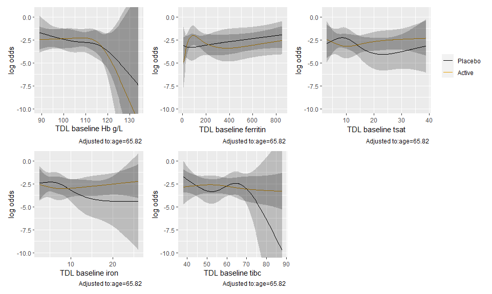
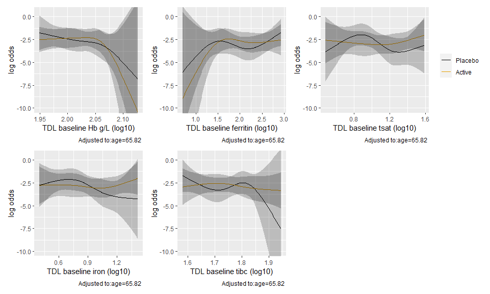
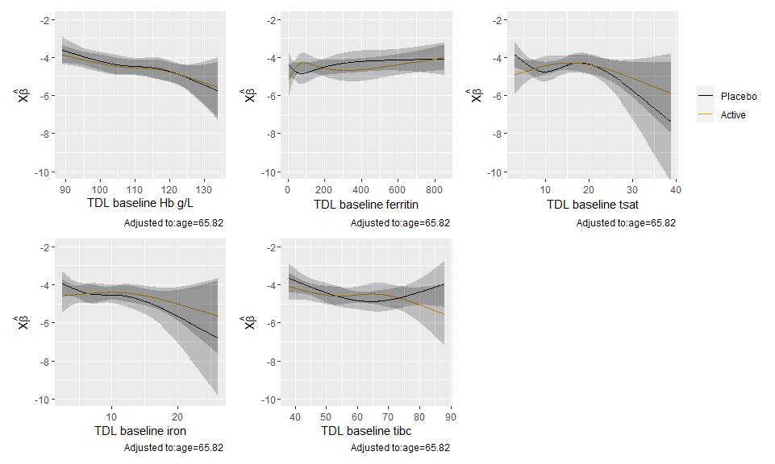

# HTE by baseline lab values 

## Binary outcomes

HTE was estimated using logistic regression models with an interaction between treatment arms and a given baseline lab value (one for each model). Lab values were modeled with restricted cubic splines with 4 knots, and each model is adjusted for age. 

Alternately, HTE was estimated using the same categorized versions of baseline ferritin, TSAT and their combinations (either low and both low), following what was previously done using log binomial models (**Original models**). 

### First co-primary outcome

#### Original models


|names                                                    |placebo      |active       |effect                        |    p|
|:--------------------------------------------------------|:------------|:------------|:-----------------------------|----:|
|tdl_ferritin_bl_cat_2 < 30                               |17/69 (25%)  |14/75 (19%)  |0.76 (0.4 to 1.42); p = 0.39  | 0.33|
|tdl_ferritin_bl_cat_2 30 - 100                           |17/63 (27%)  |20/53 (38%)  |1.4 (0.82 to 2.38); p = 0.22  | 0.33|
|tdl_ferritin_bl_cat_2 >= 100                             |32/98 (33%)  |31/94 (33%)  |1.01 (0.67 to 1.51); p = 0.96 | 0.33|
|tdl_tsat_bl_cat < 20                                     |55/174 (32%) |49/163 (30%) |0.95 (0.69 to 1.31); p = 0.76 | 0.13|
|tdl_tsat_bl_cat >= 20                                    |8/50 (16%)   |15/53 (28%)  |1.77 (0.82 to 3.81); p = 0.14 | 0.13|
|fer_tsat_or tdl_ferritin_bl < 100 OR tdl_tsat_bl < 20    |58/193 (30%) |53/176 (30%) |1 (0.73 to 1.37); p = 0.99    | 0.45|
|fer_tsat_or tdl_ferritin_bl >= 100 and tdl_tsat_bl >= 20 |7/35 (20%)   |12/43 (28%)  |1.4 (0.62 to 3.16); p = 0.42  | 0.45|
|fer_tsat_and tdl_ferritin_bl < 100 AND tdl_tsat_bl < 20  |31/113 (27%) |30/115 (26%) |0.95 (0.62 to 1.46); p = 0.82 | 0.49|
|fer_tsat_and tdl_ferritin_bl >= 100 or tdl_tsat_bl >= 20 |32/111 (29%) |34/101 (34%) |1.17 (0.78 to 1.74); p = 0.45 | 0.49|

These match almost exactly. The only difference is for the low tsat OR low ferritin subgroup. In the original analysis it looks like there are 5 individuals with a missing TSAT and a ferritin > 100 but that were counted as *low TSAT OR low ferritin*. 

#### New models


Predicted outcomes from logistic regression models of the primary outcome with an interaction between treatment arm and a given baseline lab value (modeled continuously with splines). 

<!-- -->

Tests of the interactions


|lab_variable          |    P| Chi-Square| d.f.|
|:---------------------|----:|----------:|----:|
|TDL baseline Hb g/L   | 0.94|       0.41|    3|
|TDL baseline ferritin | 0.44|       2.70|    3|
|TDL baseline tsat     | 0.58|       1.99|    3|
|TDL baseline iron     | 0.63|       1.75|    3|
|TDL baseline tibc     | 0.10|       6.15|    3|

Now with logged values. 


<!-- -->


|lab_variable          |    P| Chi-Square| d.f.|
|:---------------------|----:|----------:|----:|
|TDL baseline Hb g/L   | 0.94|       0.40|    3|
|TDL baseline ferritin | 0.24|       4.17|    3|
|TDL baseline tsat     | 0.65|       1.62|    3|
|TDL baseline iron     | 0.49|       2.43|    3|
|TDL baseline tibc     | 0.08|       6.67|    3|

### CD grade III or above to discharge

#### Original models


|names                                                    |placebo      |active       |effect                        |    p|
|:--------------------------------------------------------|:------------|:------------|:-----------------------------|----:|
|tdl_ferritin_bl_cat_2 < 30                               |2/65 (3%)    |4/73 (5%)    |1.78 (0.34 to 9.4); p = 0.5   | 0.03|
|tdl_ferritin_bl_cat_2 30 - 100                           |4/62 (6%)    |8/53 (15%)   |2.34 (0.75 to 7.34); p = 0.14 | 0.03|
|tdl_ferritin_bl_cat_2 >= 100                             |18/95 (19%)  |8/93 (9%)    |0.45 (0.21 to 0.99); p = 0.05 | 0.03|
|tdl_tsat_bl_cat < 20                                     |19/167 (11%) |17/161 (11%) |0.93 (0.5 to 1.72); p = 0.81  | 0.51|
|tdl_tsat_bl_cat >= 20                                    |5/49 (10%)   |3/52 (6%)    |0.57 (0.14 to 2.24); p = 0.42 | 0.51|
|fer_tsat_or tdl_ferritin_bl < 100 OR tdl_tsat_bl < 20    |19/185 (10%) |17/173 (10%) |0.96 (0.51 to 1.78); p = 0.89 | 0.37|
|fer_tsat_or tdl_ferritin_bl >= 100 and tdl_tsat_bl >= 20 |5/35 (14%)   |3/43 (7%)    |0.49 (0.13 to 1.9); p = 0.3   | 0.37|
|fer_tsat_and tdl_ferritin_bl < 100 AND tdl_tsat_bl < 20  |6/109 (6%)   |12/114 (11%) |1.91 (0.74 to 4.92); p = 0.18 | 0.02|
|fer_tsat_and tdl_ferritin_bl >= 100 or tdl_tsat_bl >= 20 |18/107 (17%) |8/99 (8%)    |0.48 (0.22 to 1.05); p = 0.07 | 0.02|

#### New models

Predicted outcomes from logistic regression models of the outcome with an interaction between treatment arm and a given baseline lab value (modeled continuously with splines). 

<!-- -->


|lab_variable          |    P| Chi-Square| d.f.|
|:---------------------|----:|----------:|----:|
|TDL baseline Hb g/L   | 0.76|       1.15|    3|
|TDL baseline ferritin | 0.18|       4.90|    3|
|TDL baseline tsat     | 0.84|       0.82|    3|
|TDL baseline iron     | 0.98|       0.20|    3|
|TDL baseline tibc     | 0.23|       4.36|    3|

Now with logged values. 

<!-- -->


|lab_variable                  |    P| Chi-Square| d.f.|
|:-----------------------------|----:|----------:|----:|
|TDL baseline Hb g/L (log10)   | 0.74|       1.27|    3|
|TDL baseline ferritin (log10) | 0.21|       4.56|    3|
|TDL baseline tsat (log10)     | 0.93|       0.44|    3|
|TDL baseline iron (log10)     | 0.96|       0.28|    3|
|TDL baseline tibc (log10)     | 0.23|       4.32|    3|

### All cause mortality at 6 months

#### Original models 


|names                                                    |placebo    |active     |effect                         |    p|
|:--------------------------------------------------------|:----------|:----------|:------------------------------|----:|
|tdl_ferritin_bl_cat_2 < 30                               |1/69 (1%)  |1/73 (1%)  |0.95 (0.06 to 14.82); p = 0.97 | 0.76|
|tdl_ferritin_bl_cat_2 30 - 100                           |3/62 (5%)  |5/54 (9%)  |1.91 (0.48 to 7.64); p = 0.36  | 0.76|
|tdl_ferritin_bl_cat_2 >= 100                             |6/98 (6%)  |6/96 (6%)  |1.02 (0.34 to 3.05); p = 0.97  | 0.76|
|tdl_tsat_bl_cat < 20                                     |9/173 (5%) |7/162 (4%) |0.83 (0.32 to 2.18); p = 0.71  | 0.11|
|tdl_tsat_bl_cat >= 20                                    |1/50 (2%)  |5/55 (9%)  |4.55 (0.55 to 37.59); p = 0.16 | 0.11|
|fer_tsat_or tdl_ferritin_bl < 100 OR tdl_tsat_bl < 20    |9/191 (5%) |7/175 (4%) |0.85 (0.32 to 2.23); p = 0.74  | 0.14|
|fer_tsat_or tdl_ferritin_bl >= 100 and tdl_tsat_bl >= 20 |1/36 (3%)  |5/45 (11%) |4 (0.49 to 32.71); p = 0.2     | 0.14|
|fer_tsat_and tdl_ferritin_bl < 100 AND tdl_tsat_bl < 20  |4/113 (4%) |6/114 (5%) |1.49 (0.43 to 5.13); p = 0.53  | 0.69|
|fer_tsat_and tdl_ferritin_bl >= 100 or tdl_tsat_bl >= 20 |6/110 (5%) |6/103 (6%) |1.07 (0.36 to 3.21); p = 0.91  | 0.69|

#### New models

Predicted outcomes from logistic regression models of the outcome with an interaction between treatment arm and a given baseline lab value (modeled continuously with splines). 

<!-- -->


|lab_variable          |    P| Chi-Square| d.f.|
|:---------------------|----:|----------:|----:|
|TDL baseline Hb g/L   | 0.80|       0.99|    3|
|TDL baseline ferritin | 0.41|       2.86|    3|
|TDL baseline tsat     | 0.40|       2.97|    3|
|TDL baseline iron     | 0.52|       2.27|    3|
|TDL baseline tibc     | 0.51|       2.32|    3|

Logged values

<!-- -->


|lab_variable                  |    P| Chi-Square| d.f.|
|:-----------------------------|----:|----------:|----:|
|TDL baseline Hb g/L (log10)   | 0.81|       0.95|    3|
|TDL baseline ferritin (log10) | 0.67|       1.56|    3|
|TDL baseline tsat (log10)     | 0.41|       2.86|    3|
|TDL baseline iron (log10)     | 0.55|       2.11|    3|
|TDL baseline tibc (log10)     | 0.52|       2.28|    3|


### Any readmission for complications - Discharge to 8 weeks

#### Original models


|names                                                    |placebo  |active   |effect                        |    p|
|:--------------------------------------------------------|:--------|:--------|:-----------------------------|----:|
|tdl_ferritin_bl_cat_2 < 30                               |/69 (%)  |/73 (%)  |0.83 (0.32 to 2.16); p = 0.7  | 0.20|
|tdl_ferritin_bl_cat_2 30 - 100                           |/61 (%)  |/50 (%)  |0.94 (0.45 to 1.96); p = 0.87 | 0.20|
|tdl_ferritin_bl_cat_2 >= 100                             |/97 (%)  |/96 (%)  |0.42 (0.23 to 0.77); p = 0.01 | 0.20|
|tdl_tsat_bl_cat < 20                                     |/171 (%) |/159 (%) |0.55 (0.33 to 0.92); p = 0.02 | 0.47|
|tdl_tsat_bl_cat >= 20                                    |/50 (%)  |/54 (%)  |0.77 (0.37 to 1.63); p = 0.5  | 0.47|
|fer_tsat_or tdl_ferritin_bl < 100 OR tdl_tsat_bl < 20    |/190 (%) |/171 (%) |0.67 (0.42 to 1.06); p = 0.09 | 0.32|
|fer_tsat_or tdl_ferritin_bl >= 100 and tdl_tsat_bl >= 20 |/35 (%)  |/45 (%)  |0.39 (0.15 to 1.03); p = 0.06 | 0.32|
|fer_tsat_and tdl_ferritin_bl < 100 AND tdl_tsat_bl < 20  |/111 (%) |/111 (%) |0.67 (0.34 to 1.32); p = 0.24 | 0.79|
|fer_tsat_and tdl_ferritin_bl >= 100 or tdl_tsat_bl >= 20 |/110 (%) |/102 (%) |0.59 (0.35 to 1); p = 0.05    | 0.79|

#### New models

Predicted outcomes from logistic regression models of the outcome with an interaction between treatment arm and a given baseline lab value (modeled continuously with splines).

<!-- -->


|lab_variable          |    P| Chi-Square| d.f.|
|:---------------------|----:|----------:|----:|
|TDL baseline Hb g/L   | 0.74|       1.25|    3|
|TDL baseline ferritin | 0.54|       2.14|    3|
|TDL baseline tsat     | 0.11|       5.95|    3|
|TDL baseline iron     | 0.12|       5.83|    3|
|TDL baseline tibc     | 0.64|       1.67|    3|

Logged values

<!-- -->


|lab_variable                  |    P| Chi-Square| d.f.|
|:-----------------------------|----:|----------:|----:|
|TDL baseline Hb g/L (log10)   | 0.73|       1.32|    3|
|TDL baseline ferritin (log10) | 0.61|       1.82|    3|
|TDL baseline tsat (log10)     | 0.14|       5.53|    3|
|TDL baseline iron (log10)     | 0.10|       6.18|    3|
|TDL baseline tibc (log10)     | 0.61|       1.82|    3|


### Any readmission for complications - Discharge to 6 months

#### Orignal models


|names                                                    |placebo  |active   |effect                        |    p|
|:--------------------------------------------------------|:--------|:--------|:-----------------------------|----:|
|tdl_ferritin_bl_cat_2 < 30                               |/66 (%)  |/68 (%)  |0.97 (0.49 to 1.94); p = 0.93 | 0.74|
|tdl_ferritin_bl_cat_2 30 - 100                           |/60 (%)  |/50 (%)  |0.82 (0.48 to 1.4); p = 0.47  | 0.74|
|tdl_ferritin_bl_cat_2 >= 100                             |/90 (%)  |/94 (%)  |0.71 (0.47 to 1.08); p = 0.11 | 0.74|
|tdl_tsat_bl_cat < 20                                     |/163 (%) |/153 (%) |0.77 (0.54 to 1.11); p = 0.16 | 0.69|
|tdl_tsat_bl_cat >= 20                                    |/47 (%)  |/53 (%)  |0.89 (0.5 to 1.57); p = 0.68  | 0.69|
|fer_tsat_or tdl_ferritin_bl < 100 OR tdl_tsat_bl < 20    |/181 (%) |/166 (%) |0.82 (0.58 to 1.15); p = 0.25 | 0.54|
|fer_tsat_or tdl_ferritin_bl >= 100 and tdl_tsat_bl >= 20 |/33 (%)  |/43 (%)  |0.65 (0.33 to 1.26); p = 0.2  | 0.54|
|fer_tsat_and tdl_ferritin_bl < 100 AND tdl_tsat_bl < 20  |/108 (%) |/105 (%) |0.79 (0.49 to 1.26); p = 0.32 | 0.90|
|fer_tsat_and tdl_ferritin_bl >= 100 or tdl_tsat_bl >= 20 |/102 (%) |/101 (%) |0.82 (0.55 to 1.22); p = 0.32 | 0.90|

#### New models

Predicted outcomes from logistic regression models of the outcome with an interaction between treatment arm and a given baseline lab value (modeled continuously with splines).

<!-- -->


|lab_variable          |    P| Chi-Square| d.f.|
|:---------------------|----:|----------:|----:|
|TDL baseline Hb g/L   | 0.61|       1.80|    3|
|TDL baseline ferritin | 0.74|       1.27|    3|
|TDL baseline tsat     | 0.19|       4.77|    3|
|TDL baseline iron     | 0.20|       4.70|    3|
|TDL baseline tibc     | 0.96|       0.31|    3|

Logged values

<!-- -->


|lab_variable                  |    P| Chi-Square| d.f.|
|:-----------------------------|----:|----------:|----:|
|TDL baseline Hb g/L (log10)   | 0.61|       1.80|    3|
|TDL baseline ferritin (log10) | 0.60|       1.86|    3|
|TDL baseline tsat (log10)     | 0.19|       4.78|    3|
|TDL baseline iron (log10)     | 0.14|       5.40|    3|
|TDL baseline tibc (log10)     | 0.97|       0.24|    3|

## Count outcomes

HTE was estimated using quasi-poisson models with an interaction between treatment arms and a given baseline lab value (one for each model). Lab values were modeled with restricted cubic splines with 4 knots, and each model is adjusted for age and an offset for time at risk when relevant.

Alternately, HTE was estimated using the same categorized versions of baseline ferritin, TSAT and their combinations (either low and both low), following what was previously done with negative binomial models (**Original models**). 

### Second primary outcome - Number of tranfusions at 30 days

#### Original models


|names                                                    |placebo   |active    |effect                        |    p|
|:--------------------------------------------------------|:---------|:---------|:-----------------------------|----:|
|tdl_ferritin_bl_cat_2 < 30                               |0.5 ± 1.1 |0.2 ± 0.5 |0.48 (0.21 to 1.07); p = 0.07 | 0.06|
|tdl_ferritin_bl_cat_2 30 - 100                           |0.4 ± 0.9 |0.7 ± 1.3 |1.56 (0.75 to 3.23); p = 0.23 | 0.06|
|tdl_ferritin_bl_cat_2 >= 100                             |0.5 ± 0.8 |0.5 ± 0.9 |1.07 (0.65 to 1.78); p = 0.78 | 0.06|
|tdl_tsat_bl_cat < 20                                     |0.5 ± 1   |0.5 ± 1   |0.92 (0.6 to 1.4); p = 0.7    | 0.29|
|tdl_tsat_bl_cat >= 20                                    |0.3 ± 0.7 |0.4 ± 0.7 |1.55 (0.63 to 3.8); p = 0.34  | 0.29|
|fer_tsat_or tdl_ferritin_bl < 100 OR tdl_tsat_bl < 20    |0.5 ± 1   |0.5 ± 1   |0.95 (0.63 to 1.43); p = 0.8  | 0.29|
|fer_tsat_or tdl_ferritin_bl >= 100 and tdl_tsat_bl >= 20 |0.3 ± 0.6 |0.4 ± 0.8 |1.72 (0.66 to 4.51); p = 0.27 | 0.29|
|fer_tsat_and tdl_ferritin_bl < 100 AND tdl_tsat_bl < 20  |0.5 ± 1   |0.4 ± 0.9 |0.88 (0.49 to 1.55); p = 0.65 | 0.51|
|fer_tsat_and tdl_ferritin_bl >= 100 or tdl_tsat_bl >= 20 |0.5 ± 0.8 |0.5 ± 0.9 |1.14 (0.69 to 1.89); p = 0.61 | 0.51|
 (30 day mortality offset makes this match original result)


#### New models

Predicted outcomes from quasi-Poison regression models of the outcome with an interaction between treatment arm and a given baseline lab value (modeled continuously with splines).

<!-- -->


|lab_variable          |    P| Chi-Square| d.f.|
|:---------------------|----:|----------:|----:|
|TDL baseline Hb g/L   | 0.98|       0.21|    3|
|TDL baseline ferritin | 0.24|       4.19|    3|
|TDL baseline tsat     | 0.28|       3.84|    3|
|TDL baseline iron     | 0.52|       2.24|    3|
|TDL baseline tibc     | 0.28|       3.82|    3|

<!-- -->

Logged values

<!-- -->


|lab_variable                  |    P| Chi-Square| d.f.|
|:-----------------------------|----:|----------:|----:|
|TDL baseline Hb g/L (log10)   | 0.95|       0.37|    3|
|TDL baseline ferritin (log10) | 0.25|       4.08|    3|
|TDL baseline tsat (log10)     | 0.46|       2.58|    3|
|TDL baseline iron (log10)     | 0.52|       2.28|    3|
|TDL baseline tibc (log10)     | 0.27|       3.89|    3|

### Units of blood to 30 days (excluding LBT)

#### Original models


|names                                                    |placebo   |active    |effect                        |    p|
|:--------------------------------------------------------|:---------|:---------|:-----------------------------|----:|
|tdl_ferritin_bl_cat_2 < 30                               |0.5 ± 1.1 |0.2 ± 0.5 |0.46 (0.19 to 1.11); p = 0.08 | 0.08|
|tdl_ferritin_bl_cat_2 30 - 100                           |0.4 ± 0.9 |0.7 ± 1.3 |1.55 (0.71 to 3.38); p = 0.27 | 0.08|
|tdl_ferritin_bl_cat_2 >= 100                             |0.5 ± 0.8 |0.5 ± 0.9 |1.08 (0.6 to 1.93); p = 0.8   | 0.08|
|tdl_tsat_bl_cat < 20                                     |0.5 ± 1   |0.5 ± 1   |0.92 (0.57 to 1.47); p = 0.72 | 0.31|
|tdl_tsat_bl_cat >= 20                                    |0.3 ± 0.7 |0.4 ± 0.7 |1.58 (0.58 to 4.26); p = 0.37 | 0.31|
|fer_tsat_or tdl_ferritin_bl < 100 OR tdl_tsat_bl < 20    |0.5 ± 1   |0.5 ± 1   |0.95 (0.6 to 1.5); p = 0.81   | 0.41|
|fer_tsat_or tdl_ferritin_bl >= 100 and tdl_tsat_bl >= 20 |0.3 ± 0.6 |0.4 ± 0.8 |1.54 (0.52 to 4.57); p = 0.44 | 0.41|
|fer_tsat_and tdl_ferritin_bl < 100 AND tdl_tsat_bl < 20  |0.5 ± 1   |0.4 ± 0.9 |0.84 (0.45 to 1.59); p = 0.6  | 0.43|
|fer_tsat_and tdl_ferritin_bl >= 100 or tdl_tsat_bl >= 20 |0.5 ± 0.8 |0.5 ± 0.9 |1.19 (0.67 to 2.12); p = 0.54 | 0.43|

#### New models

Predicted outcomes from logistic regression models of the outcome with an interaction between treatment arm and a given baseline lab value (modeled continuously with splines).

<!-- -->


|lab_variable          |    P| Chi-Square| d.f.|
|:---------------------|----:|----------:|----:|
|TDL baseline Hb g/L   | 0.99|       0.13|    3|
|TDL baseline ferritin | 0.13|       5.64|    3|
|TDL baseline tsat     | 0.21|       4.54|    3|
|TDL baseline iron     | 0.30|       3.66|    3|
|TDL baseline tibc     | 0.14|       5.45|    3|

Logged values

<!-- -->


|lab_variable                  |    P| Chi-Square| d.f.|
|:-----------------------------|----:|----------:|----:|
|TDL baseline Hb g/L (log10)   | 0.99|       0.13|    3|
|TDL baseline ferritin (log10) | 0.15|       5.32|    3|
|TDL baseline tsat (log10)     | 0.30|       3.64|    3|
|TDL baseline iron (log10)     | 0.29|       3.73|    3|
|TDL baseline tibc (log10)     | 0.14|       5.48|    3|


### Units of blood to 6 months (exluding LBT)

#### Original models


|names                                                    |placebo   |active    |effect                        |    p|
|:--------------------------------------------------------|:---------|:---------|:-----------------------------|----:|
|tdl_ferritin_bl_cat_2 < 30                               |0.5 ± 1.1 |0.2 ± 0.5 |0.61 (0.26 to 1.4); p = 0.24  | 0.24|
|tdl_ferritin_bl_cat_2 30 - 100                           |0.4 ± 0.9 |0.7 ± 1.3 |1.5 (0.68 to 3.29); p = 0.31  | 0.24|
|tdl_ferritin_bl_cat_2 >= 100                             |0.5 ± 0.8 |0.5 ± 0.9 |0.76 (0.43 to 1.35); p = 0.34 | 0.24|
|tdl_tsat_bl_cat < 20                                     |0.5 ± 1   |0.5 ± 1   |0.8 (0.5 to 1.27); p = 0.34   | 0.20|
|tdl_tsat_bl_cat >= 20                                    |0.3 ± 0.7 |0.4 ± 0.7 |1.55 (0.61 to 3.94); p = 0.35 | 0.20|
|fer_tsat_or tdl_ferritin_bl < 100 OR tdl_tsat_bl < 20    |0.5 ± 1   |0.5 ± 1   |0.84 (0.53 to 1.31); p = 0.44 | 0.36|
|fer_tsat_or tdl_ferritin_bl >= 100 and tdl_tsat_bl >= 20 |0.3 ± 0.6 |0.4 ± 0.8 |1.41 (0.5 to 3.96); p = 0.52  | 0.36|
|fer_tsat_and tdl_ferritin_bl < 100 AND tdl_tsat_bl < 20  |0.5 ± 1   |0.4 ± 0.9 |0.94 (0.51 to 1.73); p = 0.83 | 0.82|
|fer_tsat_and tdl_ferritin_bl >= 100 or tdl_tsat_bl >= 20 |0.5 ± 0.8 |0.5 ± 0.9 |0.85 (0.48 to 1.49); p = 0.57 | 0.82|

#### New models

Predicted outcomes from logistic regression models of the outcome with an interaction between treatment arm and a given baseline lab value (modeled continuously with splines).

<!-- -->


|lab_variable          |    P| Chi-Square| d.f.|
|:---------------------|----:|----------:|----:|
|TDL baseline Hb g/L   | 0.52|       2.27|    3|
|TDL baseline ferritin | 0.13|       5.67|    3|
|TDL baseline tsat     | 0.66|       1.58|    3|
|TDL baseline iron     | 0.54|       2.14|    3|
|TDL baseline tibc     | 0.14|       5.54|    3|

Logged values

<!-- -->


|lab_variable                  |    P| Chi-Square| d.f.|
|:-----------------------------|----:|----------:|----:|
|TDL baseline Hb g/L (log10)   | 0.64|       1.70|    3|
|TDL baseline ferritin (log10) | 0.10|       6.29|    3|
|TDL baseline tsat (log10)     | 0.64|       1.67|    3|
|TDL baseline iron (log10)     | 0.33|       3.46|    3|
|TDL baseline tibc (log10)     | 0.08|       6.62|    3|


# End matter


```
## 
## System: Windows 10 x64 build 18363
## Nodename: DESKTOP-JKQ7LTN, User: Darren
## Total Memory: 16168 MB
## 
## R version 4.0.3 (2020-10-10) 
## x86_64-w64-mingw32/x64 (64-bit) 
## 
## Loaded Packages: 
##  broom (0.7.1), patchwork (1.0.1), rms (6.0-1), SparseM (1.78), Hmisc (4.4-1), Formula (1.2-3), survival (3.2-7), lattice (0.20-41), knitr (1.30), viridis (0.5.1), viridisLite (0.3.0), forcats (0.5.0), stringr (1.4.0), dplyr (1.0.2), purrr (0.3.4), readr (1.4.0), tidyr (1.1.2), tibble (3.0.4), ggplot2 (3.3.2), tidyverse (1.3.0), descr (1.1.4), MASS (7.3-53), logbin (2.0.4)
```
