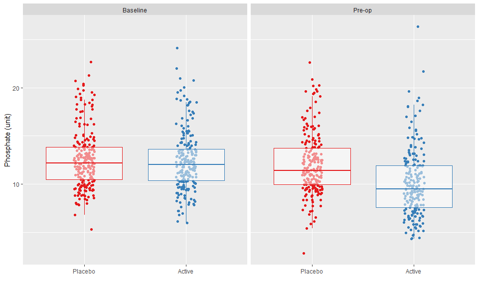
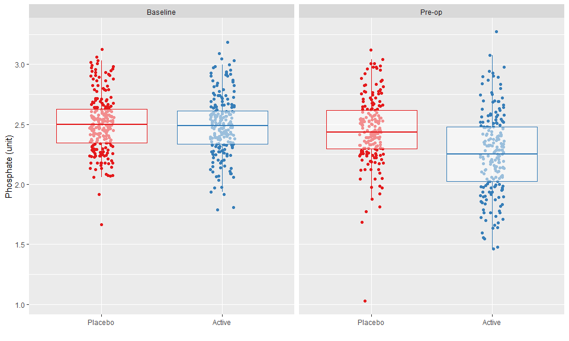
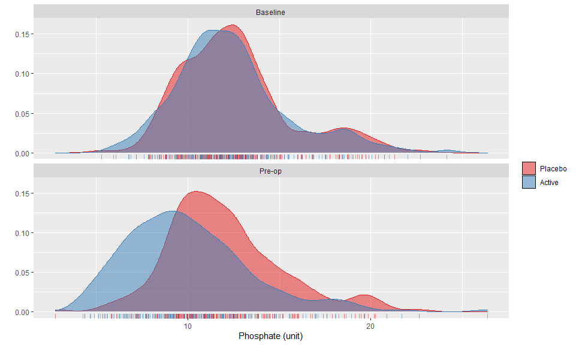
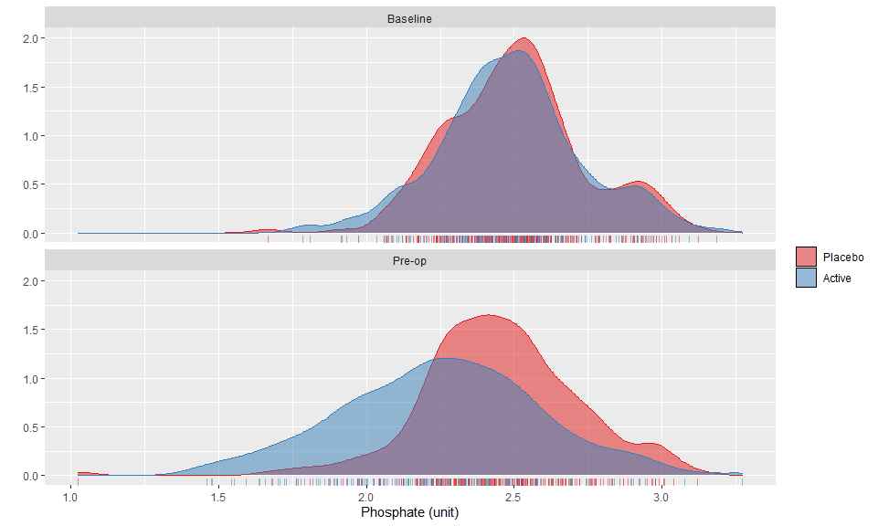

# Distribution of baseline and pre-op phosphate values by study arm

<!-- -->

Logged values

<!-- -->

<!-- -->

Logged values

<!-- -->


# End matter


```
## 
## System: Windows 10 x64 build 18363
## Nodename: DESKTOP-JKQ7LTN, User: Darren
## Total Memory: 16168 MB
## 
## R version 4.0.3 (2020-10-10) 
## x86_64-w64-mingw32/x64 (64-bit) 
## 
## Loaded Packages: 
##  sjPlot (2.8.5), rms (6.0-1), SparseM (1.78), Hmisc (4.4-1), Formula (1.2-3), survival (3.2-7), lattice (0.20-41), knitr (1.30), viridis (0.5.1), viridisLite (0.3.0), forcats (0.5.0), stringr (1.4.0), dplyr (1.0.2), purrr (0.3.4), readr (1.4.0), tidyr (1.1.2), tibble (3.0.4), ggplot2 (3.3.2), tidyverse (1.3.0), descr (1.1.4), MASS (7.3-53), logbin (2.0.4)
```


