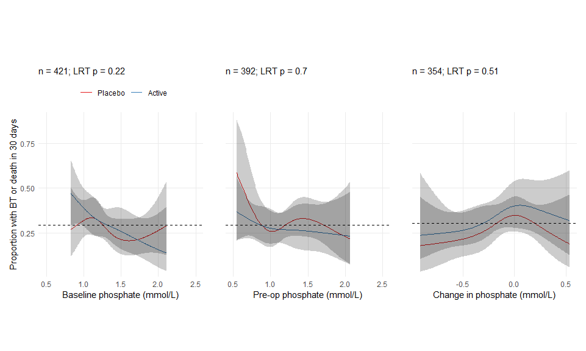

# Number of observations with phosphate values

In the ITT sample (n = 474), phosphate (mmol/L) was measured in 421 patients at baseline and 392 patients prior to their operation but after the intervention was administered (354 patients had phosphate measured at both time points and 15 had it measured at neither).  

<br>
<br>

# Impact of iron on phosphate values

Perhaps the most straightforward evidence of any effects of low phosphate (or lack thereof) are the main results of PREVENTT. Given that iron supplementation leads to substantial lowering of serum phosphate, but not to increased risk of adverse outcomes, it would be a stretch to conclude that lower serum phosphate was associated with increased risks (to say the least). 

By comparing baseline vs pre-op values in the control and active arms (below), we can clearly see that serum phosphate levels did drop substantially following iron supplementation. 

<br>
<br>

**Table: Distribution of serum phosphate measurement by study arm**


|Variable                           |Observations |Total            |Control        |Active            |
|:----------------------------------|:------------|:----------------|:--------------|:-----------------|
|Baseline phosphate (mmol/L)        |421          |1.3 [1.1, 1.4]   |1.3 [1.1, 1.5] |1.3 [1.1, 1.4]    |
|Baseline phosphate (log10(mmol/L)) |421          |0.1 [0, 0.2]     |0.1 [0, 0.2]   |0.1 [0, 0.2]      |
|Low baseline phospate              |421          |                 |               |                  |
|0.8+ mmol/L                        |             |413 (98.1%)      |218 (99.1%)    |195 (97%)         |
|< 0.8 mmol/L                       |             |8 (1.9%)         |2 (0.9%)       |6 (3%)            |
|Very low baseline phospate         |421          |                 |               |                  |
|0.65+ mmol/L                       |             |418 (99.3%)      |219 (99.5%)    |199 (99%)         |
|< 0.65 mmol/L                      |             |3 (0.7%)         |1 (0.5%)       |2 (1%)            |
|Baseline phosphate category        |421          |                 |               |                  |
|Normal (0.80+)                     |             |413 (98.1%)      |218 (99.1%)    |195 (97%)         |
|Mild [0.65 - 0.80)                 |             |5 (1.2%)         |1 (0.5%)       |4 (2%)            |
|Moderate [.32 - 0.65)              |             |3 (0.7%)         |1 (0.5%)       |2 (1%)            |
|Severe (< 0.32)                    |             |0 (0%)           |0 (0%)         |0 (0%)            |
|Pre-op phosphate (mmol/L)          |392          |1.1 [0.9, 1.3]   |1.2 [1, 1.4]   |1 [0.8, 1.3]      |
|Pre-op phosphate (log10(mmol/L))   |392          |0.1 [0, 0.1]     |0.1 [0, 0.2]   |0 [-0.1, 0.1]     |
|Low pre-op phospate                |392          |                 |               |                  |
|0.8+ mmol/L                        |             |332 (84.7%)      |189 (95.5%)    |143 (73.7%)       |
|< 0.8 mmol/L                       |             |60 (15.3%)       |9 (4.5%)       |51 (26.3%)        |
|Very low pre-op phospate           |392          |                 |               |                  |
|0.65+ mmol/L                       |             |368 (93.9%)      |194 (98%)      |174 (89.7%)       |
|< 0.65 mmol/L                      |             |24 (6.1%)        |4 (2%)         |20 (10.3%)        |
|Baseline phosphate category        |392          |                 |               |                  |
|Normal (0.80+)                     |             |332 (84.7%)      |189 (95.5%)    |143 (73.7%)       |
|Mild [0.65 - 0.80)                 |             |36 (9.2%)        |5 (2.5%)       |31 (16%)          |
|Moderate [.32 - 0.65)              |             |23 (5.9%)        |3 (1.5%)       |20 (10.3%)        |
|Severe (< 0.32)                    |             |1 (0.3%)         |1 (0.5%)       |0 (0%)            |
|Change in phosphate (mmol/L)       |354          |-0.1 [-0.4, 0.1] |0 [-0.2, 0.1]  |-0.3 [-0.5, -0.1] |
*Note: values are medians[IQR] or n(%)*

<br>
<br>

**Figure: Distributions of baseline and pre-operative phosphate values (mmol/L) by study arm.**

<!-- -->

<br>
<br>


Pre-operative phosphate levels were 0.21 mmol/L lower in the iron arm vs the placebo arm (-0.21 (-0.27 to -0.14); p = 0); meaning of course that the The odds of having a low serum phosphate (< 0.8 mmol/L) was higher in the active arm (OR 9.211 (4.25 to 19.94); p = 0). 

<br>
<br>

**Table: Effect of iron on phosphate levels (mmol/L) estimated by linear regression with adjustment for baseline phosphate.**

<table style="border-collapse:collapse; border:none;">
<tr>
<th style="border-top: double; text-align:center; font-style:normal; font-weight:bold; padding:0.2cm;  text-align:left; ">&nbsp;</th>
<th colspan="3" style="border-top: double; text-align:center; font-style:normal; font-weight:bold; padding:0.2cm; ">phos preop mmol L</th>
</tr>
<tr>
<td style=" text-align:center; border-bottom:1px solid; font-style:italic; font-weight:normal;  text-align:left; ">Predictors</td>
<td style=" text-align:center; border-bottom:1px solid; font-style:italic; font-weight:normal;  ">Estimates</td>
<td style=" text-align:center; border-bottom:1px solid; font-style:italic; font-weight:normal;  ">CI</td>
<td style=" text-align:center; border-bottom:1px solid; font-style:italic; font-weight:normal;  ">p</td>
</tr>
<tr>
<td style=" padding:0.2cm; text-align:left; vertical-align:top; text-align:left; ">(Intercept)</td>
<td style=" padding:0.2cm; text-align:left; vertical-align:top; text-align:center;  ">1.25</td>
<td style=" padding:0.2cm; text-align:left; vertical-align:top; text-align:center;  ">1.21&nbsp;&ndash;&nbsp;1.30</td>
<td style=" padding:0.2cm; text-align:left; vertical-align:top; text-align:center;  "><strong>&lt;0.001</td>
</tr>
<tr>
<td style=" padding:0.2cm; text-align:left; vertical-align:top; text-align:left; ">group [Active]</td>
<td style=" padding:0.2cm; text-align:left; vertical-align:top; text-align:center;  ">-0.21</td>
<td style=" padding:0.2cm; text-align:left; vertical-align:top; text-align:center;  ">-0.27&nbsp;&ndash;&nbsp;-0.14</td>
<td style=" padding:0.2cm; text-align:left; vertical-align:top; text-align:center;  "><strong>&lt;0.001</td>
</tr>
<tr>
<td style=" padding:0.2cm; text-align:left; vertical-align:top; text-align:left; ">mc(phos_bl_mmolL)</td>
<td style=" padding:0.2cm; text-align:left; vertical-align:top; text-align:center;  ">0.57</td>
<td style=" padding:0.2cm; text-align:left; vertical-align:top; text-align:center;  ">0.47&nbsp;&ndash;&nbsp;0.66</td>
<td style=" padding:0.2cm; text-align:left; vertical-align:top; text-align:center;  "><strong>&lt;0.001</td>
</tr>
<tr>
<td style=" padding:0.2cm; text-align:left; vertical-align:top; text-align:left; padding-top:0.1cm; padding-bottom:0.1cm; border-top:1px solid;">Observations</td>
<td style=" padding:0.2cm; text-align:left; vertical-align:top; padding-top:0.1cm; padding-bottom:0.1cm; text-align:left; border-top:1px solid;" colspan="3">354</td>
</tr>
<tr>
<td style=" padding:0.2cm; text-align:left; vertical-align:top; text-align:left; padding-top:0.1cm; padding-bottom:0.1cm;">R<sup>2</sup> / R<sup>2</sup> adjusted</td>
<td style=" padding:0.2cm; text-align:left; vertical-align:top; padding-top:0.1cm; padding-bottom:0.1cm; text-align:left;" colspan="3">0.324 / 0.320</td>
</tr>

</table>

<br>
<br>

**Table: Effect of iron on odds of low phosphate levels (< 0.8 mmol/L) estimated by logistic regression with adjustment for baseline phosphate.**

<table style="border-collapse:collapse; border:none;">
<tr>
<th style="border-top: double; text-align:center; font-style:normal; font-weight:bold; padding:0.2cm;  text-align:left; ">&nbsp;</th>
<th colspan="3" style="border-top: double; text-align:center; font-style:normal; font-weight:bold; padding:0.2cm; ">phos preop 8 mmol L</th>
</tr>
<tr>
<td style=" text-align:center; border-bottom:1px solid; font-style:italic; font-weight:normal;  text-align:left; ">Predictors</td>
<td style=" text-align:center; border-bottom:1px solid; font-style:italic; font-weight:normal;  ">Odds Ratios</td>
<td style=" text-align:center; border-bottom:1px solid; font-style:italic; font-weight:normal;  ">CI</td>
<td style=" text-align:center; border-bottom:1px solid; font-style:italic; font-weight:normal;  ">p</td>
</tr>
<tr>
<td style=" padding:0.2cm; text-align:left; vertical-align:top; text-align:left; ">(Intercept)</td>
<td style=" padding:0.2cm; text-align:left; vertical-align:top; text-align:center;  ">0.04</td>
<td style=" padding:0.2cm; text-align:left; vertical-align:top; text-align:center;  ">0.02&nbsp;&ndash;&nbsp;0.07</td>
<td style=" padding:0.2cm; text-align:left; vertical-align:top; text-align:center;  "><strong>&lt;0.001</td>
</tr>
<tr>
<td style=" padding:0.2cm; text-align:left; vertical-align:top; text-align:left; ">group [Active]</td>
<td style=" padding:0.2cm; text-align:left; vertical-align:top; text-align:center;  ">9.21</td>
<td style=" padding:0.2cm; text-align:left; vertical-align:top; text-align:center;  ">4.45&nbsp;&ndash;&nbsp;21.18</td>
<td style=" padding:0.2cm; text-align:left; vertical-align:top; text-align:center;  "><strong>&lt;0.001</td>
</tr>
<tr>
<td style=" padding:0.2cm; text-align:left; vertical-align:top; text-align:left; ">mc(phos_bl_mmolL)</td>
<td style=" padding:0.2cm; text-align:left; vertical-align:top; text-align:center;  ">0.06</td>
<td style=" padding:0.2cm; text-align:left; vertical-align:top; text-align:center;  ">0.02&nbsp;&ndash;&nbsp;0.20</td>
<td style=" padding:0.2cm; text-align:left; vertical-align:top; text-align:center;  "><strong>&lt;0.001</td>
</tr>
<tr>
<td style=" padding:0.2cm; text-align:left; vertical-align:top; text-align:left; padding-top:0.1cm; padding-bottom:0.1cm; border-top:1px solid;">Observations</td>
<td style=" padding:0.2cm; text-align:left; vertical-align:top; padding-top:0.1cm; padding-bottom:0.1cm; text-align:left; border-top:1px solid;" colspan="3">354</td>
</tr>
<tr>
<td style=" padding:0.2cm; text-align:left; vertical-align:top; text-align:left; padding-top:0.1cm; padding-bottom:0.1cm;">R<sup>2</sup> Tjur</td>
<td style=" padding:0.2cm; text-align:left; vertical-align:top; padding-top:0.1cm; padding-bottom:0.1cm; text-align:left;" colspan="3">0.195</td>
</tr>

</table>

<br>
<br>

Note: The number of observations for these two models was 354, since that was the number of patients who had phosphate measured at both baseline and pre-op The loss of sample will decrease the precision of the estimated between-arm difference in pre-op phosphate, but this is more than offset by the adjustment for baseline phosphate. 

# Associations between phosphate levels and outcomes

The advantage of the above reasoning (that there is unlikely to be a deleterious effect of low phosphate given there wasn't a deleterious effect of iron supplementation) is that we know that observed associations between study arm and outcomes are unbiased (i.e. not confounded) due to the randomization. This assumption doesn't necessarily hold if we look at associations between observed phosphate values and outcome, since there very well could be additional factors confounding those associations. Nonetheless, it's still probably worth looking at how phosphate levels are associated with outcomes. 

To help understand how phosphate levels might be associated with outcomes, we estimated those associations with the appropriate generalized linear model (depending on the outcome) that includes an interaction between study arm and phosphate levels, where the latter were modeled with restricted cubic splines (4 knots) to capture any non-linearities. Using these models, we can observe the arm specific predicted outcomes as a function of serum phosphate. Finally, we considered three different phosphate measures: baseline, pre-op, and the change between baseline and pre-op. 

<br>
<br>

## First co-primary outcome (death or BT in the first 30 days)

### Continuous phosphate

In the plots below, the dashed horizontal line reflects the marginal probability of the outcome in that analytic sample. The LRT p-value is a likelihood ratio test of the effect of phosphate. The red and blue lines reflect the arm-specific, non-linear associations between phosphate and the outcome, while the shaded areas reflect 95% CIs for those predicted outcomes. The underlying model for the first co-primary outcome was logistic regression. 


<!-- -->


### Categorized phosphate


<br>
<br>


|names                             |placebo      |active       |effect                                         | LRT P|
|:---------------------------------|:------------|:------------|:----------------------------------------------|-----:|
|phos_preop_8_mmolL 0.8+ mmol/L    |54/189 (29%) |38/143 (27%) |0.905 (0.56 to 1.47); p = 0.69                 |  0.35|
|phos_preop_8_mmolL < 0.8 mmol/L   |5/9 (56%)    |18/51 (35%)  |0.436 (0.1 to 1.83); p = 0.26                  |  0.35|
|phos_bl_8_mmolL 0.8+ mmol/L       |61/218 (28%) |59/195 (30%) |1.117 (0.73 to 1.71); p = 0.61                 |  0.80|
|phos_bl_8_mmolL < 0.8 mmol/L      |0/2 (0%)     |3/6 (50%)    |1468.981 (0 to 1.82989654237605e+26); p = 0.79 |  0.80|
|phos_preop_65_mmolL 0.65+ mmol/L  |57/194 (29%) |49/174 (28%) |0.942 (0.6 to 1.48); p = 0.8                   |  0.62|
|phos_preop_65_mmolL < 0.65 mmol/L |2/4 (50%)    |7/20 (35%)   |0.538 (0.06 to 4.69); p = 0.58                 |  0.62|
|phos_bl_65_mmolL 0.65+ mmol/L     |61/219 (28%) |61/199 (31%) |1.145 (0.75 to 1.75); p = 0.53                 |  0.80|
|phos_bl_65_mmolL < 0.65 mmol/L    |0/1 (0%)     |1/2 (50%)    |577.765 (0 to 1.96324168105179e+23); p = 0.79  |  0.80|

Effects are ORs from logistic regression models. There aren't enough observations in the arm-specific low phosphate groups at baseline to estimate those subgroup specific treatment effects which is why the estimates are so extreme. LRT P values are for the likelihood ratio test of the overall interaction. 


## Second co-primary outcome (number of BTs in the first 30 days)

Modeled with quasi-Poisson regression. 

### Continuous phosphate


<!-- -->

### Categorized phosphate


|names                             |placebo   |active    |effect                          | LRT P|
|:---------------------------------|:---------|:---------|:-------------------------------|-----:|
|phos_preop_8_mmolL 0.8+ mmol/L    |0.4 ± 0.7 |0.4 ± 0.9 |1.056 (0.69 to 1.62); p = 0.8   |  0.41|
|phos_preop_8_mmolL < 0.8 mmol/L   |0.8 ± 0.8 |0.5 ± 1   |0.651 (0.22 to 1.92); p = 0.44  |  0.41|
|phos_bl_8_mmolL 0.8+ mmol/L       |0.5 ± 0.9 |0.5 ± 0.9 |1.086 (0.73 to 1.62); p = 0.69  |  0.99|
|phos_bl_8_mmolL < 0.8 mmol/L      |0 ± 0     |0.5 ± 0.5 |118496732.931 (0 to Inf); p = 1 |  0.99|
|phos_preop_65_mmolL 0.65+ mmol/L  |0.4 ± 0.7 |0.4 ± 0.8 |1.028 (0.69 to 1.52); p = 0.89  |  0.95|
|phos_preop_65_mmolL < 0.65 mmol/L |0.8 ± 1   |0.7 ± 1.5 |0.973 (0.14 to 6.64); p = 0.98  |  0.95|
|phos_bl_65_mmolL 0.65+ mmol/L     |0.5 ± 0.9 |0.5 ± 0.9 |1.095 (0.74 to 1.63); p = 0.66  |  0.99|
|phos_bl_65_mmolL < 0.65 mmol/L    |0 ± NA    |0.5 ± 0.7 |116793179.217 (0 to Inf); p = 1 |  0.99|

Effects are IRRs from a quasipossion model. There aren't enough observations in the arm-specific low phosphate groups at baseline to estimate those subgroup specific treatment effects, which is why the estimates are so extreme. LRT P values are for the likelihood ratio test of the overall interaction. 


## Length of hospital stay

Modeled with linear regression on log-transformed hospital length of stay. 

### Continuous phosphate


<!-- -->

### Categorized phosphate


|names                             |placebo   |active    |effect                         | LRT P|
|:---------------------------------|:---------|:---------|:------------------------------|-----:|
|phos_preop_8_mmolL 0.8+ mmol/L    |0.4 ± 0.7 |0.4 ± 0.9 |1.105 (0.96 to 1.28); p = 0.18 |  0.95|
|phos_preop_8_mmolL < 0.8 mmol/L   |0.8 ± 0.8 |0.5 ± 1   |1.121 (0.71 to 1.76); p = 0.62 |  0.95|
|phos_bl_8_mmolL 0.8+ mmol/L       |0.5 ± 0.9 |0.5 ± 0.9 |1.094 (0.96 to 1.25); p = 0.19 |  0.37|
|phos_bl_8_mmolL < 0.8 mmol/L      |0 ± 0     |0.5 ± 0.5 |1.816 (1.01 to 3.26); p = 0.09 |  0.37|
|phos_preop_65_mmolL 0.65+ mmol/L  |0.4 ± 0.7 |0.4 ± 0.8 |1.068 (0.93 to 1.22); p = 0.34 |  0.04|
|phos_preop_65_mmolL < 0.65 mmol/L |0.8 ± 1   |0.7 ± 1.5 |2.263 (1.15 to 4.46); p = 0.03 |  0.04|
|phos_bl_65_mmolL 0.65+ mmol/L     |0.5 ± 0.9 |0.5 ± 0.9 |1.1 (0.96 to 1.26); p = 0.16   |  0.57|
|phos_bl_65_mmolL < 0.65 mmol/L    |0 ± NA    |0.5 ± 0.7 |1.773 (1.18 to 2.67); p = 0.22 |  0.57|

Effects are ratios of geometric means from log-linear models. LRT P values are for the likelihood ratio test of the overall interaction. 

There is a relatively small p-value (0.04) for the treatment by pre-op very low phosphate (<65mmolL) interaction. The nature of the interaction suggests that among patients with very low pre-op phosphate, length of stay was longer in the active arm compared to patients in the placebo arm. Here is a plot of those data. 

Figure: Distribution of log(hospital stay) in patients with very low pre-op phosphorous levels (< 0.65)

<!-- -->

So you can see that there are very few in the placebo group with phosphorous this low (since they didn't receive any iron supplementation), so this is very likely a spurious result. You can also see this between arm difference in the plot of the continuous interaction above, and of course the p-value for the same interaction, but modeled continuously, wasn't noteworthy.   

Here are the data in the entire study for comparison. 

<!-- -->


## Length of ITU stay

Modeled with quasi-Poisson regression. 

### Continuous phosphate


<!-- -->

### Cateogorical phosphate


|names                             |placebo   |active    |effect                          | LRT P|
|:---------------------------------|:---------|:---------|:-------------------------------|-----:|
|phos_preop_8_mmolL 0.8+ mmol/L    |0.4 ± 0.7 |0.4 ± 0.9 |1.507 (1.09 to 2.08); p = 0.01  |  0.89|
|phos_preop_8_mmolL < 0.8 mmol/L   |0.8 ± 0.8 |0.5 ± 1   |1.653 (0.5 to 5.47); p = 0.41   |  0.89|
|phos_bl_8_mmolL 0.8+ mmol/L       |0.5 ± 0.9 |0.5 ± 0.9 |1.38 (1.01 to 1.88); p = 0.04   |  0.99|
|phos_bl_8_mmolL < 0.8 mmol/L      |0 ± 0     |0.5 ± 0.5 |159839209.877 (0 to Inf); p = 1 |  0.99|
|phos_preop_65_mmolL 0.65+ mmol/L  |0.4 ± 0.7 |0.4 ± 0.8 |1.426 (1.05 to 1.93); p = 0.02  |  0.43|
|phos_preop_65_mmolL < 0.65 mmol/L |0.8 ± 1   |0.7 ± 1.5 |3.251 (0.36 to 29.19); p = 0.29 |  0.43|
|phos_bl_65_mmolL 0.65+ mmol/L     |0.5 ± 0.9 |0.5 ± 0.9 |1.391 (1.02 to 1.89); p = 0.03  |  1.00|
|phos_bl_65_mmolL < 0.65 mmol/L    |0 ± NA    |0.5 ± 0.7 |0.97 (0.02 to 62.13); p = 0.99  |  1.00|

Effects are IRRs from a quasipossion model. There aren't enough observations in the arm-specific low phosphate groups at baseline to estimate those subgroup specific treatment effects, which is why the estimates are so extreme. LRT P values are for the likelihood ratio test of the overall interaction. 


## Postoperative complications (grade 3+)

Modeled with logistic regression

### Continuous phosphate


<!-- -->

### Categorical phosphate


|names                             |placebo      |active      |effect                                        | LRT P|
|:---------------------------------|:------------|:-----------|:---------------------------------------------|-----:|
|phos_preop_8_mmolL 0.8+ mmol/L    |21/186 (11%) |13/143 (9%) |0.786 (0.38 to 1.63); p = 0.52                |  0.67|
|phos_preop_8_mmolL < 0.8 mmol/L   |1/9 (11%)    |7/50 (14%)  |1.302 (0.14 to 12.08); p = 0.82               |  0.67|
|phos_bl_8_mmolL 0.8+ mmol/L       |23/207 (11%) |15/187 (8%) |0.698 (0.35 to 1.38); p = 0.3                 |  0.83|
|phos_bl_8_mmolL < 0.8 mmol/L      |0/2 (0%)     |1/6 (17%)   |256.934 (0 to 1.04776617566949e+24); p = 0.83 |  0.83|
|phos_preop_65_mmolL 0.65+ mmol/L  |22/191 (12%) |16/173 (9%) |0.783 (0.4 to 1.54); p = 0.48                 |  0.82|
|phos_preop_65_mmolL < 0.65 mmol/L |0/4 (0%)     |4/20 (20%)  |675.543 (0 to 9.27080510829786e+24); p = 0.8  |  0.82|

Effects are ORs from logistic regression models. There aren't enough observations in some arm-specific low phosphate groups to estimate those subgroup specific treatment effects which is why the estimates are so extreme. There were no complications in either arm among those with very low phosphorous values (<0.65 mmolL) at baseline, so those figures are omitted from the table above. LRT P values are for the likelihood ratio test of the overall interaction. 


# End matter

## Estimated effect of iron on log(phosphate)

Due to skewness due to floor effects of phosphate measurements, we also estimimated the effect of iron supplementation on log transform pre-op phosphate levels. 

**Figure: Distributions of baseline and pre-operative phosphate values (log10(mmol/L)) by study arm.**

<!-- -->


**Table: Effect of iron on phosphate levels (log10(mmol/L)) estimated by linear regression with adjustment for baseline phosphate.**

<table style="border-collapse:collapse; border:none;">
<tr>
<th style="border-top: double; text-align:center; font-style:normal; font-weight:bold; padding:0.2cm;  text-align:left; ">&nbsp;</th>
<th colspan="3" style="border-top: double; text-align:center; font-style:normal; font-weight:bold; padding:0.2cm; ">phos preop 8 mmol L</th>
</tr>
<tr>
<td style=" text-align:center; border-bottom:1px solid; font-style:italic; font-weight:normal;  text-align:left; ">Predictors</td>
<td style=" text-align:center; border-bottom:1px solid; font-style:italic; font-weight:normal;  ">Odds Ratios</td>
<td style=" text-align:center; border-bottom:1px solid; font-style:italic; font-weight:normal;  ">CI</td>
<td style=" text-align:center; border-bottom:1px solid; font-style:italic; font-weight:normal;  ">p</td>
</tr>
<tr>
<td style=" padding:0.2cm; text-align:left; vertical-align:top; text-align:left; ">(Intercept)</td>
<td style=" padding:0.2cm; text-align:left; vertical-align:top; text-align:center;  ">0.04</td>
<td style=" padding:0.2cm; text-align:left; vertical-align:top; text-align:center;  ">0.02&nbsp;&ndash;&nbsp;0.07</td>
<td style=" padding:0.2cm; text-align:left; vertical-align:top; text-align:center;  "><strong>&lt;0.001</td>
</tr>
<tr>
<td style=" padding:0.2cm; text-align:left; vertical-align:top; text-align:left; ">group [Active]</td>
<td style=" padding:0.2cm; text-align:left; vertical-align:top; text-align:center;  ">9.21</td>
<td style=" padding:0.2cm; text-align:left; vertical-align:top; text-align:center;  ">4.45&nbsp;&ndash;&nbsp;21.18</td>
<td style=" padding:0.2cm; text-align:left; vertical-align:top; text-align:center;  "><strong>&lt;0.001</td>
</tr>
<tr>
<td style=" padding:0.2cm; text-align:left; vertical-align:top; text-align:left; ">mc(phos_bl_mmolL)</td>
<td style=" padding:0.2cm; text-align:left; vertical-align:top; text-align:center;  ">0.06</td>
<td style=" padding:0.2cm; text-align:left; vertical-align:top; text-align:center;  ">0.02&nbsp;&ndash;&nbsp;0.20</td>
<td style=" padding:0.2cm; text-align:left; vertical-align:top; text-align:center;  "><strong>&lt;0.001</td>
</tr>
<tr>
<td style=" padding:0.2cm; text-align:left; vertical-align:top; text-align:left; padding-top:0.1cm; padding-bottom:0.1cm; border-top:1px solid;">Observations</td>
<td style=" padding:0.2cm; text-align:left; vertical-align:top; padding-top:0.1cm; padding-bottom:0.1cm; text-align:left; border-top:1px solid;" colspan="3">354</td>
</tr>
<tr>
<td style=" padding:0.2cm; text-align:left; vertical-align:top; text-align:left; padding-top:0.1cm; padding-bottom:0.1cm;">R<sup>2</sup> Tjur</td>
<td style=" padding:0.2cm; text-align:left; vertical-align:top; padding-top:0.1cm; padding-bottom:0.1cm; text-align:left;" colspan="3">0.195</td>
</tr>

</table>


```
## 
## System: Windows 10 x64 build 18363
## Nodename: DESKTOP-JKQ7LTN, User: Darren
## Total Memory: 16168 MB
## 
## R version 4.0.3 (2020-10-10) 
## x86_64-w64-mingw32/x64 (64-bit) 
## 
## Loaded Packages: 
##  broom (0.7.1), patchwork (1.0.1), ggfortify (0.4.11), sjPlot (2.8.5), rms (6.0-1), SparseM (1.78), Hmisc (4.4-1), Formula (1.2-3), survival (3.2-7), lattice (0.20-41), knitr (1.30), viridis (0.5.1), viridisLite (0.3.0), forcats (0.5.0), stringr (1.4.0), dplyr (1.0.2), purrr (0.3.4), readr (1.4.0), tidyr (1.1.2), tibble (3.0.4), ggplot2 (3.3.2), tidyverse (1.3.0), descr (1.1.4), MASS (7.3-53), logbin (2.0.4)
```


