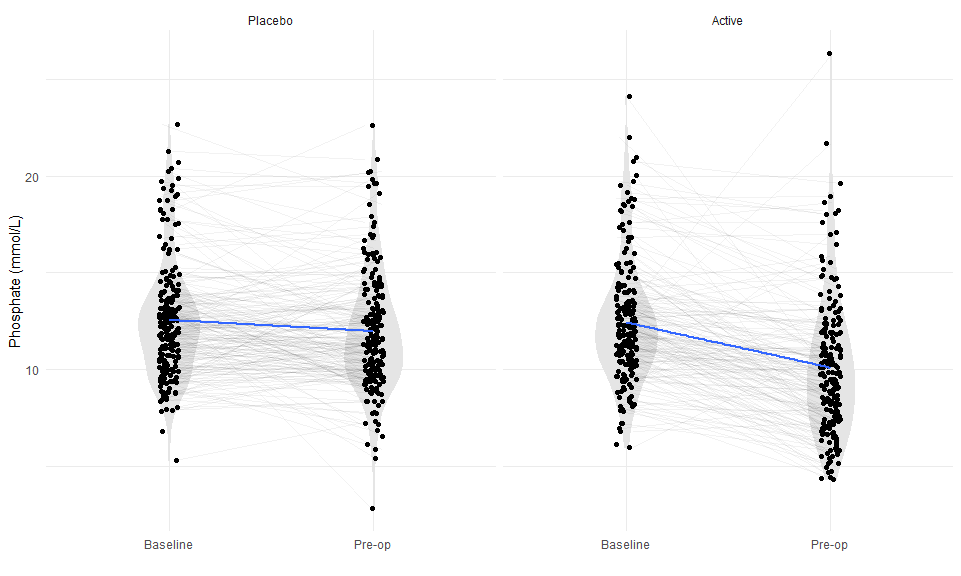

In the ITT sample (n = 474), phosphate (mmol/L) was measured in 421 patients at baseline and 392 patients prior to their operation but after the intervention was administered (354 patients had phosphate measured at both time points and 15 had it measured at neither).  


|Variable         | Observations|Total             |Control           |Active            |
|:----------------|------------:|:-----------------|:-----------------|:-----------------|
|phos_bl          |          421|12.1 [10.4, 13.8] |12.2 [10.4, 13.8] |12 [10.4, 13.6]   |
|log10_phos_bl    |          421|1.1 [1, 1.1]      |1.1 [1, 1.1]      |1.1 [1, 1.1]      |
|phos_preop       |          392|10.7 [8.9, 12.7]  |11.4 [9.9, 13.6]  |9.6 [7.6, 11.9]   |
|log10_phos_preop |          392|1 [0.9, 1.1]      |1.1 [1, 1.1]      |1 [0.9, 1.1]      |
|phos_chg         |          354|-1.1 [-3.8, 0.5]  |-0.4 [-2, 1.1]    |-2.6 [-4.5, -0.6] |


# Impact of iron on phosphate values. 

In the plot below, we can clearly see the average drop in phosphate levels in the iron arm. 

**Figure: Distributions of baseline and pre-operative phosphate values (mmol/L) by study arm.**

<!-- -->

**Table: Effect of iron on phosphate levels (mmol/L) estimated by linear regression with adjustment for baseline phosphate.**

<table style="border-collapse:collapse; border:none;">
<tr>
<th style="border-top: double; text-align:center; font-style:normal; font-weight:bold; padding:0.2cm;  text-align:left; ">&nbsp;</th>
<th colspan="3" style="border-top: double; text-align:center; font-style:normal; font-weight:bold; padding:0.2cm; ">phos preop</th>
</tr>
<tr>
<td style=" text-align:center; border-bottom:1px solid; font-style:italic; font-weight:normal;  text-align:left; ">Predictors</td>
<td style=" text-align:center; border-bottom:1px solid; font-style:italic; font-weight:normal;  ">Estimates</td>
<td style=" text-align:center; border-bottom:1px solid; font-style:italic; font-weight:normal;  ">CI</td>
<td style=" text-align:center; border-bottom:1px solid; font-style:italic; font-weight:normal;  ">p</td>
</tr>
<tr>
<td style=" padding:0.2cm; text-align:left; vertical-align:top; text-align:left; ">(Intercept)</td>
<td style=" padding:0.2cm; text-align:left; vertical-align:top; text-align:center;  ">11.89</td>
<td style=" padding:0.2cm; text-align:left; vertical-align:top; text-align:center;  ">11.47&nbsp;&ndash;&nbsp;12.31</td>
<td style=" padding:0.2cm; text-align:left; vertical-align:top; text-align:center;  "><strong>&lt;0.001</td>
</tr>
<tr>
<td style=" padding:0.2cm; text-align:left; vertical-align:top; text-align:left; ">group [Active]</td>
<td style=" padding:0.2cm; text-align:left; vertical-align:top; text-align:center;  ">-1.95</td>
<td style=" padding:0.2cm; text-align:left; vertical-align:top; text-align:center;  ">-2.56&nbsp;&ndash;&nbsp;-1.35</td>
<td style=" padding:0.2cm; text-align:left; vertical-align:top; text-align:center;  "><strong>&lt;0.001</td>
</tr>
<tr>
<td style=" padding:0.2cm; text-align:left; vertical-align:top; text-align:left; ">mc(phos_bl)</td>
<td style=" padding:0.2cm; text-align:left; vertical-align:top; text-align:center;  ">0.57</td>
<td style=" padding:0.2cm; text-align:left; vertical-align:top; text-align:center;  ">0.47&nbsp;&ndash;&nbsp;0.66</td>
<td style=" padding:0.2cm; text-align:left; vertical-align:top; text-align:center;  "><strong>&lt;0.001</td>
</tr>
<tr>
<td style=" padding:0.2cm; text-align:left; vertical-align:top; text-align:left; padding-top:0.1cm; padding-bottom:0.1cm; border-top:1px solid;">Observations</td>
<td style=" padding:0.2cm; text-align:left; vertical-align:top; padding-top:0.1cm; padding-bottom:0.1cm; text-align:left; border-top:1px solid;" colspan="3">354</td>
</tr>
<tr>
<td style=" padding:0.2cm; text-align:left; vertical-align:top; text-align:left; padding-top:0.1cm; padding-bottom:0.1cm;">R<sup>2</sup> / R<sup>2</sup> adjusted</td>
<td style=" padding:0.2cm; text-align:left; vertical-align:top; padding-top:0.1cm; padding-bottom:0.1cm; text-align:left;" colspan="3">0.324 / 0.320</td>
</tr>

</table>

Pre-operative phosphate levels were 1.95 mmol/L lower in the iron arm vs the placebo arm (95%CI -2.56 to -1.35). 


# Associations between phosphate levels and outcomes

## HTE by phosphate

### First co-primary outcome


<!-- -->

**LRTs for phosphate effects on the first co-primary outcome**


|var                                            | Chi-Square| d.f.|    P|
|:----------------------------------------------|----------:|----:|----:|
|Baseline phosphate (and higher order factors)  |       8.21|    6| 0.22|
|Pre-op phosphate (and higher order factors)    |       3.85|    6| 0.70|
|Change in phosphate (and higher order factors) |       5.28|    6| 0.51|
### Second co-primary outcome


<!-- -->

**LRTs for phosphate effects on the second co-primary outcome**


|var                                            | Chi-Square| d.f.|    P|
|:----------------------------------------------|----------:|----:|----:|
|Baseline phosphate (and higher order factors)  |       4.86|    6| 0.56|
|Pre-op phosphate (and higher order factors)    |       6.26|    6| 0.39|
|Change in phosphate (and higher order factors) |       3.30|    6| 0.77|

## Intrumental variable


# End matter

## Estimated effect of iron on log(phosphate)

Due to skewness due to floor effects of phosphate measurements, we also estimimated the effect of iron supplementation on log transform pre-op phosphate levels. 

**Figure: Distributions of baseline and pre-operative phosphate values (log10(mmol/L)) by study arm.**

<!-- -->


**Table: Effect of iron on phosphate levels (log10(mmol/L)) estimated by linear regression with adjustment for baseline phosphate.**

<table style="border-collapse:collapse; border:none;">
<tr>
<th style="border-top: double; text-align:center; font-style:normal; font-weight:bold; padding:0.2cm;  text-align:left; ">&nbsp;</th>
<th colspan="3" style="border-top: double; text-align:center; font-style:normal; font-weight:bold; padding:0.2cm; ">log 10(phos preop)</th>
</tr>
<tr>
<td style=" text-align:center; border-bottom:1px solid; font-style:italic; font-weight:normal;  text-align:left; ">Predictors</td>
<td style=" text-align:center; border-bottom:1px solid; font-style:italic; font-weight:normal;  ">Estimates</td>
<td style=" text-align:center; border-bottom:1px solid; font-style:italic; font-weight:normal;  ">CI</td>
<td style=" text-align:center; border-bottom:1px solid; font-style:italic; font-weight:normal;  ">p</td>
</tr>
<tr>
<td style=" padding:0.2cm; text-align:left; vertical-align:top; text-align:left; ">(Intercept)</td>
<td style=" padding:0.2cm; text-align:left; vertical-align:top; text-align:center;  ">1.06</td>
<td style=" padding:0.2cm; text-align:left; vertical-align:top; text-align:center;  ">1.04&nbsp;&ndash;&nbsp;1.08</td>
<td style=" padding:0.2cm; text-align:left; vertical-align:top; text-align:center;  "><strong>&lt;0.001</td>
</tr>
<tr>
<td style=" padding:0.2cm; text-align:left; vertical-align:top; text-align:left; ">group [Active]</td>
<td style=" padding:0.2cm; text-align:left; vertical-align:top; text-align:center;  ">-0.09</td>
<td style=" padding:0.2cm; text-align:left; vertical-align:top; text-align:center;  ">-0.11&nbsp;&ndash;&nbsp;-0.06</td>
<td style=" padding:0.2cm; text-align:left; vertical-align:top; text-align:center;  "><strong>&lt;0.001</td>
</tr>
<tr>
<td style=" padding:0.2cm; text-align:left; vertical-align:top; text-align:left; ">mc(phos_bl) [mc(log10]</td>
<td style=" padding:0.2cm; text-align:left; vertical-align:top; text-align:center;  ">0.62</td>
<td style=" padding:0.2cm; text-align:left; vertical-align:top; text-align:center;  ">0.50&nbsp;&ndash;&nbsp;0.73</td>
<td style=" padding:0.2cm; text-align:left; vertical-align:top; text-align:center;  "><strong>&lt;0.001</td>
</tr>
<tr>
<td style=" padding:0.2cm; text-align:left; vertical-align:top; text-align:left; padding-top:0.1cm; padding-bottom:0.1cm; border-top:1px solid;">Observations</td>
<td style=" padding:0.2cm; text-align:left; vertical-align:top; padding-top:0.1cm; padding-bottom:0.1cm; text-align:left; border-top:1px solid;" colspan="3">354</td>
</tr>
<tr>
<td style=" padding:0.2cm; text-align:left; vertical-align:top; text-align:left; padding-top:0.1cm; padding-bottom:0.1cm;">R<sup>2</sup> / R<sup>2</sup> adjusted</td>
<td style=" padding:0.2cm; text-align:left; vertical-align:top; padding-top:0.1cm; padding-bottom:0.1cm; text-align:left;" colspan="3">0.300 / 0.296</td>
</tr>

</table>

Pre-operative phosphate levels were 1.95 mmol/L lower in the iron arm vs the placebo arm (95%CI -2.56 to -1.35). 


## Regression diagnostics

### Baseline adjusted regression of pre-op phosphate on tx arm (m1)

<!-- -->

### Baseline adjusted regression of log10 pre-op phosphate on tx arm (m2)

<!-- -->


```
## 
## System: Windows 10 x64 build 18363
## Nodename: DESKTOP-JKQ7LTN, User: Darren
## Total Memory: 16168 MB
## 
## R version 4.0.3 (2020-10-10) 
## x86_64-w64-mingw32/x64 (64-bit) 
## 
## Loaded Packages: 
##  patchwork (1.0.1), ggfortify (0.4.11), sjPlot (2.8.5), rms (6.0-1), SparseM (1.78), Hmisc (4.4-1), Formula (1.2-3), survival (3.2-7), lattice (0.20-41), knitr (1.30), viridis (0.5.1), viridisLite (0.3.0), forcats (0.5.0), stringr (1.4.0), dplyr (1.0.2), purrr (0.3.4), readr (1.4.0), tidyr (1.1.2), tibble (3.0.4), ggplot2 (3.3.2), tidyverse (1.3.0), descr (1.1.4), MASS (7.3-53), logbin (2.0.4)
```


