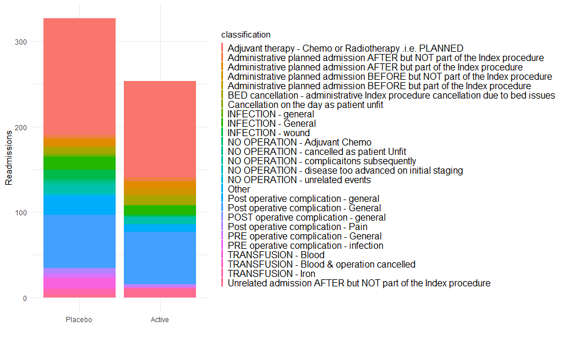
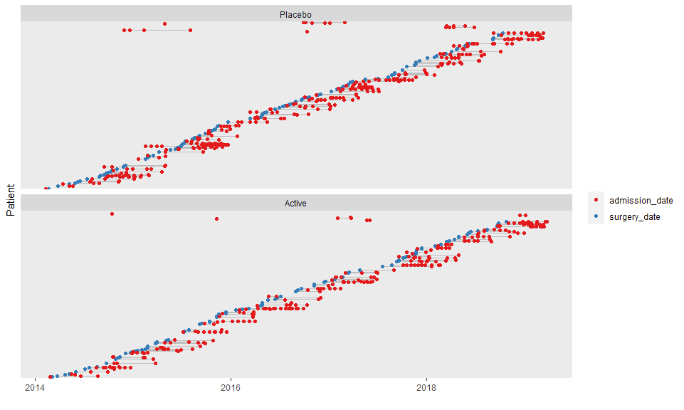
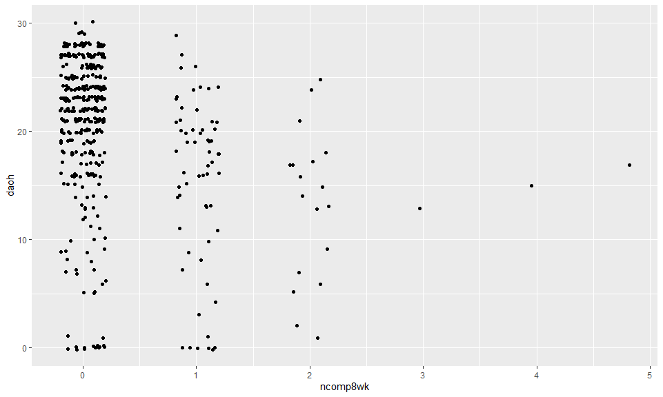
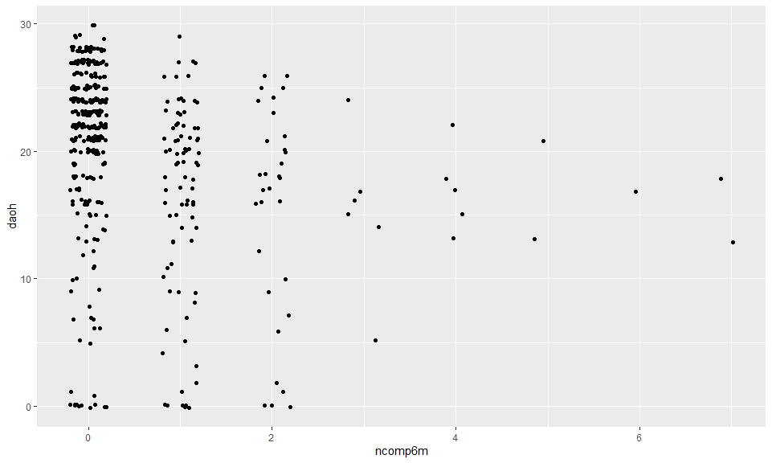

# Main trial results for readmissions and complications

## Readmission for complications (from the main paper)


|var         |Placebo         |Iron            |
|:-----------|:---------------|:---------------|
|8w n(%)     |51/234 (21.79%) |31/234 (13.25%) |
|Total count |71              |38              |
|6m n(%)     |73/223 (32.74%) |58/227 (25.55%) |
|Total count |130             |84              |

This table matches the original manuscript (but only if I *don't* restrict to the ITT sample). 


The model results at 8 weeks were RR 0.608 (0.4 to 0.91); p = 0.02 for any complications, and IRR 0.538 (0.34 to 0.85); p = 0.01 for the number of complications. The model results at 6 months were 0.781 (0.58 to 1.04); p = 0.1 for any complications, and 0.651 (0.45 to 0.95); p = 0.03 for the number of complications. **NOTE**: This all matches, expect the final model result, which is just slightly off (regardless of whether I use the ITT sample or not). 


## Any readmissions (not previously reported)


|var     |Placebo          |Iron            |
|:-------|:----------------|:---------------|
|8w n(%) |77/238 (32.35%)  |58/235 (24.68%) |
|6m n(%) |113/227 (49.78%) |97/230 (42.17%) |


The model results were RR 0.763 (0.57 to 1.02); p = 0.07 for any complications at 8weeks, and RR 0.847 (0.69 to 1.03); p = 0.1 at 6 months.

How do readmission for complications compare to all readmissions?

8 weeks:


```
##                comp8wk
## readmission_8wk   0   1
##             No  330   8
##             Yes  56  74
```

6 months:


```
##                comp6m
## readmission_6mo   0   1
##             No  245   2
##             Yes  74 129
```

For both 8 weeks and 6 months, you get cases that are flagged as readmitted for complications but not for any readmission (`readmission` = No and `comp` = 1). 


## Postoperative grade 3+ complications (main paper)


|var                                |Placebo         |Iron           |
|:----------------------------------|:---------------|:--------------|
|CD grade III or above to discharge |24/227 (10.57%) |22/233 (9.44%) |

The model result was 0.893 (0.52 to 1.55); p = 0.69. This all matches the main paper. 


## Postoperative worst grade complications (not previously reported)


|var                       |Placebo         |Iron            |
|:-------------------------|:---------------|:---------------|
|Worst grade, to discharge |88/227 (38.77%) |95/233 (40.77%) |

The model result was 1.052 (0.84 to 1.32); p = 0.66. 

# Exploring readmissions


There are 215 unique patient identifiers in the readmission data set, which includes information on 580 total readmissions. Among these, there were 350 reasons listed for readmission, indicating a need for thoughtful data cleaning. These were further categorized into 26 groups in the readmission data.  

<!-- -->


The main dataset included 135 patients with a readmission by 8 weeks postop and 247, 210. If we count the number of unique patient identifiers in the readmissions dataset, filtering out those readmissions falling after the relevant time point, those figures were 124 and 197, respectively (noting that this is before removing any of them based on their classification). 

Readmission time lines

<!-- -->


## Confirming days alive and out of hospital

The median length of stay in each arm was ~ 9 days. Readmissions were substantially different, especially when looking at the actual number of days readmitted. There is a small concern that the existing calculation of the days alive and out of hospital doesn’t seem to match up with the large observed difference in total days readmitted, so this needs to be closely checked. 

<!-- -->

<!-- -->


## Optimal length of follow-up for days alive and out of hospital

There is some contention around how many days of follow-up would be best to truly capture the impact of the intervention on the outcome days alive and out of hospital. Candidates include 30, 45 and 90 days. We should conduct a sensitivity analysis where we look at this in more detail as a continuous function of follow-up time.


```
## 
## System: Windows 10 x64 build 19042
## Nodename: DESKTOP-JKQ7LTN, User: Darren
## Total Memory: 16168 MB
## 
## R version 4.0.3 (2020-10-10) 
## x86_64-w64-mingw32/x64 (64-bit) 
## 
## Loaded Packages: 
##  broom (0.7.1), patchwork (1.0.1), ggfortify (0.4.11), sjPlot (2.8.5), rms (6.0-1), SparseM (1.78), Hmisc (4.4-1), Formula (1.2-3), survival (3.2-7), lattice (0.20-41), knitr (1.30), viridis (0.5.1), viridisLite (0.3.0), forcats (0.5.0), stringr (1.4.0), dplyr (1.0.2), purrr (0.3.4), readr (1.4.0), tidyr (1.1.2), tibble (3.0.4), ggplot2 (3.3.2), tidyverse (1.3.0), descr (1.1.4), MASS (7.3-53), logbin (2.0.4)
```


