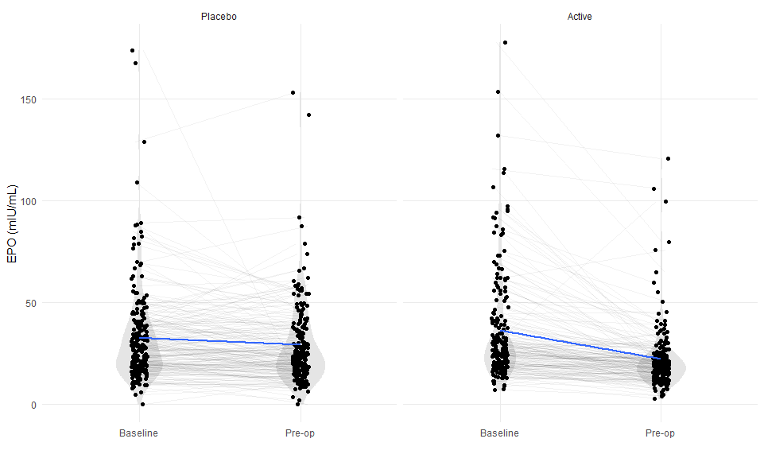
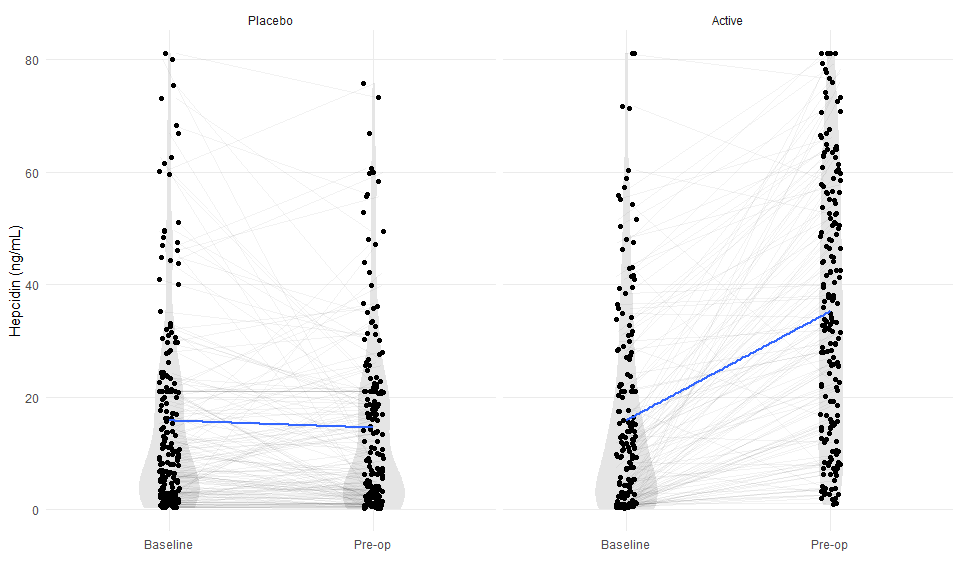
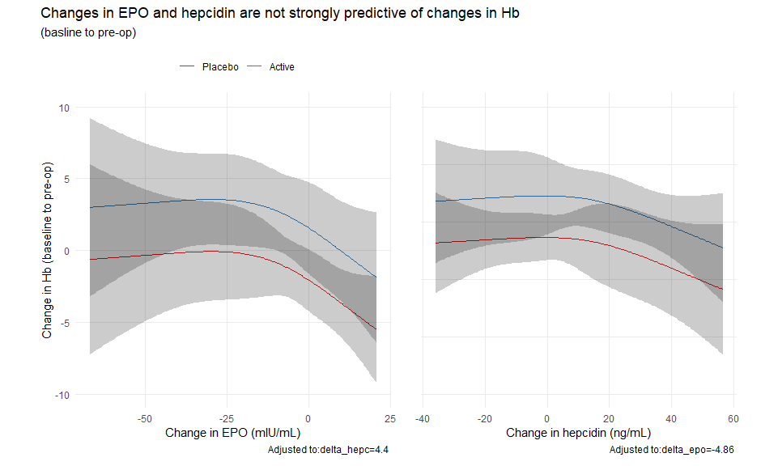
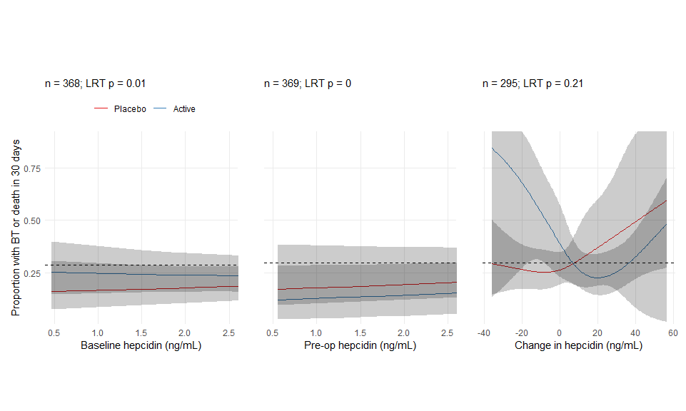
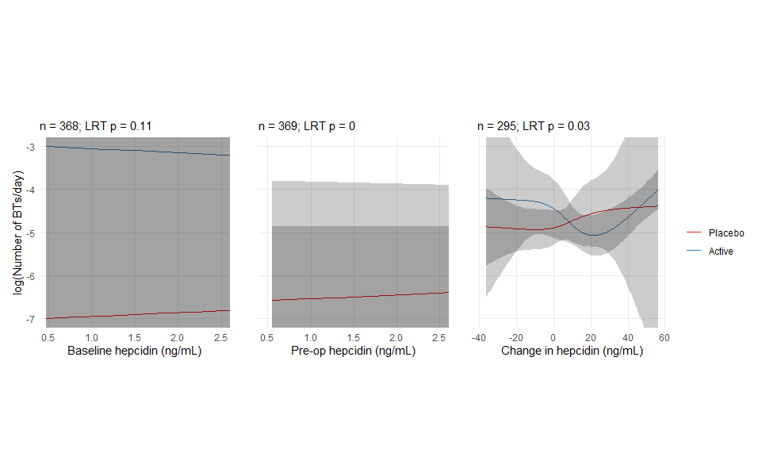
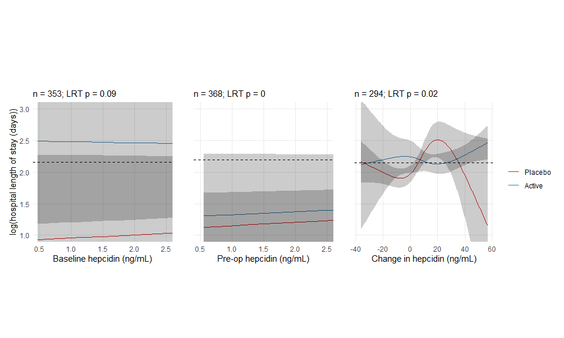
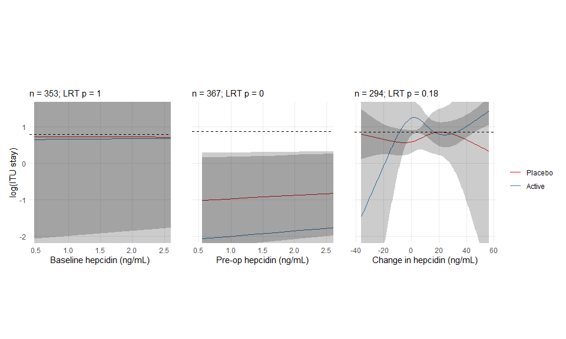
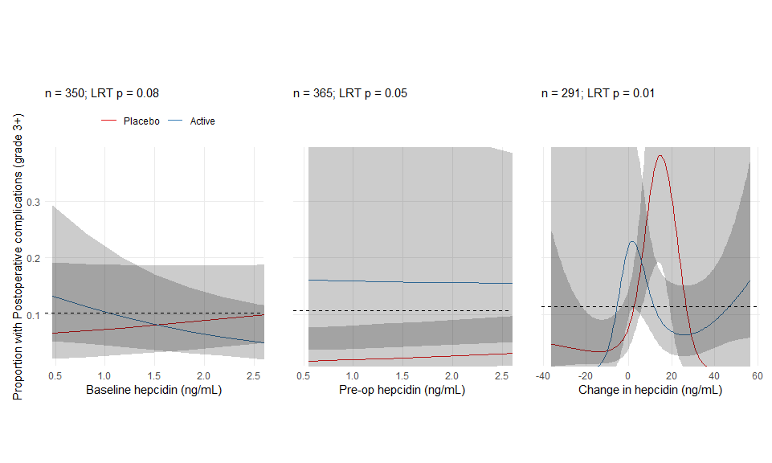

# Number of observations with EPO and hepcidin values at baseline and pre-op

In the ITT sample (n = 474), EPO (mIU/mL) was measured in 421 patients at baseline and 392 patients prior to their operation but after the intervention was administered (354 patients had EPO measured at both time points and 15 had it measured at neither).  

Hepcidin (ng/mL) was measured in 368 patients at baseline and 369 patients prior to their operation but after the intervention was administered (295 patients had EPO measured at both time points and 32 had it measured at neither).  

<br>
<br>

# Impact of iron (ITT) on EPO and hepcidin values

<br>
<br>

**Table: Distribution of EPO and hepcidin by study arm**


|Variable                     |Observations |Total             |Control           |Active             |
|:----------------------------|:------------|:-----------------|:-----------------|:------------------|
|Baseline EPO (mIU/mL)        |421          |27 [19, 39.9]     |27.2 [18.4, 38.7] |26.8 [20.3, 41.1]  |
|Baseline EPO (log10(mIU/mL)) |421          |1.4 [1.3, 1.6]    |1.4 [1.3, 1.6]    |1.4 [1.3, 1.6]     |
|Pre-op EPO (mIU/mL)          |392          |20.5 [15.2, 29.9] |23.8 [16.2, 37.6] |19 [14.1, 24.7]    |
|Pre-op EPO (log10(mIU/mL))   |392          |1.3 [1.2, 1.5]    |1.4 [1.2, 1.6]    |1.3 [1.1, 1.4]     |
|Change in EPO (mmol/L)       |354          |-4.9 [-13.1, 0.9] |-2 [-10.7, 3.5]   |-7.7 [-17.3, -3.1] |
|Baseline hepcidin (ng/mL)    |368          |9.8 [2.6, 21.8]   |9.6 [2.9, 21]     |10.1 [1.5, 22.3]   |
|Baseline hepcidin (ng/mL)    |368          |1 [0.4, 1.3]      |1 [0.5, 1.3]      |1 [0.2, 1.3]       |
|Pre-op hepcidin (ng/mL)      |369          |18.8 [5, 39.5]    |9 [2.4, 21]       |33.4 [15.1, 53.2]  |
|Pre-op hepcidin (ng/mL)      |369          |1.3 [0.7, 1.6]    |1 [0.4, 1.3]      |1.5 [1.2, 1.7]     |
|Change in hepcidin (ng/mL)   |295          |4.4 [-2.1, 18.5]  |-0.2 [-7.3, 3.4]  |18.6 [5.9, 33.7]   |
*Note: values are medians[IQR] or n(%)*

<br>
<br>

**Figure: Distributions of baseline and pre-operative EPO values (mIU/mL) by study arm.**

<!-- -->

<br>
<br>


Baseline adjusted pre-operative EPO levels were 7.53 mIU/mL lower in the iron arm vs the placebo arm (-7.53 (-10.44 to -4.61); p = 0). 

<br>
<br>

**Table: Effect of iron on EPO levels (mIU/mL) estimated by linear regression with adjustment for baseline EPO**

<table style="border-collapse:collapse; border:none;">
<tr>
<th style="border-top: double; text-align:center; font-style:normal; font-weight:bold; padding:0.2cm;  text-align:left; ">&nbsp;</th>
<th colspan="3" style="border-top: double; text-align:center; font-style:normal; font-weight:bold; padding:0.2cm; ">epo preop miuml</th>
</tr>
<tr>
<td style=" text-align:center; border-bottom:1px solid; font-style:italic; font-weight:normal;  text-align:left; ">Predictors</td>
<td style=" text-align:center; border-bottom:1px solid; font-style:italic; font-weight:normal;  ">Estimates</td>
<td style=" text-align:center; border-bottom:1px solid; font-style:italic; font-weight:normal;  ">CI</td>
<td style=" text-align:center; border-bottom:1px solid; font-style:italic; font-weight:normal;  ">p</td>
</tr>
<tr>
<td style=" padding:0.2cm; text-align:left; vertical-align:top; text-align:left; ">(Intercept)</td>
<td style=" padding:0.2cm; text-align:left; vertical-align:top; text-align:center;  ">29.36</td>
<td style=" padding:0.2cm; text-align:left; vertical-align:top; text-align:center;  ">27.35&nbsp;&ndash;&nbsp;31.37</td>
<td style=" padding:0.2cm; text-align:left; vertical-align:top; text-align:center;  "><strong>&lt;0.001</td>
</tr>
<tr>
<td style=" padding:0.2cm; text-align:left; vertical-align:top; text-align:left; ">group [Active]</td>
<td style=" padding:0.2cm; text-align:left; vertical-align:top; text-align:center;  ">-7.53</td>
<td style=" padding:0.2cm; text-align:left; vertical-align:top; text-align:center;  ">-10.45&nbsp;&ndash;&nbsp;-4.60</td>
<td style=" padding:0.2cm; text-align:left; vertical-align:top; text-align:center;  "><strong>&lt;0.001</td>
</tr>
<tr>
<td style=" padding:0.2cm; text-align:left; vertical-align:top; text-align:left; ">mc(epo_bl_miuml)</td>
<td style=" padding:0.2cm; text-align:left; vertical-align:top; text-align:center;  ">0.45</td>
<td style=" padding:0.2cm; text-align:left; vertical-align:top; text-align:center;  ">0.39&nbsp;&ndash;&nbsp;0.50</td>
<td style=" padding:0.2cm; text-align:left; vertical-align:top; text-align:center;  "><strong>&lt;0.001</td>
</tr>
<tr>
<td style=" padding:0.2cm; text-align:left; vertical-align:top; text-align:left; padding-top:0.1cm; padding-bottom:0.1cm; border-top:1px solid;">Observations</td>
<td style=" padding:0.2cm; text-align:left; vertical-align:top; padding-top:0.1cm; padding-bottom:0.1cm; text-align:left; border-top:1px solid;" colspan="3">354</td>
</tr>
<tr>
<td style=" padding:0.2cm; text-align:left; vertical-align:top; text-align:left; padding-top:0.1cm; padding-bottom:0.1cm;">R<sup>2</sup> / R<sup>2</sup> adjusted</td>
<td style=" padding:0.2cm; text-align:left; vertical-align:top; padding-top:0.1cm; padding-bottom:0.1cm; text-align:left;" colspan="3">0.403 / 0.400</td>
</tr>

</table>

<br>
<br>

**Figure: Distributions of baseline and pre-operative hepcidin values (ng/mL) by study arm.**

<!-- -->

<br>
<br>


Pre-operative hepcidin levels were 22.7 ng/mL higher in the iron arm vs the placebo arm (22.7 (19.08 to 26.32); p = 0). 

<br>
<br>

**Table: Effect of iron on hepcidin levels (ng/mL) estimated by linear regression with adjustment for baseline hepcidin**

<table style="border-collapse:collapse; border:none;">
<tr>
<th style="border-top: double; text-align:center; font-style:normal; font-weight:bold; padding:0.2cm;  text-align:left; ">&nbsp;</th>
<th colspan="3" style="border-top: double; text-align:center; font-style:normal; font-weight:bold; padding:0.2cm; ">hepc preop ngml</th>
</tr>
<tr>
<td style=" text-align:center; border-bottom:1px solid; font-style:italic; font-weight:normal;  text-align:left; ">Predictors</td>
<td style=" text-align:center; border-bottom:1px solid; font-style:italic; font-weight:normal;  ">Estimates</td>
<td style=" text-align:center; border-bottom:1px solid; font-style:italic; font-weight:normal;  ">CI</td>
<td style=" text-align:center; border-bottom:1px solid; font-style:italic; font-weight:normal;  ">p</td>
</tr>
<tr>
<td style=" padding:0.2cm; text-align:left; vertical-align:top; text-align:left; ">(Intercept)</td>
<td style=" padding:0.2cm; text-align:left; vertical-align:top; text-align:center;  ">13.29</td>
<td style=" padding:0.2cm; text-align:left; vertical-align:top; text-align:center;  ">10.84&nbsp;&ndash;&nbsp;15.74</td>
<td style=" padding:0.2cm; text-align:left; vertical-align:top; text-align:center;  "><strong>&lt;0.001</td>
</tr>
<tr>
<td style=" padding:0.2cm; text-align:left; vertical-align:top; text-align:left; ">group [Active]</td>
<td style=" padding:0.2cm; text-align:left; vertical-align:top; text-align:center;  ">22.70</td>
<td style=" padding:0.2cm; text-align:left; vertical-align:top; text-align:center;  ">19.06&nbsp;&ndash;&nbsp;26.33</td>
<td style=" padding:0.2cm; text-align:left; vertical-align:top; text-align:center;  "><strong>&lt;0.001</td>
</tr>
<tr>
<td style=" padding:0.2cm; text-align:left; vertical-align:top; text-align:left; ">mc(hepc_bl_ngml)</td>
<td style=" padding:0.2cm; text-align:left; vertical-align:top; text-align:center;  ">0.61</td>
<td style=" padding:0.2cm; text-align:left; vertical-align:top; text-align:center;  ">0.51&nbsp;&ndash;&nbsp;0.72</td>
<td style=" padding:0.2cm; text-align:left; vertical-align:top; text-align:center;  "><strong>&lt;0.001</td>
</tr>
<tr>
<td style=" padding:0.2cm; text-align:left; vertical-align:top; text-align:left; padding-top:0.1cm; padding-bottom:0.1cm; border-top:1px solid;">Observations</td>
<td style=" padding:0.2cm; text-align:left; vertical-align:top; padding-top:0.1cm; padding-bottom:0.1cm; text-align:left; border-top:1px solid;" colspan="3">295</td>
</tr>
<tr>
<td style=" padding:0.2cm; text-align:left; vertical-align:top; text-align:left; padding-top:0.1cm; padding-bottom:0.1cm;">R<sup>2</sup> / R<sup>2</sup> adjusted</td>
<td style=" padding:0.2cm; text-align:left; vertical-align:top; padding-top:0.1cm; padding-bottom:0.1cm; text-align:left;" colspan="3">0.493 / 0.490</td>
</tr>

</table>

<br>
<br>


# Associations between EPO, hepcidin and hemoglobin. 

Here we will just relate the change in EPO and hepcidin (baseline to pre-op) to corresponding changes in Hb, adjusted for trial arm. 


<!-- -->

These plots show the model-adjusted relationships between changes in EPO and hepcidin with changes in Hb (baseline to pre-op). The EPO and hepcidin effects are adjusted for one another, as well as for study arm. Potential non-linear effects were accommodated with restricted cubic splines. **Essentially what we see is that there is no relationship between changes in EPO or hepcidin with changes in Hb** (i.e. the red and blue lines move horizontally across the plot, and the 95% confidence regions overlap considerably). This is confirmed by the tests of these associations below. 


```
##                 Analysis of Variance          Response: tdl_hb_change 
## 
##  Factor          d.f. Partial SS MS        F    P     
##  group             1    470.4898 470.48978 4.18 0.0419
##  delta_hepc        3    298.9535  99.65117 0.88 0.4494
##   Nonlinear        2    161.1479  80.57395 0.72 0.4899
##  delta_epo         3    618.7157 206.23856 1.83 0.1417
##   Nonlinear        2    280.6539 140.32693 1.25 0.2893
##  TOTAL NONLINEAR   4    487.9426 121.98565 1.08 0.3652
##  REGRESSION        7   1775.1135 253.58765 2.25 0.0305
##  ERROR           276  31087.0696 112.63431
```

# Do EPO and/or hepcidin levels predict reponse to iron tx in key study outcomes?

To help understand how two biomarker levels, EPO and hepcidin, might be associated with outcomes, and perhaps even explain how study participants responded to iron supplementation, we fit outcome-appropriate generalized linear models that included an interaction between study arm and the two biomarker levels, where the latter were modeled with restricted cubic splines (4 knots) to capture any non-linearities. Using these models, we can observe the arm specific predicted outcomes as a function of the biomarkers. Finally, we considered three different biomarker measures: baseline, pre-op, and the change between baseline and pre-op; and estimated subgroups effects for patients with hepcidin < 20 ng/ml.  

<br>
<br>

## Hepcidin

### First co-primary outcome (death or BT in the first 30 days)

In the plots below, the dashed horizontal line reflects the marginal probability of the outcome in that analytic sample. The LRT p-value is a likelihood ratio test of the effect of hepcidin. The red and blue lines reflect the arm-specific, non-linear associations between hepcidin and the outcome, while the shaded areas reflect 95% CIs for those predicted outcomes. The underlying model for the first co-primary outcome was logistic regression. 


<!-- -->


#### Categorized hepcidin


<br>
<br>


|names                    |placebo      |active       |effect                         | LRT P|
|:------------------------|:------------|:------------|:------------------------------|-----:|
|hepc_preop_low 20+ ng/ml |21/52 (40%)  |39/126 (31%) |0.662 (0.34 to 1.29); p = 0.23 |  0.35|
|hepc_preop_low <20 ng/ml |34/134 (25%) |15/57 (26%)  |1.05 (0.52 to 2.13); p = 0.89  |  0.35|
|hepc_bl_low 20+ ng/ml    |23/63 (37%)  |22/53 (42%)  |1.234 (0.58 to 2.61); p = 0.58 |  0.96|
|hepc_bl_low <20 ng/ml    |30/135 (22%) |30/117 (26%) |1.207 (0.68 to 2.16); p = 0.53 |  0.96|

Effects are ORs from logistic regression models. LRT P values are for the likelihood ratio test of the overall interaction. 


### Second co-primary outcome (number of BTs in the first 30 days)

Modeled with quasi-Poisson regression. 

#### Continuous hepcidin


<!-- -->

#### Categorized hepcidin


|names                             |placebo   |active    |effect                          | LRT P|
|:---------------------------------|:---------|:---------|:-------------------------------|-----:|
|hepc_preop_low 20+ ng/ml          |0.6 ± 0.8 |0.5 ± 1   |0.832 (0.47 to 1.46); p = 0.52  |  0.51|
|hepc_preop_low <20 ng/ml          |0.4 ± 0.7 |0.4 ± 0.9 |1.105 (0.59 to 2.09); p = 0.76  |  0.51|
|hepc_bl_low 20+ ng/ml             |0.6 ± 0.9 |0.6 ± 1   |1.136 (0.63 to 2.05); p = 0.67  |  0.88|
|hepc_bl_low <20 ng/ml             |0.4 ± 0.9 |0.4 ± 0.9 |1.06 (0.57 to 1.96); p = 0.85   |  0.88|
|phos_preop_65_mmolL 0.65+ mmol/L  |0.4 ± 0.7 |0.4 ± 0.8 |1.028 (0.69 to 1.52); p = 0.89  |  0.95|
|phos_preop_65_mmolL < 0.65 mmol/L |0.8 ± 1   |0.7 ± 1.5 |0.973 (0.14 to 6.64); p = 0.98  |  0.95|
|phos_bl_65_mmolL 0.65+ mmol/L     |0.5 ± 0.9 |0.5 ± 0.9 |1.095 (0.74 to 1.63); p = 0.66  |  0.99|
|phos_bl_65_mmolL < 0.65 mmol/L    |0 ± NA    |0.5 ± 0.7 |116793179.217 (0 to Inf); p = 1 |  0.99|

Effects are IRRs from a quasipossion model. LRT P values are for the likelihood ratio test of the overall interaction. 


### Length of hospital stay

Modeled with linear regression on log-transformed hospital length of stay. 

#### Continuous hepcidin


<!-- -->

#### Categorized hepcidin


|names                             |placebo   |active    |effect                         | LRT P|
|:---------------------------------|:---------|:---------|:------------------------------|-----:|
|hepc_preop_low 20+ ng/ml          |0.6 ± 0.8 |0.5 ± 1   |1.043 (0.85 to 1.28); p = 0.68 |  0.70|
|hepc_preop_low <20 ng/ml          |0.4 ± 0.7 |0.4 ± 0.9 |1.106 (0.89 to 1.37); p = 0.36 |  0.70|
|hepc_bl_low 20+ ng/ml             |0.6 ± 0.9 |0.6 ± 1   |1.131 (0.89 to 1.44); p = 0.32 |  0.73|
|hepc_bl_low <20 ng/ml             |0.4 ± 0.9 |0.4 ± 0.9 |1.072 (0.9 to 1.27); p = 0.43  |  0.73|
|phos_preop_65_mmolL 0.65+ mmol/L  |0.4 ± 0.7 |0.4 ± 0.8 |1.068 (0.93 to 1.22); p = 0.34 |  0.04|
|phos_preop_65_mmolL < 0.65 mmol/L |0.8 ± 1   |0.7 ± 1.5 |2.263 (1.15 to 4.46); p = 0.03 |  0.04|
|phos_bl_65_mmolL 0.65+ mmol/L     |0.5 ± 0.9 |0.5 ± 0.9 |1.1 (0.96 to 1.26); p = 0.16   |  0.57|
|phos_bl_65_mmolL < 0.65 mmol/L    |0 ± NA    |0.5 ± 0.7 |1.773 (1.18 to 2.67); p = 0.22 |  0.57|

Effects are ratios of geometric means from log-linear models. LRT P values are for the likelihood ratio test of the overall interaction. 


### Length of ITU stay

Modeled with quasi-Poisson regression. 

#### Continuous hepcidin


<!-- -->

#### Cateogorical hepcidin


|names                             |placebo   |active    |effect                          | LRT P|
|:---------------------------------|:---------|:---------|:-------------------------------|-----:|
|hepc_preop_low 20+ ng/ml          |0.6 ± 0.8 |0.5 ± 1   |1.579 (0.98 to 2.55); p = 0.06  |  1.00|
|hepc_preop_low <20 ng/ml          |0.4 ± 0.7 |0.4 ± 0.9 |1.581 (1.01 to 2.48); p = 0.05  |  1.00|
|hepc_bl_low 20+ ng/ml             |0.6 ± 0.9 |0.6 ± 1   |1.151 (0.68 to 1.95); p = 0.6   |  0.53|
|hepc_bl_low <20 ng/ml             |0.4 ± 0.9 |0.4 ± 0.9 |1.436 (0.97 to 2.13); p = 0.07  |  0.53|
|phos_preop_65_mmolL 0.65+ mmol/L  |0.4 ± 0.7 |0.4 ± 0.8 |1.426 (1.05 to 1.93); p = 0.02  |  0.43|
|phos_preop_65_mmolL < 0.65 mmol/L |0.8 ± 1   |0.7 ± 1.5 |3.251 (0.36 to 29.19); p = 0.29 |  0.43|
|phos_bl_65_mmolL 0.65+ mmol/L     |0.5 ± 0.9 |0.5 ± 0.9 |1.391 (1.02 to 1.89); p = 0.03  |  1.00|
|phos_bl_65_mmolL < 0.65 mmol/L    |0 ± NA    |0.5 ± 0.7 |0.97 (0.02 to 62.13); p = 0.99  |  1.00|

Effects are IRRs from a quasipossion model. LRT P values are for the likelihood ratio test of the overall interaction. 


### Postoperative complications (grade 3+)

Modeled with logistic regression

#### Continuous hepcidin


<!-- -->

#### Categorical hepcidin


|names                             |placebo      |active       |effect                                       | LRT P|
|:---------------------------------|:------------|:------------|:--------------------------------------------|-----:|
|hepc_preop_low 20+ ng/ml          |8/50 (16%)   |12/125 (10%) |0.558 (0.21 to 1.46); p = 0.23               |  0.09|
|hepc_preop_low <20 ng/ml          |11/133 (8%)  |8/57 (14%)   |1.811 (0.69 to 4.77); p = 0.23               |  0.09|
|hepc_bl_low 20+ ng/ml             |4/57 (7%)    |8/51 (16%)   |2.465 (0.7 to 8.74); p = 0.16                |  0.06|
|hepc_bl_low <20 ng/ml             |16/130 (12%) |8/112 (7%)   |0.548 (0.23 to 1.33); p = 0.19               |  0.06|
|phos_preop_65_mmolL 0.65+ mmol/L  |22/191 (12%) |16/173 (9%)  |0.783 (0.4 to 1.54); p = 0.48                |  0.82|
|phos_preop_65_mmolL < 0.65 mmol/L |0/4 (0%)     |4/20 (20%)   |675.543 (0 to 9.27080510829786e+24); p = 0.8 |  0.82|

Effects are ORs from logistic regression models. LRT P values are for the likelihood ratio test of the overall interaction. 


# End matter


```
## 
## System: Windows 10 x64 build 18363
## Nodename: DESKTOP-JKQ7LTN, User: Darren
## Total Memory: 16168 MB
## 
## R version 4.0.3 (2020-10-10) 
## x86_64-w64-mingw32/x64 (64-bit) 
## 
## Loaded Packages: 
##  broom (0.7.1), patchwork (1.0.1), ggfortify (0.4.11), sjPlot (2.8.5), rms (6.0-1), SparseM (1.78), Hmisc (4.4-1), Formula (1.2-3), survival (3.2-7), lattice (0.20-41), knitr (1.30), viridis (0.5.1), viridisLite (0.3.0), forcats (0.5.0), stringr (1.4.0), dplyr (1.0.2), purrr (0.3.4), readr (1.4.0), tidyr (1.1.2), tibble (3.0.4), ggplot2 (3.3.2), tidyverse (1.3.0), descr (1.1.4), MASS (7.3-53), logbin (2.0.4)
```


